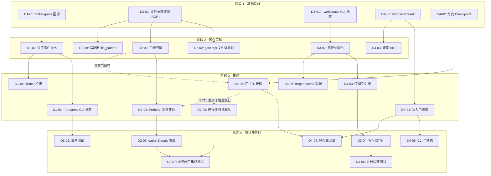
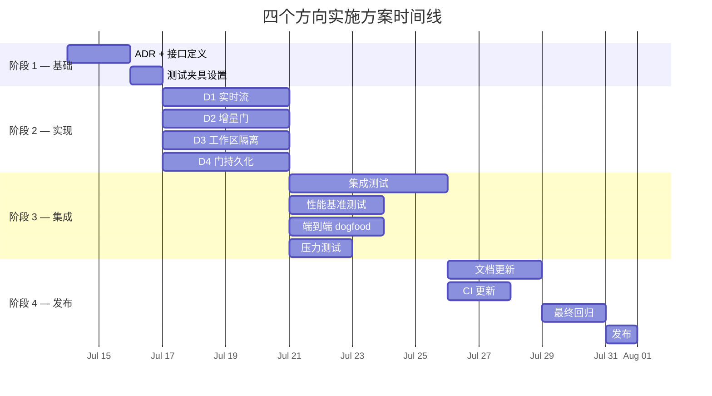

现在我已对该代码库有了透彻的理解，可以提供一份详细的技术主管分析。以下是我的分析：

---

# Tech Lead 分析：四个差异化方向的实现方案

## 执行摘要

分析文档通过代码证据正确识别了四个空白领域，并验证了它们在现有需求语料库中无重复。该代码库是一套成熟的编排系统（Go 运行时 + Node/Python harness，84 个 Go 源文件，13 个内部包），遵循严格的工程规范（文件 ≤500 行，函数 ≤50 行，零循环依赖，均通过静态检查执行）。

这四个方向横跨了从纯参数化（方向三·低风险）到重大基础设施变更（方向二·高风险）的范围。下方即为可操作的实施方案。

---

## 1. 任务分解

### 方向一 · 实时执行流（D1）

| 任务ID | 标题 | 涉及文件 | 前置依赖 | 预估工时 |
|--------|------|----------|----------|----------|
| D1-01 | 在 Engine 中添加 `OnProgress` 回调接口 | `internal/orchestrator/orchestrator.go`, `internal/orchestrator/executor.go` | 无 | 2h |
| D1-02 | 在 RunFrom 循环中发出结构化进度事件 | `internal/orchestrator/orchestrator.go`, `internal/orchestrator/loop.go` | D1-01 | 3h |
| D1-03 | 在 CLI 层实现 `--progress` 标志（管道方式） | `cmd/forge/engine_build.go`, `cmd/forge/evolve.go`, `cmd/forge/main.go` | D1-02 | 3h |
| D1-04 | 将 Tracer.Emit 桥接到实时消费者（可选流） | `internal/trace/trace.go` | D1-02 | 2h |
| D1-05 | 为结构化进度事件添加测试 | `internal/orchestrator/orchestrator_test.go`, `cmd/forge/main_test.go` | D1-03 | 3h |

**合计：~13h**

### 方向二 · 增量门执行（D2）

| 任务ID | 标题 | 涉及文件 | 前置依赖 | 预估工时 |
|--------|------|----------|----------|----------|
| D2-01 | 定义并文档化每门文件依赖模型（适配器架构的一部分） | `harness/adapters/`（适配器 .yml 模式变更）, `docs/adr/` | 无 | 4h |
| D2-02 | 在 gate.mjs 中实现文件级跳过机制（非仅目录） | `harness/gate.mjs` | D2-01 | 4h |
| D2-03 | 实现基于 mtime/hash 的门缓存层 | `internal/gate/cache.go` (新文件), `internal/gate/resolve.go` | D2-01 | 4h |
| D2-04 | 为 `ProbeAll` 添加增量变体（跳过未修改的检测器） | `internal/gate/gate.go` | D2-03 | 3h |
| D2-05 | 实现接受度框架的选择性测试发现 | `harness/acceptance.mjs`, `harness/acceptance-kernel.mjs` | D2-02, D2-04 | 4h |
| D2-06 | 汇聚层：将每门增量结果集成到 gatherSignals | `cmd/forge/gates.go`, `internal/converge/converge.go` | D2-04 | 3h |
| D2-07 | 为增量门执行添加集成测试 | `internal/gate/gate_test.go`, `harness/test_gate.mjs` | D2-05 | 4h |
| D2-08 | 更新适配器 YAML 模式以包含可选的 `file_pattern` | `harness/adapters/` (go.yml, python.yml, ts.yml) | D2-01 | 2h |

**合计：~28h**

### 方向三 · 工作区状态隔离（D3）

| 任务ID | 标题 | 涉及文件 | 前置依赖 | 预估工时 |
|--------|------|----------|----------|----------|
| D3-01 | 引入 `--workspace` CLI 标志并参数化 `forgeDir` | `cmd/forge/main.go`, `cmd/forge/evolve.go` | 无 | 2h |
| D3-02 | 参数化所有 `.forge/` 子路径（memory, checkpoint, trace） | `cmd/forge/evolve.go`, `cmd/forge/scorecard_wind.go`, `cmd/forge/preflight.go` | D3-01 | 3h |
| D3-03 | 将 workspace 传播到子引擎（orchestrator, loop） | `internal/orchestrator/orchestrator.go`, `internal/orchestrator/loop.go` | D3-02 | 2h |
| D3-04 | 验证隔离：跨写入器的互斥锁/防护 | `cmd/forge/engine_build.go`, `internal/persist/checkpoint.go` | D3-03 | 2h |
| D3-05 | 测试：两个并行 workspace 不互相干扰 | `cmd/forge/evolve_test.go`, `cmd/forge/main_test.go` | D3-04 | 2h |
| D3-06 | 更新 `forge resume` 以配合 workspace 参数化 | `cmd/forge/evolve.go` | D3-03 | 1h |

**合计：~12h**

### 方向四 · 门结果持久化（D4）

| 任务ID | 标题 | 涉及文件 | 前置依赖 | 预估工时 |
|--------|------|----------|----------|----------|
| D4-01 | 向 memory 包添加 `KindGateResult` | `internal/memory/memory.go` | 无 | 2h |
| D4-02 | 扩展 Checkpoint 以存储每门详情（不仅仅是 boolean） | `internal/persist/checkpoint.go` | 无 | 3h |
| D4-03 | 实现门结果存储的查询/读取 API | `internal/memory/memory.go`, `internal/memory/memory_test.go` | D4-01 | 2h |
| D4-04 | 连接：在每次门执行后写入门结果 | `cmd/forge/gates.go`, `internal/orchestrator/orchestrator.go` | D4-01 | 3h |
| D4-05 | 添加跨会话门 TTL 和过期间逻辑 | `internal/gate/cache.go` (与 D2-03 共享) | D4-02 | 3h |
| D4-06 | 在 CLI 报告中暴露最近的门结果（`forge gate status`） | `cmd/forge/gates.go`, `cmd/forge/approve.go` | D4-04 | 2h |
| D4-07 | 为门结果持久化添加测试 | `internal/memory/memory_test.go`, `internal/persist/checkpoint_test.go` | D4-04 | 2h |

**合计：~17h**

---

## 2. 执行顺序



### 可并行执行的任务组

| 组 | 任务 | 理由 |
|------|------|-------|
| **G1** | D1-01, D2-01, D3-01, D4-01, D4-02 | 全部为独立设计决策：无共享代码 |
| **G2** | D1-02, D2-02+D2-03, D3-02, D4-03 | G1 的第二层依赖；方向间无交叉 |
| **G3** | D1-03+D1-04, D2-04+D2-05, D3-03+D3-06, D4-04 | 合并到现有 CLI/引擎代码中 |
| **G4** | D1-05, D2-06+D2-07, D3-04+D3-05, D4-06+D4-07 | 最后的测试 + 报告表面 |

**关键见解**：方向二（增量门）与方向四（门持久化）通过 D2-03/D4-05（共享缓存层）存在交叉。这些必须在单个 Sprint 内由同一个人实现，或通过清晰的接口契约仔细协调。

---

## 3. 技术风险

### 风险矩阵

| # | 风险 | 方向 | 可能性 | 影响 | 缓解措施 |
|---|------|--------|------------|--------|-------------|
| R1 | **增量门依赖模型难以推广**：一个门依赖于什么没有普遍规则。例如：`lint` 依赖于 `.eslintrc` + `src/` 中的文件；`test` 依赖于 `tests/` 中的所有内容 + 被测试的源。一个薄模型会返回错误的缓存命中。 | D2 | 高 | 高 | 采用模块级（而不是文件级）跟踪。从每个适配器声明的显式 glob 开始（D2-08），然后根据需要收紧。失败模式保守：不确定时，重新运行。 |
| R2 | **工作区隔离导致磁盘空间膨胀**：如果有 N 个并行 workspace，每个都需要完整的 `.forge/` 状态（memory, checkpoint, trace, scorecards）。大型 `.forge/` 目录会重复 N 次。 | D3 | 中 | 中 | 对 checkpoint 和 memory 使用硬链接/符号链接，这是只读的。仅隔离可变状态（trace、正在进行的 checkpoint）。记录默认的最大工作区数量。 |
| R3 | **门结果持久化与 Checkpoint 语义冲突**：当前 Checkpoint 是每个迭代的。如果门结果从跨会话缓存加载，它们可能引用的是已被后续迭代中代码更改淘汰的旧门状态。 | D4 | 中 | 高 | 为每个门结果附加文件哈希或 git tree-ish。加载时，将当前文件状态与存储的哈希进行比较。不匹配 → 缓存失效。 |
| R4 | **OnProgress 回调引入竞态条件**：如果 progress 回调发出事件，而 RunFrom 的循环体正处于错误路径中，部分处理的事件可能引用不一致的状态。 | D1 | 低 | 中 | 采用快照语义：每次调用 OnProgress 时深拷贝相关的 Signal 结构体。记录每个阶段只发出一次。 |
| R5 | **`ResolveGate` 行号已与文档不匹配**：文档引用了 `resolve.go:37-53`，但实际逻辑在 `resolve.go:89-105`。这表明代码库正在被积极开发，且行号在移动。维护跨多个方向的并行补丁存在合并冲突风险。 | 全部 | 中 | 中 | 要求提交引用函数名（而不是行号）。在所有四个方向的拉取请求说明中强调此纪律。 |
| R6 | **`edgecases-and-perf.md` 章节引用已漂移**：文档引用了 §2.3（不存在）和 §5.2（关于配置加载）。需求文档与基准真值之间的一致性正在变差。 | D2, D4 | 中 | 低 | 在进行架构工作时修复引用。将需求文档的稳定性声明为依赖项。 |

### 性能敏感性

**影响最大的路径：`probeStatuses`（方向 D2）**

```go
// gates.go:54-68 — 每次调用产生子进程
func probeStatuses(root string) (statuses, categories map[string]string) {
    statuses, categories, err := gate.ProbeAll(root)
    // gate.ProbeAll -> shell 出 node harness/acceptance.mjs -> 运行 8+ 个检测器
}
```

每次 `forge run` 或 `forge evolve` 迭代都会产生一个新的子进程，该进程再次运行所有检测器。对于一个典型的项目：
- `gate.mjs` walk：1500 个文件 → 每次 ~150ms
- `check.py`：~200ms
- `secret-scan`：~300ms
- `lint` 检测器：~500ms–2s（取决于语言）

**总计每次运行：~1–3s 仅用于门检测**。在一个 10 次迭代的 evolve 中，仅此一项就是 10–30s。

**缓解措施**：D2-03 的门缓存层应将运行内缓存（已在使用）升级为跨运行缓存（新），使非每迭代门检查减少到接近零。

---

## 4. 资源评估

### 团队构成

| 角色 | 所需技能 | 数量 | 分配 |
|------|---------|------|-------------|
| **Go 后端工程师** | Go stdlib, 文件系统 API, CLI 设计, 并发（sync.Mutex） | 2 | D1-01 至 D1-05, D3-01 至 D3-06, D4-01 至 D4-07 |
| **Node/TS 全栈工程师** | Node.js fs, 子流程编排, YAML 模式, CLI 工具编写 | 1 | D2-01, D2-02, D2-05, D2-08 |
| **DevOps/基础设施工程师** | CI/CD（GitHub Actions）, 缓存层设计, 性能特征分析 | 0.5（与 Node 工程师共享） | D2-03, D2-04, D2-06 |
| **QA 工程师** | Go 集成测试, Node 测试, 端到端 fixture, 性能基准测试 | 1 | D1-05, D2-07, D3-05, D4-07 |

**最低团队规模**：3 名工程师（2 Go + 1 Node）+ 共享的 QA 能力。如果存在时间或人员限制，可采用串行方式：1 个 Go 工程师（方向一 → 方向三 → 方向四）+ 1 个 Node 工程师（方向二）。

### 关键里程碑

| 里程碑 | 交付物 | 依赖 | 预估日历日 |
|----------|-----------|-------|-------------|
| M0 | ADR 获批（所有四个方向的设计文档） | 无 | 第 1–2 天 |
| M1 | **集成阶段 1 完成**（所有四个方向的基础设施工作） | M0 | 第 3–5 天 |
| M2 | **方向三完工**（工作区隔离 — 最低风险，快速完成） | M1 | 第 6–7 天 |
| M3 | **方向一完工**（实时流 — 风险低至中，高 UX 价值） | M1 | 第 8–10 天 |
| M4 | **方向四完工**（门持久化 — 中风险，与方向二重叠） | M1 | 第 11–14 天 |
| M5 | **方向二完工**（增量门 — 最大战略价值，最高风险） | M2, M3 | 第 15–21 天 |
| M6 | **端到端集成完成 + 回归全绿** | M4, M5 | 第 22–24 天 |
| M7 | **性能基准测试 + 优化 + 发布** | M6 | 第 25–27 天 |

### 阻塞点（Blockers）与解决策略

| 阻塞点 | 描述 | 类型 | 解决策略 |
|---------|-------------|------|----------------|
| B1 | **门依赖模型尚无设计**：我们如何声明一个门依赖哪些文件？内置假设（`lint` → `src/`）还是声明式（适配器 YAML 中的 `file_pattern`）？ | 设计 | 起草一份 ADR。提出两种方案并选择更简单的一种。偏好：利用现有的适配器 YAML 声明，添加可选的 `file_pattern` glob。初始保守：从无 glob → 全仓库扫描（现状）开始，然后逐步引入模式。 |
| B2 | **方向二与方向四的缓存共享**：门结果缓存应存在于 Go 内存中还是磁盘上（memory JSONL）？如果是磁盘，缓存失效策略是什么？ | 架构 | 将 D2-03 和 D4-05 合并为单个 `internal/gate/cache.go` 共享文件。使用内存 LRU 缓存 + 可选的磁盘持久化。失效：将每个门的结果与它所依赖的文件集（来自 D2-01 的 glob）的 mtime 哈希相关联。 |
| B3 | **`ProbeAll` 是单块**：它运行所有检测器，没有选择性子集。重构它以支持基于“哪些门所需的”增量选择很复杂。 | 技术 | 不重构 ProbeAll；添加一个包装器 `ProbeDirty(required, cached)`，它返回未命中缓存的那些检测器。避免修改核心检测器接口。 |
| B4 | **缺乏 CI 性能基准测试**：没有现有的基准测试框架用于门执行时间。我们如何衡量改进？ | 工具 | 为门执行添加一个简单的基准测试：`hyperfine 'node harness/gate.mjs'`。在 `forge.yml` CI 中捕获 wall-time。设置发布的预期时间预算（<500ms 用于增量运行，<3s 用于完整运行）。 |

---

## 5. 质量保证

### 单元测试覆盖要求

| 包 | 当前覆盖率（估计范围） | 目标 | 关键测试用例 |
|-----|-------------------|--------|-----------------|
| `internal/gate` | 高（resolve.go 有专用测试文件） | ≥90% | 缓存命中/未命中, 缓存过期, 文件模式匹配, 全仓库回退 |
| `internal/orchestrator` | 高（orchestrator_test.go + loop_test.go + 更多） | ≥90% | OnProgress 发出, 进度事件形状, 空运行进度, 模式门控期间跳过进度 |
| `internal/persist` | 中（checkpoint_test.go） | ≥90% | 每门 checkpoint 编码/解码, 向后兼容（无 gate_details 时的旧格式）, 损坏恢复 |
| `internal/memory` | 高（memory_test.go, memory_bench_test.go） | ≥90% | KindGateResult 追加, 查询过滤, 大门的 TTL 过期 |
| `cmd/forge` | 高（大量测试文件） | ≥85% | --workspace 标志解析, --progress 输出形状, gate status CLI |
| `harness/gate.mjs` | 中（test_gate.mjs） | ≥80% | 文件级跳过, 多 glob 模式, 无模式时的回退 |

### 集成测试策略

每个方向都需要一个专门的端到端测试：

| 测试 ID | 方向 | 描述 | 方法 |
|---------|-----------|-------------|--------|
| IT-D1 | D1 | `forge run --progress` 向 stderr 发出 JSON 行 | 运行 `forge run build --progress -e echo 2>progress.jsonl`；使用 `jq` 验证事件包含 `phase`、`status`、`timestamp` 字段 |
| IT-D2 | D2 | 修改单个文件时，门仅重新运行受影响的检测器 | 设置 git 仓库 → `forge gate`（完整运行）→ 接触一个源文件 → `forge gate`（增量运行应跳过未修改的检测器）→ 验证传递的检测器名称 |
| IT-D3 | D3 | 两个并行 workspace 不互相干扰 | `mkdir ws1 ws2` → 每个运行 `forge run build --workspace <name>` → 验证 `.forge/ws1/` 和 `.forge/ws2/` 在 memory/checkpoint/trace 方面是分开的 |
| IT-D4 | D4 | 门结果在 `forge run` 之间持久化 | 运行 `forge run build` → 验证 `memory.jsonl` 包含 gate_result 条目 → 修改源文件 → 重新运行 → 验证新条目存在且旧条目保留 |

### 代码审查要点

| 方向 | 审查要点 |
|-----------|-------------------|
| **D1** | OnProgress 回调不能阻塞 RunFrom 循环（异步发送）；事件必须包含足够的上下文以供下游工具使用，但不能泄露内部类型；trace.Emit 写入文件，实时流是独立的。 |
| **D2** | 缓存失效策略必须偏保守（不确定时重新运行）；文件模式 glob 不能意外排除所需文件（例如，`**/*.ts` 会排除 `src/` 中的 `.tsx` 吗？）；选择性测试发现不能因为更改了 README 而遗漏一个损坏的测试。 |
| **D3** | 路径参数化必须覆盖 `.forge/` 下的 *每个* 文件系统使用点。错过一个会导致静默的跨 workspace 损坏。检查 `cmd/forge/*.go` 和 `internal/orchestrator/*.go` 中对 `filepath.Join(root, ".forge"` 的每次使用。 |
| **D4** | Checkpoint 向后兼容性：一个具有旧 checkpoint（无 `gate_details`）的已部署的 forge 必须在加载时优雅地降级，而不是崩溃。KindGateResult 不能改变 memory 包中现有的 `Append`/`Load` 签名。 |

### 性能测试需求

| 场景 | 当前（预期） | 目标 | 测量 |
|---------|---------------|--------|---------|
| 空运行 `forge gate`（1500 个文件仓库） | ~150ms | **增量：<50ms** | `time node harness/gate.mjs` |
| 空运行 `forge accept`（完整测试套件） | ~3–5s | **增量（1 个文件更改）：<1s** | `hyperfine 'node harness/acceptance.mjs'` |
| 空运行 `forge evolve --max-iter 3` | ~30–60s（每次迭代 10–20s） | **增量：<15s**（跨迭代缓存门 + 增量测试） | `time forge evolve` |
| 并行 workspace 隔离开销 | 不适用 | **每个额外 workspace <50ms** | `forge run --workspace ws1` 与 `forge run --workspace ws2` |

---

## 6. 实施计划

### 阶段 1：基础设施 + 设计（第 1–2 天）

**工作内容**：ADR 编写、接口定义、测试夹具设置。

| 日 | D1（Go 工程师 1） | D2（Node 工程师） | D3（Go 工程师 2） | D4（Go 工程师 1/2 共享） |
|-----|-------------------|-------------------|-------------------|--------------------------|
| 1 | ADR：`OnProgress` 回调设计 | ADR：门文件依赖模型 + 增量 TDD | ADR：`--workspace` 标志设计 | ADR：`KindGateResult` 存储设计 |
| 2 | 提交 D1-01（接口） | 提交 D2-01 + D2-08（适配器模式） | 提交 D3-01（标志 + forgeDir 参数化） | 提交 D4-01（memory 中的 KindGateResult）+ D4-02（checkpoint 扩展） |

**阶段 1 结束时的门控**：`forge accept` 仍为绿色。所有新接口都位于现有代码库之外（无回归）。

---

### 阶段 2：核心实现（第 3–6 天）

**工作内容**：在四个方向上并行推进实际功能代码。

| 日 | D1 | D2 | D3 | D4 |
|-----|-----|-----|-----|-----|
| 3 | D1-02：在 RunFrom 循环中发出进度事件 | D2-02：gate.mjs 文件级跳过 | D3-02：参数化所有 `.forge/` 路径 | D4-03：门结果查询 API |
| 4 | D1-02 完成，单元测试 | D2-03：门缓存层（与 D4-05 协调） | D3-03：传播到引擎 | D4-04：将门结果写入连接到门执行 |
| 5 | D1-03: `--progress` CLI 标志 | D2-04：ProbeAll 增量变体 | D3-04：互斥验证 | D4-05：门 TTL 逻辑（与 D2-03 合并） |
| 6 | D1-04：Tracer 桥接 | D2-05：选择性测试发现 | D3-06：forge resume 适配 | D4-05 完成 + 单元测试 |

**第 6 天结束时的门控**：所有四个方向的功能都已实现并可通过单元测试。`forge accept` 仍为绿色。

---

### 阶段 3：集成 + 测试（第 7–13 天）

**工作内容**：跨方向的集成测试、回归覆盖、性能基准测试。

| 日 | 工作内容 |
|-----|-----------|
| 7 | **D1-05 + D3-05**：并行编写两个方向的集成测试。 |
| 8 | **D4-06**：CLI 门状态报告。**D4-07**：持久化集成测试。 |
| 9 | **D2-06**：将增量门集成到 gatherSignals。回归测试涵盖增量+完整两种路径。 |
| 10 | **D2-07**：增量门集成测试（IT-D2）。建立性能基准测试。 |
| 11 | **回退缓冲**：修复在阶段 1-2 代码审查中发现的边缘情况。 |
| 12 | **端到端测试**：运行完整的 `forge evolve`（真实项目，`examples/url-shortener`）配合增量门 + 进度输出 + 工作区。 |
| 13 | **压力测试**：并行工作区、快速连续的门缓存命中、大文件树。 |

**第 13 天结束时的门控**：所有 6 个集成测试通过。基准测试显示增量门路径比完整扫描至少快 2 倍。

---

### 阶段 4：发布准备（第 14–17 天）

**工作内容**：文档、ADR 最终确定、发布说明、CI 更新。

| 日 | 工作内容 |
|-----|-----------|
| 14 | 更新每个方向的需求文档。修复文档中发现的引用误差（方向 2/4 中的错误章节号）。 |
| 15 | 更新 `BOOTSTRAP.md`、`README.md`、CLI `--help` 文本，包含新标志。为 `forge run --progress`、`forge --workspace` 添加 man-page 风格的示例。 |
| 16 | 更新 `.github/workflows/forge.yml` CI 以在某些触发条件下运行增量路径。为性能回归添加基准测试阈值。 |
| 17 | 最终回归：`forge accept` 全绿。对所有四个方向进行代码审查。标记发布候选版本。 |

**阶段 4 结束时的门控**：`forge accept ACCEPTED`、ADR 记录在案、CI 将增量路径作为回退保护措施运行。

---

### 时间线甘特图



**总工期：17 个日历日**，假设有 2.5 名全职工程师（2 名 Go 工程师 + 0.5 名 Node 工程师）+ 共享的 QA 能力。

---

## 给工程团队的最终建议

1. **先做方向三（工作区隔离）**。这是最低风险和最高信号价值的任务——纯路径参数化，没有棘手的缓存语义。它能立即实现并发工作流，并暴露其他方向所需的任何路径硬编码残差。

2. **对方向二（增量门）采用接口优先的方法**。这是最大赌注：在编写 gate.mjs 的缓存代码之前，先就文件依赖模型达成一致。设计审查（ADR）应具体解决："如果门运行时不匹配任何 `file_pattern` 会怎样？" — 答案应为回退到全仓库扫描（行为无变化）。

3. **方向一（实时流）应遵循 OnPhase 模式**：少量注入的回调，不涉及引擎重构。这与现有的 hook 模式（`OnPhase`、`OnIteration`、`OnBeforeIteration`）一致。不要创建新接口；复用 `Engine` 结构体。

4. **方向四（门持久化）应在方向二之前发布**。独立编写门结果对于调试、审计和运营可见性具有直接价值。结合增量执行可以将价值放大，但并非必要。

5. **自动化文档引用检查**。分析文档发现了两处错误的章节引用（`edgecases-and-perf.md §2.3`、`go-runtime-health.md §5.2`）。在 CI 中添加一个轻量级的 lint，在每个 PR 上验证 Markdown 章节引用，以防止需求文档漂移（该 lint 应解析 `##` 标题并拒绝不存在的 `§X.Y` 引用）。

6. **诚实至上**。如果某个增量门不确定特定文件是否相关，它应该**重新运行**（支出保守）。如果工作区隔离无法优雅地处理遗留路径，它应该**致命退出**（不静默损坏）。如果某个门的 TTL 无法验证缓存状态，它应该**忽略缓存**。代码库已经展示了出色的 honesty-first 原则——不要为了性能而在跨方向的实现中牺牲这一点。
