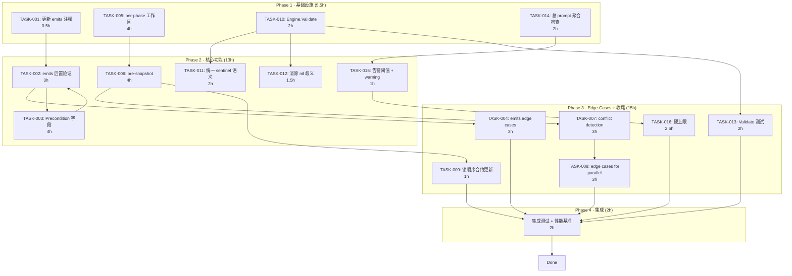
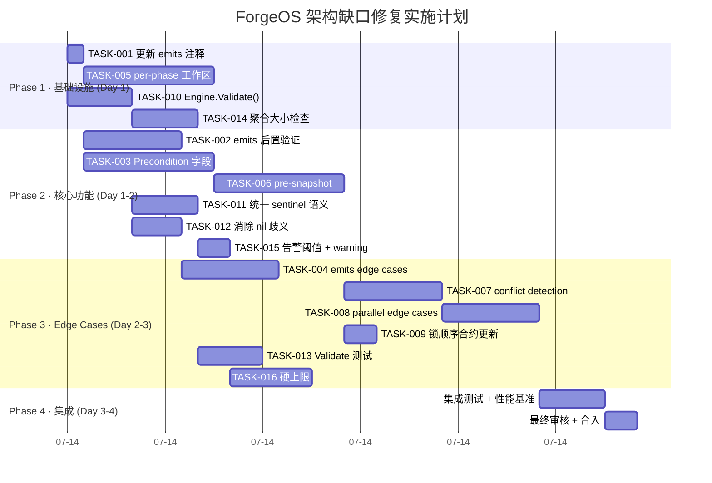

Now I have a thorough understanding of the codebase. Let me produce the Tech Lead analysis.

---

# Tech Lead 分析报告

## 1. 任务分解

基于综合评估报告的四个方向，结合实际代码现状，拆解为以下可执行任务。

### 方向一：Phase emits 前置/后置条件契约

| 任务 ID | 任务标题 | 涉及文件 | 前置依赖 | 预估工时 |
|---------|---------|---------|---------|---------|
| TASK-001 | 更新 emits 文档与 log 行为对齐 | `cmd/forge/prompt_artifacts.go`（注释） | 无 | 0.5h |
| TASK-002 | 实现 emits 后置验证（post-run check） | `internal/orchestrator/loop.go`, `cmd/forge/prompt_artifacts.go` | TASK-001 | 3h |
| TASK-003 | 实现 Precondition 字段及引擎侧校验 | `internal/asset/asset.go`, `internal/orchestrator/orchestrator.go` | TASK-001 | 4h |
| TASK-004 | 处理三个 edge case（部分写入/跳过/新建 vs 覆盖） | `cmd/forge/prompt_artifacts.go`, `internal/orchestrator/` | TASK-002 | 3h |

### 方向二：Parallel 写入冲突

| 任务 ID | 任务标题 | 涉及文件 | 前置依赖 | 预估工时 |
|---------|---------|---------|---------|---------|
| TASK-005 | 实现 per-phase 临时工作区（sandbox dir） | `internal/orchestrator/command_executor.go`, `cmd/forge/main.go` | 无 | 4h |
| TASK-006 | 实现文件系统 pre-snapshot 机制 | `internal/orchestrator/parallel.go`, 新建 `internal/orchestrator/snapshot.go` | TASK-005 | 4h |
| TASK-007 | 实现 post-write conflict detection | `internal/orchestrator/parallel.go` | TASK-006 | 3h |
| TASK-008 | 处理三个 edge case（非重叠/删除/跨 wave 隐式冲突） | `internal/orchestrator/parallel.go`, `internal/orchestrator/waves.go` | TASK-007 | 3h |
| TASK-009 | 增加锁顺序合约到文件系统层 | `internal/orchestrator/parallel.go`（注释 + 测试） | TASK-005 | 1h |

### 方向三：Zero-Value Sentinel 蔓延

| 任务 ID | 任务标题 | 涉及文件 | 前置依赖 | 预估工时 |
|---------|---------|---------|---------|---------|
| TASK-010 | 在 Engine.Validate() 中集中声明所有零值特例 | `internal/orchestrator/orchestrator.go` | 无 | 2h |
| TASK-011 | 统一 maxRetries=0 与 maxOutputBytes=0 的 sentinel 语义 | `internal/orchestrator/orchestrator.go`, `cmd/forge/main.go` | TASK-010 | 2h |
| TASK-012 | 消除 nil BudgetExhausted 与 nil OnGateResult 的语义歧义（拆为 NoBudget 哨兵常量） | `internal/orchestrator/orchestrator.go` | TASK-010 | 1.5h |
| TASK-013 | 补充 Validate() 单元测试，断言每个 sentinel 合约 | `internal/orchestrator/orchestrator_test.go` | TASK-010 | 2h |

### 方向四：Prompt 总大小防护

| 任务 ID | 任务标题 | 涉及文件 | 前置依赖 | 预估工时 |
|---------|---------|---------|---------|---------|
| TASK-014 | 在 buildPromptWithEmits 末尾加 sum-of-lanes 聚合检查 | `cmd/forge/prompt_context.go` | 无 | 2h |
| TASK-015 | 定义总 prompt 告警阈值常量 + warning log | `cmd/forge/prompt_context.go` | TASK-014 | 1h |
| TASK-016 | 增加相位总大小的 fail-closed 硬上限（可选，超出则拒绝 spawn） | `cmd/forge/prompt_context.go`, `internal/orchestrator/orchestrator.go` | TASK-015 | 2.5h |

---

**总任务数：16 | 预估总工时：35.5 小时（约 1 人·周）**

---

## 2. 执行顺序

### 可并行执行的任务组

| 组 | 任务 | 并行理由 |
|----|------|---------|
| **Group A**（基础设施层） | TASK-001（emits 注释更新） | 无文件冲突，纯文档工作 |
| | TASK-005（per-phase 工作区） | 新加 `CommandExecutor.SandboxDir` 字段，不影响现有字段 |
| | TASK-010（Engine.Validate） | 新加方法，不修改现有逻辑 |
| | TASK-014（prompt 聚合检查） | 在 `buildPromptWithEmits` 末尾加，不影响其他 |
| **Group B**（核心功能层） | TASK-002 / TASK-003（emits 验证+Precondition） | 依赖 TASK-001，但彼此可并行 |
| | TASK-006（pre-snapshot） | 依赖 TASK-005 |
| | TASK-011 / TASK-012（sentinel 清理） | 依赖 TASK-010 |
| | TASK-015（告警阈值） | 依赖 TASK-014 |
| **Group C**（Edge Cases） | TASK-004 / TASK-007 / TASK-008 / TASK-013 / TASK-016 | 每项依赖各自 Phase 2 核心任务，彼此不冲突 |

---

## 3. 技术风险

### 3.1 高风险项

| 风险 | 方向 | 影响 | 缓解策略 |
|------|------|------|---------|
| **Per-phase 工作区与现有 executor 的兼容性** | 方向二 | 所有现有 `CommandExecutor.Dir` 用法需要审计；dry-run executor 无工作区概念 | TASK-005 实现为 `SandboxDir string` 可选字段，零值 = 现有行为（`Dir`），全后向兼容。`parallel.go` 只在 `--parallel` 时设置 |
| **Conflict detection 误报** | 方向二 | 如果两个 phase 有意共享同一文件（如 planner 写 task-plan.md，implementer 读它），冲突检测会误判 | 引入白名单机制：`emits` 中声明的文件不触发冲突；允许显示 `shared_files` 字段 |
| **Engine.Validate() 误伤现有调用者** | 方向三 | 如果现有调用者依赖某个 sentinel 但 Validate 报 warning，可能触发故障 | Validate 只 `logf` warning 级别，不返回 error。仅 `--strict` 模式开启 fail-closed |
| **总 prompt 聚合检查的阈值选择** | 方向四 | 阈值太低会产生大量 false positive warning；太高则失去防护意义 | 初始实施 warning-only（TASK-015 不阻断），阈值通过数据驱动：先采集 50 次运行的数据，取 p99 的 1.5x。硬上限（TASK-016）留待 v2 |

### 3.2 中风险项

| 风险 | 方向 | 影响 | 缓解策略 |
|------|------|------|---------|
| Precondition 字段增加 YAML schema 复杂度 | 方向一 | 需要同步更新 `check.py` 治理层 validator | 与 TASK-003 并行更新 check.py schema，确保 CI 不断 |
| emits 后置验证在 evolve 场景下的行为 | 方向一 | 跨迭代时，后置验证在 phase 运行后检查，但下一迭代前 emits 可能被清理 | 后置验证只在单次 run 内有效；evolve 的 per-iteration 验证不做跨迭代持久断言 |
| 锁顺序合约更新遗漏 | 方向二 | 文件系统锁若插入到 8 级锁顺序中，可能破坏现有死锁避免 | TASK-009 在 parallel.go 的锁顺序注释中显式增加文件系统级别（Level 0），并增加 -race 测试 |

### 3.3 外部依赖

- **方向二的 conflict detection** 需要 `git diff` 或等效的 filesystem snapshot 工具。拟采用纯 Go 的 `os.Stat` hash tree（sha256 of files），零外部依赖，与 forge-core 的约束一致。
- **方向二的 per-phase 工作区** 不需要 Docker/VM——使用 `os.MkdirTemp` 创建 tmpdir + symlink 回 repo 中的 emits 文件。这符合 forge-core 的零外部依赖红线。

### 3.4 测试难点

| 方向 | 难点 | 策略 |
|------|------|------|
| 方向二 | 并发写入冲突的测试需要真实并发，且要复现罕见的 race | 在 `parallel_test.go` 中增加 `-race` 测试 + 专门的并发写入冲突测试（使用 sync.WaitGroup barrier 模式，与现有 barrierExec 一致） |
| 方向二 | 文件系统 snapshot 测试需要隔离的文件系统 | 使用 `t.TempDir()` 和 `os.Symlink` 构造 mini repo |
| 方向三 | sentinel 合约测试需要验证注释与行为一致 | 对于 `Validate()` 用 reflection 遍历 struct fields，文档化每个字段的 zero-value 含义 |

---

## 4. 资源评估

### 4.1 人员配置

| 角色 | 数量 | 主要负责 |
|------|------|---------|
| Senior Go 工程师 | 1 | 方向二（并发文件系统，最复杂），方向三（架构模式重构） |
| Mid-level Go 工程师 | 1 | 方向一（emits 契约），方向四（prompt 防护） |
| QA 工程师 | 0.5 | 集成测试，性能基准，-race 测试 |

**建议**：1 名 Senior 全时 + 1 名 Mid-level 全时 = 2 人，工期 1 周（35.5 工时 / 2 人 / 8h ≈ 2.2 天，考虑到集成测试和 PR review，约 1 周合理）。

### 4.2 关键里程碑

| 里程碑 | 预计时间 | 交付物 |
|--------|---------|--------|
| M1: 基础设施完成 | Day 1 中午 | TASK-001, 005, 010, 014 全部合入 main，所有现有测试通过 |
| M2: 核心功能完成 | Day 2 下午 | TASK-002, 003, 006, 011, 012, 015 合入，各自单元测试通过 |
| M3: Edge Cases 完成 | Day 3 下午 | TASK-004, 007, 008, 009, 013, 016 合入 |
| M4: 集成 + 发布 | Day 4 下午 | 全部 16 项合入，集成测试通过，`forge accept` 闸门全绿，文档更新 |

### 4.3 阻塞点（Blockers）

| Blocker | 影响 | 解决策略 |
|---------|------|---------|
| 方向二的 `SandboxDir` 与现有 `CommandExecutor.Dir` 的关系 | 所有并行执行路径 | 设计决策：`SandboxDir` 在 parallel 引擎中 override `Dir`，serial 引擎忽略。如果用户同时设置 `--parallel` 和 `--root`，`SandboxDir` 为 `root` 的子目录 |
| 方向一的 Precondition 字段 + check.py schema 更新可能滞后 | CI 闸门失败 | 在 TASK-003 的 PR 中同时提交 check.py 更新，确保闸门不红 |
| 方向三的 Validate() 需要内部对齐 sentinel 语义 | 可能触发内部讨论 | 在 PR 描述中附上变化对比表，显示 before/after 的 sentinel 合约 |

---

## 5. 质量保证

### 5.1 单元测试覆盖要求

| 方向 | 测试要求 | 示例 |
|------|---------|------|
| 方向一 | `emitsContext` 在 post-run 时验证文件存在 | `TestEmitsPostRunCheck_FileCreated`，`TestEmitsPostRunCheck_FileMissingWarns` |
| 方向一 | Precondition 字段解析 + 引擎跳过逻辑 | `TestPrecondition_Met`，`TestPrecondition_NotMet` |
| 方向一 | 三个 edge case | `TestEmitsEdge_PartialWrite`，`TestEmitsEdge_SkippedPhase`，`TestEmitsEdge_NetNew` |
| 方向二 | 并发写入不冲突（-race 测试） | `TestParallel_NoFileConflict`（写入 non-overlapping paths） |
| 方向二 | 冲突检测被触发 | `TestParallel_WriteConflictDetected` |
| 方向二 | per-phase 工作区隔离 | `TestParallel_SandboxDir_PhasesDontShareFiles` |
| 方向三 | Validate() 输出所有 sentinel | `TestEngineValidate_ReportsAllSentinelFields`（reflection 列举） |
| 方向三 | 修改后 sentinel 语义变更不破坏 back-compat | `TestZeroValueBackCompat` |
| 方向四 | 聚合检查 warning 触发 | `TestBuildPrompt_TotalSizeWarning` |
| 方向四 | 聚合检查不阻断现有用例 | `TestBuildPrompt_NoFalsePositive`（典型 prompt < 阈值） |

### 5.2 集成测试策略

1. **方向二 end-to-end**：在 `parallel_test.go` 中增加一个完整的 integration 测试，创建包含两个 phase 的 workflow，两个 phase 都写文件，然后用 `RunParallel` 执行，验证两者未相互覆盖
2. **方向一 + 方向四 combo**：一个 phase 声明 `emits: [task-plan.md]` 并 feed-forward，后续 phase 的 prompt 包含 emit 内容且总大小不超过阈值
3. **闸门完整性**：运行 `node harness/acceptance.mjs` 确保所有修改不破坏现有闸门（gate.mjs, arch-check.mjs, check.py, secret-scan.mjs）

### 5.3 代码审查要点

| 审查点 | 重点关注 |
|--------|---------|
| **Layer 不泄露** | orchestrator 不引入 cmd/forge 的任何类型；cmd/forge 不引入 internal/orchestrator 的内部状态 |
| **零外部依赖** | 所有新代码不得 import 非 stdlib 包 |
| **并发安全** | 新加的 `sync.Mutex` 是否遵循了 `parallel.go` 的锁顺序合约；是否更新了注释 |
| **边缘 case** | 零值/空值是否与 back-compat 注释一致；`nil receiver` guard 是否都有 |
| **YAML/JSON 兼容性** | 新加的 `Phase` 字段使用 `omitempty` 和指针（POINTER）来保证旧 workflow 不中断 |

### 5.4 性能测试需求

| 测试 | 方向 | 方法 |
|------|------|------|
| 冲突检测性能基准 | 方向二 | 1000 文件 repo 下 pre-snapshot 耗时 < 50ms |
| 每次 run 的 Validate() 开销 | 方向三 | 应对 0 外部依赖的 Engine 结构体做 reflection 遍历 < 1µs |
| 总 prompt 大小检查开销 | 方向四 | 对 100KB prompt 的 len 检查应 < 100ns |
| Parallel 吞吐量基准 | 方向二 | 与 serial 对比：4 阶段 fan-out 应减少 ~75% wall-clock |

---

## 6. 实施计划

### 甘特图

### 详细时间线

#### 阶段 1：基础设施搭建（Day 1, 0-4h）

| 时间段 | 工作内容 | 人员 |
|--------|---------|------|
| 0h-0.5h | TASK-001: 将 `prompt_artifacts.go` 中 `emitsContext` 的注释更新为反映当前行为（WARNING 不阻断） | Mid |
| 0.5h-2.5h | TASK-005: 在 `CommandExecutor` 中增加可选的 `SandboxDir string` 字段；在 `parallel.go` 的 `runPhaseParallel` 中为每个 phase 创建 `os.MkdirTemp` + symlink repo emits 文件 | Senior |
| 0.5h-2.5h | TASK-010: 在 `Engine` 上新增 `Validate()` 方法，遍历所有字段并记录零值特例；方法签名为 `func (e Engine) Validate() []string` 返回 warning 列表 | Senior |
| 2.5h-4.5h | TASK-014: 在 `buildPromptWithEmits` 末尾，`prompt.Build` 调用后，加 `len()` 判断；若超过 `totalPromptWarningCap`（预设 8000 tokens = ~32000 bytes），通过返回的 wrapping 函数 log warning | Mid |

#### 阶段 2：核心功能实现（Day 1-2, 4h-16h）

| 时间段 | 工作内容 | 人员 |
|--------|---------|------|
| Day1 4h-7h | TASK-002: 在 `prompt_artifacts.go` 新增 `verifyEmitsPostRun(repoRoot string, emits []string) []string`；在 `orchestrator.go` 的 `RunFrom` 中 agent phase 成功后调用 | Senior |
| Day1 4h-8h | TASK-003: 在 `asset.Phase` 中增加 `Precondition *Precondition struct`（注意 POINTER 以保持 back-compat）；在 `orchestrator.go` 中加入运行前检查 | Mid |
| Day1 7h-11h | TASK-006: 新建 `internal/orchestrator/snapshot.go`，实现 `preSnapshot(root string, phase asset.Phase) (map[string]string, error)` 返回文件的 sha256 hash map | Senior |
| Day1 8h-10h | TASK-011: 统一 `maxRetries=0` 和 `maxOutputBytes=0` 的 sentinel 到 const（如 `const NoRetries = 0`, `const NoDeadline = 0`），加测试断言 | Mid |
| Day1 10h-11.5h | TASK-012: 将 `BudgetExhausted` 的 nil 语义从「无限制」改为清晰的哨兵常量 `var NoBudget func() bool`；`OnGateResult` 的 nil = 无 callback 不变但加注释 | Mid |
| Day1 11h-12h | TASK-015: 在 `prompt_context.go` 定义 `totalPromptWarningCap` 和 `totalPromptHardCap` 常量；在 `buildPromptWithEmits` 末尾增加 warning log | Mid |

#### 阶段 3：Edge Cases + 收尾（Day 2-3, 16h-28h）

| 时间段 | 工作内容 | 人员 |
|--------|---------|------|
| Day2 16h-19h | TASK-004: emits 的三个 edge case 实现：(1) partially written = `os.Stat` 后比较 size > 0 (2) phase skipped = 在 `skipByMode` 中标记 emits 不验证 (3) net new vs overwrite = git diff 对比（可选） | Mid |
| Day2 19h-22h | TASK-007: 在 `parallel.go` 的 `runWave` 中，wave 运行前 call `preSnapshot`，wave 完成后 call `postConflictCheck(prev, curr map[string]string) []Conflict` | Senior |
| Day2 22h-25h | TASK-008: 三个 edge case：(1) 非重叠区域 = 白名单匹配，(2) 删除 = `prev[path]` 存在但 `curr[path]` 不存在，(3) 跨 wave 隐式冲突 = wave 间也做 snapshot diff | Senior |
| Day2 16h-17h | TASK-009: 更新 `parallel.go` 的锁顺序注释，增加文件系统级别（Level 0） | Senior |
| Day3 25h-27h | TASK-013: 在 `orchestrator_test.go` 中增加 `TestEngineValidate_ReportsSentinelFields` 和 `TestEngineValidate_NilSafety` | Mid |
| Day3 27h-29.5h | TASK-016: 在 `Engine` 中增加 `MaxPromptBytes int` 字段（0 = unlimited back-compat），在 `runAgentPhase` 中检查 prompt 大小，超限拒绝 spawn | Senior |

#### 阶段 4：集成测试 + 发布（Day 3-4, 29.5h-35.5h）

| 时间段 | 工作内容 | 人员 |
|--------|---------|------|
| Day3-4 29.5h-31.5h | 集成测试：修改 `parallel_test.go`、`orchestrator_test.go`、`prompt_context_test.go`，增加 end-to-end 场景 | 双方 |
| 31.5h-32.5h | 性能基准测试：使用 `go test -bench` 运行冲突检测/Validate/prompt 检查的 benchmark | Senior |
| 32.5h-33.5h | 运行 `node harness/acceptance.mjs` 确保全部闸门通过 | Mid |
| 33.5h-34.5h | 更新 `.agent/ARCHITECTURE.md`、`.agent/AGENTS.md` 等文档，记录新字段和契约 | Mid |
| 34.5h-35.5h | 最终 PR 审核、合入 main | 双方 |

---

## 总结

| 维度 | 判断 |
|------|------|
| **最高优先级** | **方向二（P1）**——代码完全零覆盖，且造成潜在的数据损坏风险。建议 Day 1 由 Senior 工程师启动 |
| **最易实现** | **方向三（P2）**——`Engine.Validate()` 是纯 additive 的 15-20 行改动，零副作用 |
| **最大 ROI** | **方向一（P2）**——`emits` 后置验证 + Precondition 补齐了 workflow 契约中的最大逻辑洞 |
| **最小改动** | **方向四（P3）**——聚合检查只需 10 行 + 2 个常量，但只解决 warning 级别问题 |

**建议 Sprint 规划**：1 个 Standard Sprint（1 周），2 名工程师，全部 4 个方向 16 个任务。方向二和方向三是架构债中的「硬缺口」——完工后 forge-core 的容错性、可审计性和并发安全性将有质的提升。
