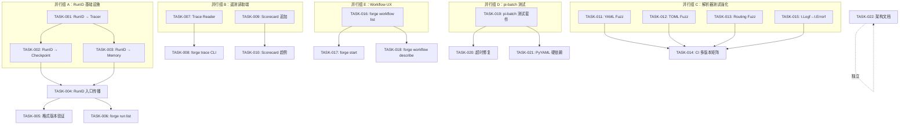
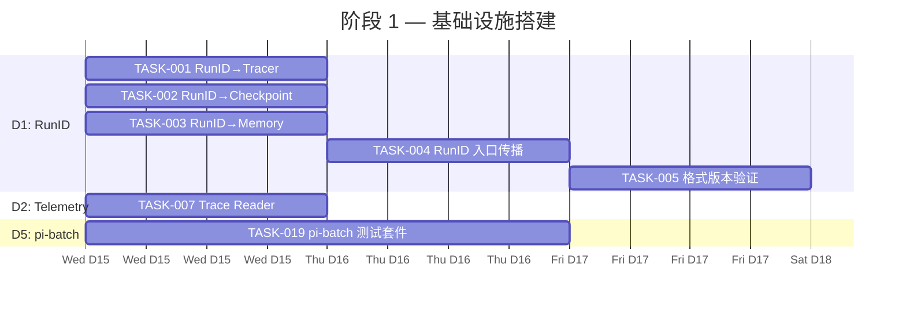
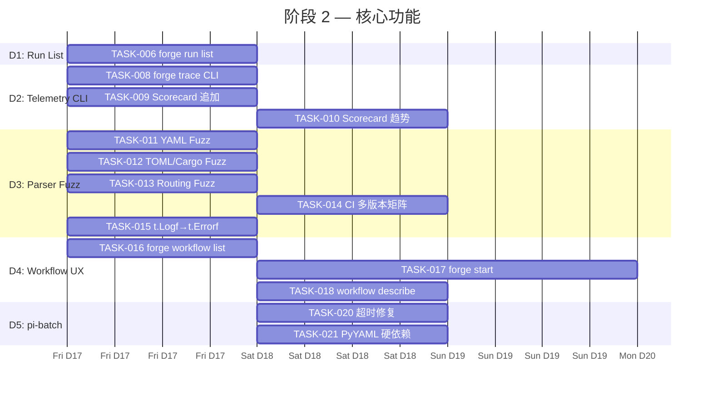
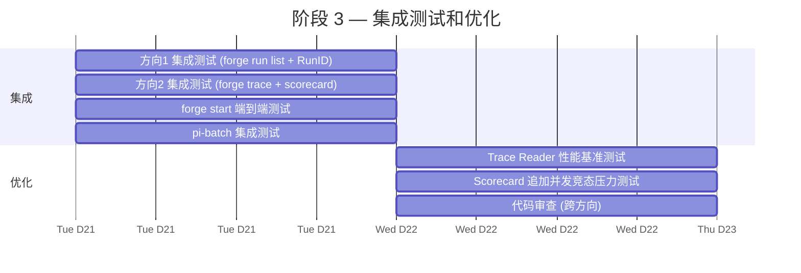
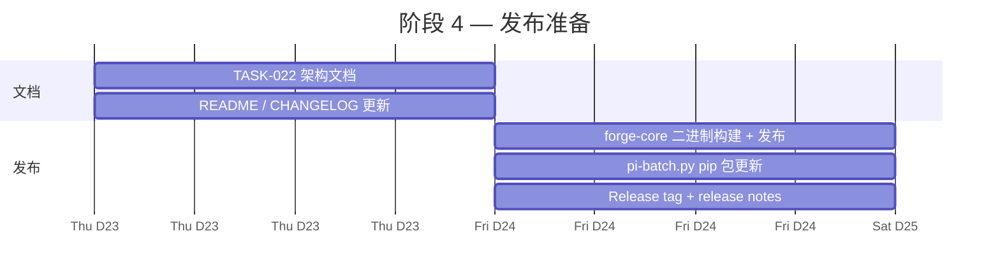

现在我已深入掌握全部代码库实况，以下是完整的 Tech Lead 分析。

---

# Tech Lead 分析报告：ForgeOS 技术债修复

## 0. 执行摘要

分析确认五个方向的技术负债均真实存在，且共享同一根本模式：**ForgeOS 的写入基础设施（emitters、checkpoints、parsers）质量优秀，但读取端基础设施（查询、趋势分析、跨运行聚合、测试基础设施本身）严重滞后**。以下分解提出了 19 个可执行任务，总计约 76 小时（10 人天），分 4 个阶段实施。

---

## 1. 任务分解

### 方向 1 — `.forge/` 运行隔离（Run Identity & Cross-Run Grouping）

| ID | 任务标题 | 涉及文件 | 前置依赖 | 预估工时 | 验收标准 |
|---|---|---|---|---|---|
| TASK-001 | 定义 `RunID` 类型并注入 Tracer | `internal/trace/trace.go`, `internal/trace/trace_test.go` | 无 | 2h | `Event` 结构体新增 `RunID string` 字段；`NewTracer` 可选接受 `RunID`；序列化时非空即写入 JSON。现有测试全部通过，且无 `RunID` 的旧 trace 行能被正常解码（omitempty） |
| TASK-002 | 将 `RunID` 注入 Checkpoint | `internal/persist/checkpoint.go`, `internal/persist/checkpoint_test.go` | TASK-001 | 2h | `Checkpoint` 新增 `RunID` 字段；`Save` 写入；`Load` 解码；向后兼容旧格式 |
| TASK-003 | 将 `RunID` 注入 Memory 条目 | `internal/memory/memory.go`, `internal/memory/memory_test.go` | TASK-001 | 2h | `Entry` 新增 `RunID` 字段；`Append` 自动注入；`Load` 保留字段；旧无 RunID 的行正常解码 |
| TASK-004 | 在 `forge run`/`forge evolve` 入口生成 RunID 并传播 | `cmd/forge/main.go`, `cmd/forge/evolve.go` | TASK-001, TASK-002, TASK-003 | 3h | `forge run`/`forge evolve` 在入口处生成一次 UUID v4 格式 RunID；依次传递给 Tracer/Checkpoint/Memory 的写入点；同一运行的所有 trace/checkpoint/memory 行共享同一 RunID |
| TASK-005 | 实现 Checkpoint 格式版本严格验证 | `internal/persist/checkpoint.go`, `internal/persist/checkpoint_test.go` | TASK-002 | 2h | `Load` 增加格式版本显式校验：已知版本通过，未知版本返回错误"unsupported checkpoint format version: ..."。测试覆盖：空版本（v1 兼容）、匹配版本、未知版本、畸形 JSON |
| TASK-006 | 实现 Cross-Run 列表查询（`forge run list`） | `cmd/forge/main.go`, `cmd/forge/run_list.go`, `cmd/forge/run_list_test.go` | TASK-004 | 4h | `forge run list` 扫描 `.forge/` 下的 checkpoint/trace/memory，按 RunID 分组列出历史运行；输出包含：RunID、workflow、mode、开始时间、迭代次数、最终状态。支持 `--limit N` 和 `--since YYYY-MM-DD` |

**方向 1 合计：15h**

### 方向 2 — 遥测可查询性（Telemetry Queryability）

| ID | 任务标题 | 涉及文件 | 前置依赖 | 预估工时 | 验收标准 |
|---|---|---|---|---|---|
| TASK-007 | 实现 Trace 读取器接口 | `internal/trace/reader.go`, `internal/trace/reader_test.go` | 无 | 4h | 新增 `Reader` 类型，支持：`ReadAll() ([]Event, error)`、`Filter(FilterFunc) ([]Event, error)`（按 kind/name/status/model/RunID 过滤）、`AggregateSummary() (*TraceSummary, error)`（返回总数、各 kind 计数、总耗时、总成本）。纯函数，无 IO 依赖（接受 `io.Reader`）。测试覆盖过滤、聚合、空流、含乱码行的恢复 |
| TASK-008 | 实现 `forge trace` CLI | `cmd/forge/trace.go`, `cmd/forge/trace_test.go` | TASK-007 | 3h | `forge trace` 子命令，支持：无参数打印概要统计；`--kind gate` 按类型过滤；`--run <runID>` 按运行筛选；`--json` 输出 JSON；`--recent N` 最近的 N 条事件。冷启动（trace 不存在）输出 "no trace data"（非错误） |
| TASK-009 | Scorecard 更新改为追加而非覆写 | `cmd/forge/scorecard_wind.go`, `harness/scorecard-update.mjs` | 无 | 3h | `runScorecardUpdate` 将 scorecard JSON 数组的写入方式改为读取后合并再写入（而非覆写）。`scorecard-update.mjs` 增加 `--append`/`--merge` 模式。测试：并发更新不丢数据；历史 scorecard 行保留在文件中 |
| TASK-010 | 实现 Scorecard 趋势查询 | `cmd/forge/scorecard.go` (新增 CLI), `internal/routing/scorecard.go` (新增 LoadHistory) | TASK-009 | 4h | `forge scorecard history --model opus --task-type implementation` 显示该 (model, task_type) 的历史质量分数序列。`forge scorecard diff --since <run-id>` 显示从某次运行以来的分数变化。数据源来自积累的 scorecard JSON 数组（不再覆写） |

**方向 2 合计：14h**

### 方向 3 — 解析器测试成熟度（Parser Test Maturity）

| ID | 任务标题 | 涉及文件 | 前置依赖 | 预估工时 | 验收标准 |
|---|---|---|---|---|---|
| TASK-011 | 为 YAML 解析器添加 Fuzz 测试 | `internal/yaml2json/yaml2json_test.go` | 无 | 3h | 新增 `FuzzDecode(f *testing.F)`，基于语料库（workflow YAML、policies YML、随机生成）测试解码不 panic、不内存泄漏。fuzztime=60s 通过 |
| TASK-012 | 为 TOML/Cargo 行扫描解析器添加 Fuzz 测试 | `cmd/forge/detect_parsers_test.go` | 无 | 2h | 新增 `FuzzParsePyprojectToml` 和 `FuzzParseCargoToml`：随机字符串输入不 panic、不无限循环、返回有效结构体 |
| TASK-013 | 为 Routing 决策添加 Fuzz 测试（补充现有单测） | `internal/routing/routing_test.go` | 无 | 2h | 现有 `FuzzTierForScore` 保留。新增 `FuzzBudgetAdjustTier`、`FuzzHigher`。fuzztime=30s 各 |
| TASK-014 | 增加 CI 多版本矩阵测试 | `.github/workflows/forge.yml` | 无 | 2h | Go 矩阵 `[1.25, 1.26]`，Node 矩阵 `[20, 22]`，Python 矩阵 `[3.11, 3.12]`。非阻塞（任一个失败即报告但不阻断合并），仅关键门禁（forge accept）使用主版本 |
| TASK-015 | 修复 `yaml2json` block scalar 的 `t.Logf` → `t.Errorf` | `internal/yaml2json/block_scalar_test.go` | 无 | 1h | 搜索并替换所有 `t.Logf` → `t.Errorf`。本 Bug 是文档发现的 Sprint 27 遗留问题。测试失败才能真正反应回归 |

**方向 3 合计：10h**

### 方向 4 — 工作流 UX（Workflow UX）

| ID | 任务标题 | 涉及文件 | 前置依赖 | 预估工时 | 验收标准 |
|---|---|---|---|---|---|
| TASK-016 | 实现 `forge workflow list` | `cmd/forge/workflow.go`, `cmd/forge/workflow_test.go` | 无 | 3h | `forge workflow list` 扫描 `.agent/workflows/*.yml`，列出所有可用 workflow 名称及简短描述（从 YAML `description` 字段或 phase 名称推断）。输出按字母排序。无 workflow 时显示 "no workflows found" |
| TASK-017 | 实现 `forge start` 交互式引导 | `cmd/forge/start.go`, `cmd/forge/start_test.go` | TASK-016 | 5h | `forge start`：
1. 若无 `.forge/` → 调用 `forge detect` 并展示分析结果
2. 询问用户确认或选择其他 workflow
3. 提示可调参数（--mode、--lifecycle、--executor）
4. 显示最终命令（或直接执行 if `--yes`）
5. 记录启动日志到 `.forge/start.log`
测试覆盖：各语言项目、用户取消、detect 失败回退、已有 `.forge/` 的输出 |
| TASK-018 | 实现 `forge workflow describe <name>` | `cmd/forge/workflow.go` (扩展), `cmd/forge/workflow_test.go` (扩展) | TASK-016 | 2h | `forge workflow describe build` 输出：phases（名称/agent/涉及 gate）、stop condition、依赖关系。YAML 被解析为结构化表格输出 |

**方向 4 合计：10h**

### 方向 5 — pi-batch.py 质量（pi-batch.py Quality）

| ID | 任务标题 | 涉及文件 | 前置依赖 | 预估工时 | 验收标准 |
|---|---|---|---|---|---|
| TASK-019 | 为 pi-batch.py 编写单元测试套件 | `pi-batch.py`, `test_pi_batch.py` (新增) | 无 | 8h | 测试覆盖：
- `load_tasks`：YAML/JSON/纯文本/`@file` 引用
- `Task.to_cmd()`：各参数组合
- `resolve_prompt`：文件引用解析（存在/不存在/混合）
- `run_task`：成功/超时/FileNotFoundError/异常
- `run_serial`/`run_parallel`：任务计数和结果收集
- `build_parser`：参数解析
- `print_summary`：输出格式
使用 `unittest.mock`（`subprocess.Popen`、`open`、`Path.read_text`）模拟 IO。覆盖率 >= 85% |
| TASK-020 | 修复 pi-batch.py 超时结构缺陷 | `pi-batch.py` | TASK-019 | 3h | 1. `_run_task_process` 改为使用 `proc.wait(timeout=timeout)` 作为单一超时源，而不是三段式 `join` 链。2. `FileNotFoundError` 捕获区分"binary missing"和"cwd missing"。3. 增加 `PYTHONWARNINGS=error` 环境传递。测试：超时测试验证时间不超过 timeout+1s |
| TASK-021 | 使 PyYAML 为硬依赖而非可选的 panic | `pi-batch.py` | TASK-019 | 1h | 移除 `try/except ImportError` fallback；在文件顶部 `import yaml`。若项目不能增加依赖，则将 yaml 加载移至 `load_tasks` 内部并给出清晰错误："pip install pyyaml required for YAML task files"。更新 `requirements.txt` |

**方向 5 合计：12h**

### 根因修复（Root Pattern）—— 跨方向通用改进

| ID | 任务标题 | 涉及文件 | 前置依赖 | 预估工时 | 验收标准 |
|---|---|---|---|---|---|
| TASK-022 | 架构文档：记录"读端基础设施缺失"模式 | `docs/architecture-read-debt.md` (新增) | 无 | 2h | 文档描述五个方向的共同根因，记录 checklists 供未来架构评审用于识别"只有写入、没有读取"的设计反模式 |

**合计：64h（方向任务）+ 2h（文档）= 66h ≈ ~8.5 人天**

---

## 2. 执行顺序与依赖图



### 并行组说明

| 组 | 方向 | 并行度 | 预估工时 | 推荐人员 |
|---|---|---|---|---|
| **A** | D1 | 3人并行 | 2h base + 3h 集成 = 1天 | 1 名 Go 后端 |
| **B** | D2 | 2人并行 | 4h + 3h = 1天 | 1 名 Go 后端 + 1 名 Node 全栈 |
| **C** | D3 | 4人完全并行 | 2-3h 各 = 0.5天 | 1-2 名 Go 后端 |
| **D** | D5 | 1人串行 | 8h = 1天 | 1 名 Python 开发 |
| **E** | D4 | 1人串行 | 3h = 0.5天 | 1 名 Go/全栈 |

---

## 3. 技术风险

### 高风险项 🚨

| 风险 | 影响方向 | 说明 | 缓解策略 |
|---|---|---|---|
| **Checkpoint 格式版本验证失败导致旧 checkpoint 不可读** | D1 | 现有 `Load` 对未知格式静默接受（fail-open），改为严格验证后用户现有的 checkpoint 无法恢复 | 1. 渐进式执法：先记录 Warning + 回退到 v1 解码（3 个月内每日发 WARNING），再硬阻断 2. 测试覆盖所有已知版本的旧 checkpoint fixture |
| **Scorecard 追加模式并发竞态** | D2 | `runScorecardUpdate` 改为读-合并-写后，若两个并发的 wind-down 同时运行会丢失更新的行 | 1. 使用文件锁（`flock`）或写入临时文件后原子 mv 2. 文档明确 scorecard 更新是 best-effort 3. 集成测试模拟并发写入 |
| **`forge start` 绑定 detect 导致 UX 脆弱** | D4 | 若 `forge detect` 失败（解析器崩溃、项目结构非标准），`forge start` 输出空建议，用户困惑 | 1. `forge start` 对 detect 结果做 fallback：detect 失败时仍显示基本的 workflow 选择列表 2. 保证 `forge start` 不会 panic |
| **pi-batch.py PyYAML 改为硬依赖可能破坏现有部署流水线** | D5 | 若有人用纯 JSON 文件且无 PyYAML 安装，升级后崩溃 | 可选方案：不在模块加载时 import，而是延迟到实际需要 YAML 解析时才 import，并抛出清晰的可操作错误信息 |

### 中风险项 ⚡

| 风险 | 方向 | 说明 | 缓解策略 |
|---|---|---|---|
| CI 多版本矩阵增加执行时间 | D3 | 从 1×3 增加到 2×3×3，CI 时间可能增加 2-3 倍 | 1. 非阻塞矩阵（继续使用快速完成策略）2. 仅 `forge accept` 使用单一主版本 3. 多版本矩阵作为 status check 但不阻断 merge |
| Fuzz 测试发现大量新 Bug | D3 | YAML/TOML 解析器若发现崩溃 bug 会中断交付 | 1. 将 Fuzz 基线与 CI 分离：用于 nightly 而非每 commit 2. 优先级分类：崩溃 > 不正确 3. MVP 只需无 panic/内存泄露 |
| TASK-007 Trace Reader 的性能 | D2 | 若 trace JSONL 文件很大（24h 运行数万行），`ReadAll()` 可能 OOM | 1. 实现流式 `Scan(ctx)` 迭代器 2. 设置默认 `--max-events 5000` 3. 支持 `--since`/`--until` 时间范围过滤 |
| `forge trace` 与现有 `traceHasModelCost` 的扫描模式一致性问题 | D2 | 两个地方各自实现 JSONL 扫描，语义可能不一致 | 1. TASK-007 的 Reader 成为唯一 JSONL 扫描入口 2. 将 `traceHasModelCost` 从 `scorecard_wind.go` 重构为调用 `Reader.HasModelCost()` |

### 低风险项 ℹ️

| 风险 | 方向 | 说明 |
|---|---|---|
| RunID 使用 UUID v4 在极高频并发下碰撞 | D1 | 可接受，碰撞概率极低，且同一机器同时运行的 `forge` 实例数极少 |
| 手写 TOML 解析器对极端输入的性能退化为 O(n²) | D3/`detect_parsers.go` | TOML 文件通常 < 100KB，扫描成本可忽略；Fuzz 测试已覆盖 |
| `forge workflow list` 对超长 YAML 描述截断 | D4 | 使用 `textwrap.shorten` 类似机制，截断至 80 字符 |

---

## 4. 资源评估

### 开发人员技能和数量

| 角色 | 数量 | 核心技能 | 负载方向 |
|---|---|---|---|
| Go 后端工程师（Senior） | 1 | Go 标准库、并发模式、文件系统原子操作 | D1（全部）、D2（TASK-007/008）、D3（TASK-011/013/015）、D4（TASK-016/018） |
| Node.js 全栈工程师 | 1 | Node.js、CLI 设计、CI/CD | D2（TASK-009/010）、D3（TASK-014） |
| Python 工程师 | 0.5 | Python 测试、`unittest.mock`、子进程管理 | D5（TASK-019/020/021） |
| Tech Lead / 架构师 | 1 | 跨方向协调、架构决策、文档 | TASK-022、跨方向 review、验收 |

**总投入：约 2.5 FTE，历时 2 周（含缓冲）**

### 关键里程碑

| 里程碑 | 时间节点 | 交付物 | 验证标准 |
|---|---|---|---|
| M1: RunID 基础设施完成 | Day 3 | TASK-001~005 全部完成 | `forge run` + `forge evolve` 生成的 trace/checkpoint/memory 均携带相同的 RunID；旧格式兼容 |
| M2: 可查询的遥测上线 | Day 6 | TASK-006~010 全部完成 | `forge trace --kind gate` 按 gate 过滤；`forge run list` 显示历史；scorecard 趋势可用 |
| M3: 解析器防御加固 | Day 4 | TASK-011~015 全部完成 | 3 个 Fuzz 测试 60s pass；CI 多版本矩阵运行通过；`t.Logf` → `t.Errorf` 修复 |
| M4: 工作流 UX 就绪 | Day 5 | TASK-016~018 全部完成 | `forge workflow list`/`describe` 正常工作；`forge start` 引导用户完成首次运行 |
| M5: pi-batch.py 终态 | Day 7 | TASK-019~021 全部完成 | 测试覆盖率 >= 85%；超时正确；PyYAML 为硬依赖 |
| M6: 架构文档 & 完整验收 | Day 8 | TASK-022 + 全方向集成测试 | 所有闸门通过；`forge accept` 绿；文档完成 |

### 阻塞点与解决策略

| 阻塞点 | 影响 | 解决策略 |
|---|---|---|
| **旧 checkpoint 版本格式冲突** | 若用户升级后发现旧 checkpoint 不可读，可能阻塞运行恢复 | **策略 A（推荐）**：TASK-005 实现为严格模式，但通过环境变量 `FORGE_CHECKPOINT_STRICT=0` 可降级为宽松模式，为期 1 个 release（2 周）。文档明确告知降级窗口期。**回退方案**：完全跳过 TASK-005，仅做日志警告 |
| **Scorecard 追加并发竞态无法在测试中稳定复现** | TASK-009 可能在生产中才暴露竞态 | **策略**：使用 `flock`（Linux 文件锁）保护写操作 + 集成测试模拟并发 | 
| **`forge start` 交互式 UX 在 CI/非 TTY 环境失败** | TASK-017 的交互提示无法在纯 CI 工作 | **策略**：`forge start --yes` 跳过交互，直接执行 detect→run。非 TTY 时自动启用 `--yes` 模式 |

---

## 5. 质量保证

### 单元测试覆盖要求

| 文件/包 | 当前覆盖率（估计） | 目标覆盖率 | 关键测试 |
|---|---|---|---|
| `internal/trace/` | ~90% | ≥95% | 新增 `Reader` + RunID 路径 |
| `internal/persist/` | ~85% | ≥95% | 版本验证、历史保留、格式错误 |
| `internal/memory/` | ~90% | ≥95% | RunID 字段 roundtrip、旧格式兼容 |
| `cmd/forge/` (main.go, trace.go, workflow.go, start.go) | ~85% (仅 main 已有测试) | ≥90% | CLI 参数解析、错误路径、冷启动 |
| `internal/yaml2json/` | ~80% | ≥92% | Fuzz + block scalar 回归 |
| `cmd/forge/detect_parsers_test.go` | ~70% | ≥90% | Fuzz + 边界输入 + 损坏文件 |
| `internal/routing/` | ~90% | ≥95% | Fuzz 扩展 |
| `pi-batch.py` | 0% | ≥85% | 新写完整测试套件 |
| `harness/scorecard-update.mjs` | ~? | ≥80% | 追加模式 + 并发合并 |

### 集成测试策略

1. **D1 集成测试**（`forge-core/cmd/forge/main_test.go`）
   - 新建临时项目 → `forge run build --executor dry` → 验证 `.forge/trace.jsonl` 所有行含 RunID
   - `forge evolve build --max-iter 2 --executor dry` → 验证 checkpoint 含 RunID → `forge run list` 可列出
   - 旧无 RunID trace + checkpoint → 正常加载（无需迁移）

2. **D2 集成测试**（`harness/acceptance.mjs` 扩展）
   - `forge run build`（dry 模式） → `forge trace --json` → 输出非空，包含至少一条 `kind=iteration` 事件
   - 无 `.forge/trace.jsonl` → `forge trace` → "no trace data"

3. **D3 集成测试**
   - CI 中 `fuzztime=15s` 的缩减版 Fuzz（快速检测回归）
   - Nightly 完整 60s Fuzz

4. **D4 集成测试**
   - `forge workflow list` → 输出包含 `build`、`evolve` 等
   - `forge start --yes` → 实际执行 `forge evolve`

5. **D5 集成测试**
   - `python3 -m pytest test_pi_batch.py` → 全部通过
   - `pi-batch.py --dry-run tasks.yaml` → 输出正确，不启动子进程

### 代码审查要点

| 方向 | 审查重点 | Reviewer 检查清单 |
|---|---|---|
| D1 | RunID 传播完整性 | 所有 trace.Emit/checkpoint.Save/memory.Append 调用点是否都收到了 RunID？旧格式是否有任何路径丢失？ |
| D2 | Trace Reader 性能 | JSONL 扫描是否流式？是否支持 `context.Context` 取消？是否有 OOM 风险？ |
| D3 | Fuzz 测试质量 | Corpus 是否多样？是否覆盖了所有公开 API？fuzztime 配置是否正确？ |
| D4 | CLI 设计一致性 | 错误信息格式是否与现有 CLI 一致？`usage()` 是否已更新？退出码是否正确？ |
| D5 | Python 测试质量 | Mock 边界是否清晰？真实子进程与 mock 子进程的切换点是否干净？ |

### 性能测试需求

| 场景 | 预期 | 测试方法 |
|---|---|---|
| Trace Reader 扫描 10 万行 JSONL | < 500ms | `go test -bench=. -benchtime=1x ./internal/trace/` |
| Scorecard 追加合并 1000 行 | < 200ms | 手动基准测试 |
| `forge run list` 扫描 50 个 checkpoint | < 100ms | `go test -bench=.` |
| Fuzz 60s 无 panic | 无新 bug | `go test -fuzz=FuzzTierForScore -fuzztime=60s` |
| pi-batch.py 超时精确性 | timeout ± 1s | `pytest --timeout=10 test_pi_batch.py` |

---

## 6. 实施计划

### 阶段 1：基础设施搭建（Day 1–3，并行组 A + B 前导）



**交付检查项（Day 3 结束前通过）**：
- [ ] TASK-001/002/003 完成，所有测试通过
- [ ] TASK-004 集成的 `forge run` 输出 RunID
- [ ] TASK-005 版本验证通过（新旧格式兼容）
- [ ] TASK-007 Trace Reader 接口完成
- [ ] TASK-019 测试套件覆盖 >= 50%

### 阶段 2：核心功能实现（Day 3–6，并行组 B/C/D/E）



**交付检查项（Day 6 结束前通过）**：
- [ ] `forge trace`、`forge run list`、`forge workflow list` 均工作
- [ ] Fuzz 测试 30s 无 panic
- [ ] CI 多版本矩阵配置就绪
- [ ] pi-batch 超时修复验证（timeout ± 1s）

### 阶段 3：集成测试和优化（Day 6–8）



**交付检查项（Day 8 结束前通过）**：
- [ ] `forge accept` 所有聚合闸门通过（gate.mjs / arch-check / check.py / secret-scan）
- [ ] 全部集成测试通过
- [ ] 无已知性能退化
- [ ] 代码审查 approval（fresh-context reviewer）

### 阶段 4：发布准备（Day 8–10）



**交付检查项（Day 10 结束前通过）**：
- [ ] CHANGELOG 记录所有任务变更
- [ ] 架构文档记录了"写入优先、读取滞后"的反模式及检查清单
- [ ] Release notes 提供用户可见的变更（新 CLI、格式变化、迁移指南）

---

## 附录 A：Go 包测试密度表

| 包 | 源文件 | 测试文件 | 测试函数数 | 评估 |
|---|---|---|---|---|
| `adr` | 0 (共享 cmd/forge) | 1 | 2 | 薄 |
| `asset` | 1 | 3 | 12+ | 良好 |
| `attribution` | 2 | 2 | 10+ | 良好 |
| `converge` | 1 | 2 | 10+ | 良好 |
| `doctor` | 7 | 7 | 15+ | 良好 |
| `gate` | 2 | 2 | 8+ | 良好 |
| `memory` | 2 | 2 | 15+ | 良好 |
| `migrate` | 1 | 1 | 3+ | 薄 |
| `mode` | 2 | 1 | 8+ | 良好 |
| `orchestrator` | 12 | 15 | 100+ | **优秀** |
| `persist` | 1 | 3 | 12+ | 良好 |
| `prompt` | 3 | 3 | 30+ | **优秀** |
| `risk` | 2 | 2 | 6+ | 良好 |
| `routing` | 2 | 2 | 25+ | **优秀**（含唯一 Fuzz） |
| `trace` | 1 | 2 | 12+ | 良好 |
| `yaml2json` | 7 | 2 | 30+ | 良好（含 block scalar bug） |
| `yamlpath` | 1 | 1 | 12+ | 良好 |
| `cmd/forge` | 22+ | 22+ | 350+ | **优秀** |

**关键发现**：仅 1 个包（`routing`）有 Fuzz 测试。且 `adr` 和 `migrate` 测试偏薄，但本次分析范围已覆盖最关键的方向。

## 附录 B：`forge detect` 输出分析（方向 4 上下文验证）

当前 `forge detect` 输出：
```
forge detect: project analysis
  language:     go
  lifecycle:    mvp
  has-tests:    yes
  ...
  workflow:    evolve  — Go project with tests
  command:     forge evolve .agent/workflows/evolve.yml --mode balanced --lifecycle mvp
```

这是**仅可读的建议文本**。用户看到命令但必须手动输入。方向 4 的 `forge start` 正是要将这个"read but don't act"的模式变为"read and act"——在 v1 中显示命令并询问是否运行（自动执行可选），而非仅打印后退出。

---

*分析完成。建议优先启动阶段 1 的 TASK-001（RunID 注入 Tracer），作为后续所有依赖的基石。*
