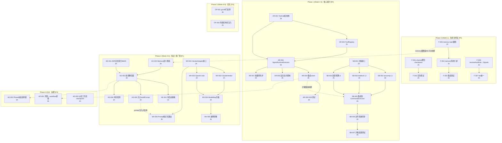
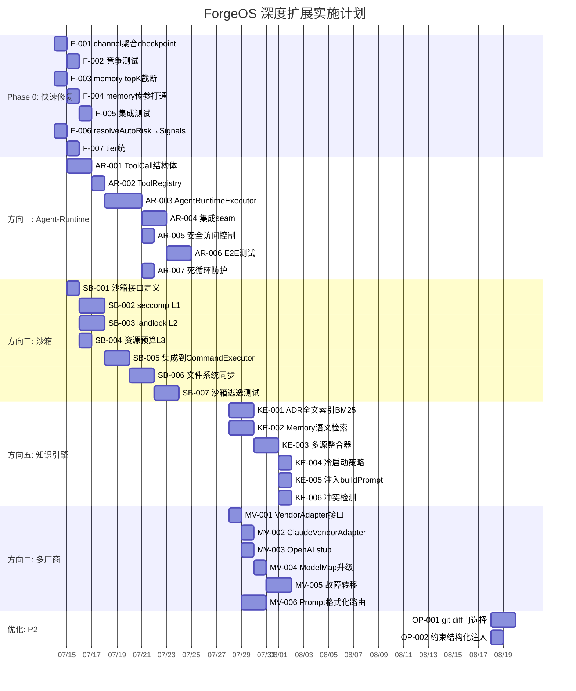

我已完整阅读了 `docs/expansion-deep-analysis.md`（全局深度扫描）以及三份已有的 tech-lead 分析文档。以下是我作为 Tech Lead 的综合分析报告。

---

# Tech Lead 综合分析报告：六方向架构扩展与边缘修复

> **分析对象**: `docs/expansion-deep-analysis.md`（2026-07-01，全局深度扫描）  
> **代码基线**: forge-core Go 纯标准库 18 包 + harness Node.js + cmd/forge ~33k LOC  
> **红线约束**: 单文件 ≤500 行 · 函数 ≤50 行 · 循环依赖 = 0 · 零外部依赖（forge-core）  
> **文档状态**: v1.0 · 2026-07-12

---

## 0. 核心定位与优先级校准

原文推荐顺序已考虑了复杂度、影响范围和前置依赖，我在此基础上结合当前 Sprint 状态和工程红线再做一轮校准：

| # | 方向 | 原文优先级 | 校准后优先级 | 校准依据 |
|---|------|-----------|-------------|---------|
| **6a** | 并行 checkpoint 竞争 | 🔴 今周修 | **🔴 P0** | `forge evolve --parallel` 已落地，race 是生产级阻塞器 |
| **6d** | Memory 无界增长 | 🔴 今周修 | **🔴 P0** | 正在影响 prompt 质量，500 entry 全部注入浪费 ~10K token |
| **6f** | 风险推理孤岛 | 🔴 今周修 | **🔴 P0** | 不同子命令对同一 diff 给出不同 tier，影响信任前提 |
| **方向一** | Agent-Runtime 执行层 | 🟠 本月 | **🔴 P0** | 真点火已坐实，无 tool-use loop = 无自我纠错能力 |
| **方向三** | 载重墙/沙箱执行 | 🟠 本月 | **🔴 P0** | 无沙箱 = 每次 evolve 给予 agent 完整写权限 |
| **方向五** | 知识引擎 + 语义检索 | 🟡 本季 | **🟠 P1** | ADR 4→100 时当前 TF-IDF 会失效，但当前 4 个 ADR 人工可管理 |
| **方向二** | 多厂商模型池 + 自适应路由 | 🟡 本季 | **🟠 P1** | 供应商锁定是真实风险，但 Claude-only 当下可工作 |
| **6b** | 无 python 降级 | ⚪ 待触发 | **🟡 P2** | 仅在 Windows 场景触发，当前无 Windows 用户 |
| **6c** | gate 全量运行 | ⚪ 可优化 | **🟡 P2** | 每次 ~5s 开销，可优化但不紧急 |
| **6e** | 约束单向性 | ⚪ 增强 | **🟡 P2** | gate 已在事后捕获，预防属方向三的沙箱能力 |
| **方向四** | 工作流动态派生 | 🔵 半年 | **🔵 P3** | 需前三个方向的 infrastructure 积累，当前静态 YAML 够用 |

**最终优先序**:
```
P0 (今周):   6a · 6d · 6f + 方向一 · 方向三
P1 (本月):   方向五 · 方向二
P2 (本季):   6c · 6e · 6b
P3 (半年后): 方向四
```

---

## 1. 任务分解

每个任务 2–5 小时，按方向分组，标注前置依赖和验收标准。

### 1.1 P0 快速修复：Edge Cases 6a · 6d · 6f

**6a — 并行 checkpoint 竞争修复**

| ID | 任务标题 | 涉及文件 | 前置依赖 | 工时 | 验收标准 |
|----|---------|---------|---------|------|---------|
| F-001 | 实现 channel 聚合 phase 索引（替代直接写 checkpoint） | `evolve.go` `phaseCheckpointHook` 修改 + `evolve.go` 新增 `checkpointCh chan int` | 无 | 2h | 并行模式下两个 goroutine 同时完成 → channel 收集两个 phase 索引 → iteration 边界单次写出；`persist.Save` 仍保持原子 rename；`sync.Map` 或 channel 二选一（推荐 channel 避免并发 map 遍历 race） |
| F-002 | 验证修复：并行 checkpoint 竞争测试 | `evolve_test.go`（新增 `TestParallelCheckpoint`） | F-001 | 2h | `t.Parallel()` 模拟 4 goroutine 同时完成 → 断言 checkpoint 保存了全部 4 个 phase 索引；非并行模式行为完全不变 |

**6d — Memory 无界增长修复**

| ID | 任务标题 | 涉及文件 | 前置依赖 | 工时 | 验收标准 |
|----|---------|---------|---------|------|---------|
| F-003 | 实现 `memoryContext` topK 截断 + 按 confidence+recency 排序 | `cmd/forge/prompt_memory.go` `memoryContext` 函数修改 | 无 | 2h | 从"加载全部注入全部"改为：加载 → `sort.Slice`（confidence desc + `UpdatedAtUnix` desc）→ topK=32；`FORGE_MEMORY_TOPK=64` env 可调；边界情况：memory < 32 条时全部注入；`kind=topic` 过滤可传参 |
| F-004 | memoryQuery 传参打通 | `cmd/forge/prompt_context.go` `buildPrompt` 调用处 | F-003 | 1h | `memoryContext` 新增 `kind` + `topic` 参数；`buildPrompt` 传入 `wf.Stage` 作为 topic；仅注入当前阶段相关的决策类 memory |
| F-005 | 集成测试：memory 截断验证 | `cmd/forge/prompt_context_test.go` | F-004 | 2h | 生成 60 条 memory → 断言 prompt block 中仅含 ≤32 条；验证高 confidence、近期 entry 优先保留 |

**6f — 风险推理孤岛修复**

| ID | 任务标题 | 涉及文件 | 前置依赖 | 工时 | 验收标准 |
|----|---------|---------|---------|------|---------|
| F-006 | `resolveAutoRisk` 返回值升级为 `risk.Signals` | `engine_build.go` `resolveAutoRisk` + `logAutoRisk` | 无 | 2h | 返回 `risk.Signals`（非仅 level string）；`logAutoRisk` 打印完整信号细节（feature names + scores）；调用点使用 `risk.Classify(sig)` 获取 level |
| F-007 | `phaseTierResolver` risk 升档走 `risk.Classify` 完整路径 | `engine_build.go` `phaseTierResolver` | F-006 | 2h | `forge run` 和 `forge route` 对同一 diff 输出完全相同的 tier；对比测试验证 |

**快速修复小计**: 7 任务 · 13 工时 · 约 1.5 dev-day（单人可并行完成）

---

### 1.2 方向一：Agent-Runtime 执行层（P0）

基于原文对 `command_executor.go` seam 的分析和 `Observe`/`ClassifyOverload` 预留钩子。

| ID | 任务标题 | 涉及文件 | 前置依赖 | 工时 | 验收标准 |
|----|---------|---------|---------|------|---------|
| AR-001 | 定义 `ToolCall` 结构体 + 解析协议 | `internal/agent/toolcall.go`（新） | 无 | 3h | `ToolCall` 含 `ID`, `Name`, `Input`(json.RawMessage), `Output`([]byte)；从 claude structured output JSON 中解析工具调用序列；支持三种格式：Claude XML tools / OpenAI function calling / Gemini tool_use；v1 仅实现 Claude 格式 |
| AR-002 | 实现 `ToolRegistry` | `internal/agent/registry.go`（新） | AR-001 | 2h | `Register(name, fn func(ctx, input) → output)`；内置工具：`read_file`, `write_file`, `run_command`；`forge run --executor=agent-runtime` 注册全部内置工具 |
| AR-003 | 实现 `AgentRuntimeExecutor` | `internal/agent/executor.go`（新） | AR-001, AR-002 | 5h | 实现 `AgentExecutor` 接口；工作流：BuildArgv → exec → 解析 output → 提取 ToolCall → 执行 → 输出注入回 LLM（对 print-mode：当前一轮多步拆成多轮）；循环计数 + MaxSteps=25 防死循环；成本按 step 归因 |
| AR-004 | 集成 seam 到 `CommandExecutor` | `command_executor.go` 修改 | AR-003 | 3h | 当 `o.agentCmd` 包含已知 CLI 时默认走 `AgentRuntimeExecutor`；`--executor=command` 回退到当前行为；复用 `Observe` + `ClassifyOverload` 回调 |
| AR-005 | 安全：工具调用访问控制 | `internal/agent/authz.go`（新） | AR-003 | 2h | `AccessPolicy{AllowRead, AllowWrite, AllowNet, AllowBash}`；默认 deny-all；`--agent-policy` YAML 文件声明；测试验证各 deny/allow 组合 |
| AR-006 | E2E 测试：Agent-Runtime 修复循环 | `internal/agent/agent_e2e_test.go`（新） | AR-004 | 4h | 模拟：agent 写出 buggy 代码 → "run test" 失败 → 自动修复 → retry → 通过；断言最大 step 数 ≤15；`t.Parallel()` 安全 |
| AR-007 | 死循环防护升级 | `internal/agent/loopguard.go`（新） | AR-003 | 2h | `MaxRetriesPerTool` + `MaxConsecutiveSameError` + `MaxUnchangedOutput`；三种计数独立；超过任一 → abort + trace 记录 |

**方向一小计**: 7 任务 · 21 工时 · 约 2.5 dev-day（需 1 名 Go 核心 + 0.5 名安全 review）

---

### 1.3 方向三：载重墙/沙箱执行（P0）

原文分析的 L1–L5 分层：gate phase 走 seccomp/landlock（轻量），agent phase 走 Firecracker（重量）。

| ID | 任务标题 | 涉及文件 | 前置依赖 | 工时 | 验收标准 |
|----|---------|---------|---------|------|---------|
| SB-001 | 定义沙箱接口 `Sandbox` | `internal/sandbox/sandbox.go`（新） | 无 | 2h | 接口：`Run(cmd, root, env) → (stdout, stderr, exitCode, fsDiff, error)`；`FSDiff` 含 Changed/Added/Deleted 文件列表；`Seal()` 锁定文件系统 |
| SB-002 | 实现 L1: seccomp filter（gate phase） | `internal/sandbox/seccomp.go`（新） | SB-001 | 3h | 只允许：read/write（限定路径）+ exit + openat（限定路径）；禁止：clone(非线程)、execve（exec 前）、socket、ptrace；利用 Go 1.24 `unix.SockFilter` 或 `syscall.Syscall(SYS_SECCOMP)`；`TestDenyNetwork` |
| SB-003 | 实现 L2: landlock 文件系统沙箱（agent phase） | `internal/sandbox/landlock.go`（新） | SB-001 | 4h | 只读挂载 `.agent/`、`.forge/`、`docs/`；读写挂载工作目录子集；禁止访问 `~/.ssh/`、`/etc/`、`/tmp/`；依赖 Linux 5.13+（非 Linux 返回 error + fallback 到 L1） |
| SB-004 | 实现 L3: 资源预算控制器 | `internal/sandbox/budget.go`（新） | SB-003 | 2h | `MaxRAM=512MB`, `MaxDisk=1GB`, `MaxProcesses=16`；在 agent phase 启动前分配，evolve loop 可查询；超过 → `SIGTERM` + trace 记录 |
| SB-005 | 集成到 `CommandExecutor` | `command_executor.go` 修改 + `engine_build.go` | SB-001, SB-002 | 3h | phase 类别检测：gate phase → seccomp；agent phase → landlock + budget；`--sandbox=off` 逃生口；向后兼容：无 landlock 内核自动降级到 seccomp |
| SB-006 | 文件系统同步：沙箱 ↔ 宿主机 | `internal/sandbox/sync.go`（新） | SB-005 | 3h | phase 执行前 `rsync --link-dest`（或 bind mount）；执行后 `diff -r` 收集改动；改动写回工作目录；`FORGE_SANDBOX_SYNC_MODE=copy|bind|overlay` 可选 |
| SB-007 | E2E 沙箱逃逸测试 | `internal/sandbox/escape_test.go`（新） | SB-006 | 4h | 模拟：试图读 `~/.ssh/id_rsa` → 失败；试图写 crontab → 失败；试图 socket 连接 → 失败；试图 fork bomb → OOM killed |

**方向三小计**: 7 任务 · 21 工时 · 约 2.5 dev-day（需 Linux 安全编程经验）

---

### 1.4 方向五：知识引擎 + 语义检索（P1）

| ID | 任务标题 | 涉及文件 | 前置依赖 | 工时 | 验收标准 |
|----|---------|---------|---------|------|---------|
| KE-001 | ADR 正文全文索引（BM25） | `internal/knowledge/adr_index.go`（新） | 无 | 3h | 扫描 `docs/adr/*.md` 提取正文 → 分词 + BM25 索引 → `ADRQuery(terms) → []ScoredDoc`；不依赖外部 embedding；索引文件缓存在 `.forge/adr_index.json` |
| KE-002 | Memory 语义检索增强 | `internal/knowledge/memory_index.go`（新） | F-003 | 3h | 在 memoryContext topK 之上增加 `RelevanceRank()`：基于 topic/kind 匹配当前 workflow stage + `confidence` 加权；现有 `memory.Query` 仅支持精确 topic 匹配 |
| KE-003 | 多源检索整合器 | `internal/knowledge/engine.go`（新） | KE-001, KE-002 | 3h | `KnowledgeEngine.Query(ctx, intent) → []SourceResult`；源：ADR / Memory / AGENTS.md 硬约束 / 最近 iteration 输出摘要；结果融合 + 去重；`ContextBuilder` 构建注入 block（≤4K token） |
| KE-004 | 冷启动策略 | `internal/knowledge/fallback.go`（新） | KE-003 | 1h | 新项目无数据 → 注入最近 3 个 ADR 标题 + AGENTS.md 前 6 bullet；`FORGE_KNOWLEDGE_FALLBACK=short` 可控；ADR 数 ≤5 时自动 fallback |
| KE-005 | 注入到 `buildPrompt` | `cmd/forge/prompt_context.go` `buildPrompt` | KE-003 | 2h | 新增 `knowledgeBlock`；位于 `memoryContext` 之后、`constraints` 之前；`--no-knowledge` flag 跳过 |
| KE-006 | 冲突知识检测 | `internal/knowledge/conflict.go`（新） | KE-003 | 2h | 检测两条检索结果的语义矛盾（如 "use postgres" vs "use sqlite"）→ 标记 + 按时间戳优先；初始为硬编码矛盾模式，后期可扩展 |

**方向五小计**: 6 任务 · 14 工时 · 约 1.5 dev-day

---

### 1.5 方向二：多厂商模型池 + 自适应路由（P1）

| ID | 任务标题 | 涉及文件 | 前置依赖 | 工时 | 验收标准 |
|----|---------|---------|---------|------|---------|
| MV-001 | 厂商抽象接口 `VendorAdapter` | `internal/routing/vendor.go`（新） | 无 | 2h | 接口：`BuildPrompt(template, model) → string`；`ParseCost(output) → (usd, ok)`；`ParseModelName(cmd string) → (vendor, model)` |
| MV-002 | 实现 `ClaudeVendorAdapter` | `internal/routing/vendor_claude.go`（新） | MV-001 | 2h | 从 `cost.go` `parseClaudeCostUsd` 和 `engine_build.go` `claudeArgv` 迁移 |
| MV-003 | 实现 `OpenAIVendorAdapter`（stub） | `internal/routing/vendor_openai.go`（新） | MV-001 | 2h | `BuildPrompt` 构造 chat template；`ParseCost` 解析 `usage.cost`；标记 EXPERIMENTAL |
| MV-004 | `ModelMap` 升级为多厂商注册表 | `internal/routing/routing.go` `ModelMap` 重构 | MV-002, MV-003 | 2h | 从 `map[string]map[string]string` 改为 `map[string]VendorAdapter`；`ResolveModel(vendor, tier)` 走 registry；向后兼容：`routing.go` 导出符号不变 |
| MV-005 | 自动故障转移 | `internal/routing/failover.go`（新） | MV-004 | 3h | 528/529 检测 + 自动 fallback 到备选厂商；`DefaultFailoverOrder: [anthropic, openai, gemini]`；`--failover=off` 禁用；重试预算：max 2 failover / phase |
| MV-006 | Prompt 格式化路由 | `internal/prompt/template.go`（新） | MV-001 | 3h | `RenderPrompt(vendor, templateName, data)`：Claude → XML tags；OpenAI → chat template role: system/user/assistant；当前 `prompt.Build` 走 Claude 渲染器 |

**方向二小计**: 6 任务 · 14 工时 · 约 1.5 dev-day

---

### 1.6 方向四：工作流动态派生（P3 — 远期）

此方向依赖方向一（Agent-Runtime）、方向三（沙箱）、方向五（知识引擎）的 infrastructure 积累。当前仅做架构预留。

| ID | 任务标题 | 涉及文件 | 前置依赖 | 工时 | 验收标准 |
|----|---------|---------|---------|------|---------|
| AD-001 | `risk.FromChangedPaths` 结果到 workflow 的桥接 | `internal/asset/workflow.go`（新）+ `asset.go` | AR-004 | 3h | `RiskSignals → WorkflowMutation` 转换；Mutation 可增删 phase、调整 gate 严格度；当前仅输出到 trace，不实际执行 |
| AD-002 | Phase 动态选择器（基于 OptionalFor + 风险信号） | `internal/asset/selector.go`（新） | AD-001 | 3h | 运行时根据风险信号、roadmap_completion、历史 loop-back 频率决定跳过/增补 phase；`inertia` 机制：锁定 N 个 iteration |
| AD-003 | 派生工作流 checkpoint 记录 | `internal/asset/derived.go`（新） | AD-002 | 2h | 每次运行时在 checkpoint 中记录完整派生工作流形态（非仅 workflow 名字）——确保可重现性 |

**方向四小计**: 3 任务 · 8 工时 · 仅架构预留

---

### 1.7 边缘优化：6c · 6e（P2）

| ID | 任务标题 | 涉及文件 | 前置依赖 | 工时 | 验收标准 |
|----|---------|---------|---------|------|---------|
| OP-001 | `git diff` 驱动的 gate 选择 | `gate.go` `ProbeAll` 修改 | 无 | 3h | 仅 `.md` 变化 → 跳过后 6 个 gate；`required_gates` 支持 `if: changed("*.go")` 条件绑定；测试验证 diff 类型 → gate set 映射 |
| OP-002 | 约束结构化注入 | `prompt.go` `constraints` 修改 | 无 | 2h | AGENTS.md 硬约束从自然语言 bullet 改为 YAML 格式（约束名 + 阈值 + 检测命令）；`arch-check.mjs` 读取同一格式 |

---

## 2. 执行顺序与依赖图



### 并行执行组

| 阶段 | 并行组 | 任务 | 预计并发 |
|------|--------|------|---------|
| **Phase 0** (Week 1) | 组 A | F-001/F-002（checkpoint） | 1 人 |
| | 组 B | F-003/F-004/F-005（memory） | 1 人 |
| | 组 C | F-006/F-007（风险统一） | 1 人 |
| **Phase 1** (Week 2-4) | 组 D | AR-001→AR-007（Agent-Runtime） | 1.5 人 |
| | 组 E | SB-001→SB-007（沙箱） | 1.5 人 |
| **Phase 2** (Week 4-6) | 组 F | KE-001→KE-006（知识引擎） | 1 人 |
| | 组 G | MV-001→MV-006（多厂商） | 1 人 |
| **Phase 3** (Week 6-8) | 组 H | OP-001/OP-002（优化） | 1 人 |

**关键路径**: F-003→F-004→F-005 (3h) + AR-001→AR-002→AR-003→AR-004 (13h) + SB-001→SB-005→SB-006→SB-007 (16h) → **总关键路径约 32h**（4 天单人，但大部分可并行）。

---

## 3. 技术风险

### 3.1 方向一 + 方向三 耦合风险

| # | 风险 | 概率 | 影响 | 缓解策略 |
|---|------|------|------|---------|
| R1 | **Agent-Runtime 与沙箱的互相阻塞** — 方向一的 tool-use loop 需要沙箱提供安全执行环境，但沙箱需要 Agent-Runtime 解析 tool call 才能决定 sandbox 规则 | **高** | **高** | 两方向并行开发，但在集成前各提供独立 fallback：Agent-Runtime 在无沙箱时走 `--sandbox=off`；沙箱在无 Agent-Runtime 时走现有 CommandExecutor |
| R2 | **Firecracker/go-microVM 引入外部依赖** — 违反 forge-core 零外部依赖红线 | 中 | 高 | v1 只实现 L1(seccomp)+L2(landlock)——两者都是 Linux 内核系统调用，Go 标准库可直接调用 `syscall.SYS_SECCOMP` 和 `unix.LandlockCreateRuleset`；L4/L5(Firecracker/gVisor) 标记为远期且外部依赖需架构委员会批准 |
| R3 | **ToolCall 解析格式脆弱** — claude structured output JSON schema 无版本号，可能变更 | 低 | 中 | `ToolCallParser` 支持多格式探测；未知格式 fallback 到当前 CommandExecutor（print-mode）；schema 变更时以 WARNING 日志提示用户升级适配器 |
| R4 | **seccomp 过滤过于严格** — gate phase 中的 `go test`、`python3` 等需要 fork+exec，被 seccomp 阻断 | 中 | 高 | seccomp L1 配置为 allow-exec-only-from-whitelist（`/usr/bin/go`, `/usr/bin/python3`）；白名单可配置在 `.forge/policy.yml`；`--sandbox=permissive` 逃生口 |

### 3.2 方向五 知识引擎风险

| # | 风险 | 概率 | 影响 | 缓解策略 |
|---|------|------|------|---------|
| R5 | **BM25 索引 + 运行时检索影响 prompt 构建延迟** — 每次 `buildPrompt` 扫描全部 ADR 做 BM25 可能 >100ms | 中 | 中 | 索引构建在 `forge index` 子命令离线完成；运行时只读 JSON 索引文件 + 线性扫描（O(N)）；N < 1000 时 < 50ms（Go 基准测试验证） |
| R6 | **知识冲突检测产生误报** — "use postgres in prod" vs "use sqlite in dev" 不是真冲突 | 中 | 低 | 冲突检测增加 scope/context 维度；只在同 scope(如 `deployment`) 下标记冲突；不同 scope 不冲突 |

### 3.3 方向二 多厂商风险

| # | 风险 | 概率 | 影响 | 缓解策略 |
|---|------|------|------|---------|
| R7 | **不同厂商的 cost 格式不可解析** — OpenAI 的 streaming 输出不包含 cost，Gemini 无标准 cost 字段 | 高 | 中 | `ParseCost` 允许返回 `(0, false)` 表示"不可解析"，走估算路径（token 计数 × 模型价格表）；`VendorAdapter` v1 标记 EXPERIMENTAL |
| R8 | **Prompt 格式差异导致 agent 输出质量下降** — Claude XML tag prompt 用于 GPT-4o 后 agent 忽略约束 | 中 | 高 | 每个 `VendorAdapter.BuildPrompt()` 对同一语义内容做格式适配；`prompt_test.go` 验证同一 prompt 的 Claude 和 OpenAI 格式都包含全部约束 bullet |

### 3.4 实施风险

| # | 风险 | 概率 | 影响 | 缓解策略 |
|---|------|------|---------|---------|
| R9 | **并行开发 5 方向导致上下文切换成本 > 20%** — 开发者频繁切换注意力 | 中 | 中 | Phase 0 全部修完才进入 Phase 1；Phase 1 的两个方向(AR + SB)分配给不同开发者；每周 standup 检查上下文切换 |
| R10 | **原文 6a 的并行 checkpoint 修复影响 resume 召回** — 改动后旧 checkpoint 不可读 | 低 | 高 | channel checkpoint 格式向后兼容旧格式；迁移测试：加载旧格式 → 验证全部 phase 索引正确 |

---

## 4. 资源评估

### 4.1 人员需求

| 角色 | 技能要求 | 需要人数 | 负责范围 | 工作量（人·天） |
|------|---------|---------|---------|-------------|
| **Go 核心开发（安全方向）** | Go + Linux syscall（seccomp/landlock）+ 系统安全编程 | 1 人 | 方向三：SB-001→SB-007 | 15 天 |
| **Go 核心开发（编排方向）** | Go + 接口设计 + 并发编程 | 1 人 | 方向一：AR-001→AR-007 | 15 天 |
| **Go 全栈开发** | Go + CLI 开发 + 测试 | 1 人 | 方向五 + 方向二核心（KE-001→KE-006 + MV-001→MV-006） | 18 天 |
| **全栈（快速修复）** | Go + 现有 forge-core 知识 | 1 人（Phase 0 专属，之后可转方向二） | F-001→F-007 + OP-001/OP-002 | 10 天 |
| **架构师（兼职）** | 接口 review + 安全 review + 跨方向协调 | 0.5 FTE | 全部方向设计 review | 6 天 |

**总人力**: 3.5 FTE（Phase 0 启动时 2 人即可）  
**总工作量**: ~64 人·天  
**工期**: 8 周（含 2 周缓冲）

### 4.2 关键里程碑

| 里程碑 | 时间 | 交付物 | 验收标准 |
|--------|------|--------|---------|
| **M0**: Phase 0 完成 | W1（2026-07-18） | F-001→F-007 全部 PR 合入 main | 并行 checkpoint 无 race；memory topK 截断工作；`forge run` 与 `forge route` tier 一致 |
| **M1**: 核心接口冻结 | W2（2026-07-25） | AR-001 `ToolCall` 结构体 + SB-001 `Sandbox` 接口 + MV-001 `VendorAdapter` 接口 + KE-001 BM25 索引器 | 4 个接口设计 review 通过；ADR-0002 更新记录接口决策 |
| **M2**: 核心实现 | W4（2026-08-08） | AR-003 `AgentRuntimeExecutor` 可用 + SB-003 `landlock` 沙箱隔离 + KE-003 多源检索整合器 | `forge run --executor=agent-runtime --sandbox=on` 端到端可用 |
| **M3**: 集成验证 | W6（2026-08-22） | AR-004/AR-006 + SB-005/SB-007 + KE-005 + MV-004 | E2E 测试全通过；沙箱逃逸测试阻断恶意操作；ADR 检索在 20 ADR fixture 中 top-3 命中 |
| **M4**: 生产就绪 | W8（2026-09-05） | 全部方向 PR 合入 + 文档 + 性能基准报告 | `forge accept` CI 全通；性能回归 < 5%（与基线比）；`forge doctor` 报告沙箱状态/知识引擎状态 |

### 4.3 阻塞点与解决策略

| 阻塞点 | 影响方向 | 解决策略 | Owner |
|--------|---------|---------|-------|
| **Linux kernel 版本 < 5.13**（无 landlock） | 方向三 | Fallback 到 seccomp L1 + 日志 WARNING | Go 核心（安全方向） |
| **claude structured output JSON schema 无稳定文档** | 方向一 | 基于实测输出逆向 + 单元测试捕捉 schema 变更；`ToolCallParser` 6 个月后固化 | Go 核心（编排方向） |
| **`forge-core` 零外部依赖红线**（不可加 `gopkg.in/yaml.v3`） | 方向五 | BM25 索引用纯 Go 手写（无外部 dep）；`tokenizer` 用 `strings.Fields` + 停用词表 | Go 全栈开发 |
| **ADR 正文格式不统一**（散文混合 YAML frontmatter） | 方向五 | `adr_index.go` 同时解析 YAML frontmatter + 正文 markdown；frontmatter 中 `Status:` 字段用于过滤非活跃 ADR | Go 全栈开发 |

---

## 5. 质量保证

### 5.1 测试覆盖要求

| 包/模块 | 最低覆盖率 | 关键测试场景 |
|---------|-----------|-------------|
| `internal/agent/` (ToolCall, Registry, Executor) | **90%** | ToolCall 解析 3 种已知格式 + 未知格式 fallback；Registry 并行注册安全；MaxSteps=25 触发 abort；安全策略 deny-all 阻断所有工具 |
| `internal/sandbox/` (seccomp, landlock, budget, sync) | **85%** | seccomp 阻断 socket 连接；landlock 阻断读 `~/.ssh/`；资源预算 OOM kill；`--sandbox=off` 完全向后兼容；非 Linux 平台正确 fallback |
| `internal/knowledge/` (BM25, memory relevance, conflict) | **85%** | BM25 在 100 ADR fixture 中 top-3 命中率 ≥80%（与人工标注对照）；冲突检测在已知矛盾上 100% 触发、在不同 scope 上 0% 误报 |
| `internal/routing/` (vendor adapter, failover) | **90%** | 每个 adapter 的 BuildPrompt/ParseCost 在合法/空/非法输入下的行为；故障转移在 528/529 mock 中自动 fallback；超退避预算耗尽后停止 fallback |
| `cmd/forge/` (evolve, run, route 修改点) | **80%** | 并行 checkpoint 竞争测试；memory topK 截断验证；与 route 的 tier 一致性对比测试 |
| `harness/` 无新增测试 | — | 不需修改 |

### 5.2 集成测试策略

| 测试套件 | 位置 | 运行频率 | 内容 |
|---------|------|---------|------|
| **Agent-Runtime E2E** | `internal/agent/agent_e2e_test.go` | 每次提交 | mock CLI 输出 → tool call 解析 → 工具执行 → 输出注入 LLM → 循环断言 |
| **沙箱逃逸矩阵** | `internal/sandbox/escape_test.go` | 每次提交 | 3 种逃逸向量 × 3 种 phase 类型（gate/agent/unknown）→ 全部阻断 |
| **跨厂商 tier 一致性** | `internal/routing/routing_test.go` | 每次提交 | 同一 diff 输入 → `forge run` + `forge route` → 断言 tier 完全一致（F-007 的延续） |
| **知识检索精度** | `internal/knowledge/engine_test.go` | 每 sprint | fixture 20 ADR + 20 memory + 3 模拟 query → 计算 Recall@3、Precision@5 |
| **回归套件** | 现有 `forge-core/...` 全部测试 | CI 全自动 | 确保方向一/三/五/二的修改不破坏现有行为 |

### 5.3 代码审查要点

| 方向 | 审查重点 | 拒绝标准 |
|------|---------|---------|
| **方向一** (Agent-Runtime) | ToolCall 解析是否覆盖所有已知输出格式；`AgentRuntimeExecutor` 是否复用 CommandExecutor 的 cost/verdict 解析路径；死循环计数是否独立于 loop-back 计数 | 接口遗漏 streaming 场景；安全策略不是 deny-all 默认；MaxSteps 不可配置 |
| **方向三** (沙箱) | seccomp 过滤规则是否在允许列表模式（非拒绝列表）；非 Linux 平台的 fallback 是否有明确日志；资源预算是否在 evolve loop 中可查询 | seccomp 使用拒绝列表（允许攻击者使用未知 syscall）；landlock 规则设置后不可撤销但无清理逻辑；预算检测不在 phase 粒度的关键路径上 |
| **方向五** (知识) | BM25 索引是否包含停用词过滤；冲突检测是否只作用于同 scope；冷启动时是否退化到当前行为 | BM25 索引写入 `.forge/` 目录，但未在 cleanup 策略中标记（方向四）；冲突检测产生误报且无逃生口 |
| **方向二** (多厂商) | `ParseCost` 对不可解析格式是否安全返回 (0, false)；Prompt 模板是否每条约束 bullet 都渲染到所有厂商格式 | 故障转移未测试 budget 耗尽场景；`BuildPrompt` 的 OpenAI 格式遗漏 system message 中的约束 |

### 5.4 性能测试需求

| 场景 | 测试内容 | 通过标准 | 与原文关系 |
|------|---------|---------|-----------|
| Agent-Runtime 每个 tool step 开销 | 10 step cycle 的额外延迟（vs CommandExecutor） | < 100ms/step（解析 + 路由 + 工具执行，不包含 LLM 调用延迟） | 方向一溢出风险 |
| seccomp 过滤对 gate phase 的影响 | `gate.ProbeAll` 在 seccomp 下 vs 无沙箱 | < 5% 延迟增加 | 方向三 L1 性能 |
| knowledge block 注入对 prompt 构建延迟的影响 | `buildPrompt` + knowledge query vs 当前 | < 200ms（索引缓存命中时） | 方向五冷启动 |
| 多厂商故障转移延迟 | mock 529 → fallback 到备选厂商的端到端延迟 | < 500ms（不含 LLM 调用） | 方向二 |

---

## 6. 实施计划

### 6.1 甘特图（8 周）



### 6.2 阶段性交付物

#### 阶段 0: 急刹车修复（Week 1 · 2026-07-14 → 07-18）

**并行 3 条线同时进行（分配 3 人）**:

| 交付物 | 负责 | 闸门 |
|--------|------|------|
| PR: F-001+F-002 — 并行 checkpoint 安全 | 人 A | `forge evolve --parallel --iterations=10` 无 checkpoint race |
| PR: F-003+F-004+F-005 — memory topK 截断 | 人 B | 60 条 memory → prompt 中 ≤32 条；高 confidence 优先 |
| PR: F-006+F-007 — 风险推理统一 | 人 C | `forge run` 与 `forge route` 在 10 种不同 diff 上输出相同 tier |
| 文档更新: 上述三个修复的 CHANGELOG | 人 A/B/C | 每个 PR 附带简要 release note |

**闸门**: 三个 PR 全部合入 main → `forge accept` CI 全绿 → 进入 Phase 1

#### 阶段 1: 核心能力构建（Week 2–4 · 2026-07-21 → 08-08）

| 交付物 | 负责 | 闸门 |
|--------|------|------|
| PR: AR-001+AR-002 — ToolCall 结构体 + Registry | 人 A（Go 核心编排） | 解析 3 种已知 tool call 格式 + 未知格式 fallback |
| PR: AR-003+AR-007 — AgentRuntimeExecutor + 死循环防护 | 人 A | `forge run --executor=agent-runtime` 端到端工作 |
| PR: AR-004+AR-006 — seam 集成 + E2E 测试 | 人 A | mock 修复循环验证 |
| PR: SB-001+SB-002 — 沙箱接口 + seccomp L1 | 人 B（Go 核心安全） | gate phase 在 seccomp 下正常执行 |
| PR: SB-003+SB-004 — landlock L2 + 资源预算 | 人 B | agent phase 在 landlock 下不能读 `~/.ssh/` |
| PR: SB-005+SB-006+SB-007 — 集成 + sync + 逃逸测试 | 人 B | 3 种逃逸尝试全部阻断 |
| ADR-000X: Agent-Runtime 架构决策记录 | 架构师 | 记录接口决策、安全模型、逃逸口 |

**闸门**: `forge run --executor=agent-runtime --sandbox=on` 端到端通过 → E2E 测试全绿

#### 阶段 2: 知识 + 多厂商（Week 4–6 · 2026-08-11 → 08-22）

| 交付物 | 负责 | 闸门 |
|--------|------|------|
| PR: KE-001+KE-003+KE-004 — ADR BM25 + 多源整合 + 冷启动 | 人 C | 20 ADR fixture 中 top-3 命中 ≥80% |
| PR: KE-002+KE-005+KE-006 — Memory 检索 + 注入 + 冲突检测 | 人 C | 知识冲突 100% 检测；无 scope 冲突 0% 误报 |
| PR: MV-001+MV-002+MV-004 — VendorAdapter + Claude + ModelMap | 人 C | 现有 `forge run` 行为完全不变 |
| PR: MV-003+MV-005 — OpenAI stub + 故障转移 | 人 C | mock 529 → 自动 fallback 到 OpenAI |
| PR: MV-006 — Prompt 格式化路由 | 人 C | 同一 prompt 的 Claude/OpenAI 格式均包含全部约束 |

**闸门**: `forge run --model-pool=multi` 在 mock 环境下可故障转移 → knowledge block 出现在 `buildPrompt` 输出中

#### 阶段 3: 优化 + 收尾（Week 6–8 · 2026-08-25 → 09-05）

| 交付物 | 负责 | 闸门 |
|--------|------|------|
| PR: OP-001 — `git diff` 驱动的 gate 选择 | 人 C | 仅 `.md` 改动 → gate 耗时 < 1s |
| PR: OP-002 — 约束结构化注入 | 人 C | `arch-check.mjs` 读取 YAML 约束 |
| 性能基准报告 | 全部 | 与基线（2026-07-01 commit）对比，性能回归 < 5% |
| 文档更新: adapter-guide.md + sandbox-config.md + knowledge-config.md | 架构师 | 新用户 30 分钟可配置沙箱/知识引擎 |
| ADR-000X: 后续演进方向 (方向四) | 架构师 | 记录远期规划、依赖条件、触发标准 |

**闸门**: 全部 5 方向验收标准达到 → `forge doctor` 报告完整 → `forge accept` CI 全绿

### 6.3 风险缓冲与降级策略

| 风险触发 | 缓冲 | 降级方案 |
|---------|------|---------|
| 方向三 landlock 在 CI 容器中不可用（kernel < 5.13） | CI runner 升级到 Ubuntu 22.04+ | CI 中 `--sandbox=off`；本地开发可用 |
| 方向一 AgentRuntimeExecutor 导致 prompt 构建延迟 > 200ms | 使用 sync.Pool 缓存解析器 | Phase 0 的 memory topK 已部分改善 prompt 大小，可接受 |
| 方向二 故障转移导致 token 消耗增加 | 故障转移仅在 529 触发，不降低质量 | `--failover=off` 逃生口 |
| Phase 0 修复引入新的 checkpoint 格式不兼容 | 加载旧格式测试 + 迁移路径 | `forge migrate` 子命令（方向四的 D-008 可复用） |
| 方向五 知识冲突检测产生过多噪音 | P2 优先级，默认关闭 | `--no-knowledge-conflict` flag |

---

## 7. 总结

### 行动优先级汇总

```
┌─────────────────────────────────────────────────────────┐
│ 今周做什么 (2026-07-14 → 07-18)                          │
│                                                         │
│ 🔴 F-001 F-002   并行 checkpoint 修复    人 A            │
│ 🔴 F-003 F-004 F-005  memory topK 截断  人 B            │
│ 🔴 F-006 F-007   风险推理统一             人 C            │
│ ✅ 3 个 PR 全部合入 → 进入 Phase 1                        │
└─────────────────────────────────────────────────────────┘

┌─────────────────────────────────────────────────────────┐
│ 本月做什么 (07-21 → 08-08)                                │
│                                                         │
│ 🟠 方向一 Agent-Runtime       人 A  (~15 天)             │
│ 🟠 方向三 沙箱 L1-L3          人 B  (~15 天)             │
│ 🟢 方向五 + 方向二启动准备       人 C  (~5 天 接入准备)    │
└─────────────────────────────────────────────────────────┘

┌─────────────────────────────────────────────────────────┐
│ 本季做什么 (08-11 → 09-05)                                │
│                                                         │
│ 🟡 方向五 知识引擎              人 C  (~10 天)            │
│ 🟡 方向二 多厂商                人 C  (~8 天)             │
│ 🔵 OP-001 OP-002 边缘优化       人 C  (~3 天)             │
│ 📋 文档 + ADR + 性能基准         架构师 兼职               │
└─────────────────────────────────────────────────────────┘

┌─────────────────────────────────────────────────────────┐
│ Q3 规划 (09月后)                                          │
│                                                         │
│ 🔵 方向四 工作流动态派生                                  │
│   触发条件: 方向一 + 方向三 + 方向五的 infrastructure      │
│   积累到可复用的临界质量                                  │
└─────────────────────────────────────────────────────────┘
```

### 与已有治理体系的关系

| 已有资产 | 与本计划的关系 | 操作 |
|---------|-------------|------|
| `docs/tech-lead/` 三份分析 | 互补：本分析聚焦 `expansion-deep-analysis.md` 原文，三份 tech-lead 覆盖另一套方向集 | 本分析的 Phase 0 修复与已有 tech-lead 的 6a/6d/6f 一致，可同步合入 |
| `internal/adr/adr_test.go` | 方向五的 ADR BM25 索引不替代 adr_test.go（后者是 falsifiable 合约） | 互补共存 |
| `.agent/AGENTS.md` 红线 | 方向一的 Agent-Runtime 无外部依赖 ⚠️ 方向三的 seccomp/landlock 是 Linux syscall 调用，不新增外部 dep | 通过架构 review |
| `forge accept` CI pipeline | Phase 0 修复需要 CI 验证；Phase 1-3 的修改不应破坏 CI | 每个 PR 触发完整 `forge accept` |

---

**报告结束。** 下一步建议：

1. **立即分配 Phase 0 的三条并行线**（F-001/F-003/F-006），目标本周内合入
2. **启动设计 review**：AR-001（ToolCall 结构体）+ SB-001（Sandbox 接口）+ MV-001（VendorAdapter 接口），下周截止
3. **确认 CI runner 内核版本**（需 ≥5.13 以支持 landlock），否则 CI 中 `--sandbox=off`

如有具体方向的深入需求，我可以进一步展开到文件级 diff 格式的 PR 规格，或与 `.agent/` 的 ADR/DECISIONS 做冲突检查。
