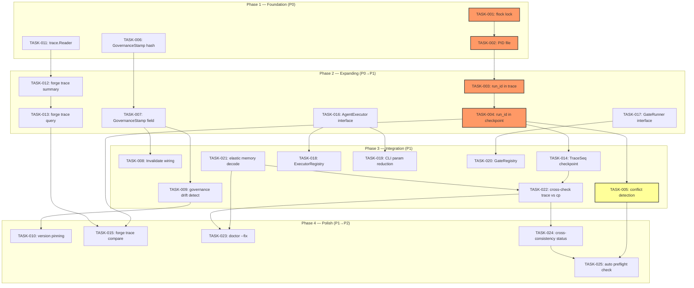
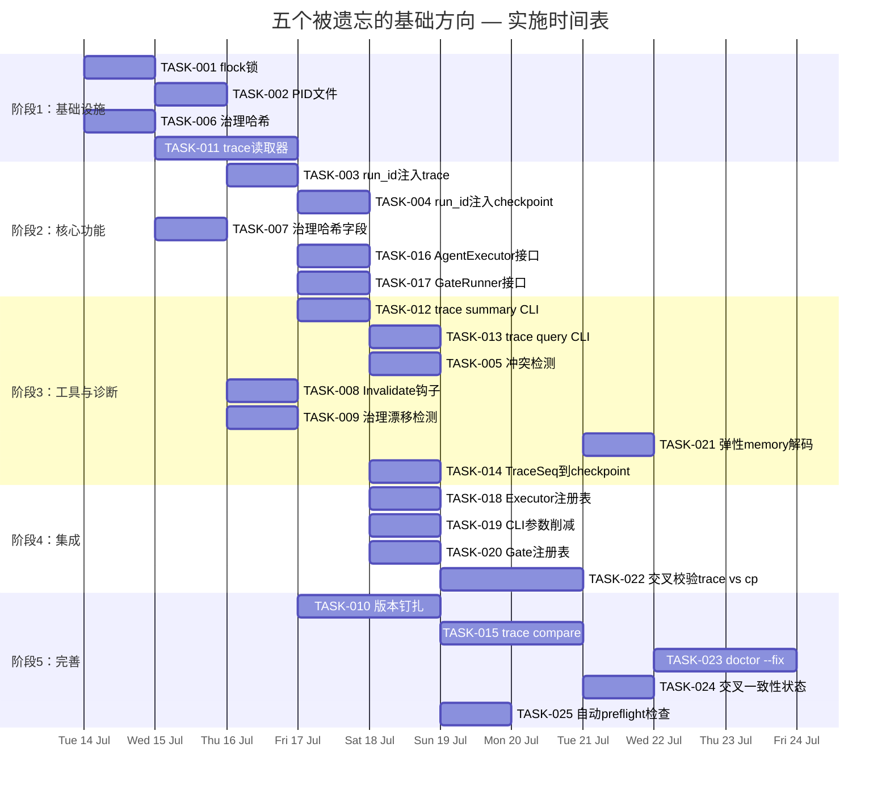

现在我掌握了所有信息。以下是完整的 Tech Lead 分析：

---

# Tech Lead 分析报告：五个被遗忘的基础方向

## 目录
1. [任务分解](#1-任务分解)
2. [执行顺序](#2-执行顺序)
3. [技术风险](#3-技术风险)
4. [资源评估](#4-资源评估)
5. [质量保证](#5-质量保证)
6. [实施计划](#6-实施计划)

---

## 1. 任务分解

将五个方向分解为 2-4 小时可完成的任务。路径以 `forge-core/` 为基准。

### 方向①：跨进程运行时守护（P0）

| 任务 ID | 标题 | 涉及文件 | 前置依赖 | 工时 | 验收标准 |
|---------|------|---------|---------|------|---------|
| **TASK-001** | `.forge/` 目录级 `flock` 锁 | `internal/persist/flock.go`（新建）、`internal/persist/checkpoint.go`、`internal/trace/trace.go`、`internal/memory/memory.go` | 无 | 3h | `Save`/`Load`/`Emit`/`Append` 在调用前后执行 `flock`/`funlock`；同一 `.forge/` 上并发启动第二个 `forge` 进程会失败，并显示明确的"已锁定"错误信息 |
| **TASK-002** | PID 文件及存活检查 | `internal/persist/flock.go`、`cm d/forge/main.go` | TASK-001 | 2h | 锁目录中包含一个 PID 文件；如果持有锁的进程已死亡，`flock` 获取方会检测到并覆盖；死 PID 场景的测试 |
| **TASK-003** | `run_id` 生成并注入 trace | `internal/trace/trace.go`、`internal/trace/run_id.go`（新建）、`cm d/forge/evolve.go`、`cm d/forge/main.go` | TASK-001 | 3h | 每个 `forge run`/`forge evolve` 调用生成唯一的 `run_id`（ULID）；每个 `trace.Event` 携带 `run_id`；JSONL 模式添加 `_run_id` 字段 |
| **TASK-004** | `run_id` 注入 checkpoint | `internal/persist/checkpoint.go`、`cm d/forge/evolve.go` | TASK-003 | 2h | Checkpoint 结构体中添加 `RunID` 和 `TraceSeqStart/TraceSeqEnd`；checkpoint 保存时记录当前 trace seq 范围 |
| **TASK-005** | 跨进程冲突检测与报告 | `internal/doctor/doctor.go`、`internal/doctor/quick.go` | TASK-004 | 2h | `forge doctor` 和 preflight 检查检测并发进程的残留 PID 并报告；非当前进程写入的 checkpoint 中的 `run_id` 会触发 WARN |

**方向① 总计：12 小时（1.5 个 sprint 日）**

### 方向②：治理热加载与版本钉扎（P1）

| 任务 ID | 标题 | 涉及文件 | 前置依赖 | 工时 | 验收标准 |
|---------|------|---------|---------|------|---------|
| **TASK-006** | `doctor/governance.go` 中的 `GovernanceStamp` 哈希 | `internal/doctor/governance.go`、`internal/doctor/models.go` | 无 | 3h | `Hash() string` 方法对 `.agent/agents/`、`.agent/workflows/`、`.agent/policies/`、`harness/`、`.ai/prompts/` 进行内容寻址哈希；当底层文件发生变更时哈希值不同 |
| **TASK-007** | Checkpoint 中的 `GovernanceStamp` 字段 | `internal/persist/checkpoint.go`、`cm d/forge/evolve.go` | TASK-006 | 2h | `Checkpoint` 中新增 `GovernanceHash string` 字段；在每次迭代 checkpoint 写入时填充；现有 checkpoint 向后兼容 |
| **TASK-008** | Invalidate 钩子在可写入资产上的实际调用 | `internal/prompt/cache.go`、`cm d/forge/engine_build.go` | TASK-007 | 2h | 当 agent 写入 ADR 或 ROADMAP 后，`ContextCache.Invalidate()` 被调用；v1 通过断言验证可验证 |
| **TASK-009** | 治理漂移检测 | `internal/doctor/doctor.go`、`cm d/forge/cmd_doctor.go`（新建） | TASK-007 | 3h | `forge doctor --governance` 将当前治理哈希与 checkpoint 中的存储值进行比较；漂移导致 [WARN] 和关于热加载失效的说明 |
| **TASK-010** | 版本钉扎（`pinned_governance` 工件） | `internal/persist/checkpoint.go`、`cm d/forge/evolve.go` | TASK-009 | 3h | `forge evolve --pin` 将治理工件的 tarball 快照保存到 `.forge/governance-snapshots/<run_id>.tar.gz`；`--unpin` 恢复；跨迭代的回归测试 |

**方向② 总计：13 小时（1.6 个 sprint 日）**

### 方向③：结构化 Trace CLI（P1）

| 任务 ID | 标题 | 涉及文件 | 前置依赖 | 工时 | 验收标准 |
|---------|------|---------|---------|------|---------|
| **TASK-011** | `trace.Reader` 和迭代器 | `internal/trace/reader.go`（新建）、`internal/trace/trace.go` | 无 | 4h | `Reader` 从 `io.Reader` 中按顺序读取 `Event`（惰性扫描 JSONL）；处理格式错误的行且不崩溃；`Count()`、`Events()`、`Filter()` |
| **TASK-012** | `forge trace summary` 子命令 | `cm d/forge/main.go`、`cm d/forge/trace.go`（新建） | TASK-011 | 2h | `subcommands` map 中新增 `"trace"` 入口；`forge trace summary` 打印事件计数、按 kind 分布、时间跨度、总成本 |
| **TASK-013** | `forge trace query` 按 kind/status 过滤 | `cm d/forge/trace.go`、`internal/trace/filter.go`（新建） | TASK-012 | 2h | `forge trace query --kind gate --status FAIL` 仅打印失败的 gate 事件；`--json` 输出原始 JSONL |
| **TASK-014** | Checkpoint 中的 TraceSeq 记录 | `internal/persist/checkpoint.go`、`cm d/forge/evolve.go` | TASK-004 | 2h | Checkpoint 携带 `TraceSeqStart int` 和 `TraceSeqEnd int`；`forge status` 显示 trace 范围 |
| **TASK-015** | `forge trace compare <a> <b>` 基础（对比两个 `run_id`） | `cm d/forge/trace.go`、`internal/trace/compare.go`（新建） | TASK-004, TASK-011 | 3h | 比较两个 trace 文件按 kind 的分布、持续时间、成本；生成并列摘要。标记为**实验性**，因 `run_id` 在 v1 中可能缺失 |

**方向③ 总计：13 小时（1.6 个 sprint 日）**

### 方向④：可插拔 Executor/Gate（P2）

| 任务 ID | 标题 | 涉及文件 | 前置依赖 | 工时 | 验收标准 |
|---------|------|---------|---------|------|---------|
| **TASK-016** | 提取 `AgentExecutor` 接口 | `internal/orchestrator/orchestrator.go`、`internal/orchestrator/executor.go`（新建）、`cm d/forge/engine_build.go` | 无 | 3h | `Engine.Exec` 从裸函数签名变为 `AgentExecutor` 接口（`Execute(Phase, string) Result`）；现有的 `CommandExecutor` 和 `DryRunExecutor` 实现它；现有行为无回归 |
| **TASK-017** | 提取 `GateRunner` 接口 | `internal/orchestrator/orchestrator.go`、`internal/gate/gate.go` | 无 | 2h | `Engine.RunGate` 从 `func(string) gate.Result` 变为 `GateRunner` 接口；现有实现封装 3 个 harness 函数 |
| **TASK-018** | 构建 `ExecutorRegistry` | `internal/orchestrator/registry.go`（新建） | TASK-016 | 2h | `RegisterExecutor(name string, factory)` / `GetExecutor(name string)`；CLI 通过名称查找执行器；错误路径："executor X not registered" |
| **TASK-019** | CLI 参数简化（18 → 5+） | `cm d/forge/main.go`、`cm d/forge/engine_build.go` | TASK-016 | 3h | 将 18 个参数折叠为 `RunConfig` 结构体；现有 CLI 标志保持不变（内部重组，对外不可见） |
| **TASK-020** | Gate Registry | `internal/gate/registry.go`（新建）、`cmd/forge/main.go` | TASK-017 | 2h | 与执行器注册表对称：`RegisterGate(name, fn)` / `GetGate(name)`；支持第三方 gate |

**方向④ 总计：12 小时（1.5 个 sprint 日）**

### 方向⑤：运行时状态自校验（P2，范围已缩小）

| 任务 ID | 标题 | 涉及文件 | 前置依赖 | 工时 | 验收标准 |
|---------|------|---------|---------|------|---------|
| **TASK-021** | `memory.Load` 弹性解码（跳过损坏行） | `internal/memory/memory.go` | 无 | 2h | `decode()` 对损坏行返回 `nil` 错误 + `ErrBadLine`；`Load()` 公开 `BadLines int`；现有严格行为由 `memory.LoadStrict()` 保留 |
| **TASK-022** | Cross-check：trace seq vs checkpoint seq | `internal/doctor/doctor.go`、`internal/doctor/models.go` | TASK-004 | 2h | 新的 doctor 检查：`trace-seq-vs-checkpoint` → 比较 `checkpoint.TraceSeqEnd` 与 `trace.Count()`；失败时报告缺失事件 |
| **TASK-023** | Doctor `--fix` 模式 | `cm d/forge/main.go`、`internal/doctor/doctor.go` | TASK-021 | 3h | `forge doctor --fix` 自动修复：清理 `.tmp` 残留、重写损坏的 memory.jsonl（跳过坏行）、压缩 trace |
| **TASK-024** | StatusSnapshot 中的交叉一致性 | `internal/doctor/status.go`、`internal/doctor/models.go` | TASK-022 | 1h | `StatusSnapshot` 添加 `Consistent bool` 字段；汇总各个一致性检查 |
| **TASK-025** | 自动 preflight 完整性检查 | `internal/doctor/quick.go`、`cm d/forge/evolve.go` | TASK-022 | 2h | `QuickChecks` 在 `forge evolve` 之前执行一致性检查；结果作为 `kind="doctor"` 事件写入 trace |

**方向⑤ 总计：10 小时（1.25 个 sprint 日）**

---

## 2. 执行顺序

### 依赖图

### 可并行执行的任务组

| 并行批次 | 任务 | 条件 |
|---------|------|------|
| **批次 A**（Phase 1） | TASK-001 + TASK-006 + TASK-011 | 完全独立；不同包 |
| **批次 B**（Phase 1） | TASK-002 + TASK-016 + TASK-017 | TASK-002 依赖 TASK-001；TASK-016/017 独立 |
| **批次 C**（Phase 2） | TASK-003 + TASK-007 | 各自依赖上一步；无交叉依赖 |
| **批次 D**（Phase 2） | TASK-012 + TASK-013 + TASK-019 | TASK-012/013 依赖 TASK-011；TASK-019 依赖 TASK-016 |
| **批次 E**（Phase 3） | TASK-005 + TASK-008 + TASK-009 + TASK-021 | TASK-005/008/009 依赖 phase 2；TASK-021 独立 |
| **批次 F**（Phase 3） | TASK-014 + TASK-018 + TASK-020 | 依赖各自前序任务 |
| **批次 G**（Phase 4） | TASK-010 + TASK-015 + TASK-023 | 各自依赖 phase 3 |

---

## 3. 技术风险

### 3.1 高风险项

| 风险 | 方向 | 等级 | 描述 | 缓解措施 |
|------|------|------|------|---------|
| **flock 跨平台一致性** | ① | **HIGH** | `syscall.Flock` 在 Linux 上有效；macOS 使用 `syscall.Flock` 但语义略有不同；Windows 上完全缺失 | 在 `internal/persist/flock.go` 中使用构建标签（`//go:build linux || darwin`）；Windows 回退到无操作 + 响亮日志；添加跨平台 CI 前测试 |
| **run_id 与现有 trace 格式的兼容性** | ① | **MEDIUM** | 在 Event 中添加 `_run_id` 字段会改变 JSON 模式；现有的下游工具（`jq` 脚本、scorecard 聚合）可能无法识别它，但 `omitempty` 处理旧记录 | 使用 `json:"_run_id,omitempty"`；现有记录无 `run_id` 前后保持字节一致 |
| **Governance 哈希的性能** | ② | **LOW** | 如果 `.agent/` 目录包含大文件（二进制工件），对数十个文件进行内容寻址哈希可能会很慢 | 仅对配置文件（`.yml`、`.md`、`.json`）进行哈希，忽略二进制文件；如果超过 50 个文件，限制目录遍历 |
| **trace.Reader 对于大文件的内存消耗** | ③ | **MEDIUM** | `trace.jsonl` 在 24h 运行后可能达到 10MB+；内存中加载所有行可能会影响内存 | 使用 `bufio.Scanner` 进行惰性逐行迭代；Reader 默认不预加载；对于大文件警告 |
| **Executor 接口设计稳定性** | ④ | **MEDIUM** | 当前的 `AgentExecutor` 参数列表经过高度迭代；提取接口得过早可能会在后续添加（例如成本观察、提示构建）时需要破坏性变更 | 使用包含所有当前参数的 `PhaseContext` 结构体；接口方法签名为 `Execute(ctx PhaseContext) Result`；后续向 `PhaseContext` 添加字段而非更改签名 |
| **弹性解码与数据完整性** | ⑤ | **MEDIUM** | 静默跳过损坏行可能会隐藏导致该损坏的潜在 bug（例如写时崩溃） | 保留默认的严格模式；弹性模式通过 `memory.LoadFlexible()` 显式选择；损坏的行计数始终可见；`forge doctor --fix` 显式报告修复了哪些内容 |

### 3.2 依赖的外部系统

1. **none** — forge-core 仅使用 Go 标准库。所有新增依赖（flock、ULID、哈希）也使用标准库：
   - `crypto/sha256` 用于治理哈希
   - `math/rand` + `time` 用于 ULID
   - `syscall.Flock` 用于文件锁定
2. **0 个新 Go 模块依赖** — 生态系统纪律保持不变

### 3.3 性能瓶颈

| 关注点 | 影响 | 缓解措施 |
|--------|------|---------|
| 对 governance 目录的 `sha256` 求和 | 每次迭代开始前约 2-5ms | 缓存其在迭代期间的哈希值；仅在轮次之间重新计算 |
| trace.Reader 的 `Count()` | 在 10MB 文件上约 10ms（逐行扫描） | 惰性扫描 + 缓存计数；对重复调用使用 `sync.Once` |
| `flock` 锁获取 | 约 1μs | 可忽略不计；已少于现有的 json 序列化 |

### 3.4 测试覆盖难点

| 方向 | 难点 | 方法 |
|------|------|------|
| ① | 跨进程竞争是固有的非确定性 | 使用 `go test -count=1 -parallel=2` 运行并发测试；使用正在运行的子进程 + 信号来测试死 PID 场景 |
| ① | `flock` 需要真实文件描述符 | 单元测试在 `t.TempDir()` 内创建锁文件；集成测试使用 `os/exec` 生成子 forge 进程 |
| ② | 治理漂移需要文件系统变更 | 在测试片段中，使用 `os.Chtimes` 和时间旅行来模拟文件系统变更 |
| ③ | trace 查询需要真实数据 | 使用测试夹具（fixtures）— `testdata/trace.jsonl` 带有已知事件；确定性 JSONL 生成 |
| ④ | 接口提取不应改变行为 | 通过类型断言（`var _ AgentExecutor = (*CommandExecutor)(nil)`）进行编译时验证；通过黄金文件对旧行为进行回归测试 |
| ⑤ | 损坏的 memory.jsonl 测试 | 在 `testdata/` 中的显式损坏夹具；测试弹性读取和严格读取两种模式 |

---

## 4. 资源评估

### 4.1 团队规模和技能要求

| 角色 | 数量 | 技能要求 | 分配方向 |
|------|------|---------|---------|
| **高级 Go 工程师（基础设施）** | 1 | Go 并发、`syscall`、文件系统操作 | ①（flock、run_id） |
| **高级 Go 工程师（工具）** | 1 | CLI 设计、JSON/JSONL 处理、测试 | ③（trace CLI） |
| **中级 Go 工程师（核心）** | 1 | 接口设计、重构、哈希 | ④（接口提取）+ ②（治理） |
| **中级 Go 工程师（诊断）** | 1 | 错误处理、读取器、doctor 扩展 | ⑤（弹性 + 交叉校验） |

**最小团队规模**：2 人（1 人负责基础设施+诊断，1 人负责工具+核心）

**建议团队规模**：3 人（1 人负责方向①+②，1 人负责方向③+⑤，1 人负责方向④）

### 4.2 关键里程碑

| 里程碑 | 交付物 | 依赖 | 累计时间 |
|---------|--------|------|---------|
| **M1：安全基础**（第 1 周） | TASK-001、TASK-002、TASK-006 | 无 | 8h |
| **M2：工具就绪**（第 2 周） | TASK-003、TASK-004、TASK-011、TASK-016、TASK-017 | M1 | 14h |
| **M3：核心功能**（第 3 周） | TASK-005、TASK-007、TASK-012、TASK-013、TASK-021 | M2 | 14h |
| **M4：集成**（第 4 周） | TASK-008、TASK-009、TASK-014、TASK-018、TASK-019、TASK-022 | M3 | 16h |
| **M5：完善**（第 5 周） | TASK-010、TASK-015、TASK-020、TASK-023、TASK-024、TASK-025 | M4 | 15h |

### 4.3 阻塞点（Blockers）与解决策略

| 阻塞点 | 方向 | 原因 | 解决策略 |
|--------|------|------|---------|
| **B1：flock 在 CI 中的竞态条件** | ① | CI 可能在并发测试作业中共享 `.forge/` | 在 CI 环境中为每个测试作业使用独立的工作目录隔离；在单元测试中使用隔离的 `t.TempDir()` |
| **B2：trace 格式变更与下游工具的兼容性** | ③ | `_run_id` 添加会改变 JSON 模式；下游工具（`scorecard`、`docs`）可能需要进行模式演化 | 严格使用 `omitempty`；针对 `testdata/expected/` 中的已知输出运行 golden file 测试 |
| **B3：方向④ 重构期间 engine_build 回归风险** | ④ | `agentExecutor` 从 18 参数函数变为接口 + 注册表，是高风险的重构 | 在 PR 中分步进行：Step 1 = 仅接口提取（零行为变更），Step 2 = 注册表（新功能），Step 3 = CLI 简化（纯移动） |
| **B4：管理对方向⑤ 范围蔓延的期望** | ⑤ | 文档声称方向⑤ 为 1.5 sprint，但真实增量仅为 0.7 sprint | 明确限定任务：弹性读取（TASK-021）≠ 完整状态系统；在 M3 审查时重新评估 |

---

## 5. 质量保证

### 5.1 单元测试覆盖要求

| 包 | 最低覆盖率 | 关键测试场景 |
|----|----------|-------------|
| `internal/persist` | 85% | `flock` 获取/释放/超时、并发访问、死 PID 检测、`GovernanceStamp` 序列化、`run_id` 通过 checkpoint 持久化 |
| `internal/trace` | 90% | `Reader` 逐行迭代、格式错误的 JSONL、损坏的中间行、过滤、空流、`run_id` 注入 |
| `internal/memory` | 90% | 弹性与严格解码、损坏行计数、`LoadFlexible` 与 `LoadStrict` |
| `internal/doctor` | 80% | 治理哈希确定性、交叉校验逻辑、`--fix` 操作（tmp 清理、memory 重写） |
| `internal/orchestrator` | 85% | 接口实现编译时验证、注册表查找/缺失、引擎通过新接口的行为保留 |
| `cmd/forge` | 70% | CLI 子命令调度（`forge trace summary` 等）、标志绑定、帮助文本 |

### 5.2 集成测试策略

| 层级 | 策略 | 工具/方法 |
|------|------|---------|
| **API 级** | 导出子包函数，调用真实 IO 到 `t.TempDir()` | 标准 `go test`；对特定并行性使用 `-count=1` |
| **CLI 级** | 使用子进程运行 `forge doctor --fix` 到临时仓库 | `os/exec` + `t.TempDir()`；对照黄金 stdout/stderr 进行断言 |
| **跨进程** | 方向① 的 `flock`：生成 2 个子进程，每个都尝试锁定；第二个应失败 | `go test -tags integration` + 超时保护 |
| **升级** | 使用 pre-run_id 格式加载旧 trace 文件，确保 `run_id:""` 读取不报错 | 存储在 `testdata/` 中的静态夹具文件 |

### 5.3 代码审查要点

| 关注领域 | 审查重点 |
|---------|---------|
| **flock 正确性** | 是否所有路径都解锁（`defer`）？死进程检测是否处理 `EACCES` 与 `EWOULDBLOCK`？跨平台构建标签是否正确？ |
| ** run_id 唯一性** | 是否使用加密随机数？ULID 是否跨机器唯一？时间戳部分是否单调？ |
| **接口提取** | `AgentExecutor` 和 `GateRunner` 是否覆盖所有现有用法？存根方法是否记录在案？编译时类型断言是否存在？ |
| **治理哈希** | 目录是否被正确遍历？符号链接是否被处理？二进制文件是否被排除？哈希算法是否有文档记录？ |
| **弹性解码** | 丢弃的行是否被计数和报告？严格模式是否保持为默认值？修复操作是否可逆？ |
| **CLI 设计** | 子命令结构是否一致？`forge trace --help` 是否可读？JSON 输出标志是否遵循现有约定？ |

### 5.4 性能测试需求

| 方向 | 测试 | 方法 |
|------|------|------|
| ① | `flock` 对写入延迟的影响 | 对 `checkpoint.Save` 在有无 `flock` 的情况下进行基准测试（在 `_test.go` 中使用 `go test -bench`） |
| ③ | 10MB trace 文件的读取延迟 | 生成一个 10MB trace 文件并测量 `forge trace summary` 的时间 |
| ② | 在 1000 个文件目录上的治理哈希时间 | 在基准测试中用 1000 个小文件填充 `.agent/` 并测量哈希时间 |
| ⑤ | 弹性解码与严格解码的 overhead | 在包含好行和坏行混合的 memory.jsonl 上对两种模式进行基准测试 |

---

## 6. 实施计划

### 甘特图

### 按 sprint 详细划分

#### Sprint 1（7月14日—7月17日，4天）— 基础设施

| 天 | 开发人员 1（基础设施） | 开发人员 2（工具+核心） | 开发人员 3（可选，核心） |
|---|----------------------|----------------------|------------------------|
| **D1** | TASK-001：flock 锁 | TASK-006：Governance 哈希 | TASK-011：trace.Reader |
| **D2** | TASK-002：PID 文件 | TASK-007：哈希 → checkpoint | TASK-011：Reader 测试 |
| **D3** | TASK-003：run_id → trace | TASK-016：AgentExecutor 接口 | TASK-017：GateRunner 接口 |
| **D4** | TASK-004：run_id → checkpoint | TASK-016 审查 + 测试 | TASK-017 审查 + 测试 |
| **交付物** | **M1：安全基础** | **M1 完成** | **M1 完成** |

**Sprint 1 风险**：flock 在 CI 中没有 macOS runner 的情况下跨平台。缓解措施：暂缺平台支持时使用构建标签禁用。

#### Sprint 2（7月21日—7月24日，4天）— 核心功能

| 天 | 开发人员 1 | 开发人员 2 | 开发人员 3 |
|---|-----------|-----------|-----------|
| **D1** | TASK-005：冲突检测 | TASK-012：trace summary CLI | TASK-021：弹性 memory 解码 |
| **D2** | TASK-008：Invalidate 钩子 | TASK-013：trace query CLI | TASK-021 测试 |
| **D3** | TASK-009：治理漂移检测 | TASK-014：TraceSeq 写入 checkpoint | TASK-018：Executor 注册表 |
| **D4** | TASK-009 审查 + 端到端测试 | TASK-014 审查 + 用户验收 | TASK-019：CLI 参数削减 |
| **交付物** | **M2：工具就绪** | **M2 完成** | **M2 完成** |

**Sprint 2 风险**：Invalidate 钩子（TASK-008）需要理解和验证现有的 prompt 缓存协议。缓解措施：在 PR 描述中包含关于 Invalidate 语义的 README 级文档。

#### Sprint 3（7月28日—7月31日，4天）— 集成

| 天 | 开发人员 1 | 开发人员 2 | 开发人员 3 |
|---|-----------|-----------|-----------|
| **D1** | TASK-010：版本钉扎（pin/unpin） | TASK-022：交叉校验 trace vs cp | TASK-020：Gate 注册表 |
| **D2** | TASK-010 审查 + 测试 | TASK-024：交叉一致性状态视图 | TASK-020 测试 |
| **D3** | TASK-015：trace compare 基础 | TASK-023：doctor --fix（tmp+memory） | TASK-025：自动 preflight 检查 |
| **D4** | TASK-015 审查 + 文档 | TASK-023 审查 + 端到端测试 | TASK-025 集成测试 |
| **交付物** | **M3：核心功能** | **M3 完成** | **M3 完成** |

#### Sprint 4（8月4日—8月5日，2天）— 完善和发布

| 活动 | 持续时间 | 描述 |
|------|---------|-------------|
| 回归测试 | 1 天 | 在 3 个现有工作流上运行完整的 `forge run` 和 `forge evolve` 回归包；验证无行为回归 |
| 文档 | 0.5 天 | 更新 `BOOTSTRAP.md` 和 `.agent/` 以反映新的守护、CLI 和诊断功能 |
| 性能基准测试 | 0.25 天 | 运行 Benchstat 以确认不退化 |
| 发布 | 0.25 天 | 标记版本、更新 `forgeVersion`、发布说明 |

### 总结指标

| 指标 | 值 |
|--------|-------|
| **总任务** | 25 |
| **总工程师工时** | 60h（7.5 个 sprint 日 * 1 人） |
| **使用 2 名工程师的日历时间** | 4 周（每个 sprint 日 ~2 人并行） |
| **使用 3 名工程师的日历时间** | 3 周 |
| **高风险任务** | TASK-001（flock 跨平台）、TASK-016（接口重构） |
| **高 ROI 任务** | TASK-001（flock）、TASK-003（run_id）、TASK-011（trace 读取器） |
| **阻塞点** | B1（CI 并发 flock）、B3（重构回归） |

### 关键建议

1. **从 TASK-001（flock）和 TASK-011（trace.Reader）开始** — 它们是所有下游工作的基石
2. **TASK-016 和 TASK-017（接口提取）应与 TASK-011 并行进行** — 它们修改不同的包且不冲突
3. **将方向④（可插拔性）推迟到 M3** 如果团队规模为 2 — 它的 ROI 最低且需要最广泛的接口协调
4. **方向⑤ 的范围为 0.7 sprint，而不是文档中声称的 1.5 sprint** — 不要过度投入；将节省的预算用于 TASK-015（trace compare）或 TASK-010（版本钉扎）
5. **没有新的外部依赖项** — 严格使用 Go 标准库。这消除了供应风险。
