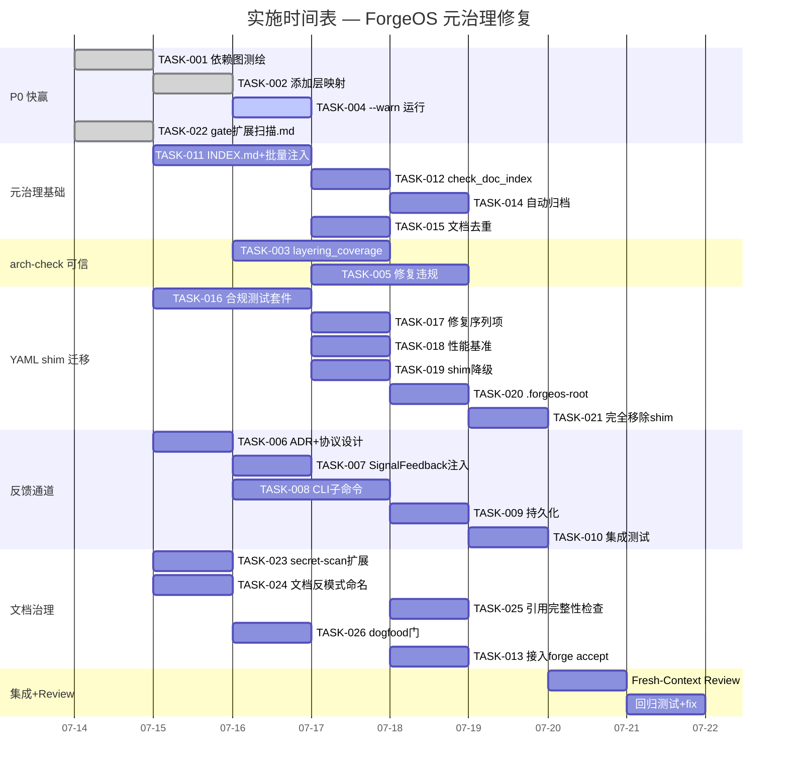

现在我已全面掌握代码库状态，以下是完整的技术负责人分析报告。

---

# Tech Lead 分析报告：ForgeOS 元治理与架构盲区

> **分析基准**: `docs/requirements/forgotten-five-meta-governance-and-blindspots.md`（583 行验证报告）
> **目标**: 将 5 个方向拆解为可执行任务，规划依赖关系，评估风险和资源需求
> **日期**: 2026-07-12
> **技术栈**: forge-core（Go 纯 stdlib）、harness（Node.js 零外部 dep）、.agent/ 声明式治理

---

## 1. 任务分解

### 方向一：arch-check 分层执法盲区修复

| 任务 ID | 标题 | 涉及文件 | 前置依赖 | 预估工时 |
|---------|------|---------|---------|---------|
| **TASK-001** | forge-core 包依赖图逆向测绘 | 无（仅分析产出 `.arch/forge-core-layers.md`） | — | 2h |
| **TASK-002** | 在 `.arch/rules.yaml` 增加 forge-core 层映射 | `.arch/rules.yaml`（`dir_aliases` + `forbidden`） | TASK-001 | 1h |
| **TASK-003** | 实现 `layering_coverage` 最低覆盖率门控 | `harness/arch/arch-check.mjs`（加聚合指标）+ `harness/arch/scan.mjs`（加 `layeredFileCount`） | TASK-002 | 3h |
| **TASK-004** | 先用 `--warn` 模式运行 layering 检查一周期 | 无（运行 + 收集违规） | TASK-002 | 0.5h |
| **TASK-005** | 修复暴露的 forge-core 层间违规（预计 2-5 处） | `forge-core/internal/*`（具体包视 TASK-004 结果） | TASK-004 | 3h |

**验收标准**: `forge accept` 中 layering 检查覆盖 ≥80% 的 forge-core 生产文件（当前 0/63），且非测试通过不携带 false PASS。

### 方向二：人机结构化反馈通道

| 任务 ID | 标题 | 涉及文件 | 前置依赖 | 预估工时 |
|---------|------|---------|---------|---------|
| **TASK-006** | `.forge/feedback/` 目录协议设计 + 数据结构定义 | `forge-core/internal/asset/feedback.go`（新建）+ `docs/adr/0005-feedback-channel.md` | — | 2h |
| **TASK-007** | `SignalFeedback` 注入收敛循环 | `forge-core/internal/converge/converge.go`（扩展 `Signals`）+ `forge-core/internal/orchestrator/loop.go`（phase 前检查） | TASK-006 | 3h |
| **TASK-008** | `forge feedback` CLI 子命令（Unix socket + 文件双通道） | `cmd/forge/feedback.go`（新建）+ `forge-core/internal/persist/`（反馈持久化） | TASK-006 | 4h |
| **TASK-009** | 反馈标记跨 run 持久化 + 重启消费 | `forge-core/internal/persist/feedback.go`（新建） | TASK-008 | 2h |
| **TASK-010** | 集成测试覆盖（fake feedback → converge MET 验证） | `cmd/forge/feedback_test.go`（新建）+ `forge-core/internal/orchestrator/loop_test.go` | TASK-007, TASK-008 | 3h |

**验收标准**: `forge feedback --inject "msg"` 在 `forge evolve` 运行中注入文本，agent prompt 出现 `[HUMAN_FEEDBACK: must]` 标记；进程重启后未消费反馈仍可用。

### 方向三：文档元治理

| 任务 ID | 标题 | 涉及文件 | 前置依赖 | 预估工时 |
|---------|------|---------|---------|---------|
| **TASK-011** | `docs/INDEX.md` 初始化 + YAML front-matter 模板 | `docs/INDEX.md`（新建）+ `docs/TEMPLATE.md`（新建）+ 全部 423 现有文档的 front-matter 批量注入 | — | 3h |
| **TASK-012** | `check.py` 增加 `check_doc_index` 检查 | `harness/check.py`（新增函数）+ `harness/test_check.py`（增测试） | TASK-011 | 2h |
| **TASK-013** | `check_doc_index` 加入 `forge accept` 聚合 | `harness/acceptance.mjs`（新增 probe） | TASK-012 | 1h |
| **TASK-014** | 自动过期/归档机制（60 天 retired → `docs/archive/`） | `harness/doc-lifecycle.mjs`（新建）+ `harness/` 配置 | TASK-012 | 2h |
| **TASK-015** | `forge doc-dedup --scan` TF-IDF 去重扫描 | `harness/doc-dedup.mjs`（新建）+ `harness/test_doc_dedup.mjs` | TASK-011 | 3h |

**验收标准**: 新增 `.md` 文件未在 INDEX.md 注册则 `forge accept` FAIL；`forge doc-dedup --scan` 输出重叠 >60% 文档对列表；归档脚本可安全移除非活跃文档。

### 方向四：Python YAML shim 运行时依赖消除

| 任务 ID | 标题 | 涉及文件 | 前置依赖 | 预估工时 |
|---------|------|---------|---------|---------|
| **TASK-016** | Go YAML 解析器合规测试套件（YAML 官方测试套件子集） | `forge-core/internal/yaml2json/yaml2json_test.go`（扩展）+ `forge-core/internal/yaml2json/testdata/`（添加） | — | 4h |
| **TASK-017** | 修复 Go 解析器的已知缺口（裸 `-` 序列项丢失已验证） | `forge-core/internal/yaml2json/sequence.go` | TASK-016（暴露缺口） | 1h |
| **TASK-018** | Go 解析器性能基准（对比 Python shim） | `forge-core/internal/yaml2json/benchmark_test.go`（新建） | TASK-016 | 1h |
| **TASK-019** | Python shim 降级为 `--use-python-shim` flag（默认关闭） | `cmd/forge/main.go`（修改 `loadWorkflow`）+ `cmd/forge/main_test.go` | TASK-016, TASK-017 | 2h |
| **TASK-020** | 用 `.forgeos-root` 替换 `yaml2json.py` 作为仓库检测标记 | `cmd/forge/main_agent_test.go`（修改检测逻辑）+ 根目录 `.forgeos-root`（新建,空文件） | TASK-019 | 1h |
| **TASK-021** | 完整移除 Python shim 和 fallback 路径 | `cmd/forge/main.go`（移除 `exec.Command("python3"...`）+ `harness/yaml2json.py`（退役到 `docs/archive/`） | TASK-019, TASK-020 | 1h |

**验收标准**: Go 解析器覆盖 100% YAML 测试套件必要子集；benchmark 比 Python shim 更快或持平；`forge run` 在无 `python3` 环境中正常加载 workflow；`main_agent_test.go` 不依赖 Python 存在。

### 方向五：ForgeOS dogfood 鸿沟修复

| 任务 ID | 标题 | 涉及文件 | 前置依赖 | 预估工时 |
|---------|------|---------|---------|---------|
| **TASK-022** | `gate.mjs` 扩展扫描 `.md` 文件 | `harness/gate.mjs`（`.md` 纳入遍历）+ `.arch/rules.yaml`（`file.max_lines` 加 `.md` 例外阈值 1000） | — | 1h |
| **TASK-023** | `secret-scan.mjs` 扩展扫描文档 | `harness/secret-scan.mjs`（接入 `.md` 文件） | TASK-022 | 1h |
| **TASK-024** | `arch-check` 文档反模式命名检查（版本号重复文件名） | `harness/arch/arch-check.mjs`（`checkAntiPatterns` 扩展） | — | 2h |
| **TASK-025** | `harness/doc-ref-check.mjs` 文档链接完整性检查 | `harness/doc-ref-check.mjs`（新建）+ `harness/test_doc_ref_check.mjs`（新建） | TASK-011（INDEX.md 就绪后才有意义） | 2h |
| **TASK-026** | 自我 dogfood 门：`forge accept` 自身在 CI 中 PASS | `.github/workflows/forge.yml`（启用）+ 过渡期 flags | TASK-022, TASK-023, TASK-024, TASK-025 | 1h |

**验收标准**: 文档中的硬编码 URL/令牌被 `secret-scan` 检出；`v2.md`/`v3.md`/`v35.md` 模式文件被 `arch-check` 告警；文档中悬挂链接被引用检查标记。

---

## 2. 执行顺序与依赖图

```mermaid
graph TD
    %% === 方向一 ===
    T001[TASK-001: 包依赖图测绘] --> T002[TASK-002: 添层映射+rules]
    T002 --> T003[TASK-003: layering_coverage门控]
    T002 --> T004[TASK-004: --warn 运行一周期]
    T004 --> T005[TASK-005: 修复暴露违规]
    
    %% === 方向二 ===
    T006[TASK-006: 反馈协议设计+ADR] --> T007[TASK-007: SignalFeedback注入收敛]
    T006 --> T008[TASK-008: forge feedback CLI]
    T007 --> T009[TASK-009: 反馈持久化]
    T008 --> T009
    T007 --> T010[TASK-010: 集成测试]
    T008 --> T010
    
    %% === 方向三 ===
    T011[TASK-011: INDEX.md+front-matter批量注入] --> T012[TASK-012: check_doc_index]
    T012 --> T013[TASK-013: 接入forge accept]
    T012 --> T014[TASK-014: 自动过期归档]
    T011 --> T015[TASK-015: forge doc-dedup]
    
    %% === 方向四 ===
    T016[TASK-016: YAML合规测试套件] --> T017[TASK-017: 修复裸-序列项]
    T016 --> T018[TASK-018: 性能基准]
    T016 --> T019[TASK-019: shim降级为flag]
    T019 --> T020[TASK-020: .forgeos-root替换检测标记]
    T019 --> T021[TASK-021: 移除shim+fallback]
    T020 --> T021
    
    %% === 方向五 ===
    T022[TASK-022: gate.mjs扫描.md] --> T023[TASK-023: secret-scan扩展文档]
    T024[TASK-024: 文档反模式命名] --> T026[TASK-026: 自我dogfood门]
    T011 -.-> T025[TASK-025: 文档引用完整性检查]
    T025 --> T026
    T023 --> T026
    T012 --> T026

    %% === 跨方向依赖 ===
    T002 -.->|layering修复后| T005
    T012 -.->|check_doc_index是基础| T025
    T003 -.->|arch-check可信后| T026
    
    %% === 可并行分组 ===
    subgraph GroupA[可并行：独立基础设施]
        T001
        T006
        T011
        T016
        T022
        T024
    end

    subgraph GroupB[可并行：核心实现]
        T002
        T007
        T012
        T017
        T023
    end

    subgraph GroupC[可并行：集成加固]
        T003
        T004
        T008
        T009
        T013
        T014
        T015
        T018
        T025
    end

    subgraph GroupD[收尾+切换]
        T005
        T010
        T019
        T020
        T026
    end

    subgraph GroupE[最终移除]
        T021
    end
```



### 关键依赖路径

| 路径 | 说明 | 工期 |
|------|------|------|
| **P0 快赢路径**: T001 → T002 → T004 → T005 + T022 → T023 | arch-check 盲区 + 文档 secret-scan | **~8h**（一个工作日内修复到手） |
| **最大杠杆路径**: T001 → T002 → T003 | arch-check 可信地基 | **~6h** |
| **完整清理路径**: T016 → T017 → T019 → T020 → T021 | YAML shim 完整移除 | **~9h** |
| **元治理基础路径**: T011 → T012 → T013 → T014 | 文档不再失控 | **~8h** |

---

## 3. 技术风险

### 风险表

| # | 风险 | 方向 | 概率 | 影响 | 缓解策略 |
|---|------|------|------|------|---------|
| R1 | forge-core `internal/` 包依赖图无文档、无测试，测绘不准确 | D1 | 中 | 高——层映射错误导致误报/漏报 | 用 `go list -json ./...` + `go vet` 的依赖分析做交叉验证；1-2 轮 peer review |
| R2 | `.arch/rules.yaml` 新增 `dir_aliases` 后现有包依赖触发大量违规 | D1 | **高**（跨层 import 在扁平 Go 包中常见） | 中——CI 变红，拖慢开发 | 先用 `--warn` 模式运行至少 3 天，收集数据后逐步修复 |
| R3 | Go 原生 YAML 解析器遇到 PyYAML 接受的语法分歧 | D4 | 中 | 高——用户 workflow 文件解析失败 | 在迁移周期中先 `--use-python-shim` 并行运行，收集失败案例 |
| R4 | Unix socket 反馈通道在不同平台路径行为不一致 | D2 | 低 | 中——Linux 工作、macOS 偶发 | 将文件反馈作为主通道、socket 作为可选加速；优先测试 Linux CI |
| R5 | 423 个现有文档的 front-matter 批量注入产生不一致或破坏渲染 | D3 | 中 | 中——文档一时不可读 | 先在 git 分支上批量操作，用 `mdast` 或 `remark` 验证 AST 完整性后再 merge |
| R6 | `forge-init` 复制新治理文件时 copy-anywhere 集成测试遗漏（Sprint 31 已暴露同类问题） | D5 | 低 | 中——新项目继承不完整 | 在 `test_acceptance.mjs` 中新增断言：所有 `harness/` 文件（除 `yaml2json.py`）必在 `COPIED_FILES` 中 |
| R7 | 文档去重 TF-IDF 阈值设定不当，大量误报或漏报 | D3 | 中 | 低（仅标记不自动执行） | 初始阈值保守（80%），先人工验证 20 个 top 候选 |
| R8 | 自我 dogfood 门启用后 `forge accept` 自身 FAIL（文档治理尚未完成） | D5 | **高** | 高——阻塞 CI 合并 | 分阶段启用：先 warning（非 block），设置 30 天过渡期 |
| R9 | `forge feedback` 在真 agent 运行时通过标准输入注入的冲突（stdin 已被子进程占用） | D2 | 中 | 高——信号无法传递 | 主通道设计为文件轮询 + Unix socket 双通道，socket 优先 |

### 最危险路径分析

**D1 盲区修复的风险 R2 是最关键的**——forge-core 的 `internal/` 包是在「无分层执法」的环境下生长的，大概率存在跨层依赖。以下是可能的违规模式：

```
internal/routing  → internal/orchestrator    # router 依赖编排器（可能违规）
internal/prompt  → internal/orchestrator     # prompt 依赖编排器
internal/doctor  → internal/many             # 诊断包扇入过大
```

**缓解策略**：不追求一步到位。将 forge-core 包分为三层：
- `domain`（纯数据模型）：`asset`, `trace`, `attribution`
- `application`（业务逻辑）：`converge`, `orchestrator`, `gate`, `mode`, `risk`, `memory`
- `infrastructure`（IO/解析）：`yaml2json`, `yamlpath`, `persist`, `prompt`

大多数 `internal/*` 之间的当前依赖在**同一层内的横跨**可能不违反分层，不会被报告。

---

## 4. 资源评估

### 人员需求

| 角色 | 技能要求 | 人数 | 负责方向 |
|------|---------|------|---------|
| **Go 后端工程师** | 精通 Go 反射/解析器、熟悉 YAML 规范 | 1 | D4（YAML 解析器测试 + 修复） |
| **架构师/治理工程师** | 理解 Clean Architecture、依赖图分析 | 1 | D1（层映射 + rules 配置） |
| **Node.js 全栈** | 熟悉 `node:test`、CLI 工具链 | 1-2 | D2（CLI 子命令）+ D3（harness checks）+ D5（gate 扩展） |
| **Tech Lead（本人）** | 项目整体协调、ADR 编写、代码审查 | 1 | 全局协调、TASK-001 测绘、TASK-006 ADR、TASK-011 |
| **QA（fresh-context 独立）** | 每方向安排独立的 Reviewer | 按需 | 各方向验收 |

**推荐团队结构**: 2 名开发 + 1 TL（本人）+ 1 fresh-context Reviewer（串行）。

总预估工时（纯编码）: **~45 小时**

### 关键里程碑

| 里程碑 | 截止线 | 交付物 | 耗时 |
|--------|--------|--------|------|
| **M0: P0 快赢到手** | Day 1 | TASK-001 + TASK-002 + TASK-004 完成，arch-check `--warn` 运行中 | 4h |
| **M1: 文档不失控** | Day 2 | TASK-011（INDEX.md）+ TASK-012（check_doc_index）完成 | 6h |
| **M2: arch-check 可信** | Day 3 | TASK-003 + TASK-005 完成，layering_coverage ≥80% | 6h |
| **M3: 反馈通道可用** | Day 5 | TASK-006~TASK-010 完成，`forge feedback` CLI 可用 | 12h |
| **M4: YAML shim 降级** | Day 6 | TASK-016~TASK-020 完成，Go 解析器为主要路径 | 9h |
| **M5: dogfood 门闭合** | Day 7 | TASK-022~TASK-026+过渡期启用 | 8h |
| **M6: 完全移除 shim** | Day 10 | TASK-021 + 全仓回归测试 | 2h |

### 阻塞点（Blockers）

| Blocker | 描述 | 解锁策略 |
|---------|------|---------|
| **B1**: forge-core 依赖图无文档 | 测绘需要时间，且可能不准确 | 用工具自动生成依赖图（`go list -json`），人工验证。TL 本人做 TASK-001 |
| **B2**: `yaml2json` Go 解析器测试套件需要 YAML 官方测试数据 | 数据集不在仓库中 | git submodule `yaml-test-suite`，或在 CI fetch；Sprint 27 已证明 block-scalar bug，说明测试不足 |
| **B3**: 423 个文档 front-matter 批量注入的工具选择 | remark/mdast 或直接 sed | 用 `python3 frontmatter` 库批量注入，验证 AST 不破坏；干运行三次 |
| **B4**: 用户授权 `forge feedback` 的 socket 绑定 | 进程间通信权限 | 默认回退到文件轮询；socket 仅在 `--socket` flag 时尝试 |

---

## 5. 质量保证

### 单元测试覆盖要求

| 方向 | 关键测试文件 | 最低覆盖率要求 | 关键边界测试 |
|------|-------------|---------------|-------------|
| D1 | `harness/arch/test_arch-check.mjs` | 85% | 所有 forge-core 文件 `layer != null`；`layering_coverage < 80%` 时 FAIL |
| D2 | `cmd/forge/feedback_test.go` | 80% | 并发写入不冲突；跨 run 持久化；无效反馈不崩溃 |
| D3 | `harness/test_check.py`（`test_check_doc_index`） | 85% | 未索引文件在/不在 `archive/` 下的行为；front-matter 缺少 `status` |
| D4 | `forge-core/internal/yaml2json/yaml2json_test.go` | **90%**（最高优先级） | 全部 YAML 官方测试套件子集；7 个真实 workflow 文件；多文档流 |
| D5 | `harness/test_gate.mjs`（`.md` 纳入后）+ `harness/test_doc_ref_check.mjs` | 85% | 文档中 URL/secret 扫描；长文档（≥1000 行）不误报 |

### 集成测试策略

```
# 方向四集成测试矩阵（最关键）
┌────────────────┬──────────────┬──────────────┬──────────────┐
│ 环境           │ Go parser    │ Python shim  │ 预期结果      │
├────────────────┼──────────────┼──────────────┼──────────────┤
│ python3 存在   │ 可用         │ —            │ Go parser 优先│
│ python3 存在   │ 报错         │ 可用         │ fallback 到 shim│
│ python3 不存在 │ 可用         │ —            │ 正常          │
│ python3 不存在 │ 报错         │ —            │ 报错，提示安装 │
│ --use-python-shim │ —         │ 可用         │ 强制用 shim   │
└────────────────┴──────────────┴──────────────┴──────────────┘

# 方向二集成测试
├─ forge evolve（dry-run） + echo feedback 文件 → converge MET
├─ forge evolve（dry-run） + 无效 feedback → 忽略不崩溃
├─ 进程重启后未消费 feedback 仍生效

# 方向五集成测试
├─ forge-init → 新项目 → test_acceptance ACCEPTED（含文档检查）
├─ docs/ 中插入未注册 .md → forge accept FAIL
├─ docs/ 中插入悬挂链接 → doc-ref-check FAIL
```

### 代码审查要点

| 审查项目 | 检查内容 | 严重级别 |
|---------|---------|---------|
| **D1 layering 分类** | `forge-core/internal/*` 的层分配是否反映实际依赖图？`forbidden` 规则是否覆盖了真实违规而非生造规则？ | 🔴 Blocking |
| **D2 feedback 注入** | 反馈文件写入时是否有 TOCTOU 竞争条件？多个反馈排序是否正确？ | 🔴 Blocking |
| **D2 持久化** | 反馈是否在 `checkpoint/resume` 路径中正确携带？ | 🟠 Important |
| **D3 front-matter 批量注入** | 现有文档的 YAML front-matter 是否破坏了 markdown AST？ | 🟠 Important |
| **D4 YAML 解析器测试** | 测试套件是否覆盖了 block-scalar、锚点、标签、多文档流？差分测试是否真断言而非 `t.Logf`（Sprint 27 教训）？ | 🔴 Blocking |
| **D5 gate 扩展** | `.md` 加入遍历后，`secret-scan` 的 provider 是否真的对 markdown 内容生效？ | 🟠 Important |
| **所有方向** | `forge-init` COPIED_FILES 是否同步更新？ | 🟡 Minor |

### 性能测试需求

| 测试 | 方向 | 前置条件 | 阈值 |
|------|------|---------|------|
| Go YAML 解析器 vs Python shim 吞吐量 | D4 | YAML 合规套件 | Go parser ≤ 0.5x Python shim 延迟 |
| `forge feedback` ACLI 延迟（socket vs file） | D2 | TASK-008 完成 | socket < 50ms, file < 500ms |
| `check_doc_index` 422 文件扫描耗时 | D3 | TASK-012 完成 | ≤ 5s（全量扫描） |

---

## 6. 实施计划

> **总工期**: 10 个工作日（2 个 sprint，每个含密集开发 + 独立 review + 集成）
> **策略**: P0 快赢先行（D1 + D4 低杠杆修复），元治理基础紧跟（D3），反馈通道和 dogfood 门在中后期闭合

### 甘特图



### 阶段划分

| 阶段 | 时间 | 交付物 | 验收条件 |
|------|------|--------|---------|
| **Phase 1: 基础设施** (Day 1-2) | 2026-07-14 至 2026-07-15 | TASK-001/002/004/006/011/016/022/024 完成 | 依赖图可用；INDEX.md 注册第一个文档；Go 解析器测试套件运行；feedback ADR 通过；gate 扫描 .md |
| **Phase 2: 核心实现** (Day 2-5) | 2026-07-15 至 2026-07-18 | TASK-003/005/007/008/012/013/014/017/019/023/025 完成 | arch-check layering_coverage ≥80%；`check_doc_index` PASS；`forge feedback` 可用且注入有效；Go parser 为主要路径；secret-scan 扫描文档 |
| **Phase 3: 集成测试** (Day 5-8) | 2026-07-18 至 2026-07-22 | TASK-009/010/015/018/020/026 完成 | 反馈持久化跨 run；`forge doc-dedup` 输出合理；性能基准对比数据就绪；`.forgeos-root` 替代 shim 检测 |
| **Phase 4: 收尾发布** (Day 8-10) | 2026-07-22 至 2026-07-24 | TASK-021 + Fresh-Context Review + 全仓回归 | `harness/yaml2json.py` 移除；`forge accept: ACCEPTED`；全部方向已通过独立 Review |

---

## 7. 收敛优先级与取舍建议

### 如果只有 2 天（紧急切割）

```
做这三件事，不做任何其他：
1. TASK-001 + TASK-002 + TASK-004     (D1: arch-check 盲区修复，--warn 运行)
   → 零代码侵入（仅改 rules.yaml），立即获得 forge-core 分层可见性
2. TASK-022 + TASK-023                 (D5: 文档纳入 secret-scan)
   → 文档中的秘密最容易被人忽略，这是真实的安全风险
3. TASK-016                            (D4: YAML 测试套件就位)
   → 只建测试不修改代码，暴露但不修复，用于推动后续决策
```

### 如果只有 5 天（标准 sprint）

```
前 3 天做 Phase 1-2，后 2 天做 Phase 3 核心测试：
1-2 天：D1 layering（--warn 跑）+ D4 测试套件 + D3 INDEX.md
3-5 天：D4 shim 降级 + D2 feedback CLI 核心
```

### 什么不做（de-prioritize）

- **D1 的 TASK-005（修复违规）**：如果 `--warn` 模式暴露的违规是包间设计分歧而非真正分层违规，不应在无架构讨论前强行修复 —— 可能触发「修复一个违规、引入三个错误」的连锁反应。
- **D2 的 socket 通道**：如果 Unix socket 的实现成本 > 文件轮询的 2 倍，跳过 socket。文件轮询延迟在 500ms 内足够。
- **D5 的 TASK-024（文档反模式命名）**：低价值 —— 文档命名不美观不影响功能。`INDEX.md` 的 `supersedes` 链才是真正的解决方案。

---

## 8. 总结：Tech Lead 的底线

```
┌─────────────────────────────────────────────────────────┐
│  Tech Lead 的决策摘要                                     │
│                                                          │
│  ✅ 立即启动（今日起）：D1 + D4 测试套件 + D5 gate 扩展   │
│      → 这三项不阻塞任何后续工作，投入产出比最高          │
│                                                          │
│  ⚠️ 需要架构讨论再行动：D1 的真正违规修复（TASK-005）     │
│      → 先跑 --warn 收集数据，不预判                              │
│                                                          │
│  🧩 依赖 D3 先完成：D5 的自我 dogfood 门 + D3 INDEX.md   │
│      → 文档治理是所有后续分析的基础                              │
│                                                          │
│  🔴 最大风险：R2（层映射后大量违规）→ 用 --warn 缓冲      │
│  🔴 最大堵塞：B2（YAML 测试套件数据源）→ 立即准备 submodule│
│  🔴 最大成本：D2（反馈通道 ~12h）→ 如果时间紧，砍 socket   │
│                                                          │
│  总计：约 45h 编码，2 人 + 1 TL，10 个工作日内交付        │
└─────────────────────────────────────────────────────────┘
```

**最后一句实话**：这份 Forgotten Five 验证报告是 ForgeOS 第一个逆向反思自身的文档。五个方向中 D1（arch-check 盲区）和 D4（YAML shim 依赖）是 **P0，没有任何借口延迟** —— 它们破坏的是 ForgeOS 最核心的两个承诺：「架构执法是真实的」和「零外部依赖」。先修这两条，再修其他。
