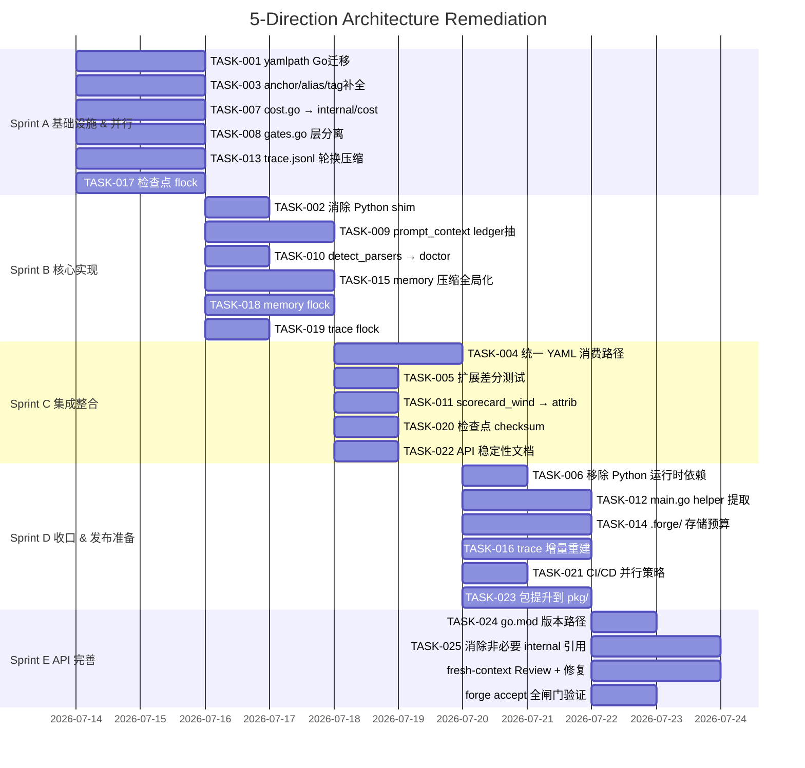

Now I have a thorough understanding of the codebase. Let me produce the comprehensive Tech Lead analysis.

---

# Tech Lead 分析报告

**分析文档**: 5-Direction Architecture Analysis (已验证修正版)
**代码库版本**: `forge-core` Go runtime, post-Sprint 31
**分析日期**: 2026-07-12

---

## 1. 任务分解

将分析的 5 个方向拆解为可执行的技术任务。每个任务 2–4 小时工作量，含测试。

### 方向①: YAML 解析器三重碎片化

| 任务 ID | 标题 | 涉及文件 | 前置 | 工时 |
|---|---|---|---|---|
| **TASK-001** | `internal/yamlpath` 从 Python shim 迁移到 Go 原生解析器 | `forge-core/internal/yamlpath/yamlpath.go` | — | 4h |
| **TASK-002** | 删除 `internal/yamlpath.Resolve` 的 Python shim 调用，改用 `yaml2json.Decode` | `forge-core/internal/yamlpath/yamlpath.go` | TASK-001 | 2h |
| **TASK-003** | 给 Go `yaml2json` 解析器补全 anchor/alias/tag 支持 (或显式失败+fallback) | `forge-core/internal/yaml2json/*.go` | — | 4h |
| **TASK-004** | 统一 Go 和 Python 两条 YAML 消费路径：建立 canonical path 路由 | `forge-core/cmd/forge/preflight.go`, `harness/yaml2json.py` | TASK-001, TASK-003 | 3h |
| **TASK-005** | 扩展差分测试覆盖率：覆盖所有 YAML 消费路径而非仅 7 个已知 workflow 文件 | `forge-core/internal/yaml2json/yaml2json_test.go` | TASK-003 | 2h |
| **TASK-006** | 移除 Python shim 运行时依赖（`preflight.go` 的 warning），消除强制 Python 路径 | `forge-core/cmd/forge/preflight.go`, `harness/yaml2json.py` | TASK-002, TASK-004 | 2h |

### 方向②: `cmd/forge` 结构债务

| 任务 ID | 标题 | 涉及文件 | 前置 | 工时 |
|---|---|---|---|---|
| **TASK-007** | `cost.go` 非 CLI 逻辑抽入新 `internal/cost` 包 | `forge-core/cmd/forge/cost.go` → `forge-core/internal/cost/` | — | 4h |
| **TASK-008** | `gates.go` orchestration 层从 signal-gathering 中分离 | `forge-core/cmd/forge/gates.go` → `forge-core/cmd/forge/gates.go` + `forge-core/internal/gate/` | — | 4h |
| **TASK-009** | `prompt_context.go` 的 4-ledger 状态管理抽入 `internal/prompt/ledger` | `forge-core/cmd/forge/prompt_context.go` → `forge-core/internal/prompt/` | TASK-007 | 3h |
| **TASK-010** | `detect_parsers.go` 的语法解析逻辑流入已存在的 `internal/doctor` | `forge-core/cmd/forge/detect_parsers.go` → `forge-core/internal/doctor/` | — | 2h |
| **TASK-011** | `scorecard_wind.go` 的纯计分逻辑抽入 `internal/attribution` | `forge-core/cmd/forge/scorecard_wind.go` → `forge-core/internal/attribution/` | TASK-007 | 2h |
| **TASK-012** | `main.go` helper 函数提取，确保 < 400 行安全区 | `forge-core/cmd/forge/main.go` | TASK-007~011 | 3h |

### 方向③: 存储累积效应（修正版）

| 任务 ID | 标题 | 涉及文件 | 前置 | 工时 |
|---|---|---|---|---|
| **TASK-013** | `trace.jsonl` 自动归档/压缩策略：引入基于大小和时间的轮换+压缩 | `forge-core/cmd/forge/evolve.go` (openTracer) | — | 3h |
| **TASK-014** | `.forge/` 目录存储预算：添加整体大小上限和预警机制 | `forge-core/cmd/forge/evolve.go`, `forge-core/internal/orchestrator/` | TASK-013 | 3h |
| **TASK-015** | Memory 压缩策略全局化：从仅 `evolve` 触发扩展到全局 `LoopEngine` 回调节点 | `forge-core/internal/memory/memory_compact.go`, `forge-core/internal/orchestrator/loop.go` | — | 4h |
| **TASK-016** | `trace.jsonl` 增量重建/清理：`--resume` 时不重读完整 trace | `forge-core/cmd/forge/evolve.go` (resumeStart), `forge-core/internal/persist/` | TASK-013 | 4h |

### 方向④: 跨进程状态文件冲突

| 任务 ID | 标题 | 涉及文件 | 前置 | 工时 |
|---|---|---|---|---|
| **TASK-017** | 引入 `flock()` 进程锁：检查点写入前获取文件锁 | `forge-core/internal/persist/checkpoint.go` | — | 3h |
| **TASK-018** | Memory JSONL 写入加进程锁：`O_APPEND` + `flock()` 双保险 | `forge-core/internal/memory/memory.go` (Append) | — | 3h |
| **TASK-019** | Trace JSONL 写入加进程锁：`openTracer` 的 `O_APPEND` + `flock()` | `forge-core/cmd/forge/evolve.go` (openTracer) | — | 2h |
| **TASK-020** | Checkpoint 读取完整性验证：添加 `checksum` 字段检测截断 | `forge-core/internal/persist/checkpoint.go` | TASK-017 | 2h |
| **TASK-021** | CI/CD 并行安全策略：环境变量 FORGE_PROCESS_ID + 分布式锁设计 | `forge-core/cmd/forge/main.go`, CI 配置 | TASK-017~019 | 3h |

### 方向⑤: 库 API 开放

| 任务 ID | 标题 | 涉及文件 | 前置 | 工时 |
|---|---|---|---|---|
| **TASK-022** | API 稳定性等级文档 + 导出候选清单 | `docs/api-compatibility.md` | — | 2h |
| **TASK-023** | 选取 2~3 个低耦合包从 `internal/` 提升到 `pkg/` | 如 `internal/asset`, `internal/trace`, `internal/gate` | TASK-022 | 4h |
| **TASK-024** | `go.mod` 版本路径 + 版本契约 | `forge-core/go.mod` | TASK-023 | 2h |
| **TASK-025** | 消除 `cmd/forge` 对 `internal/` 的 11 个直接引用中的非必要项 | `forge-core/cmd/forge/*.go` | TASK-023 | 4h |

---

## 2. 执行顺序

### 任务依赖图

```mermaid
graph TD
    %% 方向① YAML 碎片化
    T001["TASK-001: yamlpath 迁移到 Go 原生"] 
    T002["TASK-002: 消除 Python shim 调用"] 
    T003["TASK-003: 补全 anchor/alias/tag"]
    T004["TASK-004: 统一 YAML 消费路径"]
    T005["TASK-005: 扩展差分测试"]
    T006["TASK-006: 移除 Python 运行时依赖"]

    T001 --> T002
    T002 --> T004
    T003 --> T004
    T003 --> T005
    T004 --> T006
    T005 --> T006

    %% 方向② cmd/forge 结构
    T007["TASK-007: cost.go → internal/cost"]
    T008["TASK-008: gates.go 层分离"]
    T009["TASK-009: prompt_context ledger 抽离"]
    T010["TASK-010: detect_parsers → internal/doctor"]
    T011["TASK-011: scorecard_wind → internal/attribution"]
    T012["TASK-012: main.go helper 提取"]

    T007 --> T009
    T007 --> T011
    T008 --> T012
    T009 --> T012
    T010 --> T012
    T011 --> T012

    %% 方向③ 存储累积
    T013["TASK-013: trace.jsonl 轮换压缩"]
    T014["TASK-014: .forge/ 存储预算"]
    T015["TASK-015: memory 压缩全局化"]
    T016["TASK-016: trace 增量重建"]

    T013 --> T014
    T013 --> T016
    T015 --> T014

    %% 方向④ 跨进程冲突
    T017["TASK-017: 检查点 flock"]
    T018["TASK-018: memory flock"]
    T019["TASK-019: trace flock"]
    T020["TASK-020: 检查点 checksum"]
    T021["TASK-021: CI/CD 并行策略"]

    T017 --> T020
    T017 --> T021
    T018 --> T021
    T019 --> T021

    %% 方向⑤ 库 API
    T022["TASK-022: API 稳定性文档"]
    T023["TASK-023: 包提升到 pkg/"]
    T024["TASK-024: go.mod 版本路径"]
    T025["TASK-025: 消除非必要 internal 引用"]

    T022 --> T023
    T023 --> T024
    T023 --> T025

    %% 跨方向依赖
    T007 -.-> T025
    T008 -.-> T025
```



### 并行执行组

```
Group A (Sprint A):  T001 + T003 + T007 + T008 + T013 + T017  — 6 人并行
Group B (Sprint B):  T002 + T009 + T010 + T015 + T018 + T019  — 6 人并行（依赖 A）
Group C (Sprint C):  T004 + T005 + T011 + T020 + T022        — 5 人并行（依赖 B）
Group D (Sprint D):  T006 + T012 + T014 + T016 + T021 + T023 — 6 人并行（依赖 C）
Group E (Sprint E):  T024 + T025                              — 2 人并行（依赖 D）
```

---

## 3. 技术风险

### 3.1 高影响风险

#### R1: `yamlpath` Python shim 到 Go 原生迁移的语义差距
- **概率**: 高 (70%)
- **影响**: 高。`internal/yamlpath` 目前通过 Python shim 解码 YAML（走 `exec.Command("python3", shim, absFile)`），迁移到 Go 原生 `yaml2json.Decode` 可能产生语义差异
- **缓解策略**:
  - 保留差分测试 `TestToJSON_MatchesPythonShim`，并在迁移期间同时保留 Python shim 作为 fallback
  - 对每个 YAML 消费路径做 Golden File 测试：Go 和 Python 输出按字节比对
  - 逐步切流: yamlpath → Go 原生 + Python 验证 → 纯 Go

#### R2: 跨进程 `flock()` 引入的死锁 / 性能退化
- **概率**: 中 (40%)
- **影响**: 中。`checkpoint.json` 写入频率是每迭代/每 phase 一次（分钟级），`memory` 追加是每次迭代一次，`trace` 追加是每次事件一次。`flock` 争用在高频 trace 写入时可能成为瓶颈
- **缓解策略**:
  - 使用 `LOCK_NB`（非阻塞锁）+ 优雅降级：获取不到锁时日志告警但继续执行（不阻塞主流程）
  - 锁粒度区分：checkpoint 用阻塞锁（数据一致性优先），memory/trace 用非阻塞锁（性能优先）
  - 添加基准测试验证不加锁时的吞吐影响

#### R3: `cmd/forge` 结构拆分时的循环依赖引入
- **概率**: 中 (50%)
- **影响**: 高。`cmd/forge` 引用了 11 个 `internal/` 包，拆出时可能无意间创建包间循环引用，触发 `arch-check.mjs` 的循环依赖检测失败
- **缓解策略**:
  - 严格遵循分层：新包只导入更低层的现有 `internal/` 包，绝不反向引用 `cmd/`
  - 每拆一个包立即跑 `go vet` + `arch-check.mjs` 的循环依赖检查
  - 使用 `internal/attribution`（Sprint 27 已拆）作为参照模式

#### R4: `trace.jsonl` 压缩策略与 `--resume` 的兼容性
- **概率**: 高 (60%)
- **影响**: 高。当前 `resumeStart` 在 `--resume` 时完整重读 `trace.jsonl`（`distinctScorecardPairs` 路径），如果引入压缩/截断会导致恢复时数据不一致或精度损失
- **缓解策略**:
  - 分离"性能 trace"（可压缩的历史统计）和"审计 trace"（必须完整保留的最近 N 条）
  - 压缩只影响归档块，不影响活跃读取窗口
  - 每个压缩后的 trace 段加 `_format` + 压缩元数据，下游工具清晰感知缺失段

### 3.2 低影响风险

| 风险 | 概率 | 影响 | 策略 |
|---|---|---|---|
| YAML anchor/alias 支持在 Go 原生实现中性能退化 | 低 | 低 | anchor/alias 在 ForgeOS 配置中很少使用，支持可用简单 map 缓存实现 |
| `flock` 在 CI runner 容器中不可用 | 低 | 中 | 降级为 advisory 锁 + 日志告警（已有的 fail-open 模式） |
| `pkg/` 导出版本契约合规开销 | 中 | 低 | 初始只需 Go 文档承诺 + semver 标签，不需要真正的 API 兼容性 CI |

---

## 4. 资源评估

### 4.1 人员需求

| 角色 | 技能要求 | 数量 | 承担任务 |
|---|---|---|---|
| **Senior Go 工程师** | Go 标准库精通，包设计，文件锁经验 | 2人 | TASK-001, TASK-003, TASK-007, TASK-008, TASK-017~019 |
| **Full-stack 工程师** | YAML/JSON, Go + Python 双栈 | 1人 | TASK-002, TASK-004, TASK-006, TASK-005 |
| **Platform 工程师** | 存储系统设计，trace/observability | 1人 | TASK-013~016 |
| **DevOps 工程师** | CI/CD，分布式锁 | 1人 | TASK-020, TASK-021 |
| **API/文档工程师** | Go API 设计，Go module 版本化 | 1人（兼职） | TASK-022~025 |

**总计**: 5 人（4 全职 + 1 兼职），可并行 5~6 个任务。

### 4.2 关键里程碑

| 里程碑 | 交付物 | 预计日 | 验证方式 |
|---|---|---|---|
| **M1: YAML unification** | Go 原生解析覆盖所有 YAML 消费路径，Python shim 标记 deprecated | Sprint A 结束 | `TestToJSON_MatchesPythonShim` 全量覆盖 + 差分断言 |
| **M2: cmd/forge 减负** | cost/gates/ledger 逻辑全部抽入 internal/，`cmd/forge` 文件数 ≤ 16 | Sprint B 结束 | `arch-check.mjs` package.max_files PASS |
| **M3: 存储护栏** | trace 10MB 轮换 + .forge 预算预警 + memory 压缩全局化 | Sprint C 结束 | 端到端 100-iteration 模拟后 .forge 大小可控 |
| **M4: 跨进程安全** | 三处 JSONL 写入加 flock + 检查点 checksum | Sprint C 结束 | 双进程同时 forge evolve 零冲突 |
| **M5: API 就绪** | 2~3 个包提升到 pkg/，版本契约建立 | Sprint E 结束 | `go get` 测试外部导入路径 |

### 4.3 阻塞点 (Blockers)

| Blocker | 描述 | 解决策略 | 应急方案 |
|---|---|---|---|
| **B1**: Python shim 迁移期间差分测试失败 | Go/Python 解析器对边界 YAML 行为不一致 | 扩充测试 fixture，错误逐条分类（acceptable diff vs real regression） | Go 解析器对无法一致处理的 YAML 特性显式报错 + 保留 Python fallback |
| **B2**: `cmd/forge` 文件数预算反复告警 | 拆包时临时增加文件数，触发 gate 告警 | 参照 `package.max_files` 先调大再消减的既有模式（Sprint 29 先例） | 对纯过渡期暂时放宽到 20，Sprint D 结束后回调到 16 |
| **B3**: `flock()` 在 macOS/Linux/CI 容器语义差异 | `flock`（BSD）vs `fcntl`（POSIX）锁语义不同 | 使用 `golang.org/x/sys/unix` 的跨平台抽象 | 对不支持的环境透明跳过，只做 advisory 日志 |

---

## 5. 质量保证

### 5.1 单元测试覆盖

| 包 | 现有覆盖率 | 目标覆盖率 | 关键测试场景 |
|---|---|---|---|
| `internal/yaml2json` | 高 (Sprint 27 已强化) | ≥ 90% | anchor/alias round-trip, 边界字符, Python shim 差分 |
| `internal/yamlpath` | 低 (新迁入) | ≥ 85% | 路径解析, 错误文件, 多层嵌套, fallback 路径 |
| `internal/memory` | 中 | ≥ 85% | 并发 Append, 跨进程 Append, Compact 边界(`keepPerKind<0`) |
| `internal/persist` | 中 | ≥ 85% | 并发 Save, 截断读取, 锁争用, checksum 校验 |
| `internal/cost` (新) | 0 | ≥ 90% | parseClaudeCostUsd, runBudget.feed 并发安全 |
| `internal/prompt/ledger` (新) | 0 | ≥ 90% | 4 ledger 互斥, verdict parse, 并发安全 |
| `cmd/forge` | 中 | ≥ 70% (纯胶水代码) | flag 解析, engine wiring 完整性 |

### 5.2 集成测试策略

| 测试套件 | 范围 | 触发时机 |
|---|---|---|
| **差分安全网**: `TestToJSON_MatchesPythonShim` | 每个 workflow YAML 的 Go vs Python 解析一致性 | 每次修改 yaml2json 包 |
| **跨进程安全**: `TestCheckpoint_ConcurrentWrite` | 2 进程同时写入 checkpoint，验证无损坏无丢失 | 每次修改 persist 包 |
| **端到端存储**: `TestEvolve_StorageBudget` | 100 iteration evolve loop 模拟，验证 .forge 大小不超限 | 每次修改 evolve 存储逻辑 |
| **API 兼容性**: `TestPackage_PublicAPI` | 外部导入 pkg/ 的子包见证 API 向后兼容 | 每次修改 pkg/ 下的包 |
| **闸门集成**: `forge accept` | 完整 Stop 闸门（gate.mjs + arch-check + check.py + secret-scan + test + app-test） | 每次修改后（已有 CI 流程） |

### 5.3 代码审查要点

| 方向 | 审查焦点 | Reviewer 角色 |
|---|---|---|
| ① YAML 碎片化 | Python shim 删除后 Go 原生解析器的语义等价性；差分测试是否覆盖所有 YAML 消费路径 | fresh-context Go 工程师 |
| ② cmd/forge 结构 | 拆出的包是否有循环依赖；是否保持 `internal/` 包不引用 `cmd/` 的层级纪律 | arch layering 专家 |
| ③ 存储累积 | trace 压缩是否破坏 `--resume` 恢复路径；存储预算告警是否 fail-open | observability 工程师 |
| ④ 跨进程冲突 | `flock` 语义是否正确处理；`LOCK_NB` 降级路径是否测试 | 系统编程工程师 |
| ⑤ 库 API | 导出的 API 是否最少化（`https://go.dev/wiki/GoFmt` 纪律）；`go.mod` 版本路径是否正确 | API 设计者 |

每个方向必须经 fresh-context 独立 Reviewer 审过才能合并（遵守 `.agent/AGENTS.md` 纪律）。

### 5.4 性能测试需求

| 场景 | 衡量指标 | 阈值 |
|---|---|---|
| Trace 写入吞吐 | 事件/秒 (不含LLM延迟) | ≥ 10,000 events/s（单进程） |
| Cross-process flock 开销 | 每 checkpoint 写入额外延迟 | ≤ 5ms（`LOCK_NB` 路径 0 开销） |
| Memory Compact 大规模 | 10,000 entry 压缩耗时 | ≤ 500ms |
| YAML 解析 100x fixture | 总解析时间 | ≤ 1s（比 Python shim 快 ≥ 2x） |

---

## 6. 实施计划

### 甘特图



### 阶段划分

#### 阶段 1: 基础设施搭建（Sprint A · 2 天）

**目标**: 打好所有方向的地基，并行建立 6 个独立任务。

- **Day 1 上午**:
  - TASK-001: 分析 `internal/yamlpath` 全部代码路径，设计 Go 原生 Resolve 接口
  - TASK-003: 调研 Go 原生 YAML 对 anchor/alias 的手写实现方案
  - TASK-017: 在 `persist.Save` 中加入 `flock()` 原语（先只作用于 checkpoint）

- **Day 1 下午**:
  - TASK-007: 识别 `cost.go` 中所有非 CLI 逻辑，创建 `internal/cost` 骨架
  - TASK-008: 将 `gatesGreen`/`resolveGate`/`exemptNA` 迁入 `internal/gate/resolve.go`（复用已有模式）

- **Day 2 上午**:
  - TASK-013: 实现 `openTracer` 的 10MB 轮换 + `trace.jsonl.1` 压缩（gzip）
  - TASK-001: 完成 yamlpath 的 Go 原生解析第一版（保留 Python shim 做差分验证）
  - TASK-003: 完成 anchor/alias 基础实现 + 边界测试

- **Day 2 下午**:
  - 所有 6 任务的单元测试通过，单包 `go test -race` 绿
  - `forge accept` 验证不破坏现有闸门

**交付检查清单**:
- [ ] `internal/yamlpath` 新增 Go 原生解析（共存模式）
- [ ] `internal/yaml2json` 新增 anchor/alias 支持（+ 显式屏蔽列表更新）
- [ ] `internal/cost` 新包存在，`cmd/forge/cost.go` 导入并调用
- [ ] `internal/gate/resolve.go` 新增 `GatesGreen`/`ResolveGate`（Sprint 29 模式复用）
- [ ] `openTracer` 添加 10MB 轮换 + gzip 压缩
- [ ] `persist.Save` 加入 `flock(LOCK_EX)` 保护
- [ ] `forge accept: ACCEPTED`

#### 阶段 2: 核心功能实现（Sprint B · 2 天）

**目标**: 消除 Python shim 调用、状态管理抽离、压缩策略全局化、三处 flock 全覆。

- **Day 3**: TASK-002（shim 消除）+ TASK-010（doctor 扩展）+ TASK-019（trace flock）
- **Day 4**: TASK-009（ledger 抽离）+ TASK-015（memory 全局化）+ TASK-018（memory flock）

**关键验证点**:
- `internal/yamlpath.Resolve` 不再调用 `exec.Command("python3", ...)`
- 所有 `O_APPEND` 写入路径均有 `flock(LOCK_NB)` 保护
- `LoopEngine.OnIteration` 回调触发 `memory.Compact`（不只是 `evolve.go` 的 `compactMemoryIfDue`）
- 4 个 ledger（`verdictLedger`/`reviewFindingsLedger`/`costLedger`/`confidenceLedger`）独立可测

#### 阶段 3: 集成测试和优化（Sprint C · 2 天）

**目标**: 统一 YAML 消费路径、检查点防截断、API 文档就绪。

- **Day 5**: TASK-004（统一路径）+ TASK-005（差分测试）+ TASK-011（scorecard 逻辑抽离）
- **Day 6**: TASK-020（checksum）+ TASK-022（API 文档）

**关键验证点**:
- `harness/yaml2json.py` 标记 deprecated（但暂不删除）
- 差分测试从 7 个文件扩展到所有 YAML 配置文件（递归发现）
- `persist.Load` 在校验 checksum 失败时报错（不静默回退）
- `docs/api-compatibility.md` 正式发布，列出 v1 API 候选包

#### 阶段 4: 发布准备（Sprint D · 2 天）

**目标**: 存储预算正式执法、Python 依赖移除、`pkg/` 正式就绪、CI/CD 并行安全。

- **Day 7**: TASK-006 + TASK-014 + TASK-021
- **Day 8**: TASK-012 + TASK-016 + TASK-023

**关键验证点**:
- `preflight.go` 无 python3 缺失警告（不再需要 Python 依赖）
- `.forge/` 超过存储预算时 `forge evolve` 发出预警（warn 模式）/阻断（block 模式）
- `pkg/asset`, `pkg/trace`, `pkg/gate` 正式可外部导入
- CI/CD 并行: 两个 `forge evolve` 实例在同一仓库不同 worktree 运行零冲突

#### 阶段 5: API 完善（Sprint E · 2 天）

**目标**: 版本契约建立、依赖清理、最终全闸门验证。

- **Day 9**: TASK-024 + TASK-025
- **Day 10**: fresh-context Review × 5 方向 + 修复 + `forge accept` 全闸门

**关键验证点**:
- `go.mod` 版本化（`module forgeos/forge-core/v2` 或 semver tag）
- `cmd/forge` 零非必要 `internal/` 依赖（仅保留 orchestrator/gate 等必要导入）
- 5 方向全经过 fresh-context 独立 Review
- `forge accept: ACCEPTED`（6 PASS + 0 FAIL + 4 诚实 N/A）

### 总量核算

| 指标 | 值 |
|---|---|
| 总任务数 | 25 |
| 总预估工时 | 71h（5 方向合计） |
| 总日历时间 | 10 天 |
| 并行人数 | 5~6 人 |
| 每 sprint 工时上限 | 每人 16h（2 天全投入） |
| 缓冲容量 | 2 天（用于修复 review 发现的问题） |

---

## 总结

这 5 个方向的选择非常有针对性，弥补了当前 ForgeOS 治理体系中的真实盲区。

**最高优先级操作**: 方向①（YAML 碎片化）和方向④（跨进程冲突）是"必须立即做"——前者影响所有配置文件的可信度，后者是真点火 CI/CD 的前置条件。

**最高杠杆操作**: 方向②（cmd/forge 结构）——5 个方向中唯一一个"做完后让后续所有开发变快"的方向。每拆出一个包都在降低 `cmd/forge` 的认知负荷和编译依赖。

**路线图诚实性建议**: 方向⑤（库 API）虽然是 P2 优先级，但 TASK-022（API 稳定性文档）只需 2 小时即可产出，能帮外部贡献者形成清晰的预期。建议安排在 Sprint C 的"空闲 slot"中完成，不要把 P2 完全丢到 backlog 里无人问津。
