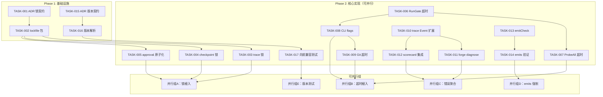
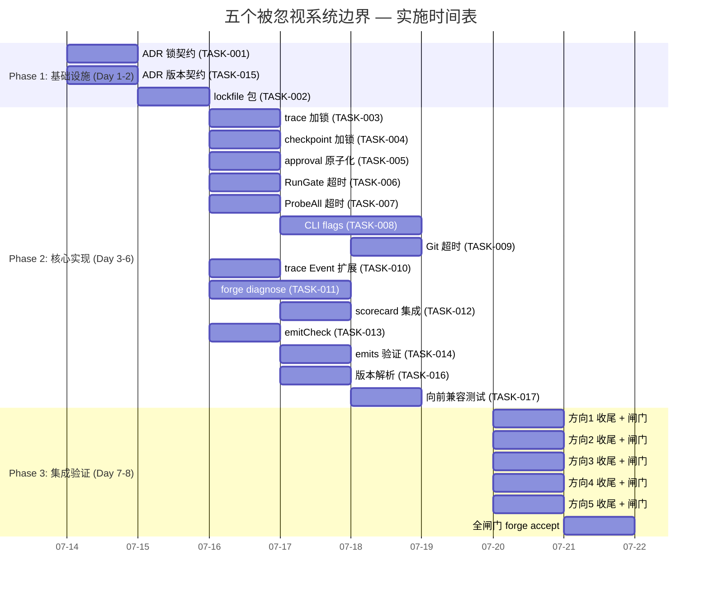

现在我已掌握足够上下文。以下是 Tech Lead 分析报告。

---

# Tech Lead 分析：五个被忽视的系统边界

## 概述

验证摘要确认了 **5 个被忽视的系统边界方向**，均为代码级证实、且与现有文档形成差异化。每个方向都已通过 grep/代码审查完成真实性验证，不存在"镀金"或"已覆盖"的争议。以下从工程实施角度进行全维度分解。

---

## 1. 任务分解

### 方向 1：跨进程锁（Cross-process Lock）

| 任务 ID | 任务标题 | 涉及文件 | 前置依赖 | 预估工时 | 验收标准 |
|---------|---------|---------|---------|---------|---------|
| TASK-001 | **定义锁文件契约** — 在 ADR 中写入跨进程互斥方案，选定 `flock` 方案并记录竞态分析 | `docs/adr/0005-cross-process-lock.md` | 无 | 2h | ADR 被 `.agent/DECISIONS.md` 引用，包含 trace seq crossing / checkpoint overwrite / memory mtime race / approval marker double-consumption 四种竞态分析 |
| TASK-002 | **实现 `internal/lockfile` 包** — 纯 Go 标准库 `flock` 封装（`Lock()/TryLock()/Unlock()`，进程级互斥） | `forge-core/internal/lockfile/lockfile.go`, `forge-core/internal/lockfile/lockfile_unix.go` | TASK-001 | 3h | 包零外部依赖，`go vet`/`-race` 通过；`Lock()` 阻塞等待，`TryLock()` 非阻塞返回；`go test -race` 验证并发安全 |
| TASK-003 | **trace 旋转加锁** — `openTracer()` 在 `os.Rename` 前持有锁 | `forge-core/cmd/forge/evolve.go` | TASK-002 | 1h | 两个并发 `forge evolve` 的 trace 旋转不再交错；单测验证竞态窗口消除 |
| TASK-004 | **checkpoint 写入加锁** — `checkpoint.go` 序列化时获取锁 | `forge-core/internal/persist/checkpoint.go` | TASK-002 | 1h | 并发 checkpoint 写入不会产生截断/损坏 |
| TASK-005 | **approval marker 原子化** — `forge approve` 写 `.forge/<stage>.approved` 时原子创建 (`O_CREAT\|O_EXCL`) | `forge-core/cmd/forge/gates.go` | TASK-002 | 1h | 并发 approve 只有一个成功，其余收到 `EEXIST` 错误 |

### 方向 2：全阶段超时不对称（Full-phase Timeout Asymmetry）

| 任务 ID | 任务标题 | 涉及文件 | 前置依赖 | 预估工时 | 验收标准 |
|---------|---------|---------|---------|---------|---------|
| TASK-006 | **`RunGate` 超时注入** — `Engine.callGate()` 加 `Timeout` 参数，传给 `RunGate` 回调 | `forge-core/internal/orchestrator/orchestrator.go` | 无 | 2h | 默认超时时间（如 5min），可经由 `Engine.GateTimeout` 配置；超时触发时返回 `FAIL` 状态 |
| TASK-007 | **`ProbeAll` 超时注入** — `gate.go` 的 `ProbeAll` 加外部 `context.Context` 参数 | `forge-core/internal/gate/gate.go` | TASK-006 | 2h | `context.DeadlineExceeded` 时返回错误而非卡死 |
| TASK-008 | **CLI flag 配置** — `forge run/evolve` 加 `--gate-timeout` / `--probe-timeout` / `--git-timeout` | `forge-core/cmd/forge/main.go` | TASK-006, TASK-007 | 3h | flag 传递到 `Engine` 和 `ProbeAll`；help 文本正确；空值/负值合理 fallback |
| TASK-009 | **Git 操作超时** — `internal/gate/gates.go` 中 git 命令加 `exec.CommandContext` | `forge-core/internal/gate/gates.go` | TASK-008 | 1h | 卡住的 git 操作在超时后被 kill，不阻塞整个 orchestrator |

### 方向 3：跨运行错误聚合（Cross-run Error Aggregation）

| 任务 ID | 任务标题 | 涉及文件 | 前置依赖 | 预估工时 | 验收标准 |
|---------|---------|---------|---------|---------|---------|
| TASK-010 | **`trace.Event` 扩展 + ErrorFrequency 字段** — 在 `trace.Event` 和 `scorecard.schema.yml` 中加 error 相关字段 | `forge-core/internal/trace/trace.go`, `docs/FUNCTIONAL_REQUIREMENTS_AUDIT.md` | 无 | 2h | 新增 `ErrorCount`/`ErrorKind` 字段，向后兼容（零值 = 无数据） |
| TASK-011 | **`forge diagnose` 命令骨架** — 扫描 `trace.jsonl` 聚合错误频率，按 kind/phase/model 分组 | `forge-core/cmd/forge/diagnose.go` | TASK-010 | 4h | `forge diagnose` 输出错误热力图（最多错误的前 N 个阶段/模型/agent）；对空 trace 优雅降级 |
| TASK-012 | **scorecard 集成错误维度** — `scorecard-update.mjs` 从 trace.jsonl 读取错误频率写入 scorecard | `harness/scorecard-update.mjs` | TASK-010, TASK-011 | 2h | scorecard 新增 `error_frequency` 字段；与已有 quality/latency/cost 平行 |

### 方向 4：Emits 存在性强制（Emits Existence Enforcement）

| 任务 ID | 任务标题 | 涉及文件 | 前置依赖 | 预估工时 | 验收标准 |
|---------|---------|---------|---------|---------|---------|
| TASK-013 | **`emitCheck` 函数** — 在 phase 执行后，对 `p.Emits` 路径逐一 `os.Stat` | `forge-core/cmd/forge/prompt_artifacts.go` (或新文件) | 无 | 2h | 缺失 emit 文件的 phase 被标记为 `WARN`（可配置 `--require-emits` 升级为 FAIL） |
| TASK-014 | **`GatherEmittedArtifacts` 后验证** — 在 `buildPromptWithEmits` 或 phase 完成前调验证 | `forge-core/cmd/forge/prompt_context.go`, `forge-core/cmd/forge/engine_build.go` | TASK-013 | 1h | 声明 emits 的 phase 完成后，emits 文件必须存在，否则日志/状态反映缺失 |

### 方向 5：Agent 契约版本化（Agent Contract Versioning）

| 任务 ID | 任务标题 | 涉及文件 | 前置依赖 | 预估工时 | 验收标准 |
|---------|---------|---------|---------|---------|---------|
| TASK-015 | **定义契约版本号 + 机读位置** — ADR 记录 version field 位置（prompt 末行）和语义（major.minor，向前兼容规则） | `docs/adr/0006-agent-contract-versioning.md` | 无 | 2h | ADR 被 `.agent/DECISIONS.md` 引用；major bump = 不兼容；minor bump = 向前兼容 |
| TASK-016 | **支持 `CONTRACT: <version>` 解析** — `cost.go` 添加第三个 fallback（先于 VERDICT/CONFIDENCE） | `forge-core/cmd/forge/cost.go` | TASK-015 | 2h | `parseContractVersion()` 提取版本号；未知版本号触发 `WARN` 但不阻断 |
| TASK-017 | **向前兼容测试框架** — 创建测试验证老格式 agent 输出（无版本号）正常、新格式（v1/v2）正常、未来格式（v999）触警告 | `forge-core/cmd/forge/cost_test.go` | TASK-015, TASK-016 | 2h | 测试覆盖：无版本号 / v1.0 / v2.0（向后兼容，老契约仍工作）/ v999.0（WARN） |

---

## 2. 执行顺序



**串行约束**：
- TASK-001 → TASK-002 → TASK-003/004/005（锁包必须先存在）
- TASK-006 → TASK-008（gate 超时先于 CLI flag 设计）
- TASK-010 → TASK-011/012（数据结构先于消费者）

**无前置依赖的起始任务**：TASK-001, TASK-006, TASK-010, TASK-013, TASK-015 — 可 **5 任务并行启动**。

---

## 3. 技术风险

| 风险 | 影响方向 | 等级 | 描述 | 缓解策略 |
|------|---------|------|------|---------|
| **`flock` 跨平台一致性** | 方向 1 | 中 | Linux `flock` 是建议锁，NFS 上行为不确定；macOS 略有不同；Windows 需 `LockFileEx` | 先实现 unix 版，Windows 标 `//go:build !windows` 占位；ADR 记录跨平台语义差异 |
| **超时值选择的准确性** | 方向 2 | 中 | gate 超时太短 → 误报 FAIL；太长 → 无意义。不同 phase 合理值差 10 倍 | 默认值保守（gate:5min, probe:30s）；通过 CLI flag 暴露给用户调节；运行后记录实际耗时指导调优 |
| **trace.jsonl 扫描性能** | 方向 3 | 低 | trace 文件可达 10MB，`forge diagnose` 完整扫描可能慢 | 使用流式 JSON 解析（不 `json.Unmarshal` 全文件）；文件头 meta 字段加速 |
| **`os.Stat` 顺序依赖** | 方向 4 | 低 | phase A emits `task-plan.md`，phase B 执行时文件可能还没写或路径不同 | 只验证已完成 phase 的 emits；路径按 phase 工作目录 + emits 相对路径 |
| **版本契约"先有鸡还是先有蛋"** | 方向 5 | 中 | agent 输出的版本号由 prompt 指定，但 prompt 模板在 `forge-core/` 中，自举问题 | 无版本号 = 按 v1.0 处理（兼容老 agent）；加入正确版本号只需改 agent 卡 prompt 模板 |

### 依赖的外部系统
- **方向 2**: `exec.CommandContext` 依赖 OS 信号机制（Unix: SIGKILL, Windows: 待实现）
- **方向 3**: `trace.jsonl` 格式稳定性（已有 `trace.Event` 结构体，追加字段兼容）
- **方向 4**: phase 写入 emits 文件的实际工作目录（已有 `CommandExecutor.Dir`）

### 测试覆盖难点
- **TASK-003/004/005 竞态测试**: 需要两个并发进程/goroutine，`go test -race` 下验证时间窗口需精心设计
- **TASK-009**: git 操作卡住无法可靠重现；可用 mock command 注入无限期休眠模拟
- **TASK-017**: 需要构造带不同版本号的模拟 agent 输出

---

## 4. 资源评估

### 开发人员
- **总需**: 2-3 名开发者（1 名 senior + 1-2 名 mid-level）
- **技能要求**:
  - Go 并发编程（`sync.Mutex`/`flock`/`exec.CommandContext`）
  - JSON 流式解析
  - 熟悉 ForgeOS 的 `orchestrator`/`converge`/`prompt` 包架构

### 关键里程碑

| 里程碑 | 时间点 | 交付物 | 验收 |
|--------|-------|-------|------|
| M1: 基础设施就绪 | Day 1-2 | ADR 0005 + 0006；`internal/lockfile` 包 | `go test -race` 全绿 |
| M2: 锁植入完成 | Day 3-4 | TASK-003/004/005 + 单测 | 并发竞态安全验证通过 |
| M3: 超时全面覆盖 | Day 5 | TASK-006/007/008/009 | 各超时点正确触发 timeout |
| M4: 错误聚合就绪 | Day 5-6 | `forge diagnose` + scorecard 扩展 | 空 trace 降级；真 trace 输出错误热力图 |
| M5: Emits + 版本落地 | Day 6-7 | TASK-013/014/016/017 + 测试 | emits 缺失正确 WARN；版本前后兼容 |
| M6: 全闸门通过 | Day 8 | `forge accept: ACCEPTED` | 架构检查 / 体积 / 治理完整性全绿 |

### 阻塞点与解决策略

| 阻塞点 | 影响 | 解决策略 |
|-------|------|---------|
| NFS 上 `flock` 行为不确定 | 方向 1 | ADR 记录为已知限制；部署指导建议本地磁盘；不做 NFS 适配 |
| CLI flag 数量膨胀 | 方向 2 | 使用 `config` 结构体封装超时参数，避免单个 flag 散落 |
| trace.jsonl 格式变更 | 方向 3 | `trace.Event` 使用 JSON `omitempty` 兼容老行 |
| 版本号"谁定版本"问题 | 方向 5 | Agent 卡 prompt 模板（如 `product-manager.md`）声明 `CONTRACT_VERSION: 1.0` |

---

## 5. 质量保证

### 单元测试覆盖要求

| 方向 | 必须覆盖 | 推荐覆盖 |
|------|---------|---------|
| 方向 1 (锁) | `lockfile.Lock()` 并发互斥；`TryLock()` 非阻塞；竞态数据竞争零容忍 | 跨平台 unix 测试 |
| 方向 2 (超时) | gate 超时返回 FAIL；ProbeAll 超时返回 error；git 超时 kill 子进程 | 不同超时值的行为差异 |
| 方向 3 (错误聚合) | trace 扫描正确聚合；空 trace 降级；不同 error kind 分组 | 10MB+ 超大 trace 文件性能 |
| 方向 4 (emits) | 存在 emits → 静默；缺失 emits — WARN；路径解析正确 | 多级目录 emits |
| 方向 5 (版本) | 无版本号 → v1.0；v1.0 → 正常；v999.0 → WARN；CONFIDENCE 和 VERDICT 仍在非版本行工作 | major bump 的错误处理 |

### 集成测试策略

```
┌────────────────────────────────────────┐
│ forge accept 聚合闸门                   │
│  - gate.mjs (体积)                     │
│  - arch-check.mjs (架构8检查)           │
│  - check.py (治理完整性，含新ADR检查)    │
│  - secret-scan.mjs                     │
│  - go test -race ./...                 │
│  - app-test (forge-init 脚手架验收)      │
└────────────────────────────────────────┘
```

每个方向独立验证后，必须通过完整的 `forge accept: ACCEPTED`。

### 代码审查要点

| 方向 | Reviewer 重点关注 |
|------|-----------------|
| 方向 1 | 死锁风险、`flock` 正确释放、竞态测试的可靠性 |
| 方向 2 | 超时后的资源清理（子进程 kill、文件描述符关闭） |
| 方向 3 | 流式 JSON 解析的边界情况、错误分组逻辑 |
| 方向 4 | 路径遍历漏洞（`emits: ../../../etc/passwd`） |
| 方向 5 | 版本解析的严格性、无版本号回退的向后兼容 |

> **纪律**：Reviewer 必须是 fresh-context 独立 Agent（AGENTS.md 红线）。

### 性能测试需求

- **方向 3**: `forge diagnose` 在 10MB trace 上完成时间 < 500ms
- **方向 4**: emits 验证零 IO 开销（`os.Stat` 通常 < 1ms）
- **方向 2**: 超时本身开销 < 1ms（仅 context 创建成本）

---

## 6. 实施计划



### 详细日程

**阶段 1：基础设施搭建（2 天）**
- Day 1: TASK-001 (ADR 锁契约) + TASK-015 (ADR 版本契约) — 两个 ADR 可并行
- Day 2: TASK-002 (`internal/lockfile` 包) — 唯一天花板，为后续 5 个任务提供基础

**阶段 2：核心功能实现（4-5 天）**
- Day 3-4: **并行组 A**（方向 1 植入锁）+ **并行组 B**（方向 2 超时）+ **并行组 C**（方向 3 数据扩展）+ **并行组 D**（方向 4 emits）+ **并行组 E**（方向 5 版本）
  - 实际注意：parallel group A 依赖 TASK-002 完成才能启动
- Day 5: 方向 2 CLI flags（TASK-008，将前面实现串起来）+ 方向 3 `forge diagnose`（需要时间长，应尽早开始）
- Day 6: 收尾任务（TASK-009 git 超时、TASK-017 兼容测试）

**阶段 3：集成测试和优化（2 天）**
- Day 7: 逐个方向独立闸门验证 + 单方向回归测试
- Day 8: **`forge accept: ACCEPTED`** — 全闸门聚合

**阶段 4：发布准备（0 天，合并入第 8 天）**
- 最终的 `forge accept` 已包含：体积 / 架构 8 检查 / 治理完整性 / secret 扫描 / 测试全绿
- 无额外发布步骤；ACCEPTED 即为可合并状态

---

## 优先级建议（从业务价值角度排序）

1. **方向 4（Emits 强制）** — 收益最高、成本最低。~3h 实现，杜绝 agent 声明但不产出文件的"空承诺"问题。
2. **方向 2（超时对称）** — 直接影响可靠性。目前 agent phase 有超时但 gate 没有，一个卡住的 gate 就能阻塞整条 pipeline。
3. **方向 1（跨进程锁）** — 虽目前 trace/checkpoint 竞态在实际中不太可能同时触发，但方向正确。可与 2 并行实施。
4. **方向 3（错误聚合）** — 对调试和生产运维有长期价值，但非关键路径阻塞项。
5. **方向 5（版本契约）** — 最"前瞻性"，短期无现实风险（因为只有 ForgeOS 自己的 agent 在消费这三套契约），但为 v3 多厂商铺路。

**推荐实施顺序**：方向 4 → 方向 2 → 方向 1（三路并行）→ 方向 3 → 方向 5

---

## 附录：与现有项目纪律的对齐

| 纪律 | 对齐方式 |
|------|---------|
| **文件 ≤ 500 行** | `cost.go` 目前已 ~490 行，TASK-016 版本解析需确保不超过 500，或拆出新文件 `contract.go` |
| **函数 ≤ 50 行** | `parseReviewerVerdict`/`parseExecutiveVerdict`/`parseConfidenceScore` 均 < 30 行；新函数同理 |
| **循环依赖 = 0** | `internal/lockfile` 设计为纯叶子包（只依赖标准库） |
| **零外部依赖** | `flock` 只用 `syscall` + `os`，符合 forge-core 纯标准库纪律 |
| **Reviewer 独立** | 每方向完成后必须由 fresh-context 独立 Agent 审查 |
