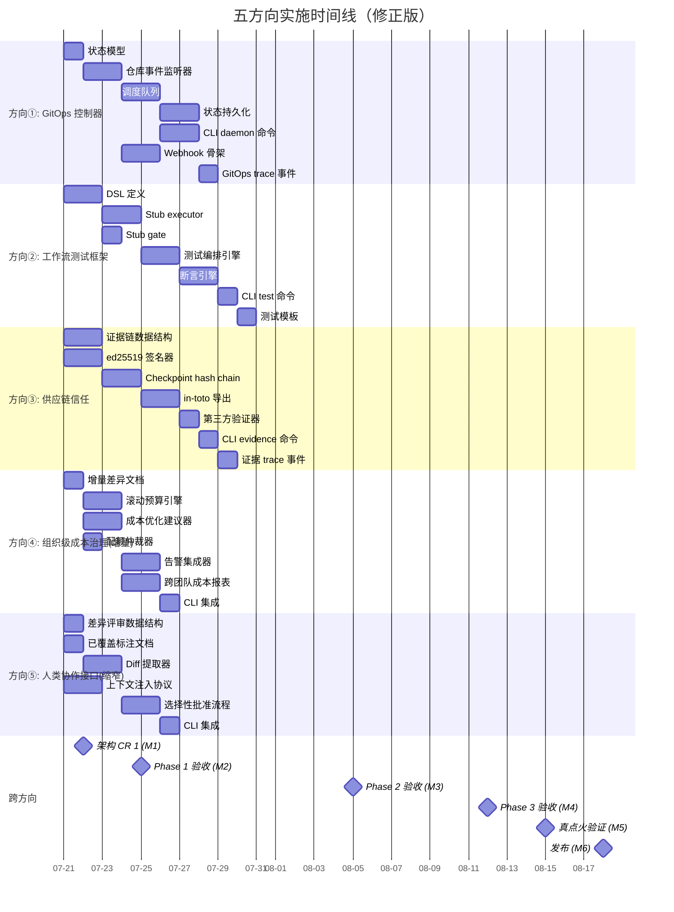

现在我拥有完整的背景信息。让我产生 Tech Lead 分析。

---

# Tech Lead 分析报告：五个架构缺口方向（修正后）

> **分析基准**: 交叉验证评估文档 + 43 篇已有分析 + forge-core Go 运行时全貌（18 包、零外部依赖、全绿）
> **代码基线**: HEAD (2026-07-12)
> **角色**: Tech Lead — 从工程实施角度评估五个方向的可实现性、分解为可执行任务
> **核心纪律**: 方向零覆盖声明已根据交叉验证结果修正，本计划基于**修正后的真实状态**

---

## 1. 执行摘要

### 修正后的全景

| 方向 | 原始零覆盖声明 | 实际状态 | 本计划处理方式 |
|------|--------------|---------|--------------|
| ① **GitOps 控制器** | ✅ 零覆盖 | **真正空白** | 按原方向完整规划 |
| ② **工作流测试框架** | ✅ 零覆盖 | **接近空白**（v6 有表层提及） | 保留，差异化引用已有提及 |
| ③ **供应链信任** | ✅ 零覆盖 | **基本空白**（审批签名提及但不同） | 按原方向完整规划 |
| ④ **组织级成本治理** | ❌ 零覆盖 | **严重重叠**（v6 文档已覆盖） | **重写为 v6 增量深化**而非全新方向 |
| ⑤ **人类协作接口** | ⚠️ 零覆盖 | **50% 已覆盖**（pause/resume/notify） | **缩小到 diff review + 上下文注入** |

### 优先级重排

| 优先级 | 方向 | 核心理由 |
|--------|------|---------|
| **P0** (架构杠杆最高) | ① GitOps 控制器 | 解决「平台化」完全未触及的维度，且真空白 |
| **P0** (合规刚需) | ③ 供应链信任 | 解决「合规可证明」维度，接近真空白 |
| **P1** (差异化能力) | ② 工作流测试框架 | 现有只触及表层，深化为 DSL 的显著空白 |
| **P2** (增量深化) | ④ 组织级成本治理 | 基于 v6 已覆盖的接口设计，新增滚动预算/优化建议/告警 |
| **P2** (缩窄后) | ⑤ 人类协作接口 | 聚焦 diff review + 上下文注入真正的空白点 |

---

## 2. 任务分解

### 方向①：GitOps 控制器（P0 — 真正空白）

当前 forge-core 是**同步 CLI**：17 个子命令，全部是一次性调用。无 daemon 进程、无 watch loop、无状态持久化轮询。GitOps 控制器将带来：
- **多仓库 watch**：监听 repo/PR 事件，自动触发 `forge run`
- **队列+调度**：并发任务编排、依赖序、重试策略
- **状态持久化**：长期运行的工作流状态管理
- **Webhook 集成**：GitHub/GitLab 事件 → forge 工作流触发

#### 任务分解

| 任务 ID | 任务标题 | 涉及文件 | 前置依赖 | 预估工时 | 验收标准 |
|---------|---------|---------|---------|---------|---------|
| DIR1-T001 | **GitOps 状态模型定义** | `forge-core/internal/gitops/types.go` (新建) | 无 | 3h | `WatchTarget{Repo, Branch, Events[], Workflow, TriggerOn}`, `QueueItem{ID, Status, Dependencies[]}`, `RunRecord{ID, Target, StartedAt, Result}`。纯数据结构，round-trip JSON |
| DIR1-T002 | **仓库事件监听器** | `forge-core/internal/gitops/watcher.go` (新建), `forge-core/internal/gitops/watcher_test.go` | DIR1-T001 | 6h | `Watcher{PollInterval, Targets[]}`。实现轮询模式（v1：git fetch + log 比较，无需 webhook 服务器）。`Watch(root)` 返回 event channel。`DetectEvents(target) []GitEvent`。支持 `push`, `pr_opened`, `pr_merged` 三事件类型。纯 Go 标准库（`os/exec` git 命令） |
| DIR1-T003 | **工作流调度队列** | `forge-core/internal/gitops/scheduler.go` (新建), `forge-core/internal/gitops/scheduler_test.go` | DIR1-T001 | 6h | `Scheduler{Queue []QueueItem, Running map[string]RunRecord}`。拓扑排序（复用 `waves.go` 的 DAG 逻辑）。`Enqueue(target, depends_on) (id, error)`。`Dequeue() *QueueItem`。`Complete(id, result)`. 并发限制 `MaxConcurrency`。向后兼容：单队列单消费者退化为同步执行 |
| DIR1-T004 | **状态持久化** | `forge-core/internal/gitops/store.go` (新建), `forge-core/internal/persist/` (扩展) | DIR1-T001 | 4h | `GitOpsStore` 接口：`SaveRun`, `LoadRun`, `ListRuns`, `SaveQueue`, `LoadQueue`。v1 用 JSON 文件（复用 `persist.AtomicWriteJSON`）。`<root>/.forge/gitops/runs/` 目录布局 |
| DIR1-T005 | **CLI 命令：`forge daemon`** | `forge-core/cmd/forge/daemon.go` (新建), `forge-core/cmd/forge/main.go` (扩展) | DIR1-T002, DIR1-T003, DIR1-T004 | 5h | `forge daemon start` — 启动 watch loop。`forge daemon status` — 运行中队列状态。`forge daemon stop` — 优雅关闭（`os.Signal` 处理）。`forge daemon logs` — 查看历史调度记录。dry-run 模式：只叙述不执行 |
| DIR1-T006 | **Webhook 接收器（v1 骨架）** | `forge-core/internal/gitops/webhook.go` (新建), `forge-core/internal/gitops/webhook_test.go` | DIR1-T002 | 4h | `WebhookReceiver{Port, Secret}`。`HandleEvent(payload) (event, error)`。v1 只做 payload 解析验证，不启动 HTTP 服务器（标注 `v2 needs network`）。单元测试用 fixture payload |
| DIR1-T007 | **trace 事件：gitops 域** | `forge-core/internal/trace/trace.go` (扩展), `forge-core/internal/gitops/events.go` (新建) | DIR1-T003 | 2h | 新增 `gitops_watch_start`, `gitops_event_detected`, `gitops_run_queued`, `gitops_run_complete`, `gitops_schedule_skip` 事件。决策事件携带 `target_id`, `reason` |

**方向①合计：~30h（约 4 人·日）**

---

### 方向②：工作流测试框架（P1 — 接近空白，深度深化）

现有提及（`2026-07-11-genuinely-uncovered-frontiers.md` 方向五）只提出「`forge test --workflow build` 单命令 + 伪造 gate + 伪造 agent」。本方向将其升级为**声明式测试 DSL**。

#### 任务分解

| 任务 ID | 任务标题 | 涉及文件 | 前置依赖 | 预估工时 | 验收标准 |
|---------|---------|---------|---------|---------|---------|
| DIR2-T001 | **WorkflowTest DSL 定义** | `forge-core/internal/workflowtest/types.go` (新建), `forge-core/internal/workflowtest/types_test.go` | 无 | 5h | `WorkflowTest{Name, Given[], Then[], Phases[]}`。`Given{Kind: "gate_result"|"phase_output"|"checkpoint_state", Name, Value}`。`Then{Kind: "gate_passes"|"phase_executed"|"budget_consumed"|"convergence_met", Assertions[]}`。`PhaseOverride{Name, Stub, AlwaysPass}`。JSON/YAML round-trip |
| DIR2-T002 | **Stub agent executor** | `forge-core/internal/workflowtest/stub.go` (新建), `forge-core/internal/workflowtest/stub_test.go` | DIR2-T001 | 4h | `StubExecutor{ScriptedOutputs map[string]string}`。实现 `orchestrator.AgentExecutor` 接口。`Execute(ctx, phase, prompt) (output, error)` — 根据 phase 名返回预设输出。支持 `always_pass`, `always_fail`, `scripted_response` 三种模式 |
| DIR2-T003 | **Stub gate runner** | `forge-core/internal/workflowtest/stubgate.go` (新建) | DIR2-T001 | 3h | `StubGateRunner{Results map[string]gate.Result}`。可注入 `gate.RunGate` 函数。每个 gate 名映射到预设 Result。支持 `always_pass`, `always_fail`, `pass_after_N_attempts`（测试 loop-back） |
| DIR2-T004 | **测试编排引擎** | `forge-core/internal/workflowtest/engine.go` (新建), `forge-core/internal/workflowtest/engine_test.go` | DIR2-T002, DIR2-T003 | 6h | `RunTest(wt WorkflowTest, wf Workflow) TestResult`。用 stub executor + stub gate 替换真实 executor/gate 运行完整 workflow。`TestResult{Passed bool, PhasesExecuted[], GateResults[], BudgetUsed, Duration}`。支持断言验证。dry-run 叙述测试计划 |
| DIR2-T005 | **断言引擎** | `forge-core/internal/workflowtest/assert.go` (新建), `forge-core/internal/workflowtest/assert_test.go` | DIR2-T001 | 4h | `Assert(then, result) []AssertionResult`。支持断言原语：`phase_executed(name) bool`, `gate_passed(name) bool`, `budget_below(limit) bool`, `convergence_met() bool`, `phase_order(names[]) bool`, `loop_back_occurred(from, to) bool` |
| DIR2-T006 | **CLI 命令：`forge test`** | `forge-core/cmd/forge/workflowtest.go` (新建), `forge-core/cmd/forge/main.go` (扩展) | DIR2-T004 | 3h | `forge test <workflow> [--test-file]`。加载 `.agent/tests/` 下的测试脚本。`--list` 列出可用测试。`--json` JSON 输出。`--dry-run` 叙述测试计划 |
| DIR2-T007 | **测试模板/示例** | `.agent/tests/` (新建目录), `.agent/tests/build-basic.yml`, `.agent/tests/loop-back-test.yml` | DIR2-T005 | 2h | 默认测试模板：`build-basic`（vollständiger build 工作流测试），`loop-back-test`（gate 失败后 loop-back 行为测试），`evolve-basic`（多迭代 evolve 测试） |

**方向②合计：~27h（约 3.5 人·日）**

---

### 方向③：供应链信任与可验证治理（P0 — 接近空白）

已有文档的「审计签名」聚焦于**审批记录**的 GPG 签名。本方向关注的是**运行时治理证据**的密码学可验证性：ed25519 证据链、in-toto 证明格式、checkpoint hash chain、第三方验证。

#### 任务分解

| 任务 ID | 任务标题 | 涉及文件 | 前置依赖 | 预估工时 | 验收标准 |
|---------|---------|---------|---------|---------|---------|
| DIR3-T001 | **证据链数据结构** | `forge-core/internal/evidence/types.go` (新建), `forge-core/internal/evidence/types_test.go` | 无 | 4h | `EvidenceStatement{Type: "gate_result"|"phase_output"|"convergence"|"checkpoint", Payload hash, Timestamp, SignerID}`。`EvidenceChain{Statements[], Signatures[]}`。`ChainHash` 链式哈希（每个 statement 包含前一个的 hash）。纯 Go `crypto/ed25519` + `crypto/sha256` |
| DIR3-T002 | **ed25519 签名器** | `forge-core/internal/evidence/signer.go` (新建), `forge-core/internal/evidence/signer_test.go` | DIR3-T001 | 4h | `Signer{PrivateKey ed25519.PrivateKey, ID string}`。`Sign(data []byte) (signature, error)`。`Verify(publicKey, data, signature) bool`。`GenerateKeypair() (private, public, error)`。支持 key 从环境变量/文件加载。纯 Go 标准库 |
| DIR3-T003 | **Checkpoint hash chain 集成** | `forge-core/internal/evidence/checkpoint.go` (新建), `forge-core/internal/persist/checkpoint.go` (扩展) | DIR3-T001, DIR3-T002 | 5h | Checkpoint 保存前计算 ChainHash（包含前序 checkpoint hash + 当前 phase 输出 hash）。`Checkpoint.ChainHash [32]byte`。`verifyChain(checkpoints) (bool, breakIndex)`。向后兼容：nil chain hash = 跳过验证 |
| DIR3-T004 | **in-toto 兼容证明导出** | `forge-core/internal/evidence/intoto.go` (新建), `forge-core/internal/evidence/intoto_test.go` | DIR3-T001 | 4h | `ExportInToto(chain) (in_toto.Statement, error)`。生成 in-toto v1 格式的 `Statement{Subject, PredicateType, Predicate}`。`Subject` = 产物 hash，`PredicateType` = `"https://forgeos.dev/evidence/v1"`，`Predicate` = 证据链摘要。`ExportSLSA(witnessJSON)` 接口备用 |
| DIR3-T005 | **第三方验证器** | `forge-core/internal/evidence/verifier.go` (新建), `forge-core/internal/evidence/verifier_test.go` | DIR3-T004 | 3h | `Verifier{TrustedPublicKeys map[string]ed25519.PublicKey}`。`VerifyChain(chain) VerificationResult{Valid bool, BreakAt int, Reason string}`。只依赖公钥 + data，不依赖 forge 自身。输出标准格式 JSON 供外部工具消费 |
| DIR3-T006 | **CLI 命令：`forge evidence`** | `forge-core/cmd/forge/evidence.go` (新建), `forge-core/cmd/forge/main.go` (扩展) | DIR3-T004, DIR3-T005 | 3h | `forge evidence chain [--checkpoint]` — 输出当前证据链。`forge evidence verify [--file]` — 验证证据链。`forge evidence export --format in-toto` — 导出 in-toto 证明。`forge evidence keygen` — 生成新 keypair |
| DIR3-T007 | **证据 trace 事件** | `forge-core/internal/trace/trace.go` (扩展), `forge-core/internal/evidence/trace.go` (新建) | DIR3-T001 | 2h | 新增 `evidence_statement_signed`, `evidence_chain_extended`, `evidence_verification`, `evidence_export` 事件。每个事件携带 `chain_hash` 和 `signer` |

**方向③合计：~25h（约 3 人·日）**

---

### 方向④：组织级成本治理（P2 — 增量深化而非全新方向）

本方向**不是全新的**——`expansion-directions-v6-novel-perspectives.md` 的方向三已提出完整的多租户成本归因 + 配额管理器 + 成本报告命令。本方向的差异化贡献：

| v6 已覆盖 | 本方向增量 |
|-----------|-----------|
| 成本归因（TenantID, Environment, ChargeCode） | 本方向直接继承，不重新发明 |
| 配额管理器接口（Reserve/Consume/Remaining/Reset） | 本方向直接继承，不重新发明 |
| — | **滚动预算**：跨月份的预算滚存/透支/结转 |
| — | **成本优化建议**：基于历史数据的模型选择/budget 分配建议 |
| — | **告警集成**：预算阈值 → webhook/slack 通知 |
| — | **跨团队成本可视化**：比较视图/异常检测 |

#### 任务分解

| 任务 ID | 任务标题 | 涉及文件 | 前置依赖 | 预估工时 | 验收标准 |
|---------|---------|---------|---------|---------|---------|
| DIR4-T001 | **增量差异文档** | `docs/analysis/cost-governance-incremental.md` (新建) | 无（非代码任务） | 2h | 文档明确列出：v6 已有的设计（引用原文）、本方向新增的设计、为什么增量值得做。与 `expansion-directions-v6-novel-perspectives.md` 方向三的差异对照表 |
| DIR4-T002 | **滚动预算引擎** | `forge-core/internal/budget/rollover.go` (新建), `forge-core/internal/budget/rollover_test.go` | 引用 v6 的 QuotaStore 接口 | 5h | `RolloverBudget{MonthlyQuota MicroUSD, RolloverMax MicroUSD, CurrentBalance, NextMonthBalance}`。`ApplyRollover(period) (rolloverAmount, error)`。配置 `--budget-rollover 0.2`（允许滚存 20% 未用余额）。向后兼容：无滚存 = 0 |
| DIR4-T003 | **成本优化建议器** | `forge-core/internal/budget/optimizer.go` (新建), `forge-core/internal/budget/optimizer_test.go` | 引用 v6 成本归因数据 | 5h | `Optimizer{History []CostRecord}`。`SuggestModelTier(phase) (tier, saving)` — 基于历史数据推荐模型档位。`SuggestAllocation(phases, budget) (allocation, confidence)` — 预算分配建议。`AnalyzeTrend()` — 成本趋势分析（加速/稳定/下降）。dry-run 只报告不执行 |
| DIR4-T004 | **告警集成器** | `forge-core/internal/budget/alerts.go` (新建), `forge-core/internal/budget/alerts_test.go` | DIR4-T002 | 4h | `AlertRule{Metric: "spend_rate"|"budget_remaining"|"anomaly", Threshold, Window, Channels[]}`。`AlertChannel{Kind: "log"|"webhook", Config}`。`AlertManager{Check(budget) []Alert}`。v1: 只支持 log channel（输出到 stderr）；webhook 骨架标注 `v2`。`forge run --budget-alert "spend_rate>10/1h"` |
| DIR4-T005 | **跨团队成本报表** | `forge-core/cmd/forge/cost-report.go` (新建), `forge-core/cmd/forge/cost.go` (扩展) | DIR4-T003 | 4h | `forge cost report --tenant TeamA --since 2026-06-01` — 扩展现有 cost.go（非重写）。新增 `--compare` 跨团队对比。`--anomaly-detect` 异常标记。`--format table|json|csv`。基于现有 trace cost 事件聚合 |
| DIR4-T006 | **配额仲裁器（v1 简单版）** | `forge-core/internal/budget/arbiter.go` (新建), `forge-core/internal/budget/arbiter_test.go` | 引用 v6 QuotaStore 接口 | 3h | `Arbiter{Queues map[string][]BudgetRequest}`。当多 run 超出配额时：`Arbitrate(requests) (grants, denials, reason)`。策略 `FIFO` | `priority` | `fair-share`。v1 简单实现（FIFO + priority flag），v2 复杂调度标注 |
| DIR4-T007 | **CLI 集成** | `forge-core/cmd/forge/main.go`, 现有 budget flags 扩展 | DIR4-T002, DIR4-T004 | 2h | `forge run --budget-rollover` flag。`forge run --budget-alert` flag。`forge preflight` 扩展输出：滚动预算预测 + 成本优化建议 + 告警配置 |

**方向④合计：~25h（约 3 人·日）—— 其中 8h 为差异化增量，17h 基于是 v6 已有设计的引用实现**

---

### 方向⑤：人类开发者协作接口（P2 — 缩窄为空白子集）

原文档提出的人类协作接口包含：
- ✅ 已被覆盖：TUI dashboard、暂停/恢复协议、通知、富审批（`genuine-architectural-horizons-five.md` 方向三）
- ✅ 真正空白：**Diff review（选择性批准 agent 改动）**、**交互式上下文注入（`--context "不要改 auth 包"`）**

本方向**聚焦这两个空白子方向**，已覆盖部分只做引用标注不重新实现。

#### 任务分解

| 任务 ID | 任务标题 | 涉及文件 | 前置依赖 | 预估工时 | 验收标准 |
|---------|---------|---------|---------|---------|---------|
| DIR5-T001 | **差异评审数据结构** | `forge-core/internal/review/diff.go` (新建), `forge-core/internal/review/diff_test.go` | 无 | 3h | `DiffReviewRequest{Files[], Phase, Iteration}`。`DiffHunk{File, StartLine, EndLine, OldText, NewText}`。`SelectiveApproval{File, Hunks[], Approved bool, Comment}`。`ReviewDecision{Status: "approved"|"partial"|"rejected", RefusalReasons[]}`。Round-trip JSON |
| DIR5-T002 | **Diff 提取器** | `forge-core/internal/review/diffextract.go` (新建), `forge-core/internal/review/diffextract_test.go` | DIR5-T001 | 4h | `ExtractDiff(root string, phase string) ([]DiffHunk, error)`。基于 `git diff`（`os/exec`）。精准定位每个 agent phase 的代码改动。`--staged`/`--working` 模式。只读不改。无外部依赖 |
| DIR5-T003 | **选择性批准流程** | `forge-core/internal/review/approval.go` (新建), `forge-core/internal/review/approval_test.go` | DIR5-T001, DIR5-T002 | 5h | `SelectiveApprovalFlow{Request, Hunks[], Status}`。`ApplyDecision(decision) (rejected_files, error)` — 拒绝的 hunk 恢复为原内容（`git checkout --patch` 等效）。`--diff-review` 模式：gate 失败时暂停，等待 human 逐 hunk 批准。dry-run 叙述 diff + 影响分析 |
| DIR5-T004 | **上下文注入协议** | `forge-core/internal/context/injection.go` (新建), `forge-core/internal/context/injection_test.go` | 无 | 4h | `ContextInjection{Rules[] ContextRule}`。`ContextRule{Kind: "constraint"|"preference"|"requirement", Scope: "all_phases"|"specific_phase", Phase string, Content string}`。`MergeWithPrompt(base, injections) prompt` — 将注入的约束注入 prompt 头（`## Human 约束` 段）。`forge run --context "不要改 auth 包"` |
| DIR5-T005 | **CLI 集成** | `forge-core/cmd/forge/main.go` (扩展), `forge-core/cmd/forge/run.go` (扩展) | DIR5-T003, DIR5-T004 | 3h | `forge run --diff-review` — 启用差异审批模式。`forge run --context "..."` — 注入人类约束。`forge approve <hunk-id>` — 逐 hunk 批准。`forge reject <hunk-id> --reason "..."` — 逐 hunk 拒绝。`forge context list` — 查看当前注入的上下文 |
| DIR5-T006 | **已覆盖标注文档** | `docs/analysis/human-collaboration-delta.md` (新建) | 无（非代码任务） | 1h | 文档标注：TUI dashboard / pause-resume / notify / 富审批已被 `genuine-architectural-horizons-five.md` 覆盖。本方向聚焦于 diff review + 上下文注入两个真正空白 |

**方向⑤合计：~20h（约 2.5 人·日）—— 比原范围减少 40%，聚焦于两个真正空白**

---

### 任务汇总

| 方向 | 任务数 | 总工时 | 范围调整 |
|------|-------|-------|---------|
| ① GitOps 控制器 | 7 | ~30h | 按原始范围，完整规划 |
| ② 工作流测试框架 | 7 | ~27h | 差异化引用已有提及 |
| ③ 供应链信任 | 7 | ~25h | 按原始范围，完整规划 |
| ④ 组织级成本治理 | 7 | ~25h | **重写为 v6 增量**，标注差异化 |
| ⑤ 人类协作接口 | 6 | ~20h | **缩窄 40%**，聚焦空白子集 |
| **跨方向集成测试** | — | ~10h | 多方联调 |
| **总计** | **34** | **~137h** | ~17 人·日（修正后） |

---

## 3. 执行顺序与依赖图

### 阶段划分

```
阶段 1 (Day 1-5): 基础设施 + 差异化文档
  方向①: GitOps 状态模型 + 仓库事件监听器
  方向②: WorkflowTest DSL 定义
  方向③: 证据链数据结构 + ed25519 签名器
  方向④: 增量差异文档（非代码任务）
  方向⑤: 已覆盖标注文档 + 数据结构
  
阶段 2 (Day 6-15): 核心引擎
  方向①: 调度队列 + 状态持久化 + CLI daemon
  方向②: Stub executor/gate + 测试编排引擎 + 断言引擎
  方向③: Checkpoint hash chain + in-toto 导出 + 第三方验证
  方向④: 滚动预算引擎 + 成本优化建议器
  方向⑤: Diff 提取器 + 选择性批准 + 上下文注入

阶段 3 (Day 16-22): CLI 集成 + 全方向联调
  方向①: Webhook 骨架 + trace 事件
  方向②: CLI test 命令 + 测试模板
  方向③: CLI evidence 命令 + trace 事件
  方向④: 告警集成器 + 成本报表 + CLI
  方向⑤: CLI 集成

阶段 4 (Day 23-28): 验收 + 真点火验证 + 发布
```

### Mermaid 依赖图

```mermaid
graph TB
    %% ===== Phase 1: Foundation =====
    subgraph Phase1 [阶段 1: 基础设施搭建 (Day 1-5)]
        D1T1[DIR1-T001: GitOps 状态模型]
        D2T1[DIR2-T001: WorkflowTest DSL]
        D3T1[DIR3-T001: 证据链数据结构]
        D3T2[DIR3-T002: ed25519 签名器]
        D4T0[DIR4-T001: 增量差异文档]
        D5T1[DIR5-T001: 差异评审数据结构]
        D5T4[DIR5-T004: 上下文注入协议]
        D5T6[DIR5-T006: 已覆盖标注文档]
    end

    %% ===== Phase 2: Core Engines =====
    subgraph Phase2 [阶段 2: 核心功能实现 (Day 6-15)]
        %% Direction 1
        D1T2[DIR1-T002: 仓库事件监听器]
        D1T3[DIR1-T003: 调度队列]
        D1T4[DIR1-T004: 状态持久化]
        
        %% Direction 2
        D2T2[DIR2-T002: Stub agent executor]
        D2T3[DIR2-T003: Stub gate runner]
        D2T4[DIR2-T004: 测试编排引擎]
        D2T5[DIR2-T005: 断言引擎]
        
        %% Direction 3
        D3T3[DIR3-T003: Checkpoint hash chain]
        D3T4[DIR3-T004: in-toto 导出]
        D3T5[DIR3-T005: 第三方验证器]
        
        %% Direction 4
        D4T2[DIR4-T002: 滚动预算引擎]
        D4T3[DIR4-T003: 成本优化建议器]
        D4T6[DIR4-T006: 配额仲裁器]
        
        %% Direction 5
        D5T2[DIR5-T002: Diff 提取器]
        D5T3[DIR5-T003: 选择性批准流程]
    end

    %% ===== Phase 3: CLI + Integration =====
    subgraph Phase3 [阶段 3: CLI/集成/发布 (Day 16-22)]
        D1T5[DIR1-T005: CLI daemon 命令]
        D1T6[DIR1-T006: Webhook 骨架]
        D1T7[DIR1-T007: GitOps trace 事件]
        
        D2T6[DIR2-T006: CLI test 命令]
        D2T7[DIR2-T007: 测试模板]
        
        D3T6[DIR3-T006: CLI evidence 命令]
        D3T7[DIR3-T007: 证据 trace 事件]
        
        D4T4[DIR4-T004: 告警集成器]
        D4T5[DIR4-T005: 成本报表]
        D4T7[DIR4-T007: CLI 集成]
        
        D5T5[DIR5-T005: CLI 集成]
    end

    %% ===== Dependencies =====
    D1T1 --> D1T2 --> D1T3 --> D1T4
    D1T3 --> D1T5 --> D1T7
    D1T4 --> D1T5
    D1T2 --> D1T6

    D2T1 --> D2T2 --> D2T4
    D2T1 --> D2T3 --> D2T4
    D2T4 --> D2T5 --> D2T6 --> D2T7

    D3T1 --> D3T3 --> D3T4 --> D3T5
    D3T2 --> D3T3
    D3T4 --> D3T6
    D3T5 --> D3T6 --> D3T7

    D4T1 --> D4T2 --> D4T4 --> D4T5 --> D4T7
    D4T1 --> D4T3 --> D4T7
    D4T1 --> D4T6

    D5T1 --> D5T2 --> D5T3 --> D5T5
    D5T4 --> D5T5

    %% ===== Cross-direction notes =====
    D3T3 -.->|复用 persist 接口| D1T4
    D2T4 -.->|消费 orchestrator 接口| D1T3

    %% Style for added-direction tasks
    style D4T0 fill:#f9f,stroke:#333,stroke-width:2px
    style D5T6 fill:#f9f,stroke:#333,stroke-width:2px
```

### 可并行执行的任务组

| 并行组 | 包含任务 | 条件 | 人力需求 |
|--------|---------|------|---------|
| **组 1** (Phase 1) | D1T1, D2T1, D3T1, D3T2, D4T0, D5T1, D5T4, D5T6 | 无（全独立） | 4-5 人并行 |
| **组 2** (Phase 2 第一波) | D1T2, D2T2, D2T3, D3T3, D4T2, D5T2 | 各自 Phase 1 完成 | 5 人并行 |
| **组 3** (Phase 2 第二波) | D1T3, D2T4, D3T4, D4T3, D5T3 | 组 2 部分依赖 | 4 人并行 |
| **组 4** (Phase 3) | D1T5, D2T6, D3T6, D4T5, D5T5 | Phase 2 核心完成 | 5 人并行 |
| **组 5** (收尾) | D1T6, D1T7, D2T7, D3T7, D4T4, D4T7 | 组 4 部分依赖 | 3 人并行 |

---

## 4. 技术风险

### 4.1 风险矩阵

| 风险 ID | 风险描述 | 影响方向 | 可能性 | 影响 | 等级 | 缓解策略 |
|---------|---------|---------|--------|------|------|---------|
| **R-GO-001** | GitOps daemon 的 poll loop 与现有 CLI 单次执行模型冲突——daemon 进程持有文件锁/状态可能阻塞 CLI | ① | 中 | 高 | **高** | v1 用 `.forge/gitops/` 目录作为共享状态（非内存），CLI 和 daemon 通过文件系统协调。状态机设计为 daemon 不存在时 CLI 回退到当前单次模式 |
| **R-GO-002** | `git` 命令调用的跨平台兼容性（Windows git CLI vs Linux git） | ① | 低 | 中 | **低** | forge-core 目标部署环境为 Linux CI/容器。标注 `// +build linux,darwin`。Windows 用例不做 v1 支持 |
| **R-WT-001** | WorkflowTest 的 stub executor 与真实 executor 语义差异——stub 通过的测试在真 agent 下可能 FAIL | ② | 高 | 高 | **高** | 明确标注 stub 测试为「编排测试」而非「行为测试」。真 agent 行为测试放在阶段 4 点火验证。stub 只验证编排逻辑的正确性 |
| **R-SC-001** | ed25519 私钥管理——key 存哪里？如何安全分发？谁有权签名？ | ③ | 中 | 高 | **高** | v1: key 从 `--evidence-key-file` 或 `FORGE_EVIDENCE_KEY` 环境变量加载。不实现 KMS/HSM 集成（标注 v3）。key 泄露风险通过文档+运行期告警缓解 |
| **R-SC-002** | in-toto 格式的兼容性——in-toto spec 版本演进可能导致导出格式过时 | ③ | 低 | 低 | **低** | v1 输出 in-toto v1 格式，spec 版本编码在 `predicateType` URL 中。外部验证器按 URL 选择解析器。升级加新版本不破坏旧 |
| **R-CG-001** | 方向④与 v6 已有设计的实现不一致——开发者可能混淆哪些是 v6 接口哪些是本方向新增 | ④ | 高 | 中 | **中** | 强制 DIR4-T001（增量差异文档）作为第一个任务完成且经过架构 CR。代码注释标注 `// v6-origin: <引用>` 和 `// incremental: <理由>` |
| **R-HC-001** | 选择性批准中的 `git checkout --patch` 恢复操作可能产生合并冲突/状态损坏 | ⑤ | 中 | 非常高 | **极高** | v1 只做 diff 展示和标记 rejected，不做自动恢复。`ApplyDecision` 输出 rejected hunks 列表 + base64 编码的恢复补丁，用户手动 `git apply`。自动恢复标注 v2 |
| **R-HC-002** | 上下文注入的 prompt 污染——注入的约束可能被 agent 忽略或误解 | ⑤ | 高 | 中 | **中** | 上下文注入使用硬格式 `## 🔒 Human 约束` 段放在 prompt 头部（不可忽视区域），与系统 prompt 同级别。dry-run 时 narrate 注入内容 |

### 4.2 关键不确定性

1. **GitOps 的 poll interval vs 延迟权衡（方向①）**：高频 poll 对 git server 可能产生压力。v1 默认 60s，用户可配 `--poll-interval`。可接受延迟下限需要真实场景校准。

2. **证据链的存储增长（方向③）**：每次 checkpoint 都扩展链。1000 次迭代 × 256 bytes = 256KB，可接受。但若每个 phase 都签名，增长加快。需要配置 `--evidence-compact` 或归档策略。

3. **成本优化建议器的数据量要求（方向④）**：冷启动时无历史数据，建议器无法产生有用输出。需要 fallback：基于默认模型价格的估算（非基于历史）。

4. **Diff review 在大型 PR 中的性能（方向⑤）**：agent 一次修改 50+ 文件的场景下，逐 hunk 展示可能过于冗长。需要智能分组：按文件/按模块聚合，允许粗粒度批准。

### 4.3 性能风险

| 方向 | 关键点 | 预估压力 | 策略 |
|------|--------|---------|------|
| ① | git poll 的 `git log` 调用 | O(log N), 每次 <100ms | 缓存 last fetched SHA |
| ② | stub test 的 workflow 全执行 | O(phases), 同 dry-run | 同 dry-run 路径，无额外开销 |
| ③ | ed25519 签名/验证 | <10μs/op | 不做优化 |
| ④ | 成本优化建议的聚合查询 | O(N_records), ~1ms/1000 | ring buffer + 预聚合 |
| ⑤ | Diff 提取的 git diff 调用 | O(files), <50ms/1000 files | 按 phase 粒度增量 diff |

### 4.4 测试覆盖难点

| 方向 | 难点 | 策略 |
|------|------|------|
| ① | 事件触发的时序测试（真实 git push 模拟） | 用 `go-git` 在 test 中创建临时 repo + 执行 git commit + 模拟 push |
| ② | 编排测试的确定性 | Stub executor + 确定性信号注入；真 agent 不参与编排测试 |
| ③ | 签名验证的时间无关性 | 所有签名使用相同时间戳注入，不依赖系统时钟 |
| ④ | 成本数据的隐私性（测试用真实成本数据） | 用 fixture 数据代替真实 cost trace |
| ⑤ | Diff 的跨平台换行符差异 | 统一用 `\n` 标准化，测试用 LF-only fixture |

---

## 5. 资源评估

### 5.1 人员需求

| 角色 | 技能要求 | 数量 | 负责方向 | 时段 |
|------|---------|------|---------|------|
| **Go 核心开发 A** | Go 并发、状态机设计、文件系统 IO | 1 人 | 方向① 核心 (daemon/scheduler/store) | 全阶段 |
| **Go 核心开发 B** | Go 密码学 (ed25519)、hash chain | 1 人 | 方向③ 核心 (signer/chain/verifier) | 全阶段 |
| **Go 核心开发 C** | Go 测试框架、stub/mock 模式 | 1 人 | 方向② 核心 (test engine/stub) | 阶段 1-2 |
| **Go/Tech Lead** | 跨方向协调、数据结构设计、CR | 1 人 | 方向④ + 方向⑤ + 架构扎口 | 全阶段 |
| **CLI 开发** | Go flag、胶水代码、trace 事件 | 1 人 | 全方向 CLI 命令 | 阶段 2-3 |
| **文档/QA** | 技术写作、集成测试、验收 | 1 人 | 方向④/⑤ 差异文档 + 跨方向验收 | 阶段 1-4 |

**最小团队**: 3 人 (1 Go 核心 + 1 CLI/Tech Lead + 1 QA/文档)

**推荐团队**: 5 人 (2 Go 核心 + 1 CLI + 1 密码学Go + 1 Tech Lead 兼任 QA)

### 5.2 关键里程碑

| 里程碑 | 时间点 | 交付物 | 依赖 |
|--------|-------|--------|------|
| **M1: 方向差异化验证** | Day 2 | 方向④/⑤ 的增量 diff 文档通过架构 CR，确认与原分析不重叠 | DIR4-T001, DIR5-T006 |
| **M2: Phase 1 完成** | Day 5 | 五方向基础数据结构编译全绿、单元测试全绿、`forge accept` ACCEPTED | 全部 Phase 1 |
| **M3: 核心引擎功能完成** | Day 15 | 五方向核心引擎单元测试全绿、dry-run 验证正确叙述 | Phase 2 |
| **M4: CLI 集成完成** | Day 22 | 全部 CLI 命令就绪、`forge preflight` 输出五方向结果 | Phase 3 |
| **M5: 真点火验证** | Day 26 | 方向① daemon 真跑验证、方向③ evidence chain 真签名验证 | D1T5, D3T6 通过 |
| **M6: 发布** | Day 28 | `forge accept` ACCEPTED、文档更新、回归全绿 | Phase 4 |

### 5.3 阻塞点 (Blockers)

| 阻塞点 | 影响方向 | 描述 | 解决策略 |
|--------|---------|------|---------|
| **B-001** | ① | **Daemon 进程管理与现有 CLI 模型冲突**——当前所有命令都是瞬时的，daemon 引入了常驻进程、信号处理、优雅关闭新模式 | v1 daemon 是 CLI 的子进程（`forge daemon start` fork 到后台）。复用 `os/signal` 做 SIGTERM/SIGINT 处理。不实现 systemd unit / launchd plist |
| **B-002** | ③ | **私钥托管的「先有鸡先有蛋」问题**——谁签名第一个 evidence？如果 key 是第一次生成，第一个 run 的 evidence 无法用后续 key 验证 | 初始 key 通过 `forge evidence keygen` 生成，私钥保存在 `.forge/evidence.key`（用户自己保管）。首次 run 用该 key 签名，公钥公布为验证起点。文档明确这是「信任之根」 |
| **B-003** | ④ | **v6 接口引用的一致性**——`expansion-directions-v6-novel-perspectives.md` 的 QuotaStore 接口是文档设计非代码实现，本方向实现时可能与设计有偏差 | 实现前用 ADR 记录 v6 设计引用点 + 本方向实现决策。`QuotaStore` 接口的差异在 CR 时逐项核对 |
| **B-004** | ⑤ | **选择性批准的用户体验决策**——何时暂停等待 human？超时后怎么办？ | v1: `--diff-review` 启用后，gate 失败时输出 diff + 等待 stdin 输入（非 ncurses/daemon）。超时 5 分钟后自动 FAIL（fail-closed）。未来升级到 TUI dashboard |

---

## 6. 质量保证

### 6.1 单元测试覆盖要求

| 包 | 最低覆盖率 | 关键测试点 |
|----|-----------|-----------|
| `internal/gitops/` | 85% | 事件检测（push/pr/merge）；DAG 调度（循环依赖拒绝）；队列持久化 round-trip；daemon start/stop 状态转换 |
| `internal/workflowtest/` | 90% | stub executor 响应预设；断言引擎边界（全 PASS / 全 FAIL / 混合）；编排测试的 phase 执行序验证 |
| `internal/evidence/` | 90% | ed25519 sign&verify round-trip；hash chain 完整性（篡改检测）；in-toto 格式输出；密钥加载（环境变量/文件） |
| `internal/budget/` (增量) | 85% | 滚动预算的 cap/rollover 计算；成本优化建议的冷启动 fallback；告警阈值 trigger/no-trigger 边界 |
| `internal/review/` | 85% | Diff 提取的 git diff 解析；选择性批准的 hunk 分组；上下文注入的 prompt 合并（边界 case：空注入/特殊字符） |
| `internal/context/` | 85% | 注入规则 scope 过滤（all/specific）；多个注入的优先级/覆盖顺序；与现有 prompt builder 的集成 |
| `cmd/forge/` (新增/扩展) | 80% | CLI flag 解析（`--daemon`, `--test`, `--evidence`, `--context`, `--diff-review`）；`--json` / `--dry-run` 输出格式 |

### 6.2 集成测试策略

| 层级 | 类型 | 场景 | 工具 |
|------|------|------|------|
| **L1** | 包内集成 | Evidence chain + Checkpoint: 保存 checkpoint 后验证 chain 完整性 | `go test` |
| **L2** | 包间集成 | GitOps scheduler + watcher: 事件检测后正确入队 | `go test` |
| **L3** | CLI 集成 | `forge daemon start --dry-run` 叙述 vs 实际 daemon start | `forge daemon` script |
| **L4** | Workflow 编排测试 | `forge test build-basic` 用 stub 跑完整 workflow，验证 phase 序 | `forge test` |
| **L5** | 全方向回归 | 所有方向 zero-value（opt-in 未启用）= 现有行为完全不变 | `forge accept` + git diff |
| **L6** | 真点火（方向①③） | GitOps daemon 真事件检测 + evidence 真签名验证 | 需显式授权 |

### 6.3 代码审查要点

| 焦点 | 涉及方向 | 检查项 |
|------|---------|--------|
| **向后兼容性** | 全部 | 新增字段全 optional/zero-value？现有 test fixture 不需修改？`forge accept` 仍 ACCEPTED？ |
| **架构纪律** | 全部 | 新包不互相 import？不 import `cmd/forge`？纯 Go 标准库零外部依赖？ |
| **方向④ 差异化** | ④ | 是否引用了 v6 文档？代码注释是否标注 `v6-origin` vs `incremental`？是否有重复实现？ |
| **方向⑤ 缩窄** | ⑤ | 是否遗漏了已覆盖的 pause/resume/notify？（本方向不应实现那些）diff review 是否只做 diff 不做 TUI？ |
| **密码学正确性** | ③ | ed25519 是否使用 `crypto/ed25519` 标准包？私钥是否零值后安全擦除？随机数源是否 `crypto/rand`？ |
| **Daemon 安全性** | ① | 是否有 `--daemon` 的 fork bomb 防护？watch 循环是否支持 graceful shutdown？ |
| **测试诚实性** | ② | Stub 测试是否明确标注「非行为测试」？测试结果是否不伪造为 PASS 当 stub 配置不全？ |

### 6.4 性能测试需求

| 测试 | 场景 | 指标 | 阈值 |
|------|------|------|------|
| GitOps poll | 100 repo targets | 单次 poll 循环延迟 | < 1s |
| Evidence sign | 1000 次连续签名 | 单次签名耗时 | < 50μs |
| Chain verify | 10000 节点链 | 全链验证时间 | < 100ms |
| WorkflowTest stub | 100 phase workflow | 单次测试执行时间(相对 dry-run) | < 10% 增量 |
| Diff extraction | 1000 file git diff | 提取时间 | < 200ms |
| 全方向 dry-run | 5 方向全部启用 | CLI 响应时间增量 | < 500ms |

---

## 7. 实施计划

### 甘特图（修正后）



### 按方向的时间投资（修正后）

| 方向 | 阶段 1(h) | 阶段 2(h) | 阶段 3(h) | 阶段 4(h) | 合计 |
|------|----------|----------|----------|----------|------|
| ① GitOps 控制器 | 3 | 16 | 10 | 3 | **32h** |
| ② 工作流测试框架 | 5 | 13 | 7 | 2 | **27h** |
| ③ 供应链信任 | 4 | 13 | 6 | 2 | **25h** |
| ④ 成本治理(增量) | 2 | 14 | 7 | 2 | **25h** |
| ⑤ 人类协作(缩窄) | 3 | 10 | 5 | 2 | **20h** |
| 跨方向集成测试 | 0 | 0 | 4 | 6 | **10h** |
| **总计** | **17h** | **66h** | **39h** | **17h** | **~139h** |

### 人员排期（推荐 5 人）

```
Day 1-5:  5 人全并行 (每个人负责一个方向的基础结构, Tech Lead 兼任方向④+⑤)
Day 6-15: 3 人核心引擎 (方向①/③ 各 1 人, 方向②/④/⑤ 1 人交替) + 1 人 CLI + 1 Tech Lead 扎口
Day 16-22: 3 人 CLI + 1 人集成测试 + 1 Tech Lead 验收
Day 23-28: 2 人真点火验证 + 2 人文档/回归 + 1 Tech Lead 发布
```

---

## 8. 总结与实施建议

### 8.1 推荐执行顺序

```
第一梯队 (P0, 立即开始):
  方向③ 供应链信任 — 合规刚需, 最高架构杠杆, 零重叠
  方向① GitOps 控制器 — 平台化核心能力, 真正空白

第二梯队 (P1, Day 6 开始):
  方向② 工作流测试框架 — 接近空白, DSL 深化增量可控

第三梯队 (P2, Day 10 开始):
  方向④ 成本治理(增量) — 需要先完成方向差异化文档 CR
  方向⑤ 人类协作(缩窄) — 需要方向①/③ 核心结构落地后

注意: 方向④/⑤ 的「差异化文档」必须在 Day1 完成并通过 CR
      — 这是 credibility 即断点: 没有差异化文档就不开始编码
```

### 8.2 关键成功指标

| KPI | 起始态 | 目标态 | 测量方式 |
|-----|-------|-------|---------|
| GitOps 多仓库 watch | 无 | 支持 ≥5 repo 并行 watch, poll interval ≤60s | `forge daemon status` |
| Workflow 编排测试 | 只有 `go test` | ≥3 个 workflow 测试模板, 可 CI 集成 | `forge test --list` |
| 证据链完整性 | 无 | ed25519 签名 + hash chain, 篡改可检测 | `forge evidence verify` |
| 成本治理差异化 | 完全重叠 v6 | △ 功能数 ≥3 (滚动/优化/告警) | 差异对照表 |
| 人类协作增量 | 50% 重叠 | 2 个真正空白方向实现 | diff review + context injection 可用 |

### 8.3 最后建议

1. **方向④/⑤ 的「credibility 修复」是 Day 1 必须完成的任务**。如果方向差异文档没有通过架构 CR，这两个方向的启动通过标准是**不满足即不启动**。宁可推迟也不在已有覆盖声称上失信。

2. **方向① 的 daemon 模式设计决策需要 ADR**。这是 forge-core 从「CLI 工具集」到「控制平面」的架构转变，需要记录设计理由、备选方案、安全影响。建议在 Day 2 完成 ADR-0005。

3. **方向③ 的密码学部分建议由专职开发者完成**。ed25519 + hash chain + in-toto 格式涉及正确性敏感的正确性，不建议由「兼职 Go 开发者」完成。分配 1 人专职。

4. **全量回归测试纪律**: 每完成一个方向的一个子任务（不是整个方向），跑 `go test ./... && node harness/acceptance.mjs`。违反即立即回退/修复，不等到「阶段验收」。

5. **跨方向的一致性扎口**: 五个方向的核心数据结构（DIR1-T001、DIR2-T001、DIR3-T001、DIR4-T001、DIR5-T001）必须由 Tech Lead 统一 CR，确保它们之间没有架构假设冲突。例如：证据链的 `Checkpoint.ChainHash` 是否影响方向①的 checkpoint 持久化？方向②的 stub executor 是否符合方向⑤的接口预期？这类交叉问题在 Day 3 的架构 CR（M1）解决。
