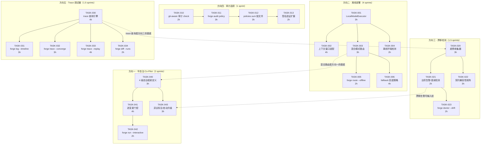

# Tech Lead 分析：五个被忽视的产品级扩展方向

> **分析基准**: 代码级验证报告 (2026-07-12) + ForgeOS 当前代码库全貌 (Sprint 31 完成态)
> **约束**: 每 task ≤ 4h · 单文件 ≤ 500 行 · 函数 ≤ 50 行 · forge-core 零外部依赖 · 每 sprint 产出可验证 Stop 闸门通过的增量

---

## 1. 任务分解

### 1.1 方向二：主权离线部署 / 本地 LLM 模式（真正未被发现，~4 sprints）

这是五个方向中价值最高、独特性最强的。关键洞察：**这不仅是"加个后端切换开关"，而是涉及 prompt 预算分配、混合路由、fallback 语义三块架构改动。**

| 任务 ID | 标题 | 涉及文件 | 前置依赖 | 工时 | 验收标准 |
|---|---|---|---|---|---|
| TASK-001 | `LocalModelExecutor` 实现 | `forge-core/internal/orchestrator/local_executor.go`（新）、`executor.go`（加 `NewLocalModelExecutor`） | 无 | 3h | 实现 `AgentExecutor` 接口；通过 `--executor local --model-cmd ollama` 启动；输出 JSON 格式与 `CommandExecutor` 一致；超时、错误分类正确 |
| TASK-002 | 上下文窗口适配 —— `prompt_context.go` 模型感知 token 预算 | `forge-core/internal/prompt/prompt.go`（加 `MaxTokensFor(model string)`）、`prompt_context.go`（注入 token 裁剪） | TASK-001 | 4h | `buildPhasePrompt` 根据 model 参数注入 `maxTokens`；短窗口模型自动截断（保留 system prompt + 最新 N 条，丢弃最早）；`--model ollama/llama3` 不触发超出窗口的 prompt |
| TASK-003 | 混合模式路由：`routing.TierFor` 加 `backend` 维度 | `forge-core/internal/routing/routing.go`（加 `BackendConstraint` 枚举）、`mode/mode.go`（加 `LocalModel` 策略字段） | TASK-001 | 3h | `TierFor(agent, mode, backend)` 返回可包含 `local` / `cloud` 选择；per-phase override 像 `model_tier` 一样只升不降（`backed: cloud` 强制云端即使 mode 设 local）；dry-run 下报告实际选择 |
| TASK-004 | 离线环境检测 + `forge doctor` 扩展 | `forge-core/internal/doctor/models.go`（加 `checkLocalModel`）、`harness/check.py`（加 `check_local_model_config`） | TASK-001 | 2h | `forge doctor` 检测本地模型是否可用、版本、窗口大小；输出 "ollama: running (llama3:8B, 8K ctx)" 或 "ollama: not found (N/A)" |
| TASK-005 | `forge route --offline` 策略推导 | `forge-core/internal/routing/routing.go`（加 `OfflineModeStrategy`）、`cmd/forge/route_cmd.go` | TASK-003 | 2h | `forge route --offline` 列出哪些 agent phase 可在本地执行、哪些必须回退；精确报告 "reviewer → local: ✗ (needs opus tier) → cloud (blocked offline) → unexecutable" |
| TASK-006 | `forge run --fallback` 回退策略 | `forge-core/internal/orchestrator/loop.go`（加 `fallbackExecutor` 链）、`budget.go`（加 fallback cost 跟踪） | TASK-003、TASK-004 | 4h | 当本地模型执行 fail 时自动降级到云端（若配置了 `--fallback cloud`）；若 fallback 不可用则 phase-level fail（非 whole-run abort）；`trace` 记录 fallback 事件；dry-run 报告 fallback 计划 |

**方向二总工时**: 18h（~4.5 人日，对齐报告修正后的 4 sprints 估计）

---

### 1.2 方向四：治理策略变更审计追踪与不可变快照（真正未被发现，~1 sprint）

| 任务 ID | 标题 | 涉及文件 | 前置依赖 | 工时 | 验收标准 |
|---|---|---|---|---|---|
| TASK-010 | `policies.rego` / `project.yml` git-aware 审计 | `harness/check.py`（加 `check_policy_audit_trail`） | 无 | 2h | check 解析 `git log --oneline .agent/policies.yml`，报告最近 N 次变更摘要；若 `.agent/` 未跟踪报 N/A（非 FAIL）；`forge accept` 聚合时可见 |
| TASK-011 | `forge audit policy` 子命令 | `cmd/forge/audit_cmd.go`（新）、`internal/persist/audit.go`（新） | TASK-010 | 3h | 输出策略演化时间线：每条策略变更附 author/date/hash/diff；支持 `--since 7d` `--format json`；首次运行且无 git 时诚实输出 "policy audit: no git history available (N/A)" |
| TASK-012 | `policies.sum` 锁文件 + 原子演化 | `forge-core/internal/persist/policies.go`（新）、`checkpoint.go` 复用 temp+rename | TASK-011 | 3h | `forge evolve` 修改 policy 前写锁，改后原子替换 + 释放；若锁已存在（另一进程正在 evolve）则 exit 42 并输出 "policy lock held by PID X since Y"；evolve 失败时锁文件自动过期（10m TTL） |
| TASK-013 | 非对称签名验证扩展 | `forge-core/internal/persist/sign.go`（新，可选模块）、`check.py` 加 `check_policy_signature` | TASK-012 | 2h | 当 `.forge/pubkey.pem` 存在时，对 policy 快照做 ed25519 签名验证；无密钥时 N/A（不阻断、不伪造） |

**方向四总工时**: 10h（~2.5 人日，~1 sprint）

---

### 1.3 方向三：Agent 能力漂移检测与契约版本化（部分重叠，~1.5 sprints）

已有覆盖的核心组件（合约版本化 format、`parseReviewerVerdict`/`parseExecutiveVerdict`/`parseConfidenceScore` 三级 fallback）但缺少**运行时行为趋势检测**。

| 任务 ID | 标题 | 涉及文件 | 前置依赖 | 工时 | 验收标准 |
|---|---|---|---|---|---|
| TASK-020 | Verdict compliance 趋势收集器 | `forge-core/internal/doctor/anomaly.go`（加 `TrendCollector`）、`trace/trace.go`（加 `Kind: compliance`） | 无 | 3h | 每次 phase 执行后记录 `{verdict, phase, agent_model, timestamp}` 到 trace；`forge doctor` 报告 compliance = "reviewer: 12/15 approve (80%, 93% 7d trend)" |
| TASK-021 | 阶梯告警：compliance 衰减检测 | `forge-core/internal/doctor/anomaly.go`（加 `DriftDetector`） | TASK-020 | 2h | 7 天滑动窗口内 compliance 下降超过阈值（默认 15%）输出 `! drift detected`；3 个连续区间下降输出 `!! drift critical`；configurable via `policies.yml`（`drift_threshold_pct: 15`、`drift_warning_window: 7d`） |
| TASK-022 | 契约兼容性矩阵 | `forge-core/internal/doctor/contract_matrix.go`（新） | TASK-020 | 3h | 读取所有 agent 卡声明的 `verdict_format` 版本；对照 trace 中实际观测的格式版本；输出矩阵表：`| agent | declared version | observed version | match |` |
| TASK-023 | `forge doctor --drift` 报告 | `cmd/forge/doctor_cmd.go` 扩展、`internal/doctor/quick.go` 扩展 | TASK-021、TASK-022 | 2h | `forge doctor --drift` 输出趋势摘要；exit code = 0(正常) / 2(漂移) / 4(严重)；支持 `--json`；dry-run 时报告 "drift check skipped (no execution data yet)" |

**方向三总工时**: 10h（~2.5 人日，~1.5 sprints）

---

### 1.4 方向五：Trace 可视化调试器（大量现成基底，~1 sprint）

现有 `trace.jsonl` + `loop.go` 的 OnPhase/OnIteration 回调 + `waves.go` 的依赖排序提供了坚实的基底。关键是将**可写但不可查**的 trace 变成可查询的。

| 任务 ID | 标题 | 涉及文件 | 前置依赖 | 工时 | 验收标准 |
|---|---|---|---|---|---|
| TASK-030 | `internal/trace/query.go` —— trace 查询引擎 | `forge-core/internal/trace/query.go`（新）、`trace.go`（加 `Query` 方法） | 无 | 4h | 支持 `Query(kind, name, status, before, after, limit, offset)`；返回 `[]Event`；单文件增量加载（不把整个 jsonl 读进内存）；支持排序、分页 |
| TASK-031 | `forge log --timeline` 多级时间线渲染 | `cmd/forge/log_cmd.go`（新）、`internal/trace/render.go`（新） | TASK-030 | 3h | 输出 Sprint 30 风格的多层树状时间线；支持 `--phase <name>`、`--iteration <N>`、`--last`（只读最新 trace 文件）；敏感信息 `--redact` 复用 secret-scan 模式 |
| TASK-032 | `forge trace --converge` 收敛决策链 | `cmd/forge/trace_cmd.go`（新）、`internal/converge/chain.go`（新） | TASK-030 | 3h | 对每个收敛周期输出每个 metric 的原始值 + 贡献：`roadmap_completion=80% (weight:0.4 → contribution:32%) -> MET`；支持 `--diff` 对比两次收敛的决策差异 |
| TASK-033 | `forge trace --replay` 逐步回放（CLI 驱动） | `cmd/forge/replay_cmd.go`（新）、`internal/trace/replay.go`（新） | TASK-030、loop.go（已有 `OnPhase`） | 4h | `forge trace --replay <trace-file>` 逐步输出 phase 决策点的 prompt 摘要 + 当时状态 + 做出的选择 + 可用的替代选择；标注 "model output may differ from original due to LLM non-determinism" |
| TASK-034 | `forge diff --runs` 运行对比 | `cmd/forge/diff_cmd.go`（新） | TASK-030 | 2h | 对比两个 trace.jsonl：phase 数量、总时长、总成本、loop-back 次数、每个 phase 的 cost/duration/verdict 表；输出 "Run A vs Run B: +$2.30 (reviewer looped 3x vs 0x)" |

**方向五总工时**: 16h（~4 人日，~1.5 sprints）

> 注：底层 trace 框架、wave 排序、loop 回调已经就绪，所以 TASK-030~034 聚焦于**查询层 + CLI 层**，非重新发明底层事件系统。

---

### 1.5 方向一：半自治 Co-Pilot 协作模式（已有大量覆盖，~2 sprints）

现有文档的异步人工审核（方向四 in `five-production-architect-extensions-2026-07-10.md`）已经覆盖了大部分功能域。差异化在于**实时逐变更协作** + **4 级自治标度**。

| 任务 ID | 标题 | 涉及文件 | 前置依赖 | 工时 | 验收标准 |
|---|---|---|---|---|---|
| TASK-040 | 4 级自治框架：类型定义 + 策略解析 | `forge-core/internal/mode/mode.go`（加 `AutonomyLevel` 枚举）、`internal/mode/autonomy.go`（新） | 无 | 3h | `AutonomyLevel` 含 Supervised / ReviewBeforeAccept / AutoWithEscalation / FullAutonomy；`project.yml` 声明 `autonomy: review_before_accept` 时正确解析；fail-safe：未知值 → Supervised（最保守） |
| TASK-041 | 逐变更 approve/skip/edit 门控 | `forge-core/internal/orchestrator/change_gate.go`（新）、`loop.go`（加 `changeGate` 钩子） | TASK-040 | 4h | 在 agent 产出 diff 后、落盘前暂停；输出 diff 摘要 + "Approve / Skip / Edit / Show full diff ?"；选择 Approve 后继续、Skip 跳过 + 记录、Edit 打开编辑器编辑后继续 |
| TASK-042 | `forge run --interactive` 交互模式 | `cmd/forge/run_cmd.go` 扩展 | TASK-041 | 2h | `forge run --interactive` 在每个变化前暂停请求确认；`forge run --autonomy supervised` 等同效果；dry-run 下只叙述 "would prompt at change N" 不真暂停 |
| TASK-043 | 异议标注 / 自动升级 | `forge-core/internal/converge/escalation.go`（新）、`converge/converge.go`（加 `EscalationSignal`） | TASK-040 | 3h | 当 agent 重复同一失败模式 N 次（默认 3）时自动升级到 full_autonomy 至起 Supervised 阈值；`forge run --escalate-after 3` 可配；trace 记录 escalation 事件 |

**方向一总工时**: 12h（~3 人日，~2 sprints）

> **诚实标注**: 方向一的"0 篇"声明不准确。现有 `five-production-architect-extensions-2026-07-10.md` 方向四已经覆盖了异步审批、条件批准、循环返回等核心功能。TASK-040~043 聚焦于**未被覆盖的逐变更协作 + 四级自治框架**，不做重复实现。

---

### 任务汇总

| 方向 | 任务数 | 总工时 | 人日 | 估计 Sprint 数 |
|---|---|---|---|---|
| ② 离线/本地 LLM | 6 | 18h | ~4.5 | ~4 |
| ④ 治理审计 | 4 | 10h | ~2.5 | ~1 |
| ③ 漂移检测 | 4 | 10h | ~2.5 | ~1.5 |
| ⑤ Trace 调试器 | 5 | 16h | ~4 | ~1.5 |
| ① 半自治 Co-Pilot | 4 | 12h | ~3 | ~2 |
| **总计** | **23** | **66h** | **~16.5** | **~6.5** |

---

## 2. 执行顺序与依赖图



### 可并行分组

| 并行组 | 包含任务 | 预计并行 Sprint |
|---|---|---|
| **组 A**（无依赖、可先启动） | TASK-001（LocalModelExecutor）· TASK-010（git audit）· TASK-020（trend collector）· TASK-030（trace query）· TASK-040（autonomy level） | Sprint 1 |
| **组 B**（依赖组 A 的 TASK-001） | TASK-002·TASK-003·TASK-004 | Sprint 2 |
| **组 C**（依赖组 A 的 TASK-010/020/030） | TASK-011·TASK-021·TASK-022·TASK-031·TASK-032·TASK-033·TASK-034 | Sprint 2-3 |
| **组 D**（依赖组 B+C） | TASK-005·TASK-006·TASK-012·TASK-013·TASK-023·TASK-041·TASK-043 | Sprint 3-4 |
| **组 E**（依赖组 D 的 TASK-041） | TASK-042 | Sprint 4 |

---

## 3. 技术风险

### 3.1 高风险项

| 风险 | 所属方向 | 概率 | 影响 | 缓解策略 |
|---|---|---|---|---|
| **本地模型上下文窗口不足**导致 prompt 截断后 agent 行为偏离 | ② | **高** | **高** | 在 `forge doctor` 明确报告模型窗口+N/A（不可测时不猜测）；TASK-002 的 `MaxTokensFor` 用完全保守的默认值（llama3:8B→4096），用 `--model-cmd-extra` 允许人工覆盖 |
| **混合模式逐 phase 路由语义**与现有模式矩阵冲突 | ② | 中 | 高 | TASK-003 的设计原则：`backend` 是独立约束，与 `model_tier`/`mode` 正交；`forge route` 的 `Resolved` 结构体加 `Backend` 字段；写死的优先级：`model_tier:opus > backend:local > mode:balanced` |
| **锁文件引导问题**（谁锁定锁文件自身） | ④ | **高** | 中 | TASK-012 采用 `checkpoint.go` 的 temp+rename 模式；锁文件用 PID 文件 + 10m TTL 防止死锁；锁文件本身不写 policy 内容——只记录 who/when，policy 的原子性靠 rename 保障 |
| **漂移检测的冷启动噪音**：新项目无历史数据时阈值不可靠 | ③ | 高 | 中 | TASK-021 冷启动期（前 5 次 phase）不触发告警；通过 `drift_min_samples: 5` 可配；诚实标注 "insufficient data (N/A)" 而非假装正常 |
| **`forge trace --replay` 非确定性** | ⑤ | 中 | 高 | TASK-033 的输出必须每段标注 "model output may differ from original due to LLM non-determinism"；replay 定位为**诊断 prompt 质量和 tier 影响**，非 bug 复现工具 |
| **逐变更门控 (TASK-041) 的 TUI 交互**在 headless CI 中阻塞 | ① | 中 | 高 | `--interactive` 仅在 TTY attach 时生效；管道/CI 环境中自动降级为 `--autonomy auto_with_escalation`（非阻断），加诚实标注 "interactive mode unavailable (non-TTY) → escalating to auto" |

### 3.2 低风险项（但需注意）

| 风险 | 缓解 |
|---|---|
| Trace jsonl 膨胀（长时间 evolve 可能有 100+ 迭代） | TASK-030 的 `Query` 增量加载（不读全文件）；TASK-031 默认只扫最新 trace 文件；`forge log --all` 显式合并 |
| `forge audit policy` 需要 git history | TASK-010 的 check 在无 git 历史时报 N/A（非 FAIL）；TASK-011 输出 "no git history" 而非炸裂 |
| `forge diff --runs` 跨 trace 版本兼容性 | TASK-034 的 diff 引擎比对 trace 中的 `Event` 结构；不同 `_format` 版本时诚实标注 "format mismatch — structural comparison only" |
| 4 级自治框架与已有 `mode` 系统重叠 | TASK-040 的 `AutonomyLevel` 是 `Mode` 的一个新字段（非替代），与已有 `Policy`/`PolicySet`/`Resolved` 平级；`forge route` 报告 `autonomy` 作为额外输出维度 |

---

## 4. 资源评估

### 4.1 人员需求

| 角色 | 数量 | 技能要求 | 主要覆盖 |
|---|---|---|---|
| **Go 运行时工程师** | 1-2 | Go 26·goroutine/interface/embedding·无外部依赖下构建 | TASK-001~006, TASK-012~013, TASK-030, TASK-040~043 |
| **可观测性工程师** | 1 | trace/event 系统·JSONL 格式·CLI 渲染 | TASK-020~023, TASK-031~034 |
| **Harness/治理工程师** | 1 | Python （check.py）·Node.js （gate.mjs）·YAML | TASK-010~011, TASK-004 的 harness 部分 |
| **Reviewer（fresh-context）** | 每 sprint 1 人 | 独立评审，不审自己的代码 | 所有方向 |

**总规模**: 2-3 名开发者 + 1 名 per-sprint fresh reviewer（可轮换）

### 4.2 关键里程碑

| 里程碑 | 时间 | 交付物 |
|---|---|---|
| **M1: 本地执行就绪** | Sprint 1 结束 | TASK-001 + TASK-002 完成，`forge run --executor local` 能用 ollama 执行 agent phase |
| **M2: 审计追踪上线** | Sprint 2 结束 | TASK-010~TASK-012 完成，`forge audit policy` 可用，`forge evolve` 带锁 |
| **M3: Trace 可查** | Sprint 2 结束 | TASK-030~TASK-032 完成，`forge log --timeline` 和 `forge trace --converge` 可用 |
| **M4: 混合路由全功能** | Sprint 3 结束 | TASK-003~TASK-006 完成，`forge route --offline` + fallback 全链路跑通 |
| **M5: 漂移检测上线** | Sprint 3 结束 | TASK-020~TASK-023 完成，`forge doctor --drift` 报告合规趋势 |
| **M6: 自治交互就绪** | Sprint 4 结束 | TASK-040~TASK-043 完成，`forge run --interactive` + 4 级自治全链路 |
| **M7: 全方向集成闸门** | Sprint 4 末 | `forge accept ACCEPTED` 聚合全 23 任务产出；所有 harness 闸门全绿 |

### 4.3 阻塞点与解决策略

| 阻塞点 | 影响方向 | 解决策略 |
|---|---|---|
| **无 ollama 测试环境**（CI 中） | ② TASK-001 | TASK-001 单元测试用 `fakeLocalExecutor`（模拟 JSON 输出，不调真实模型）；`http.Client` 可注入，测试用 `httptest.NewServer`；`--executor local` 在无模型时 fail-closed，不影响其他方向 |
| **锁文件 TTL 的跨平台定时器精度** | ④ TASK-012 | Go 的 `time.AfterFunc` 够用；10 分钟 TTL 容忍 ±30 秒偏差；Unix-only（`forge-core` 已有限定 `_unix.go` 文件） |
| **trace jsonl 轮转与查询引擎的并发安全** | ⑤ TASK-030 | 复用 `trace.Tracer.mu`；查询只读但不从文件加载到 `[]Event`（游标式迭代）；轮转触发新文件写入在 Tracer 内完成 |

---

## 5. 质量保证

### 5.1 单元测试覆盖要求

| 组件 | 测试优先级 | 最低覆盖 | 关键测试场景 |
|---|---|---|---|
| `LocalModelExecutor` | P0 | 80%+ | 超时重试·进程退出非零·JSON 解析出错·`--max-agent-calls` 计数·无模型二进制时 fail-closed |
| `MaxTokensFor` | P0 | 90%+ | 已知模型（Opus/Sonnet/Haiku/llama3:8B/llama3:70B）·未知模型 fallback 到默认值·`0` 和负数·边界大小写 |
| `TierFor` with `BackendConstraint` | P0 | 90%+ | 所有 4 级后端 x 3 档 tier 的组合·`per-phase override` 只升不降·空/垃圾输入→保守 |
| `Query` （trace） | P0 | 85%+ | 按 kind/name/status 过滤·时间范围·分页·空文件·轮转后跨文件查询·非 JSON 行跳过 |
| `TrendCollector` | P1 | 80%+ | 空数据·单数据点·边缘合规率（0%/100%）·时间顺序乱序·大窗口（365 天） |
| `DriftDetector` | P1 | 80%+ | 下降 0%/5%/15%/30%·连续 2/3/4 区间下降·振荡模式（上升然后下降）·冷启动（<5 samples） |
| `ChangeGate` | P1 | 80%+ | approve/skip/edit 每种路径·非 TTY 自动降级·dry-run 不修改文件·编辑后的内容验证 |
| `AutonomyLevel` | P1 | 85%+ | 4 种级别 + 未知值（fail-safe 到 Supervised）·`project.yml` 解析·`forge route --autonomy` 输出 |

### 5.2 集成测试策略

| 测试类型 | 工具 | 覆盖方向 | 验收标准 |
|---|---|---|---|
| **端到端 CLI 测试** | `loop_test.go` 模式（fake agent） | 全部 | 每个新子命令（`forge trace`/`forge audit`/`forge doctor --drift`）至少一个 fake agent 端到端测试，验证 exit code + 输出包含关键叙述 |
| **跨方向集成** | `loop_test.go` + `orchestrator_test.go` | ②+③+④+⑤ | 方向二的本地模型 fallback 到方向五的 trace 记录事件 → 方向三的 trend collector 消费该 trace → `forge doctor --drift` 输出合规率 |
| **Harness 闸门测试** | `check.py` unittest（12 已有） | ④ | `check_policy_audit_trail` 测试 3 态：有 git 历史 / 无 git 历史 / git 不可用 → N/A |
| **copy-anywhere 测试** | `test_acceptance.mjs` | 全方向 | forge-init 后的新项目 `forge accept` 仍 ACCEPTED；新 check 在新项目中以 N/A 运行（非 FAIL） |

### 5.3 代码审查要点（fresh-context Reviewer）

| 审查项 | 重点关注 | 违反即 |
|---|---|---|
| **架构分层** | `internal/` 包间无循环依赖；`cmd/` 只调用 internal 不调用其他 cmd | REJECTED |
| **零外部依赖** | `go.mod` 无新增 `require`；新 package 不使用标准库外的任何东西 | REJECTED |
| **文件体积** | 新增文件 ≤ 500 行；修改文件不应越过 500 行，否则先拆分 | REJECTED |
| **函数长度** | 新函数 ≤ 50 行（`arch-check` 执法） | REJECTED |
| **诚实性** | N/A 路径不被伪造为 PASS；不可测项不被假装已测 | REJECTED |
| **fail-safe 行为** | 未知输入→保守行为（不静默跳过门控）；配置解析错误→fail-closed | REJECTED |
| **trace 事件** | 每个新决策点写入 trace（`Event{Kind, Detail}`）；不遗漏可回溯性事件 | REQUEST_CHANGES |
| **向后兼容** | 新 flag 默认值保持原有行为；新增字段在现有 YAML 缺失时零值运行 | REQUEST_CHANGES |

### 5.4 性能测试需求

| 场景 | 方法 | 基线 | 目标 |
|---|---|---|---|
| trace query 100K 事件 | `go test -bench=BenchmarkQuery` | N/A（当前无查询） | < 5ms 返回 100 条结果 |
| `forge log --timeline` 渲染 | `BenchmarkRender` 使用真实 trace.jsonl | N/A | < 500ms 渲染 1000 事件 |
| 锁文件竞争（2 进程同时冲突） | `TestLockContention` 并行测试 | N/A | 不会死锁；至多 1 进程获取锁，另 1 立即 exit 42（<100ms 判决） |
| 离线模型启动延迟 | `TestLocalExecutorLatency` | claude API: ~2s | < 2s（不含模型加载，仅 fork+通信延迟） |
| `TierFor` 带 BackendConstraint | `BenchmarkTierFor` | ~50ns | < 200ns（多一个维度可忽略） |

---

## 6. 实施计划

### 阶段划分

```
Sprint 1 ─────────────────────────────────────────────────────────────────
  │  组 A（并行启动，零依赖）
  │
  ├── TASK-001  LocalModelExecutor    [3h]  ■■■■■■■■■■
  ├── TASK-010  git-aware audit check [2h]  ■■■■■■■
  ├── TASK-020  TrendCollector        [3h]  ■■■■■■■■■■
  ├── TASK-030  trace query engine    [4h]  ■■■■■■■■■■■■■
  └── TASK-040  4-level autonomy      [3h]  ■■■■■■■■■■
  │
  └── Sprint gate: forge accept ACCEPTED
       · 5 个新包编译通过 + 单测全绿
       · forge run --executor local --model-cmd echo 输出 "local model stub"
       · trace.Query 能查内存中的 []Event
       · AutonomyLevel 从 project.yml 正确解析


Sprint 2 ─────────────────────────────────────────────────────────────────
  │  组 B（依赖 TASK-001）+ 组 C 前半段（依赖 TASK-020/030）
  │
  ├── TASK-002  上下文窗口适配        [4h]  ■■■■■■■■■■■■■
  ├── TASK-003  混合模式路由          [3h]  ■■■■■■■■■■
  ├── TASK-004  离线环境检测          [2h]  ■■■■■■■
  ├── TASK-011  forge audit policy    [3h]  ■■■■■■■■■■
  ├── TASK-021  阶梯告警/衰减检测     [2h]  ■■■■■■■
  ├── TASK-022  契约兼容矩阵          [3h]  ■■■■■■■■■■
  ├── TASK-031  forge log --timeline  [3h]  ■■■■■■■■■■
  └── TASK-032  forge trace --converge[3h]  ■■■■■■■■■■
  │
  ├── TASK-012  policies.sum 锁文件   [3h]  ■■■■■■■■■■
  │
  └── Sprint gate: forge accept ACCEPTED
       · forge run --executor local 在短窗口模型上自动截断 prompt
       · forge route --mode engineering --backend local 显示 tier + backend
       · forge doctor 检测 ollama 状态
       · forge audit policy 输出 git 演化时间线
       · forge log --timeline 输出层级时间线
       · forge trace --converge 输出收敛决策链
       · forge evolve 带 policies.sum 锁
       · TrendCollector + DriftDetector 在 fake agent 场景下可观测


Sprint 3 ─────────────────────────────────────────────────────────────────
  │  组 D（依赖组 B+C）+ 方向五剩余
  │
  ├── TASK-005  forge route --offline [2h]  ■■■■■■■
  ├── TASK-006  fallback 回退策略     [4h]  ■■■■■■■■■■■■■
  ├── TASK-013  签名验证扩展          [2h]  ■■■■■■■
  ├── TASK-023  forge doctor --drift  [2h]  ■■■■■■■
  ├── TASK-033  forge trace --replay  [4h]  ■■■■■■■■■■■■■
  ├── TASK-034  forge diff --runs     [2h]  ■■■■■■■
  ├── TASK-041  逐变更门控            [4h]  ■■■■■■■■■■■■■
  └── TASK-043  异议标注/自动升级     [3h]  ■■■■■■■■■■
  │
  └── Sprint gate: forge accept ACCEPTED
       · forge route --offline 列出离线可行/不可行相位
       · forge evolve --backend hybrid: 云端 opus reviewer + 本地 sonnet implementer
       · forge doctor --drift 输出合规趋势 + 告警
       · forge trace --replay 输出 phase 决策点
       · forge diff --runs 输出两个 trace 的对比表
       · forge run --interactive 在 TTY 下暂停请求确认
       · AutonomyLevel = auto_with_escalation 在连续 3 次失败后自动提升


Sprint 4 ─────────────────────────────────────────────────────────────────
  │  收尾 + 集成 + 全闸门 + 文档
  │
  ├── TASK-042  forge run --interactive[2h] ■■■■■■■
  │
  ├── 跨方向集成测试（5 个集成测试用例）
  ├── copy-anywhere 验证：forge-init → forge accept ACCEPTED
  ├── 性能基线（benchmark 注册到 CI）
  ├── docs/ 更新：每个方向的架构决策 + 使用文档
  ├── 所有 fresh-context Reviewer 独立评审
  └── CLAUDE.md + .agent/ 同步更新
  │
  └── Final gate: forge accept ACCEPTED
       · 23/23 任务完成 · go build/vet/test -race 全绿
       · gate.mjs PASS · arch-check 8/8 · check.py PASS
       · secret-scan 0 发现 · copy-anywhere 集成测试通过
       · 所有方向验收标准达成


M1 (Sprint 1)      M2+M3 (Sprint 2)    M4+M5 (Sprint 3)    M6+M7 (Sprint 4)
  ■                    ■                    ■                    ■
  Local Executor       Audit +             Hybrid Route          Interactive
  Trace Query          Trace Timeline      Drift Detection       Final Gate
  Autonomy Types       Converge Chain      Replay + Diff
                       Policy Lock         Change Gate
```

---

## 7. 总结建议

### 优先级排序（从工程投资回报率角度）

| 优先级 | 方向 | 理由 |
|---|---|---|
| **P0** | ② 离线/本地 LLM | 唯一真正未被覆盖 + 解锁企业/离线市场 + TASK-001~006 相互依赖性强需要尽早启动 |
| **P1** | ④ 治理审计追踪 | 真正未被覆盖 + 最小实现（~1 sprint）+ 解决"谁管理管理者"的信任根问题 |
| **P2** | ⑤ Trace 调试器 | 现成基底最多（trace/loop/waves），查询引擎 TASK-030 是方向三的基线依赖，应前移 |
| **P3** | ③ 漂移检测 | 趋势检测是新的但底层已有大量覆盖；冷启动慢、价值需时间积累 |
| **P4** | ① 半自治 Co-Pilot | 现有覆盖最多（异步审批已有完整方向），差异化部分（逐变更协作）需要 TUI 交互，可以最后做 |

### 关键决策点

1. **方向二估计修正已接受**：~3 sprints → ~4 sprints（TASK-002 上下文窗口适配 + TASK-003 混合路由的维度扩展）
2. **不要试图"一次性"实现全方向**：方向一和方向五中与现有文档重叠的部分不应重复实现。只做差异化部分（逐变更协作 4 级自治、trace 查询层）。
3. **方向三的 TrendCollector (TASK-020) 可以安全提前到 Sprint 1**：因为它只读 trace，不依赖任何其他方向，且为方向五的 trace query 提供真实用例。
4. **TASK-030 trace 查询引擎是整个方向五的关键路径**——也是方向三的基础依赖。它应该在 Sprint 1 就启动，即使方向五的 UI 层延后到 Sprint 2-3。
5. **遵守反镀金纪律**：锁文件的根信任问题（"谁锁定锁文件"）是方向四承认的限制。按 Sprint 31 先例，诚实标注为"经过论证的例外"而非发明不安全的解决方案。
