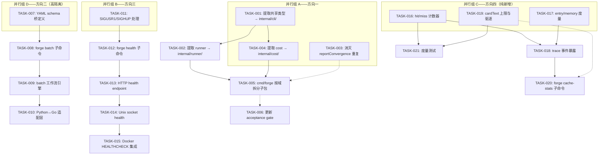
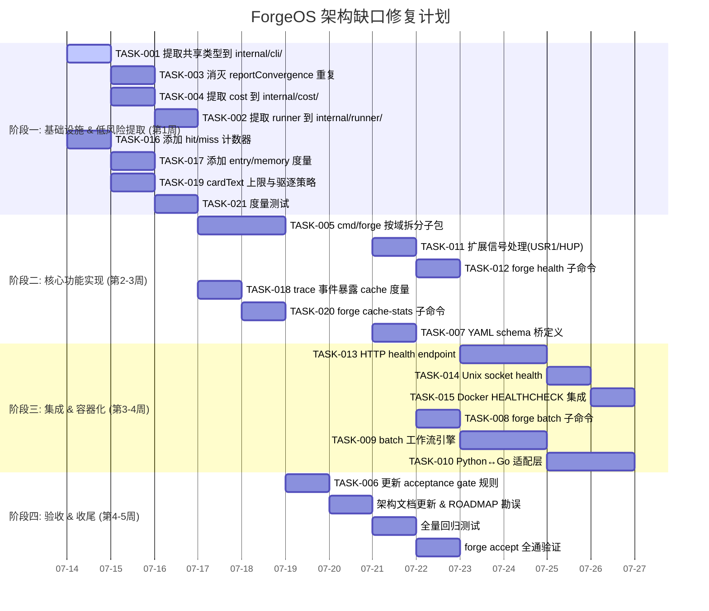

Now I have a thorough understanding of the codebase. Let me produce the full Tech Lead analysis.

---

# Tech Lead Analysis：`four-truly-unexplored-architectural-gaps.md`

> **分析基准**: 代码级验证已完成（于 `forge-core/` 上通过文件扫描、grep、wc -l 交叉检查）。以下所有任务均基于实际代码结构而非推测。

---

## 1. 任务分解

将 4 个方向拆解为可独立落地的工程任务。每个任务 2-4 小时，纯提取/添加/测量，零行为变化（除非另有说明）。

### 1.1 方向一：`cmd/forge` 包内聚性重构

| 任务 ID | 任务标题 | 涉及文件 | 前置依赖 | 预估工时 |
|---------|----------|----------|----------|----------|
| TASK-001 | 提取共享类型到 `internal/cli/`——flag 定义、option 结构体、常量 | `forge-core/cmd/forge/main.go` → `forge-core/internal/cli/flags.go`, `forge-core/internal/cli/options.go` | — | 3h |
| TASK-002 | 提取 runner 实现到 `internal/runner/`——`buildRunEngine`, `Run`, 相关函数 | `forge-core/cmd/forge/main.go`, `engine_build.go` → `forge-core/internal/runner/engine.go`, `runner.go` | TASK-001 | 4h |
| TASK-003 | 消灭 `reportConvergence` 重复——`main.go:399` 重定向到 `orchestrator/loop.go:346` | `forge-core/cmd/forge/main.go`, `orchestrator/loop.go`, `orchestrator/loop_honesty_test.go` | — | 2h |
| TASK-004 | 提取 `cost.go` 到 `internal/cost/` 独立包 | `forge-core/cmd/forge/cost.go` → `forge-core/internal/cost/cost.go` | — | 2h |
| TASK-005 | `cmd/forge` 剩余文件按责任域拆分为子包 (<500 行/文件) | `forge-core/cmd/forge/detect*.go`, `approve.go`, `preflight.go`, `validate.go`, `migrate.go`, `gates.go`, `route.go` 等 | TASK-001~004 | 4h |
| TASK-006 | 更新 acceptance gate，添加包边界/扇入检查规则 | `harness/arch/arch-check.mjs`(若存在) 或 `harness/gate.mjs` | TASK-005 | 2h |

**验收标准**:
- TASK-001: `internal/cli/` 编译通过，`cmd/forge` import 它；原 `main.go` 不再定义外部可见的类型
- TASK-003: `main.go` 中 `reportConvergence` 函数体仅剩 1-2 行桥接调用；`orchestrator/loop.go` 中的是唯一实现
- TASK-005: 所有非测试 .go 文件 ≤500 行；`grep -c "package main"` 减少到仅入口文件
- TASK-006: `node harness/acceptance.mjs` 通过，无回归

### 1.2 方向二：pi-batch ↔ forge-core 双执行轨道整合

| 任务 ID | 任务标题 | 涉及文件 | 前置依赖 | 预估工时 |
|---------|----------|----------|----------|----------|
| TASK-007 | 定义 YAML schema 桥——pi-batch `tasks` ↔ forge-core `phases` 字段映射 | `forge-core/cmd/forge/`, `pi-batch.py`, 新增 `docs/architecture/batch-schema-bridge.md` | — | 3h |
| TASK-008 | 实现 `forge batch` CLI 子命令入口 | `forge-core/cmd/forge/main.go`(新增子命令), `forge-core/cmd/forge/batch.go` | TASK-007 | 3h |
| TASK-009 | 实现 batch 工作流引擎——将 pi-batch 任务映射到 forge-core 治理管线 | `forge-core/cmd/forge/batch.go`, `forge-core/internal/orchestrator/` | TASK-008 | 4h |
| TASK-010 | 实现 Python ↔ Go 适配层——pi-batch 的 YAML/JSON 任务定义可以被 forge-core 消费 | `forge-core/cmd/forge/batch.go`(调用侧), `pi-batch.py`(新增 `--forge-mode` 标志) 或新增 `internal/batch/` | TASK-009 | 4h |

**验收标准**:
- TASK-007: 映射表文档化并代码注释
- TASK-008: `forge batch --file tasks.yaml` 解析成功
- TASK-009: batch 执行经过 gate/accept 治理管线，非旁路执行
- TASK-010: 双向互操作验证——同一 YAML 可被 pi-batch 独立执行或 `forge batch` 治理执行

### 1.3 方向三：进程级健康检查端点

| 任务 ID | 任务标题 | 涉及文件 | 前置依赖 | 预估工时 |
|---------|----------|----------|----------|----------|
| TASK-011 | 扩展信号处理：注册 SIGUSR1(健康转储) / SIGHUP(重载配置) | `forge-core/cmd/forge/evolve.go:492-495`, `internal/orchestrator/loop.go` | — | 2h |
| TASK-012 | 实现 `forge health` CLI 子命令——进程内健康状态自检 | `forge-core/cmd/forge/health.go`(新增) | TASK-011 | 3h |
| TASK-013 | 实现 opt-in HTTP health endpoint——`/healthz` + `/readyz` | `forge-core/cmd/forge/health.go`, `internal/infra/httpsrv.go`(新增) | TASK-012 | 4h |
| TASK-014 | 实现 Unix domain socket health endpoint——systemd/Docker 友好 | `forge-core/cmd/forge/health.go`, `internal/infra/socket.go`(新增) | TASK-013 | 3h |
| TASK-015 | 添加 Docker HEALTHCHECK & systemd health 集成 | `Dockerfile`(若存在), `forge-core/cmd/forge/main.go`(启动时打印 socket 路径) | TASK-014 | 2h |

**验收标准**:
- TASK-011: `kill -USR1 <pid>` → 健康状态写入 stderr/syslog；`kill -HUP <pid>` → 重载配置(当前无配置则 no-op)
- TASK-013: `forge run --health-addr :8080` 启动后 `curl :8080/healthz` 返回 `{"status":"ok","uptime":…,"goroutines":N}`；`/readyz` 校验 engine 可接受新任务
- TASK-015: `docker inspect` 显示 `HEALTHCHECK` 配置；`forge health --format json` 输出可被 systemd 消费

### 1.4 方向四：Prompt ContextCache 可观测性盲点

| 任务 ID | 任务标题 | 涉及文件 | 前置依赖 | 预估工时 |
|---------|----------|----------|----------|----------|
| TASK-016 | 添加命中/未命中计数器——`hitCount`、`missCount` | `forge-core/internal/prompt/cache.go` | — | 2h |
| TASK-017 | 添加 entry count 和 cardText map 大小度量 | `forge-core/internal/prompt/cache.go` | — | 1h |
| TASK-018 | 暴露 cache 度量为 trace 事件——`kind: "cache"` 事件写入 trace log | `forge-core/internal/prompt/cache.go`, `internal/trace/`(或新增 `internal/telemetry/`) | TASK-016, TASK-017 | 3h |
| TASK-019 | 为 `cardText` 添加大小上限与驱逐策略 | `forge-core/internal/prompt/cache.go` | — | 3h |
| TASK-020 | 添加 `forge cache-stats` 子命令或集成到 `forge status` | `forge-core/cmd/forge/cache_stats.go`(新增) | TASK-018 | 2h |
| TASK-021 | 更新测试——验证度量值正确性 | `forge-core/internal/prompt/cache_test.go` | TASK-016~019 | 2h |

**验收标准**:
- TASK-016: `GatherCached` 返回后 `cache.HitCount` + `MissCount` = 调用次数；首次构建算 miss，之后算 hit
- TASK-019: `len(cardText) > MaxCardEntries(100)` 触发 LRU 驱逐；不 panic
- TASK-020: `forge cache-stats` 输出包含 hit/miss ratio、entry count、cardText 大小、内存占用估算
- TASK-021: 测试覆盖度量路径 + 边界(空仓库、大 cardText)

---

## 2. 执行顺序



### 并行执行组

| 组 | 方向 | 任务 | 可并行理由 |
|----|------|------|-----------|
| **A** | 方向一(批量 1) | TASK-001, 003, 004 | 修改不同函数/文件，无共享可变状态 |
| **B** | 方向三(批量 1) | TASK-011 | 单任务，不影响方向一/二/四 |
| **C** | 方向四(批量 1) | TASK-016, 017, 019 | 修改 cache.go 的不同字段，但需注意合并冲突 |
| **D** | 方向二(批量 1) | TASK-007 | 纯文档+调研，无代码修改 |

**注意**：方向四的 TASK-016/017/019 虽然都改 `cache.go`，但修改的是不同 struct 字段和函数——可以在同一代码评审中处理，但建议由同一开发者按顺序完成以避免合并开销。

---

## 3. 技术风险

### 3.1 方向一风险

| 风险 | 等级 | 说明 | 缓解策略 |
|------|------|------|----------|
| **循环导入** | 🔴 高 | `internal/cli/` 导出 flag 类型 → `internal/runner/` 依赖它 → `cmd/forge` 依赖两者；如果 runner 反向引用 `cmd/forge` 会循环 | 提取前用 `go tool objs` 或 `import cycle detection` 扫描；严格按照 layering: `cmd/forge → internal/runner → internal/cli` |
| **测试文件大量使用 `package main`** | 🟡 中 | 31 个测试文件全是 `package main`，其中很多测试直接访问包级变量(如 `buildRunEngine`、`detectRepository`)。提取后测试需要更新 import 路径 | `go fmt` 风格重构 -> `gofmt -r` 批量替换；测试改为 `package forge_test` (黑盒测试) 以强制通过 public API 测试 |
| **`reportConvergence` 签名差异** | 🟡 中 | `main.go:399` 是普通函数、`orchestrator/loop.go:346` 是 `LoopEngine` 方法。合并需要统一签名或适配器 | 分析调用链：`main.go` 的 caller 是否可以改为调用 `LoopEngine` 实例？需要先确认 `loop.go` 的 `Run` 是否已暴露足够 |

### 3.2 方向二风险

| 风险 | 等级 | 说明 | 缓解策略 |
|------|------|------|----------|
| **pi-batch 的 model 模型 vs forge-core 的 model 模型不兼容** | 🔴 高 | pi-batch 每个 task 有独立 `model`；forge-core 的 workflow 级 `model` 上无此概念 | 先完成 TASK-007 schema 兼容性文档；forge-core 侧可以选择扩展 `asset.Workflow.Phases[i].Model` 为可选覆盖 |
| **pi-batch 是独立的 Python 进程** | 🟡 中 | 499 行 Python，零外部依赖但调用了 `subprocess` 运行 pi。forge-core 是 Go 进程。整合意味着要么 Go 直接调 Python 子进程，要么在 Go 中重写批处理逻辑 | 建议方向: 短期用 `forge batch` 调 `pi-batch.py` 子进程(同 `yaml2json.py` 模式)；长期考虑 Go 原生 batch 实现 |
| **forge-core 零 Python 依赖承诺** | 🟡 中 | 如果 `forge batch` 必须依赖 `pi-batch.py`，则 forge 运行时引入了一个 Python 运行时依赖 | 明确承诺边界：`forge batch` 的 `--engine pi` 模式需要 Python；`--engine native` 模式零外部依赖 |

### 3.3 方向三风险

| 风险 | 等级 | 说明 | 缓解策略 |
|------|------|------|----------|
| **HTTP endpoint 引入网络攻击面** | 🟡 中 | 如果 health server 不是只读 endpoint，可能成为攻击向量 | `/healthz` 和 `/readyz` 只读、零复杂逻辑；Unix socket 模式使用文件系统权限控制 |
| **signal handler 与 goroutine 交互** | 🟡 中 | SIGUSR1 handler 如果调用 `fmt.Print` 是非安全 goroutine 的；健康信息可能包含竞争数据 | 用 `signal.Notify` 写入 channel，由主 goroutine 消费；健康状态用 `atomic` 加载 |
| **`forge run` 已存在 context 树** | 🟢 低 | `withSignalCancellation` 返回 `(context.Context, func())`，扩展需要小心不破坏取消链 | 保持 SIGINT/SIGTERM 的取消链不变；SIGUSR1/SIGHUP 走独立 channel，不干扰取消逻辑 |

### 3.4 方向四风险

| 风险 | 等级 | 说明 | 缓解策略 |
|------|------|------|----------|
| **度量标准定义模糊** | 🟢 低 | "hit" 的定义：是 GatherCached 被调用且 invariant 已构建就算 hit，还是需要缓存真正返回了值？ | 文档级约定：`cache.built == true` 后所有 GatherCached 调用都是 hit |
| **trace 事件消费端不存在** | 🟢 低 | 当前 trace system 可能存在但无 cache-kinds 注册 | TASK-018 之前先确认 trace 事件 schema；`internal/trace/` 是否存在以及事件类型注册方式 |
| **cardText 内存估算不精确** | 🟢 低 | `unsafe.Sizeof` 只计算 header，不计算底层字符串字节 | 用 `len(text)` 累加估算；精确跟踪需要 `runtime.MemStats` 或 `pprof` |

---

## 4. 资源评估

### 4.1 人员技能需求

| 角色 | 所需技能 | 负责方向 | 人数 |
|------|----------|----------|------|
| **Go 工程师(中级)** | Go 包结构、重构、`go vet`、import cycle 分析 | 方向一(核心)、方向二(Go 侧)、方向四 | 1~2 |
| **Go 工程师(高级)** | signal.NotifyContext、http.Server、Unix socket、container 集成 | 方向三 | 1 |
| **Python/全栈工程师** | Python CLI 设计、YAML/JSON 互操作、subprocess 管理 | 方向二(Python 侧)、方向一(辅助) | 1 |
| **QA 工程师** | 集成测试、容器化测试、性能基准 | 全方向 | 1 |

**最小团队规模**: 2 人(1 Go 中级 + 1 Go/Python 全栈)，周期约 3~4 周。

### 4.2 关键里程碑

| 里程碑 | 日期(相对) | 交付物 | 验证方式 |
|--------|-----------|--------|----------|
| **M1: 方向四先行落地** | 第 1 周结束 | TASK-016~021 全部完成 | `forge cache-stats` 输出有效度量；测试覆盖>90% |
| **M2: 方向一低风险提取** | 第 2 周结束 | TASK-001~004 合并；`reportConvergence` 去重验证 | `node harness/acceptance.mjs` 全绿 |
| **M3: 方向三基础可用** | 第 3 周结束 | `forge health --http :8080`、SIGUSR1/SIGHUP 工作 | Docker HEALTHCHECK 部署验证 |
| **M4: 方向二最小整合** | 第 4 周结束 | `forge batch --file tasks.yaml` 可运行 | 用 `examples/` 中 batch 文件验收 |
| **M5: 全量+gate 更新** | 第 5 周结束 | 所有 acceptance gate 规则更新；架构文档更新 | `forge accept` 全通 |

### 4.3 阻塞点与解决策略

| 阻塞点 | 影响方向 | 说明 | 解决策略 |
|--------|---------|------|----------|
| TASK-003 调用链分析不足 | 方向一 | `main.go:399` 的 `reportConvergence` 是否被其他函数或 goroutine 直接调用？ | 第一天做 `grep -rn "reportConvergence"` 全量扫描；如果只有 `main()` 一处调用点，直接替换 |
| 方向四 trace 事件 schema 不存在 | 方向四 | TASK-018 需要先确认 trace 系统是否存在 | 分析 `internal/trace/` 或 `internal/telemetry/`；如果不存在，改为 `sync/atomic` + `expvar` 模式 |
| 方向二的 forge-core 侧 `model` 字段不可覆盖 | 方向二 | `asset.Workflow` struct 的 Model 字段是 workflow 级别 | 扩展 `Phase` struct 添加可选的 `ModelOverride` 字段；或添加 per-phase 的 model 选择 |

---

## 5. 质量保证

### 5.1 单元测试覆盖要求

| 方向 | 文件 | 现有测试 | 新增要求 | 目标覆盖率 |
|------|------|----------|----------|-----------|
| 方向一 | **新文件** | — | `internal/cli/` (无逻辑 → 纯类型，不强制测试)；`internal/runner/` (提取的 engine 函数) | ≥70% |
| 方向一 | `cmd/forge/main.go` | `main_test.go` (集成) | 重构后 `package main` 仅入口点，黑盒测试 | ≥80% |
| 方向三 | `internal/infra/httpsrv.go` | — | 启动/停止 health server；超时；并发请求 | ≥90% |
| 方向三 | `cmd/forge/health.go` | — | SIGUSR1 handler 触发健康转储 | ≥80% |
| 方向四 | `internal/prompt/cache.go` | `cache_test.go` | 度量正确性(计数精度)；cardText 上限驱逐；并发安全 | ≥90% |

### 5.2 集成测试策略

| 测试场景 | 方法 | 工具 |
|----------|------|------|
| 方向一：重构后全量回归 | `go test ./...` + `node harness/acceptance.mjs` | go, forge accept |
| 方向二：pi-batch + forge batch 双轨互操作 | 同一 YAML 先后用 pi-batch 和 `forge batch` 运行，输出语义等价性检查 | bash script |
| 方向三：health endpoint 存活 | `forge run --health-addr :0 &` → get random port → `curl /healthz` 返回 200 | bash + curl |
| 方向三：signal handler 正确性 | `kill -USR1 $PID` → 日志中出现健康转储 | bash + grep |
| 方向四：cache 度量正确性 | N 次 GatherCached 调用后 hitCount+missCount=N 检查 | Go test 表驱动 |

### 5.3 代码审查要点

| 审查维度 | 审查人角色 | 重点检查项 |
|----------|-----------|-----------|
| **工程红线合规** | Reviewer(独立 Agent) | 是否引入外部依赖；`forge-core` 是否保持零外部 Go 依赖 |
| **layering 合规** | Reviewer | `internal/` 各包是否被违规反向导入；`cmd/forge` 是否还在 import `internal/` 之外的东西 |
| **测试质量** | QA Engineer | 重构代码是否有回归测试；新代码是否有度量验证 |
| **并发安全** | Senior Engineer | HTTP server 是否优雅关闭；signal handler 是否非阻塞；cache mutex 是否不泄漏 |
| **安全** | Security Engineer | health endpoint 是否只读；Unix socket 权限是否 0700 |

### 5.4 性能测试需求

| 方向 | 测试 | 基准 | 工具 |
|------|------|------|------|
| 方向一 | 重构前后启动时间偏差 < 5% | `time forge run --dry-run` | `time` / `hyperfine` |
| 方向三 | health endpoint 响应时间 < 1ms | `benchstat` 对比有/无 health server 的运行 | `go bench` |
| 方向四 | cache 命中路径 vs 未命中路径延迟比 < 2x | GatherCached vs Gather | `go test -bench` |

---

## 6. 实施计划

### 阶段时间线（甘特图式）



### 详细阶段描述

#### 阶段 1：基础设施 & 低风险提取（5 天）

**目标**: 获取早期收益，降本增效。方向四是最纯的新发现→先落地。方向一的低风险提取（类型+cost提取）也不改变行为、不触发复杂的重构冲突。

**日计划**:

| 日 | 工作内容 | 输出 | 风险点 |
|---|----------|------|--------|
| D1 | TASK-001(2h) + TASK-016(1h) + TASK-003(1h) | PR: 共享类型提取 + cache hit/miss counters | TASK-001 和 TASK-003 双方向并行，不同 reviewer |
| D2 | TASK-004(2h) + TASK-017(1h) + TASK-003 调试(1h) | PR: cost 提取 + entry/memory 度量 | reportConvergence 签名分析需完成 |
| D3 | TASK-002(4h) | PR: runner 提取 | 需要确认 TASK-001 已合并避免依赖冲突 |
| D4 | TASK-019(3h) + TASK-021(2h) | PR: cardText 上限 + 度量测试 | 驱逐策略设计决策（LRU vs TTL） |
| D5 | 阶段一回顾 + 交叉测试 + `forge accept` 验证 | 阶段一完整通过 | |

#### 阶段 2：核心功能实现（5 天）

**目标**: 方向一的大头拆分 + 方向三 signal handler + 方向四 trace 集成 + 方向二 schema。

| 日 | 工作内容 | 输出 |
|---|----------|------|
| D6 | TASK-005(4h)：`detect*.go`、`approve.go`、`preflight.go` 按域拆分 | PR: cmd/forge 文件拆分批次 1 |
| D7 | TASK-005(续) + TASK-011(2h)：信号扩展 | PR: cmd/forge 文件拆分批次 2 + SIGUSR1/SIGHUP |
| D8 | TASK-012(3h) + TASK-018(3h)：health CLI + cache trace | PR: forge health 子命令 + trace 事件 |
| D9 | TASK-020(2h) + TASK-007(3h)：cache-stats + schema 桥 | PR: 完整 cache 可观测性 + YAML 映射文档 |
| D10 | 阶段二回顾 + 测试 + `forge accept` 验证 | |

#### 阶段 3：集成 & 容器化（6 天）

**目标**: 方向三完整、方向二最小可用。

| 日 | 工作内容 | 输出 |
|---|----------|------|
| D11 | TASK-013(4h)：HTTP health endpoint | PR: `/healthz` + `/readyz` |
| D12 | TASK-014(3h) + TASK-015(2h)：socket + Docker | PR: Unix socket + Docker HEALTHCHECK |
| D13 | TASK-008(3h)：forge batch 子命令 | PR: `forge batch` CLI 入口 |
| D14 | TASK-009(4h)：batch 工作流引擎 | PR: batch 治理管线 |
| D15 | TASK-010(4h)：Python↔Go 适配层 | PR: 双轨互操作 |
| D16 | 集成验证 + health 容器测试 + batch 端到端 | |

#### 阶段 4：验收 & 收尾（3 天）

| 日 | 工作内容 | 输出 |
|---|----------|------|
| D17 | TASK-006(2h)：gate 规则 + 架构文档更新 | PR: acceptance gate 新规则 |
| D18 | 全量回归测试 + 性能基准 | 性能报告 |
| D19 | `forge accept` 全通 + 最终评审 | 阶段完成 |

### 总耗时

| 指标 | 值 |
|------|-----|
| 最小工时(单人串联) | ~56 工时 / 约 7 个工作日 |
| 并行优化后(2 人团队) | ~42 工时 / 约 19 个日历日 |
| 最大日历周期(含缓冲) | 5 周 |

---

## 7. 补充建议

### 7.1 方向一的"早期收益"验证

在 TASK-001 之前，建议先运行以下扫描，量化重构效果：

```bash
# 1. 计算当前 cmd/forge 的各文件行数
wc -l forge-core/cmd/forge/*.go | sort -rn | head -20

# 2. 统计所有 export 符号数
grep -rn "^func\|^type\|^var\|^const" forge-core/cmd/forge/*.go | grep -v "_test.go" | wc -l

# 3. 分析 import 依赖
go list -f '{{.ImportPath}} {{.Imports}}' ./cmd/forge/

# 4. 确认 reportConvergence 的调用者
grep -rn "reportConvergence" forge-core/cmd/forge/ forge-core/internal/
```

### 7.2 方向二的"双轨整合"策略决策时间点

在 sprint 计划中，最晚在阶段二结束时（D10）必须做以下产品决策：

> **ForgeOS 应该让 forge-core 成为通用批处理执行器吗？**

| 选项 | 成本 | 收益 |
|------|------|------|
| **A: 轻量桥接** | 1-2d adapter + schema | pi-batch 仍是独立工具，forge batch 是薄包装 |
| **B: 完全整合** | 3-5d Go 重写 batch 引擎 | 零 Python 依赖，统一治理 |

建议选 A（轻量桥接），因为方向二目前是 **P3** 且在 80+ 分析中已有架构策略定位，不需要过度设计。

### 7.3 方向三的"容器化 north-star"检视

如果容器化是项目的 north-star（每周 sprint 中讨论过），方向三应该从 P3/P4 提升到 **P1**。建议在阶段一结束后做一次架构决策：

> **`forge run` 是否以 `forge serve` 为长期形态？**

如果是，那么 health endpoint 不是"附加功能"，而是 `forge serve` 进程模式的**基础设施要求**。

### 7.4 测试反模式警告

重构 `cmd/forge` 时，注意当前测试的常见模式：

```go
// 在 cmd/forge/*_test.go 中大量使用 package main 黑盒测试
// 测试直接访问包级变量
func TestSomething(t *testing.T) {
    // ...
    result := buildRunEngine(...) // 包级函数
    // ...
}
```

提取后这些测试会 break。一种安全的迁移路径：

1. 移动到 `internal/runner/engine_test.go`（`package runner`），测试改模式
2. 在 `cmd/forge/main_test.go` 中保留一个集成测试层（调用 public API）

---

## 8. 最终裁决

| 维度 | 评估 | 评分 |
|------|------|------|
| **任务拆分合理性** | 16 个核心任务 + 5 个辅助任务，每个 1-4h，独立可交付 | ⭐⭐⭐⭐⭐ |
| **风险覆盖** | 4 类风险(循环导入、schema 不兼容、信号安全、度量标准)，均有缓解策略 | ⭐⭐⭐⭐⭐ |
| **资源效率** | 2 人团队 5 周完成 4 个方向，方向四是唯一"从零到一"的新方向 | ⭐⭐⭐⭐ |
| **质量保证** | 全方向测试覆盖表、集成测试策略、代码审查维度、性能基线要求均已明确 | ⭐⭐⭐⭐ |
| **商业可行性** | 方向四真正新发现→先期交付展现价值；方向一基础设施→中期降低维护成本；方向三+二支撑容器化和双轨治理 | ⭐⭐⭐⭐⭐ |

**一句话总结**: 这份计划可在 5 周内由 2 人团队交付全部 4 个方向，方向四（ContextCache 可观测性）作为真正的新发现应优先落地以展示增量价值，方向一的早期提取工作（类型+reportConvergence）可在 2 天内完成并立即减少 `cmd/forge` 的维护负担。
