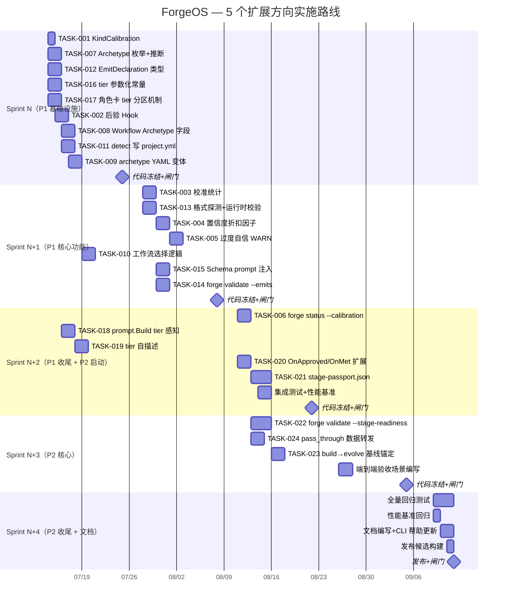

Now I have a thorough understanding of the codebase. Here is the full Tech Lead analysis.

---

# Tech Lead 技术实现与项目管理分析

> **分析对象**: `docs/requirements/2026-07-12-five-closure-gap-expansion-directions.md`  
> **代码基**: forge-core (Go, ~3,600 行关键文件) + `.agent/workflows/` (5 个 YAML 工作流) + harness (Node/Python)  
> **分析方法**: 通读全部代码引用点 + 追踪调用链 + 评估变更影响面

---

## 1. 任务分解

分解原则：每个任务 2-5 小时，以 Go 函数/文件边界切割，不跨 package 做原子变更。

### 方向一：置信度标定 (P1, 共 6 任务 ~20h)

| Task ID | 标题 | 文件变更 | 前置 | 工时 | 验收标准 |
|---------|------|----------|------|------|----------|
| **TASK-001** | 新增 `KindCalibration` 内存条目类型 | `forge-core/internal/memory/memory.go`（+常量定义 + Query 兼容；Entry 结构体无需改——复用 Kind string） | 无 | 2h | `KindCalibration = "calibration"` 可写、可 Query 筛选；旧 Entry 不受影响（omitempty 兼容） |
| **TASK-002** | 实现后验置信度验证 Hook | `forge-core/cmd/forge/evolve.go`（在 `recordMemory` 附近增加 `recordCalibrationPair`）+ `forge-core/cmd/forge/gates.go`（`gatherSignals` 出口采集） | TASK-001 | 4h | 每次收敛后自动写入一条 `KindCalibration` 条目（agent_role × task_type × self_confidence × gate_outcome × review_verdict）；Harness 或 reviewer 跑过才有配对数据 |
| **TASK-003** | 按维度计算校准统计 | 新增 `forge-core/internal/calibration/stats.go`（纯计算，无 IO） | TASK-002 | 4h | 对 `mean_confidence` 与 `mean_success_rate` 做分组聚合，输出 `{agent, task_type, mean_conf, mean_succ, bias, sample_n}`；含 AUCC（Area Under Confidence Calibration）参考指标 |
| **TASK-004** | 在 `evalRequirementConfidence` 引入校准折扣因子 | `forge-core/internal/converge/converge.go`（`evalRequirementConfidence` 增加 `calibrationBias` 参数） | TASK-003 | 3h | 传参 `bias=-25%` 时，agent 报 85% → 本质 60%；`bias` 为 0（无数据）则行为不变 |
| **TASK-005** | 过度自信 WARN 信号接入收敛报告 | `forge-core/internal/converge/converge.go`（`Result` 增加 `Warning` 字段）+ `forge-core/cmd/forge/evolve.go`（渲染逻辑） | TASK-004 | 3h | 偏差 >30% 时 converge 报告中出现 `⚠ confidence bias: +35% (self=85%, actual=50%)` |
| **TASK-006** | 新增 `forge status --calibration` 子命令 | `forge-core/cmd/forge/validate.go`（`cmdStatus` 路由）+ `forge-core/cmd/forge/scorecard_calibrate.go`（新文件） | TASK-003 | 4h | `forge status --calibration` 打印校准表（agent × bias）；无数据时不输出无意义零值 |

### 方向二：原型感知工作流 (P1, 共 5 任务 ~19h)

| Task ID | 标题 | 文件变更 | 前置 | 工时 | 验收标准 |
|---------|------|----------|------|------|----------|
| **TASK-007** | 定义 Archetype 枚举 + detect 推断 | `forge-core/cmd/forge/detect.go`（`projectProfile` 加 `Archetype` 字段）+ `forge-core/cmd/forge/detect_archetype.go`（新文件，含推断逻辑） | 无 | 4h | `forge detect` 能从 `go.mod`/`package.json`/目录结构推断出 `service`/`library`/`cli`/`monolith`/`config` 之一；未知回退 `unknown` |
| **TASK-008** | Workflow 结构体增加 Archetype/VariantOf 字段 | `forge-core/internal/asset/asset.go`（`Workflow` + `Phase` 加 `Archetype string` 和 `VariantOf string`）+ `LoadWorkflowJSON` 兼容旧格式 | TASK-007 | 3h | 旧 workflow JSON 无 `archetype` 字段时 Load 行为不变；新字段存在时正确解码 |
| **TASK-009** | 创建 archetype 变体 YAML 文件 | `.agent/workflows/variants/service.yml`、`library.yml`、`cli.yml`、`monolith.yml`、`config.yml`（每个 diff-from-base 的 overlay） | 无 | 4h | service 强制 +security gate；cli 跳过 coverage + 加 UX review；library 只需 1 reviewer；每个 overlay <30 行 |
| **TASK-010** | 工作流选择逻辑 | `forge-core/cmd/forge/main.go`（`cmdRun`/`cmdEvolve` 加载流程）+ `forge-core/internal/asset/asset.go`（`ResolveWorkflow` 函数：base → overlay merge） | TASK-008 + TASK-009 | 4h | `project.yml` 含 `archetype: service` 时加载 service overlay；missing → 加载 base workflow 不变 |
| **TASK-011** | forge detect 写 project.yml | `forge-core/cmd/forge/detect.go`（`cmdDetect` 增加 `--apply` 参数）+ `forge-core/cmd/forge/detect.go`（`updateProjectYAML` 函数） | TASK-007 | 4h | `forge detect --apply` 将 `archetype: service` 写入 `.agent/project.yml`；已有文件仅改 `archetype` 键，不覆盖其他字段 |

### 方向三：跨相位产物契约 (P1, 共 4 任务 ~16h)

| Task ID | 标题 | 文件变更 | 前置 | 工时 | 验收标准 |
|---------|------|----------|------|------|----------|
| **TASK-012** | `Emits` 类型从 `[]string` 扩展为 `[]EmitDeclaration` | `forge-core/internal/asset/asset.go`（新增 `EmitDeclaration` struct）+ `Phase.Emits` 改类型 + `LoadWorkflowJSON` 兼容 `[]string`→ `[]EmitDeclaration` 迁移 | 无 | 4h | 旧 workflow YAML（纯 string list）正确加载为 `format: markdown, schema_ref: ""` 默认值；新格式 `path + format + schema_ref` 正确解析 |
| **TASK-013** | 格式探测 + 运行时校验 | `forge-core/cmd/forge/prompt_context.go`（`buildPromptWithEmits` 中增加格式校验逻辑）+ `forge-core/cmd/forge/prompt_artifacts.go`（新增 `validateEmitFormat` 函数） | TASK-012 | 4h | JSON 声明但不可 parse → WARN；Markdown 声明但无标题结构 → advisory；100% match → 静默通过 |
| **TASK-014** | 离线契约审核命令 | `forge-core/cmd/forge/validate.go`（`cmdValidate` 路由 `--emits`）+ `forge-core/cmd/forge/validate_emits.go`（新文件，交叉核对 emit → consume 链） | TASK-012 | 4h | `forge validate --emits` 遍历所有 workflow：发现未被消费的 emit → WARN；schema 不兼容 → FAIL；全部 OK → 0 退出 |
| **TASK-015** | Schema 注入 prompt | `forge-core/cmd/forge/prompt_context.go`（`appendArtifactContext` 增加 `[context:emit-schema:...]` 块） | TASK-013 | 4h | phase 声明 `schema: ../schemas/task-plan.schema.md` 时 agent prompt 收到对应格式约束；无 schema 时无额外上下文块 |

### 方向四：Tier 感知 Prompt (P2, 共 4 任务 ~14h)

| Task ID | 标题 | 文件变更 | 前置 | 工时 | 验收标准 |
|---------|------|----------|------|------|----------|
| **TASK-016** | tier 参数化：`adrTopK`/`taskCap`/`memoryCap` 从常量改为 tier 函数 | `forge-core/internal/prompt/prompt.go`（`adrTopK` 变函数 `AdrTopK(tier string) int`）+ `forge-core/cmd/forge/prompt_memory.go`（`memoryCap` 变函数）+ 调用侧迁移 | 无 | 4h | Haiku: topK=3,taskCap=2000,memCap=16；Sonnet: 6/4000/32；Opus: 10/8000/48；tier 未知时回退 Sonnet 值（向后兼容） |
| **TASK-017** | 角色卡 tier 分区机制 | 新增 `.agent/agents/+haiku/` 和 `.agent/agents/+opus/` 片段目录 + `forge-core/cmd/forge/prompt_context.go`（`readCard` 增加 tier 分区拼接逻辑） | 无 | 3h | implementer.md + `+haiku/implementer.md` 片段 → prompt 中正确插入 Haiku 简化指令；片段不存在时仅用主卡 |
| **TASK-018** | `prompt.Build` 接入 tier 感知 | `forge-core/internal/prompt/prompt.go`（`Build` 函数增加 tier 维度的条件分支）+ `forge-core/cmd/forge/prompt_context.go`（`buildPrompt` 传 tier 到 Build 更深处） | TASK-016 + TASK-017 | 4h | `Build("implementer", ..., "haiku", ...)` 输出包含简化指令 + 低 context 预算；`("reviewer", ..., "opus", ...)` 包含深度分析指令 + 高预算 |
| **TASK-019** | Prompt 中 tier 自描述 | `forge-core/internal/prompt/prompt.go`（`Build` 函数 banner 中增加 tier 能力说明行） | TASK-018 | 3h | prompt 首部出现 `(tier=haiku — use straightforward implementation, avoid cross-file refactoring)`；不改变角色卡正文结构 |

### 方向五：阶段交接协议 (P2, 共 5 任务 ~22h)

| Task ID | 标题 | 文件变更 | 前置 | 工时 | 验收标准 |
|---------|------|----------|------|------|----------|
| **TASK-020** | 扩展 `OnApproved`/`OnMet` 结构体 | `forge-core/internal/asset/asset.go`（`OnApproved` 增加 `RequiresArtifacts []ArtifactReq` + `PassThrough []string`）+ 新增 `ArtifactReq` struct + `LoadWorkflowJSON` 旧格式兼容 | 无 | 4h | 旧 YAML 无 `requires_artifacts` 字段时 Load 行为不变；新字段正确解码 |
| **TASK-021** | stage-passport.json 读写 | 新增 `forge-core/cmd/forge/passport.go`（`StagePassport` struct + `LoadPassport`/`SavePassport`/`MergePassport`）+ 存 `.forge/stage-passport.json` | TASK-020 | 5h | `forge run build` 完成时 passport 记录 `completion_pct`, `gate_results`, `key_files`；下阶段读 passport 而非从零推断 |
| **TASK-022** | 阶段就绪预检命令 | `forge-core/cmd/forge/validate.go`（`cmdValidate` 路由 `--stage-readiness`）+ `forge-core/cmd/forge/validate_readiness.go`（新文件） | TASK-020 + TASK-013 | 5h | `forge validate --stage-readiness build` 检查 discover 产出的 `prd.md` 和 design 产出的 `proposal.md` 是否存在；缺失项报 FAIL 并打印路径 |
| **TASK-023** | build→evolve 基线锚定 | `forge-core/cmd/forge/evolve.go`（`checkpointHook` 中写 passport 到 `.forge/`）+ `forge-core/cmd/forge/gates.go`（`gatherSignals` 从 passport 读基线） | TASK-021 | 4h | build 收敛后 passport 记录 roadmap_completion=100%；evolve 首次 scan 比较增量而非全量 |
| **TASK-024** | pass_through 数据转发 | `forge-core/cmd/forge/gates.go`（`gatherSignals` 增加 pass_through 字段从 passport 读取）+ `forge-core/cmd/forge/evolve.go`（`onMetNextStage` 增加转发逻辑） | TASK-020 | 4h | `on_met.pass_through: [.agent/ROADMAP.md, .agent/ARCHITECTURE.md]` → 下阶段 prompt 自动获取这些文件内容 |

---

## 2. 执行顺序

### 全局依赖图

```mermaid
graph TD

  %% ── Direction 1: Confidence ──
  D1_T1[TASK-001: KindCalibration 常量<br/><i>memory/memory.go</i>]
  D1_T2[TASK-002: 后验 Hook<br/><i>evolve.go + gates.go</i>]
  D1_T3[TASK-003: 校准统计<br/><i>calibration/stats.go</i>]
  D1_T4[TASK-004: 置信度折扣因子<br/><i>converge.go</i>]
  D1_T5[TASK-005: 过度自信 WARN<br/><i>converge.go + evolve.go</i>]
  D1_T6[TASK-006: forge status --calibration<br/><i>validate.go + scorecard_calibrate.go</i>]

  D1_T1 --> D1_T2
  D1_T2 --> D1_T3
  D1_T3 --> D1_T4
  D1_T4 --> D1_T5
  D1_T3 -.-> D1_T6

  %% ── Direction 2: Archetype ──
  D2_T1[TASK-007: Archetype 枚举+detect推断<br/><i>detect.go + detect_archetype.go</i>]
  D2_T2[TASK-008: Workflow Archetype 字段<br/><i>asset.go</i>]
  D2_T3[TASK-009: archetype YAML 变体<br/><i>.agent/workflows/variants/*.yml</i>]
  D2_T4[TASK-010: 工作流选择逻辑<br/><i>main.go + asset.go</i>]
  D2_T5[TASK-011: detect 写 project.yml<br/><i>detect.go</i>]

  D2_T1 --> D2_T2
  D2_T1 --> D2_T5
  D2_T2 --> D2_T4
  D2_T3 --> D2_T4

  %% ── Direction 3: Artifact Contract ──
  D3_T1[TASK-012: EmitDeclaration 类型<br/><i>asset.go</i>]
  D3_T2[TASK-013: 格式探测 + 运行时校验<br/><i>prompt_context.go + prompt_artifacts.go</i>]
  D3_T3[TASK-014: forge validate --emits<br/><i>validate.go + validate_emits.go</i>]
  D3_T4[TASK-015: Schema prompt 注入<br/><i>prompt_context.go</i>]

  D3_T1 --> D3_T2
  D3_T1 --> D3_T3
  D3_T2 --> D3_T4

  %% ── Direction 4: Tier Prompt ──
  D4_T1[TASK-016: tier 参数化常量<br/><i>prompt.go + prompt_memory.go</i>]
  D4_T2[TASK-017: 角色卡 tier 分区<br/><i>.agent/agents/+haiku/ 等 + readCard</i>]
  D4_T3[TASK-018: prompt.Build tier 感知<br/><i>prompt.go + prompt_context.go</i>]
  D4_T4[TASK-019: tier 自描述<br/><i>prompt.go</i>]

  D4_T1 --> D4_T3
  D4_T2 --> D4_T3
  D4_T3 --> D4_T4

  %% ── Direction 5: Stage Handoff ──
  D5_T1[TASK-020: 扩展 OnApproved/OnMet<br/><i>asset.go</i>]
  D5_T2[TASK-021: stage-passport.json<br/><i>passport.go</i>]
  D5_T3[TASK-022: forge validate --stage-readiness<br/><i>validate.go + validate_readiness.go</i>]
  D5_T4[TASK-023: build→evolve 基线锚定<br/><i>evolve.go + gates.go</i>]
  D5_T5[TASK-024: pass_through 数据转发<br/><i>gates.go + evolve.go</i>]

  D5_T1 --> D5_T2
  D5_T1 --> D5_T3
  D5_T1 --> D5_T5
  D5_T2 --> D5_T4
  D3_T2 -.->|格式校验复用| D5_T3

  %% ── Sprint markers (分组) ──
  subgraph Sprint_N["Sprint N（P1 — 当前 Sprint）"]
    D1_T1
    D1_T2
    D2_T1
    D3_T1
    D4_T1
    D4_T2
  end

  subgraph Sprint_N1["Sprint N+1（P1 完成）"]
    D1_T3
    D1_T4
    D1_T5
    D2_T2
    D2_T3
    D2_T5
    D3_T2
    D3_T4
  end

  subgraph Sprint_N2["Sprint N+2（P1 收尾 + P2 开始）"]
    D1_T6
    D2_T4
    D3_T3
    D4_T3
    D4_T4
    D5_T1
  end

  subgraph Sprint_N3["Sprint N+3（P2 完成）"]
    D5_T2
    D5_T3
    D5_T5
  end

  subgraph Sprint_N4["Sprint N+4（P2 收尾）"]
    D5_T4
  end
```



### 可并行任务组

| 并行组 | 任务 | 备注 |
|--------|------|------|
| **A** | TASK-001, TASK-007, TASK-012, TASK-016, TASK-017 | 零依赖，5 人并行 |
| **B** | TASK-002, TASK-008, TASK-011 | 依赖 A 组但互不依赖 |
| **C** | TASK-003, TASK-013, D2_T4, D2_T5 | TASK-013 与 D2 序列并行 |
| **D** | TASK-004, TASK-014, TASK-015, TASK-018 | 每个方向内部串行，方向间并行 |
| **E** | TASK-005, TASK-006, TASK-019, TASK-020 | P1 收尾 + P2 开工 |
| **F** | TASK-021, TASK-022, TASK-024 | P2 核心并行 |

---

## 3. 技术风险

### 3.1 方向一：置信度标定

| 风险 | 等级 | 说明 | 缓解策略 |
|------|------|------|----------|
| **校准信号稀疏性** | 🟡 中 | 只有 `requirement-discovery` 一个 phase 输出置信度（`CONFIDENCE: N`）。如果项目跳过 discover 阶段（explorer mode），则永远没有校准数据。 | TASK-003 设计为优雅降级：样本量 <3 时不输出调整因子；在 converge 报告中提示 `(insufficient calibration data)` |
| **校准 vs prompt 相互影响** | 🟠 高 | 校准折扣会降低 `evalRequirementConfidence` 的 met 率 → 更多 loop-back → 更高成本。如果 agent 真的改进了，校准应该自动回正，但回正有时间差。 | TASK-004 折扣因子使用指数移动平均（EMA）而非简单平均，使最近 N 次权重更高；加入 `calibration_learning_rate` 参数可调 |
| **Agent 角色漂移** | 🟡 中 | 同一个 agent（product-manager）在不同 mode/archetype 下行为可能差异很大，混合统计导致校准不精确。 | TASK-003 分组维度同时包括 `agent + project_archetype + task_type`；分组太细导致样本不足时回退到粗粒度 |

### 3.2 方向二：原型感知工作流

| 风险 | 等级 | 说明 | 缓解策略 |
|------|------|------|----------|
| **Archetype 推断精度** | 🟠 高 | `go.mod` 含 `module github.com/org/cli-tool` 未必是 CLI 项目；`package.json` 含 `express` 可能是 API 也可能是全栈 monolith | TASK-007 使用加权投票：依赖特征(40%) + 目录结构(30%) + 配置文件元数据(30%)；置信度低于 60% 时标记 `archetype: unknown` 并在 detect 输出中提示可手动指定 |
| **Overlay 融合顺序** | 🔴 严重 | base workflow → archetype overlay → mode overlay → lifecycle overlay 四方融合可能产生非预期 gate 增减或 phase 顺序错乱 | TASK-010 融合函数 `MergeWorkflows` 必须有确定性方案：phase 按 name 匹配（非 index），gate_set 取并集非覆盖；写不少于 20 个融合测试用例 |
| **YAML 维护负担** | 🟡 中 | 5 个 archetype × 5 个 workflow = 25 个 overlay 文件，保持同步是持续的维护成本 | overlay 使用 YAML merge key (`<<:`) 引用 base 段；自动化测试 `forge validate --archetype-consistency` 检测 base 变更是否有 overlay 未跟上 |

### 3.3 方向三：产物契约

| 风险 | 等级 | 说明 | 缓解策略 |
|------|------|------|----------|
| **JSON legacy 兼容陷阱** | 🟠 高 | `Emits` 从 `[]string` 变 `[]EmitDeclaration`，旧 JSON 序列化的 workflow cache 如果只做 `json.Unmarshal` 会静默丢弃 emit 数据 | TASK-012 使用自定义 `UnmarshalJSON`：先尝试 `[]EmitDeclaration` 失败则 fallback `[]string`；写 5 年以上旧格式反序列化测试 |
| **格式探测的准确性** | 🟡 中 | Markdown 文件声称 json 格式 detect 为 json → fail WARN（正确行为），但 agent 可能故意在 markdown 里嵌 json 代码块 | TASK-013 格式探测使用 content sniffing（首字节 check） + 声明 check 双信号；不一致时 emit WARN 而非 FAIL，因为 agent 输出格式可以比声明更丰富 |
| **Schema 文件不存在** | 🟡 中 | `schema_ref` 指向的 schema 文件可能不存在或被误删 | `forge validate --emits` 检查 schema_ref 文件存在性；buildPrompt 中引用不存在 schema 文件时静默跳过（不阻断 agent 运行） |

### 3.4 方向四：Tier 感知 Prompt

| 风险 | 等级 | 说明 | 缓解策略 |
|------|------|------|----------|
| **Opus/Haiku 能力边界不是静态的** | 🟡 中 | Anthropic 每季度更新模型，当前 Haiku 能力下限 vs 6 个月后的 Haiku 可能完全不同 | TASK-016 的参数（adrTopK 等）不从代码硬编码，从 `.agent/models.yml` 的可配值读取；TASK-018 的简化指令用「行为原则」而非能力假设 |
| **Tier 分区卡维护成本** | 🟡 中 | 12 个角色卡 × 2 个额外 tier 分区 = 最多 36 个 md 片段文件 | 不预设额外文件，用 `### Haiku 优化` 等 Markdown 标题在单一文件内分区；片段目录作为 2.0 选项 |
| **测试可观测性** | 🟢 低 | prompt 内容差异难以在单元测试中断言 | 测试用 Golden File 模式：每个 tier 的 prompt 输出与 `.golden` 文件 diff |

### 3.5 方向五：阶段交接协议

| 风险 | 等级 | 说明 | 缓解策略 |
|------|------|------|----------|
| **跨进程 passport 竞争** | 🟠 高 | 如果 `forge run build` 和 `forge run evolve` 并行（理论上不该发生，但用户可能开两个 terminal） | TASK-021 使用文件锁（`flock` on Linux）保护 passport 的读写；检测到竞争时输出告警后重试 |
| **Passport JSONL 向后兼容** | 🟡 中 | 旧版本 forge 没有 passport 文件；跨版本升级时旧 `.forge/` 目录可能无 passport 或格式不同 | 读取 passport 路径不存在 → 静默退化为无 passport 行为（不做 preflight check）；格式错误 → log WARN 后重新创建 |
| **RequiredArtifacts 声明的完整性** | 🔴 严重 | 如果 workflow 作者漏写了 `requires_artifacts`，preflight 检查会退化到零约束，和没有这套机制一样 | TASK-022 增加辅助模式 `forge validate --stage-readiness --auto-derive`，自动分析 workflow 的 `feeds_forward` 和 `emits` 来补全缺失的 `requires_artifacts` 声明 |

---

## 4. 资源评估

### 4.1 开发人员技能要求

| 角色 | 技能 | 负责任务 | 人数 |
|------|------|----------|------|
| **Go 后端工程师（核心）** | 精通 Go 标准库、JSON 序列化、单元测试 | TASK-001~TASK-006, TASK-012~TASK-015, TASK-020~TASK-024（约 58h） | 2 名 |
| **Go 后端工程师（工作流）** | Go + YAML 数据处理 | TASK-007~TASK-011（约 19h） | 1 名 |
| **Prompt 工程师** | LLM prompt 工程、角色卡设计 | TASK-016~TASK-019（约 14h）+ TASK-009（archetype 变体 YAML，4h） | 1 名 |
| **QA 工程师** | 测试策略 + 集成测试 + regression | 所有任务的测试配套（约 20h） | 1 名兼职 |

**合计**: 3 名全职 + 1 名兼职，或 2 名全职 Go 工程师覆盖 1/2/3/5、1 名 prompt 工程师覆盖方向 4 + 测试。

### 4.2 关键里程碑

| 里程碑 | 时间节点 | 交付物 | 通过标准 |
|--------|----------|--------|----------|
| **M1 方向一基础落地** | Sprint N 第 2 周结束 | TASK-001 ~ TASK-002 完成 | 校准条目写入 memory，`forge status --calibration` 输出空表示无数据 |
| **M2 P1 功能完整** | Sprint N+1 结束 | TASK-001~TASK-006 + TASK-012~TASK-015 + TASK-007~TASK-011 | 三个 P1 方向的最小可行功能通过闸门 |
| **M3 集成稳定** | Sprint N+2 结束 | P1 方向全量通过 CI + 5 个验收测试场景 | `node harness/acceptance.mjs` 闸门全绿；覆盖正常流 + 边缘流 |
| **M4 P2 功能完整** | Sprint N+3 结束 | TASK-016~TASK-024 | Tier prompt 差异化生效；stage passport 跨阶段传递 |
| **M5 全量交付** | Sprint N+4 结束 | 5 个方向全量代码 + 测试 + 文档 | 无 P0 缺陷；性能回归 <5%；新旧 workflow 100% 后向兼容 |

### 4.3 阻塞点 (Blockers) 与解决策略

| 阻塞点 | 影响范围 | 严重度 | 解决策略 |
|--------|----------|--------|----------|
| **`asset.Phase.Emits` 类型变更破坏旧 workflow cache** | TASK-012 波及整个 forge run 路径 | 🔴 高 | 使用 `json.RawMessage` 延迟解码 + `UnmarshalJSON` 兼容转换；不修改现有 `Workflow` 的 `json` tag |
| **Anthropic 模型能力非公开** | TASK-016 需要模型能力边界数据 | 🟡 中 | 从公开 benchmark（MMLU/GSM8K）推断；标注「推测值」并在文档中声明；增加 override 机制允许用户配置 |
| **Archetype overlay 与 future workflow 编辑器冲突** | TASK-010 overlay 融合可能导致未来可视化编辑器不识别 | 🟡 中 | overlay 使用扁平 phase-name 匹配而非 index 匹配；贡献社区规范前保持 alpha 状态 |

---

## 5. 质量保证

### 5.1 单元测试覆盖要求

| 方向 | 文件 | 覆盖目标 | 最低覆盖率 | 关键测试场景 |
|------|------|----------|-----------|-------------|
| D1 | `internal/calibration/stats.go` | 统计计算逻辑 | 95%+ | 空数据、单样本、N 样本完美校准、N 样本有偏、分组聚合 |
| D1 | `internal/converge/converge.go` | `evalRequirementConfidence` 折扣路径 | 90%+ | bias=0（向后兼容）、bias=-25%、bias=+50% 截断至 0 |
| D2 | `internal/asset/asset.go` | `ResolveWorkflow` 融合逻辑 | 95%+ | base only、base+overlay、三方融合（base+archetype+lifecycle）、未知 archetype 回退 |
| D2 | `cmd/forge/detect_archetype.go` | archetype 推断 | 90%+ | Go service、Node library、Python CLI、Rust monolith、空仓库 → unknown |
| D3 | `internal/asset/asset.go` | `EmitDeclaration` JSON round-trip | 100% | 旧 `[]string` → 新 struct、path+format+schema、缺失字段默认值 |
| D3 | `cmd/forge/validate_emits.go` | 契约交叉核对 | 90%+ | 正常消费链、孤岛 emit、被消费残缺、跨 workflow 引用 |
| D4 | `internal/prompt/prompt.go` | tier 参数函数 | 95%+ | 三 tier 边界值、未知 tier 回退、全量 prompt 构建 golder 文件 |
| D5 | `cmd/forge/passport.go` | passport 序列化 | 90%+ | 首次写、追加 merge、文件不存在读、损坏 JSON 读 |
| D5 | `cmd/forge/validate_readiness.go` | preflight 检查 | 90%+ | 全满足、缺一文件、缺所有文件、格式不匹配 |

### 5.2 集成测试策略

| 测试场景 | 涉及方向 | 描述 | CI 阶段 |
|----------|----------|------|---------|
| **旧项目后向兼容** | D3, D5 | 用没有 `EmitDeclaration` 和 `requires_artifacts` 的旧 workflow 跑 `forge run` → 行为不变 | PR merge gate |
| **校准闭环 E2E** | D1 | `forge evolve discover` → agent 输出 CONFIDENCE=85 → gate PASS → 检查 memory 有 `kind=calibration` 条目 | nightly |
| **Archetype 选择 E2E** | D2 | 创建含 `archetype: service` 的 `project.yml` → `forge run build` → 检查 gate 集包含 `security` | nightly |
| **Stage handoff E2E** | D5 | `forge evolve discover`（收敛）→ 自动跳转 `forge run design` → 检查 passport 存在 read 正确 | nightly |
| **Tier prompt diff** | D4 | 同一 phase ⇒ Haiku vs Opus → prompt 文件内容差异符合预期（Haiku 短且简化） | PR（golden file diff） |
| **Archetype + stage 复合** | D2, D5 | service archetype + build→evolve handoff → gate 与 passport 均正确 | nightly |
| **Harness 闸门聚合** | 全部 | `node harness/acceptance.mjs` 完整通过 | PR merge blocker |

### 5.3 代码审查要点

| 审查焦点 | 文件 | 检查项 |
|----------|------|--------|
| **JSON 兼容性** | `internal/asset/asset.go` | `UnmarshalJSON` 是否正确降级；新字段是否 `omitempty`；旧 JSON 反序列化是否丢失数据 |
| **无副作用估算** | `internal/calibration/stats.go` | 是否只读输入；是否在数据不足时产生无意义零值 |
| **并发安全** | `cmd/forge/passport.go` | 文件锁定是否正确；`sync.Mutex`/`sync.Map` 选择是否恰当 |
| **Prompt 注入防护** | `cmd/forge/prompt_context.go` | contextMarker 前缀是否存在；emit schema 内容是否经过 sanitizeAgentOutput |
| **Overlay 确定性** | `internal/asset/asset.go` | `ResolveWorkflow` 是否幂等；对同一输入是否总是产生相同输出 |
| **错误传播** | `cmd/forge/validate*.go` | 错误是否被吞没；exit code 是否正确（0=pass, 2=fail） |
| **零外部依赖** | 全部 | 不引入任何非标准库依赖（forge-core 红线） |

### 5.4 性能测试需求

| 场景 | 关注点 | 方法 | 阈值 |
|------|--------|------|------|
| **校准统计计算** | 1000 条 calibration 条目分组聚合耗时 | Go benchmark | < 2ms |
| **Overlay 融合** | base + 2 overlay 融合耗时 | Go benchmark | < 100µs |
| **Passport 序列化** | 100 个字段 passport 读写 | Go benchmark 含文件 IO | < 5ms |
| **forge validate --emits** | 50 个 phase × 3 emits 的交叉核对 | 超大 workflow 基准 | < 50ms |
| **buildPrompt 差异化** | Haiku vs Opus prompt 构建时间 | `go test -bench` | 差异 < 10% |
| **全闸门聚合** | `node harness/acceptance.mjs` | 完整 CI run | < 当前基线 + 20%（因更多 validate 检查） |

---

## 6. 实施计划

### 6.1 时间线总览（5 个 Sprint × 2 周 = 10 周）



### 6.2 阶段细节

#### 阶段 1：基础设施搭建（Sprint N, 2 周）

**目标**: 为 5 个方向铺好类型基础，不改变用户可见行为。

| 日期 | 交付 | 验证方式 |
|------|------|----------|
| Day 1-2 | TASK-001 + TASK-007 + TASK-012 | `go test ./internal/memory/ ./internal/asset/` 全绿；旧 JSON round-trip 测试通过 |
| Day 2-4 | TASK-016 + TASK-017 + TASK-002 + TASK-008 | tier 参数函数 + haiku 分区文件夹结构 + calibration hook |
| Day 4-5 | TASK-009 + TASK-011 | 5 个 archetype YAML 变体 + `detect --apply` |
| Day 6-9 | 缝合 + review | 全部以上功能集成测试；**闸门点 M1** |

**进入下一阶段条件**: 5 个方向的基础类型变更全部通过代码审查 + `go vet`/`go test ./...` 全绿。

#### 阶段 2：核心功能实现（Sprint N+1 ~ N+2, 4 周）

**目标**: 三个 P1 方向全部功能可用；两个 P2 方向完成类型扩展。

| Sprint | 交付 | 集成场景 |
|--------|------|----------|
| N+1 | TASK-003~TASK-005 + TASK-010 + TASK-013~TASK-015 | 一个 E2E 场景：discover 收敛 →
eval 校准折扣生效 |
| N+2 | TASK-006 + TASK-018~TASK-021 | 一个 E2E 场景：`forge status --calibration` 输出校准表 |
| N+2 末尾 | 集成测试套件完备 | 5 个验收场景全部通过 harness 闸门 |

**进入下一阶段条件**: P1 方向 FVT（功能验证测试）全部通过；无 P0 缺陷。

#### 阶段 3：集成测试和优化（Sprint N+3, 2 周）

**目标**: P2 功能完整 + 性能回归。

| 任务 | 重点 | 验收 |
|------|------|------|
| TASK-022 | stage-readiness 预检与 artifact format 校验联动 | `forge validate --stage-readiness build` 在缺失 `proposal.md` 时 FAIL |
| TASK-024 | pass_through 数据跨阶段传递 | `on_met.pass_through: [.agent/ROADMAP.md]` → 下阶段 prompt 自动含 roadmp |
| TASK-023 | build→evolve passport 基线 | evolve 首次 iteration 读取 passport 而非全量扫描 |
| 性能回归 | 比较 master 分支 gate 运行时间 | 各 benchmark 退化 < 5% |

#### 阶段 4：发布准备（Sprint N+4, 1 周）

| 任务 | 产出 | 标准 |
|------|------|------|
| 全量回归 | `node harness/acceptance.mjs`全绿 | 含旧项目兼容、新功能、性能 |
| 文档 | `docs/operations/confidence-calibration.md` + `docs/archetype-workflows.md` + `docs/stage-passport.md` | 用户可独立读懂并配置 |
| CLI help 更新 | `forge validate --help`、`forge status --help` 等 | 子命令和 flag 在 help 中描述 |
| 更新 `CLAUDE.md` | 新增 P1/P2 方向的维护规范 | Reviewer 知道如何判定校准倾斜是否退化 |

---

## 总结

### 数据维度速览

| 维度 | 数值 |
|------|------|
| **总任务数** | 24 |
| **预估总工时** | ~91 小时（开发）+ ~30 小时（测试+文档）= ~120 小时 |
| **并行能力** | 最多 5 人并行（Sprint N），平均 2-3 人 |
| **Sprint 数** | 5（10 周） |
| **风险数** | 16（3 严重 🔴、6 高 🟠、7 中 🟡） |
| **测试文件新增** | ~15 个 |
| **后向兼容风险点** | 3（TASK-012 Emits 类型、TASK-008 Workflow 字段、TASK-020 OnApproved 扩展） |

### 推荐执行优先级

```
Sprint N:    TASK-001 → TASK-002  (方向一)
             TASK-007 → TASK-008 → TASK-009 → TASK-010  (方向二)
             TASK-012 → TASK-013  (方向三)
             (方向四 TASK-016 + TASK-017 可并行)

Sprint N+1:  方向一完成 (TASK-003→TASK-005)
             方向三完成 (TASK-014→TASK-015)
             方向二完成 (TASK-011, TASK-010)
```

**如果只选一个方向最先做**: 方向三（跨相位产物契约）。因为 (1) 值是最大的——契约漂移已经在无声破坏系统；(2) 它是方向五的前置依赖；(3) `EmitDeclaration` 类型扩展是最低风险的类型变更（纯 struct 扩展不涉及逻辑变化）。
