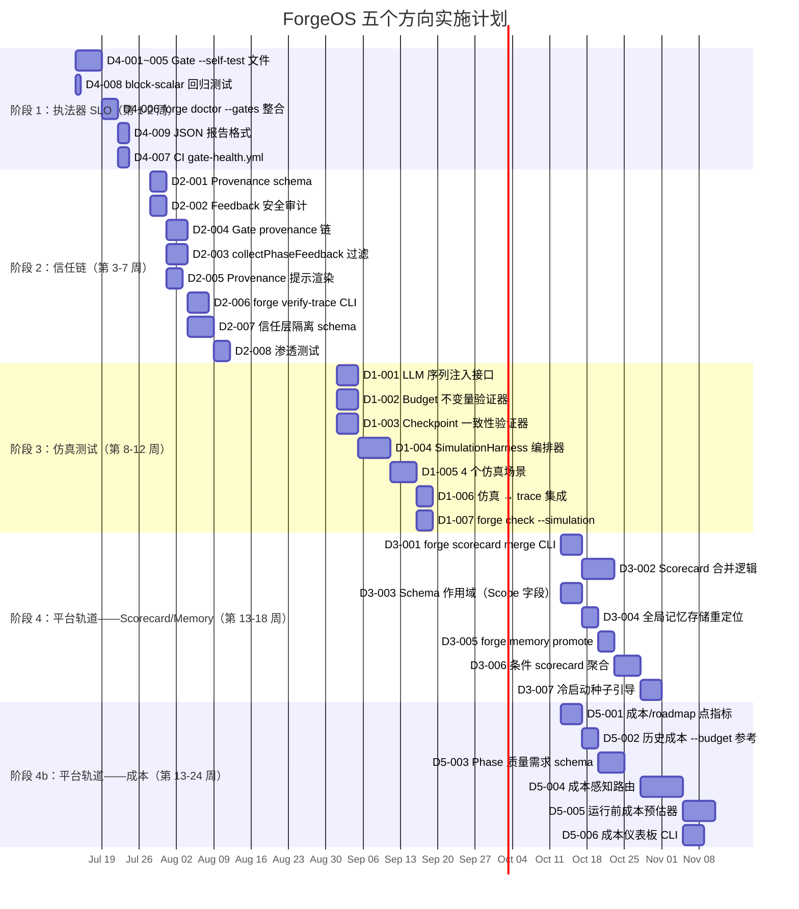

现在我掌握了这个代码库的架构格局。以下是完整的 Tech Lead 分析。

---

# Tech Lead 分析：五个方向路线图

## 0. 代码库现状（最新信息）

在分析这些任务之前，必须根据实际代码库进行校准：

| 维度 | 现状（截至 Sprint 26） |
|---|---|
| `forge-core` | 13 个纯 Go 包，**零外部依赖**，CLI 命令 13+ |
| Orchestrator | `LoopEngine` + `Engine.RunFrom`（串行）+ `RunParallel`（波次并发） |
| 记忆 | JSONL 存储，带 `Entry.Confidence`/`Source`/`Supersedes`，BM25-lite 检索 |
| Trace | JSONL 流，`cost_usd_micros` + `model` 属性 |
| Scorecard | 每个（模型，任务类型）对一行，`avg_cost_usd` / `p95_latency_ms` |
| Harness | 8 项架构检查，SCA，密钥扫描，`--self-test` 尚未实现 |
| CI/CD | 在 CLINE.md 中引用的 GitHub Actions 工作流程 |
| 安全 | `sanitizeAgentOutput` 存在，但 `collectPhaseFeedback` 作为注入向量 |
| 每次修改都需通过 | `node harness/acceptance.mjs`（8 项检查 + 测试） |

**每个方向的任务分解如下，按照审阅者建议的优先级执行：④ → ②（memory provenance）→ ①（裁剪版）→ ③ + ⑤（平台轨道）**

---

## 1. 任务分解

### 方向 ④ — 执法器 SLO 监控（立即执行：2-3 周）

| 任务 ID | 标题 | 文件 | 前置依赖 | 预估工时 | 验收标准 |
|---|---|---|---|---|---|
| D4-001 | `--self-test` flag 添加到 `gate.mjs` | `harness/gate.mjs` | 无 | 2h | 使用已知的违规样本文件调用 `node harness/gate.mjs --self-test`，文件超出大小时返回 EXIT 1；文件合规时返回 EXIT 0 |
| D4-002 | `--self-test` 添加到 `arch-check.mjs`，包含样本 | `harness/arch/arch-check.mjs`, `harness/arch/testdata/` | 无 | 3h | 创建 `arch-violation-sample/`，包含已知的层违规和循环依赖；自检报告 `ARCH_VIOLATION` |
| D4-003 | `--self-test` 添加到 `secret-scan.mjs`，包含样本 | `harness/secret-scan.mjs`, `harness/testdata/` | 无 | 2h | 包含内联密钥（`sk_live_...`）的样本文件；自检报告 `SECRET_FOUND` |
| D4-004 | `--self-test` 添加到 `check.py` | `harness/check.py`, `harness/testdata/` | 无 | 2h | 治理违规（悬挂引用）的样本文件；自检报告 FAIL |
| D4-005 | `--self-test` 添加到 `sca.mjs` | `harness/sca.mjs`, `harness/testdata/` | 无 | 2h | 含有已知漏洞依赖的样本 `go.mod`/`package.json`；自检报告找到漏洞 |
| D4-006 | 实现 `forge doctor --gates` | `forge-core/cmd/forge/doctor.go`, `forge-core/internal/doctor/doctor.go` | D4-001..D4-005 | 3h | `forge doctor --gates` 运行所有 5 项自检并汇总：每个 `PASS`/`FAIL`/`WARN（跳过）` |
| D4-007 | 为每个 gate 创建 CI 工作流 + 计划自检 | `.github/workflows/gate-health.yml` | D4-006 | 2h | 在 CI 中，每个 PR 前或定时运行 `forge doctor --gates`；gate 退化的报告会被捕捉 |
| D4-008 | Sprint 27的 `block-scalar` bug 作为测试用例 | `harness/arch/testdata/regression/block-scalar/` | D4-002 | 1h | 复现的损坏 YAML；`arch-check --self-test` 检测到损坏并报告 `ARCH_VIOLATION` 或解析错误 |
| D4-009 | `forge doctor --gates` 输出格式 + JSON 报告 | `forge-core/internal/doctor/doctor.go` | D4-006 | 2h | 人类可读表格 + `--json` 给 CI 消费；每个 gate 带有状态、持续时间和探测计数 |

**方向 ④ 总计：~17 小时（约 2.5 个工程师日，可并行化，同一周内完成）**

### 方向 ② — 跨 Agent 信任链（短期：4-8 周）

| 任务 ID | 标题 | 文件 | 前置依赖 | 预估工时 | 验收标准 |
|---|---|---|---|---|---|
| D2-001 | 在 memory schema 中添加 `Provenance` 结构体 | `forge-core/internal/memory/memory.go` | 无 | 3h | 新增 `Provenance` 结构体，包含 `SourceAgent`/`SourcePhase`/`IterationNum`/`HarnessGate` 字段；新的 `Entry.Provenance *Provenance` 字段；JSON 往返保证旧行解析不受影响（`omitempty`） |
| D2-002 | 安全审计 `collectPhaseFeedback` 路径 | `forge-core/cmd/forge/prompt_context.go` | 无 | 3h | 映射 feedback → memory 的完整路径；记录 `KindFeedback` 没有通过 `Confidence` 过滤；编写测试，用恶意负载注入来证明未经过滤的写入 |
| D2-003 | `collectPhaseFeedback` 的结构化过滤 | `forge-core/cmd/forge/prompt_context.go` | D2-002 | 4h | 新增 `sanitizeFeedback(feedback) FeedbackEntry`，剥离控制字符、截断长度、拒绝明显注入的模式；所有 `FeedbackEntry` 在写入 memory 前通过 `Confidence < 0.5` 过滤 |
| D2-004 | 在 gate 结果中添加 provenance 链 | `forge-core/internal/gate/gate.go`, `harness/gate.mjs` | D2-001 | 4h | `gate.Result` 新增 `ProvenanceSHA256 string` 字段；gate 标准输出在提交哈希和时间戳上写入 SHA-256；`forge verify-trace --hash` 可重现其验证 |
| D2-005 | memory 注入中的 provenance 展示 | `forge-core/cmd/forge/prompt_memory.go` | D2-001, D2-004 | 3h | `memoryContext` 在知识块中渲染 provenance 信息（来源、阶段、gate 验证）；代理可以判断「谁说的」 |
| D2-006 | gate 结果 SHA-256 的可重复验证 CLI | `forge-core/cmd/forge/verify.go` | D2-004 | 4h | `forge verify-trace --hash <hash> <trace.jsonl>` 重新计算门标准输出并匹配；退出代码反映匹配/不匹配；在 trace 中包含 commit hash + 时间戳 |
| D2-007 | Trust-tier schema：deny by default 的隔离安全层 | `forge-core/internal/memory/memory.go`, `forge-core/cmd/forge/prompt_memory.go` | D2-001, D2-003 | 5h | 架构层：`pipeline`（迭代间信任）vs `direct`（当前迭代）vs `external`（未验证的 LLM 输出）。`KindFeedback` 标记为 `external`。Agent prompt 模板根据层前缀区分。测试验证：外部层条目被注入但前缀为 `[unverified]` |
| D2-008 | 为 `sanitizeAgentOutput` 和 `sanitizeFeedback` 编写渗透测试 | `forge-core/cmd/forge/prompt_context_test.go` | D2-003, D2-007 | 3h | 注入测试：控制字符、假门标准输出、4 字节 UTF-8 截断、重排。证明无法注入虚假 `APPROVED` 信号 |

**方向 ② 总计：~29 小时（约 4 个工程师日）**

### 方向 ① — 仿真测试（中期：8-12 周，**裁剪版**）

| 任务 ID | 标题 | 文件 | 前置依赖 | 预估工时 | 验收标准 |
|---|---|---|---|---|---|
| D1-001 | LLM 序列注入接口：`PhaseResultScript` | `forge-core/internal/orchestrator/orchestrator.go` | 无 | 4h | 新增 `PhaseResultScript []PhaseResult`，可设定返回 `APPROVED`/`REQUEST_CHANGES`/`REJECTED`；脚本化 `AgentExecutor` 读取序列而非调用 LLM |
| D1-002 | Budget 不变量验证器 | `forge-core/internal/orchestrator/budget.go` 的 `VerifyInvariants` | D1-001 | 4h | 验证：`totalSpent <= MaxRetries × MaxAgentCalls × perCallBudget`；循环后调用；不变量违反时返回详细报告 |
| D1-003 | Checkpoint 崩溃一致性验证器 | `forge-core/internal/persist/` | D1-001 | 4h | 工作流：注入 checkpoint → 模拟崩溃 → 恢复 → 验证 `phaseIdx + spentMicros` 组合具有精确一次语义；幂等性证明 |
| D1-004 | 仿真编排器：`SimulationHarness` | `forge-core/internal/orchestrator/simulation.go`（新文件） | D1-001, D1-002, D1-003 | 6h | 编排 `PhaseResultScript` 驱动的运行；重放验证序列；报告通过/失败+不变量检查；支持多轮（LLM 返回的笛卡尔积） |
| D1-005 | 重点关注方向的仿真场景 | `forge-core/internal/orchestrator/simulation_test.go` | D1-004 | 5h | 场景 1：第 N 次 `REQUEST_CHANGES`，然后是 `APPROVED`；场景 2：`REJECTED` → 停止 → 恢复 → 不同的序列；场景 3：budget 精确耗尽 → 验证精确的边界行为；场景 4：loop-back + budget 组合 |
| D1-006 | 仿真 → trace 集成 | `forge-core/internal/trace/trace.go` 新增 `SimEvent` 类型 | D1-004 | 3h | 仿真运行将其序列+不变量结果写入 trace JSONL，因此 scorecard 不污染；`_format: "forgeos.simulation.v1"` |
| D1-007 | 将仿真集成到 `forge check` / `forge doctor` | `forge-core/cmd/forge/doctor.go` | D1-005 | 3h | `forge check --simulation` 运行预定义的场景；`forge doctor --simulation` 对所有 orchestrator 不变量进行完整性检查；失败时退出 1 |

**方向 ① 总计：~29 小时（约 4 个工程师日）**

### 方向 ③ — Workspace 级学习（长期：12-24 周，**方向②的依赖**）

| 任务 ID | 标题 | 文件 | 前置依赖 | 预估工时 | 验收标准 |
|---|---|---|---|---|---|
| D3-001 | `forge scorecard merge` CLI 命令 | `forge-core/cmd/forge/scorecard_merge.go` | D2-001（信任层） | 4h | `forge scorecard merge --from <project> --to <project> --task-type-filter <type>` 将 A 的 scorecard 行复制到 B，合并 `avg_cost_usd` 的统计汇总 |
| D3-002 | Scorecard 合并逻辑与 `--task-type-filter` | `forge-core/internal/attribution/merge.go` | D3-001 | 6h | 仅当 task_type 匹配时才合并；加权平均（`(n1*avg1 + n2*avg2)/(n1+n2)`）；preserve `samples: min+max`；在合并上方写注释「从 <source> 播种于 <timestamp>」 |
| D3-003 | 跨项目记忆的 Schema 区分 | `forge-core/internal/memory/memory.go` | D2-001（Provenance 结构体） | 4h | 新增 `Entry.Scope string`（`"project"`/`"global"`/`"task_type:go"`）；`Append` 验证范围；`Load` 支持 `WithScope(s)` 过滤；`memoryContext` 读取 `Scope` 并据此划分 |
| D3-004 | 全局 vs 项目记忆的存储重定位 | `forge-core/cmd/forge/prompt_memory.go` 新增 `GlobalMemoryPath` | D3-003 | 3h | 如果存在，`memoryContext` 读取 `~/.forge/memory.jsonl`（全局）；如果在项目目录找到，则读取 `project_memory.jsonl`（项目）；合并两个源，按 scope 过滤；冷启动无错误 |
| D3-005 | `forge memory promote` 命令 | `forge-core/cmd/forge/memory_promote.go` | D3-003, D3-004 | 3h | `forge memory promote --id <topic> --scope global` 将条目从项目移到全局记忆，更新其范围以进行重写；不可逆的操作（需要 `--confirm`） |
| D3-006 | 任务类型分层的 scorecard 聚合 | `forge-core/internal/attribution/merge.go` 扩展 | D3-002, D1-005（scorecard 数据） | 5h | 新增 `ConditionalAggregator`，按（模型，任务类型，语言）分组；输出：`avg_cost_usd` 的中位数/第 90 百分位数；用于「对于 Go 单元测试，Sonnet 比 Haiku 便宜 40%」这种声明 |
| D3-007 | 冷启动种子引导工作流 | `forge-core/cmd/forge/scorecard_seed.go` | D3-006 | 4h | `forge scorecard seed --from-project <path> --task-type <type>` 将另一个项目的记忆示例注入为冷启动 `KindLesson` 条目；添加 `[seeded from <project>]` 注释 |

**方向 ③ 总计：~29 小时（约 4 个工程师日——但需要方向②作为前提）**

### 方向 ⑤ — 成本优化引擎（长期：12-24 周，**与方向③绑定**）

| 任务 ID | 标题 | 文件 | 前置依赖 | 预估工时 | 验收标准 |
|---|---|---|---|---|---|
| D5-001 | Converge 报告中的成本/roadmap 点指标 | `forge-core/cmd/forge/converge.go` | 无 | 4h | 在收敛报告中新增 `cost_per_roadmap_point`：`total_cost_usd / roadmap_completion`；如果 completion=0 则为 `inf`；如果成本为 0 则为 `0` |
| D5-002 | `forge run --budget` 的历史成本参考 | `forge-core/cmd/forge/run_budget.go` 扩展 | D5-001 | 3h | `--budget` 帮助文本包含「上一次类似 build: $1.42（3 phases, 5 iterations）」；通过匹配 task_type + 模型从 scorecard 中读取 |
| D5-003 | Phase 级质量需求声明 | `.agent/workflows/*.yml` schema | D3-003（task type scope） | 5h | build.yml schema 新增 `quality_tier: {critical, standard, optional}` per phase；planner = critical，gate = critical，reviewer = standard，implementer = optional |
| D5-004 | 基于质量需求的成本感知路由 | `forge-core/internal/routing/routing.go` | D5-003, D3-006（条件聚合） | 8h | 对于 `quality: critical` 阶段：仅选择 `quality_score >= 0.8` 的模型；对于 `quality: optional`：选择 `avg_cost_usd` 最低的模型；截止值从 scorecard 统计中学习 |
| D5-005 | 运行前成本预估器 | `forge-core/cmd/forge/preflight_cost.go` | D5-004, D3-001（合并） | 6h | 预估：`estimated_cost = sum_over_phases(count_of_agent_phases × model_tier_cost_per_call × typical_retries)`；显示：`Estimated: $2.10 - $3.80` 范围；在 `forge run` 确认提示中包含 |
| D5-006 | 成本帕累托仪表板 CLI 视图 | `forge-core/cmd/forge/cost_dashboard.go` | D5-004 | 4h | `forge cost dashboard` 显示：按项目列出的各模型月成本、各阶段成本明细、「如果你用 Sonnet 替换 Opus 用于 review 能节省 X」的建议 |

**方向 ⑤ 总计：~30 小时（约 4 个工程师日——与方向③绑定）**

---

## 2. 执行顺序

```mermaid
graph TD
    %% 阶段 1：基础设施（第 1-2 周）
    subgraph Phase1_["阶段 1：执法器 SLO（第 1-2 周）"]
        D4_001["D4-001 gate.mjs --self-test"]
        D4_002["D4-002 arch-check.mjs --self-test"]
        D4_003["D4-003 secret-scan.mjs --self-test"]
        D4_004["D4-004 check.py --self-test"]
        D4_005["D4-005 sca.mjs --self-test"]
        D4_006["D4-006 forge doctor --gates"]
        D4_007["D4-007 CI gate-health.yml"]
        D4_008["D4-008 block-scalar regression test"]
        D4_009["D4-009 JSON report format"]
    end

    %% 阶段 2：信任（第 3-7 周）
    subgraph Phase2_["阶段 2：信任链（第 3-7 周）"]
        D2_001["D2-001 Provenance schema"]
        D2_002["D2-002 Feedback audit"]
        D2_003["D2-003 Structured filtering"]
        D2_004["D2-004 Gate provenance chain"]
        D2_005["D2-005 Provenance in prompts"]
        D2_006["D2-006 forge verify-trace"]
        D2_007["D2-007 Trust-tier isolation"]
        D2_008["D2-008 Penetration tests"]
    end

    %% 阶段 3：仿真（第 8-12 周）
    subgraph Phase3_["阶段 3：仿真测试（第 8-12 周）"]
        D1_001["D1-001 LLM sequence injection"]
        D1_002["D1-002 Budget invariant verifier"]
        D1_003["D1-003 Checkpoint consistency"]
        D1_004["D1-004 SimulationHarness"]
        D1_005["D1-005 Simulation scenarios"]
        D1_006["D1-006 Sim → trace integration"]
        D1_007["D1-007 forge check --simulation"]
    end

    %% 阶段 4：平台轨道（第 13-24 周）
    subgraph Phase4_["阶段 4：平台轨道（第 13-24 周）"]
        D3_001["D3-001 forge scorecard merge"]
        D3_002["D3-002 Scorecard merge logic"]
        D3_003["D3-003 Schema scoping"]
        D3_004["D3-004 Global memory store"]
        D3_005["D3-005 forge memory promote"]
        D3_006["D3-006 Conditional aggregation"]
        D3_007["D3-007 Cold-start seeding"]
        D5_001["D5-001 Cost/roadmap-point metric"]
        D5_002["D5-002 Historical cost reference"]
        D5_003["D5-003 Phase quality tiers"]
        D5_004["D5-004 Cost-aware routing"]
        D5_005["D5-005 Preflight cost estimator"]
        D5_006["D5-006 Cost dashboard"]
    end

    %% 阶段 1 依赖（全部可并行）
    D4_001 --> D4_006
    D4_002 --> D4_006
    D4_003 --> D4_006
    D4_004 --> D4_006
    D4_005 --> D4_006
    D4_006 --> D4_007
    D4_008 --> D4_002
    D4_006 --> D4_009

    %% 阶段 2 依赖
    D2_001 --> D2_005
    D2_001 --> D2_007
    D2_002 --> D2_003
    D2_003 --> D2_007
    D2_003 --> D2_008
    D2_004 --> D2_005
    D2_004 --> D2_006

    %% 阶段 3 依赖（阶段 1 和 2 提供安全网）
    D1_001 --> D1_004
    D1_002 --> D1_004
    D1_003 --> D1_004
    D1_004 --> D1_005
    D1_005 --> D1_006
    D1_006 --> D1_007

    %% 阶段 4 依赖（在阶段 2 和 3 之上）
    D2_001 -.-> D3_003
    D3_001 --> D3_002
    D3_002 --> D3_006
    D3_003 --> D3_004
    D3_003 --> D3_005
    D3_004 --> D3_007
    D3_006 --> D5_004
    D5_001 --> D5_002
    D5_003 --> D5_004
    D5_004 --> D5_005
    D5_004 --> D5_006

    %% 关键路径突出显示
    style D4_006 stroke:#00f,stroke-width:3px
    style D2_001 stroke:#0a0,stroke-width:3px
    style D2_003 stroke:#0a0,stroke-width:3px
    style D1_004 stroke:#f80,stroke-width:3px
    style D3_006 stroke:#a0f,stroke-width:3px
    style D5_004 stroke:#a0f,stroke-width:3px
```

**并行批次：**

| 批次 | 任务 | 工程师需求 |
|---|---|---|
| **批次 1**（第 1 周） | D4-001, D4-002, D4-003, D4-004, D4-005, D4-008 | 2 名工程师（每个测试/样本文件 1 人，样本文件 1 人） |
| **批次 2**（第 2 周） | D4-006, D4-009, D4-007 | 1 名工程师（整合）+ 1 名 DevOps（CI） |
| **批次 3**（第 3-4 周） | D2-001, D2-002, D2-004 | 2 名工程师（schema + 审计，gate 链） |
| **批次 4**（第 5-7 周） | D2-003, D2-005, D2-006, D2-007, D2-008 | 2 名工程师（过滤 + 提示层，验证 CLI） |
| **批次 5**（第 8-10 周） | D1-001, D1-002, D1-003 | 2 名工程师（脚本接口，不变量，持久化） |
| **批次 6**（第 11-12 周） | D1-004, D1-005, D1-006, D1-007 | 2 名工程师（编排器，场景，集成） |
| **批次 7**（第 13-17 周） | D3-001, D3-002, D3-003, D3-004 | 2 名工程师（合并，作用域，存储重定位） |
| **批次 8**（第 18-24 周） | D3-005, D3-006, D3-007, D5-001..D5-006 | 3 名工程师（平台轨道并行） |

---

## 3. 技术风险

### 高风险

| 风险 | 方向 | 可能性 | 影响 | 缓解策略 |
|---|---|---|---|---|
| **Provenance 数据增加导致上下文膨胀** | ② | 中 | 高 | Provenance 结构体应作为字段附加，而不是扩展示例文本；`memoryCap` 已经限制条目数。如果每个条目的 provenance 增加 > 50 字节，请考虑对审计执行 `forge verify` 的单独压缩 `provenance.jsonl` |
| **仿真与 orchestrator 代码库并行演化** | ① | 高 | 中 | `SimulationHarness` 必须通过接口（`AgentExecutor` + `RunGate`）与 orchestrator 交互，而不是使用内部 API。添加 `SimulationHarness.WorkflowFrozen` 测试，如果 orchestrator 类型签名发生更改而无对应更新，则会失败。 |
| **Scorecard 合并：统计意义** | ③/⑤ | 高 | 高 | 对于少于 10 个样本的项目，永远不要信任 `avg_cost_usd`。在合并后的 scorecard 中公开 `value_warning` 字段：`"samples: 3 — high variance"`。在成本 UI 中以灰色显示。在 `--task-type-filter` 精确匹配时强制要求 |
| **全局记忆的数据冲突** | ③ | 中 | 高 | 必须*在*跨项目共享之前实施信任层（D2-007）。项目 A 的 `KindLesson` 对于项目 B 来说可能是毒药。从 `--task-type-filter` `merge` 开始，D2-007 中的信任层将其限制在仅已验证的通道中 |
| **多 lock Heisenbugs（并行模式）** | ① | 低 | 高 | 锁顺序合约文档详尽无遗（parallel.go 中的 8 级）。仿真测试可以验证 `-race` 下的合约。添加静态分析：`go vet` 自定义检查器，验证互斥锁获取顺序 |

### 中等风险

| 风险 | 方向 | 可能性 | 影响 | 缓解策略 |
|---|---|---|---|---|
| **provenance 的密钥管理** | ② | 高 | 低 | `forge verify-trace --hash` 不需要密钥；它重新计算 SHA-256。审阅者指出方向②更安全的 gate 结果的「不可否认性」版本将需要 KMS。对此进行了明确标记：v1 = 可重现哈希，v2 = KMS 签名 |
| **仿真覆盖的虚假信心（假阴性）** | ① | 中 | 中 | 注入 LLM 序列有 `$num_states^{num_phases}$` 组合——无法穷举。通过随机走查进行有针对性的场景（Scenario 1-4）+ 边界值覆盖。永远不要声称「经过形式验证」 |
| **`check.py` 自检：Python 解析可变性** | ④ | 低 | 低 | Python YAML 加载器可能会悄悄接受 bad input。自检写入已知的违规 YAML 并解析它；如果 check.py 无声地接受它，则自检失败 |
| **forge doctor 的 JSON 输出在 CI 中永远不会被消费** | ④ | 中 | 低 | 从 D4-009 的 `--json` 输出开始。不要在 gate-health.yml 中添加复杂的 jq。一个简单的 `if: ${{ steps.doctor.outputs.status == 'FAIL' }}` 就足够了 |

### 低风险 / 可承受

| 风险 | 方向 | 缓解 |
|---|---|---|
| `sanitizeAgentOutput` 正则表达式 DoS | ② | 使用基于符文迭代的简单字符类（每符文 O(1)），而不是正则表达式。已经审查过的代码就是这样做 |
| `forge scorecard merge` 破坏源数据 | ③ | 合并是*只读*源：`scorecard merge` 从项目 A 读取，计算统计信息，写入项目 B。项目 A 永远不会被修改。默认启用 `--dry-run` |
| 成本帕累托建议给未寻求它的用户 | ⑤ | `forge cost dashboard` 是一个显式查询，而不是 CI 块。不会自动重写 `--model` |
| 恢复后仿真「挂起」 | ① | `SimulationHarness` 在每次相位转换时都有一个死锁检测器：如果第 n 步后模拟相位未完成，则记录超时并失败 |

---

## 4. 资源评估

### 团队组成

| 角色 | 数量 | 参与阶段 | 技能要求 |
|---|---|---|---|
| **高级 Go 开发者**（编排器内部知识） | 2 | 所有阶段（必要） | Go 并发，通道，接口设计；需要知晓 `orchestrator/parallel.go` 的锁顺序合约 |
| **Node.js 开发者**（Harness 专业知识） | 1 | 阶段 1(D4)，阶段 3(D1) | `arch-check.mjs` 的 AST 解析，了解 8 项检查如何交互 |
| **安全工程师** | 1 | 阶段 2(D2) | LLM 提示注入，provenance schema，哈希链 |
| **DevOps 工程师** | 0.5 | 阶段 1(D4-007)，阶段 4(D5) | GitHub Actions 工作流，CI 集成 |
| **产品 / 工程经理** | 0.5 | 持续 | 协调审阅者提出的优先级调整，GTM 集成 |

**团队规模**：3-5 个全职工程师 + 1 个兼职 DevOps = 约 4 个 FTE

### 里程碑

| 里程碑 | 时间 | 交付物 | 退出标准 |
|---|---|---|---|
| **M0：基础就绪** | 第 1 周结束 | 5 个 gate 全部通过自检；`forge doctor --gates` 报告健康/损坏状态 | 在 CI 中，一个故意破坏的 gate（例如 `sed -i 's/block/warn/' gate.mjs`）在 PR 检查中被标记 |
| **M1：信任层** | 第 7 周结束 | `Provenance` 写入所有 trace+memory 条目；`collectPhaseFeedback` 已硬化；`forge verify-trace` 可重现 gate 结果 | 渗透测试通过：无法通过 agent 输出注入注入虚假 `APPROVED` 信号 |
| **M2：仿真就绪** | 第 12 周结束 | `forge check --simulation` 在 CI 中运行 4 个场景；在 orchestor 发生更改时捕获不变量回归 | 故意向 `budget.go` 引入 bug → `forge check --simulation` 在 1 分钟内因不变量违反而失败 |
| **M3：平台轨道** | 第 24 周结束 | `forge scorecard merge --task-type-filter` 可行；`forge cost dashboard` 显示质量调整后的成本；全局记忆以信任层保护 | 用一个已建立的 Python 项目作为种子引导一个冷 Go 项目 → scorecard 在 5 次运行内显示出改进的路由决策 |

### 阻塞点

| 阻塞点 | 影响 | 解决策略 |
|---|---|---|
| **方向② → 方向③ 的依赖** | 在没有信任层的情况下跨项目共享的记忆可能是毒药 | 严格执行：方向③ 的任务 D3-003 要求 D2-001（Provenance schema）。`global` 范围的 `Append` 在没有 `Provenance.SourceAgent` 的情况下被拒绝 |
| **方向③ → 方向⑤ 的 scorecard 数据稀疏性** | 只有 3-5 个 scorecard 样本的冷项目会产生无用成本预估 | D3-007（冷启动种子）*在* D5-004（成本感知路由）之前交付。如果没有其他项目的种子数据，永远不要触发成本路由 |
| **`forge check --simulation` 在 CI 中的执行时间** | 全组合仿真可能需要数小时 | 4 个重点场景（D1-005）+ 随机采样。CI 中的 `forge check --simulation --quick`（< 30 秒）。长期运行保留给 `forge doctor --full-simulation` |

---

## 5. 质量保证

### 单元测试覆盖

| 模块 | 所需覆盖 | 关键测试用例 |
|---|---|---|
| **Gate 自检（D4-001 至 D4-005）** | > 90% 的新代码 | 每个 gate 类型：存在的样本 → 正确退出代码；缺失的样本 → WARN；损坏的样本 → 报告损坏 |
| **Provenance schema（D2-001）** | > 95% | JSON 往返；向后兼容（旧条目无 provenance）；`ProvenanceSHA256` 接受/拒绝 |
| **`sanitizeFeedback`（D2-003）** | > 95% | 控制字符剔除；截断边界；Unicode 代理对安全性；提示注入模式（`</s>`、`[INST]`、`ignore previous instructions`） |
| **Budget 不变量（D1-002）** | > 95% | 精确耗尽边界；超出边界；loop-back 计数恢复；多轮叠加 |
| **Scorecard 合并（D3-002）** | > 90% | 加权平均数学；零样本保护（除以零）；task_type 过滤器精确匹配；统计警告阈值 |

### 集成测试策略

| Scope | 方法 | 工具 |
|---|---|---|
| **Gate 健康** | 破坏每个 gate 并运行 `forge doctor --gates` | Bash 脚本 + `assert.sh` |
| **信任链** | 用已知恶意的 agent 输出运行 `forge run --dry-run`；验证 `memory.jsonl` 没有恶意条目 | 带有模拟 `AgentExecutor` 的 Go 测试 |
| **仿真** | 将 orchestrator 与已知错误的 LLM 序列配对；验证它是否被 detect | Go 测试 + `SimulationHarness` |
| **跨项目 scorecard** | 用有限的 scorecard 播种项目 A；运行 `scorecard merge`；验证项目 B 的路由发生了更改 | 带有临时目录的 Go 测试 |
| **完整管道** | 在 CI 中：创建一个新项目 → `forge scorecard seed` → `forge run --dry-run` → 验证 trace + memory 写入 | `node harness/test_acceptance.mjs` 扩展 |

### 代码审查要点

| 关注领域 | Reviewer 检查内容 |
|---|---|
| **Provenance schema 扩展** | 新字段在 `memory.Entry` 上是否为 `omitempty`？旧行是否无需更改即可解析？ |
| **`collectPhaseFeedback` 过滤** | 是否所有 feedback→memory 路径都经过 `sanitizeFeedback`？是否存在转发 `sanitizeAgentOutput` 但绕过过滤的循环路径？ |
| **仿真不变量** | 不变量检查器公开了简单的不变量，还是嵌入了复杂的逻辑？它是否读起来像一个可测试的数学命题？ |
| **Scorecard 合并** | 统计数据合并是否保存样本计数？加权平均计算是否正确？（审阅者指出这是一个常见的错误来源。） |
| **全局记忆作用域** | 在没有 `Scope` 的情况下，`Append` 是否失败？作用域为 `"global"` 的条目是否检查 `Provenance.SourceAgent != ""`？ |
| **成本帕累托路由** | 下限合约：`quality: critical` 阶段是否曾选择比 Opus 更便宜的模型？「只升不降」的不变量是否成立？ |

### 性能测试需求

| 测试 | 何时 | 指标 | 通过标准 |
|---|---|---|---|
| **Gate 自检延迟** | D4-006 合并后 | 5 个 gate 的冷热 `forge doctor --gates` 时间 | 热 < 500ms，冷 < 2s |
| **Provenance JSON 序列化** | D2-001 合并后 | 1000 个条目的 `memory.Append` + `Load` 往返 | < 50ms |
| **SimulationHarness 场景** | D1-005 合并后 | 4 个场景 x 50 轮 | < 30s |
| **Scorecard 合并** | D3-002 合并后 | 合并 2 个包含 100 行的文件 | < 100ms |
| **成本感知路由** | D5-004 合并后 | 带有 50 个模型的 scorecard 的 `forge route` | < 200ms |

---

## 6. 实施计划

### 甘特图

### 按阶段划分的详细时间表

#### 阶段 1：执法器 SLO（第 1-2 周：2026-07-14 至 2026-07-25）

| 天 | 活动 | 负责人 |
|---|---|---|
| 第 1-2 天 | 同时编写 5 个 gate 的 `--self-test` 实现：`gate.mjs`、`arch-check.mjs`、`secret-scan.mjs`、`check.py`、`sca.mjs` | 2 Go/Node 工程师各编写 2-3 个 gate |
| 第 2 天 | 为每个 gate 创建 testdata/ 样本文件（违规+清洁基线） | 工程师 A |
| 第 3-4 天 | 将 `--self-test` 逻辑集成到 `forge doctor`（D4-006）中 | 工程师 B |
| 第 4 天 | 添加 `block-scalar` 回归样本（D4-008） | 工程师 A |
| 第 5 天 | `--json` 报告格式（D4-009） | 工程师 B |
| 第 5-6 天 | CI 工作流（D4-007）；代码审查 | DevOps + 2 工程师 |
| 第 7 天 | 修补：Sprint 30 bug 修复缓冲区；forge accept 全绿 | 全部 |

**交付**：CI 中的 `forge doctor --gates` 与 5 个自检 + block-scalar 回归保护

#### 阶段 2：信任链（第 3-7 周：2026-07-28 至 2026-08-29）

| 周 | 主题 | 关键产出 | 风险 |
|---|---|---|---|
| 第 3 周 | Schema + 审计 | `Provenance` 结构体（D2-001）+ `collectPhaseFeedback` 审计（D2-002）+ gate SHA-256 写入（D2-004） | 确保 SHA-256 在 gate 标准输出中只读取已审核的流；并非所有 gate 都写入标准输出 |
| 第 4 周 | 过滤 + 提示 | `sanitizeFeedback` 实现（D2-003）+ 提示的 provenance 渲染（D2-005）+ `forge verify-trace`（D2-006） | 提示的 provenance 渲染不应增加 LLM 上下文，成本不应超过 100 个token/条目 |
| 第 5 周 | 信任层隔离 | D2-007 架构：将记忆分为 `pipeline`/`direct`/`external` 层；更新 `boundMemory` 以过滤层 | 重构 `boundMemory` 的复杂性；当前的提示构建器不关心层 |
| 第 6-7 周 | 硬化 + 测试 | D2-008 渗透测试：注入 false `APPROVED`、false gate 输出、Unicode 攻击 | 与信任层 schema 的交互；如果层发生变化，测试必须更新 |
| 第 7 周 | 审查 + 修复 | Fresh-context reviewer 检查每个任务；forge accept 全绿 | — |

**交付**：信任层穿越 memory → prompt → gate 的全栈 trace

#### 阶段 3：仿真（第 8-12 周：2026-09-01 至 2026-10-10）

| 周 | 主题 | 关键产出 | 风险 |
|---|---|---|---|
| 第 8 周 | 基础 | D1-001 LLM 序列注入接口 + D1-002 Budget 不变量 + D1-003 检查点一致性验证器 | 3 个任务可并行化；任何影响 `Engine` 类型签名变化都会破坏所有依赖 |
| 第 9-10 周 | 编排器 | D1-004 `SimulationHarness`：序列驱动运行、不变量检查、重放验证 | `SimulationHarness` 必须与现有的 `LoopEngine` + `RunFrom` 保持解耦 |
| 第 10-11 周 | 场景 | D1-005：4 个场景被实现并记录。为每个场景编写属性测试（随机化 LLM 序列） | 组合爆炸：使用随机游走而不是笛卡尔积。每个场景的目标是 50 次随机行走 |
| 第 11-12 周 | 集成 | D1-006 仿真 → trace 集成 + D1-007 `forge check --simulation` | Trace 格式分叉：仿真事件得到自己的 `_format: "forgeos.simulation.v1"` |

**交付**：`forge check --simulation` 在 CI 中运行，捕获 orchestrator 修改后的回归

#### 阶段 4：平台轨道（第 13-24 周：2026-10-13 至 2026-12-27）

**得分卡 + 记忆（第 13-18 周）：**

| 周 | 主题 | 关键产出 | 风险 |
|---|---|---|---|
| 第 13 周 | 合并 | D3-001 + D3-002：`forge scorecard merge` CLI + 合并逻辑 | 与 `scorecard-update.mjs` shell-out 架构的交互；确保合并后的文件仍可被下游消费 |
| 第 13-14 周 | 作用域 | D3-003 Schema 作用域：所有新 memory `Append` 都需要 Scope | 旧代码路径无 Scope 调用 Append → 编译失败。添加临时 `Scope: "project"` 默认值 |
| 第 14-15 周 | 全局存储 | D3-004 + D3-005：全局 `~/.forge/memory.jsonl` + `forge memory promote` | 竞争条件：如果两个项目同时写入全局内存，O_APPEND 是安全的，但 `Load → Edit → rewrite` 不是。使用单独的仅追加追加日志 |
| 第 16-18 周 | 聚合 | D3-006 条件聚合 + D3-007 冷启动种子 | 与 memory 的交互：种子数据写入 `KindLesson`，但必须包含 provenance |

**成本引擎（第 13-24 周）：**

| 周 | 主题 | 关键产出 | 风险 |
|---|---|---|---|
| 第 13 周 | 指标 | D5-001 + D5-002：成本/roadmap 点 + `--budget` 历史 | 该指标在 `converge.go` 中很简单；历史查询需要 scorecard 来实现 |
| 第 14-15 周 | 质量 | D5-003 Phase 质量 tier schema | 分析文档指出「需要用户声明」——添加默认值：planner=critical, implementer=optional, gate=critical, reviewer=standard |
| 第 16-20 周 | 路由 | D5-004 成本感知路由 + D5-005 运行前成本预估 + D5-006 仪表板 | 核心风险直到现在就暴露了。路由更改影响所有下游 `forge run` |

---

## 总结：对审阅者优先级调整的关键见解

审阅者推荐的顺序 **④ → ②(memory provenance) → ①(cropped) → ③+⑤(platform track)** 在以下情况下是正确的：

1. **方向④的优势在于零依赖**——它不需要信任层、仿真或跨项目数据。它可以（也应该）*本周*开始
2. **方向②的 memory provenance 是方向③的前提**——当没有 `Provenance` 结构体时共享全局记忆是加载恶意 payload。分析文档正确指出了这种依赖关系
3. **方向①裁剪为 LLM 序列注入（不是调度交错）**，使 8-12 周的计划变得切实可行，并且避免构建通用仿真引擎的陷阱。**分析文档的最大贡献**：「真正值得仿真的是「LLM 返回值序列 × budget 计数器交互」的组合爆炸，而不是调度交错」
4. **方向③和⑤在统计显著的数据点内耦合**——没有跨项目 scorecard 合并，方向⑤成本预测对于冷项目来说将具有很大方差以至于毫无用处。它们应该在 6-8 周内交付，否则方向⑤可能会在方向③之前发货，导致成本预估无法使用
