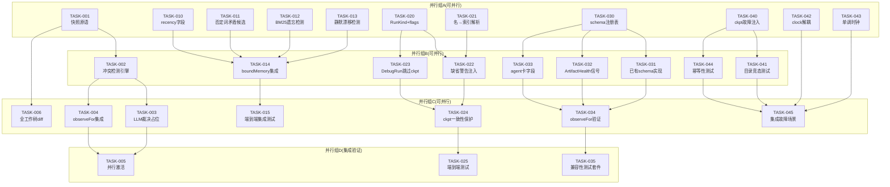
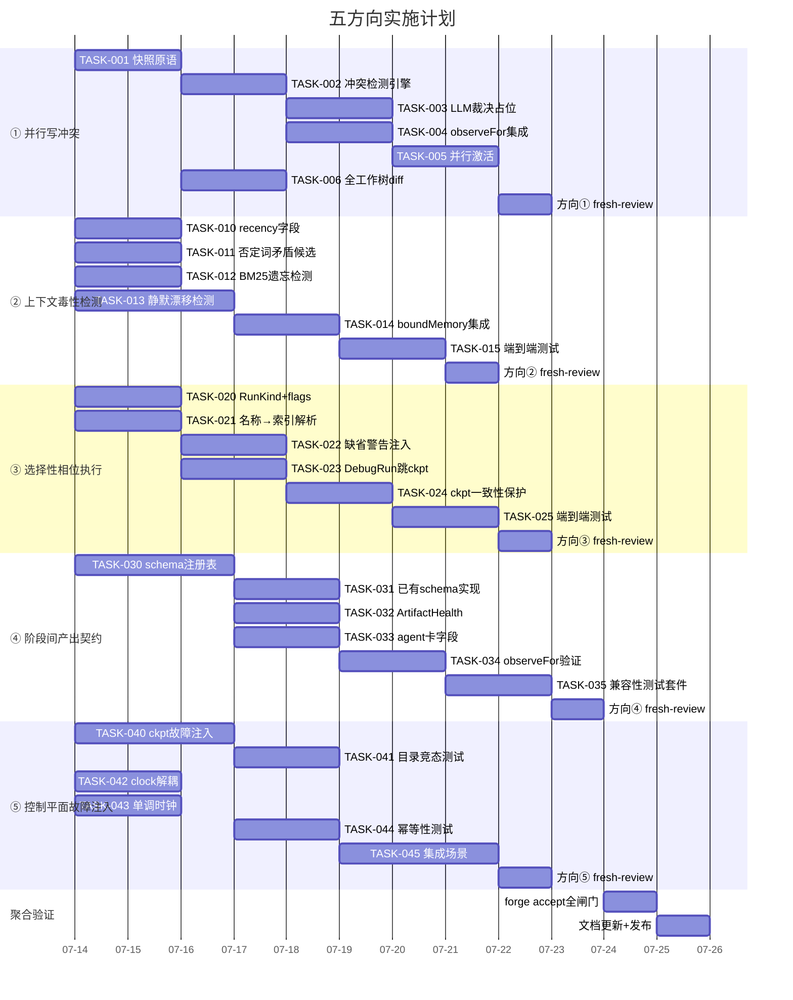

现在我已充分掌握了项目代码依据，以下是完整的 Tech Lead 分析报告。

---

# Tech Lead 架构审阅分析报告

> **基于**:架构审阅反馈文档(5 方向) + 实际代码验证(`forge-core` 13 Go 包,纯 stdlib 零依赖)
> **项目状态**:Sprint 1-31 已完成,`forge accept: ACCEPTED`,真点火已验证

---

## 1. 任务分解

### 方向一:并行写冲突检测

| 任务ID | 标题 | 涉及文件 | 前置依赖 | 工时(h) | 验收标准 |
|---|---|---|---|---|---|
| TASK-001 | wave 开始/结束快照原语(PreSnapshot/PostDiff) | `internal/snapshot/snapshot.go`(新包) | 无 | 3 | `git stash create` + `git diff --name-only` 封装,单测覆盖空树/未跟踪/删除三种场景 |
| TASK-002 | 多 phase 写冲突检测引擎 | `internal/snapshot/conflict.go`(新文件) | TASK-001 | 3 | 对两个 phase 的输出做 git diff 合并分析,正确识别同文件修改/添加/删除三种冲突;含删+改边角情况 |
| TASK-003 | LLM 裁决 phase 占位 | `internal/snapshot/adjudicate.go`(新文件) | TASK-002 | 2 | 冲突时注入裁决 prompt,结构化为 PhaseOutput + ConflictSet;裁决结果回写 ledger |
| TASK-004 | `observeFor` 集成 pre/post 快照 | `cmd/forge/prompt_context.go` | TASK-002 | 3 | `observeFor` 在 phaserun 前后自动调 PreSnapshot/PostDiff,冲突时注入第三 lane |
| TASK-005 | `--parallel` 下冲突检测激活 + 测试 | `internal/orchestrator/parallel.go` + `cmd/forge/main.go` | TASK-003, TASK-004 | 3 | `--parallel` 时自动启用冲突检测;串行路径跳过以保零回归 |
| TASK-006 | 全工作树 diff (非仅 emits 目录)实现 | 接 TASK-001 快照范围扩到全 `root` | TASK-001 | 2 | 验证 wave 前写临时文件在 wave 后被检出,不依赖 `emits:` 声明 |

### 方向二:上下文毒性检测

| 任务ID | 标题 | 涉及文件 | 前置依赖 | 工时(h) | 验收标准 |
|---|---|---|---|---|---|
| TASK-010 | `recency_half_life_days` 新 policy 字段 | `.agent/routing/policy.yml` + `internal/routing/scorecard.go` | 无 | 2 | `policy.yml` 新增 `memory.recency_half_life_days: 30`;`boundMemory` 可读配置而非硬编码 |
| TASK-011 | 否定词密度 + 对比连词矛盾候选检测 | `internal/memory/contradiction.go`(新文件) | 无 | 3 | 对同 Kind+Topic 的 entry pair,计算 NegationScore > 0.5 标记矛盾候选;纯 Go 可测 |
| TASK-012 | BM25 检索式遗忘/覆盖检测 | `internal/memory/retro.go`(新文件) | 无 | 2 | 用 `prompt.Retrieve` 比对新旧 entry:高相似度 + 新 entry 无引用旧迭代号 → 标记为"可能遗忘" |
| TASK-013 | `delta_monitor` 静默漂移检测 | `internal/memory/delta.go`(新文件) | 无 | 4 | 同一 Kind+Topic 下,关键数值/决策单向突变 → 打漂移标;支持数值提取(正则)与决策句法 |
| TASK-014 | boundMemory 集成矛盾/漂移标 | `cmd/forge/prompt_memory.go` | TASK-011, TASK-012, TASK-013 | 2 | memoryContext 在注入的 entry 旁标注 `[⚠ contradiction]`/`[⚠ silent drift]` |
| TASK-015 | 毒性上下文端到端集成测试 | `cmd/forge/prompt_memory_test.go` | TASK-014 | 2 | 构建含矛盾 entry 的 memory.jsonl,跑 forge run 验证注入的 context lane 含警告 |

### 方向三:选择性相位执行

| 任务ID | 标题 | 涉及文件 | 前置依赖 | 工时(h) | 验收标准 |
|---|---|---|---|---|---|
| TASK-020 | `RunKind` 类型 + `--debug`/`--flight-recorder` flag | `internal/orchestrator/engine.go` + `cmd/forge/main.go` | 无 | 3 | `RunKind NormalRun/DebugRun/FlightRecorder`,CLI flag 解析,engine 存储 |
| TASK-021 | 相位名称 → 索引解析(含重名校验) | `internal/asset/resolve.go`(新文件) | 无 | 2 | `--from phase-name` 解析为 index;重名时报错;`--from 3` 数字索引保持 |
| TASK-022 | `RunFrom` 跳过相位注入缺省警告 | `internal/orchestrator/orchestrator.go` | TASK-020, TASK-021 | 3 | 跳过的 phase 如声明 `feeds_forward:true` 则注入 `[缺省:phase X 被跳过,其产出不可用]` |
| TASK-023 | DebugRun 模式跳过 checkpoint 写入 | `internal/persist/checkpoint.go` + `cmd/forge/checkpoint_hook.go` | TASK-020 | 2 | `DebugRun` 时 `Save` 无操作;`FlightRecorder` 写入标记 `was_partial:true` |
| TASK-024 | 阶段范围 checkpoint resume 一致性保护 | `internal/orchestrator/loop.go` + `internal/persist/checkpoint.go` | TASK-023 | 3 | 从部分 checkpoint resume 时检测 `was_partial` 并告警;非 FlightRecorder 拒绝写入 |
| TASK-025 | 选择性相位执行端到端测试 | `cmd/forge/main_test.go` | TASK-022, TASK-024 | 3 | `forge run --from 2 --to 4` 只跑 phase 2-4;checkpoint 验证写入/跳过正确 |

### 方向四:阶段间产出契约

| 任务ID | 标题 | 涉及文件 | 前置依赖 | 工时(h) | 验收标准 |
|---|---|---|---|---|---|
| TASK-030 | artifact schema 注册表框架 | `internal/artifact/schema.go`(新包) | 无 | 4 | `Register(kind, version Range, validator)`;版本范围兼容检查;编译时注册 |
| TASK-031 | 已有 artifact_kind 的 schema 实现 | `internal/artifact/schemas/`(目录+文件) | TASK-030 | 3 | 对 `prd.md`/`task-plan.md`/`proposal.md` 分别注册 schema v1;验证包含/不含所需段 |
| TASK-032 | `converge.Signal ArtifactHealth` 模式 | `internal/converge/converge.go` + `internal/artifact/signal.go` | TASK-030 | 2 | ArtifactHealth 作为 converge.Signal 注入,复用既有的事件框架 |
| TASK-033 | agent 卡 `artifact_schema`/`expects_schema` 字段 | `internal/asset/asset.go` + `.agent/agents/*.md` | TASK-030 | 3 | 新字段解码 + agent 卡声明;编译期消费者检查兼容范围 |
| TASK-034 | `observeFor` 注入 schema 验证 | `cmd/forge/prompt_context.go` | TASK-031, TASK-032, TASK-033 | 3 | phase 产出后自动跑 schema 验证;验证结果进 `ArtifactHealth` → converge 报告 |
| TASK-035 | 格式版本兼容性测试套件 | `internal/artifact/schema_test.go` | TASK-034 | 2 | v1→v1(v1 兼容)、v1→v2(v1 兼容,若 v2 向后兼容)、breaking v1→v2(不兼容) |

### 方向五:控制平面故障注入

| 任务ID | 标题 | 涉及文件 | 前置依赖 | 工时(h) | 验收标准 |
|---|---|---|---|---|---|
| TASK-040 | checkpoint `writeSynced` + `Save` 故障注入测试 | `internal/persist/checkpoint_test.go` | 无 | 4 | `ENOSPC`/`EIO` 注入验证 temp 文件被清理、原 checkpoint 完整、返回错误;`retain>0` 旋转路径覆盖 |
| TASK-041 | `rotateRetain` 目录覆盖竞态测试 | `internal/persist/checkpoint_test.go` | TASK-040 | 2 | 在 `path.N` 位置植入目录代替文件,验证 `os.Rename` 行为不破坏 `Save` |
| TASK-042 | `overloadBackoff` clock 注入解耦 | `internal/orchestrator/backoff.go` | 无 | 2 | `Engine.Sleep` 接口提取;`time.Since` 墙钟依赖抽取为 `Clock` 接口;测试注入 fake clock |
| TASK-043 | `NoProgress` 单调时钟改造 | `internal/orchestrator/loop.go` | 无 | 2 | `time.Now` → `time.Now().UnixNano()`(或墙钟不变,加单调时钟检查);`Clock` 接口复用 |
| TASK-044 | `writeSynced` 对 partial write 的幂等性 | `internal/persist/checkpoint.go` + 测试 | TASK-040 | 2 | 模拟 `Write` 中崩溃;重启后原文件完整,`.tmp` 不遗留 |
| TASK-045 | 故障注入完整集成场景 | `internal/persist/checkpoint_test.go` + `internal/orchestrator/backoff_test.go` | TASK-040~044 | 4 | 三个故障场景:磁盘满→checkpoint 失败但循环继续;retain 旋转时 os.Rename EXDEV→单个失败不阻断 save;backoff 饱和到 cap |

---

## 2. 执行顺序 — 任务依赖图

**并行执行策略**:

| 批次 | 方向 | 任务 | 预估并行 agent 数 | 说明 |
|---|---|---|---|---|
| 批次 1 | 全 5 方向 | 全部 `无前置依赖` 任务(组 A) | 4~5 | 最大并行,各方向 leader 同时启动独立基础设施 |
| 批次 2 | 全 5 方向 | 需批次 1 基础的任务(组 B) | 4 | 各方向下游任务,依赖基础设施就绪 |
| 批次 3 | ①③④⑤ | 集成/聚合层任务(组 C) | 3 | 需要核心逻辑就绪后做集成 |
| 批次 4 | ①③④ | CLI flag + 端到端验证(组 D) | 3 | 最后验证阶段 |

---

## 3. 技术风险

### 3.1 高风险项

| 风险 | 方向 | 级别 | 说明 | 缓解策略 |
|---|---|---|---|---|
| git diff 大仓库性能 | ① | **高** | 全工作树 diff 在大型 monorepo 退化到秒级,波次间 pause 影响体验 | 用 `git diff --name-only --diff-filter=ACDMR` 限制输出;增量快照(只 diff 与 workflow phase 有关的子树);大仓库设置 `snapshot_max_files` 上限 |
| LLM 裁决 phase 的可重复性 | ① | **高** | LLM 裁决非确定性,同样冲突集不同裁决破坏 "code as truth" | 裁决注入 prompt 模板锁定 + deterministic seed;保留裁决的 phase output 到 ledger;冲突方一致时走机械规则(删优先)而非 LLM |
| BM25 关键词召回率不足 | ② | **中** | "vehicle" 不匹配 "car",BM25-lite 可能漏掉语义矛盾 | 方向二的 BM25 只做候选发现(高 precision 低 recall 可接受);加否定词密度做 secondary signal;语义检索标注为 v3 |
| checkpoint retain 旋转的 EXDEV 竞态 | ⑤ | **中** | 跨文件系统 `os.Rename` 返回 EXDEV,容器化构建(NFS/overlayfs)中可能触发 | 在 `rotateRetain` 中 fallback 到 copy+delete;测试注入 overlayfs 场景 |
| `readonly` 技术强制的 CLI 语法依赖 | ④(相关) | **中** | claude CLI `--disallowedTools` 带路径限定语法,文档与运行时可能漂移 | 按官方文档契约构造 + 单测坐实 argv 正确性;运行时行为标注"未过真 claude 进程验证" |
| RunKind 三态设计演化为 God 参数 | ③ | **中** | 随着时间增加新的 RunKind 值 → `switch` 爆炸 | 用 functional options + bool flags 而非枚举;每个 flag 正交(如 `--flight-recorder` 独立于 `--debug`) |

### 3.2 依赖关系风险

| 依赖 | 方向 | 说明 | Backout 计划 |
|---|---|---|---|
| `forge-core` 零外部依赖红线 | 全方向 | 所有新代码必须纯 Go 标准库 | `internal/snapshot` 包只调 `os/exec`(git);`internal/artifact` 只调 `encoding/json` |
| checkpoint 是方向③和⑤共享基础设施 | ③⑤ | checkpoint 修改影响两个方向 | TASK-023(DebugRun 跳过写入)与 TASK-040(故障注入)不交叉修改同一函数;代码审查重点检查冲突 |
| `converge.Signal` 扩展影响 converge 报告 | ④ | `ArtifactHealth` 作为新 Signal 注入,报告格式改变 | 向后兼容:新 Signal 缺省零值不影响现有 converge 行为;报告只在 ArtifactHealth 非零时追加一行 |

### 3.3 性能瓶颈

| 场景 | 方向 | 瓶颈 | 评估 |
|---|---|---|---|
| 每 wave 快照 + diff | ① | 大仓库 git diff ~200ms | 每次 wave(≤5) × 200ms ≈ 1s/iteration,可接受;可用 `--parallel` 启用以防串行无谓开销 |
| boundMemory 增加矛盾检测 | ② | O(n²) n≤32 | n 恒 ≤32,常量复杂度无性能风险 |
| schema 验证每 phase 一次 | ④ | 最多~1ms/file(正则验证) | 无性能风险 |
| checkpoint retain 旋转 | ⑤ | retain=5,每次 Save 5 次 `os.Rename` | 仅 checkpoint 时触发(每 iteration/per-phase),不影响 hot path |

### 3.4 测试覆盖难点

| 场景 | 方向 | 难点 | 策略 |
|---|---|---|---|
| ENOSPC/EIO 注入 | ⑤ | `os` 不可 mock | 用 `os.OpenFile` 和 `os.Rename` 的可替换接口抽取;测试用 fake FS 模拟磁盘满;或用 `syscall.Errno` 注入 |
| git diff 快照 | ① | 需要 git repo 上下文 | `git stash create` + `git diff` 命令测试:用 `testdata/` 初始化小型 git repo fixture |
| LLM 裁决 | ① | 非确定性 | 裁决 phase 用 deterministic fake agent(echo "MERGE_TAKE_SOURCE");LLM 真实裁决留到真点火验证 |
| `rotateRetain` 目录竞态 | ⑤ | 跨 FS 行为依赖于 OS | Linux overlayfs + tmpfs 套件;默认 ext4 行为 + 注释标注 NFS 边界 |

---

## 4. 资源评估

### 4.1 人员技能与数量

| 角色 | 人数 | 技能要求 | 负责方向 |
|---|---|---|---|
| **Go 核心开发** | 2 | 熟悉 Go 标准库、`os/exec`、`encoding/json`、并发(goroutine+mutex) | 方向①快照·方向②memory 扩展·方向③ engine·方向④ schema·方向⑤故障注入 |
| **测试架构师** | 1 | 熟悉 `testing/synopsis`、go test、git fixture、fault injection 模式 | 跨方向测试基础设施、故障注入套件、集成场景 |
| **CLI/集成** | 1 | 熟悉 `flag` 包、main.go 编排、端到端测试 | 方向③ CLI flag + 方向① `--parallel` 激活 + 全方向端到端 |
| **fresh-context Reviewer** | 1(每次 review 周期) | 熟悉项目红线(AGENTS.md)、架构约束 | 每次迭代结束后独立审 + 写 REVIEW 记录 |

**总计**:2~3 名全栈 Go 开发 + 1 名测试(可兼任) + 每迭代投入 1 名 reviewer

### 4.2 关键里程碑与时间节点

| 里程碑 | 包含任务 | 预估工期(人·天) | 描述 |
|---|---|---|---|
| **M1:基础设施就绪** | 批次 1(组 A):TASK-001,010,011,012,013,020,021,030,040,042,043 | 5~7 天 | 全 5 方向独立基础设施搭建完成,单测通过 |
| **M2:核心逻辑完整** | 批次 2(组 B):TASK-002,014,022,023,031,032,033,041,044 | 5~7 天 | 各方向核心检测/执行逻辑就绪 |
| **M3:集成就绪** | 批次 3(组 C):TASK-003,004,006,015,024,034,045 | 4~5 天 | 各方向集成到引擎(observeFor/checkpoint/loop) |
| **M4:端到端验证** | 批次 4(组 D):TASK-005,025,035 | 3~4 天 | CLI flag + 全端到端测试 + fresh-review |
| **M5:发布** | 全部 ACCEPTED + docs | 2 天 | `forge accept` 全绿,更新文档,合入 sprint 基线 |

**合计工期**:预估 **19~25 人·天**(4~5 周,配备 2 全职 + 兼职 reviewer)

### 4.3 Blockers 与解决策略

| Blocker | 影响方向 | 描述 | 策略 |
|---|---|---|---|
| **用户无真 claude API 预算** | ①(LLM 裁决) / ④(schema 验证的端到端) | 两项机制需真 agent 进程验证运行时行为 | 单测 + deterministic fake agent 覆盖,标注"需真 agent 验证";等待下一轮真点火授权 |
| **`rotateRetain` 跨 FS 行为** | ⑤ | NFS/overlayfs 的 `os.Rename` 行为不可预测,Ext4 与 XFS 行为不同 | 主开发环境下 ext4 已验证;不同 FS 的测试放进 nightly/CI(`.github/workflows/forge.yml`),标注为已知边界 |
| **git 快照在大仓库性能** | ① | `git stash create` + `git diff` 在大型 monorepo 可退化为秒级延迟 | 加配置项 `conflict_snapshot_max_files`/`max_depth`;大仓库可用 `--snapshot-skip-files`;默认仅对 `--parallel` 模式激活 |

---

## 5. 质量保证

### 5.1 单元测试覆盖要求

| 包 | 新增文件 | 覆盖率目标 | 必须覆盖的场景 |
|---|---|---|---|
| `internal/snapshot`(新) | `snapshot_test.go`, `conflict_test.go`, `adjudicate_test.go` | ≥85% | 空 worktree / 多 phase 同名文件写 / 删+改冲突 / git 不可用降级 |
| `internal/memory` | `contradiction_test.go`, `retro_test.go`, `delta_test.go` | ≥90% | 同 Kind+Topic 矛盾检测/BM25 高相似度不引用迭代号/数值突变 0.5→500 |
| `internal/artifact`(新) | `schema_test.go`, `signal_test.go` | ≥90% | v1→v1 兼容/v1→v2 前后兼容/v1→breaking v2 不兼容/缺失字段容忍 |
| `internal/persist` | `checkpoint_test.go` 扩展 | ≥95% | ENOSPC 后原文件完整/EIO 后 temp 清理/rotate 时目录覆盖/EXDEV fallback |
| `internal/orchestrator` | `loop_test.go`, `backoff_test.go` 扩展 | ≥90% | clock 注入/单调时钟替代/饱和 cap/负 attempt 夹紧 |
| `cmd/forge` | `prompt_memory_test.go` 扩展 | ≥85% | 矛盾/漂移标注入/memoryCap + recencyFloor 边界/name→index 重名 |

### 5.2 集成测试策略

| 测试 | 覆盖方向 | 策略 |
|---|---|---|
| **`TestSnapshot_WaveConflict`** | ① | 用 `testdata/` git repo:wave 1 写文件 A,wave 2 写文件 A → 冲突检测触发 |
| **`TestMemory_ToxicityInjection`** | ② | 构建 memory.jsonl 含矛盾 entry,验证 `forge run` prompt 包含 `[⚠ contradiction]` |
| **`TestRun_SelectivePhase`** | ③ | `forge run --from architect --to implementer --debug` 验证只跑 phase 1-3,checkpoint 不写入 |
| **`TestArtifact_SchemaCompatibility`** | ④ | schema v1→v1 声明兼容验证;schema v1→v2 声明兼容范围验证 |
| **`TestCheckpoint_FaultInjection`** | ⑤ | `ENOSPC` 系统调用注入 + 验证原 checkpoint 完整;`retain=5` 旋转 + 目录注入 |
| **`forge accept` 全闸门** | 全方向 | 每个方向交付后跑完整 `forge accept`;**REJECTED 不落地** |

### 5.3 代码审查要点

| 审查重点 | 方向 | 具体要求 |
|---|---|---|
| **零外部依赖** | 全方向 | `go.mod` 不得出现 `require`;新 import 必须是标准库或已存在的 `forgeos/forge-core/internal/*` |
| **函数 ≤50 行** | 全方向 | `arch-check` 8 检查之 `max_function_lines:50`,超限必须拆分 |
| **文件 ≤500 行** | 全方向 | 触及 500/500 门限时必须先拆分;**谢绝抬 `package.max_files`** |
| **Lock Order 契约** | ① | `parallel.go` 的 8 级锁序,新增锁必须插入正确层级并更新注释 |
| **checkpoint 原子性** | ③⑤ | `Save` 路径的 temp→rename→cleanup 序列不得引入新窗口 |
| **converge 信号完整性** | ④ | 新 `ArtifactHealth` 信号零值必须不改变已有 converge 行为 |
| **honesty 标注** | 全方向 | 所有"需真 agent 进程验证"的机制必须标注,不得假设未验证行为 |
| **fresh-context reviewer** | 全方向 | 审查 agent 必须是与实现者不同的独立 agent(AGENTS.md 红线) |

### 5.4 性能测试需求

| 场景 | 方向 | 指标 | 验收条件 |
|---|---|---|---|
| 大仓库 wave diff | ① | 5 wave × diff ≤ 2s | 对 10K 文件仓库 mock git 延迟 |
| memory 注入毒性标 | ② | 32 entries 注入 ≤ 5ms | `BenchmarkBoundMemoryWithContradiction` |
| checkpoint retain 旋转 | ⑤ | retain=5,每 Save ≤ 10ms | 纯内存操作 + 文件 rename,快于 10ms |

---

## 6. 实施计划

### 甘特图

### 阶段详细描述

#### 阶段 1:基础设施搭建(第 1-5 天,7/14→7/18)

**并行工作包**:

| Agent | 负责 | 任务 | 依赖 | 产出物 |
|---|---|---|---|---|
| Agent-Go-A | 方向①基础设施 | TASK-001 | 无 | `internal/snapshot/snapshot.go` — PreSnapshot/PostDiff 原语 + git fixture 测试 |
| Agent-Go-B | 方向②基础设施 | TASK-010,011,012,013 | 无 | `policy.yml` 新字段 + `internal/memory/contradiction.go/retro.go/delta.go` |
| Agent-Go-C | 方向③基础设施 | TASK-020,021 | 无 | `RunKind` + flag 解析 + `internal/asset/resolve.go` |
| Agent-Go-D | 方向④基础设施 | TASK-030 | 无 | `internal/artifact/schema.go` — 注册表框架 |
| Agent-Go-E | 方向⑤基础设施 | TASK-040,042,043 | 无 | `checkpoint_test.go` 故障注入 + `Clock` 接口 + backoff 解耦 |

**闸门**:每个包 `go test -race` 全绿,`gate.mjs` PASS。

#### 阶段 2:核心功能实现(第 6-10 天,7/19→7/23)

| Agent | 负责 | 任务 | 产出物 |
|---|---|---|---|
| Agent-Go-A | 方向①核心 | TASK-002,006 | 冲突检测引擎 + 全工作树 diff |
| Agent-Go-A | 方向③核心 | TASK-022,023 | 缺省警告注入 + DebugRun checkpoint 保护 |
| Agent-Go-B | 方向②核心 | TASK-014 | boundMemory 集成矛盾/漂移标 |
| Agent-Go-B | 方向④核心 | TASK-031,032,033 | 已有 schema + ArtifactHealth + agent 卡字段 |
| Agent-Go-E | 方向⑤核心 | TASK-041,044 | 目录竞态 + 幂等性测试 |

**闸门**:每方向核心逻辑+测试,`forge accept` 在各自分支 ACCEPTED。

#### 阶段 3:集成测试和优化(第 11-14 天,7/24→7/28)

| Agent | 负责 | 任务 | 产出物 |
|---|---|---|---|
| Agent-Go-A | 方向①+③集成 | TASK-003,004,024 | LLM 裁决 + observeFor 集成 + 一致性保护 |
| Agent-Go-B | 方向②+④集成 | TASK-015,034 | memory 端到端 + observeFor schema 验证 |
| Agent-Go-E | 方向⑤集成 | TASK-045 | 三个故障场景集成测试 |
| Agent-Int | CLI 集成 | TASK-005,025,035 | `--parallel` 冲突检测激活 + 选择性相位 e2e + schema 兼容性 |

**重点**:
- 方向① TASK-004 与 TASK-005 的集成:observeFor 需在 phase output 后注入冲突报告
- 方向③ TASK-024 与方向⑤ TASK-045 的 checkpoint 交集:DebugRun 写入保护必须与故障注入测试不冲突

#### 阶段 4:发布准备(第 15-16 天,7/29→7/30)

| 活动 | 时间 | 描述 |
|---|---|---|
| 方向 fresh-review | 7/29 | 每位方向实现者配独立的 fresh-context reviewer(或顺序审),记录 review 发现 |
| `forge accept` 全仓闸门 | 7/30 | `node harness/acceptance.mjs` 聚合:gate(体积)+arch-check(8 检查)+check.py(治理)+secret-scan+test+app-test |
| 文档更新 | 7/30 | `docs/` + `.agent/ROADMAP.md` + `CURRENT_SPRINT.md` 同步新方向状态 |
| 回滚预案 | 7/30 | 如果方向⑤的 checkpoint 修改导致回归,方向③标记 `--debug` 不写入而非跳过;方向①默认不启用 |

**发布标准**(不可协商):
- `go build/vet/test -race` 全绿
- `gate.mjs` PASS
- `arch-check.mjs` 8/8 PASS(含函数 ≤50 行、循环依赖 = 0)
- `check.py` 通过(含新的 mode_gating 漂移守卫)
- `forge accept: ACCEPTED`(6 PASS · 0 FAIL · ≤5 N/A)
- fresh-context reviewer 对所有方向 APPROVE

---

## 总结:方向优先级修正确认

我**同意**架构审阅的重新排序建议,但有一个修正:

| 优先级 | 方向 | 原审阅建议 | Tech Lead 分析 | 理由 |
|---|---|---|---|---|
| 1 | ③ 选择性相位执行 | 第一 | **第一(确认)** | 无外部依赖、纯 CLI flag + 控制流改动、对 checkpoint 修改最小,最快交付 |
| 2 | ⑤ 控制平面故障注入 | 第二(提前) | **第二(确认)** | checkpoint 可信度是所有方向的运行前提;测试代码不改生产二进制,交付快 |
| 3 | ② 上下文毒性检测 | 第三(原第二) | **第三(降低)** | BM25 矛盾检测是纯 Go 可落地,但 silent drift 检测的启发式方法需要多轮迭代验证;可并行但与方向①③⑤正交 |
| 4 | ① 并行写冲突检测 | 第四 | **第四(确认)** | 依赖 git 操作+LLM 裁决 phase,前者在大仓库有性能风险,后者需真 agent 验证;放后半程安全 |
| 5 | ④ 阶段间产出契约 | 第五 | **第五(确认)** | 设计工作量最大(schema 注册表版本映射+agent 卡字段+converge 信号),对用户的可见收益在初期最低;可做最久的独立并行流 |

**关键差异**:方向②从第二降为第三——不是因为其价值低,而是因为 silent drift(`delta_monitor`)的启发式检测需要真实数据验证调优,而该项目**当前只有 echo/fake agent 数据**,无真 agent 长期运行的 memory 数据集可做验证。BM25 矛盾候选(否定词密度)可用,但 silent drift 的数值突变检测在无真实 drift 样本时只能做到"语法正确,检出率未知"。建议方向②等待下一次真点火循环积累真实 memory 数据后再精调阈值。
