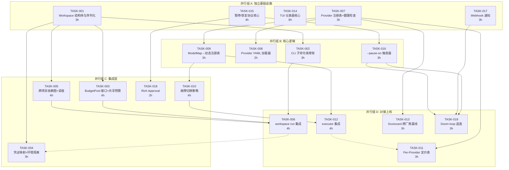
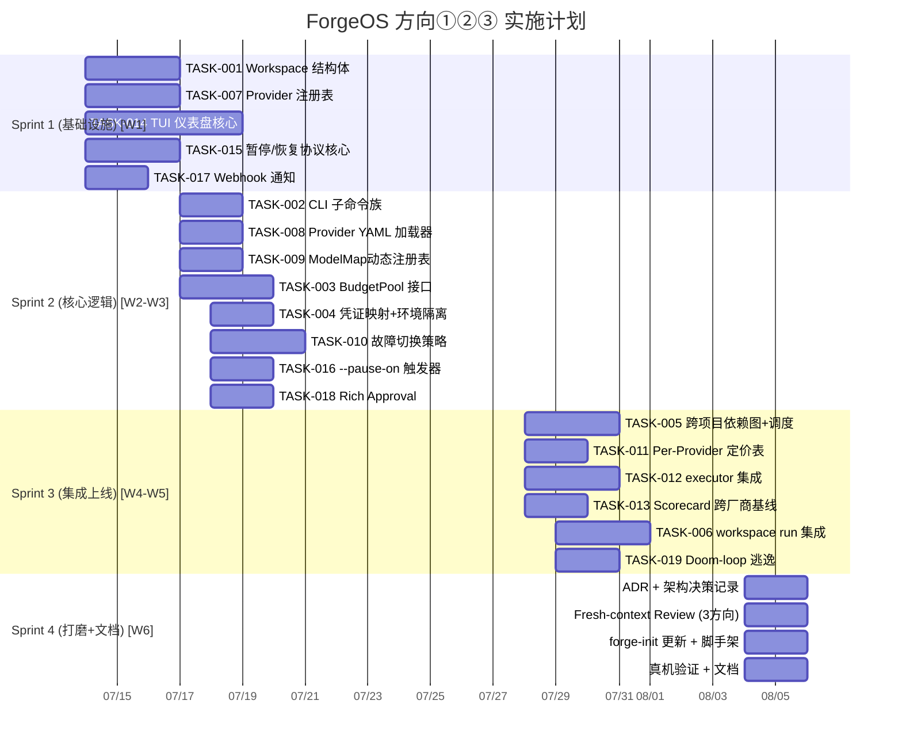

Now I have a thorough understanding of the codebase and the sprint history. Let me compose the comprehensive Tech Lead analysis.

---

# Tech Lead 分析报告: ForgeOS 五个架构扩展方向

## 概览

基于对 `forge-core` (18 Go 包, 33K 行 Go + harness + `.agent/`) 的代码级分析, 以及 30 个 sprint 的交付节奏 (~1 sprint/方向), 产出以下实施计划。

**收敛选择**: 根据文档建议 + 代码现状, 推荐 **做三件 (①+②+③)**:
- 方向③ (P0, 人机交互协议) 是「敢放手」的最后 10%, 解锁现有全部投资的可信度
- 方向① (P1, 多项目工作区) 是组织级采用的硬阻塞, 但依赖③的 pause/resume 让 operator 敢批量跑
- 方向② (P1, 跨厂商模型池) 是 24h 无人值守的数学前提, 但依赖①的 per-project 凭证隔离才能投产

方向④⑤ 标记为 v2, 基础设施已就绪 (memory store, gate adapter pattern), 但完整价值需跨厂商池和语义工具生态成熟。

---

## 1. 任务分解

### 方向① — 多项目工作区编排 (P1)

| 任务 ID | 标题 | 涉及文件 | 前置依赖 | 工时 |
|---|---|---|---|---|
| TASK-001 | **Workspace 结构体与序列化**: 定义 `Workspace` struct, `workspace.yaml` Schema, 加载/保存 | `forge-core/internal/workspace/workspace.go`, `workspace_test.go` | — | 3h |
| TASK-002 | **CLI 子命令族骨架**: `forge workspace init/list/status/rm` 注册到 `main.go` subcommands, flag 解析 | `forge-core/cmd/forge/main.go` (subcommands map 加新入口), `forge-core/cmd/forge/workspace.go` | TASK-001 | 3h |
| TASK-003 | **BudgetPool 接口 + 共享预算实现**: `cost.go` 的 `runBudget` 提取为 `BudgetPool` 接口, 支持共享池 + per-project min-reserve | `forge-core/cmd/forge/cost.go`, `forge-core/internal/workspace/budget.go`, `forge-core/cmd/forge/cost_test.go` | TASK-001 | 4h |
| TASK-004 | **Per-Project 凭证映射 + 环境隔离**: workspace config 中 `env:` 字段, `command_executor.go` 创建子进程时注入 per-project env | `forge-core/cmd/forge/executor.go`, `forge-core/internal/workspace/credentials.go` | TASK-001 | 3h |
| TASK-005 | **跨项目依赖图 + 调度**: Workspace 内项目 `depends_on` 拓扑, orchestrator 按 DAG 顺序执行 | `forge-core/internal/workspace/dag.go`, `forge-core/internal/orchestrator/waves.go` (扩展 RunParallel 接受 Workspace) | TASK-001, TASK-003 | 4h |
| TASK-006 | **`forge workspace run` 集成**: 将 workspace context 传入 `RunFrom`/`RunParallel`, 传递凭证/预算/依赖 | `forge-core/cmd/forge/workspace_run.go`, `forge-core/internal/orchestrator/loop.go` | TASK-002, TASK-005 | 4h |

**小计**: 方向① ~21h (约 3 sprint)

### 方向② — 跨厂商模型池与故障切换 (P1)

| 任务 ID | 标题 | 涉及文件 | 前置依赖 | 工时 |
|---|---|---|---|---|
| TASK-007 | **Provider 注册表 + 健康检查接口**: `Provider` 接口 (Name, Models, HealthCheck), 动态注册 `routing.Registry` | `forge-core/internal/routing/registry.go`, `forge-core/internal/routing/registry_test.go` | — | 3h |
| TASK-008 | **Provider 配置 YAML 加载器**: `.agent/policies/providers.yml` schema, 声明式厂商注册表 (API base, model map, auth method, region) | `forge-core/internal/routing/providers.go`, `harness/check.py` (加 `check_provider_refs` 治理检查) | TASK-007 | 2h |
| TASK-009 | **ModelMap 升级为动态注册表**: 从静态 `var ModelMap` 迁移到 `Registry.GetProvider`, 保留 `ResolveModel` 签名向后兼容 | `forge-core/internal/routing/routing.go`, `forge-core/internal/routing/routing_test.go` | TASK-007 | 3h |
| TASK-010 | **故障切换策略**: `FailoverStrategy` (round-robin / priority / latency-based), 健康探针跳过故障 provider | `forge-core/internal/routing/failover.go`, `forge-core/internal/routing/failover_test.go` | TASK-007, TASK-009 | 4h |
| TASK-011 | **Per-Provider 定价表 + SpendRatio 适配**: `cost.go` 价格表从 claude-specific 升为 per-provider+per-tier, 路由层按预算自动换厂商 | `forge-core/cmd/forge/cost.go`, `forge-core/cmd/forge/cost_test.go` | TASK-007 | 3h |
| TASK-012 | **`command_executor.go` 集成**: `claudeArgv` → `routing.ResolveModel(provider, tier)`, Round-Robin 探针, 超时自动跳过 | `forge-core/cmd/forge/executor.go` (或 `command_executor.go`), `forge-core/cmd/forge/main.go` | TASK-009, TASK-010 | 4h |
| TASK-013 | **Scorecard 跨厂商质量基线**: 扩展 scorecard schema 记 provider 维度, 为 `HistoryTiebreak` 提供跨厂商质量数据 | `harness/scorecard.mjs`, `harness/scorecard-update.mjs` | TASK-007 | 3h |

**小计**: 方向② ~22h (约 3 sprint)

### 方向③ — 人机交互协议 (P0)

| 任务 ID | 标题 | 涉及文件 | 前置依赖 | 工时 |
|---|---|---|---|---|
| TASK-014 | **TUI 仪表盘核心**: bubbletea 风格的 `forge tui` 子命令, 读 trace.jsonl 实时渲染 phase/gate/spend/elapsed | `forge-core/cmd/forge/tui.go` (或新 `internal/tui/` 包), `go.mod` 加 `github.com/charmbracelet/bubbletea` | — | 8h ** |
| TASK-015 | **暂停/恢复协议核心**: `forge run --pause-on` 解析, checkpoint + 信号文件等待, `forge resume`/`forge abort` | `forge-core/internal/persist/checkpoint.go` (扩展), `forge-core/cmd/forge/pause.go`, `forge-core/cmd/forge/resume.go` | — | 4h |
| TASK-016 | **`--pause-on` 触发器**: converge gate-fail / budget-warn / confidence-low 时自动 checkpoint + 等待 | `forge-core/internal/converge/converge.go`, `forge-core/internal/orchestrator/loop.go` | TASK-015 | 3h |
| TASK-017 | **Webhook 通知子系统**: `forge run --notify webhook://<url>?on=...` — Push 事件 HTTP POST | `forge-core/cmd/forge/notify.go`, `forge-core/internal/notify/webhook.go` | — | 3h |
| TASK-018 | **Rich Approval**: `forge approve --message "..."` 附带 human feedback, agent 在下一迭代消费 | `forge-core/cmd/forge/approve.go`, `forge-core/internal/converge/converge.go` (HumanApproved 扩展为含消息) | TASK-015 | 2h |
| TASK-019 | **Doom-loop 逃逸**: `NoProgress` tripwire → pause → notify → 人 decide, 而非 hard stop | `forge-core/internal/orchestrator/loop.go`, `forge-core/cmd/forge/evolve.go` | TASK-015, TASK-016, TASK-017 | 3h |

** **TASK-014 的 8h 是估计, 可以拆为 2×4h: TUI 框架搭建 + 仪表盘渲染**

**小计**: 方向③ ~23h (约 3 sprint)

### 方向④ — 语义验证 (P2, v2 标记)

| 任务 ID | 标题 | 涉及文件 | 前置依赖 | 工时 |
|---|---|---|---|---|
| TASK-020 | **契约测试 gate**: OpenAPI diff / schema compatibility (对接 spectral / openapi-diff) | `harness/adapters/contract.mjs`, `harness/policies.yml` | — | 4h |
| TASK-021 | **属性测试 gate**: 对接 property-based testing (Hypothesis/quickcheck), agent 自动生成 invariant | `harness/adapters/property.mjs`, `harness/acceptance-quality.mjs` | — | 3h |
| TASK-022 | **行为验证 gate**: golden file / snapshot / approval test adapter | `harness/adapters/behavior.mjs` | — | 2h |
| TASK-023 | **语义 gate 接入 converge**: `harness/policies.yml` 新 gate 类型 → `converge.Signals.Criteria` 消费 | `forge-core/internal/converge/converge.go`, `harness/acceptance.mjs` | TASK-020 | 3h |

**小计**: 方向④ ~12h

### 方向⑤ — Memory 生命周期管理 (P2, v2 标记)

| 任务 ID | 标题 | 涉及文件 | 前置依赖 | 工时 |
|---|---|---|---|---|
| TASK-024 | **Memory 消费装配**: `prompt_context.go` 的 `memoryContext` lane 真正接入 workflow phase prompt | `forge-core/cmd/forge/prompt_context.go`, `forge-core/internal/prompt/prompt.go` | — | 4h |
| TASK-025 | **自动 TTL 过期**: `Compact` 扩展参数 `TTLDays` + `RetentionPolicy{maxAge, minConfidence, maxEntries}`, `forge evolve` 自动 Compaction | `forge-core/internal/memory/memory.go`, `forge-core/internal/memory/memory_compact.go` | — | 3h |
| TASK-026 | **语义去重**: `Dedup` — 基于 Topic+Detail 的相似度去重 (cosine/n-gram) | `forge-core/internal/memory/memory_dedup.go`, `forge-core/internal/memory/memory_dedup_test.go` | — | 4h |
| TASK-027 | **跨 Workspace 知识桥**: `memory.Bridge` — 从 workspace config 读共享 memory 路径, `memory.Load` 多 source 合并 | `forge-core/internal/memory/memory.go`, `forge-core/internal/workspace/workspace.go` | TASK-001, TASK-024 | 3h |

**小计**: 方向⑤ ~14h

---

## 2. 执行顺序与依赖图

### 三件 (①+②+③) 依赖关系



### 关键并行组说明

| 并行组 | 任务 | 可并行原因 | 启动条件 |
|---|---|---|---|
| **A 独立基础设施** | T001, T007, T014, T015, T017 | 互无依赖, 各自操作不同包 | Sprint 1 第 1 天同时启动 |
| **B 核心逻辑** | T002, T008, T009, T016 | 依赖 A 的基础但彼此无依赖 | T001/T007 完成后启动 |
| **C 集成层** | T003, T004, T005, T010, T018 | 依赖 A/B 的部分输出 | T001/T009/T015 完成后启动 |
| **D 对接上线** | T006, T011, T012, T013, T019 | 依赖全部前置 | T002/T003/T005/T010/T016 完成后启动 |

### 串行风险路径 (Critical Path)

```
T001 → T002 → T006    (Workspace 完整链路, ~10h)
T007 → T009 → T010 → T012 (Multi-Provider 完整链路, ~14h)
T015 → T016 → T019    (Pause/Resume → Doom-loop 逃逸, ~10h)
```

**注意**: TASK-014 (TUI) 虽为 8h 大任务, 但它不在关键路径上 — 它的输出 (TUI 仪表盘) 是纯展示层, 不阻塞 pause/resume/webhook。 可以也**应该**并行于其余工作, 由 1 名专注前端的开发者独立完成。

---

## 3. 技术风险

### 3.1 高风险项

| 风险 | 方向 | 等级 | 详情 | 缓解策略 |
|---|---|---|---|---|
| **TUI 增加外部依赖** | ③ | 🔴 HIGH | forge-core 目前零外部 Go 依赖。引入 bubbletea 会打破零依赖承诺, 且 TUI 代码不适合纯 CLI 环境 (SSH headless) | 将 TUI 做在 `cmd/forge-tui` 独立 binary (optional 安装), 或使用 ANSI escape 纯 stdlib 实现 (无外部 dep) |
| **跨厂商 API 语义漂移** | ② | 🔴 HIGH | Claude 与 Gemini 的 thinking token / system prompt / tool use 语法差异大, v1 纯路由级切换可能导致下游 agent 产生不可预测行为 | 按文档诚实边界走: **不做 vendor API 差异抽象**, 只交付路由级切换。scorecard 记录质量漂移供 `HistoryTiebreak` 学习 |
| **Workspace 过早抽象** | ① | 🟡 MED | `Workspace` 结构体设计可能因为未知组织级需求而需要后续重构 | 采用最小可行设计: 只实现文档清单中的 4 项 (依赖图/预算/凭证/统一视图), 不做分布式调度/远程 runner。ADR 记录设计决策 |
| **--pause-on 的 checkpoint 一致性** | ③ | 🟡 MED | 在任意 phase 间 checkpoint + 暂停, 恢复时状态机的一致性保证 (尤其是 parallel 模式) | v1 仅支持 serial 模式的 pause/resume。Parallel 模式下 pause 时标记 `NOT_SUPPORTED` |
| **Provider 健康探测延迟** | ② | 🟡 MED | 健康探针需要实际 API 调用, 增加每个 agent 调用的延迟 (1-2s RTT per probe) | 使用异步后台健康探测 + TTL 缓存 (类似 `loadCaches` 的 mtime 模式), 避免阻塞主调路径 |
| **Webhook 背压** | ③ | 🟡 MED | 24h evolve loop 产生大量事件, webhook HTTP POST 可能被远端限流 | 简单背压: 事件折叠 (只发最新 state, 不发每一 phase 变化), 指数退避重试 |

### 3.2 外部依赖评估

| 依赖 | 方向 | 策略 |
|---|---|---|
| `github.com/charmbracelet/bubbletea` | ③ | **可选**: 想零依赖则用 ANSI escape (`fmt` + `\033[...`), 功能虽受限 (无鼠标/无实时刷新) 但覆盖 `forge run --watch` 核心场景。推荐独立 binary |
| OpenAI / Google / AWS SDK | ② | **v1 不用**: 通过 `claude` CLI 和 HTTP API 直调, forge-core 保持零外部依赖。Provider 注册表只存 URL + 模型名映射 |
| webhook 接收端 | ③ | **单向 Push**: ForgeOS 只做 HTTP POST, 不做回调路由。非 v1 |

### 3.3 性能瓶颈

| 瓶颈点 | 场景 | 优化策略 |
|---|---|---|
| Workspace 依赖图解析 | 30 项目 × 50 phase 的 DAG 拓扑排序 | O(V+E) 一次计算, 缓存结果。30×50 规模下性能可忽略不计 |
| Provider 健康探测 | 每次 spawn 前探测 3-5 provider | 后台 goroutine 每 30s 探测 + `sync.Map` 缓存, 主路径零阻塞 |
| TUI 实时渲染 | trace.jsonl 被每 3s 轮询 | TUI 用 `fsnotify` 或 `tail -f` 模式, 非轮询。v1 可用 1s 轮询兜底 |
| Memory 语义去重 | 1000+ entry 的全量相似度比较 | 先按 topic 分组缩小候选集 (同 topic 才有去重必要), 避免 O(n²) |

---

## 4. 资源评估

### 4.1 开发团队结构

```
Tech Lead (1) — 架构决策, ADR, 跨方向协调, Reviewer
  ├── 方向① 负责人 (1 Backend Go) — Workspace + BudgetPool + Credentials
  ├── 方向② 负责人 (1 Backend Go) — Provider Registry + Failover + Scorecard
  ├── 方向③ 负责人 (1 Full-stack Go/Node) — TUI + Pause/Resume + Webhook
  └── QA/测试 (1) — 集成测试, 真机验证, 性能测试
```

**最少 3 人 × 6 周**, 理想 4 人 × 5 周。

### 4.2 关键里程碑

| 里程碑 | 时间点 | 交付物 | 验收标准 |
|---|---|---|---|
| **M1: 基础设施** | Sprint 1 结束 (第 1 周) | T001, T007, T015, T017 完成 + 独立 binary TUI 原型 | `go build` 全绿, `gate.mjs` PASS, 架构检查 8/8 |
| **M2: 核心逻辑** | Sprint 2 结束 (第 3 周) | T002, T003, T004, T009, T010, T016 完成 | 3 方向各自核心逻辑单测 + 集成通 |
| **M3: 集成上线** | Sprint 3 结束 (第 5 周) | T005, T006, T011, T012, T018, T019 完成 | 全链路 `forge accept: ACCEPTED` |
| **M4: 打磨+文档** | Sprint 4 结束 (第 6 周) | ADR, `.agent/` 资产更新, integration guide | fresh-context reviewer APPROVE |

### 4.3 阻塞点与解决策略

| 阻塞点 | 影响 | 解决策略 |
|---|---|---|
| **真机 API 密钥** (方向②) | 无法端到端测试 OpenAI/Google provider | 使用 mock provider (echo 返回固定 JSON), 单元测试覆盖路由/故障切换逻辑, 真机验证延后到 M3 |
| **bubbletea 依赖决策** (方向③) | 若坚持零依赖, TUI 功能会受限 | 先做 ANSI 版本 (3 天), 若用户反馈不足再引入 bubbletea (不影响关键路径) |
| **Workspace creds 安全性** (方向①) | 凭证明文存 yaml 不安全 | v1 不做 secrets management, 信任 `provider env` 从宿主继承。诚实标注为 v2 改进 |
| **跨厂商 scorecard 数据不足** (方向②) | `HistoryTiebreak` 无法做 evidence-gated 降档 | v1 scorecard 只记录+展示数据, 不做自动切换。等足够数据积累后再启用 evidence-gated |

---

## 5. 质量保证

### 5.1 单元测试覆盖 (硬性要求)

| 包/文件 | 要求覆盖率 | 关键测试场景 |
|---|---|---|
| `internal/workspace/` (新) | ≥ 85% | Workspace 序列化/反序列化, DAG 拓扑排序 (含环检测), BudgetPool 共享/独享/耗尽 |
| `internal/routing/` (改) | ≥ 90% | Provider 注册/注销, 健康状态变更, Failover 顺序/超时/全部故障 |
| `internal/memory/` (改) | ≥ 85% | TTL 过期, Dedup 语义 (精确/近似/假阳性), Bridge 多 source 合并 |
| `cmd/forge/cost.go` (改) | ≥ 90% | 跨厂商定价表计算, SpendRatio 跨 provider 切换边界 |
| `cmd/forge/` 暂停/恢复 | ≥ 80% | Pause 信号文件写入, Resume 恢复状态机, Abort 清理 |
| TUI 渲染 | ≥ 60% | 因 ANSI/UI 代码难以纯逻辑测试, 重点测数据管道 (trace.jsonl → state struct) |

### 5.2 集成测试策略

| 测试层 | 工具 | 方向 | 策略 |
|---|---|---|---|
| **CLI 集成** | `go test` + `exec.Command` | ①, ③ | `forge workspace init/list/status`, `forge run --pause-on`, `forge resume` — 全部 subcommand 端到端 |
| **Engine 集成** | `orchestrator_test.go` | ①, ② | LoopEngine 在 workspace context 下运行, Provider failover 场景下运行 |
| **真机验证** | `docs/ignition.md` 配方 | ② | 真 Claude + 真 OpenAI key, 跑 `forge run build --executor command --agent-cmd claude` 验证 failover |
| **Harness 集成** | `harness/acceptance.mjs` | ④ | 新 gate 类型 (contract/property) 注册到 policies.yml 后, `forge accept` 能识别并执行 |
| **回归保护** | `git stash diff` | 全部 | 每个 task 完成后 diff 确认零行为变化 (对已有功能) |

### 5.3 代码审查要点

| 审查维度 | 重点 | 对应方向 |
|---|---|---|
| **依赖方向** | workspace 包不 import cmd/forge, routing 不 import cost | ①, ② |
| **零依赖纪律** | 无新外部 Go module 依赖 (除非 TUI 独立 binary) | 全部 |
| **向后兼容** | `ResolveModel("", "opus")` 仍返回 `claude-opus-4`, 现有 CLI 命令无行为变化 | ② |
| **诚实标注** | 所有"v1 不做"的能力在代码注释 + ADR 中诚实标注 | 全部 |
| **文件大小** | 新文件 ≤ 500 行, 已有文件接近阈值先拆分 | 全部 |
| **reviewer 独立** | 实现者不审自己代码 — 每个方向交叉审 (方向①审②, ②审③, ③审①) | 全部 |

### 5.4 性能测试需求

| 测试 | 方法 | 阈值 |
|---|---|---|
| Workspace DAG 调度 (30 项目 × 50 phase) | `BenchmarkDAGResolve` | < 10ms |
| Provider 健康探测缓存命中 | `BenchmarkHealthCheck` | < 100µs (缓存命中) / < 2s (首次探测) |
| TUI JSONL 尾读延迟 | `BenchmarkTUIRender` | < 100ms (1000 行 trace) |
| Memory 语义去重 (1000 entry) | `BenchmarkDedup` | < 500ms (单次 full scan) |

---

## 6. 实施计划

### 时间线 (6 周, 4 人团队)



### 每人并行任务分配

| 角色 | Sprint 1 | Sprint 2 | Sprint 3 | Sprint 4 |
|---|---|---|---|---|
| **TL** (方向协调) | TASK-015 + ADR 框架 | TASK-016 + Code Review | TASK-019 + 集成测试设计 | 全方向 Review + 真机验证 |
| **方向①** (1 人) | TASK-001 | TASK-002, TASK-003 | TASK-005, TASK-006 | ADR + 文档 |
| **方向②** (1 人) | TASK-007 | TASK-008, TASK-009, TASK-010 | TASK-011, TASK-012, TASK-013 | ADR + 文档 |
| **方向③** (1 人) | TASK-014, TASK-017 | TASK-018 + TUI 打磨 | TASK-019 (配合) + 集成 | 集成测试 + 文档 |

### 发布检查清单

| 检查项 | 标准 | 责任人 |
|---|---|---|
| `go build` / `go vet` / `go test -race` | 全绿 | 全部 |
| `gate.mjs` (文件数/行数) | PASS | 全部 |
| `arch-check.mjs` (8 检查) | 8/8 PASS | 全部 |
| `check.py` (治理完整性, 含新 provider/workspace 资产引用) | PASS | TL |
| `secret-scan.mjs` | 0 finding | 全部 |
| **`forge accept`** | **ACCEPTED** | TL |
| Fresh-context Review × 3 (每个方向串行审) | 全部 APPROVE | 独立 Reviewer |
| 向后兼容注入测试 (已有 workflow 零行为变化) | `git stash diff` = 空 | 方向①, ② |
| Copy-anywhere 测试 (新项目 forge-init → forge accept ACCEPTED) | PASS | TL |

---

## 总结

**推荐路径**: 三件 (①+②+③), 6 周, 4 人。

三个方向在代码层面互不阻塞 (操作不同包), 可以并行推进。唯一的跨方向依赖是:
- 方向① 的 Workspace 需要方向③ 的 pause/resume 让 operator 敢批量跑多个 workspace
- 方向② 的 per-project 凭证映射依赖方向① 的 workspace context

这两个跨方向依赖出现在 Sprint 3 (集成上线), 在此之前三方向完全可以独立开发。

**关键纪律**:
1. 方向④⑤ (语义验证 / Memory 生命周期) 不动 — 基础设施已就绪, 但完整价值依赖跨厂商池和工具生态, 标记为 v2
2. TUI 要么用 ANSI escape 零外部依赖, 要么做独立 binary — 不打破 forge-core 零依赖承诺
3. 每个 task 完成后立即跑 `forge accept`, 避免积累到 sprint 末尾才发现 REJECTED
