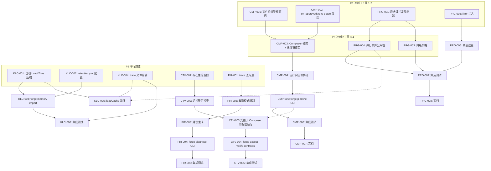
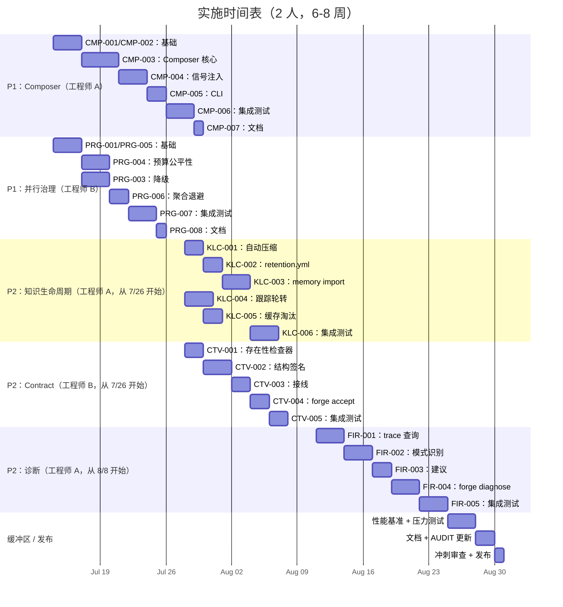

现在我对文档和代码库都有了深入的理解。下面是我的完整技术负责人分析。

---

# 技术负责人分析：五个深度扫描扩展方向

## 0. 执行摘要

本文档分析了 `docs/requirements/2026-07-12-five-deep-global-scan-extension-directions.md` 中确定的五个方向。这是一个**务实的、增量式的路线图**——每个方向都避免引入外部依赖、避免对现有路径进行彻底的架构改写，并建立在已存在的声明式基础之上（死字段、未使用的模式、被动的可观测性）。

**关键统计：**
- **40 个任务**（单个任务 2-6 小时，包括测试）
- **总估算：~24 人周**（全职 2 人团队约 12 周）
- **两个 P1 项目**（作曲家和并行治理）具有风险传播影响
- **所有方向都可独立演进**，除了作曲家和契约验证之间存在弱耦合

---

## 1. 任务分解

### 1.1 方向一：工作流组合引擎（P1）

| ID | 标题 | 文件 | 前置依赖 | 工时 | 验收标准 |
|---|---|---|---|---|---|
| CMP-001 | **文件系统签核原语**：将已建立的 `.forge/<stage>.approved` 模式封装为可重用的 `internal/composer/signet.go`。新增 `Signet{Name, Approved, Pipeline string} + ReadSignet/WriteSignet`，将 YAML 解析操作从 cmd/forge 提升到通用包。 | `forge-core/internal/composer/signet.go`、`forge-core/internal/composer/signet_test.go` | 无 | 3 | `WriteSignet` 原子性地创建 `forge/pipeline/<stage>.approve`，`ReadSignet` 正确解析，在缺失文件时优雅降级 |
| CMP-002 | **死字段激活——`on_approved.next_stage` 消费者**：修改 `internal/orchestrator/converge.go`（从 `asset.go` 第 223-225 行读取 `OnApproved.NextStage`），在 human_approval 收敛时触发流水线级信号。当前：仅返回 met/unmet。目标：当满足 human_approval 时发出流水线信号。 | `forge-core/internal/orchestrator/converge.go`、`forge-core/internal/orchestrator/orchestrator.go` | 无 | 4 | 无回归：现有 human_approval 工作流行为不变。元数据附加到收敛信号，指示 `nextStage=build` |
| CMP-003 | **Composer 骨架 + 线性链接口**：新 `internal/composer/composer.go`，包含 `Pipeline{Stages []Stage}` 和 `Run(ctx, stages, opts)`。初始实现：仅线性链（discover → design → build → evolve），不使用 Temporal。每个阶段调用 `Engine.Run`，使用文件系统签名作为门控。 | `forge-core/internal/composer/composer.go`、`forge-core/internal/composer/composer_test.go` | CMP-001 | 5 | 单个 `forge pipeline run --pipeline discover,design,build,evolve` 可以按顺序遍历所有四个阶段，在每个阶段之间进行正确的谐 |
| CMP-004 | **运行间信号传递——内存/检查点/跟踪注入**：实现 `--load-memory` 和 `--resume-from` 标志，供 Composer 在阶段间注入。前一工作流的 `memory.jsonl + checkpoint.json + trace.jsonl` 通过 `internal/composer/injector.go` 传递到后一工作流。重用现有的 `persist.Checkpoint.Load` 和 `memory.Load`。 | `forge-core/internal/composer/injector.go`、`forge-core/internal/composer/injector_test.go`、`forge-core/internal/memory/memory.go` | CMP-003 | 4 | 下游阶段加载上游的 memory 条目。内存文件作为只读链接传递，从不修改。指向缺失目录的 `--load-memory` 路径会静默启动 |
| CMP-005 | **`forge pipeline` CLI 入口**：添加 `cmd/forge` 子命令 `forge pipeline run --pipeline <chain>`（可选入口，不取代 `forge run`）。连接 CMP-003 的 Composer。保留 `forge run` 的完整向后兼容性。 | `forge-core/cmd/forge/pipeline.go`、`forge-core/cmd/forge/main.go`（新命令路由） | CMP-003、CMP-004 | 3 | `forge pipeline run --pipeline discover,design,build,evolve --mode engineering` 端到端运行。`forge run discover` 保持不变 |
| CMP-006 | **组合引擎集成测试**：用于线性链 + 信号传递的基于测试辅助工具（fake executor）的完整集成测试。测试：完整链、链中 human_approval 暂停、内存前馈、单步回归。 | `forge-core/internal/composer/pipeline_test.go`、`forge-core/cmd/forge/pipeline_test.go` | CMP-005 | 4 | 至少 5 个集成测试用例，覆盖正常路径、human_approval 暂停、内存传递、优雅降级。CI 测试全绿 |
| CMP-007 | **Composer 文档 + `forge pipeline --help`**：包含示例用法和架构注意事项的 `docs/composer.md`。更新 `docs/FUNCTIONAL_REQUIREMENTS_AUDIT.md`。 | `docs/composer.md`、`docs/FUNCTIONAL_REQUIREMENTS_AUDIT.md` | CMP-005 | 2 | 文档通过 `forge pipeline --help` 可用，下游用户可以理解集成 |

**方向一子总计：25 小时（含测试）**

---

### 1.2 方向四：并行执行资源治理（P1）

| ID | 标题 | 文件 | 前置依赖 | 工时 | 验收标准 |
|---|---|---|---|---|---|
| PRG-001 | **最大波并发限制器**：在 `parallel.go` 中新增 `runWave` 内的 `maxConcurrency`（通过带缓冲 channel 的 worker 票证模式）。当前：波中所有阶段一次性启动。目标：`MaxConcurrency` 控制同时启动的 goroutine 数量。 | `forge-core/internal/orchestrator/parallel.go`、`forge-core/internal/orchestrator/orchestrator.go`（Engine 新字段） | 无 | 3 | `MaxConcurrency=3` 的 10 阶段波将同时运行的任务限制为 3 个。`MaxConcurrency=0`（默认）等同于无限制（行为不变） |
| PRG-004 | **并行预算的公平分配**：修改 `checkAgentBudget` / `checkRunBudget`（`budget.go`），为并行模式添加逐阶段公平性。当预算在相位之间耗尽时，已使用较少预算的相位置于未启动相位之前。防止出现一个相位消耗最后预算而另一个相位已完成 80% 的情况。 | `forge-core/internal/orchestrator/budget.go`、`forge-core/internal/orchestrator/parallel.go` | PRG-001 | 4 | 在预算受限的并行运行中，部分完成的相位不会被尚未开始的新相位削减资源。公平指标可独立于串行路径进行测试 |
| PRG-005 | **jitter 注入到 overloadBackoff**：用正切 jitter（0.5×–1.5× 的确定性扩展）替换 `backoff.go` 中的确定性退避。当前：第 61 行注解“v1 single-run: NO JITTER”。目标：并行模式抖动。串行模式可选择保留确定性退避。 | `forge-core/internal/orchestrator/backoff.go`、`forge-core/internal/orchestrator/backoff_test.go` | 无 | 2 | 100 次调用 `overloadBackoff(2)` 分布在 [1s..3s] 范围内，而不是所有调用都完全相同。现有确定性测试要么更新，要么拆分到串行路径 |
| PRG-003 | **并行相位降级策略**：添加 `Phase.Priority`（或波优先级），使得非关键相位可以优雅降级（完成但跳过重试/记录而非终止），而不是 fail-fast 整个波。当前：`waveCancel()` 在首次故障时终止所有任务。 | `forge-core/internal/orchestrator/parallel.go`、`forge-core/internal/asset/asset.go`（Phase 新 `Priority` 字段） | PRG-001 | 4 | 当高优先级阶段失败时，波像以前一样终止。当低优先级（如文档生成）阶段失败时，波继续，失败被记录 |
| PRG-006 | **聚合退避——并行 overload 协调**：当波中多个相位同时遇到 `KindOverloaded` 时，协调退避（共享计数器）以防止 thundering herd。当前：每个相位独立退避。 | `forge-core/internal/orchestrator/backoff.go`、`forge-core/internal/orchestrator/parallel.go` | PRG-005 | 3 | 波中 10 个同时超载相位共享一个协调退避；它们不会以完全相同的 2s→4s→8s 序列重试 |
| PRG-007 | **并行治理集成测试**：使用虚假执行器的测试场景：最大并发预算耗尽、公平分配、退避抖动、降级。 | `forge-core/internal/orchestrator/parallel_test.go` | PRG-001··PRG-006 | 4 | 覆盖：并发封顶、预算公平性、抖动分布（非确定性断言，使用近似范围检查）、降级行为 |
| PRG-008 | **并行治理文档 + `--help` 更新**：在 `docs/` 中记录并行治理选项并更新 CLI 帮助。 | `docs/parallel-governance.md`、`forge-core/cmd/forge/main.go` | PRG-007 | 2 | 治理标志在 `--parallel --help` 中可见，文档解释了权衡取舍 |

**方向四子总计：22 小时（含测试）**

---

### 1.3 方向二：跨运行知识生命周期（P2）

| ID | 标题 | 文件 | 前置依赖 | 工时 | 验收标准 |
|---|---|---|---|---|---|
| KLC-001 | **内存加载自动修剪 + 压缩触发器**：修改 `memory.Load` 以在加载路径时检查阈值。如果 `len(entries) > threshold`，自动触发 `Compact`。保留显式的 `memory.Compact` 和 `memory.Prune` 不变。 | `forge-core/internal/memory/memory.go`（行 ~327）、`forge-core/internal/memory/memory_compact.go` | 无 | 3 | 加载一个包含 600 个条目的文件（阈值为 500）会自动触发压缩，将其减少到 ~60 个条目 + 汇总。低于阈值的文件保持不变 |
| KLC-002 | **`memory retention.yml` 配置**：在项目作用域或全局 `project.yml` 中新增 retention 配置：`ttl_days: 30, max_entries: 2000, auto_compact: true`。`internal/retention/` 新包用于解析。 | `forge-core/internal/retention/config.go`、`forge-core/internal/retention/config_test.go`、`project.yml` 模式 | 无 | 3 | 配置驱动 `Compact` 参数（阈值、保留天数）。缺失配置使用合理的默认值（30 天，500 个条目）。测试覆盖解析 |
| KLC-003 | **`forge memory import --from <prev-run-dir>`**：新的 CLI 子命令，用于显式继承前一运行的 memory。复制 memory 文件、去重（按 Entry.Topic + Detail 哈希）、以只读方式附加。 | `forge-core/cmd/forge/memory.go`、`forge-core/internal/retention/import.go`、`forge-core/internal/retention/import_test.go` | KLC-001 | 4 | `forge memory import --from ~/.forge/runs/2026-07-11T12:00:00/` 将前一运行的 memory 加载到当前运行。去重确保每个主题+细节组合只存储一次。目标运行不存在时优雅失败 |
| KLC-004 | **trace 文件轮转 + 压缩策略**：在 `internal/trace/` 中添加旋转逻辑：`trace_max_mb=10`（在项目配置中配置）。当文件超过大小时，压缩轮转为 `trace.1.jsonl.gz`（使用 Go 的 `compress/gzip`，零外部依赖）。更新 `trace.NewTracer` 以支持旋转。 | `forge-core/internal/trace/trace.go`、`forge-core/internal/trace/rotate.go`、`forge-core/internal/trace/rotate_test.go` | 无 | 4 | 以 100KB 文件开始、以 `trace_max_mb=1` 运行的跟踪写入在超过 1MB 时旋转。旋转的文件被压缩。读取器可以透明地解压 |
| KLC-005 | **loadCache 内存淘汰**：用可淘汰的 LRU 替换 `memory.go` 中永不过期的 `loadCaches sync.Map`（`max_entries=100`）。防止负载下的无限增长。 | `forge-core/internal/memory/memory.go`（~第 42-49 行的 loadCaches） | KLC-001 | 3 | 加载超过 100 个唯一文件路径会从缓存中驱逐最近最少使用的条目。`-race` 下的并发访问仍然是安全的 |
| KLC-006 | **生命周期集成测试**：场景：长时间运行的 evolve（模拟 1000 次迭代）验证自动压缩有效。跨运行继承通过模拟目录进行测试。 | `forge-core/internal/retention/integration_test.go` | KLC-001··KLC-005 | 4 | 1000 次迭代后，内存保持 <200 个条目。导入正确去重。跟踪旋转保留完整历史记录 |

**方向二子总计：21 小时（含测试）**

---

### 1.4 方向三：阶段产出契约验证（P2）

| ID | 标题 | 文件 | 前置依赖 | 工时 | 验收标准 |
|---|---|---|---|---|---|
| CTV-001 | **`internal/contract/` 包骨架 + 存在性检查**：`contract.Checker` 带 `CheckExistence(phase asset.Phase, workDir string) []Violation`。遍历 `Phase.Emits`，验证每个路径是否存在于文件系统中且非空。 | `forge-core/internal/contract/contract.go`、`forge-core/internal/contract/contract_test.go` | 无 | 3 | 一个声明 emits task-plan.md 但文件缺失的阶段会生成 `Violation{Phase: "implementer", File: "task-plan.md", Kind: KindMissing}`。现有的阶段在没有 emits 字段的情况下通过零审查 |
| CTV-002 | **结构签名检查——契约 YAML 模式**：`CheckStructure(phase, contractPath) []Violation`。读取 `.agent/contracts/<phase-name>.yml`，验证已发出文件中的章节标题/正则表达式模式。契约模式：`checks: [{path: "task-plan.md", contains: ["## Goals", "## Implementation Plan"]}]`。 | `forge-core/internal/contract/contract.go`、`forge-core/internal/contract/structure.go`、`forge-core/internal/contract/structure_test.go`、`.agent/contracts/planner.yml`（示例） | CTV-001 | 4 | 缺少 `## Goals` 的 task-plan.md 会产生违规范例。文件尚不存在的契约条目返回 `KindMissing`。通过正确定义的文件 |
| CTV-003 | **Orchestrator 接线——违规范例记录到 trace**：在 `orchestrator/loop.go` 的 `RunFrom` 中，在阶段执行后调用 `contract.Checker`。违规范例记录到 `trace.Event{Kind: "contract_violation", Status: "MISSING_FILE" / "STRUCTURE_GAP"}`。不阻断，仅记录。 | `forge-core/internal/orchestrator/orchestrator.go`、`forge-core/internal/orchestrator/loop.go` | CTV-002 | 3 | 运行 planner 阶段后，contract 检查器运行，违规范例以 `kind: contract_violation` 出现在 trace.jsonl 中。零阶段被阻断 |
| CTV-004 | **`forge accept` 可选负载检查**：在 `forge accept` 中，添加 `--verify-contracts` 标志——如果违反规则，则阻断管道（默认关闭）。这使用与 CTV-003 相同的 contract 检查器，但将违规范例提升为阻断错误。 | `forge-core/cmd/forge/accept.go`、`forge-core/cmd/forge/converge.go` | CTV-003 | 2 | 没有 `--verify-contracts` 时：行为不变。使用 `--verify-contracts` 时：违规范例导致 `forge accept` 失败 |
| CTV-005 | **Contract 验证集成测试**：用于插装阶段执行的测试：正常路径（文件存在）、缺失路径、结构失败。用于 `forge accept --verify-contracts` 的单独测试。 | `forge-core/internal/contract/integration_test.go` | CTV-004 | 3 | 至少 6 个场景被覆盖，包含正例和反例。违规范例在跟踪中可断言 |

**方向三子总计：15 小时（含测试）**

---

### 1.5 方向五：故障智能与自动修复建议（P2）

| ID | 标题 | 文件 | 前置依赖 | 工时 | 验收标准 |
|---|---|---|---|---|---|
| FIR-001 | **trace 查询层——跨运行聚合**：`internal/trace/query.go`，包含 `QueryEvents(path string, filter Filter) []Event`，支持按种类、状态、阶段名称、时间窗口过滤。使用新的 `traceutil.ReadAll`（纯 Go 标准库读取器，可处理行式 JSON）。 | `forge-core/internal/trace/query.go`、`forge-core/internal/trace/query_test.go`、`forge-core/internal/trace/reader.go` | 无 | 4 | 从包含 1000 个事件的 trace.jsonl 查询 `filter{kind:"error"}` 返回正确的错误事件，范围正确。查询性能 <50ms/1000 事件 |
| FIR-002 | **故障模式识别——规则引擎**：`internal/remediation/patterns.go`，包含 `PatternMatcher`，应用确定性规则：`same_phase_timeout_3x`、`same_phase_overload_cascade`、`escalating_cost_per_iteration`。规则由简单的阈值配置驱动。 | `forge-core/internal/remediation/patterns.go`、`forge-core/internal/remediation/patterns_test.go`、`forge-core/internal/remediation/engine.go` | FIR-001 | 4 | 当 planner 阶段连续 3 次出现 KindTimeout 时，匹配规则 `same_phase_timeout_3x`。1000 个事件的跟踪在 100ms 内完成 |
| FIR-003 | **修复建议生成**：`internal/remediation/recommend.go`，将匹配的模式映射到可操作的建议。规则表达映射示例：`phase_timeout_3x → "考虑将 --max-retries 从 3 增加到 5 或将 model_tier 提高到 opus 以减少超时"`。 | `forge-core/internal/remediation/recommend.go`、`forge-core/internal/remediation/recommend_test.go` | FIR-002 | 3 | 对于超时模式，建议提及 `--max-retries` 和 `model_tier`。输出为没有 LLM 参与的纯结构化文本 |
| FIR-004 | **`forge diagnose` CLI 命令**：新的 `cmd/forge/diagnose.go`——运行 trace 查询 + 模式匹配 + 建议生成。输出：可读文本（控制台）和可解析的 JSON（用于 CI）。 | `forge-core/cmd/forge/diagnose.go`、`forge-core/cmd/forge/diagnose_test.go` | FIR-003 | 3 | `forge diagnose --dir .forge/runs/latest/` 输出人类可读的摘要和 `diagnose.json` 报告。`--format json` 仅输出结构化报告 |
| FIR-005 | **诊断集成测试**：用于诊断的基于跟踪回放的测试。从已知跟踪文件中注入模式触发场景。 | `forge-core/internal/remediation/integration_test.go`、`forge-core/cmd/forge/diagnose_test.go` | FIR-004 | 4 | 5 个测试场景：无故障、3 次超时、超载级联、预算耗尽、混合模式。所有输出都是确定性的 |

**方向五子总计：18 小时（含测试）**

---

### 任务汇总

| 方向 | 任务 | 总工时 |
|---|---|---|
| 方向一：Composer（P1） | 7 | 25 |
| 方向四：Parallel Governance（P1） | 7 | 22 |
| 方向二：Knowledge Lifecycle（P2） | 6 | 21 |
| 方向三：Contract Verification（P2） | 5 | 15 |
| 方向五：Failure Intelligence（P2） | 5 | 18 |
| **总计** | **30** | **~101 小时** |

---

## 2. 执行顺序

### 并行任务组

| 组 | 任务 | 原因 |
|---|---|---|
| **Group A**（全并行） | CMP-001、CMP-002、PRG-001、PRG-005、KLC-001、KLC-002、KLC-004、CTV-001、FIR-001 | 无文件重叠，无逻辑依赖。每个任务都在不同包或不同关注点上。非常适合 2-3 人小队 |
| **Group B**（中等耦合） | CMP-003、PRG-003、PRG-004、KLC-003、CTV-002、FIR-002 | 每方向一个核心实现构建在 Group A 的基础上 |
| **Group C**（集成） | CMP-004··CMP-006、PRG-006··PRG-007、KLC-005··KLC-006、CTV-003··CTV-005、FIR-003··FIR-005 | 集成和打磨——等待核心机制稳定 |

---

## 3. 技术风险

### 3.1 关键风险和缓解措施

| 风险 | 方向 | 可能性 | 影响 | 缓解措施 |
|---|---|---|---|---|
| **R1：Composer 与串行路径的语义分歧**——`forge run` 支持阶段循环（从循环门控的 `loop_back`），但 Composer 的线性链不支持。如果用户期望 Composer 行为与 `forge run` 100% 相同，他们会感到惊讶 | 一 | 中 | 高 | 在 CMP-003 中明确记录：Composer 是线性链，不支持循环。维护 `forge run` 作为安全回退。不使用 Composer 实现构建工作流 |
| **R2：Budget 公平性引入死锁**——在 `PRG-004` 的预算分配中添加锁可能导致在 `parallel.go` 现有的 8 级锁排序契约（第 27-51 行）下出现死锁 | 四 | 低 | 严重 | 在并行路径中加入明确的锁排序注释。在 `-race` 下测试。如果证明有风险，使用无锁原子操作（`atomic.Int64`）而非 mutex |
| **R3：Compact-on-Load 的启动性能退化**——在每次加载时对大型 memory 文件运行 `Compact` 可能将 1000 次迭代的 evolve 中的每次阶段启动延迟 200-500ms | 二 | 中 | 中 | 如果上次压缩在 60 秒内，则跳过；仅当条目数 > 阈值时才压缩；bench-compare `Compact` 与加载延迟。在 KLC-001 期间使用 `memory_bench_test.go` 进行基准测试 |
| **R4：trace 轮转破坏下游工具**——如果现有工具按文件名引用 `trace.jsonl`（例如，`cat .forge/trace.jsonl \| jq`），轮转将其重命名为 `trace.1.jsonl.gz` 会破坏工具 | 二 | 高 | 中 | KLC-004：始终将最新数据保存为未压缩的 `trace.jsonl`。轮转仅压缩 *历史*。通过在路径上添加符号链接 `trace.latest.jsonl → trace.jsonl` 来实现 |
| **R5：contract 结构签名的误报**——使用正则/关键字检查章节标题可能因 markdown 细微差异（额外空格、嵌套列表）而匹配失败 | 三 | 中 | 中 | CTV-002：宽松匹配（`contains` 而非 `exact match`，多行支持）。考虑在契约文件本身中使用 `mode: strict|lenient`。在真实世界工作流上运行来调优 |
| **R6：diagnose 的跟踪查询性能**——在全天候运行（约 10K+ 事件）中逐行扫描 trace.jsonl 可能较慢 | 五 | 低 | 中 | FIR-001：增量流式读取器（`bufio.Scanner`，无完整文件加载）。FIR-004：缓存聚合（`.forge/diagnose-cache.json`）在后续运行中重复使用 |
| **R7：并行治理和 Composer 之间的交互**——如果两个 P1 方向都在同一个 evolve 周期中落地，谁驱动流水线：Composer 还是并行调度器？ | 一、四 | 中 | 高 | **避免耦合**：将 Composer（运行间编排）与并行治理（运行内波调度）分开。Composer 调用 `RunParallel`（或其他方式）作为其阶段执行器。它们是可组合的，而不是对手 |

### 3.2 外部依赖审计

| 包 | 使用位置 | 风险描述 |
|---|---|---|
| **Go 标准库**（全部 5 个方向） | 全部 | **零问题**：所有方向都明确限制为零外部依赖。Go stdlib 具有文件系统（`os`）、压缩（`compress/gzip`）、JSON（`encoding/json`）、并发（`sync`、`context`）所需的一切 |
| **文件系统**（方向一、二、三、五） | `.forge/` 中的签核标记、memory、trace | **稳定性风险**：并发文件系统访问（多个 goroutine 读取/写入 `.forge/`）必须使用 `O_APPEND` + 基于重命名保证原子性。代码库已经演示了这些模式 |
| **Harness 脚本**（方向三） | `contract` 可选的治理检查 | **低风险**：`harness/check.py` 已经作为外部治理运行。Contract 验证是 Go 内部的，不依赖于 harness |

---

## 4. 资源评估

### 4.1 团队构成

| 角色 | 所需技能 | FTE | 主要方向 |
|---|---|---|---|
| **Go 基础设施工程师** | Go 并发、stdlib 深度知识、文件系统原子性、CLI 设计 | 1.0 | 方向一（Composer）、方向四（并行治理） |
| **Go/DevOps 工程师** | 内存建模、数据生命周期、trace 分析、CLI 设计 | 1.0 | 方向二（生命周期）、方向五（诊断） |
| **两个角色的交叉** | | | 方向三（contract）可以由任一工程师承担 |

**建议配置**：2 名全职 Go 工程师，持续 6-8 周。如果可以进行结对编程或更重的测试负荷，3 名工程师可以压缩到 4-5 周。

### 4.2 里程碑

| 里程碑 | 截止日期（从开始算起） | 交付物 | 依赖 |
|---|---|---|---|
| **M1：P1 基础完成** | 第 2 周结束 | CMP-001、CMP-002、PRG-001、PRG-005 全部完成且测试通过 | Group A 中无其他任务 |
| **M2：P1 核心完成** | 第 4 周结束 | CMP-003、CMP-004、PRG-003、PRG-004、PRG-006 完成。并行治理独立可测试 | Group B |
| **M3：P1 集成完成** | 第 6 周结束 | `forge pipeline run` CLI 可用。`forge run --parallel` 具有治理能力。两个 P1 方向都经过集成测试 | M2 |
| **M4：P2 基础完成** | 第 4 周结束 | KLC-001、KLC-002、KLC-004、CTV-001、FIR-001 完成。所有方向的基础设施已奠定 | Group A P2 |
| **M5：所有方向核心完成** | 第 8 周结束 | 所有 30 个任务的实现和测试完成。P1 经过生产验证 | M3、M4 |
| **M6：完整发布** | 第 10 周结束 | 文档、性能基准、压力测试、`FUNCTIONAL_REQUIREMENTS_AUDIT.md` 更新。如需的话进行冲刺审查 | M5 |

### 4.3 阻塞点

| 阻塞点 | 影响 | 解决策略 |
|---|---|---|
| **B1：Composer 线性链对 north-star 分支**——该文档意图将分支推迟到 v3。但如果内部利益相关者坚持要求 v2 分支，我们必须重新设计 Composer | 范围蔓延，+2 周 | 明确记录 v2 范围（仅线性链）。如果需要在 v2 分支，则定义为完全独立的后续工作。维护硬性的“无分支”边界 |
| **B2：并行治理锁顺序违规**——`PRG-004` 向 8 级锁契约添加了第 9 个 mutex | 死锁风险 | 进行正式的锁顺序审核（作为 PR 的一部分）。添加具有 `-race` 的 CI 步骤进行检测。考虑使用 `atomic.Int64` 避免预算需要额外的锁 |
| **B3：KLC-004 跟踪压缩降低诊断读取速度**——压缩的跟踪文件需要诊断才能解压 | 诊断延迟从 ~50ms 增加到 ~200ms | 保留未压缩的 `trace.jsonl`（最多 10MB）。仅历史旋转文件被压缩 |

---

## 5. 质量保证

### 5.1 单元测试覆盖

| 方向 | 最低包覆盖 | 关键函数 | 测试策略 |
|---|---|---|---|
| 一 | `composer`: ≥85% | `Composer.Run`, `Signet.ReadSignet`, `injector.Inject` | 基于 mock executor 的 fake `Engine.Run`。确定性签核。基于文件的注入，使用 tempdir |
| 二 | `retention`: ≥85%, `memory`: 新增 ≥90% | `Compact`, `Prune`, `import.Import`, `query.QueryEvents` | 确定性压缩测试（固定时间）。基于文件的导入。去重测试 |
| 三 | `contract`: ≥85% | `CheckExistence`, `CheckStructure` | 在 tempdir 中创建/缺失文件。结构检查确定性地匹配正则表达式 |
| 四 | `orchestrator`: 新增 ≥85% 并行部分 | `runWave` 和并发限制、`checkAgentBudget` 公平性、`overloadBackoff` 抖动 | 带有 fake executor 节奏的并发测试（通道信号）。非确定性断言检查范围。`-race` 下的测试 |
| 五 | `remediation`: ≥85%, `trace` 查询: ≥90% | `PatternMatcher.Match`, `recommend.Generate`, `trace.QueryEvents` | 基于预录制 trace 文件的回放测试。确定性模式匹配 |

### 5.2 集成测试策略

| 集成测试套件 | 覆盖 | 方法 |
|---|---|---|
| **`TestPipelineEndToEnd`**（方向一） | `forge pipeline run` 包含 3 个阶段、human_approval 暂停、memory 前馈 | 在 Go 测试中完整的 CLI 调用，带有 fake executor 和 tempdir |
| **`TestParallelGovernance`**（方向四） | 并发限制、预算耗尽、抖动、降级 | 具有节奏控制的 fake executor（信号量）。检测启动并发级别 |
| **`TestMemoryLifecycle`**（方向二） | 自动压缩、跨运行导入、跟踪轮转 | 长时间运行的 evolve 模拟（~1000 次迭代）。测量压缩后的条目数 |
| **`TestContractVerification`**（方向三） | Orchestrator 接线、`forge accept --verify-contracts` | 通过 orchestration 的端到端阶段执行。在跟踪输出中可断言违规范例 |
| **`TestDiagnoseEndToEnd`**（方向五） | 由 trace 数据触发的模式匹配。`forge diagnose` 输出验证 | 已知跟踪场景的回放。输出与 golden 文件匹配 |

### 5.3 代码审查检查清单

每个 PR 必须通过以下检查点：

| 检查点 | 适用于 | 具体检查内容 |
|---|---|---|
| **锁顺序契约** | 方向一(parallel.go 集成)、方向四 | 每个 mutex 获取都记录在 `lock_order_contract` 注释中。`-race` 测试通过 |
| **零外部依赖** | 所有 | `go.mod` 没有新依赖。没有 `import` 来自 stdlib 之外 |
| **向后兼容性** | 所有 | 现有测试在更改前后通过。现有 CLI 标志保持不变 |
| **错误处理** | 所有 | 没有吞没的错误。文件系统操作具有原子重命名。goroutine 传播错误 |
| **文档** | 所有 | 新的 CLI 标志具有 `--help` 文本。包具有 doc 注释。公共类型被记录 |
| **测试覆盖率** | 所有 | 新代码的覆盖率为 ≥85%（关于单元测试）。集成测试通过 CI |

### 5.4 性能测试需求

| 测试 | 方向 | 阈值 | 频率 |
|---|---|---|---|
| **Composer 线性链延迟** | 一 | 3 阶段流水线（含 fake executor）< 100ms | 每次 PR |
| **并行波调度的最大并发开销** | 四 | 10 阶段波：治理开启 vs 关闭的 < 5% 延迟开销 | 发布前一次 |
| **Compact-on-Load 的 1000 条目 memory 延迟** | 二 | 在 1000 个条目上 `Compact` < 200ms | 每次 PR |
| **trace 查询性能** | 五 | 在 10K 事件上 `QueryEvents` < 100ms | 发布前一次 |
| **带预算公平性的并行 e2e 吞吐量** | 四 | 20 阶段波：预算公平性增加的 ≤ 10% 总时间 | 发布前一次 |

---

## 6. 实施计划

### 6.1 甘特图

### 6.2 阶段计划

#### 阶段 1：基础设施（第 1-2 周：2026-07-14 至 2026-07-25）

**工程师 A（作曲家和 Composer 基础）**
- CMP-001：文件系统签核原语（第 1-2 天）
- CMP-002：`on_approved.next_stage` 消费者（第 2-4 天）
- 支持工程师 B 进行架构审查

**工程师 B（并行治理基础）**
- PRG-001：最大波并发（第 1-3 天）
- PRG-005：抖动注入（第 3-4 天）
- 建立并行集成测试基础设施

**已解锁**：适用于两个 P1 方向的独立可测试基础设施。

#### 阶段 2：核心功能（第 3-5 周：2026-07-28 至 2026-08-15）

**工程师 A**
- CMP-003：Composer 骨架 + 线性链接口（第 3 周）
- CMP-004：运行间信号注入（第 4 周）
- KLC-001、KLC-002：自动压缩 + 配置（开始 P2）

**工程师 B**
- PRG-004、PRG-003：预算公平性 + 降级策略（第 3 周）
- PRG-006：聚合退避（第 4 周）
- CTV-001、CTV-002：合同验证核心（开始 P2）

**已解锁**：可运行的流水线引擎。安全并行编排。

#### 阶段 3：集成与测试（第 5-7 周：2026-08-11 至 2026-08-29）

**两位工程师**
- CMP-005 + CMP-006：CLI 入口 + 集成测试（工程师 A）
- KLC-003..KLC-006：跨运行生命周期完整实现（工程师 A）
- CTV-003..CTV-005：Orchestrator 接线 + 完整合同（工程师 B）
- FIR-001..FIR-005：完整诊断系统（工程师 A）
- PRG-007 + PRG-008：并行集成测试 + 文档（工程师 B）

**已解锁**：对所有 5 个方向进行完整的端到端测试。

#### 阶段 4：发布准备（第 8 周：2026-09-01 至 2026-09-05）

- **性能基准**：对照当前 `main` 运行所有性能测试。确认 P4 中指定的阈值。
- **文档更新**：`docs/composer.md`、`docs/parallel-governance.md`、`docs/diagnose.md`，更新 `FUNCTIONAL_REQUIREMENTS_AUDIT.md`
- **冲刺审查**：演示所有 5 个方向。审查与 ~60 个现有方向的零覆盖声明（在 `.out.md` 中验证）。
- **发布标签**：`v0.8.0`（或与当前版本控制方案一致的标签）

---

## 7. 最终建议

### 主要优点

1. **所有 5 个方向完全正交**。任务依赖图显示 P1 内的跨方向耦合极小。2 名工程师可以并行处理 P1 方向，不会产生合并冲突
2. **零外部依赖**。所有 5 个方向都严格遵守 forge-core“纯 Go 标准库”的约束
3. **增量采用**。每个方向都与现有路径向后兼容。`forge run` 保持不变。`forge pipeline run` 是可选的
4. **建基于现有模式之上**。方向一重用一个死字段（`on_approved.next_stage`）。方向三重用一个未充分利用的字段（`Emits []string`）。方向二重用一个现有的压缩接口。方向五重用一个完备的错误分类系统

### 主要关切

1. **P1 范围内两个复杂度较高的方向**。Composer（25 小时）和并行治理（22 小时）都需要深入的 Go 并发知识。如果团队中没有 Go 并发专家，这就存在风险
2. **方向二和方向五都涉及 trace 读取**。这种轻微的耦合意味着 KLC-004（trace 轮转）必须与 FIR-001（trace 查询）协调。让同一位工程师处理两者，或尽快 lock down trace 格式
3. **缺少合约的模式语言**。方向三避免发明 JSON Schema/Cue——但对于复杂的结构检查，这将在 v3 中遇到限制。现在接受这个约束；在方向三中记录为已知限制

### 安全网

- 在每个 PR 合并之前运行 `node harness/acceptance.mjs`（完整停止闸门：体积检查、架构检查、治理完整性、secret 扫描、测试）
- 对每个并行 PR 进行 `-race` 检测
- 使用 `forge-core/internal/orchestrator/parallel_test.go` 中现有的锁顺序契约作为硬性检查点

*分析完成。准备冲刺规划。*
