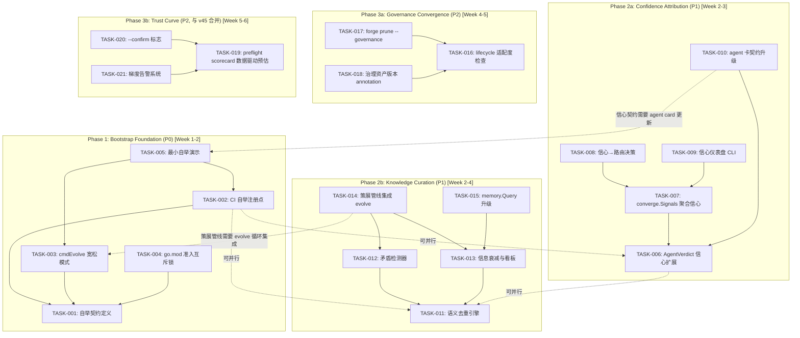
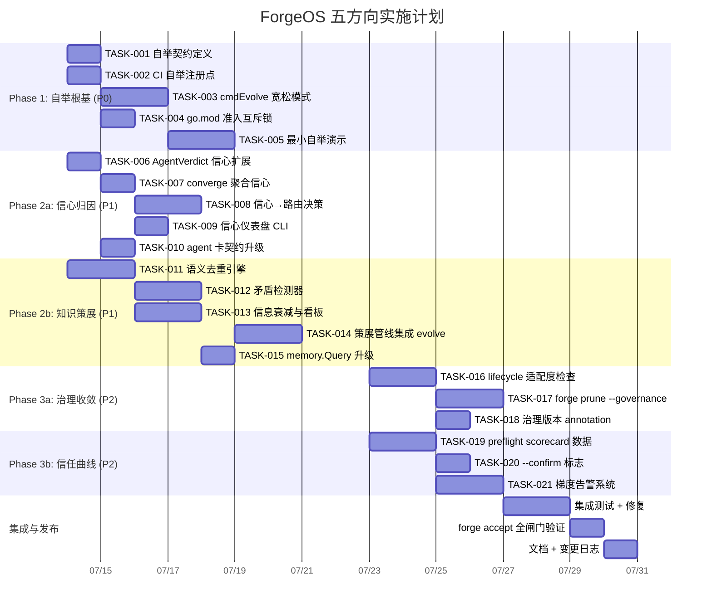

### 可并行执行的任务组

| 并行组 | 包含任务 | 约束 |
|--------|---------|------|
| **Group A** 🔀 | T006（信心扩展）↔ T011（去重引擎） | 零重叠 — 两个独立 package |
| **Group B** 🔀 | T002（CI 注册）↔ T006（信心扩展）↔ T011（去重引擎） | 零重叠 — CI 不依赖认知包 |
| **Group C** 🔀 | T016（lifecycle 检查）↔ T019（preflight 升级） | 独立方向，无共享代码 |
| **顺序组** → | T001→T003→T005（自举链）| 严格顺序依赖 |

---

## 4. 技术风险

### 🔴 高风险

| 风险 | 所属方向 | 描述 | 概率 | 影响 | 缓解策略 |
|------|---------|------|------|------|---------|
| **R1** 自举循环死锁 | ① | `forge evolve --guard-mode=relaxed` 修改自身时，修改后的代码立刻被同一循环的下一次迭代加载，产生"自噬"行为 | 中 | 高 — 可能损坏 forge-core 自身 | 1) `forge evolve` 在宽松模式下 fork 子进程运行修改；2) 修改先写入暂存区，循环结束后统一 apply；3) `--guard-mode=bypass` 要求人工确认 |
| **R2** 语义去重准确率不足 | ③ | Topic 前缀相似度无法区分"端口号 8080→443"和"端口号 443→8080"这类语义反转 | 高 | 中 — 错误折叠导致知识丢失 | 1) 去重默认低阈值（>0.9）保守合并；2) 矛盾检测器作为后续防线捕获反转；3) 所有去重操作可回滚（`Supersedes` 保留被覆盖条目） |
| **R3** 信心分数跨模型不可比 | ② | Opus 的 85 信心与 Haiku 的 85 信心不具可比性 — Opus 更准确自知 | 高 | 中 — 误导路由决策 | 1) 信心归一化：`confidence × model_calibration_factor`；2) 模型校准因子从 scorecard 历史收敛偏差统计得出；3) 初期保守策略：来自低档模型的信心降权 0.8 |
| **R4** Preflight 成本预估偏差过大 | ④ | Scorecard 历史数据稀疏时（如新项目首次运行），均值无法代表真实成本 | 中 | 中 — 用户信任受损 | 1) 置信度区间输出：`(estimated $2.40, ±$1.20 based on 3 runs)`；2) 样本数 < 5 时回退硬编码并标注 `low confidence estimate`；3) `--cost-source=hardcoded` 保留作为保守选项 |

### 🟡 中等风险

| 风险 | 所属方向 | 描述 | 缓解策略 |
|------|---------|------|---------|
| **R5** `forge prune --governance` 误删 | ⑤ | 自动删除治理资产可能移除用户正在引用的文件 | 1) 默认移入 `.agent/archive/` 而非删除；2) `--dry-run` 是默认模式；3) 删除前输出完整清单并等待确认 |
| **R6** 策展管线性能退化 | ③ | 大型 JSONL（>10K 条目）上 dedup+contradiction 全量扫描可能超过 5 秒 | 1) 策展在单独的 goroutine 中异步执行；2) 增量策略：仅扫描最近 N 条条目 + 随机抽样历史条目；3) 可通过 `project.yml` 配置扫描窗口大小 |
| **R7** 信心归因影响现有行为 | ② | 修改 `AgentVerdict` 签名需要更新所有调用方，可能引入回归 | 1) 保留 `ok bool` 作为向后兼容保障；2) `confidence=-1` 同样触发无信号路径；3) `orchestrator_test.go` 中已有 mock 调用逐一更新 |

### 🟢 低风险

| 风险 | 缓解策略 |
|------|---------|
| CI 自举注册点需要 GitHub Actions 特定配置 | `workflow_dispatch` 是标准机制，无需特殊权限 |
| `internal/memory` 包新增 3 个文件 → 包大小膨胀 | 每个文件 ≤ 200 行（远低于 500 线闸门），且 no new external deps |
| Governance annotation 需要 `forge-upgrade.mjs` 改动 | JS 改动是纯 boolean 判断，不改变现有行为 |

---

## 5. 资源评估

### 5.1 团队组成

| 角色 | 所需技能 | 人数 | 专注方向 |
|------|---------|------|---------|
| **Go 核心开发者** | Go 标准库、并发、CLI 设计 | 2 人 | 方向①③（核心运行时改动） |
| **全栈/基础设施** | YAML/CI/CD、Node.js（harness）、Python（shim） | 1 人 | 方向①⑤（CI + 治理） |
| **AI/Agent 集成** | Prompt 工程、Agent 卡设计、LLM 行为分析 | 1 人 | 方向②④（信心 + 信任曲线） |

**最低配置**: 2 人团队（1 名 Go 开发者 + 1 名全栈/Agent 混合）

### 5.2 关键里程碑

| 里程碑 | 时间 | 交付物 | 验证方式 |
|--------|------|--------|---------|
| **M1** 自举原型 | W2 结束 | `forge evolve --guard-mode=relaxed` 可运行 | dry-run 演示 + 端到端走通 |
| **M2** 策展管线可用 | W4 结束 | 去重+矛盾+衰减全链集成 | `forge accept` 包含策展检查 |
| **M3** 信心路由就绪 | W4 结束 | `forge route --min-confidence` 生效 | 测试坐实路由决策受信心影响 |
| **M4** 治理修剪 + 信任曲线 | W6 结束 | `forge prune --governance` + `--confirm` | 全闸门 ACCEPTED |

### 5.3 阻塞点 (Blockers)

| # | 阻塞点 | 影响 | 解决策略 |
|---|--------|------|---------|
| B1 | 自举循环的"自噬"问题（R1）无成熟先例 | 阻塞方向① | 1) fork 子进程隔离方案 POC；2) 参考 Go 的 `go generate` 自修改模式；3) 最小 MVP 先绕过（仅改 harness/ 不改 forge-core/） |
| B2 | 语义去重需要"理解"条目语义 — Go 标准库无 NLP 能力 | 阻塞方向③ | 1) 基于字符串相似度（Levenshtein/Jaccard）的纯工程方案；2) 话题 Topic 层级做前缀树聚合（无需 NLP）；3) `Supersedes` 机制作为人工纠错入口 |
| B3 | Scorecard 历史数据在 forge-core 中无持久化写路径（只有读） | 阻塞方向④ | 1) TASK-019 优先实现 scorecard 写路径（`forge run` 结束时写入）；2) 初期使用内存中 mock 数据测试 |

---

## 6. 质量保证

### 6.1 单元测试覆盖要求

| 方向 | 文件 | 要求覆盖率 | 关键测试场景 |
|------|------|---------|-------------|
| ① | `internal/bootstrap/` | ≥ 90% | 三种 guard mode 行为差异、go.mod 检测、CI 桩 |
| ② | `internal/orchestrator/orchestrator.go` | 边界线不影响整体 | AgentVerdict 信心扩展向后兼容、AggregateConfidence 三策略、置信度 0/50/100 边界 |
| ② | `internal/routing/scorecard.go` | 增量 ≥ 95% | ConfidenceWeight 平局打破、`--min-confidence` 过滤 |
| ③ | `internal/memory/dedup.go` | ≥ 95% | 精确重复、前缀重复、非重复、空输入、threshold 边界值 0.0/0.8/1.0 |
| ③ | `internal/memory/contradiction.go` | ≥ 90% | 真矛盾、假阳性（同向决策）、空输入、大规模 |
| ③ | `internal/memory/decay.go` | ≥ 95% | half-life 计算、Confidence 衰减曲线、看板分类 |
| ④ | `forge-core/cmd/forge/preflight.go` | 增量 ≥ 85% | 成本预估来源切换、scorecard 空/满、回退逻辑 |
| ⑤ | `internal/doctor/governance.go` | 增量 ≥ 90% | lifecycle=idea 无 security-engineer、lifecycle=production 必须 security-engineer |

**关键原则**: 所有测试使用 faketime 而非 `time.Now()`，保持确定性。延续项目已有的 zero-fake-file-on-disk 模式（纯 Go 字节切片模拟文件 IO）。

### 6.2 集成测试策略

| 测试类型 | 覆盖范围 | 执行时机 | 通过条件 |
|---------|---------|---------|---------|
| **端到端自举演示** | `examples/self-bootstrap/` | 每次 PR merge 前 | `forge evolve self-bootstrap --guard-mode=relaxed --executor=dry` exit 0 |
| **策展管线端到端** | 构造含重复+矛盾的 JSONL → `Load` → `Deduplicate` → `DetectContradictions` → `DecayWeights` | 每次 `internal/memory/` 变更 | 输出条目数 ≤ 输入且矛盾报告正确 |
| **信心路由集成** | `forge route` with AgentVerdict confidence | 每次 `internal/routing/` 变更 | 置信度正确影响 tier 选择 |
| **治理 prune 安全** | 创建含不需要资产的 shadow 项目 → `forge prune --governance --dry-run` → 验证未删除 | 每次 `cmd/prune.go` 变更 | `--dry-run` 零 IO 变更；`--apply` 备份至 archive |
| **`forge accept` 聚合闸门** | 所有方向修改通过完整 Stop 闸门 | 每次 PR merge 前 | 全 8 检查 PASS + test 全绿 |

### 6.3 代码审查要点

| 审查焦点 | 对应方向 | 具体检查项 |
|---------|---------|----------|
| **安全模型** | ① | `--guard-mode` 不接受默认宽松；宽松模式下的 harness 降级是否可追溯（log/audit trail）；自举循环的 fork 隔离 |
| **向后兼容** | ②④ | `AgentVerdict` 新签名的 `ok=false` + `confidence=-1` 是否触发原有无信号路径；`--confirm` 未传入时不改变现有行为；`cost-source` 默认值是 `hardcoded` |
| ** honesty 原则** | ③ | 去重不静默丢弃被覆盖条目（`Supersedes` 保留）；矛盾检测只报告不自动解决；低置信条目前缀 `[unverified]` |
| **零依赖红线** | ①③④⑤ | 所有新增 Go 文件不使用 `go.mod` 之外的依赖；语义去重不引入外部 NLP 库（纯字符串算法） |
| **函数长度 ≤ 50 行** | 全部 | 每个新增函数必须硬性遵守 arch-check 执法。方向③的策展管线每个 stage ≤ 50 行，通过组合而非继承实现 |

### 6.4 性能测试需求

| 场景 | 测试指标 | 阈值 | 测试工具 |
|------|---------|------|---------|
| JSONL 10K 条目的全量策展 | 执行时间 | < 5 秒（异步） | Go benchmark + faketime |
| Scorecard 历史读取 + 成本预估 | 响应时间 | < 500ms | `go test -bench` |
| 自举 guard mode 切换开销 | 额外延迟 | < 100ms | `forge evolve` 干跑 |
| 治理 asset archive 操作（大项目 100+ 文件） | 执行时间 | < 2 秒 | `forge prune --dry-run` 计时 |

---

## 7. 实施计划

### 甘特图时间线



### 分阶段详细计划

#### 阶段 1: 自举根基 + 基础设施（Week 1-2，7月14日—7月25日）

**目标**: 打开自举通路，搭建策展和信心的基础设施

| 日 | 活动 | 产出 |
|----|------|------|
| Day 1-2 | 两人并行：Go 开发者做 T001+T003（自举契约 + 宽松模式）；全栈做 T002（CI 注册） | `internal/bootstrap/contract.go` + CI 流水线扩展 |
| Day 3-4 | Go 开发者做 T004（go.mod 互斥锁）+ T011（去重引擎原型） | 零依赖守护 + 语义去重核心算法 |
| Day 5-6 | 全栈做 T006（AgentVerdict 扩展）；Go 开发者做 T012（矛盾检测器） | 两个 package 独立通过测试 |
| Day 7-8 | T005（自举演示）+ T013（衰减看板）并行 | 端到端自举 demo 可跑 |
| Day 9 (buffer) | 闸门 + 修复 | `forge accept` 全绿 |

**交付物**:
- `forge evolve --guard-mode=relaxed` 在 dry-run 下可通
- `internal/memory/dedup.go` + `contradiction.go` + `decay.go` 全绿
- CI 中自举流水线注册

#### 阶段 2: 核心功能并行实现（Week 3-4，7月28日—8月8日）

**目标**: 方向②信心归因完成 + 方向③策展管线集成

| 日 | 活动 | 产出 |
|----|------|------|
| Day 10-11 | T007（converge 聚合）+ T014（策展管线集成到 loop） | converge.Signals 含 AggregateConfidence；loop 迭代后执行策展 |
| Day 12-13 | T008（信心→路由）+ T015（memory.Query 升级） | `forge route` 受信心影响；Query 支持策略参数 |
| Day 14-15 | T009（信心仪表盘 CLI）+ T010（agent 卡契约） | `forge confidence` 可用；agent 卡更新 |
| Day 16 (buffer) | 方向②+③ 集成测试 | 全链路端到端通过 |

**交付物**:
- `forge route --min-confidence 0.8` 正常工作
- `forge confidence` 输出 per-agent 信心时间线
- 知识策展管线在 evolve 循环中自动运行

#### 阶段 3: 治理收敛 + 信任曲线（Week 5-6，8月11日—8月22日）

**目标**: 方向⑤④交付，全方向集成

| 日 | 活动 | 产出 |
|----|------|------|
| Day 17-19 | T016+T019 并行（lifecycle 适配 + preflight 数据驱动） | `forge validate --governance-fit`；成本预估基于 scorecard |
| Day 20-21 | T017（forge prune）+ T020（--confirm） | 资产修剪安全操作；无人值守成本确认 |
| Day 22-23 | T018（版本 annotation）+ T021（梯度告警） | 治理资产版本追踪；budget 告警系统 |
| Day 24-25 | **全方向集成测试 + forge accept** | 全 8 闸门 PASS + test 全绿 |
| Day 26-27 | 文档 + 变更日志 + 跨方向 reviewer | ADR + README + 知识库更新 |

**交付物**:
- `forge prune --governance --dry-run` 安全预览
- `forge run --confirm` 交互式成本确认
- 梯度告警在 `--alert-threshold 0.8` 下输出 WARN
- 完整闸门通过

#### 阶段 4: 发布准备（Week 7，8月25日—8月29日）

| 日 | 活动 | 产出 |
|----|------|------|
| Day 28-29 | 跨架构 reviewer（fresh-context） | 独立 agent 审查全部方向 |
| Day 30 | 性能 Benchmark + 调优 | 策展管线 < 5s @ 10K 条目 |
| Day 31 | 端到端 dogfood：真实用例跑通 | `examples/self-bootstrap` 端到端 |
| Day 32 | 发布 + 更新 ROADMAP | commit + tag + release notes |

---

## 8. 总结与推荐

### 验证文档的五个关键结论

1. **方向②（信心归因）和方向⑤（治理收敛）是验证文档最可靠的方向** — 代码证据零冲突，差异化声明完全成立
2. **方向④（信任曲线）需要修正 preflight 成本预估声明** — 文档说 preflight "不做任何成本预估"是不准确的（它做了，用硬编码值）。这个方向应合并到 v45 方向三运行前成本预估
3. **方向①（自举）和方向③（策展）有真实但诚实的增量** — 概念已被触及但从未系统性展开，验证文档的定位准确
4. **方向③的差异化表需要补充两份文档引用** — 诚实 > 完美，补充引用后四个方向的区分度依然成立
5. **方向⑤是"最纯粹的新颖方向"** — 零已有覆盖，低风险高价值，建议作为 quick win 早期投入

### 我作为 Tech Lead 的推荐顺序

```
Week 1-2:  方向①（自举根基）— 打基础
           ↕ 并行
           方向②（信心归因）— 等待集成
Week 3-4:  方向③（策展管线）— 依赖方向①的 evolve 循环
           方向②（路由集成）— 依赖信心扩展
Week 5-6:  方向⑤（治理收敛）+ 方向④（信任曲线）— 独立快速 wins
Week 7:    集成验证 + 发布
```

**一句话**: 方向①是门 — 必须先开；方向②+③是引擎 — 决定 24h 自治的质量；方向⑤是卫生 — 长期可维护性；方向④是仪表盘 — 让用户信任引擎。

---

*分析日期: 2026-07-12 | 分析者: Tech Lead | 代码基线: a7d55ac*
