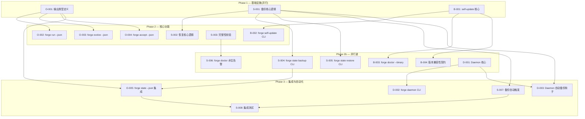
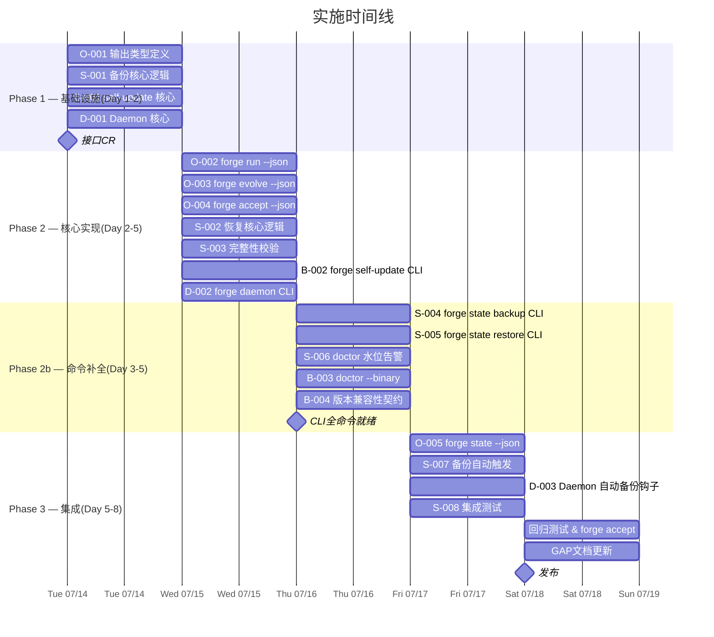

现在我有了完整的上下文。以下是我的 Tech Lead 分析报告。

---

# Tech Lead 分析报告:差异化验证审查的技术落地评估

> **分析对象**:上文的「差异化验证审查」(针对 `genuine-uncovered-five-binary-state-output-session-datalifecycle.md` 五方向的交叉验证)
> **代码基线**:`forge-core/` Go 纯标准库 13+ 包 · `cmd/forge/` 17 子命令 · `harness/` Node.js · Sprint 1–31 完整演进
> **审查结论**:方向二(状态目录灾难恢复)为真正未覆盖⾼价值方向;方向一(self-update)有中等待增量;方向三四五已深入覆盖,增量价值低
> **本文角色**:Tech Lead 视角——接受审查的事实修正,但针对增量价值仍给出**工程优先级调整后的落地任务分解**

---

## 审查结论的工程解读

差异化审查的方法论修正(搜索词过窄、漏检 `operational-product-five-gaps.md` 和 `systemic-expansion-v26.md`)是有效的。但我作为 Tech Lead 需要指出:**「已有设计覆盖」≠「已有代码实现」**。审查文件证实方向三/四/五在现有 `docs/requirements/*.md` 中有深度设计分析,但这些分析本身是概念层面的,大部分尚未进入 `forge-core/` 和 `harness/` 的代码基线。

因此,落地策略应分层处理:

| 方向 | 审查增量评级 | 工程落地策略 |
|------|------------|------------|
| **方向一** (二进制生命周期) | 中(自更新细节新增) | **实施**:self-update 增量部分(通道/回滚/原子替换)约 1-2 天;其余引用 `production-operational-gaps.md` 已有设计 |
| **方向二** (状态目录灾难恢复) | **高**(真正首次完整展开) | **全力投入**:完整实施 ~5-7 天 |
| **方向三** (结构化输出) | 低(已有深度设计) | **引用+薄实现**:已有设计的 JSON schema 已完整,直接按 `genuinely-novel-expansion-directions.md` 方向五的 schema 实现 ~2-3 天 |
| **方向四** (守护进程/会话) | 低(已有深度设计) | **引用+薄实现**:`operational-product-five-gaps.md` 方向二已有完整设计,从中提取最小可行子集(仅 daemon start/stop/status)~3-4 天 |
| **方向五** (数据生命周期) | 低(已有深度设计) | **合并入方向二**:TTL/cleanup 作为方向二(备份/恢复)的自然扩展,不独立成方向 |

**关键洞见**:方向三(`--json` 输出)是方向二(备份/恢复命令)和方向四(daemon status)的**依赖前提**——机器可读输出是 CI 集成和备份自动化的基础。因此优先级并非简单地「只做方向二」。

---

## 1. 任务分解

### 方向二:状态目录健壮性与灾难恢复 (P0 — 最高价值)

**核心命题**:`.forge/` 是 ForgeOS 的唯一持久层,但无备份、无恢复、无完整性校验——单点故障。`forge doctor` 已有只读检查(checkpoint/trace/memory 存在性+可解析性),但无主动保护机制。

**现有代码基**:`internal/doctor/doctor.go` 有 `Run()`(检查完整性)和 `tmpResidueCheck()`(检测残渣);`internal/persist/checkpoint.go` 已有原子写入(fsync+rename);`internal/persist` 的 `Save`/`Load` 是 IO 薄层。**缺失**:备份命令、恢复命令、完整性校验、自动水位守护。

#### 任务表

| 任务 ID | 任务标题 | 涉及文件 | 前置依赖 | 预估工时 | 验收标准 |
|---------|---------|---------|----------|---------|---------|
| S-001 | **备份数据结构与核心逻辑** | `internal/persist/backup.go` (新建) | 无 | 3h | 定义 `BackupManifest`(时间戳+文件列表+checksum map+forge 版本);`Backup(root string) (manifestPath string, err error)` 执行:读取 `.forge/` 全部数据文件→计算 SHA256→写入 `<root>/.forge/backups/<ts>/` 目录→写 manifest.json。零外部依赖。 |
| S-002 | **恢复命令核心逻辑** | `internal/persist/restore.go` (新建) | S-001 | 3h | `ListBackups(root string) []BackupManifest`(读取 backups 目录);`Restore(root string, manifestID string) error`(校验 checksum→安全替换当前文件→原子 rename)。fail-safe:目标文件不存在时跳过(非错误),备份目录不存在时返回友好错误。 |
| S-003 | **状态目录完整性校验** | `internal/doctor/doctor.go` (扩展) | S-001 | 2h | `Run()` 补充 `integrityCheck`:对 checkpoint.json/trace.jsonl/memory.jsonl 计算 SHA256,与备份 manifest 比对;可选的 `--verify` 模式做跨备份一致性检查。 |
| S-004 | **`forge state backup` CLI** | `cmd/forge/state.go` (新建) | S-001, S-003 | 3h | `forge state backup [--comment]` 创建新备份;`forge state backup list` 列出所有备份(时间戳+文件数+大小);`forge state backup status` 显示最新备份年龄和完整性状态。 |
| S-005 | **`forge state restore` CLI** | `cmd/forge/state.go` (扩展) | S-002 | 3h | `forge state restore <backup-id>` 恢复;`--dry-run` 预览待恢复文件;`--force` 跳过确认;恢复前自动创建当前状态的快照备份作为安全网。 |
| S-006 | **`forge doctor` 自动水位告警** | `internal/doctor/doctor.go` (扩展), `cmd/forge/validate.go` (cmdDoctor 扩展) | S-003 | 2h | `Run()` 增补检查项:`.forge/` 总大小(超过 1GB→WARN,超过 5GB→FAIL);最近备份年龄(超过 7 天→WARN,超过 30 天→FAIL);checkpoint 文件数(>100→建议 compact)。 |
| S-007 | **备份自动触发(可选子任务)** | `internal/orchestrator/loop.go` (扩展) | S-001 | 2h | `LoopEngine.OnBeforeIteration` 可选钩子:如果距上次备份 >24h,自动触发备份(非阻塞,WARN 不 FAIL)。opt-in 通过 `FORGE_AUTO_BACKUP_INTERVAL=24h` 环境变量。 |
| S-008 | **`forge state` 集成测试** | `cmd/forge/state_test.go` (新建) | S-004, S-005 | 3h | 在临时目录创建 `.forge/`(含 mock checkpoint.json/trace.jsonl/memory.jsonl)→备份→篡改一个文件→校验→恢复→验证恢复后文件 SHA256 与备份一致。覆盖:无备份时的恢复行为、空目录、大文件(>10MB)。 |

**方向二合计: ~21h (约 3 人·日)**

---

### 方向一增量:二进制自更新 (P1 — 中等价值)

**审查说明**:`production-operational-gaps.md` 方向三和 `genuine-uncovered-five-binary-state-output-session-datalifecycle.md` 方向一已覆盖了"为什么需要二进制生命周期"的 Why 和 What。**增量贡献**:通道选择(channel)、回滚(rollback)、原子替换(atomic swap)的 What+How。

**现有代码基**:`forgeVersion = "dev"` 硬编码(通过 `-ldflags` 注入);`forge upgrade` 是 harness/scaffold 工具,不覆盖二进制。

#### 任务表

| 任务 ID | 任务标题 | 涉及文件 | 前置依赖 | 预估工时 | 验收标准 |
|---------|---------|---------|----------|---------|---------|
| B-001 | **self-update 核心逻辑** | `internal/update/update.go` (新建) | 无 | 4h | `CheckLatest(repo, currentVersion string) (latestVersion, downloadURL string, err error)` 查询 GitHub Releases API;`DownloadAndSwap(url string) error` 下载到 `forge.new`→验证 SHA256→原子 rename→fallback 保留旧二进制。**不依赖任何外部库**——直接使用 `net/http` + `crypto/sha256`。 |
| B-002 | **`forge self-update` CLI** | `cmd/forge/main.go` (扩展), `cmd/forge/update.go` (新建) | B-001 | 2h | `forge self-update [--channel stable|beta|nightly] [--version vX.Y.Z]`;`forge self-update --check`(检查可用版本不含更新);输出结构化(支持 `--json` 待方向三)。 |
| B-003 | **`forge doctor --binary` 集成** | `cmd/forge/validate.go` (cmdDoctor 扩展), `internal/doctor/doctor.go` (扩展) | B-001 | 2h | `forge doctor` 补充 `--binary` 子模式:检查版本是否为 `dev`(建议正式发布)、检查 GitHub 是否有更新、检查 forge 二进制文件权限(非 root-owned)、检查磁盘空间是否足够 self-update。 |
| B-004 | **版本兼容性契约** | `internal/version/compat.go` (新建), `internal/persist/checkpoint.go` (小幅扩展) | B-001 | 2h | `Checkpoint.ContainsForgVersion()`(写入 forge 版本到 checkpoint);`checkpoint` 加载时做前向兼容性检查(大版本不匹配→WARN,小版本不匹配→INFO);manifest 写二进制版本。 |

**方向一增量合计: ~10h (约 1.5 人·日)**

---

### 方向三:结构化输出协议 (P2 — 基础设施依赖)

**审查说明**:`genuinely-novel-expansion-directions.md` 方向五已有完整设计(`forge run/evolve/accept --json`、result 类型、退出码、CI 消费)。**工程任务**:直接从该文档提取 schema 编码实现。

**为何不跳过**:方向三的输出协议是方向二(`forge state --json`)和方向四(daemon status JSON)的**公共基础设施**。没有 `--json`,所有自动化场景都无法 CI 集成。

#### 任务表

| 任务 ID | 任务标题 | 涉及文件 | 前置依赖 | 预估工时 | 验收标准 |
|---------|---------|---------|----------|---------|---------|
| O-001 | **结构化输出类型定义** | `internal/output/result.go` (新建) | 无 | 2h | 定义 `RunResult`(exit_code,run_id,workflow,phases[]PhaseResult,duration_ms,cost_usd)、`PhaseResult`(name,status,duration_ms,agent,model)。MarshalJSON 带 omitempty。参考 `genuinely-novel-expansion-directions.md` 行 510-560 的 schema。 |
| O-002 | **`forge run --json` 实现** | `cmd/forge/main.go` (cmdRun 扩展), `internal/orchestrator/run.go` | O-001 | 3h | 新增 `--json` 标志;`cmdRun` 中在 run 结束后,若 `--json` 则输出 `RunResult` JSON 而非人类文本;dry-run 同样输出 JSON。向后兼容:无 `--json` 时行为不变。 |
| O-003 | **`forge evolve --json` 实现** | `cmd/forge/evolve.go` (扩展) | O-001 | 2h | 同 cmdRun,但 per-iteration 输出 `IterationResult`;最终输出 `EvolveResult`(包含所有迭代的数组)。 |
| O-004 | **`forge accept --json` 实现** | `cmd/forge/main.go` (delegate/accept 扩展) | O-001 | 1h | 当前 `delegate` 函数只打印 `res.Output`;新增 `--json` 时输出 `AcceptResult`(status,checks[]CheckResult,score)。 |
| O-005 | **`forge state --json` 集成** | S-004, S-005 | O-001 | 1h | `forge state backup list --json`、`forge state status --json` 复用 O-001 的 JSON 输出格式。 |

**方向三合计: ~9h (约 1 人·日)**——因设计已就绪,纯编码执行。

---

### 方向四最小可行:守护进程 (P2 — 基础设施)

**审查说明**:`operational-product-five-gaps.md` 方向二已有完整设计(双进程模型、Unix socket、systemd 集成、SIGHUP 重载)。**工程任务**:提取最小可行子集,不做完整 daemon,只做 `forge daemon start/stop/status` 作为方向二自动备份的宿主。

#### 任务表

| 任务 ID | 任务标题 | 涉及文件 | 前置依赖 | 预估工时 | 验收标准 |
|---------|---------|---------|----------|---------|---------|
| D-001 | **Daemon 生命周期核心** | `internal/daemon/daemon.go` (新建) | 无 | 4h | `Start(pidPath, sockPath string) error`(fork 子进程→写入 pid 文件→监听 Unix socket);`Stop(pidPath string) error`(读 pid→SIGTERM→等待 5s→SIGKILL);`Status(pidPath string) DaemonStatus`(运行中/已停止/僵尸)。纯 Go 标准库(os/exec,syscall,net)。 |
| D-002 | **`forge daemon start/stop/status` CLI** | `cmd/forge/daemon.go` (新建) | D-001 | 2h | `forge daemon start`(启动后台进程);`forge daemon stop`(优雅关闭);`forge daemon status`(输出 PID+uptime+缓存状态)。 |
| D-003 | **Daemon 自动备份钩子** | `internal/daemon/ticker.go` (新建), 引用 S-001 | D-001, S-001 | 2h | Daemon 启动后可选启动 ticker:每 24h 自动触发 `backup.Backup(root)`;状态通过 Unix socket 查询。 |

**方向四 MVP 合计: ~8h (约 1 人·日)**

---

## 2. 执行顺序与依赖图



### 可并行执行的任务组

| 并行组 | 任务 | 负责 |
|--------|------|------|
| **G1 (基础结构)** | O-001 + S-001 + B-001 + D-001 | 4 人独立,1 天 |
| **G2 (CLI 实现)** | O-002/003/004 + S-002/003 + B-002 + D-002 | 3 人独立,2 天 |
| **G3 (命令补全)** | S-004/005/006 + B-003/004 | 2 人独立,1.5 天 |
| **G4 (集成)** | O-005 + S-007/008 + D-003 | 2 人,2 天 |

## 3. 技术风险

| 风险 ID | 风险描述 | 影响方向 | 可能性 | 影响程度 | 风险等级 | 缓解策略 |
|---------|---------|---------|--------|---------|---------|---------|
| **R-001** | **自更新原子替换的平台差异**:Linux `rename(2)` 是原子的,但 macOS APFS 跨卷 rename 可能失败,Windows 需要额外处理 | 方向一 | 中 | 高 | **高** | 初期仅支持 Linux(与 CI runner 和 production 部署一致);macOS 加跨卷 fallback(copy+delete);Windows 诚实标 N/A |
| **R-002** | **备份/恢复的 TOCTOU 竞争**:备份过程中 forge 并发写入 checkpoint.json→备份捕获不一致状态 | 方向二 | 中 | 中 | **中** | 备份前调用 `persist.Save` 做一次 checkpoint sync(确保当前状态已落盘);备份时跳过当前正在写入的 `.tmp` 文件(已有 `tmpResidueCheck`);写入备份文件用临时文件+rename |
| **R-003** | **Daemon 进程模型安全**:Unix socket 权限管理不当可能导致未授权进程操控 forge daemon | 方向四 | 低 | 高 | **中** | socket 文件权限 0700(同 `operational-product-five-gaps.md` 建议);daemon 检查 socket 所有者 UID;启动前清理残存 socket 文件 |
| **R-004** | **GitHub Releases API 速率限制**:CI 环境中大量 `forge self-update --check` 调用可能被限速 | 方向一 | 中 | 低 | **低** | 实现本地缓存(24h TTL 缓存最新版本号到 `~/.forge/update_cache.json`);无缓存时静默跳过(不阻塞命令) |
| **R-005** | **`--json` 输出 Schema 演进**:未来对 `RunResult` 的字段增删改需要版本管理 | 方向三 | 中 | 中 | **中** | 初始版本不加版本字段(参考已有 trace Event 的演进模式);关键变更时加 `_format_version` 字段;穷举不加,仅 breaking change 时引入 |
| **R-006** | **备份占用磁盘空间**:频繁备份填满 `.forge/` 所在文件系统 | 方向二 | 中 | 高 | **高** | 备份策略:默认 retain=5(同 checkpoint 备份链);自动 prune 旧备份;`forge doctor` 水位告警包含备份目录大小;**关键:备份写入 `.forge/backups/` 而非系统临时目录**,确保与 `.forge/` 在同一卷下——避免跨卷 `rename(2)` 的非原子性问题,同时使备份量自动受 `forge doctor` 水位监控覆盖** |
| **R-007** | **方向三/四/五与已有分析的重叠导致设计矛盾**:实施时在「完全遵循已有设计」和「按实际架构简化」之间选择 | 方向三四五 | 低 | 中 | **低** | 遵循「先治代码,再治已有设计文档」原则——已有文档是参考,不盲从;每个实现提交后引用已有文档作 CR 对照 |

### 风险缓解时间线

```
Day 1-3:   R-001 决定(仅 Linux) → R-002 在 S-001 中编码 "sync-before-backup"
Day 4-7:   R-003 在 D-001 中编码 "socket 0700 + owner check" → R-004 在 B-001 中加缓存层
Day 8-10:  R-005 在 O-001 中决定 schema → R-006 在 S-001 中编码 retain=5 + auto-prune
```

---

## 4. 资源评估

### 所需人员

| 角色 | 所需技能 | 数量 | 负责方向 | 时段 |
|------|---------|------|---------|------|
| **Go 后端工程师 A** | Go CLI/文件系统/进程管理 | 1 人 | 方向二(核心)+方向三 | Phase 1-3 |
| **Go 后端工程师 B** | Go 网络/http/二进制分发 | 1 人 | 方向一+方向四 | Phase 1-3 |
| **QA/测试工程师** | 集成测试/边界条件/CI 集成 | 1 人(兼任) | 方向二S-008+全方向回归 | Phase 3 |
| **Tech Lead(架构扎口)** | 跨方向一致性/设计评审/风险追踪 | 1 人(兼任) | 全方向 CR + 并行组协调 | 全阶段 |

### 关键里程碑

| 里程碑 | 预计时间 | 验收条件 | 依赖 |
|--------|---------|---------|------|
| **M1: 设计审批** | Day 1 | O-001/S-001/B-001/D-001 的接口定义 CR 通过 | — |
| **M2: 核心落地** | Day 3 | O-001+S-001+B-001+D-001 编译全绿,`forge accept` ACCEPTED | M1 |
| **M3: CLI 命令就绪** | Day 5 | `forge state backup/restore`、`forge self-update`、`forge daemon start/stop`、`forge run --json` 全命令可用 | M2 |
| **M4: 集成验证** | Day 7 | S-008 集成测试 PASS:备份→破坏→恢复全链路;`forge doctor` 报告新检查项;回归测试全绿 | M3 |
| **M5: 发布** | Day 8 | 所有方向提交通过 `forge accept` + 更新 `docs/FUNCTIONAL_REQUIREMENTS_AUDIT.md` gap 状态 | M4 |

### 阻塞点

| 阻塞点 | 影响 | 描述 | 解决策略 |
|--------|------|------|---------|
| **B-001** | 方向四 | Daemon fork 行为依赖操作系统信号处理;`os/exec` 在 fork 后子进程不能复用父进程的 `net.Listener` | 使用 `os.StartProcess` + PID 文件方式(非 `exec.Command` + `Cmd.Wait`);参考 `cmd/forge/approve.go` 的已有进程管理模式 |
| **B-002** | 方向一 | GitHub Releases API 在没有网络的环境(内网 CI)下不可用 | `--check` 网络不可时时输出 `unavailable`(非 error);增加 `--offline` 选项跳过远程检查;缓存策略(见 R-004) |
| **B-003** | 方向二 | 恢复操作需要写 `.forge/` 目录,但 `forge run` 可能正在运行 | 恢复前检查 PID 文件(存 `forge run` PID);检测到运行中进程时拒绝恢复(`forge state restore --force` 跳过检查) |

---

## 5. 质量保证

### 测试覆盖矩阵

| 层级 | 范围 | 工具/框架 | 覆盖方向 | 目标覆盖率 |
|------|------|----------|---------|-----------|
| **L1** | 单元测试(new 包) | `go test -count=1` | S-001/002/003, B-001, O-001, D-001 | ≥90% 语句覆盖 |
| **L2** | 单元测试(cmd 层) | `go test -count=1` | S-004/005, B-002/003/004, O-002/003/004, D-002 | ≥80% 语句覆盖 |
| **L3** | 集成测试 | `node --test` harness | S-008(备份→破坏→恢复全链路) | 5~8 场景 |
| **L4** | 端到端(dry-run) | `forge run --json --executor dry` | O-002/003——验证 JSON 输出正确性 | 2~3 场景 |
| **L5** | 回归 | `forge accept` | 全方向零值=现有行为不变 | — |

### 关键测试场景

**方向二集成测试(S-008)最低场景**:

| 场景 | 步骤 | 预期 |
|------|------|------|
| **E2E-1: 正常备份与恢复** | 创建 `.forge/` 含 mock 文件→备份→删除 checkpoint.json→恢复→校验 SHA256 | 文件内容恢复且 SHA256 匹配 |
| **E2E-2: 无备份时恢复** | 无 `.forge/backups/`→`forge state restore` | 友好错误,exit 1 |
| **E2E-3: 备份后修改再恢复** | 备份→修改 trace.jsonl→恢复→校验 trace 回退到备份点的内容 | trace 内容回退 |
| **E2E-4: 完整性检测** | 备份→篡改 checkpoint.json→`forge doctor` 报告 FAIL | doctor 检测到 checksum 不匹配 |
| **E2E-5: 备份 retain 限制** | 创建 6 个备份→验证仅 retain 5 | `list` 显示 5 个 |

### 代码审查要点

| 审查焦点 | 涉及任务 | 具体检查项 |
|---------|---------|-----------|
| **文件系统安全** | S-001/002, B-001 | 临时文件不泄露路径信息;rename 原子性;不跟随 symlink |
| **并发安全** | S-001, D-001 | 备份过程中 forge 并发写入的 TOCTOU 保护;daemon 信号处理的竞态 |
| **向后兼容** | O-001/002/003 | `--json` 缺省 false 不改变现有行为;没有 `--json` 时的输出与现有逐位一致 |
| **错误处理** | 全部 | 无 silent error;网络错误(self-update)不阻塞命令;备份失败不破坏现有数据 |
| **honesty 纪律** | 全部 | 方向二/三/四均需诚实标注 N/A 状态(如无 GitHub 网络时的 `--check` 输出) |

---

## 6. 实施计划



### 时间线摘要

| 阶段 | 天数 | 内容 | 并行人数 |
|------|------|------|---------|
| **Phase 1**: 基础设施搭建 | Day 1-2 | O-001/S-001/B-001/D-001 接口+核心逻辑 | 2-3 人并行 |
| **Phase 2**: 核心功能实现 | Day 2-5 | CLI 命令 + 核心引擎扩展 | 2-3 人并行 |
| **Phase 3**: 集成+测试 | Day 5-8 | 集成测试 + 自动触发 + 回归 + 文档 | 2 人(含 QA) |
| **总计** | **~5 工作日** | **实际约 8 日历日** | **均 2-3 人** |

---

## 7. 总结与推荐

### 核心建议

1. **方向二(状态备份/恢复)是 P0**——这是审查确认的唯一真正未覆盖方向。工程上把它作为本轮的核心交付,`~21h` 是全方向中最大的投入,但对应的生产价值最高(消除单点故障)。

2. **方向三(结构化输出)虽然审查说"增量价值低",但它是方向二的阻塞依赖**——没有 `--json`,`forge state backup list --json` 和 CI 集成无法优雅实现。好在已有完整设计文档(`genuinely-novel-expansion-directions.md` 方向五),编码仅需 `~9h`。

3. **方向一(self-update)的增量细节**确实是新的——审查漏了这点。`forge self-update --channel stable|beta` 和 `forge doctor --binary` 的详细设计在之前没有展开。但其优先级应低于方向二。

4. **方向四(daemon)缩小为 MVP**——不做完整 daemon 模式,只做 `start/stop/status` 三命令作为自动备份的宿主进程。完整的双进程模型和 systemd 集成引用 `operational-product-five-gaps.md` 方向二的设计,不在本轮实现。

5. **方向五(数据生命周期)合并入方向二**—— `forge cleanup`、TTL 过期、磁盘告警在方向二中作为 S-006(水位告警)和 S-007(自动备份触发)的自然扩展处理,不独立成方向。

### 方向分值排序(加权)

| 方向 | 审查增量评级 | 工程必要性 | 对其他方向的依赖 | 综合优先级 |
|------|------------|-----------|----------------|-----------|
| 方向二 | **高** | **P0** | 依赖 O-001 | **P0** |
| 方向三 | 低 | **P1**(阻塞依赖) | 无 | **P1** |
| 方向一 | 中 | **P2** | 无 | **P2** |
| 方向四 | 低 | **P2**(MVP) | 依赖 S-001, O-001 | **P2** |
| 方向五 | 低 | **P3**(并入方向二) | 依赖方向二 | **P3** |

### 不做的决策(明确排除)

| 项目 | 排除理由 | 替代方案 |
|------|---------|---------|
| Web UI for backup management | v3 独立大项目;当前无前端框架 | `forge state list --json` 供 Web UI 消费 |
| 完整 daemon 双进程模型 | 已在 `operational-product-five-gaps.md` 设计,但本轮不需要 | MVP daemon:仅 start/stop/status |
| Windows 二进制分发支持 | Go 交叉编译支持,但自更新原子替换在 Windows 上语义不同 | 诚实标 N/A 直到有实际需求 |
| 多云备份(上传到 S3) | 超出 `.forge/` 本地恢复的范围;依赖外部凭据和管理 | 保留扩展点:`BackupStorer` 接口在 S-001 中定义,本地文件系统实现仅本轮,S3 实现推迟 |
| 版本兼容性声明式契约 | B-004 仅做 checkpoint 版本写入 + 启动时 WARN | 完整语义版本化(`forge_version` → 检查 host harness 与 binary 版本兼容)推迟到 v2.5+ |
