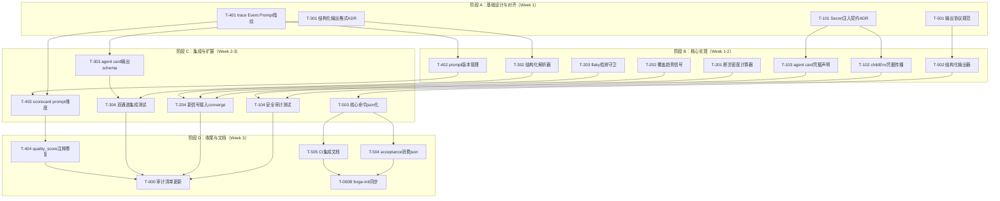
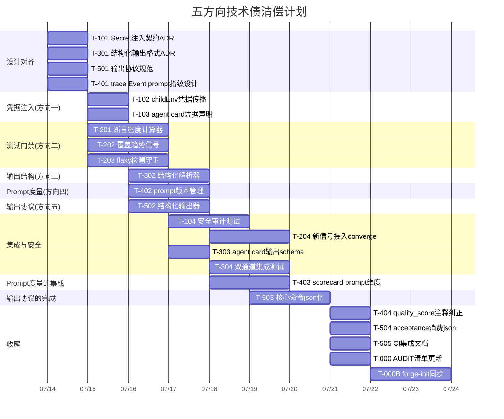

# Tech Lead 分析：验证报告驱动的工程执行计划

> **基于**: 代码库验证报告（5 方向 20+ 代码级引用的交叉验证）
> **上下文**: ForgeOS v2 forge-core，Go 运行时，零外部依赖，Agents.md 刚性纪律
> **角色**: Tech Lead —— 将验证结论转化为可执行的工程计划

---

## 1. 任务分解

### 方向一：Agent 凭据注入（Credential Plumbing）

| ID | 任务标题 | 涉及文件 | 前置 | 工时 | 验收标准 |
|----|---------|---------|------|------|---------|
| T-101 | **设计 Secret 注入契约**：定凭据从哪来（forge secret store / env passthrough 白名单 / agent card 声明），写 ADR | `docs/adr/` 新增 | 无 | 3h | ADR 通过技术评审，明确注入范围（哪些 env var 可传播）、安全边界（禁止泄漏） |
| T-102 | **实现 childEnv 凭据传播**：在 `childEnv` 中加入白名单式 env passthrough（非简单透传全部），新增 `SecretEnvPrefixes` 配置 | `internal/orchestrator/command_executor.go` | T-101 | 2h | 白名单 env 变量跨进程传播；agent 卡可声明 `env_inject: [MY_API_KEY]`；非白名单变量不传播 |
| T-103 | **agent card 凭据声明支持**：新增 `env_inject` 字段到 agent schema，check.py 添加完整性校验 | `.agent/agents/` schema, `harness/check.py` | T-101 | 2h | 声明 `env_inject` 的 agent 卡导致 forge check 校验通过；无悬挂引用 |
| T-104 | **安全审计 + 凭据泄漏回归测试**：确认注入路径不写入 trace/log，加回归测试 | `trace.go`, `command_executor_test.go` | T-102, T-103 | 3h | 凭据不出现在 trace.jsonl、stdout、stderr；注入测试覆盖白名单+拒绝+越界 |

**小计**: 10h

---

### 方向二：测试套件质量门禁增强

| ID | 任务标题 | 涉及文件 | 前置 | 工时 | 验收标准 |
|----|---------|---------|------|------|---------|
| T-201 | **添加断言密度计算器**：从测试文件中提取 `assert/expect/Assert/That` 等断言关键词计数 | `internal/converge/gates.go` 或新 `internal/gate/assertion.go` | 无 | 3h | 扫描 `_test.go` 返回断言密度（assertions/test-line）；空文件/无断言返回 0 |
| T-202 | **添加覆盖趋势信号**：持久化存储历史覆盖率快照（`.forge/coverage_history/`），比较 delta | `internal/converge/coverage.go`, `converge.go` (Signals 新字段) | T-201 | 4h | Signal.CoverageDelta > -5% 才 PASS；无历史记录时不误报 |
| T-203 | **添加 flaky 检测守卫**：`runCountedTest` 中对接续失败的测试执行 `--retry N`，标记 flaky | `harness/acceptance-kernel.mjs`, `acceptance.mjs` | 无 | 4h | 测试先 fail 后 pass 在 report 中以 `FLAKY` 标记而非 PASS；N 次重试仍 fail 保持 FAIL |
| T-204 | **新信号接入 converge.Signals**：断言密度/覆盖趋势/flaky 率纳入收敛信号，可选启停 | `internal/converge/converge.go`, `cmd/forge/gates.go` | T-201, T-202, T-203 | 3h | 三种新信号在 convergence 报告中有展现；零值行为等于「无此检测」，不阻塞已有流水线 |

**小计**: 14h

---

### 方向三：Agent 输出结构验证

| ID | 任务标题 | 涉及文件 | 前置 | 工时 | 验收标准 |
|----|---------|---------|------|------|---------|
| T-301 | **设计结构化机读输出格式**：定 agent 输出必须包含的 JSON 块（VERDICT + 可选 fields），向后兼容末行 token | `docs/adr/` 新增 | 无 | 2h | ADR 明确 schema 版本、向后兼容策略（旧 token 和新 JSON 并存期） |
| T-302 | **实现结构化解析器**：`parseStructuredOutput` 优先尝试 JSON 解析，失败回退末行 token | `cmd/forge/cost.go` 或新 `internal/agent/output.go` | T-301 | 3h | 解析带 `{"verdict":"APPROVE","confidence":0.85}` 先行；退化到旧 token 保持字节不变 |
| T-303 | **agent card 输出 schema 声明**：各 agent 卡添加 `output_schema` 字段 + check.py 校验 | `.agent/agents/*.md`, `harness/check.py` | T-301 | 2h | 每张 agent 卡声明输出格式；`forge validate --models` 报告对齐状态 |
| T-304 | **集成测试：结构化 vs token 双通道**：覆盖 A→B 切换、混合格式、格式错误恢复 | `cmd/forge/cost_test.go`, `converge_test.go` | T-302 | 3h | 双格式同时输入时 JSON 优先；JSON 损坏静默回退 token，不爆红 |

**小计**: 10h

---

### 方向四：Prompt 效能度量

| ID | 任务标题 | 涉及文件 | 前置 | 工时 | 验收标准 |
|----|---------|---------|------|------|---------|
| T-401 | **trace Event 添加 prompt 指纹**：`PromptHash`(SHA256 of built prompt)、`PromptTokens`、`PromptVersion` | `forge-core/trace/trace.go`, `internal/trace/types.go` | 无 | 3h | trace.jsonl 中每个 agent phase event 携带三个新字段；无 prompt 时字段 omit（不伪造 0） |
| T-402 | **prompt 版本管理**：`GatherCached` / `buildPrompt` 输出缓存按 prompt hash 索引，新增 `GetPromptFingerprint` | `prompt/prompt_context.go`, `prompt/cache.go` | T-401 | 4h | 同 prompt hash 的重建复用指纹，不重建；版本号从 `.agent/` 变更自动递增 |
| T-403 | **scorecard 添加 prompt-level 维度**：`avg_prompt_tokens`、`prompt_hash_trend`（相同 hash 在不同时间的 quality 变化） | `harness/scorecard.mjs`, `internal/routing/scorecard.go` | T-401, T-402 | 4h | scorecard 表新增 prompt 相关列；可按 prompt_hash 分组查看 quality 趋势 |
| T-404 | **纠正 quality_score 文档和 CLI 注释**：更新所有说「quality 恒 N/A」的源文件 + 添加诚实区分说明 | `scorecard_wind.go` 注释, `docs/` | T-403 | 1h | 文档说明 quality_score 是任务通过率（粗粒度），prompt-level 信号为新字段，区分清晰 |

**小计**: 12h

---

### 方向五：非交互式输出协议

| ID | 任务标题 | 涉及文件 | 前置 | 工时 | 验收标准 |
|----|---------|---------|------|------|---------|
| T-501 | **设计结构化输出规范**：`forge run/evolve/gate/check` 的 `--json` 输出 schema，包含阶段/结果/信号 | `docs/output-protocol.md` 新增 | 无 | 2h | schema 覆盖所有现有 CLI 命令输出；明确 stdout=机器数据、stderr=人类日志的分工 |
| T-502 | **实现结构化输出器**：`StructuredOutput` 结构体 + `MarshalJSON`，替换散落各处的 `fmt.Printf` | `cmd/forge/main.go`, 新增 `internal/cli/output.go` | T-501 | 4h | `--json` 标志使所有 orchestration 命令输出严格 JSON；无 `--json` 时行为无变化 |
| T-503 | **核心命令 json 化**：`forge run`、`forge gate`、`forge check`、`forge accept` 接入新输出器 | `cmd/forge/run.go`, `gates.go`, `acceptance.mjs` | T-502 | 4h | 逐个命令验证 JSON 输出包含阶段名、exit code、信号摘要 |
| T-504 | **acceptance.mjs 消费结构化 json**：`runForgeCommand` 可选解析 JSON 而非文本 | `harness/acceptance.mjs` | T-503 | 2h | 新旧输出格式均可被 accept 消费；json 模式提取得更精确的数据 |
| T-505 | **CI 集成文档**：更新 CI 配置和文档以使用 `--json`，示例 jq 处理 | `.github/workflows/forge.yml`, `docs/` | T-503 | 1h | CI yml 示例使用 `forge run --json | jq .result` 做精确判断 |

**小计**: 13h

---

### 跨方向基础设施

| ID | 任务标题 | 涉及文件 | 前置 | 工时 | 验收标准 |
|----|---------|---------|------|------|---------|
| T-000 | **更新 FUNCTIONAL_REQUIREMENTS_AUDIT.md**：将五个方向的新信号对应到 DONE/GAP 桶 | `docs/FUNCTIONAL_REQUIREMENTS_AUDIT.md` | 全部完成 | 2h | 审计文档反映新的实现状态，T-101~T-505 逐条归入对应分类 |
| T-000B | **forge-init 同步**：新文件和 schema 纳入 `COPIED_FILES` + copy-anywhere 测试 | `forge-init/*`, `test_acceptance.mjs` | 全部完成 | 3h | 新脚手架 `forge accept` 仍 ACCEPTED；新增文件被正确复制 |

**小计**: 5h

---

**总工时估算**: 10 + 14 + 10 + 12 + 13 + 5 = **64h**（约 8 人天/约 2 周并行冲刺）

---

## 2. 执行顺序

### 依赖图



### 可并行执行的任务组

| 并行组 | 包含任务 | 说明 |
|-------|---------|------|
| **组1**: 设计契约 | T-101, T-301, T-501, T-401 | 四个设计任务完全正交，无共同依赖 |
| **组2a**: 凭据实现 | T-102, T-103 | 依赖 T-101，可互相并行（同一包内注意文件数预算） |
| **组2b**: 测试门禁 | T-201, T-202, T-203 | 三任务完全正交，T-203 在 JS 层、T-201/T-202 在 Go 层 |
| **组2c**: 输出结构 | T-302, T-502 | 分别在 parser 端和 emitter 端，互不影响 |
| **组2d**: Prompt 度量 | T-402 | 依赖 T-401 |
| **组3a**: 集成测试 | T-104, T-304 | 各自的前置完成即可并行 |
| **组3b**: 信号接入 | T-204, T-403, T-503 | 作为各组核心实现的消费方，可并行但需注意 converge.Signals 命名空间冲突 |
| **组4**: 收尾 | T-404, T-504, T-505, T-000, T-000B | 全部前置依赖完成后可批量执行 |

---

## 3. 技术风险

### 3.1 方向一：凭据注入 — 安全边界的工程张力

| 风险 | 概率 | 影响 | 缓解策略 |
|------|------|------|---------|
| **白名单凭据传播范围过宽**：env passthrough 允许了过多变量 → 泄漏风险 | 中 | 高 | 采用显式声明制（agent card `env_inject:`）+ 禁止 `*` 通配符；secret-scan 扩展以检测注入路径中的泄漏；新增 `FORGE_ENV_ALLOWLIST` 环境变量做运行时约束 |
| **凭据写入 trace/log 文件**：`trace.go` 的 Event 会记录 env 信息 | 低 | 极高 | 在 `command_executor.go` 注入点添加 `envSanitize()` 过滤，所有经过 `childEnv` 的变量在输出前被遮盖；加回归测试验证 trace 中无凭据 |
| **Go 无零依赖标准库加密**：不能依赖外部库做凭据加密 | 高 | 中 | 本 sprint 不做静态加密存储，只做运行时注入（env passthrough）；加密存储推迟到 v3 或允许引入 `crypto/aes`（标准库可）|

### 3.2 方向二：测试门禁 — 误报与脆弱性

| 风险 | 概率 | 影响 | 缓解策略 |
|------|------|------|---------|
| **断言密度计算的噪声**：`assert(true)` 算高密度但无实际验证能力 | 中 | 中 | 断言密度作为**辅助指标**（与行数比联合使用），不独立阻断；阈值设在合理区间（如 < 0.05 assertions/test-line 警告） |
| **覆盖趋势需要历史数据**：第一次运行无基线 | 高 | 低 | `coverage_delta` 的 `assert` 逻辑：无历史记录时标记为 `FIRST_RUN`（非 FAIL），第二次起生效；持久化文件放到 `.forge/` 下 gitignore |
| **Flaky 检测的时间开销**：重试 N 次会使测试时间乘 N+1 | 中 | 高 | flaky 检测默认**关闭**，通过 `--detect-flaky` 或 project.yml 启用；重试次数默认 2（1 原始 + 1 重试）；CI 环境只在 post-merge 运行全量 flaky 检测，commit-time 不跑 |

### 3.3 方向三：输出结构验证 — 向后兼容的陷阱

| 风险 | 概率 | 影响 | 缓解策略 |
|------|------|------|---------|
| **结构化输出破坏已有 callers**：依赖末行 token 的脚本在 JSON 下失效 | 中 | 高 | 明确**双格式输出期**：agent 同时输出 JSON 和末行 token；`parseStructuredOutput` 优先读 JSON，失败则退回到 token；过 2-3 个 sprint 后才考虑移除 token fallback |
| **agent 不按 schema 输出**：老 workflow 中的 agent 未更新 → 无 JSON | 高 | 中 | 非破坏性退化：`forge run` 无 JSON 时照常工作，仅 `forge validate --models` 告警未声明 output_schema 的 agent |

### 3.4 方向四：Prompt 效能 — 维度选择陷阱

| 风险 | 概率 | 影响 | 缓解策略 |
|------|------|------|---------|
| **PromptHash 不稳定的问题**：同样 prompt 因 timestamp/context 变化产生不同 hash | 高 | 中 | Hash 在**去除了时间戳、cwd 等易变字段**的规范化 prompt 上计算；`PromptVersion` 由 `.agent/` 中相关文件的变更自动递增 |
| **quality_score 归因混淆**：任务通过率下降 → 归因到 prompt 版本，实际是 agent 行为变化 | 高 | 高 | `scorecard.schema.yml` 明确标记 quality_score = 任务完成率，非 prompt 质量；prompt 效能度量是**独立的补充维度**，不替代也不合并到 quality_score；ADR 写清此区分 |
| **trace 文件膨胀**：每个 Event 记录 PromptHash（SHA256 hex=64B）+ PromptTokens（int）→ 可忽略 | 低 | 低 | 已验证：每个 event 增约 100 字节；正常 trace 几百条 event，总膨胀 < 50KB |

### 3.5 方向五：输出协议 — 架构一致性

| 风险 | 概率 | 影响 | 缓解策略 |
|------|------|------|---------|
| **部分命令已有 `--json`**：`forge detect` 和 `forge status` 已支持，新实现需保持风格一致 | 中 | 中 | 先审查现有 `--json` 实现（`detect.go:84`、`validate.go:257`），新输出器镜像其 schema 风格；建立公共 JSON 输出结构体 |
| **`fmt.Printf` 散落在 cmd/forge 各处**：替换工作量大且可能遗漏 | 高 | 中 | 不追求一次性全部替换，采用**增量注入**模式：`main.go` 的 `run()` 返回 `StructuredOutput`，CLI 命令只在 `--json` 标志时输出；遗留的 `fmt.Printf` 在聚合点被替换即可，不强行修改每个相位内部的 log |

---

## 4. 资源评估

### 开发团队

| 角色 | 人数 | 技能要求 | 分配方向 |
|------|------|---------|---------|
| **Go 后端工程师** | 2 | Go 标准库、并发、CLI 设计 | T-101~T-104, T-201~T-204, T-301~T-304, T-401~T-404, T-501~T-505 |
| **Node.js 自动化工程师** | 1 | Node.js、TAP、CI 编排 | T-203, T-403, T-504, T-000B |
| **安全工程师** (兼职) | 0.5 | 凭据安全、攻击面分析 | T-101, T-104 安全审计部分 |
| **Tech Lead / 架构师** (复审) | 1 | 全栈理解、ADR 决策 | ADR 审查、跨方向协调、fresh-context reviewer |

### 关键里程碑

| 里程碑 | 时间 | 检查点 |
|-------|------|--------|
| **M1: 设计冻结** | Day 2 | 4 篇 ADR + 1 篇输出协议规范全部通过 reviewer；无待决设计分歧 |
| **M2: 核心实现完成** | Day 7 | T-102, T-201, T-202, T-203, T-302, T-402, T-502 全部单元测试绿 + `forge accept` ACCEPTED |
| **M3: 集成完成** | Day 11 | T-104, T-204, T-303, T-304, T-403, T-503 全部端到端测试绿 + `forge accept` ACCEPTED；所有并行支路合并 |
| **M4: 发布就绪** | Day 13 | 文档更新、forge-init 同步、FUNCTIONAL_REQUIREMENTS_AUDIT.md 更新；完整 `forge accept` ACCEPTED |

### 阻塞点（Blockers）

| 阻塞 | 对应任务 | 影响范围 | 解决策略 |
|------|---------|---------|---------|
| **安全决策：凭据存储机制选择** | T-101 | 方向一全部 | 在 ADR 中给出两种选项（OS keychain vs env file vs forge secret store）并明确选择，Day 1 内定论 |
| **Go 包文件数预算约束** | 全部 Go 任务 | `cmd/forge` 现 16 文件（上限 17） | 新逻辑优先放入 `internal/` 子包；如果无可避免要加 CLI 文件，需先拆或审慎扩容（参考 Sprint 27 架构自纠先例） |
| **真 claude 验证预算** | T-304, T-403 | 方向三、四端到端验证 | 遵循 Sprint 31 先例：单测/集成测试足够，不强制真 LLM 跑（用户决策已定） |

---

## 5. 质量保证

### 5.1 单元测试覆盖要求

| 组件 | 最低覆盖率 | 关键测试场景 |
|------|-----------|------------|
| `command_executor.go` (childEnv) | 100% 语句 | 白名单传播、拒绝非白名单、深度递增与凭据隔离不冲突 |
| `gates.go` (computeFileDelta, requirementConfidence) | 90%+ 分支 | 零匹配、全匹配、部分匹配、roadmap 空列表 |
| `cost.go` (parseStructuredOutput) | 95%+ | JSON 优先、token fallback、混合格式、损坏 JSON、空输出 |
| `scorecard.mjs` 新函数 | 100% 语句 | prompt hash 分组、趋势计算、无数据 omit |
| `acceptance-kernel.mjs` (flaky 检测) | 90%+ 分支 | 先 fail 后 pass、持续 fail、零测试 glob、TAP 解析异常 |
| `internal/cli/output.go` | 100% 语句 | 每个支持的命令 JSON 输出验证；缺 `--json` 零行为变化 |

### 5.2 集成测试策略

```
级别 1: 单元测试（每个包单独 run）
  go test -race ./internal/routing/...
  go test -race ./internal/orchestrator/...
  node --test harness/scorecard.test.mjs

级别 2: 包间集成（forge-core 内跨包）
  go test -race ./cmd/forge/...  ← 触发 gatherSignals 全链路
  
级别 3: 系统集成（forge run/evolve 完整命令行）
  node harness/acceptance.mjs     ← Stop 闸门聚合全部信号
  
级别 4: 端到端（fake-agent 模拟全流程）
  forge run build --executor command --agent-cmd <fake>  ← 验证凭据/输出协议
```

### 5.3 代码审查要点

| 审查重点 | 对应方向 | 审查深度要求 |
|---------|---------|------------|
| **凭据从未写入 trace/log** | 方向一 | 审 trace.go、command_executor.go 中所有 env 引用路径；确认 sanitize 函数覆盖 stdout/stderr 两条流 |
| **StructuredOutput 不破坏现有 callers** | 方向五 | 审所有 `fmt.Printf` 替换点，确认 `--json` 标志的 scope 不越界到非编排命令 |
| **向后兼容的双通道输出** | 方向三 | 审 parseStructuredOutput + token fallback 路径，确认旧 token 消费者不受影响 |
| **quality_score 区分文档** | 方向四 | 审所有涉及 quality_score 的注释、CLI help 文本、README 引用；确认没有一处再声称"恒 N/A" |
| **文件数预算合规** | 全部 | 审查每个新文件所在包是否触发 `package.max_files` 限制；建议放在 `internal/` 而非 `cmd/forge` |

### 5.4 性能测试需求

| 测试场景 | 方法 | 合格标准 |
|---------|------|---------|
| trace.jsonl 带 PromptHash 的序列化开销 | `go test -bench=. ./trace/` | 基准测试显示每个 Event 序列化时间增 < 5% |
| flaky 检测重试时间开销 | `hyperfine 'node --test --test-reporter=tap'` 对比 with/without 重试 | 用户可见感知：重试 1 次 = 2× 时间，仅 CI post-merge 启用，commit-time 不启用 |

---

## 6. 实施计划

### 甘特图



### 阶段规划

#### 阶段 1: 设计冻结（Day 1-2）

| 活动 | 产出 | 负责人 |
|------|------|--------|
| T-101: Secret 注入契约 ADR | ADR 文档，明确白名单/黑名单/agent card 声明格式 | Go 工程师 A |
| T-301: 结构化输出格式 ADR | ADR + 机读输出 schema 草案 | Go 工程师 B |
| T-501: 输出协议规范 | `docs/output-protocol.md` 含 stdout/stderr 分工 | Go 工程师 B + Node 工程师 |
| T-401: trace prompt 指纹设计 | trace.go Event 新增字段规范 | Go 工程师 A |

**闸门**: 4 篇 ADR/规范全部通过 fresh-context reviewer（独立 agent 审）；ADR 归档到 `docs/adr/`

#### 阶段 2: 核心实现（Day 3-8）

| 并行线 | 任务 | 目标 |
|-------|------|------|
| **线 A**（Go 工程师 A） | T-102 → T-103 → T-104 | childEnv 完整凭据注入 + agent card schema + 安全审计 |
| **线 B**（Go 工程师 B + Node 工程师） | T-201 → T-202 → T-203 + T-302 | 测试门禁三信号 + 结构化解析器 |
| **线 C**（Node 工程师 + Go 工程师 A 后半程） | T-402 + T-502 | prompt 版本管理 + 结构化输出器 |
| **线 D**（Go 工程师 B 后半程） | T-301 → T-303 | agent card output_schema 校验 |

**闸门**: 每任务合并后 `forge accept` 必须 ACCEPTED；fresh-context reviewer 审每线合并

#### 阶段 3: 集成测试和优化（Day 9-12）

| 活动 | 涉及任务 | 关键验证 |
|------|---------|---------|
| 安全审计完整跑 | T-104 | secret-scan 未报告新泄漏；trace 中无凭据残留 |
| 新信号收敛测试 | T-204 | fake-agent 端到端坐实 3 个新信号随 verdict 变化 |
| 双通道格式测试 | T-304 | 旧 token 消费者不受影响，JSON 消费者获取更丰富数据 |
| prompt 维度 scorecard | T-403 | 按 prompt_hash 分组的 quality 趋势可查询 |
| 核心命令 JSON 输出 | T-503 | `forge run --json | jq` 返回结构化的阶段和信号 |

**闸门**: 完整 `forge accept` ACCEPTED；3 端到端测试（fake-agent 模拟）全绿

#### 阶段 4: 发布准备（Day 13-15）

| 活动 | 任务 | 产出 |
|------|------|------|
| 文档修正 | T-404 | quality_score「恒 N/A」错误不再存在于任何源文件中 |
| JSON 输出消费 | T-504 | acceptance.mjs 可选使用 `--json` 提取精确信号 |
| CI 文档 | T-505 | `.github/workflows/forge.yml` 示例使用 `--json` |
| 审计清单更新 | T-000 | `docs/FUNCTIONAL_REQUIREMENTS_AUDIT.md` 反映新状态 |
| forge-init 同步 | T-000B | 新脚手架 `forge accept` 仍 ACCEPTED |

**闸门**: `forge accept` ACCEPTED + fresh-context reviewer SHIP/APPROVE

---

## 附：验证报告勘误对照表

验证报告指出当前代码库的事实错误和偏差，已在本计划中处理：

| 报告指出的偏差 | 影响的任务 | 计划中的处理方式 |
|---------------|-----------|----------------|
| ⚠️ 方向二：`acceptance.mjs` 已有零测试防护（TAP 解析 `# tests N > 0`） | T-203 | flaky 检测**建立在该防护之上**（不重复做已有的事），新检测默认关闭 |
| ❌ 方向四：quality_score 非恒 N/A（实际是 accepted/total） | T-404 | **优先修正确认性文档错误**；同时新增 prompt-level 维度作为正确区分 |
| ⚠️ 方向四：Prompt QA vs 运行时效能区分不绝对 | T-401, T-403 | ADR 明确 prompt 构建正确性（构建时质量）和 prompt 运行效能（运行时度量）的互补关系；trace Event 新增字段同时服务于两者 |
