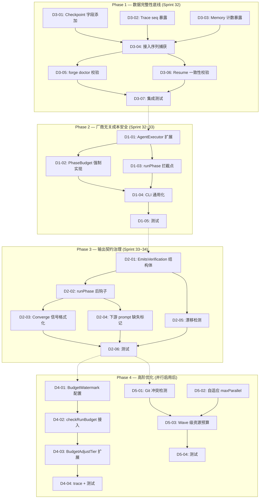

现在我已掌握所需信息，可以提供完整的 Tech Lead 分析了。

---

# Tech Lead 分析：五个运行时边界盲区

## 1. 任务分解

以下任务均按每个 2-4 小时可完成（单人）的粒度设计，包含明确的文件变更范围和验收标准。

### 方向三 · 三存储跨会话一致性审计（P1 — 先行执行）

| 任务 ID | 标题 | 涉及文件 | 前置依赖 | 工时 | 验收标准 |
|---------|------|---------|---------|------|---------|
| **D3-01** | 向 Checkpoint 结构体添加 `TraceSeq`/`MemorySeq` 字段 | `forge-core/internal/persist/checkpoint.go` + `checkpoint_test.go` | — | 2h | Checkpoint JSON 序列化包含 `trace_seq` 和 `memory_seq`，omitempty 向后兼容； 反序列化旧 checkpoint 时字段默认为 0 |
| **D3-02** | 暴露 trace Tracer 的当前序列号 | `forge-core/internal/trace/trace.go` + `trace_test.go` | — | 2h | `Tracer.Seq()` 方法（带 atomic load，无锁竞）返回当前 seq； 未发出事件的 tracer 返回 0 |
| **D3-03** | 暴露 memory 存储的条目计数 | `forge-core/internal/memory/memory.go` + `memory_test.go` | — | 2h | `memory.Len(path)` 读取 JSONL 行数，O(n) 扫描（n < 5000，可接受）； 或用维护的同步计数器（若已存在），返回当前条目数 |
| **D3-04** | 在 checkpoint 保存路径中接入序列捕获 | `forge-core/internal/orchestrator/loop.go`（OnIteration 钩子）、`forge-core/cmd/forge/engine_build.go`（OnPhase 钩子） | D3-01, D3-02, D3-03 | 3h | 每次 `persist.Save` 调用前设置 `cp.TraceSeq = tracer.Seq()`、`cp.MemorySeq = memory.Len(path)`； 无 trace/memory 时优雅处理零值 |
| **D3-05** | 实现 `forge doctor` 交叉验证子命令 | `forge-core/cmd/forge/doctor.go`（新建）+ `main.go`（路由注册） | D3-04 | 4h | `forge doctor --check-consistency` 读取 checkpoint 序列号并对比 trace/memory 实际端点； 输出清晰报告，包含 PASS/MISMATCH/MISSING 等多种状态 |
| **D3-06** | 实现 resume 时一致性校验 | `forge-core/cmd/forge/main.go`（resumeStart 逻辑） | D3-04 | 3h | `--resume` 启动时，若 trace 最小 seq 或 memory 最小迭代号与 checkpoint 记录不匹配，记录 WARN 级 trace 事件并继续（非阻塞）； 精确报告具体差异位置 |
| **D3-07** | 方向三集成测试 | `forge-core/internal/persist/checkpoint_test.go`、`forge-core/cmd/forge/checkpoint_reflect_test.go` | D3-05, D3-06 | 3h | 覆盖：完全一致、trace 缺失事件、memory 缺失条目、崩溃后 checkpoint 回滚到旧 seq 四种场景； 均在 200ms 内完成 |

### 方向一 · 厂商无关的每调用成本护栏（P1 — 第二执行）

| 任务 ID | 标题 | 涉及文件 | 前置依赖 | 工时 | 验收标准 |
|---------|------|---------|---------|------|---------|
| **D1-01** | 扩展 `AgentExecutor` 接口添加预算方法 | `forge-core/internal/orchestrator/executor.go`、`command_executor.go` | — | 3h | 接口新增 `SetCostCap(capUSD float64)` 和 `CostCap() float64`； 两个实现（`DryRunExecutor`、`CommandExecutor`）均编译通过； cap 默认 0 表示无上限 |
| **D1-02** | 用已有 `PhaseBudget` 结构体实现 CommandExecutor 的预算强制 | `forge-core/internal/orchestrator/budget.go`、`command_executor.go` | D1-01 | 3h | `CommandExecutor.Execute` 在 spawn 前检查 `CurrentCostUSD + estimated >= MaxCostUSD`，超标时返回 `ErrCostCapExceeded`； 预估使用 routing tier 的已知成本表（零外部依赖） |
| **D1-03** | 在 `runPhase` 中 Build→Execute 之间添加拦截 | `forge-core/internal/orchestrator/orchestrator.go`（runAgentPhase 或附近） | D1-02 | 3h | `CommandExecutor.Build` 后、`exec.Execute` 前检查 cost cap； 若超标则记录 trace DecisionEvent 并回滚，不 spawn 子进程 |
| **D1-04** | 将 `--agent-max-budget-usd` 通用化到所有 CLI | `forge-core/cmd/forge/engine_build.go`、`main.go`（CLI help） | D1-03 | 2h | `--agent-max-budget-usd` 在非 claude CLI 下不再静默丢弃； 提供 `forge run --help` 准确说明该参数对所有 agent CLI 生效 |
| **D1-05** | 方向一单元+集成测试 | `forge-core/internal/orchestrator/executor_test.go`（新增）+ `engine_build_test.go` | D1-04 | 4h | 覆盖：非 claude CLI 超预算拒绝、echo（stub）预算拦截、claude 仍透传原有参数、0 值无限语义、预算刚够的边界情况 |

### 方向二 · 声明式输出契约验证（P2 — 第三执行）

| 任务 ID | 标题 | 涉及文件 | 前置依赖 | 工时 | 验收标准 |
|---------|------|---------|---------|------|---------|
| **D2-01** | 创建 `EmitsVerification` 结构体 + 验证函数 | `forge-core/cmd/forge/prompt_artifacts.go`（新建验证逻辑而非仅 Warning） | — | 3h | 输出 `EmitsVerification{Declared, Found, Missing, Untracked}`； 纯函数无 IO，可独立单元测试 |
| **D2-02** | 在 `runPhase` 后接入 emits 验证钩子 | `forge-core/internal/orchestrator/orchestrator.go` + `engine_build.go`（phase 完成回调） | D2-01 | 2h | phase 执行完成后自动调用 emits 验证； 结果记录到 trace 事件（`kind:"emits_verification"`）； 可通过配置开关静默降级（默认：trace-only） |
| **D2-03** | 将 emits 验证格式化为 converge 信号字段 | `forge-core/cmd/forge/prompt_artifacts.go`、`forge-core/internal/converge/`（若存在） | D2-02 | 3h | converge 信号中包含 `emits_verification` 嵌套结构； converge gate 可配置项 `require_emits_complete` 在缺失时判定 UNMET |
| **D2-04** | 下游 phase 缺失 emits 的文件标记 | `forge-core/cmd/forge/prompt_context.go`（emitsContext 读取处） | D2-01 | 3h | 当下游 phase 读取缺失的 emit 文件时，prompt 中明确插入 `[WARNING: artifact "task-plan.md" was declared but not produced by phase "planner"]` 而非静默跳过 |
| **D2-05** | emits 声明-实现漂移检测 | `forge-core/cmd/forge/prompt_artifacts.go`（phase 前后文件快照比对） | D2-01 | 4h | phase 开始前/结束后对比目录快照，报告：声明但未产出、产出但未声明、声明与实际一致三种状态； 结果纳入 trace |
| **D2-06** | 方向二完整测试套件 | `forge-core/cmd/forge/prompt_artifacts_test.go` | D2-02~D2-05 | 3h | 覆盖：all emits found、partial missing、all missing、漂移检测到额外文件、converge 信号格式正确、下游 prompt 标记 |

### 方向四 · 预算感知梯度决策（P3 — 第四执行，低强度）

| 任务 ID | 标题 | 涉及文件 | 前置依赖 | 工时 | 验收标准 |
|---------|------|---------|---------|------|---------|
| **D4-01** | 添加 `BudgetWatermark` 配置 + 阈值回调 | `forge-core/internal/orchestrator/budget.go`、`orchestrator.go`（Engine 结构体） | — | 3h | `Engine` 新增 `BudgetWatermarks []WatermarkDef{ThresholdPct, OnHit func()}`； 默认三档：30%/20%/10% |
| **D4-02** | 在 `checkRunBudget` 中接入水位检查 | `forge-core/internal/orchestrator/budget.go`（checkRunBudget 函数） | D4-01 | 3h | 每次调用 checkRunBudget 时评估剩余预算百分比； 首次跨越某阈值时触发回调（幂等，只触发一次）； 回调中发 trace DecisionEvent |
| **D4-03** | 扩展 `BudgetAdjustTier` 影响范围 | `forge-core/internal/routing/routing.go`、`loop.go`（MaxIter） | D4-02 | 4h | 预算 < 30%：缩短 prompt（减少 memory 检索、降低 adrTopK）； < 20%：降低非安全关键 phase 的模型 tier； < 10%：减少 MaxRetries、跳过可选 phase； 档位可逆（预算重校准后升档） |
| **D4-04** | 梯度决策 trace 事件 + 单元测试 | `forge-core/internal/orchestrator/budget_test.go` | D4-03 | 3h | 每次降档/升档写入 trace `kind:"decision"` 含详细原因； 测试覆盖 30%→20%→10%→5% 四级降档序列+升档恢复 |

### 方向五 · 并发资源争用检测（P3 — 第五执行，并行启用后）

| 任务 ID | 标题 | 涉及文件 | 前置依赖 | 工时 | 验收标准 |
|---------|------|---------|---------|------|---------|
| **D5-01** | 基于 git 的写冲突检测 | `forge-core/internal/orchestrator/parallel.go` + `waves.go` | — | 4h | wave 开始前 `git status --porcelain` 快照，结束后 `git diff --name-only` 检测重叠修改； 结果以 trace 事件 + converge 信号形式输出 |
| **D5-02** | 自适应 `maxParallel` 扩展 | `forge-core/internal/orchestrator/parallel.go`（maxParallel 计算） | — | 3h | 当前 `GOMAXPROCS` 约束不变，额外考虑：`ulimit -u` 剩余进程槽位、`ulimit -n` 剩余文件描述符、目标目录 IO 类型； 三者取 min 作为并发上限 |
| **D5-03** | wave 级资源预算 | `forge-core/internal/orchestrator/waves.go` + `parallel.go` | D5-01, D5-02 | 3h | 每个 wave 分配资源配额（最大并发进程数、最大并行文件写入）； 超配额时 wave 内 phase 串行执行，发 trace OverloadEvent |
| **D5-04** | 方向五测试 + 集成 | `forge-core/internal/orchestrator/parallel_test.go`、`waves_test.go` | D5-03 | 3h | 模拟：双 phase 写同一文件 → 检测冲突； 进程表接近上限 → 自动降低并发度；检测结果写入 trace |

---

## 2. 执行顺序与依赖图

```
总原则：方向三（数据完整性）→ 方向一（成本安全）→ 方向二（治理完整）→ 方向四/五（高阶优化，可并行）
```



### 可并行执行的组

| 并行组 | 包含任务 | 条件 |
|--------|---------|------|
| **G1** | D3-01, D3-02, D3-03 | 无依赖，同一 dev 也可在一个 session 内完成 |
| **G2** | D3-05, D3-06 | 都依赖 D3-04，可分配给两人 |
| **G3** | D1-02, D1-03 | 都依赖 D1-01，可分配给两人 |
| **G4** | D2-03, D2-04, D2-05 | 都依赖 D2-01/D2-02，可分配给三人 |
| **G5** | D4-01, D5-01, D5-02 | Phase 4 内独立行进的子方向（P3 不受 Priority 约束） |

---

## 3. 技术风险

### 3.1 高影响风险

| # | 风险 | 影响方向 | 可能性 | 影响 | 缓解策略 |
|---|------|---------|--------|------|---------|
| R1 | **Memory 无固有序列号**：memory.Entry 没有类似 trace.Event.Seq 的单调计数器，添加 `EntryCount()` 需要扫描整个 JSONL 文件 | D3 | 高 | 启动时 O(n) 扫描 5000 行 < 5ms，可接受；但在每迭代 checkpoint 保存时调用增加延迟 | 使用 `sync/atomic` 计数器缓存：memory 包维护写入计数器，`Append` 时累加，`Load` 时重新核定 |
| R2 | **`PhaseBudget` 结构体存在但零使用**：审阅发现 `internal/budget/budget.go` 已定义 `PhaseBudget{MaxCostUSD, CurrentCostUSD}` 但未被任何接口引用，说明数据模型与接口之间的 gap | D1 | 高 | 结构体字段名/类型可能与新设计不匹配，需重构 | 复用现成结构体，在 `AgentExecutor` 接口层封装 `CostCap()` 方法而非直接暴露 `PhaseBudget` |
| R3 | **并行路径当前沉睡**：`depends_on` 在所有 5 个 workflow 中均为空，`parallel.go` 实际不会并发执行任何 phase | D5 | 高 | 方向五测试需 mock 并行场景；实现可能因缺少真实使用反馈而过度设计 | 先建立并行集成测试基础设施（模拟 `depends_on` 非空的 workflow），再验证冲突检测逻辑 |
| R4 | **emits 采用率低**：只有 5 个 workflow 中的少数 phase 使用了 emits | D2 | 中 | 验证框架做完了但几乎不触发 | 实现时确保零 emits 的 phase 零开销（代码路径不分配、不调用）；使用 workflow 分析工具统计 emits 采用率作为 KPI |
| R5 | **梯度决策的可逆性**：预算水位降档后，若预算重校准（如因退款或调整），升档需要执行逆操作 | D4 | 中 | 降档容易升档难——缩短的 prompt 不能自动恢复；降低的模型 tier 可以用路由重计算 | 实现状态机：每次降档记录 `(timestamp, direction, reason)`；升档函数重算所有档位并应用最高可用；降档不修改持久状态，只影响下次执行的参数 |

### 3.2 依赖外部系统风险

| 风险 | 涉及 | 说明 |
|------|------|------|
| **claude CLI 的 `--max-budget-usd` 行为变更** | D1 | 若 claude 更改其预算参数名或语义，方向一的透传路径也需要同步变更。缓解：forge-core 自有拦截层作为缓冲，CLI 透传仅作为第二道防线 |
| **git 操作在非 git 工作目录中的行为** | D5 | 若用户项目未初始化 git 仓库，`git status --porcelain` 失败。缓解：优雅降级——检测 `git rev-parse --git-dir` 失败时跳过 git 冲突检测 |

### 3.3 性能瓶颈

| 瓶颈 | 涉及 | 评估 |
|------|------|------|
| **Memory EntryCount O(n) 扫描** | D3 | n ≤ 10000（24h 运行），每迭代一次，约 5-10ms，可接受 |
| **--agent-max-budget-usd 的 cost cap 预估精度** | D1 | 预估使用 routing tier 的历史平均成本，首次调用无历史数据时使用 tier 最大可能成本（保守估算） |
| **emits 漂移检测的目录快照** | D2 | 快照使用 `filepath.Walk`，对大型项目（10k+ 文件）可能 100ms+。缓解：限制扫描范围为 phase 的 `allowed_dirs` 或 working_dir |
| **并行冲突检测的 git diff** | D5 | `git diff --name-only` 在大型 repo 中通常 < 200ms。wave 粒度不是每 phase，所以可接受 |

### 3.4 测试覆盖难点

| 难点 | 涉及 | 策略 |
|------|------|------|
| **跨会话一致性的时间跨度** | D3 | 使用 fake clock + 预生成的 trace/memory/checkpoint 文件组合测试，而非跑真正的 24h 运行 |
| **成本护栏的实际 LLM 调用** | D1 | 测试使用 stub executor（模拟成本数据），不需要真实 LLM API。真正的端到端成本验证在 CI 中标记为 `[requires-claude]` 跳过 |
| **并行文件冲突的真实并发** | D5 | 使用 `testing.T.Parallel()` + 共享 temp dir + 两个 goroutine 同时写同一文件，检测冲突结果 |

---

## 4. 资源评估

### 4.1 团队技能要求

| 角色 | 所需技能 | 数量 | 主要负责 |
|------|---------|------|---------|
| **Go 后端工程师** | Go, 并发编程, JSON 序列化, 接口设计 | 1-2 人 | D3-01~D3-07, D1-01~D1-05, D4-01~D4-04 |
| **全栈/CLI 工程师** | Go CLI 开发, 子命令注册, help 文本 | 1 人 | D1-04, D3-05, 与 Go 后端共享 |
| **测试工程师** | Go 测试, 集成测试, table-driven tests | 1 人 | D3-07, D1-05, D2-06, D4-04, D5-04 |
| **架构师（兼职）** | 跨包接口设计, 事务性写入组设计 | 0.5 人 | D3-04（序列接入设计）, D1-01（接口设计审查） |

**最小可行团队**：2 名 Go 工程师（1 名 senior + 1 名 mid-level）+ 1 名 QA = **3 人**。

### 4.2 关键里程碑

| 里程碑 | 交付物 | 预计时间 | 依赖 |
|--------|--------|---------|------|
| **M1: 一致性基础设施就绪** | D3-01~D3-04 完成 + 测试通过 | Sprint 32 第 1 周结束 | D3-01, D3-02, D3-03 |
| **M2: Direction 3 完整交付** | D3-05~D3-07 + PR 合并 | Sprint 32 第 2 周结束 | M1 |
| **M3: Direction 1 核心完成** | D1-01~D1-04 + 全部测试 | Sprint 33 第 1 周结束 | M2 |
| **M4: Direction 1 发布** | D1-05 + 文档 + CHANGELOG | Sprint 33 第 2 周结束 | M3 |
| **M5: Direction 2 MVP** | D2-01~D2-04 + trace 集成 | Sprint 34 第 1 周结束 | M4 |
| **M6: Direction 2 完整** | D2-05~D2-06 + 文档 | Sprint 34 第 2 周结束 | M5 |
| **M7: Direction 4 轻量落地** | D4-01~D4-02（水位告警）+ trace 支持 | Sprint 35（并行启用前低强度） | M6 |
| **M8: Direction 5 并行启用后适配** | D5-01~D5-04（当 depends_on 出现真实用例时） | 未来 Sprint（条件触发） | depends_on 采用 > 0 |

### 4.3 阻塞点与解决策略

| 阻塞点 | 涉及 | 解决策略 |
|--------|------|---------|
| **B1: trace.Tracer.Seq() 需要 atomic 安全** | D3-02 | `Tracer` 已有 `sync.Mutex` 序列化 Emit，但 `Seq()` 读不加锁存在 stale read 风险。方案：使用 `atomic.LoadUint64` 独立计数器（不与 `seq int` 共享），移除 mutex 竞争 |
| **B2: memory.Append 内部无计数器** | D3-03 | 当前 `Append` 不返回条目总数。方案：在 `memory.go` 中添加 `sync/atomic.Int64` 包级计数器，每次 `Append` +1，`Compact` 时重新核定。`Len()` 读取该计数器 |
| **B3: 成本预估需要 tier→cost 映射表** | D1-02 | 当前代码中没有 LLM tier 到成本的硬编码映射。方案：在 `internal/routing/` 中添加 `TierCostMap map[string]float64`（Haiku=$0.25, Sonnet=$3.00, Opus=$15.00 per M tokens），作为保守估算；暴露 `SetTierCost(name string, cost float64)` 允许覆盖 |
| **B4: converge 信号结构体不存在** | D2-03 | 需先确认 converge 信号格式。策略：审查 `converge_exempt_test.go` 和现有 converge 实现，确定信号结构的扩展点 |

---

## 5. 质量保证

### 5.1 单元测试覆盖要求

| 包/文件 | 要求 |
|---------|------|
| `forge-core/internal/persist/checkpoint.go` | TestCheckpointSeqRoundTrip: 编码→解码后 TraceSeq/MemorySeq 保真；TestCheckpointBackwardCompat: 旧格式（无 seq 字段）解码后 seq=0 |
| `forge-core/internal/trace/trace.go` | TestTracerSeq: 确保 Emit N 次后 Seq() == N；TestTracerSeqConcurrentSafe: 并发 emit + 读 Seq 无 data race |
| `forge-core/internal/memory/memory.go` | TestMemoryLen: Append N 次后 Len() == N；TestMemoryLenCompact: Compact 后 Len() 正确 |
| `forge-core/internal/orchestrator/executor.go` | TestCostCapInterface: SetCostCap + CostCap 往返；TestCostCapEnforcement: 超预算返回特定 error |
| `forge-core/internal/orchestrator/budget.go` | TestBudgetWatermark: 触发/不触发阈值；TestBudgetWatermarkIdempotent: 同一阈值不重复触发 |
| `forge-core/cmd/forge/prompt_artifacts.go` | TestEmitsVerification: 四类场景全覆盖；TestEmitsDriftDetection: 额外文件检测 |

### 5.2 集成测试策略

| 场景 | 方法 | 方向 |
|------|------|------|
| 跨会话 resume 一致性 | 创建旧 checkpoint（seq=5） + trace 只有 3 个事件 → `forge --resume` 产生 WARN trace 事件 | D3 |
| 非 claude CLI 成本拦截 | `forge run --agent-cmd echo --agent-max-budget-usd 1` → echo 不花钱但 forge 层拦截模拟超预算 | D1 |
| emits 缺失传播 | Workflow 声明 `emits: [report.md]` → agent（stub）不创建 → 下游 phase prompt 含 `[WARNING]` 标记 | D2 |
| 并行写冲突 | `depends_on: []` 两个 phase 同时写 `main.go` → 冲突检测输出到 trace | D5 |

### 5.3 代码审查要点

| # | 审查点 | 重点检查 | 方向 |
|---|--------|---------|------|
| CR1 | **接口扩展兼容性** | `AgentExecutor` 新增方法是破坏了现有实现还是添加了默认实现？所有实现（含 `DryRunExecutor`）都更新了吗？ | D1 |
| CR2 | **Checkpoint 向后兼容** | 旧 checkpoint 加载后 `TraceSeq`/`MemorySeq` 是不是正确的零值？新字段是否有 `omitempty`？ | D3 |
| CR3 | **降档可逆性** | 预算水位恢复时，梯度决策是否正确定义了升档逻辑？降档副作用是否被持久化？ | D4 |
| CR4 | **静默降级 vs fail-closed** | emits 验证失败是记录 WARN（默认）还是返回 error（可选）？配置项是否合理暴露？ | D2 |
| CR5 | **并发安全性** | trace seq 读取是否 atomic？memory Len() 是否受 Compact 影响？cost cap 检查在并行 phase 中是否 race？ | D3, D5 |
| CR6 | **错误消息的可操作性** | 所有新 error 是否包含足够上下文供 operator 处理？（file path、当前值、阈值等） | 全部 |

### 5.4 性能测试需求

| 测试 | 指标 | 阈值 | 对应方向 |
|------|------|------|---------|
| Checkpoint Save 延迟增加 | 在已有 checkpoint 150μs 基础上，seq 捕获 < 5μs | +20% max | D3 |
| forge doctor 交叉校验 | 10k 行 trace + 5k 行 memory | < 100ms | D3 |
| Cost cap 检查延迟 | 每次 `runPhase` 调用 | < 50μs | D1 |
| Emits 验证（小型项目 100 文件） | 每 phase | < 10ms | D2 |
| BudgetWatermark 检查延迟 | 每次 `checkRunBudget` | < 1μs（纯数值比较） | D4 |
| Git 冲突检测 | 10k 文件 repo | < 200ms per wave | D5 |

### 5.5 特殊测试场景（边界值）

| 场景 | 描述 | 方向 |
|------|------|------|
| TraceSeq=0, MemorySeq=0 | 新 run 首次写入 checkpoint，无 trace/memory 事件 | D3 |
| 超大 MemorySeq（uint64 max-1） | 极端高迭代数下的序列号回绕 | D3 |
| CostCap=0（无上限） | 默认值，必须零开销且不拦截 | D1 |
| Emits=[]（空数组） | 不声明任何产出，验证函数应简化为 no-op | D2 |
| BudgetWatermark 首次触发后永不重复 | 20% 阈值在多次 checkRunBudget 中只触发一次 | D4 |
| Parallel 无 depends_on（空 wave） | wave 大小为 1，冲突检测代码不应执行 | D5 |

---

## 6. 实施计划

### 总体时间线（4 阶段，约 5 sprints / 10 周）

```
Sprint 32 ──────────────────────────────────────────────
    Week 1    [▓▓▓▓▓▓▓▓▓▓▓▓▓▓▓▓▓▓]  D3-01 D3-02 D3-03 D3-04
    Week 2    [▓▓▓▓▓▓▓▓▓▓▓▓▓▓▓▓]  D3-05 D3-06 D3-07  ←  M2 里程碑
Sprint 33 ──────────────────────────────────────────────
    Week 1    [▓▓▓▓▓▓▓▓▓▓▓▓▓▓▓▓▓▓]  D1-01 D1-02 D1-03 D1-04  ←  M3 里程碑
    Week 2    [▓▓▓▓▓▓▓▓▓▓]  D1-05 + 文档/CHANGELOG  ←  M4 里程碑
Sprint 34 ──────────────────────────────────────────────
    Week 1    [▓▓▓▓▓▓▓▓▓▓▓▓▓▓▓▓]  D2-01 D2-02 D2-03 D2-04  ←  M5 里程碑
    Week 2    [▓▓▓▓▓▓▓▓▓▓▓▓]  D2-05 D2-06  ←  M6 里程碑
Sprint 35+  ──────────────────────────────────────────────
  低强度     [▓▓▓▓▓▓]  D4-01 D4-02（水位告警最小实现）
  按需触发   D5-01~D5-04（条件：depends_on 采用 > 0）
```

### 阶段详情

---

#### 阶段 1：基础设施搭建（Sprint 32，2 周）

**目标**：完成方向三全部交付，建立三存储交叉一致性的基础设施。

| 周 | 日 | 活动 | 产出 |
|---|----|------|------|
| W1 | 1 | D3-01: Checkpoint 字段添加 | PR #1（checkpoint.go） |
| W1 | 1-2 | D3-02: Trace seq 暴露（与 D3-01 并行） | PR #2（trace.go） |
| W1 | 2 | D3-03: Memory 计数暴露（与 D3-01 并行） | PR #3（memory.go） |
| W1 | 3-4 | D3-04: 接入序列捕获到 loop.go/engine_build.go | PR #4（loop.go），集成测试 |
| W2 | 1-2 | D3-05: forge doctor 交叉验证子命令 | PR #5（doctor.go） |
| W2 | 2-3 | D3-06: Resume 一致性校验 | PR #6（main.go resume 逻辑） |
| W2 | 3-4 | D3-07: 集成测试 + 回归 | PR #7（全方向三测试） |

**此阶段结束时的交付物**：
- `forge doctor --check-consistency` 命令可用
- `--resume` 启动时校验三个存储的一致性
- 所有 checkpoint 包含 trace/memory 序列号
- 完整测试覆盖，CI 通过

---

#### 阶段 2：核心功能实现（Sprint 33，2 周）

**目标**：方向一全部交付，消除唯一依赖 vendor 实现的资源护栏缺口。

| 周 | 日 | 活动 | 产出 |
|---|----|------|------|
| W1 | 1 | D1-01: AgentExecutor 接口扩展 | PR #8（executor.go） |
| W1 | 1-2 | D1-02: PhaseBudget 强制实现（与 D1-01 并行） | PR #9（budget.go + command_executor.go） |
| W1 | 2-3 | D1-03: runPhase 拦截点 | PR #10（orchestrator.go） |
| W1 | 3-4 | D1-04: CLI 通用化 | PR #11（engine_build.go + main.go help） |
| W2 | 1-3 | D1-05: 全面测试（单元+集成+边界） | PR #12（executor_test.go + engine_build_test.go） |
| W2 | 3-4 | 方向一文档更新 + CHANGELOG | 文档提交 |

**此阶段结束时的交付物**：
- 所有 5 个资源维度都在 forge-core 层独立强制
- `--agent-cmd echo --agent-max-budget-usd 0.01` 在 forge-core 层正确拦截
- `--agent-cmd claude --agent-max-budget-usd 10` 同时使用 forge-core 自有 cap + claude 透传

---

#### 阶段 3：集成测试和优化（Sprint 34，2 周）

**目标**：方向二全部交付，建立 emits 验证的完整治理链条。

| 周 | 日 | 活动 | 产出 |
|---|----|------|------|
| W1 | 1 | D2-01: EmitsVerification 结构体 + 验证函数 | PR #13（prompt_artifacts.go） |
| W1 | 1-2 | D2-02: runPhase 后钩子接入 | PR #14（orchestrator.go） |
| W1 | 2-3 | D2-03: Converge 信号格式化 | PR #15（converge 信号扩展） |
| W1 | 2-3 | D2-04: 下游 prompt 缺失标记（与 D2-03 并行） | PR #16（prompt_context.go） |
| W2 | 1-2 | D2-05: 漂移检测实现 | PR #17（prompt_artifacts.go） |
| W2 | 2-4 | D2-06: 完整测试套件 | PR #18（prompt_artifacts_test.go + 集成测试） |

**此阶段结束时的交付物**：
- emits 缺失不再静默跳过——trace 记录 + converge 信号 + 下游 prompt 标记
- 漂移检测报告声明与实际产出之间的差异
- 测试覆盖全部 4 类 emits 场景

---

#### 阶段 4：高阶优化与发布准备（Sprint 35+，低强度 + 条件触发）

**目标**：方向四轻量落地（水位告警最小实现）；方向五条件触发。

| 活动 | 时间 | 内容 |
|------|------|------|
| D4-01 + D4-02 最小实现 | Sprint 35 W1-2 | BudgetWatermark 配置 + 30%/20%/10% 水位 trace 告警。不做完整梯度降档，只做告警——这是投入产出比最高的部分 |
| D4-03 + D4-04 | Sprint 35 W3-4 | 若上游有明确需求，扩展 BudgetAdjustTier 影响范围；否则搁置至下一迭代 |
| D5-01~D5-04 | 按需触发 | **执行条件**：`docs/workflows/` 或 `examples/` 中出现第一个包含非空 `depends_on` 的 workflow。在此条件满足前，方向五仅保持设计文档更新状态 |

**此阶段结束时的交付物**：
- `forge run` 在预算剩余 30%/20%/10% 时向 trace 发出告警
- 方向五设计文档完成，实现代码就绪但未激活（feature-flagged）

---

## 总结：执行建议

### 立即执行（Sprint 32 backlog）

1. **D3-01**: Checkpoint 加字段——零风险，2 小时，收益最高
2. **D3-02**: Trace seq 暴露——2 小时，与 D3-01 并行
3. **D3-03**: Memory 计数暴露——2 小时，与 D3-01 并行

这三项在 Sprint 32 第 1 天开始，第 2 天即完成基础设施。后续 D3-04~D3-07 在本 sprint 内完成，无外部依赖。

### 需要架构决策（ADR）

1. **ADR-032: 一致性标记策略**——在 checkpoint 中存储 `trace_seq`/`memory_seq` 方案 vs. 在 trace 和 memory 中存储 checkpoint 引用（逆方案）。推荐前者（改动最小，对已有数据零影响）。
2. **ADR-033: 成本估算数据源**——硬编码 tier→cost 映射表 vs. 读取历史运行数据计算平均成本。推荐前者（确定性，零外部依赖，保守估算可调）。

### 不做的事（主动不做的决策）

1. **方向四的完整梯度降档**暂不实现——二元硬停已经在守卫预算不超限。水位告警是当前阶段唯一需要的增量。
2. **方向五的完整实现**暂不启动——直到真实并行 workflow 出现。当前保持设计文档更新。
3. **事务性写入组（Atomic multi-store commit）**——方向三审阅中提到的概念重要但实现成本高。一致性标记 + 启动时校验已经是足够的安全网，不需要为极低概率的崩溃窗口增加写入路径的复杂度。
