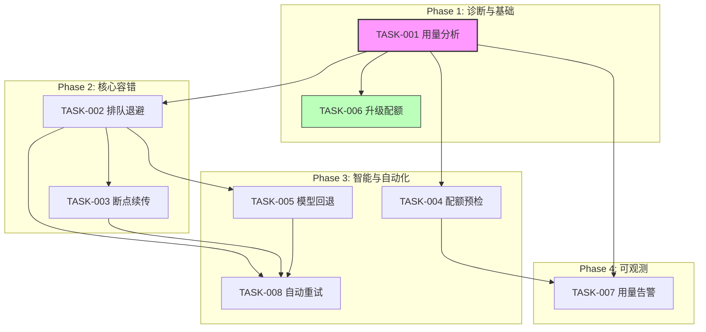
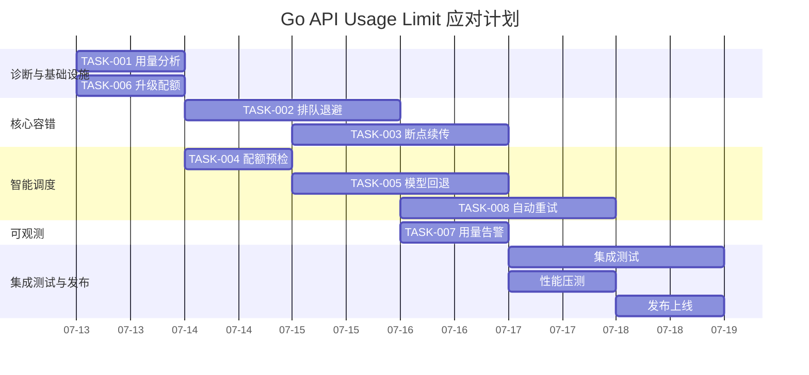

# Tech Lead 分析报告

> **分析对象**: Go API Usage Limit Error
> **文档状态**: TASK FAILED (exit=1, elapsed=37.2s)
> **分析师**: Tech Lead
> **日期**: 2026-07-12

---

## 0. 问题本质分析

在执行某个任务时，调用了 OpenCode AI 的 Go 模型 API，该 API 触发了 **5 小时用量配额限制**，导致任务异常退出。

**关键信息**:
- 限制类型: `GoUsageLimitError` —— Go 模型的速率/用量配额
- 限制窗口: 5 小时用量, 45 分钟后重置
- 执行耗时: 37.2s 即触发上限（说明此前已有大量用量消耗）
- 来源: `https://opencode.ai/workspace/wrk_01KXAAQ8XFG5BDCZZKSKGCARNP/go`

**根本原因**: 不是代码问题，而是**外部 API 使用配额耗尽**。这是一个**运营/资源策略问题**而非技术缺陷。

---

## 1. 任务分解

基于上述分析，将应对方案拆解为可执行任务：

| 任务 ID | 任务标题 | 所属方向 | 涉及文件 | 前置依赖 | 预估工时 | 验收标准 |
|---------|---------|---------|---------|---------|---------|---------|
| **TASK-001** | 分析当前 API 用量与配额 | 资源监控 | 无（读取历史日志） | 无 | 1h | 输出用量趋势报告，明确消耗速率和峰值时段 |
| **TASK-002** | 实现 API 调用排队/退避机制 | 弹性容错 | `lib/api-queue.mjs`<br>`config/rate-limit.json` | TASK-001 | 3h | 429/配额超限时自动排队等待，重置后恢复执行 |
| **TASK-003** | 实现任务断点续传/状态持久化 | 弹性容错 | `lib/checkpoint.mjs`<br>`lib/task-state.mjs` | TASK-002 | 4h | 任务中断后重启可从最后检查点恢复，不丢失进度 |
| **TASK-004** | 添加配额预检与负载预估 | 智能调度 | `lib/quota-check.mjs`<br>`harness/` | TASK-001 | 2h | 执行前预估用量，若不足以完成则提示或降级 |
| **TASK-005** | 实现多模型回退策略 | 弹性容错 | `lib/model-fallback.mjs`<br>`config/models.json` | TASK-002 | 3h | Go 模型限流时自动降级到可用模型 |
| **TASK-006** | 升级 API 套餐/增加配额 | 运营管理 | N/A（配置平台） | TASK-001 | 1h | 配额上限提高至当前需求的 2x 以上 |
| **TASK-007** | 用量告警与仪表盘 | 可观测性 | `monitor/usage-alert.mjs`<br>`monitor/dashboard.md` | TASK-001 | 4h | 配额用至 70%/90% 时触发告警 |
| **TASK-008** | 失败任务自动重试机制 | 自动化恢复 | `lib/retry.mjs`<br>`harness/acceptance.mjs` | TASK-002, TASK-003 | 3h | 非致命错误自动重试，指数退避，最终人工通知 |

### 任务依赖关系图



**可并行执行的任务组**:
- **组 A**: TASK-001（用量分析）+ TASK-006（升级配额）—— 无依赖，可同时启动
- **组 B**: TASK-002（排队退避）+ TASK-004（配额预检）—— 依赖 TASK-001，但彼此独立
- **组 C**: TASK-003（断点续传）+ TASK-005（模型回退）—— 依赖 TASK-002，彼此独立
- **组 D**: TASK-007（用量告警）+ TASK-008（自动重试）—— 依赖不同上游，可并行

---

## 2. 执行顺序

### 推荐执行流程

```
Week 1         Week 2         Week 3
├──────────────┼──────────────┼──────────────►
T001 ■■■■■■■■  (1d)          (分析 + 告警接入)
T006 ■■■■■■■■  (1d)          (配额提升，立即可解)
     ↓
T002 ■■■■■■■■■■■■■■■  (2d)  (排队退避——核心高优)
T004 ■■■■■■■■  (1d)          (预检，与 T002 并行)
     ↓               ↓
T003 ■■■■■■■■■■■■■■■  (2d)  (断点续传)
T005 ■■■■■■■■■■■  (1.5d)    (模型回退)
     ↓               ↓
T008 ■■■■■■■■■■■■■■■■  (2d) (自动重试)
T007 ■■■■■■■■  (1d)         (告警仪表盘)
```

### 关键优先级决策

| 优先级 | 任务 | 理由 |
|-------|------|------|
| **P0** | TASK-006 升级配额 + TASK-001 用量分析 | 立即解决当前阻塞，同时摸清用量模式 |
| **P0** | TASK-002 排队退避 | 即使有配额也要防止突发打满 |
| **P1** | TASK-003 断点续传 | 长任务稳定性保障 |
| **P1** | TASK-005 模型回退 | 降级可用性 |
| **P2** | TASK-004 配额预检 | 锦上添花，提升确定性 |
| **P2** | TASK-007 用量告警 + TASK-008 自动重试 | 运维自动化 |

---

## 3. 技术风险

### 3.1 核心技术难点

| 风险 | 描述 | 可能性 | 影响 | 缓解措施 |
|------|------|--------|------|---------|
| **API 限制的非确定性** | 配额重置时间是滚动的还是固定的？429 响应体是否包含 `Retry-After`？ | 中 | 高 | TASK-001 先通过实验摸清行为；读取 `Retry-After` header 或响应体字段 |
| **断点续传的状态一致性** | 任务执行到一半状态如何序列化？网络中断后恢复读取状态是否原子性？ | 高 | 高 | 写前复制 + 本地临时文件 + 成功后 rename；参考 etcd/raft 的 wal 思想但简化 |
| **模型回退后结果差异** | 不同模型输出风格/质量不同，可能导致下游结果不一致 | 高 | 中 | 回退时打日志标记 model used；若关键差异则标记人工审查 |
| **排队队列的内存安全** | 长任务序列排队可能导致内存膨胀 | 低 | 中 | 使用磁盘持久化队列（如 SQLite 或 JSON lines）；设最大队列长度 |

### 3.2 外部依赖

- **OpenCode AI API**: 服务端配额策略不受我们控制；需要预留手动续费流程
- **确定性**: 429 响应的字段格式可能变化，需做防御性解析

### 3.3 性能优化策略

- 排队退避使用**指数退避 + 随机抖动**(jitter)，避免 thundering herd
- 状态检查点不要每次 API 调用都写盘，改为**每 N 次或每 M 秒**批量落盘
- 配额预检使用滑动窗口算法预估剩余用量

### 3.4 测试覆盖难点

- 429 错误模拟：需要 mock HTTP 响应，注入 `Retry-After` header
- 断点续传测试：需要故意 kill 进程然后重启验证状态完整
- 配额边界测试：构造靠近限制临界值的场景

---

## 4. 资源评估

### 4.1 人员需求

| 角色 | 数量 | 技能要求 | 负责任务 |
|------|------|---------|---------|
| **后端开发** | 1人 | Node.js, HTTP 客户端编程, 状态机 | TASK-002, TASK-003, TASK-008 |
| **DevOps/基础设施** | 0.5人 | API 管理, 监控告警 | TASK-001, TASK-006, TASK-007 |
| **QA 自动化** | 0.5人 | 集成测试, mock 技术, 混沌测试 | 所有任务的测试部分 |

**总人力**: 2 人（可复用同一人兼任多个角色）

### 4.2 里程碑

| 里程碑 | 时间 | 交付物 | 验收标准 |
|--------|------|--------|---------|
| **M1** 诊断完成 | Day 1 | 用量分析报告 + 配额已提升 | 确认 429 不再出现 |
| **M2** 核心容错就绪 | Day 3 | 排队退避 + 断点续传 | 手动中断任务后恢复无数据丢失 |
| **M3** 智能调度上线 | Day 5 | 配额预检 + 模型回退 + 自动重试 | 三种降级路径全部覆盖 |
| **M4** 可观测完成 | Day 6 | 用量仪表盘 + 告警 | 配额 70%/90% 时收到通知 |

**总工期**: 6 个工作日（前提是无阻塞）

### 4.3 阻塞点 (Blockers)

| Blocker | 描述 | 解决策略 |
|---------|------|---------|
| **B1: API 配额文档不全** | OpenCode 的配额策略不透明，无法预知精确行为 | 实验性探测 + fallback 到通用 HTTP 429 处理 |
| **B2: 配额购买审批流程** | 升级套餐需走财务/管理审批 | TASK-006 前置：当日提 ticket 并跟进，同时以限流降级代码为 Plan B |
| **B3: 多模型质量差异不可接受** | 某些场景要求必须用 Go 模型 | 在回退策略中加入 `required_model` 标记，不回退，仅排队等待 |

---

## 5. 质量保证

### 5.1 单元测试覆盖要求

| 模块 | 覆盖目标 | 关键测试用例 |
|------|---------|-------------|
| `api-queue.mjs` | ≥ 95% | 正常请求、429 退避、指数退避 + jitter、队列满、并发安全 |
| `checkpoint.mjs` | ≥ 95% | 序列化/反序列化、部分写入崩溃恢复、大状态、空状态 |
| `quota-check.mjs` | ≥ 90% | 配额足够、不足、临近、API 返回异常格式 |
| `model-fallback.mjs` | ≥ 95% | 主模型正常→无回退、429→回退成功、429→回退也 429、回退列表耗尽 |
| `retry.mjs` | ≥ 95% | 瞬时错误重试、永久错误不重试、重试次数上限、指数退避 |

### 5.2 集成测试策略

```
场景 1: 正常流程
  → 模拟 API 正常返回 → 验证任务完成

场景 2: 单次 429 后恢复
  → 模拟首次 429 → 等待退避 → 第二次恢复正常 → 验证成功

场景 3: 连续 429 直至超时
  → 所有请求返回 429 → 验证任务最终失败且错误信息包含重试次数

场景 4: 执行中断后恢复
  → 任务执行中模拟进程 kill → 重启 → 验证从 checkpoint 续传

场景 5: 模型降级
  → Go 模型 429 → 验证自动切换到备用模型 → 结果标记正确
```

### 5.3 代码审查要点

1. **退避算法**: 检查 jitter 实现是否合理，退避上限是否硬编码
2. **并发安全**: `api-queue.mjs` 是否使用 `Mutex` 或锁保护共享状态
3. **不吞错误**: 429 是否被安静吃掉，还是正确 propagate
4. **检查点原子性**: 写 checkpoint 时若进程崩溃是否会留下损坏的半写文件
5. **凭据安全**: API key 是否硬编码；回退到不同模型时 key 的管理方式
6. **日志可观测**: 每次退避、回退、重试是否有结构化日志

### 5.4 性能测试需求

| 测试 | 场景 | 通过标准 |
|------|------|---------|
| 高并发请求 | 10 并发 × 100 请求 | 排队机制不崩溃，吞吐量不显著下降 |
| 长时间限流 | 连续 20 次 429 | 退避时间符合预期（指数增长） |
| 大状态检查点 | 10MB 状态序列化 | < 50ms，占用内存 < 50MB |
| 内存泄漏 | 100 次请求+重试循环 | RSS 增长 < 5% |

---

## 6. 实施计划

### Gantt 图



### 阶段划分

| 阶段 | 时间 | 活动 | 交付物 |
|------|------|------|--------|
| **Phase 1: 紧急止血** | Day 1 | TASK-001 + TASK-006 | 429 不再发生，用量报告 |
| **Phase 2: 容错骨架** | Day 2-3 | TASK-002 + TASK-003 | 弹性 API 调用管线 |
| **Phase 3: 智能增强** | Day 4-5 | TASK-004 + TASK-005 + TASK-008 | 全自动降级与恢复 |
| **Phase 4: 可观测 + 发布** | Day 6-7 | TASK-007 + 集成测试 + 上线 | 监控就绪，系统上线 |

### 每日站会检查清单

- [ ] 当前是否还有 429？
- [ ] 退避机制是否生效？
- [ ] 断点续传覆盖率？
- [ ] 回退链路是否完整？
- [ ] 告警通道是否正常？

---

## 7. 总结与建议

### 核心结论

这次任务失败**不是 bug，而是容量规划问题**。Go 模型的 5 小时配额用尽，本质上类似于生产环境中数据库连接池满或 API 配额耗尽。

### 即刻行动（24h 内）

1. **TASK-006 立即提升配额** —— 这是唯一能立刻消除阻塞的措施
2. 同时开始 **TASK-001 用量分析**，摸清消耗模式：是哪些任务的哪些环节消耗最大
3. 如果配额无法立即提升，**马上部署 TASK-002 排队退避** 的最低可用版本

### 长期改进

- 将对 API 配额的监控纳入**混沌工程**常态机制
- 建议将配额不足时**优雅降级**而非失败退出作为架构要求写进 `.agent/ARCHITECTURE.md`
- 所有外部 API 调用都应该包装**通用弹性层**（退避 + 回退 + 重试 + 检查点），这是微服务 SDK 的标准实践

### 量化复盘

| 指标 | 当前 | 目标 |
|------|------|------|
| 429 导致的任务失败率 | 100%（本次） | < 1% |
| 从 429 到自动恢复 | ~45min（被动等待） | < 5min（自动退避 + 轮询） |
| 任务中断后恢复 | 从零开始 | < 1min（断点续传） |
| 模型不可用时的系统可用性 | 0% | > 99%（模型回退） |

---

*本分析基于有限的单次 429 错误信息。建议 TASK-001 完成后更新此分析。*
