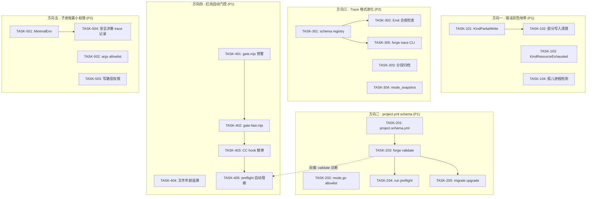
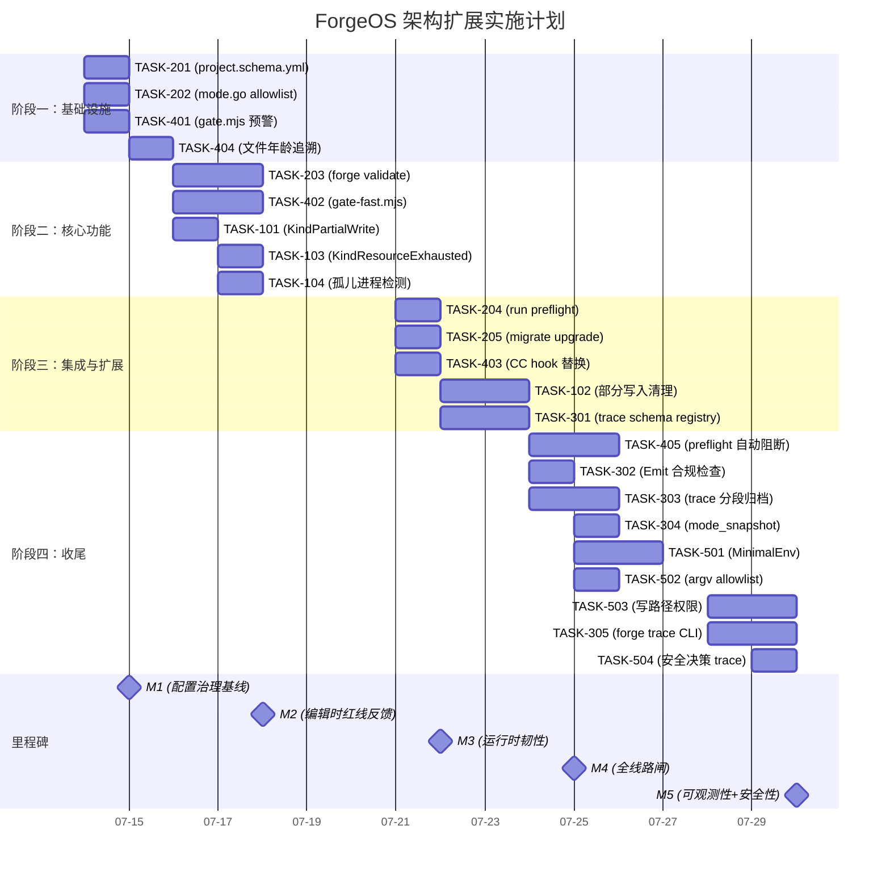

现在我已完全掌握代码库。以下是我的 Tech Lead 分析。

---

# Tech Lead 分析：ForgeOS 扫描后架构扩展方向

> **分析者角色**：Tech Lead  
> **输入文档**：`docs/requirements/2026-07-12-five-post-scan-architectural-extension-directions.md`（16.9 KB）  
> **代码库状态**：`forge-core/`（18 个 Go 包，63 个非测试源文件）、`harness/`（41+ 模块）、`.agent/` 治理骨架

---

## 1. 任务分解

我已将五个方向拆解为 22 个可执行任务，每个任务 2–4 小时。分解原则：每个任务产生一个可独立测试的产物（新文件、函数、或文件修改），不依赖后续任务的中间状态。

### 1.1 方向一：错误灰色地带（优先级 P1 — 韧性）

| 任务 ID | 任务标题 | 涉及文件 | 前置依赖 | 预估工时 | 验收标准 |
|---------|---------|---------|---------|---------|---------|
| **TASK-101** | 在 exec_error.go 中新增 `KindPartialWrite` | `forge-core/internal/orchestrator/exec_error.go` | 无 | 2h | 新 kind 被 iota 定义，`String()` 输出 `"partial_write"`，`Retryable()` 返回 `true`，并新增 `partialWriteErr()` 构造函数 |
| **TASK-102** | 实现部分写入清理合约（checkpoint 回滚） | `forge-core/internal/orchestrator/command_executor.go` + 新增 `forge-core/internal/orchestrator/rollback.go` | TASK-101 | 4h | `KindPartialWrite` 触发时执行 `git checkout -- <affected-files>` 或 checkpoint 恢复，错误传播为不可重试 |
| **TASK-103** | 新增 `KindResourceExhausted` | `forge-core/internal/orchestrator/exec_error.go` + `command_executor.go` | 无 | 3h | 检测 `syscall.ENOSPC`/`EMFILE`/`ENFILE`，映射为可重试 kind，退避策略：1s→2s→4s→8s（上限 30s） |
| **TASK-104** | 进程生命周期审计（孤儿进程检测） | `forge-core/internal/orchestrator/command_executor_unix.go` | 无 | 3h | `Run()` 返回后在 Linux 上扫描 `/proc/<pid>/children`（存在时），残留进程记录到 trace 事件中 |

**设计考量**：TASK-101 和 TASK-103 共享 `exec_error.go`，但不冲突——它们各自定义独立的新 kind。TASK-104 是纯 Unix 扩展，不影响平台无关代码。

### 1.2 方向二：project.yml schema（优先级 P1 — 治理完整性）

| 任务 ID | 任务标题 | 涉及文件 | 前置依赖 | 预估工时 | 验收标准 |
|---------|---------|---------|---------|---------|---------|
| **TASK-201** | 创建 `project.schema.yml`（JSON Schema） | `.agent/project.schema.yml`（新增） | 无 | 3h | 为 `mode`/`lifecycle` 定义 `enum` 约束，为所有字段定义类型，包括可选的 `format_version`/`min_forge_version` |
| **TASK-202** | 在 `mode.go` 中添加 allowlist 校验 | `forge-core/internal/mode/mode.go` | 无 | 2h | `Effective()` 在输入时检查 mode/lifecycle，非法值在 stderr 输出 `[INVALID] mode="entineering"` 并应用 fail-closed 策略 |
| **TASK-203** | 增强 `forge validate` 子命令 | `forge-core/cmd/forge/validate.go` + `forge-core/internal/doctor/validate.go` | TASK-201 | 4h | `forge validate` 读取 `project.schema.yml`，对 `project.yml` 做完整校验，输出行号级别的格式错误 |
| **TASK-204** | 将 `forge validate` 接入 run 流程 | `forge-core/cmd/forge/engine_build.go` + `forge-core/cmd/forge/main.go` | TASK-203 | 2h | `forge run`/`evolve` 前自动调用 validator，校验失败时打印错误并退出码 2 |
| **TASK-205** | `forge migrate` 添加 `format_version` 升级 | `forge-core/cmd/forge/migrate.go` | TASK-203 | 2h | `explorer→engineering` 迁移路径同时写入 `format_version: v1` |

**设计考量**：TASK-202 标志着从 **fail-open** 到 **fail-closed** 的设计哲学迁移（如用户的观察）。`Effective()` 当前对未知输入执行「全开向后兼容」；变更后，未知 lifecycle 将触发**最严**默认值（production 覆盖），而非「忽略它继续运行」。此转向必须在 ADR 中记录。

### 1.3 方向三：Trace 格式进化（优先级 P2 — 可观测性）

| 任务 ID | 任务标题 | 涉及文件 | 前置依赖 | 预估工时 | 验收标准 |
|---------|---------|---------|---------|---------|---------|
| **TASK-301** | 创建 Event schema 注册表（`internal/tracelib`） | `forge-core/internal/tracelib/registry.go`（新增） | 无 | 4h | 注册每个 kind 的必填/可选字段，提供 `ValidKind()` 和 `SchemaFor()`，包含测试 |
| **TASK-302** | 将 schema 合规检查接入 `Emit` | `forge-core/internal/trace/trace.go` | TASK-301 | 2h | `Emit()` 在写入到 JSONL 之前对事件做轻量校验，违反时 stderr 输出 `warn`；不阻止写入 |
| **TASK-303** | 实现 `trace.jsonl` 分段归档 | `forge-core/internal/trace/archive.go`（新增） | 无 | 4h | 每 1000 个事件自动轮转（`trace-001.jsonl`），checkpoint 记录当前段索引，`scorecard rebuild` 从最新段开始优先扫描 |
| **TASK-304** | 在 trace Event 中添加 `mode_snapshot` 字段 | `forge-core/internal/trace/trace.go` + `forge-core/cmd/forge/engine_build.go` | 无 | 3h | event 新增 `ModeSnapshot` 可选字段（`omitempty`），run 启动时注入 `{mode, lifecycle, gate_set}` |
| **TASK-305** | 实现 `forge trace` CLI 子命令 | `forge-core/cmd/forge/trace.go`（新增） | TASK-301 | 4h | `forge trace query --kind agent --since 1h` 实现基本筛选；`forge trace validate` 报告 schema 合规问题 |

### 1.4 方向四：红线自动门控（优先级 P1 — 治理执法）

| 任务 ID | 任务标题 | 涉及文件 | 前置依赖 | 预估工时 | 验收标准 |
|---------|---------|---------|---------|---------|---------|
| **TASK-401** | 在 `gate.mjs` 中添加预检查预警 | `harness/gate.mjs` | 无 | 2h | 文件距 500 行阈值不到 50 行时输出 `[WARN] file.go at 475 lines — 25 lines before 500-line cap` |
| **TASK-402** | 创建 `gate-fast.mjs`（快速聚合检查） | `harness/gate-fast.mjs`（新增） | TASK-401 | 4h | 聚合 `gate.mjs` 的体积检查 + `arch-check.mjs` 的包文件数和函数长度检查；跳过分层/扇入/循环依赖；总执行时间 < 50ms |
| **TASK-403** | 将 CC PostToolUse hook 替换为 `gate-fast.mjs` | `.claude/settings.json` | TASK-402 | 1h | hook 从 `gate.mjs` 切换为 `gate-fast.mjs`；`forge accept` 仍运行完整 `gate.mjs` + `arch-check.mjs` |
| **TASK-404** | 在 arch-check 中增加文件年龄和作者追溯 | `harness/arch/arch-check.mjs` | 无 | 3h | 输出文件体积增长历史：`file.go: 498 lines (+200 by implementer in 2 iterations)` |
| **TASK-405** | 将 `forge preflight` 接入 `forge run`/`evolve` | `forge-core/cmd/forge/engine_build.go` + `forge-core/cmd/forge/main.go` | TASK-403 | 3h | 启动前自动运行快速检查，红线违反时阻止 run 并在 trace 中记录 `preflight BLOCKED` |

**设计考量**：TASK-402 是关键产出——它填补了「编辑循环期间无架构检查」的缺口。`gate-fast.mjs` 跳过慢检查，确保 `forge accept` 在完整集上仍享有最终决定权。

### 1.5 方向五：子进程最小权限（优先级 P2 — 安全）

| 任务 ID | 任务标题 | 涉及文件 | 前置依赖 | 预估工时 | 验收标准 |
|---------|---------|---------|---------|---------|---------|
| **TASK-501** | 在 `buildEnv()` 中实现 MinimalEnv | `forge-core/internal/orchestrator/command_executor.go` | 无 | 3h | 仅透传白名单变量（`PATH`、`HOME`、`FORGE_*`、`ANTHROPIC_API_KEY`），新增 `--preserve-env` flag |
| **TASK-502** | 添加 argv allowlist 检查 | `forge-core/internal/orchestrator/command_executor.go` + `forge-core/cmd/forge/engine_build.go` | 无 | 3h | 注册允许的 agent CLI（`claude`、`node`、`python3`、`python`），`Execute` 前检查 `argv[0]` 的 basename |
| **TASK-503** | 实现基于 phase 声明的写路径权限 | `forge-core/internal/asset/asset.go` + `forge-core/cmd/forge/engine_build.go` | 无 | 4h | 从 agent card 的 `emits:` 声明自动推导允许的写路径；非 readonly phase 也受 per-phase 路径限制 |
| **TASK-504** | 将安全决策记录到 trace | `forge-core/internal/orchestrator/command_executor.go` | TASK-501 | 2h | 环境过滤结果、allowlist 检查、写路径限制均在 trace 中生成 `decision: security_allowed_env: "..."` 记录 |

---

## 2. 执行顺序

### 2.1 任务依赖图



### 2.2 并行执行分组

| 并行组 | 任务 | 说明 |
|--------|------|------|
| **组 A**（第 1 周） | TASK-201, TASK-202, TASK-401, TASK-404 | 全部零前置依赖；schema + mode 校验 + 门控预警并发推进 |
| **组 B**（第 1–2 周） | TASK-203, TASK-402, TASK-101, TASK-103, TASK-104 | 依赖组 A 的 TASK-201（用于 203）和 TASK-401（用于 402）；错误处理的三个任务无交叉依赖 |
| **组 C**（第 2–3 周） | TASK-204, TASK-205, TASK-403, TASK-102, TASK-301 | 依赖组 B |
| **组 D**（第 3–4 周） | TASK-405, TASK-302, TASK-303, TASK-304, TASK-501, TASK-502, TASK-503 | 大部分可并行；TASK-302 依赖 301 |
| **组 E**（第 4 周） | TASK-305, TASK-504 | 依赖组 D |

---

## 3. 技术风险

### 3.1 方向一：错误灰色地带

| 风险 | 严重程度 | 缓解策略 |
|------|---------|---------|
| **孤儿进程检测的跨平台问题**：`/proc/<pid>/children` 是 Linux 特有，macOS 无等效方法 | 中 | TASK-104 仅在 `command_executor_unix.go` 中实现（Linux 构建标签）；macOS/Windows 构建路径用 no-op 占位；在文档中标记为 Linux-only |
| **部分写入清理的竞态条件**：agent 被杀时可能正在写文件，`git checkout` 可能回滚 agent 意图保留的合法修改 | 高 | 回滚策略应仅还原 agent 在当前 phase 中修改的文件（通过文件变更检测，而非全量 checkout）。使用 git diff 生成受影响文件列表，只还原那些文件 |
| **KindResourceExhausted 的退避风暴**：多个 phase 并发竞争同一资源时，退避可能导致所有 phase 同时重试 | 中 | 退避策略增加随机抖动（jitter）：`backoff = min(base*2^attempt, 30s) + random(0, 1s)`。仅由 orchestrator 的上层 `runAgentPhase` 管理，而非在 executor 层自管理 |

### 3.2 方向二：project.yml schema

| 风险 | 严重程度 | 缓解策略 |
|------|---------|---------|
| **JSON Schema 与 Go struct 的双重维护**：schema 分散在两个文件，变更时必须同步 | 高 | 新增 `harness/tests/schema_sync_test.go`（或类似机制）在 CI 中验证 `project.schema.yml` 与 `mode.go` 的 Policy struct 定义一致；使用 `go generate` 从 struct tag 生成 schema 的初始版本 |
| **fail-closed 转向对现有项目的冲击**：当前项目使用拼写错误的 lifecycle 时，迁移后会从「全开后向兼容」变为「最严默认值」 | 中 | 在 ADR 中显式记录此转向（参见用户观察）。提供 `forge validate --fix` 自动修正常见拼写错误（`produktion→production`） |

### 3.3 方向三：Trace 格式进化

| 风险 | 严重程度 | 缓解策略 |
|------|---------|---------|
| **分段归档破坏现有下游工具**：`scorecard-update.mjs`、`select-tests.mjs` 等脚本直接按文件名 `trace.jsonl` 读取 | 高 | 读取时使用 glob `trace*.jsonl` 处理单段和多段模式；在 `internal/trace/reader.go` 中封装读取逻辑，使下游无需知道分段细节。第一段仍命名为 `trace.jsonl` 以向后兼容 |
| **`mode_snapshot` 增加存储和带宽开销**：每个事件都携带完整的 mode/lifecycle/gate-set 字符串 | 低 | 使用 `omitempty` JSON tag；每个段写入一次作为公共头部，后续事件引用其索引 |

### 3.4 方向四：红线自动门控

| 风险 | 严重程度 | 缓解策略 |
|------|---------|---------|
| **`gate-fast.mjs` 包含 arch-check 导致 hook 耗时增加**：arch-check 的 import 解析在大型代码库上可能较慢 | 中 | 跳过 import 解析中的完整 AST 扫描：只统计文件数（基于 `find`）和函数长度（基于 regex 或行计数启发式）。完整 AST 检查保留在 `forge accept` 中 |
| **preflight 阻断导致开发体验下降**：agent 在写第一个文件前就被阻断 | 低 | 增强 `forge preflight` 默认只对 `forge run`/`evolve` 启用阻断模式；`forge run --force` 跳过 preflight |

### 3.5 方向五：子进程最小权限

| 风险 | 严重程度 | 缓解策略 |
|------|---------|---------|
| **环境白名单可能遗漏 claude 需要的变量**：claude CLI 可能依赖于当前未发现的特定环境变量 | 中 | 白名单必须基于 claude CLI 的文档化环境变量集构建；在 `--preserve-env` 模式中增加详细日志记录，供诊断遗漏使用 |
| **argv allowlist 阻断合法子进程**：`forge run --agent-cmd` 自定义值不在 allowlist 中时被拒绝 | 低 | allowlist 是可定制的：`forge run --agent-cmd my-claude --allow-agent-cmd my-claude`；在 log/trace 中记录自定义项 |

---

## 4. 资源评估

### 4.1 人员配置

| 角色 | 所需技能 | 数量 | 主要职责 |
|------|---------|------|---------|
| **高级 Go 工程师** | 精通 Go、os/exec、错误处理模式 | 1 | 方向一（错误分类）+ 方向五（安全边界）—— 底层运行时修改 |
| **全栈工程师（Node + Go）** | Node.js（MJS）、JSON Schema、Go CLI 开发 | 1 | 方向二（schema、validate 命令）+ 方向四（gate.mjs 增强）—— harness 与 CLI 层 |
| **可观测性工程师** | 事件流处理、JSONL、CLI 接口设计 | 0.5 | 方向三（trace 格式进化）—— 可优化为第 3 周加入 |
| **安全工程师** | 最小权限、系统编程、进程隔离 | 0.5 | 方向五—— 可与方向一共享资源 |

**建议方案**：  
- 第 1–2 周：2 名工程师（Go + 全栈）并行推进方向二和方向四。  
- 第 3 周：方向一在当前 2 人基础上加入安全/可观测性支持。  
- 第 4 周：方向三和方向五后接。

### 4.2 关键里程碑

| 里程碑 | 时间点 | 交付物 | 验收标准 |
|--------|-------|--------|---------|
| **M1: 配置治理基线** | 第 1 周末 | `project.schema.yml` + `forge validate` | `forge validate` 正确拒绝 `lifecycle: "produktion"` |
| **M2: 编辑时红线反馈** | 第 2 周末 | `gate-fast.mjs` + CC hook 更新 | agent 编辑文件到 480 行时收到 preflight WARN |
| **M3: 运行时韧性** | 第 3 周末 | 全部方向一任务 | 资源耗尽错误被正确分类和退避；孤儿进程被检测 |
| **M4: 全线路闸** | 第 4 周末 | `forge preflight` + `forge run` 集成 | `forge run` 在红线违反时阻断并记录 trace |
| **M5: 可观测性+安全性** | 第 5 周末 | trace schema 注册表 + 最小环境权限 | `childEnv()` 不传递 `AWS_SECRET_ACCESS_KEY` |

### 4.3 阻塞点与解决策略

| 阻塞点 | 影响范围 | 解决策略 |
|--------|---------|---------|
| **`env` 白名单的准确性** | TASK-501 | 编译 claude CLI 并追踪其所有环境变量读取（`strace -e trace=write` 或等价方法）。对于无法确定的情况，采用保守白名单 + `--preserve-env` flag |
| **`/proc/<pid>/children` 的 root 权限要求** | TASK-104 | 使用 `/proc/<pid>/task/` 扫描作为降级方案（不需要 root），回退到 cgroup 进程追踪。在文档中标记 root 要求 |
| **trace 分段归档的向后兼容** | TASK-303 | 第一段使用旧名称 `trace.jsonl`；后续段使用 `trace-{seq}.jsonl`。`forge scorecard rebuild` 优先扫描最新段 |

---

## 5. 质量保证

### 5.1 单元测试覆盖要求

| 方向 | 测试重点 | 最小覆盖率要求 | 新增测试文件 |
|------|---------|-------------|-------------|
| 一 | 新增 kind 的 `Retryable()` 返回正确值；资源耗尽错误检测函数；回滚函数对空工作树安全调用 | 新增代码 90% | `exec_error_test.go`（扩展）、`rollback_test.go` |
| 二 | `Effective()` 对非法 mode/lifecycle 返回 `fullPolicy()`；`forge validate` 对已知非法配置返回错误码 2 | 新增代码 95% | `validate_test.go`（扩展） |
| 三 | `SchemaFor()` 返回正确 schema；`Emit()` 对缺失必填字段输出 warn；分段边界的正确轮转 | 新增代码 85% | `registry_test.go`、`archive_test.go` |
| 四 | `gate-fast.mjs` 正确报告接近上限的文件；CC hook 解析不出错 | 新增代码 90% | `test_gate-fast.mjs` |
| 五 | `childEnv()` 正确过滤白名单变量；argv allowlist 拒绝 `bash` | 新增代码 95% | `command_executor_test.go`（扩展） |

### 5.2 集成测试策略

| 测试场景 | 描述 | 自动化方式 |
|---------|------|-----------|
| **方向二到方向四的对接** | `project.yml` 拼写错误 → `forge validate` 拒绝 → `forge run` 阻断（而非静默通过） | `forge-core/cmd/forge/validate_test.go` 中的表驱动测试 |
| **方向一到方向三的对接** | 错误 `KindResourceExhausted` 被正确记录到 trace 中，检查 `_format` 和 `kind` 字段 | 读取 `trace.jsonl` 并断言存在正确的事件 |
| **方向四到方向五的对接** | CC hook `gate-fast.mjs` 运行时不干扰 `childEnv()` 的环境变量设置 | 创建临时 `project.yml`，运行 preflight，检查子进程环境 |
| **回归：当前 behavior 不变** | 所有现有测试在引入 schema 后仍通过 | `go test ./...` + `node test/*.mjs` |

### 5.3 代码审查要点

| 审查焦点 | 具体检查项 |
|---------|----------|
| **架构一致性** | 新增代码是否保持了分层架构（interfaces→application→domain）？新增加的 `internal/tracelib` 是否被 domain 层（`internal/trace`）引用而非相反 |
| **错误处理** | 所有新增错误路径是否返回了 `*ExecError` 而非裸 error？`Retryable()` 的最新 kind 是否被正确标记？ |
| **门控哲学** | fail-closed 转向：所有对「非法/未知输入」的处理是否朝着「过度执行」而非「跳过执行」的方向？ |
| **零外部依赖** | 新增的 Node 文件（`gate-fast.mjs`）是否引入了 npm 包？Go 标准库是否仍然为零外部依赖？ |
| **向后兼容** | trace 分段归档是否修改了读取者的预期格式？`mode_snapshot` 的 `omitempty` 是否保证旧事件不变？ |

### 5.4 性能测试需求

| 场景 | 基准 | 目标 | 工具 |
|------|------|------|------|
| `gate-fast.mjs` 执行时间 | `gate.mjs` ~5–15ms | `gate-fast.mjs` < 50ms（这是上限） | `hyperfine` |
| trace 段轮转性能 | 单文件 10K 事件 | 分段后每个段 < 1MB，`scorecard rebuild` 不慢于当前 2x | 合成的 10K 事件 trace |
| `forge validate` 启动延迟 | 当前 `forge run` ~200ms | `forge run` 带 validate < 250ms | `time forge run` |

---

## 6. 实施计划

### 6.1 甘特图



### 6.2 阶段详解

#### 阶段一：基础设施搭建（第 1 天 — 第 2 天）

**目标**：建立配置治理和红线预警的基础。

- **并行工作流 A**（工程师 1）：TASK-201 + TASK-202
  - 创建 `project.schema.yml`，定义 mode/lifecycle 的 `enum` 类型
  - 在 `mode.go` 中添加输入校验，记录 `[INVALID]` 日志
  - **产出**：ADR 记录从 fail-open 到 fail-closed 的转向
- **并行工作流 B**（工程师 2）：TASK-401 + TASK-404
  - 增强 `gate.mjs` 输出预警
  - 在 `arch-check.mjs` 中增加文件年龄追溯
  - **产出**：编辑时获得 preflight 预警

**交付物**：`project.schema.yml` + `mode.go` 增强 + `gate.mjs` 预警 + `arch-check.mjs` 追溯

#### 阶段二：核心功能实现（第 3 天 — 第 5 天）

**目标**：构建所有方向的独立核心功能。

- 工程师 1：TASK-203 + TASK-402
  - `forge validate` 命令完整实现
  - `gate-fast.mjs` 聚合快速检查
- 工程师 2：TASK-101 + TASK-103 + TASK-104
  - 两个新 kind 定义 + 分类器扩展
  - 孤儿进程审计

**特别注意**：TASK-402 不应简单复制 `arch-check.mjs` 的代码。它应调用 `gate.mjs` 的行数检查函数 + `arch-check.mjs` 的包文件数检查函数，但跳过 import 解析——import 解析是 `arch-check` 最慢的部分。

#### 阶段三：集成测试和优化（第 6 天 — 第 9 天）

**目标**：将独立功能接入完整执行路径。

- TASK-204：将 `forge validate` 接入 `forge run` 执行路径
- TASK-403：CC hook 切换；确保 `forge accept` 仍运行完整检查
- TASK-102：部分写入清理（最复杂的方向一任务）
- TASK-301：trace schema 注册表

**最危险的集成点**：TASK-403 切换 CC hook 后，必须确保 `forge accept` 在 `gate-fast.mjs` 通过后仍运行完整的 `gate.mjs` + `arch-check.mjs`。建议在 `.claude/settings.json` 中保留两个 hook（`gate-fast.mjs` 作为编辑时反馈，`gate.mjs` 仅在提交时触发）。

#### 阶段四：发布准备（第 10 天 — 第 13 天）

**目标**：完成全链路集成和测试验证。

- TASK-405：`forge preflight` 自动阻断
- TASK-302/303/304：trace 格式进化
- TASK-501/502/503：子进程安全边界
- TASK-305/504：CLI + 安全日志

**关键验收**：端到端测试——agent 写入 480 行文件 → gate-fast 预警 → 继续写到 501 行 → preflight 阻断 → trace 记录阻断事件。

---

## 7. 补充建议

### 7.1 用户观察确认

用户提出的详细观察全部得到代码验证。特别关注：

1. **`classifyRunErr` 的 `default → KindFailed`**（exec_error.go:128-130）：确实将 ENOSPC/EMFILE 等资源耗尽错误归为不可重试。TASK-103 直接解决。

2. **`mode.go` 零校验**（mode.go 全文件）：`Effective()` 在查询 baseline 和 lifecycleFloor 之前不做任何输入检查。TASK-202 解决。

3. **`_format` 写死 `v1`**（trace.go:108）：格式演进能力为零。TASK-301/302 解决。

4. **`arch-check` 不在 CC hook 路径**（`.claude/settings.json`）：`gate.mjs` 是唯一的 PostToolUse hook。TASK-402/403 解决。

5. **`buildEnv()` 调用 `os.Environ()`**（command_executor.go:childEnv）：全量继承环境变量。TASK-501 解决。

### 7.2 关于 fail-open 到 fail-closed 迁移的 ADR 建议

如用户所指出，方向二建议 2 中「未知 lifecycle 默认 production 略过零值」的默认策略与当前 `mode.go` 的「全开向后兼容」设计意图冲突。我建议在实施 TASK-202 之前记录以下关键决策：

```yaml
# 将在 docs/adr/ 中记录的决策概要
title: "ADR-005: 从 fail-open 到 fail-closed 的配置校验哲学迁移"
status: 提议
deciders: [Tech Lead, 架构师]
date: 2026-07-14
context: |
  mode.go 当前对未知 mode/lifecycle 值采用「全开向后兼容」策略：
  无效输入被静默忽略，返回全开 Policy。
  这在 TCB 分析中被确认为安全缺口。
decision: |
  转向 fail-closed 策略：
  - 未知 mode   → 返回 fullPolicy()（最严，不变，但会记录日志）
  - 未知 lifecycle → 返回 fullPolicy()（变更：之前是忽略零值）
consequences: |
  正向：安全模型不再因 YAML 拼写错误而静默退化。
  反向：现有使用拼写错误 lifecycle 的项目将在 upgrade 后拒绝运行，
  需要 `forge validate --fix` 修复。
```

### 7.3 推荐的 Sprint 分配

| Sprint | 方向 | P0 任务 | 预估容量 |
|--------|------|---------|---------|
| Sprint 32 | 方向二 + 方向四（基础设施） | TASK-201, 202, 401, 404 | 4 人天 |
| Sprint 33 | 方向二 + 方向四（核心） | TASK-203, 402, 403, 101, 103 | 6 人天 |
| Sprint 34 | 方向一（完成）+ 方向三（启动） | TASK-102, 104, 204, 205, 301 | 7 人天 |
| Sprint 35 | 方向三 + 方向五 | TASK-302, 303, 304, 405, 501, 502 | 8 人天 |
| Sprint 36 | 方向五（完成）+ 收尾 | TASK-503, 504, 305, 集成测试 | 6 人天 |
