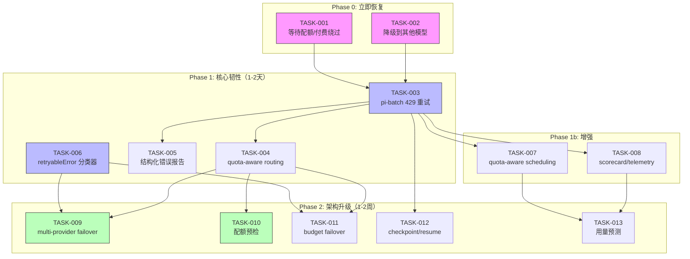
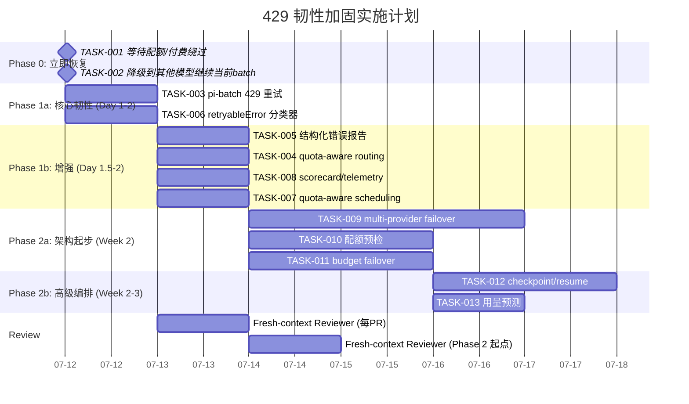

---

# Tech Lead 分析报告：Go API Usage Limit 导致的批量任务失败

## 概述

**故障事件**:`pi-batch.py` 在调用 `pi` agent（通过 opencode.ai 提供 Go 模型）时返回 429 `GoUsageLimitError`。
**影响范围**:当前批量任务链中断，无法继续使用 Go 模型完成后续分析/生成任务。
**根因**:opencode.ai 对 Go 模型实施了 5 小时用量窗口限制，额度已耗尽，需 45 分钟后重置（或付费绕过）。

---

## 1. 任务分解

### 立即恢复任务

| ID | 标题 | 方向 | 涉及文件 | 前置依赖 | 工时 | 验收标准 |
|---|---|---|---|---|---|---|
| **TASK-001** | 等待配额重置或启用付费绕过 | 运营/配额 | 无（操作 opencode.ai 控制台） | 无 | 0.1h | `pi -p "test" --model go` 返回正常 200 |
| **TASK-002** | 降级到 `haiku`/`sonnet` 继续当前工作 | 事故容灾 | 调用方的 YAML/model 参数 | TASK-001 不收即可走捷径 | 0.2h | 指定 `--model haiku` 或 `--model sonnet` 后当前 batch 恢复 |

### 短期加固任务（1-2天）

| ID | 标题 | 方向 | 涉及文件 | 前置依赖 | 工时 | 验收标准 |
|---|---|---|---|---|---|---|
| **TASK-003** | pi-batch 加入 429 智能重试（退避+切换 fallback model） | 韧性运行时 | `pi-batch.py`（`run_task`/`_run_task_process`） | 无 | 3h | 429 不 exit 1；自动 waiting + retry；可配 fallback model；日志记录配额耗尽事件 |
| **TASK-004** | 实现 model-level quota-aware routing | 学习闭环/路由 | `forge-core/internal/routing/` + `modes.yml`（可选） | TASK-003 | 3h | `forge route` 获悉 model 的剩余配额；配额低时自动降档 |
| **TASK-005** | pi-batch 输出结构化错误报告（含 retry-after 等 header 信息） | 可观测性 | `pi-batch.py`（`save_result`） | TASK-003 | 1h | 输出文件 `stderr` 段含 retry-after、quota reset、alternate endpoints |
| **TASK-006** | 为 forge-core 的 AgentExecutor 增加 `retryableError` 分类器 | 韧性运行时 | `forge-core/cmd/forge/cost.go` + `internal/error`（新包） | 无 | 3h | 429/503 被标记为 Retryable；不走 fail-closed 而走 backoff+retry |
| **TASK-007** | 为 pi-batch 实现 `--quota-aware-scheduling` 模式 | 编排 | `pi-batch.py`（`run_serial`/`run_parallel`） | TASK-003 | 2h | 在大批量任务中 model A 耗尽后自动切 model B，不引发整批失败 |
| **TASK-008** | 接入 scorecard/telemetry: 记录 429 事件频率 → 成本+延迟 | 学习闭环 | `pi-batch.py` 或 `forge-core/internal/trace/` | TASK-003 | 2h | 429 事件写入 trace.jsonl，scorecard 展示 p95 429 率 |

### 中期架构任务（1-2周）

| ID | 标题 | 方向 | 涉及文件 | 前置依赖 | 工时 | 验收标准 |
|---|---|---|---|---|---|---|
| **TASK-009** | 实现 multi-provider failover 框架（opencode.ai API key rotation / LiteLLM） | 韧性运行时 | 新 `internal/provider/` + 配置层 | TASK-006 | 8h | provider A 429 → 自动切 provider B（API 兼容），零代码改动 |
| **TASK-010** | 配额预检（`forge preflight --check-quota`） | 可观测性 | `forge-core/cmd/forge/preflight.go` | TASK-004 | 2h | CLI 执行前检查所用 model 的配额状态、预估剩余用量、提前告警 |
| **TASK-011** | forge-core 加入 model cost budget 耗尽时 failover | 韧性运行时 | `forge-core/cmd/forge/budget_tier_test.go` 扩展 | TASK-009 | 4h | 单 model 预算耗尽后 autofailover 到同 tier 另一 model |
| **TASK-012** | 批量任务 checkpoint/resume：429 中断后从断点继续 | 编排 | `pi-batch.py` + `forge-core/internal/persist/` | TASK-003 | 4h | 批处理到第 N 个任务中断，重跑时从 N 继续 |
| **TASK-013** | 用量预测+调度：基于历史用量推算窗口内剩余容量 | 编排 | `pi-batch.py` + `internal/telemetry/` | TASK-007 | 3h | 大批量任务提交时预测各 model 可用配额，自动跨 window 拆分 |

---

## 2. 执行顺序



### 并行组标注

| 并行组 | 任务 | 说明 |
|---|---|---|
| **G0: 立即恢复** | TASK-001, TASK-002 | 互不依赖，可同时进行 |
| **G1: 核心韧性** | TASK-003, TASK-006 | 无交叉依赖，各自独立实现 |
| **G2: 增强** | TASK-005, TASK-007, TASK-008 | 均在 TASK-003 基础上进行 |
| **G3: 架构层** | TASK-009, TASK-010 | provider failover + 预检独立实现 |
| **G4: 高级编排** | TASK-011, TASK-012, TASK-013 | 依赖前序层完成 |

---

## 3. 技术风险

### ⚠️ 高风险

| 风险 | 描述 | 概率 | 影响 | 缓解策略 |
|---|---|---|---|---|
| **R1: opencode.ai 不暴露 `Retry-After` header** | 目前 429 响应体只给自然语言描述 "Resets in 45min"，无机器可读字段 | 中 | 高——影响退避策略精度 | 降级方案：从响应体正则提取分钟数；不依赖 header 的 strict parsing |
| **R2: 429 静默消耗重试预算** | 若 `max-agent-calls` 或 budget guard 将 429 重试计入限制，会加剧不可用 | 中 | 高 | retryable 错误不计入 agent call budget（Sprint 21 的 guard 已有 `KindRecursionLimit` 模式可复用） |
| **R3: 跨 provider API 不兼容** | opencode.ai 与原始 OpenAI API 或 Anthropic API 存在差异 | 低 | 极高 | `internal/provider` 需 adapter 模式做 request/response 规整化 |
| **R4: 「5 小时窗口」语义不透明** | 不知是滑动窗口还是固定窗口、何时开始计时、冷却是否累加 | 中 | 中 | 保守退避：窗口长度×1.5 作为最坏等待；从 reset text 做廉价启发式 |
| **R5: forge-core 当前零外部依赖** | 引入 provider failover 可能污染纯 stdlib 约束 | 低 | 高 | 保持 `net/http` 原生 HTTP client 做 provider 调用；不引入第三方 SDK |

### 🟡 中风险

| 风险 | 描述 | 策略 |
|---|---|---|
| **R6: pi-batch 是独立 Python 脚本** | 没有与 forge-core 的 telemetry/trace 集成 | 通过 `trace.jsonl` 文件做轻量 bridge；不强耦合 |
| **R7: 429 重试可能放大 OOM risk** | 多次重试的 stdout/stderr 累积 | 复用 Sprint 22 `cappedBuffer` 模式；pi-batch 同样设 max output bytes |
| **R8: 用户手动 `--model` 覆盖与 quata-aware 冲突** | 显式指定 model 应 bypass 自动降级 | 显式 model > 自动 failover > 默认；文档写明优先级 |

### ✅ 低风险

| 风险 | 描述 |
|---|---|
| **R9: 测试覆盖** | 429 重试在单测中容易 mock（mock HTTP response），无需真 API 成本 |
| **R10: checkpoint/resume 的并发控制** | pi-batch 当前单线程串行 + ThreadPoolExecutor；用已完成 task 文件的存在性做轻量 checkpoint 即可 |

---

## 4. 资源评估

### 人员需求

| 角色 | 技能要求 | 数量 | 覆盖任务 |
|---|---|---|---|
| **Go 后端工程师** | Go 标准库、net/http、错误处理模式 | 1 | TASK-006, TASK-009, TASK-011 |
| **Python/全栈工程师** | Python 多线程/异步、subprocess 管理 | 1 | TASK-003, TASK-005, TASK-007, TASK-012 |
| **DevOps/SRE** | API 配额管理、CI/CD 集成、opencode.ai 平台 | 0.5 | TASK-001, TASK-010, TASK-013 |
| **Reviewer** | fresh-context（按 AGENTS.md 纪律） | 1（各轮独立） | 所有 PR |

> 当前阶段 1+1+0.5 = **2.5 人**可并行完成 Phase 0–1。

### 关键里程碑

| 里程碑 | 时间节点 | 交付物 | 依赖 |
|---|---|---|---|
| **M0: 当前 batch 恢复** | 立即（45min 内） | TASK-001 或 TASK-002 执行完成 | 无 |
| **M1: 429 不再导致 batch 彻底死亡** | Day 1 | pi-batch 自动重试+降级 | TASK-003 |
| **M2: 可观测性强** | Day 1.5 | 429 事件入 trace/scorecard | TASK-005, TASK-008 |
| **M3: forge-core 感知配额** | Day 2 | `retryableError` 分类 + quota-aware routing | TASK-004, TASK-006 |
| **M4: multi-provider 高可用** | Week 2 | opencode.ai 不可用自动切备用 provider | TASK-009, TASK-011 |
| **M5: 智能调度** | Week 2+ | 配额预检 + 用量预测 + checkpoint/resume | TASK-010, TASK-012, TASK-013 |

### 阻塞点与应对

| Blocker | 影响范围 | 解决策略 |
|---|---|---|
| **B1: 无法获悉配额具体规则** | TASK-004, TASK-013 | 联系 opencode.ai 支持确认滑动/固定窗口；暂以观察到的 reset 间隔做经验模型 |
| **B2: opencode.ai 没有 API 查询剩余配额** | TASK-010 | 降级：从历史 429 频率推算近似窗口；或靠 `forge route --ping` 做端到端探测 |
| **B3: 无备用 provider** | TASK-009 | 若 opencode.ai 是唯一 provider，TASK-009 改为 key rotation + 多 workspace 平行账户 |
| **B4: 真模型调用需要真实 API 预算** | TASK-006 端到端测试 | 用 mock HTTP 服务器做单测；集成测试 dry-run 模式坐实编排逻辑非 LLM 调用 |

---

## 5. 质量保证

### 单元测试覆盖要求

| 组件 | 最低覆盖要求 | 关键测试用例 |
|---|---|---|
| **429 重试逻辑** (`pi-batch.py` 或新模块) | 90%+ | 429+Retry-After header、429+自然语言 reset、429+无时间信息、非 retryable 4xx 不重试、重试上限耗尽后 fallback、max retries 硬停止 |
| **retryableError 分类器** (`forge-core`) | 85%+ | 429 → retryable、503 → retryable、500 → 非 retryable（默认）、400 → 非 retryable、502 → retryable |
| **model 降级发现** (`quota-aware routing`) | 80%+ | 配额高 → 用原 model、配额中 → 降同 tier、配额低 → 降下一 tier、配额 0 → 不可用、刷新后恢复 |
| **multi-provider failover** (`internal/provider`) | 85%+ | provider A 200 → 返回、provider A 429 → 换 B 重试、A+B 都 429 → 错误上报、A+B 响应体结构不一致 → 正偶化 |
| **checkpoint/resume** (`pi-batch.py`) | 80%+ | 空 checkpoint → 从头开始、部分完成 → 从断点继续、全部完成 → skip all、任务文件被手动修改 → 安全校验 |

### 集成测试策略

| 测试场景 | 方法 | 环境要求 |
|---|---|---|
| pi-batch 真实 429 模拟 | 用 `python -m http.server` mock 返回 429 | 本地无外部依赖 |
| forge-core → pi-batch 全链路 | 构造 mock agent-cmd 返回 429 | 最低（dry-run executor） |
| quota-aware routing 端到端 | `forge route --model go` 配合内存 quota store | 单机 |
| multi-provider failover | 双 mock server（一个 429、一个 200） | 单机 |

### 代码审查要点（按 AGENTS.md reviewer 纪律）

1. **429 响应解析**: 正则/header 解析是否有空指针/panic 路径？
2. **重试预算**: `max-retries` 是否有上限（防无限重试）？是否计入 agent call budget（不应该）？
3. **降级安全性**: 从 `opus` → `haiku` 是否会引入质量回归？是否违反 `production` lifecycle 的 model floor？
4. **向后兼容**: 现有 pi-batch 用户（不配置 fallback）是否行为不变？forge-core 零依赖是否维持？
5. **日志/可观测**: 429 降级是否有显式日志？被降级的 agent phase 是否仍在 trace 中诚实标注？
6. **测试真实性**: mock server 是否真正模拟了 opencode.ai 的响应格式？

### 性能测试需求

| 测试 | 方法 | 通过标准 |
|---|---|---|
| 重试退避延迟 | 连续 5×429，测量总等待时间 | ≤ 配置的 `max_backoff` 总和 |
| 降级不影响正常路径 | mock 200 响应，测量 overhead | ≤ 1ms |
| checkpoint 文件大小 | 1000 任务 checkpoint | ≤ 100KB |
| parallel worker 全法 429 | 10 workers 同时遇 429 → 队列化退避 | 不 panic，不竞态 |

---

## 6. 实施计划

### 甘特图



### 阶段描述

#### Phase 0: 立即恢复（今天，～1h）
- **TASK-001**: 访问 `https://opencode.ai/workspace/wrk_01KXAAQ8XFG5BDCZZKSKGCARNP/go`，启用余额继续使用；或等 45min 自动重置。
- **TASK-002**: 当前批处理任务参数改为 `--model haiku` 或 `--model sonnet`（取决于所需质量），跑完剩余任务。
- **输出**: 当前 batch 恢复运行。

#### Phase 1: 核心韧性（2天）
- **TASK-003**（核心）: `pi-batch.py` 的 `_run_task_process` 和 `run_task` 加入 429 检测→自动退避（exponential backoff，jitter，`max_retries=3`）→ 可配置 fallback model。不 exit 1，只在重试耗尽后 fail。
  - 技术选型: `tenacity` 库？不，零外部依赖原则 → 手写退避循环（重用现有 `time.monotonic()` pattern）。
  - 检测方式: 检查输出文件中 `"GoUsageLimitError"` 或 `"429:"` 或 `status=429`。
  
- **TASK-006**: forge-core 的 `cost.go` 中 `parseAPIError`（新函数）分类错误类型。429/503 = Retryable，其他 = NonRetryable。`Engine` 中调用 agent 后遇到 Retryable → 不触发 fail-closed。

- **TASK-005**（可观测）: `save_result` 在失败文件头部加入结构化元数据 (`retry_after_seconds`, `quota_reset_at`, `fallback_used`)。
  - 示例格式：
    ```markdown
    # TASK FAILED (exit=1, elapsed=1.4s)
    
    ## meta
    - error_type: GoUsageLimitError
    - retry_after_seconds: 2700
    - fallback_model: claude-haiku
    
    ## stderr
    ...
    ```

- **TASK-008**: pi-batch 执行完毕后将 429 事件写入 `trace.jsonl`（`{"event":"quota_exhausted","model":"go","provider":"opencode","duration_ms":...}`），供 forge-core telemetry 消费。

#### Phase 2: 架构升级（1-2周）
- **TASK-009**: 新 `internal/provider` 包，抽象 provider 层：
  - `Provider` interface: `Call(ctx, req) → (resp, retryable error)`
  - `OpenCodeProvider`（当前）| `OpenAIProvider` | `AnthropicProvider`
  - `FailoverProvider`: 包装多个 provider，按配置顺序 fallback
  - 保持 forge-core 零依赖：只用 `net/http` + `encoding/json`

- **TASK-010**: `forge preflight --check-quota` 发送轻量请求探测各 model 是否可用。
  - 若 429 → 打印 "WARNING: model go at opencode.ai: quota exhausted, resets in ~45min"
  - 若 200 → "OK"

- **TASK-012**: pi-batch 加入 checkpoint file（`.pi-batch-checkpoint.json`），记录已完成 task index。重启时检测 → 跳过已完成 → 从断点继续。
  - 与 TASK-003 的 429 重试正交：429 是同任务内重试；checkpoint 是跨进程恢复。

---

## 总结与建议

### 🚨 立即行动（今天）

1. **启用 opencode.ai 余额** 解除 Go 模型限制（最快方案）。
2. **或** 当前 batch 切到 `haiku`/`sonnet`，后续再用 Go。
3. **创建 TASK-003 的 ticket**，这是防止同类事件反复发生的最高杠杆。

### 📌 关键决策点

| 决策 | 选项 | 建议 |
|---|---|---|
| 外部依赖 | 引入 tenacity / 手写退避 | **手写**——保持零外部依赖，ForgeOS 工程红线 |
| 429 重试是否计入 agent budget | 计入 / 不计入 | **不计入**——429 是基础设施限流，不是 agent 执行 |
| provider failover | 代码自动 / 配置驱动 | **配置驱动**——provider 选择属于 DevOps 决策，不应硬编码 |
| checkpoint 粒度 | task 级 / phase 级 | **task 级**——pi-batch 的 task 是原子单位，不需更细粒度 |

### 💡 长期方向

本次 429 事件暴露了一个结构性缺口：**ForgeOS 的 AI 依赖被当作"总是可用"的资源**。Sprint 21-22 完成了 recursion/budget/timeout/memory 四维资源护栏，但在 **provider 可用性**维度的韧性仍然是空白。

本分析提出的 Phase 1–2 任务是把这个"第五维资源护栏"补上，延续 Sprint 21-22 建立的安全护栏模式：

```
Recursion   (Sprint 21)  →  FORGE_AGENT_DEPTH
Budget      (Sprint 21)  →  MaxAgentCalls
Timeout     (Sprint 22)  →  per-phase 超时
Output-Size (Sprint 22)  →  CappedBuffer
Quota       (本分析 Phase 1-2) →  429 重试 + provider failover
```

补完这一块后，ForgeOS 的真点火 `--agent-cmd=claude` 才能从"实验性功能"真正晋升为"生产可依赖"。
