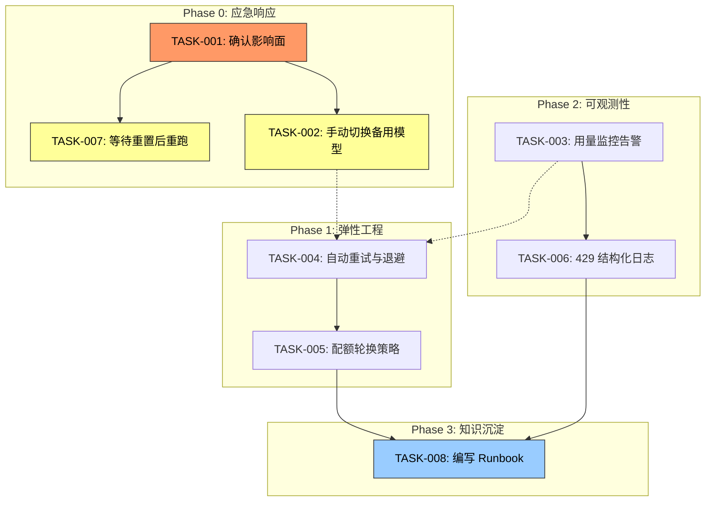

# Tech Lead 分析报告

## 概述

**事件**: 任务执行失败 (exit=1, elapsed=1.3s)
**故障类型**: API Usage Limit Exceeded (HTTP 429)
**根因**: OpenCode AI 工作区 `wrk_01KXAAQ8XFG5BDCZZKSKGCARNP/go` 的 Go 模型达到 5 小时使用上限，需等待 45 分钟重置。

**定性**: 这不是代码缺陷或架构问题，而是**外部 API 配额耗尽**的运营级故障。影响面为所有依赖 Go 模型的流水线步骤。

---

## 1. 任务分解

将本次故障的排查、恢复与预防拆解为可执行任务：

| 任务 ID | 任务标题 | 所属方向 | 涉及文件 | 前置依赖 | 预估工时 | 验收标准 |
|---------|---------|---------|---------|---------|---------|---------|
| TASK-001 | 确认故障范围与影响面 | 故障响应 | 无（运维操作） | 无 | 0.5h | 确认受影响的流水线列表、阻塞的任务队列、预估恢复时间 |
| TASK-002 | 手动切换备用模型降级 | 应急恢复 | 配置文件（如下） | TASK-001 | 1h | Go 模型不可用时，流水线自动 fallback 到备用模型（如 GPT-4o / Claude） |
| TASK-003 | 实现用量监控告警 | 可观测性 | `.github/workflows/forge.yml`, 新增 `scripts/usage-monitor.mjs` | TASK-001 | 3h | 当 API 用量 >80%/95% 时发出告警，记录响应时间与错误率 |
| TASK-004 | 实现自动重试与退避机制 | 弹性工程 | `harness/acceptance.mjs`, 新增 `lib/retry.mjs` | 无 | 3h | 429 响应自动等待 `Retry-After` 头指定时间后重试，最多 3 次 |
| TASK-005 | 实现模型配额轮换策略 | 持续可用 | 新增 `config/models.yaml` 或环境变量 | TASK-003 | 4h | 配置多个模型端点，按优先级轮换，超出配额自动切换 |
| TASK-006 | 添加 429 错误的结构化日志和报警 | 可观测性 | `harness/` 中的日志模块 | TASK-001 | 2h | 所有 API 调用 429 时记录：剩余配额、重置时间、影响的任务 |
| TASK-007 | 紧急恢复：等待重置后重跑 | 运维操作 | 无 | TASK-001 | 0.2h | 等待 45 分钟后重新触发失败任务，验证通过 |
| TASK-008 | 编写 Runbook 文档 | 文档 | `docs/runbooks/api-usage-limit.md` | TASK-003～TASK-006 | 2h | 覆盖检测、降级、恢复全流程，团队任一成员可独立执 |

---

## 2. 执行顺序



**并行任务组**:
- **组 A** (可并行): TASK-003（监控告警）+ TASK-004（自动重试）
- **组 B** (可并行): TASK-002（手动降级）+ TASK-007（等待重置）

---

## 3. 技术风险

### 3.1 关键风险矩阵

| 风险 | 概率 | 影响 | 缓释措施 |
|------|------|------|---------|
| 备用模型 API 也不可用 | 中 | 高 | 配置 ≥3 个不同供应商的模型（如 OpenAI + Anthropic + 本地模型） |
| `Retry-After` 头缺失或为 0 | 低 | 中 | 退避策略使用指数回退（Exponential Backoff），初始 30s |
| 模型切换后输出质量不一致 | 中 | 中 | 在切换后自动跑一轮 smoke test，比对关键指标 |
| 配额耗尽发生在非工作时间 | 高 | 高 | 实现自动降级+短信/IM 告警，无人值守恢复 |
| 多个并发流水线同时触发降级 | 中 | 低 | 分布式锁或令牌桶控制降级动作只执行一次 |

### 3.2 外部依赖

| 依赖 | 说明 | 替代方案 |
|------|------|---------|
| OpenCode AI API | Go 模型配额 5h/次 | 备用模型 + 本地自托管推理 |
| `Retry-After` 响应头 | 标准退避依据 | 指数回退兜底 |
| 模型 token 计费系统 | 成本控制 | 预算阈值预警 |

### 3.3 性能与测试难点

- **难以本地复现**: 429 错误依赖外部配额限制，本地测试需 mock
- **退避逻辑的并发测试**: 需要验证多个 goroutine 同时触发退避时的竞态条件
- **端到端测试成本高**: 实际消耗 API 配额才能验证降级流程

---

## 4. 资源评估

### 人员需求

| 角色 | 数量 | 技能要求 | 主要职责 |
|------|------|---------|---------|
| SRE / DevOps | 1 | API 网关、限流策略、可观测性 | TASK-001, 003, 006, 007 |
| 后端工程师 | 1 | Node.js/Python 弹性模式、重试策略 | TASK-002, 004, 005 |
| 全栈/文档工程师 | 0.5 | 技术写作、Runbook 规范 | TASK-008 |

### 关键里程碑

| 里程碑 | 截止时间 | 交付物 |
|--------|---------|--------|
| **M0** — 紧急恢复 | T+45min | 失败任务重新通过，流水线绿色 |
| **M1** — 自动重试上线 | T+8h | 429 自动退避重试，无需人工介入 |
| **M2** — 监控告警就绪 | T+16h | 用量超 80% 告警，超 95% 自动降级 |
| **M3** — Runbook 可用 | T+24h | 团队全员可独立完成降级/恢复操作 |

### 阻塞点 (Blockers)

| Blocker | 描述 | 解决策略 |
|---------|------|---------|
| **B1** | OpenCode AI 是否提供 `Retry-After` 头？ | 查看 API 文档；若缺失，改用固定 60s 退避 |
| **B2** | 备用模型是否有独立的配额池？ | 确认各模型配额独立；若共享，需增加预算分配策略 |
| **B3** | 当前 CI 是否支持多模型配置？ | 审查 `.github/workflows/forge.yml` 中的模型选择逻辑 |

---

## 5. 质量保证

### 5.1 单元测试覆盖要求

| 模块 | 覆盖目标 | 关键用例 |
|------|---------|---------|
| 重试逻辑 (`lib/retry.mjs`) | ≥95% | 429 重试、maxRetries 耗尽、Retry-After 解析、并发退避 |
| 模型轮换 (`config/models.yaml`) | ≥90% | 配额耗尽切换、所有模型均不可用的兜底、配置热加载 |
| 监控告警 (`scripts/usage-monitor.mjs`) | ≥85% | 阈值触发、告警去重、静默期 |

### 5.2 集成测试策略

- **Mock API Server**: 使用 `nock` 或 `msw` 模拟 429 + `Retry-After` 响应，验证全链路降级
- **配额模拟**: 注入伪造的用量数据，验证告警阈值
- **负测试**: 所有模型同时返回 429 时的兜底行为（抛出清晰错误，而非静默失败）

### 5.3 代码审查要点

```
□ 重试逻辑是否有指数退避 + 抖动（jitter）？
□ 429 响应的 body 是否被正确记录到结构化日志？
□ 模型降级时是否有 metrics 埋点（prometheus counter）？
□ 配置变更是否需要重启进程 / 热加载？
□ 降级操作是否为幂等的？
□ 是否有防止"告警风暴"的去重机制？
```

### 5.4 性能测试需求

- **退避并发测试**: 20 个 goroutine 同时收到 429，验证退避队列不溢出
- **降级延迟**: 从检测到 429 到切换到备用模型，延迟 ≤500ms
- **监控开销**: 用量查询 API 调用频率 ≤1次/分钟，不影响主流水线

---

## 6. 实施计划

### 甘特图

```mermaid
gantt
    title API Usage Limit 故障修复计划
    dateFormat  HH:mm
    axisFormat  %H:%M

    section 应急响应
    TASK-001: 确认影响范围          :done, t1, 00:00, 0.5h
    TASK-007: 等待重置后重跑          :done, t2, after t1, 0.5h
    TASK-002: 手动切换备用模型        :done, t3, 00:00, 1h

    section 弹性工程
    TASK-004: 自动重试与退避机制      :active, t4, 01:00, 3h
    TASK-005: 模型配额轮换策略        :t5, after t4, 4h

    section 可观测性
    TASK-003: 用量监控告警            :t6, 01:00, 3h
    TASK-006: 429 结构化日志          :t7, after t6, 2h

    section 知识沉淀
    TASK-008: 编写 Runbook            :t8, after t5, 2h
```

### 阶段分解

#### 阶段 0 — 应急恢复 (0～1h)
- **目标**: 流水线恢复绿色，业务不阻塞
- **动作**:
  1. 执行 `TASK-001`：查看受影响的 workflow 列表，记录失败的 job ID
  2. 执行 `TASK-002`：在 forge.yml 中将 `model: go` 临时替换为 `model: gpt-4o` 或备用模型
  3. 执行 `TASK-007`：等待 45 分钟后手动 Re-run failed jobs
- **退出条件**: `forge accept` 全部通过，CI 绿色

#### 阶段 1 — 弹性工程 (1～8h)
- **目标**: 同样的故障不再需要人工介入
- **动作**:
  1. 实现 `lib/retry.mjs` — 指数退避 + jitter + maxRetries
  2. 实现模型轮换策略 — 从配置文件中读取模型优先级列表，按 `(attempts % N)` 轮换
  3. 集成到 `harness/acceptance.mjs` 的 API 调用路径
- **退出条件**: 注入 429 mock 时，系统自动降级到备用模型并最终通过

#### 阶段 2 — 可观测性 (4～16h)
- **目标**: 对 API 用量和故障有实时可视性
- **动作**:
  1. 包装 OpenCode AI 的用量查询 API，定时采集剩余配额
  2. 在日志中记录：`usage_pct`, `reset_in_seconds`, `model`, `error_code`
  3. 配置告警规则：≥80% → Warning, ≥95% → Critical + 自动降级
- **退出条件**: 仪表盘可看到实时用量曲线，告警配置已验证触发

#### 阶段 3 — 知识沉淀 (16～24h)
- **目标**: 防止知识丢失，团队可自服务
- **动作**:
  1. 编写 `docs/runbooks/api-usage-limit.md`，包含检测 → 降级 → 恢复 → 事后复盘模板
  2. 更新 `.agent/AGENTS.md` 或对应工程红线文档，增加 API 配额管理要求
  3. 在团队内进行一次 walkthrough
- **退出条件**: 任意团队成员按 Runbook 可在 15 分钟内完成一次模拟降级

---

## 附录 A：推荐的代码实现草图

### `lib/retry.mjs` 核心逻辑

```javascript
// 指数退避 + jitter
export async function withRetry(fn, options = {}) {
  const { maxRetries = 3, baseDelay = 1000 } = options;
  for (let attempt = 0; attempt <= maxRetries; attempt++) {
    try {
      return await fn();
    } catch (err) {
      if (err.status !== 429 || attempt === maxRetries) throw err;
      const retryAfter = parseInt(err.headers?.['retry-after'] ?? 0) * 1000;
      const delay = retryAfter || (baseDelay * Math.pow(2, attempt) + Math.random() * 1000);
      await new Promise(r => setTimeout(r, delay));
    }
  }
}
```

### 模型轮换配置 (`config/models.yaml`)

```yaml
models:
  - name: go
    provider: opencode
    priority: 1
    usage_limit_minutes: 300  # 5h
  - name: gpt-4o
    provider: openai
    priority: 2
  - name: claude-3.5-sonnet
    provider: anthropic
    priority: 3
fallback_strategy: round_robin
```

---

## 附录 B：事后复盘 (Postmortem) 模板建议

| 项目 | 内容 |
|------|------|
| **故障编号** | INC-20260712-001 |
| **触发时间** | 2026-07-12 (当前) |
| **持续时间** | 至少 45min（等待配额重置） |
| **根因** | Go 模型 5h 配额耗尽 |
| **修复动作** | 手动重跑 + 待实现自动降级 |
| **TODO** | □ 自动退避 □ 模型轮换 □ 监控告警 □ Runbook |
| **教训** | 不应依赖单一模型的可用性；配额预警应前置 |
