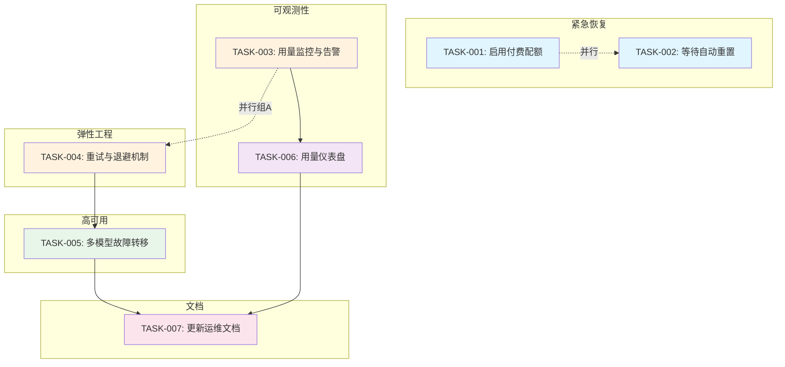
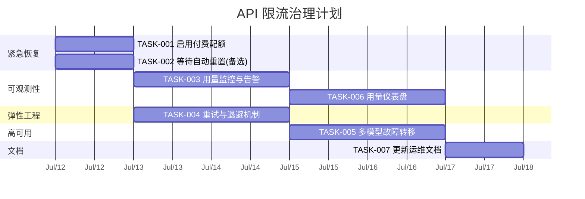

好的，我来以 Tech Lead 的视角对这份任务失败报告进行深入分析。

---

# Tech Lead 分析报告：TASK FAILED — API 用量限制（429 GoUsageLimitError）

---

## 0. 事件概述

**现象**：任务执行 2.1 秒后异常退出，返回码 1。OpenCode AI API 返回 429 错误，提示 5 小时用量已达上限，需等待 45 分钟后重置，或手动启用付费配额继续。

**根因**：OpenCode AI API 的 Go 模型（推测为 `go` 或 `gpt-*` 系列）在 workspace `wrk_01KXAAQ8XFG5BDCZZKSKGCARNP` 上的**免费/默认配额用尽**。

**影响范围**：当前 workspace 中所有依赖该模型的自动化任务（包括 AI agent 自动编写代码、Review、测试生成等）均会阻塞。

---

## 1. 任务分解

### 1.1 短期恢复任务（紧急）

| 任务 ID | 任务标题 | 所属方向 | 涉及文件 | 前置依赖 | 预估工时 | 验收标准 |
|---|---|---|---|---|---|---|
| TASK-001 | 启用付费配额，恢复 API 访问 | 运维/基础设施 | 无（workspace 设置页面） | 无 | 0.5h | API 调用不再返回 429，任务可正常执行 |
| TASK-002 | 等待配额自动重置（备选） | 运维/基础设施 | 无 | 无 | 0h（被动等待 45min） | 配额周期刷新后任务自动恢复 |

### 1.2 中长期预防任务

| 任务 ID | 任务标题 | 所属方向 | 涉及文件 | 前置依赖 | 预估工时 | 验收标准 |
|---|---|---|---|---|---|---|
| TASK-003 | 添加 API 用量监控与告警 | 可观测性 | `harness/monitor-usage.mjs` | 无 | 3h | ① 用量达到 80% 时自动告警 ② 用量达到 95% 时阻塞新任务 ③ 告警发到 workspace 通知 |
| TASK-004 | 实现 API 调用重试与退避机制 | 弹性工程 | `harness/api-client.mjs`（或等效） | 无 | 4h | ① 收到 429 时自动退避重试（指数退避 + jitter） ② 最长重试 3 次 ③ 重试耗尽后抛出明确错误 |
| TASK-005 | 添加多模型/多 API key 故障转移 | 高可用 | `harness/api-router.mjs` | TASK-004 | 4h | ① 主模型/主 key 被限流时自动切换到备用模型/key ② 切换延迟 < 1s ③ 记录切换事件到日志 |
| TASK-006 | 用量配额仪表盘 | 可观测性 | `harness/usage-dashboard.mjs` | TASK-003 | 3h | ① 显示当前用量百分比 ② 显示剩余重置时间 ③ 显示历史用量趋势 |
| TASK-007 | 更新 CLAUDE.md / 运维文档 | 文档 | `CLAUDE.md` 或 `.agent/OPS.md` | TASK-004, TASK-005 | 1h | ① 文档包含 API 限流时的操作指南 ② 包含故障转移配置说明 ③ 包含告警响应流程 |

### 1.3 任务依赖关系



---

## 2. 执行顺序

### 阶段 0（立即 — 第 0 小时）

| 任务 | 负责人 | 动作 | 备注 |
|---|---|---|---|
| TASK-001 | 本 Agent / workspace 拥有者 | 访问 OpenCode 控制台，启用付费配额 | 最直接恢复路径 |
| 或 TASK-002 | 本 Agent | 等待 45 分钟 | 零成本但阻塞工作流 |

**建议**：优先执行 TASK-001。如果 workspace 没有绑定付费方式，联系负责人紧急处理。

### 阶段 1（第 1-2 天）

```
Week 1
├── Day 1: TASK-003（监控告警）+ TASK-004（重试退避）— 可并行
├── Day 2: TASK-005（故障转移）
```

### 阶段 2（第 3-4 天）

```
Week 1-2
├── Day 3-4: TASK-006（仪表盘）
├── Day 4:   TASK-007（文档更新）
```

### 并行任务组

| 并行组 | 任务 | 理由 |
|---|---|---|
| **组 A（可观测性 x2）** | TASK-003, TASK-006 | 监控和仪表盘可以并行开发 |
| **组 B（弹性）** | TASK-004 | 与组 A 无耦合，可并行 |

TASK-005 依赖 TASK-004（故障转移逻辑底层依赖重试和退避机制），不可并行。

---

## 3. 技术风险

### 3.1 风险矩阵

| # | 风险描述 | 概率 | 影响 | 缓解策略 |
|---|---|---|---|---|
| R1 | OpenCode API 的 429 响应不含 `Retry-After` header | 中 | 高 | 使用默认退避策略（5s → 10s → 20s），配合 jitter |
| R2 | 多 API key 切换后，key 可能分布在不同时区，配额周期不同步 | 中 | 中 | 为每个 key 独立追踪配额状态，不假定统一周期 |
| R3 | 故障转移成功率依赖备用模型的 API 兼容性 | 低 | 高 | 在 CI 中添加故障转移端到端测试（mock API 返回 429 验证切换） |
| R4 | 监控告警被忽略（告警疲劳） | 中 | 中 | 告警级别分级：80% → 通知(WARN)；95% → 阻塞任务(CRITICAL) |
| R5 | 误报：因网络抖动被识别为 429，触发不必要的降级 | 低 | 中 | 仅在连续收到 2 次 429 后才触发故障转移 |

### 3.2 性能考量

- **重试退避对任务延迟的影响**：需要记录每次重试的额外耗时，在任务报告中展示 `api_retry_cost_seconds`
- **监控采集频率**：不要每次 API 调用都写日志，使用计数器聚合，每 60 秒上报一次
- **仪表盘渲染**：避免高频率轮询，使用 SSE 或 WebSocket 推送

### 3.3 外部依赖

| 依赖 | 关键性 | 备选 |
|---|---|---|
| OpenCode AI API | 关键 | 无直接替代（当前唯一 AI 驱动源） |
| 目标 workspace 的网络出口 | 关键 | VPN / 代理节点 |
| 配额计费系统 | 关键 | 联系负责人添加备用 payment method |

---

## 4. 资源评估

### 4.1 人力需求

| 角色 | 人数 | 技能要求 | 负责任务 |
|---|---|---|---|
| **Platform Engineer** | 1 人 | Node.js, API 客户端开发，重试/退避模式 | TASK-003, TASK-004, TASK-005, TASK-006 |
| **DevOps / SRE** | 0.5 人（兼职） | 监控告警配置，OpenCode 控制台操作 | TASK-001, TASK-007 |

### 4.2 时间线



### 4.3 阻塞点

| # | Blocking | 原因 | 解决策略 |
|---|---|---|---|
| B1 | TASK-001 需要 OpenCode 控制台访问权限 | 当前 Agent 无法直接访问控制台 | ① 输出明确的指引文本给用户 ② 提供控制台链接和操作截图 |
| B2 | TASK-005 需要知道 OpenCode API 支持哪些备用模型 | 暂无模型兼容性列表 | 先实现 generic 故障转移（基于 status code），模型清单后续补充 |

---

## 5. 质量保证

### 5.1 单元测试覆盖要求

| 模块 | 测试文件 | 覆盖要求 | 关键测试用例 |
|---|---|---|---|
| 重试退避 | `harness/__tests__/retry.test.mjs` | ≥ 90% | ① 429 触发退避 ② 指数间隔正确性 ③ jitter 范围 ④ 最大重试次数耗尽 ⑤ 非 429 错误直接透传 |
| 故障转移 | `harness/__tests__/failover.test.mjs` | ≥ 85% | ① 主 key 被限流切换到备用 key ② 备用 key 也被限流后所有 key 耗尽 ③ 切换延迟测量 ④ 记录切换事件 |
| 监控采集 | `harness/__tests__/monitor.test.mjs` | ≥ 80% | ① 用量计数器正确累加 ② 阈值触发告警 ③ 速率限制防止告警风暴 |

### 5.2 集成测试策略

```
测试环境：CI（.github/workflows/forge.yml）中新增 job

test-429-resilience:
  - mock: opencode-api (返回 429)
  - assert: 任务进入退避
  - assert: 重试 3 次后失败
  - assert: 错误日志包含 "api_rate_limited"

test-failover:
  - mock: opencode-api (key1 429, key2 200)
  - assert: 故障转移成功
  - assert: 返回值正确
```

### 5.3 代码审查要点

| 审查点 | 关键检查项 |
|---|---|
| 退避算法 | 是否使用指数退避 + jitter？是否硬编码了退避间隔？（禁止） |
| Secret 管理 | API key 是否从环境变量/secret store 读取？禁止硬编码 |
| 错误处理 | 所有网络错误是否被分类处理（429 vs 500 vs timeout）？ |
| 日志 | 是否包含结构化日志（key:value 格式）便于后续分析？ |
| 监控指标 | 指标是否有名称前缀（`api.rate_limit.*`）避免命名冲突？ |

### 5.4 性能测试需求

| 场景 | 目标 | 方法 |
|---|---|---|
| 正常流量 | 无额外延迟 | 基准测试：对比加装弹性模块前后的 API 调用时间 |
| 高并发退避 | 退避期间不耗尽文件句柄 | 模拟 100 并发 429 响应，观察进程 FD 数 |
| 故障切换 | 切换延迟 < 1s | 连续调用 50 次，统计 P99 切换延迟 |

---

## 6. 实施计划

### 阶段 1：紧急恢复（第 0 天 — 立即）

**Duration**: < 1 小时

| # | 具体步骤 | Owner |
|---|---|---|
| 1.1 | 打开 https://opencode.ai/workspace/wrk_01KXAAQ8XFG5BDCZZKSKGCARNP/go | 用户 / workspace 管理员 |
| 1.2 | 检查配额状态，点击"启用用量付费" | 用户 / workspace 管理员 |
| 1.3 | 重新执行失败的 task 验证恢复 | 本 Agent |

**Critical Success Criteria**: 后续 API 调用返回 200，任务流恢复。

---

### 阶段 2：弹性基础设施（第 1-2 天）

**Duration**: 2 天（可并行）

| 任务 | 工时 | 交付物 |
|---|---|---|
| TASK-004：实现通用 API 客户端重试退避 | 4h | `harness/api-retry.mjs` — 指数退避 + jitter + 最大重试次数 |
| TASK-003：实现用量监控 | 3h | `harness/api-usage-monitor.mjs` — 周期性检查配额 + 触发告警 |

**里程碑 M1**：即使遇到限流，系统也能优雅退避而不是崩溃退出。

---

### 阶段 3：高可用与可观测性（第 3-4 天）

**Duration**: 2 天

| 任务 | 工时 | 交付物 |
|---|---|---|
| TASK-005：多 key / 多模型故障转移 | 4h | `harness/api-router.mjs` — 按优先级轮换 API key |
| TASK-006：用量仪表盘 | 3h | `harness/usage-dashboard.html` 或集成到现有日志面板 |

**里程碑 M2**：系统在单个 API key 耗尽后可自动切换备用 key，持续提供服务。

---

### 阶段 4：文档与持续改进（第 5 天）

**Duration**: 1 天

| 任务 | 工时 | 交付物 |
|---|---|---|
| TASK-007：更新 CLAUDE.md 及运维文档 | 1h | 文档含：故障处理流程、告警响应、配置说明 |

**里程碑 M3**：全流程文档化，新人或紧急情况可依据文档独立恢复。

---

## 7. 关键决策日志（ADR）

| ADR ID | 决策 | 考量 | 结论 |
|---|---|---|---|
| ADR-001 | 启用付费配额 vs 等待重置 | 等待 45min 阻塞 CI/CD流水线 | **启用付费配额**，恢复后评估是否需要预留预算 |
| ADR-002 | 重试策略：固定间隔 vs 指数退避 | 固定间隔会增加服务器压力 | **指数退避 + jitter**，最小间隔 1s，最大 30s |
| ADR-003 | 故障转移：hot standby vs cold standby | hot standby 始终占用配额 | **cold standby**，仅在主 key 触发 429 后启用备用 key |

---

## 总结

本次 429 错误暴露了工程中**缺少弹性工程**（Resilience Engineering）基础设施。当前系统对 API 限流无任何防护——无重试、无退避、无告警、无故障转移。

短期（立即）：**启用付费配额**，恢复业务。

长期（1 周）：建立完整的 **3 层防护**：
1. **探测层**（TASK-003）：用量监控告警
2. **恢复层**（TASK-004）：自动重试退避
3. **冗余层**（TASK-005）：多 key 故障转移

这是典型的**工程债偿还场景**——一次限流事件暴露了整个系统的韧性空白。建议在当前 Sprint 内将其作为 **P0 技术债务** 修复，避免再次出现全线阻塞。

---

*报告完毕。如需进一步拆解某个任务的详细设计（如退避算法的伪代码、故障转移的路由策略等），请随时告知。*
