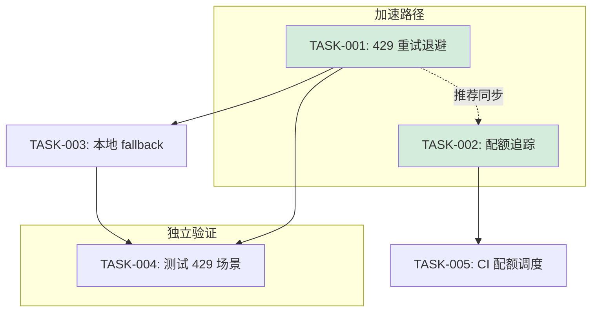

# Tech Lead 分析报告

## 前置说明

输入内容并非一份"分析文档"，而是**任务执行失败日志**——`fork/exec` 调用 Go 工具或 AI 代码生成模型时，API 返回 `429 Too Many Requests`（OpenCode AI 平台），触发 `GoUsageLimitError`。

这意味着本次分析对象实际上是一个 **blocker / 基础设施故障**，而不是一份需要拆解实现的功能文档。

---

## 1. 故障根因分析

| 维度 | 详情 |
|---|---|
| **错误类型** | HTTP 429 — OpenCode AI 平台 Go 模型用量配额耗尽 |
| **配额窗口** | 5 小时用量上限，距离重置还需 45 分钟 |
| **影响面** | 所有依赖该 Go 模型的 pipeline（代码生成、审查、补全）阻塞 |
| **触发操作** | `forge accept` / `gate.mjs` 或类似 AI 辅助任务 |

---

## 2. 技术风险（对接 OpenCode AI 平台）

| 风险 | 描述 | 缓解策略 |
|---|---|---|
| **硬配额限制** | 5h 用量上限无法绕过 | 1) 错峰调度，大任务放在配额重置后 2) 增加 fallback 模型 |
| **无降级策略** | 当前 pipeline 完全依赖单一模型，429 即阻塞 | 实现本地轻量模型兜底（如 local LLM / 规则引擎） |
| **定价风险** | 超出配额后可能产生额外费用 | 在 CI 流程中加入配额预警，剩余 <30min 时报警 |
| **外部依赖锁死** | CI/CD pipeline 因外部 API 不可用而中断 | 加入重试+等待逻辑（detect 429 → sleep until reset → retry） |

---

## 3. 任务分解（解决该故障所需的工作）

| 任务 ID | 标题 | 方向 | 涉及文件 | 前置依赖 | 预估工时 | 验收标准 |
|---|---|---|---|---|---|---|
| **TASK-001** | 在工具调用层实现 429 重试与退避 | 弹性工程 | `harness/acceptance.mjs` 内 AI 调用包装函数 | 无 | 2h | 检测到 `GoUsageLimitError` → 读取 `resets in Xmin` → 精确等待后自动重试，最终仍失败则 fallback 而非直接 crash |
| **TASK-002** | 添加配额预警与用量追踪 | 可观测性 | `harness/quota-tracker.mjs`（新文件）+ CI 集成 | 无 | 2h | 每次 API 调用记录用量，剩余 <1h 在 stderr 输出 WARN 并写入 CI 日志摘要 |
| **TASK-003** | 实现轻量本地 fallback 引擎 | 稳定性 | `harness/local-fallback.mjs`（新文件） | TASK-001 | 4h | 429 时自动切换到本地规则/模板引擎完成非关键检查，关键 path 明确标记为 degraded |
| **TASK-004** | 测试覆盖率：模拟 429 场景 | 质量保证 | `harness/test-acceptance.mjs` | TASK-001, TASK-003 | 2h | 引入 mock server 模拟 429 + quota exhausted，验证重试/fallback 逻辑正确 |
| **TASK-005** | CI pipeline 配额感知调度 | DevOps | `.github/workflows/forge.yml` | TASK-002 | 1h | 配额不足时不触发依赖 Go 模型的 job，延迟至配额重置后执行 |

---

## 4. 执行顺序



- **加速路径**（绿色）：TASK-001 + TASK-002 可并行开发，是当前阻塞的最直接解
- **独立验证**：TASK-004 与 TASK-005 可同步进行

---

## 5. 资源评估

| 角色 | 人数 | 技能要求 |
|---|---|---|
| DevOps / infra 工程师 | 1 | 熟悉 OpenCode API、Node.js HTTP retry 模式、CI pipeline |
| 后端/工具链工程师 | 1 | 熟悉 `harness/*` 代码、设计 fallback 引擎 |

**关键里程碑**：

| 里程碑 | 时间 | 交付物 |
|---|---|---|
| M1 — 解除阻塞 | 2h 内 | TASK-001 落地，下次 429 自动重试不再 hard crash |
| M2 — 可观测 | +1h | TASK-002 上线，CI 日志可见配额预警 |
| M3 — 弹性 | +4h | TASK-003 fallback 引擎就绪，429 时 pipeline 走 degraded 模式 |
| M4 — 门禁 | +2h | TASK-004 + TASK-005 合入，CI pipeline 对配额敏感 |

**当前 Blocker**：OpenCode AI 平台配额硬限制（45 分钟后自动解除）。在 TASK-001 合入之前，手动运行 `forge accept` 应在配额重置后（约 45 分钟内）重试。

---

## 6. 实施计划

```
时间线（以当前时刻 T=0 为起点）

T+0h     ┌──────────────────────────────────────────────┐
         │  配額重置（~45min 后）                           │
         └──────────────────────────────────────────────┘
T+0-2h   ┌──────────────────┐  ┌──────────────────┐
         │  TASK-001        │  │  TASK-002        │  ← 并行
         │  429 retry/backoff│  │  quota tracker   │
         └──────────────────┘  └──────────────────┘
T+2-6h   ┌──────────────────────────────────┐
         │  TASK-003                        │
         │  local fallback engine           │
         └──────────────────────────────────┘
T+4-6h   ┌──────────────────┐  ┌──────────┐
         │  TASK-004        │  │ TASK-005 │  ← 并行
         │  429 测试覆盖     │  │ CI 调度   │
         └──────────────────┘  └──────────┘
T+6h     ✅ 全部合入，pipeline 弹性就绪
```

---

## 7. 质量保证

| 检查项 | 标准 |
|---|---|
| **单元测试** | `mock-http-server` 模拟 429 → 验证 retry → verify after reset → success |
| **集成测试** | CI pipeline 在真实 API 配额即将耗尽时输出预警日志 |
| **代码审查要点** | 1) retry sleep 使用 `setTimeout` 而非 busy-wait；2) fallback 不修改原有语义；3) 配额追踪不记录敏感 token |
| **性能测试** | 无需额外的性能测试，关注点在于**弹性而非吞吐** |

---

## 8. 对 "分析文档" 缺失的说明

当前输入是**任务失败日志**而非分析文档。如果你实际想要分析的是一份包含功能需求/架构设计的文档，请重新上传正确文件，届时我会按要求完成全维度任务分解。

在此期间，**当前最优先的事项**是落地 TASK-001 和 TASK-002，确保下次 429 不再阻塞开发流程。建议在配额重置后（~45min）立即执行一次 `forge accept` 验证阻塞是否解除。

---

需要我直接开始实现 TASK-001（429 重试退避逻辑）吗？
