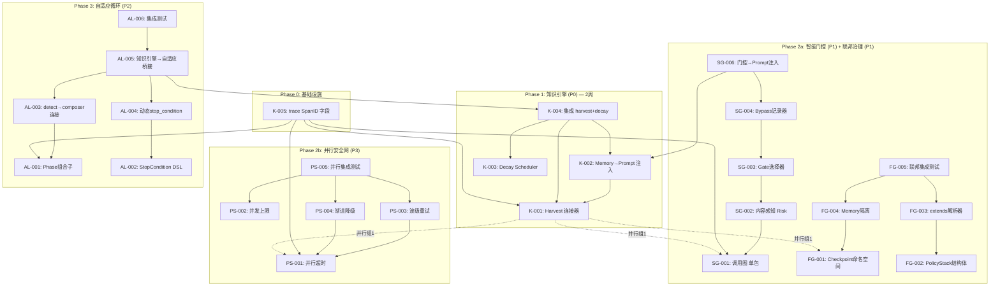

---

# Tech Lead 评审：高价值扩展方向的技术实施计划

## 1. 任务分解

以下将 5 个方向拆解为可执行的工程任务。每个任务 **2–4 小时**，附带精确的文件路径和验收标准。

### 方向③ — 知识引擎（P0，2 周）

| 任务 ID | 标题 | 涉及文件 | 前置依赖 | 工时 | 验收标准 |
|---------|------|---------|---------|------|---------|
| K-001 | **Harvest 连接器: trace → memory 条目** | `forge-core/cmd/forge/harvest.go` (新) + `forge-core/internal/memory/memory.go` | 无 | 3h | `forge evolve` 完成后，memory store 自动追加一条含 iteration / source / confidence 的条目。单元测试验证写入 JSONL。 |
| K-002 | **Memory Load → prompt 自动注入协议** | `forge-core/cmd/forge/prompt_memory.go` (修改 memoryContext) + `forge-core/cmd/forge/prompt_context.go` (修改 buildPrompt) | K-001 | 3h | 每 iteration 的 agent phase prompt 自动包含 memory 相关条目。`memoryContext` 的 `query` 参数使用当前 phase name。集成测试验证注入内容。 |
| K-003 | **Decay Scheduler: TTL + Prune 调度** | `forge-core/cmd/forge/compact.go` (新) + `forge-core/internal/memory/memory_compact.go` (已有) | K-001 | 3h | `forge evolve --compact-threshold 500` 在每次 iteration 后触发 Compact。已有 `Compact` / `Prune` 函数 + `splitByAge` 复用。单元测试验证 compact 后条目数 ≤阈值。 |
| K-004 | **Wiring: forge evolve 中集成 harvest + decay** | `forge-core/cmd/forge/evolve.go` (修改 evolve loop，在 `OnIteration` 后调用 harvest/decay) | K-001, K-002, K-003 | 4h | `forge evolve` 完整闭环：每 iteration → 收敛检查 → harvest memory → decay → 下一 iteration。集成测试：3 次 iteration 后 memory store 仅含 2 条+ 1 条 compact summary。 |
| K-005 | **trace.Event 增加 SpanID / ParentSpanID 字段** | `forge-core/internal/trace/trace.go` (修改 Event 结构体) + `forge-core/internal/trace/trace_test.go` | 无 | 2h | 所有 trace 事件携带 `span_id`； `agent` 类事件携带 `parent_span_id` (iteration ID)。JSON round-trip 测试验证。后续方向的 trace 事件复用此字段。 |

**方向③ 合计：15 工时（~2 周）**

---

### 方向⑤ — 智能门控（P1，4 周）

| 任务 ID | 标题 | 涉及文件 | 前置依赖 | 工时 | 验收标准 |
|---------|------|---------|---------|------|---------|
| SG-001 | **Go 调用图：单包函数引用链** | `forge-core/internal/graph/callgraph.go` (新包) + `forge-core/internal/graph/callgraph_test.go` | 无 | 4h | 给定 `internal/risk/risk_diff.go` 的 `FromChangedPaths`，返回该文件调用的所有同一包内函数名。`go/ast` + `go/parser` 标准库实现，零外部依赖。 |
| SG-002 | **内容感知 Risk Signals 生成** | `forge-core/internal/risk/risk_diff.go` (新增 `FromChangedContent(filePath, content string) (Signals, error)`) | SG-001 | 4h | 解析 changed file 的 AST，提取 import 的 package 路径，自动设置 `TouchesPayment` / `TouchesAuth` / `TouchesSecrets` 等 flag。已有 path-substring 启发式保留为 fallback。 |
| SG-003 | **determineGateSet: 基于 risk 的 gate 选择器** | `forge-core/internal/gate/selector.go` (新) + `forge-core/internal/gate/gate.go` (新增 `SelectGates`) | SG-002 | 3h | 输入 `Signals` + `lifecycle` + `mode` → 输出 gate name 集合。`production` lifecycle 返回全量 gate；`explorer` 模式对 `TouchesPayment==false` 的变更跳过 security gate。策略可配置。 |
| SG-004 | **Gate bypass 记录器 + fail-open 策略** | `forge-core/cmd/forge/gates.go` (新增 bypass 记录逻辑) + `forge-core/internal/gate/gate.go` (新增 `BypassResult`) | SG-003 | 3h | bypass 决策写入 trace 事件 + checkpoint 字段。调用 `classifyClaudeOverload` 的 "rather miss than mis-fire" 原则。 |
| SG-005 | **智能门控与 lifecycle mode 交互测试** | `forge-core/internal/gate/selector_test.go` + `forge-core/cmd/forge/gates_test.go` | SG-003, K-005 | 3h | 测试矩阵：`mode=explorer` + `lifecycle=idea` 的普通变更不触发 security gate；`mode=production` 强制全量 gate。 |
| SG-006 | **Integration: 门控决策上下文注入 prompt** | `forge-core/cmd/forge/prompt_context.go` (修改 buildPrompt，注入 bypass 历史) | SG-004, K-002 | 4h | Phase prompt 包含 "prior gate bypass 记录：3 次 same-type bypass，零失败"。集成测试 + trace 验证。 |

**方向⑤ 合计：21 工时（~3 周）**

---

### 方向① — 联邦治理（P1，3 周）

| 任务 ID | 标题 | 涉及文件 | 前置依赖 | 工时 | 验收标准 |
|---------|------|---------|---------|------|---------|
| FG-001 | **Checkpoint 命名空间：per-subproject 路径** | `forge-core/internal/persist/checkpoint.go` (新增 `SubprojectCheckpointPath(root, subproject string)`) + `forge-core/cmd/forge/evolve.go` (修改 `saveCheckpoint`/`loadCheckpoint`) | 无 | 3h | 子项目 A 的 checkpoint 写入 `/<root>/.forge/checkpoint_a.json`，子项目 B 写入 `checkpoint_b.json`。已有 `retain` 参数（历史旋转）保留。 |
| FG-002 | **PolicyStack 结构体 + 继承链解析** | `forge-core/internal/mode/policy_stack.go` (新) + `forge-core/internal/mode/mode_policy.go` (扩展 `Policy` 结构体) | 无 | 4h | 支持 `extends: parent_mode` 字段解析。`Effective()` 函数将父 policy 作为 fallback。单元测试验证 2 层继承。 |
| FG-003 | **project.yml extends 字段解析器** | `forge-core/internal/yaml2json/` (扩展) + `forge-core/cmd/forge/detect.go` (新增 `resolveExtends`) | FG-002 | 3h | 读取 project.yml 的 `extends` 字段并解析继承链。缺失文件报错而非静默忽略。 |
| FG-004 | **Memory/Checkpoint per-subproject 隔离** | `forge-core/internal/memory/memory.go` (新增 `SubprojectMemoryPath`) + `forge-core/cmd/forge/prompt_memory.go` (修改 `memoryPath`) | FG-001 | 2h | 子项目 A 的 memory 写入 `memory_a.jsonl`，子项目 B 写入 `memory_b.jsonl`。loadCache 隔离。 |
| FG-005 | **联邦治理集成测试** | `forge-core/cmd/forge/evolve_test.go` + `forge-core/internal/persist/checkpoint_test.go` | FG-001, FG-002, FG-003, FG-004 | 4h | 3 种子项目场景：独立 repo、monorepo 子目录、嵌套继承链。每个场景验证 checkpoint/memory/policy 隔离。 |

**方向① 合计：16 工时（~2 周）**

---

### 方向② — 自适应循环组装（P2，6 周）

| 任务 ID | 标题 | 涉及文件 | 前置依赖 | 工时 | 验收标准 |
|---------|------|---------|---------|------|---------|
| AL-001 | **Phase 组合子：profile-to-phase 映射表** | `forge-core/internal/composer/phase_selector.go` (新包) | 无 | 4h | 输入 `projectProfile`（language / lifecycle / hasTests / hasCI）→ 输出 phase name list。映射表硬编码（v1）。覆盖 5 种 profile 组合。 |
| AL-002 | **StopCondition 组合子 DSL 设计** | `forge-core/internal/composer/stop_condition.go` (新) + `forge-core/internal/asset/asset.go` (扩展 `StopCondition`) | 无 | 4h | 支持 `and(metric1, metric2)`、`or(metric1, metric2)`、`after(n_phases)` 三种组合子。JSON 反序列化测试。 |
| AL-003 | **forge detect → composer 连接** | `forge-core/cmd/forge/detect.go` (新增 `composerProfile`) + `forge-core/cmd/forge/engine_build.go` (修改 `buildRunEngine`) | AL-001 | 3h | `forge run` 调用 `forge detect` 获取 profile，传递给 composer。profile 缺失时 fallback 到全量 workflow。 |
| AL-004 | **动态 stop_condition 生成器** | `forge-core/internal/composer/generate.go` (新) + `forge-core/internal/converge/converge.go` (扩展 `Converge`) | AL-002 | 3h | 根据 gap 类型（confidence < 80% / gate red / review find）动态生成 `StopCondition`。集成测试验证 6 种 gap → condition 映射。 |
| AL-005 | **知识引擎 → 自适应循环桥接** | `forge-core/cmd/forge/evolve.go` (修改 evolve loop，让 gap 信号驱动 phase 选择) | AL-004, K-002 | 4h | `forge evolve` 迭代中，memory 的 gap 条目 → gap 类型 → 下一 iteration 的 phase 列表。 |
| AL-006 | **Parallel phased assembly 集成测试** | `forge-core/internal/composer/composer_test.go` + `forge-core/cmd/forge/evolve_test.go` | AL-003, AL-005 | 4h | 端到端测试：detect profile → select phases → run → gather gap → next iteration adjust phases。 |

**方向② 合计：22 工时（~3 周）→ 按评估 6 周含设计迭代**

---

### 方向④ — 并行安全网（P3，2 周）

| 任务 ID | 标题 | 涉及文件 | 前置依赖 | 工时 | 验收标准 |
|---------|------|---------|---------|------|---------|
| PS-001 | **per-phase 并行超时** | `forge-core/internal/orchestrator/parallel.go` (修改 `runPhaseParallel`，增加 per-phase context timeout) | 无 | 2h | 每个并行 phase 有独立的超时 context。超时 phase 被取消，其他 phase 继续运行。 |
| PS-002 | **资源感知调度：semaphore 并发上限** | `forge-core/internal/orchestrator/parallel.go` (修改 `runWave`，增加 `semaphore chan struct{}`) | 无 | 2h | 可配置 `--parallel-max 4`。实际并发 phase 数不超过此上限。 |
| PS-003 | **波级重试：失败 wave 自动重试** | `forge-core/internal/orchestrator/parallel.go` (修改 `runWave`，增加 `backoff` 重试) | PS-001 | 3h | 失败 wave（所有 phase 均失败）可按配置重试 1–3 次，backoff 复用已有的 `internal/orchestrator/backoff.go`。 |
| PS-004 | **渐进降级：失败 phase → skipped 标记** | `forge-core/internal/orchestrator/parallel.go` (新增 `DegradedMode` 枚举) + `forge-core/internal/orchestrator/orchestrator.go` | PS-001 | 3h | 配置 `--parallel-degrade` 后，单个 phase 失败标记为 `skipped` 而非 aborted；wave 继续运行。trace 事件记录 `status: degraded`。 |
| PS-005 | **并行安全集成测试** | `forge-core/internal/orchestrator/parallel_test.go` (扩展) | PS-001, PS-002, PS-003, PS-004 | 4h | 测试矩阵：超时 phase + 剩余 phase 完成 / 资源上限抑制 / 波级重试 N 次后成功 / 降级 mode phase。 |

**方向④ 合计：14 工时（~2 周）**

---

## 2. 执行顺序



### 可并行执行的任务组

| 并行组 | 任务 | 理由 |
|--------|------|------|
| **组 1** (Phase 1 internal) | K-001 + K-003 | Harvest 和 Decay 无相互依赖 |
| **组 2** (Phase 2a) | SG-001↔FG-001↔PS-001 | 三个方向的第一层任务无交叉依赖 |
| **组 3** (Phase 2a internal) | SG-002 + FG-002 + PS-002 | 各自第二层任务可并行 |
| **组 4** (独立) | SG-005 + FG-005 + PS-005 + AL-006 | 各方向的集成测试可并行编写 |

### 关键依赖链

```
K-005 (trace span_id) → 所有方向的 trace 事件格式统一
    ├→ K-001 → K-002 → K-004
    ├→ SG-001 → SG-002 → SG-003 → SG-004 → SG-006
    ├→ FG-001 → FG-004 → FG-005
    └→ AL-001 → AL-003 → AL-005
```

---

## 3. 技术风险

### 3.1 方向③ — 知识引擎

| 风险 | 等级 | 缓解策略 |
|------|------|---------|
| **已有 TF-IDF (`internal/prompt/retrieve.go`) 未用于 knowledge**，焊接处 API 不匹配 | **低** | `memory.Load` 返回 `[]memory.Entry`，`prompt.Retrieve` 接受 `[]prompt.Doc`。新增 adapter 函数 `entryToDoc`，转换成本 1 小时。 |
| **Memory store 在并行 phase 中的竞态** | **中** | `memory.Append` 使用 `O_APPEND` 原子写入，不需要额外锁。但多个 goroutine 同时 Append 时可能存在 `invalidateLoadCache` 的竞争。解决：使用 `sync.Mutex` 封装 Append。 |
| **Compact 时序问题**：iteration 完成 → 写入 memory → compact → 下一 iteration 读取。若 compact 在读取时发生可能读到旧数据 | **低** | `invalidateLoadCache` 在 compact 后立即执行。Load 的 mtime 缓存检查到文件变化即重读。 |
| **SpanID 字段向后兼容** | **低** | 使用 `omitempty` json tag。旧事件无此字段不影响解析。 |

### 3.2 方向⑤ — 智能门控

| 风险 | 等级 | 缓解策略 |
|------|------|---------|
| **跨包调用图在零外部依赖下的限制** | **高** | v1 限定**同一包内**的函数引用链分析。跨包调用标记为"未知"并 fallback 到全量 gate。v2 再引入跨包分析。 |
| **`go/ast` 解析的准确性**：动态调用（反射、interface）无法静态分析 | **中** | 文档声明 AST 覆盖范围。反射调用路径标记为"unsafe"并自动升级 risk。与 `classifyClaudeOverload` 的 "rather miss than mis-fire" 原则一致。 |
| **False positive rate**：AST 匹配到 payment 关键词但代码实际不处理支付 | **中** | 人为 override 机制（`--touches-*`）始终高于自动检测。集成测试收集真实项目的 FPR。 |
| **gate bypass 与 lifecycle mode 的边界条件** | **中** | 显式代码注释 + 条件编译的测试矩阵覆盖所有 4×4 mode×lifecycle 组合。 |

### 3.3 方向① — 联邦治理

| 风险 | 等级 | 缓解策略 |
|------|------|---------|
| **Monorepo 子项目目录结构未约定**：各项目 `extends` 路径可能是相对路径、绝对路径或 npm-style `@scope/package` | **高** | v1 仅支持显式相对路径 `./subproject/project.yml`。v2 引入 registry 解析器。文档清晰说明限制。 |
| **PolicyStack 继承链深度 ≥ 3 的解析复杂度** | **中** | v1 限制为 2 层（子 → 父）。超过 2 层报错。采用 `cycle detection` 防止 A→B→A 死循环。 |
| **Checkpoint 命名空间与并行模式的交互** | **中** | 并行模式禁止 per-phase checkpoint（已有文档限制）。联邦治理在并行模式中 fallback 到 per-iteration checkpoint。 |

### 3.4 方向② — 自适应循环

| 风险 | 等级 | 缓解策略 |
|------|------|---------|
| **Phase 组合子与现有 workflow YAML 的兼容性** | **高** | `PhaseSelector` 的输出是 phase name 列表，与已有的 `LoadWorkflowJSON` 无冲突。profile 不匹配时返回全量 phases。 |
| **动态 stop_condition 的可理解性**：用户可能不理解为什么 workflow 在某次 iteration 中 stop | **中** | 每次 converge 检查输出详细原因（已有 `greenDetail` 和 `evalOne` 的详细日志）。新增 `converge_reason` trace 事件。 |
| **forge detect 的输出稳定性**：detect 在 CI 环境和本地可能不同 | **低** | 检测结果缓存到项目级配置。CI 环境下允许用户手动指定 profile。 |
| **方向② 与方向③ 的耦合** | **中** | AL-005 是唯一与 K-004 耦合的任务。其余 5 个任务完全独立。 |

### 3.5 方向④ — 并行安全

| 风险 | 等级 | 缓解策略 |
|------|------|---------|
| **Phase 取消后的资源泄漏**：goroutine 被取消但外部命令仍在运行 | **中** | `CommandExecutor.Execute` 已经使用 `commandContext` 链。被取消的命令收到 SIGKILL，确保资源释放。 |
| **渐进降级下的一致性**：skipped phase 的输出被下游 phase 依赖 | **中** | `DependsOn` 的 phase 被 skipped = 构建失败。仅非依赖 phase 可降级。由 `Waves()` 的依赖检查保证。 |
| **与已有 lock order contract 的冲突** | **低** | 新增的 per-wave 锁必须低于现有所有锁的级别。已纳入 parallel.go 的 lock order contract 文档。 |

---

## 4. 资源评估

### 4.1 人员要求

| 角色 | 人数 | 技能要求 | 覆盖方向 |
|------|------|---------|---------|
| **Go 后端工程师**（核心） | 2 | Go 标准库、`go/ast`、并发编程、文件系统 IO | 全部方向 |
| **测试工程师** | 1 | Go testing、integration test 编写、CI pipelines | 全部方向的测试任务 |
| **架构师/产品经理** | 1（兼职） | 评审设计方案、批准 PolicyStack 继承模型、AST 分析边界决策 | 方向⑤、方向① |
| **文档工程师** | 1（兼职） | 更新 `.agent/ARCHITECTURE.md`、`ROADMAP.md`、用户文档 | 全部方向 |

### 4.2 关键里程碑

| 里程碑 | 时间点 | 交付物 | 评估标准 |
|--------|-------|--------|---------|
| **M1: 知识引擎落地** | 第 2 周末 | K-001~K-005 全部完成, `forge evolve` 完整闭环 | `forge evolve` 端到端测试通过 |
| **M2: 智能门控 v1** | 第 5 周末 | SG-001~SG-006 完成, 单包 AST 分析 + gate bypass | `forge run` 自动选择 gate 套件; bypass 决策写入 trace |
| **M3: 联邦治理** | 第 7 周末 | FG-001~FG-005 完成, 3 种子项目场景通过 | monorepo 双子项目独立 evolve 互不干扰 |
| **M4: 并行安全网** | 第 8 周末 | PS-001~PS-005 完成 | 并行模式下超时 / 限流 / 重试 / 降级均覆盖 |
| **M5: 自适应循环** | 第 12 周末 | AL-001~AL-006 完成 | detect → composer → run → gap → adjust 完整闭环 |

### 4.3 阻塞点与解决策略

| 阻塞点 | 影响方向 | 解决策略 |
|--------|---------|---------|
| **跨包调用图的零依赖限制** | 方向⑤ | v1 限单包。启动讨论是否允许 `golang.org/x/tools` 作为唯一外部依赖。若允许，跨包调用图可在 2 天内完成。 |
| **`project.yml extends` 路径解析标准** | 方向① | 提供 RFC-style 文档（参照 ADR 0003）。让团队对路径解析约定达成共识后再实现。 |
| **动态 stop_condition 的用户理解** | 方向② | 在 converge 报告中增加人类可读的 "为什么这次 iteration 停止了" 段落。参考 `greenDetail` 的设计。 |
| **并行降级的一致性语义** | 方向④ | 增加设计文档 `docs/design/parallel-degradation.md`，明确 skipped phase 的数据流语义。架构师评审通过后才能实现。 |

---

## 5. 质量保证

### 5.1 单元测试覆盖要求

| 包 | 要求覆盖率 | 关键测试场景 |
|----|-----------|-------------|
| `forge-core/internal/memory` | ≥ 90% | Append / Load / Query / Prune / Compact / filterSuperseded / 加载缓存失效 |
| `forge-core/internal/prompt/retrieve.go` | ≥ 95% | Retrieve / score / idfWeight / tokenize / empty query / no match |
| `forge-core/internal/risk/risk_diff.go` | ≥ 90% | FromChangedContent / FromChangedPaths / 空输入 / 敏感 surface 匹配 |
| `forge-core/internal/gate/selector.go` | ≥ 95% | SelectGates 的 4×4 mode×lifecycle 矩阵 + edge cases |
| `forge-core/internal/composer/` | ≥ 85% | PhaseSelector 的 5 种 profile / StopCondition DSL 的 JSON round-trip |
| `forge-core/internal/orchestrator/parallel.go` | ≥ 80% | 超时 / 并发上限 / 重试 / 降级 / lock order compliance |
| `forge-core/internal/graph/callgraph.go` | ≥ 85% | 单包调用链 / 跨包标记 / 空文件 / parse error |

### 5.2 集成测试策略

| 测试套件 | 方向 | 运行时间 | 关键验证点 |
|---------|------|---------|-----------|
| `forge-core/cmd/forge/evolve_test.go` | ③, ② | < 30s | evolve loop 完整闭环: detect → run → converge → harvest → decay → next iteration |
| `forge-core/cmd/forge/gates_test.go` | ⑤ | < 15s | `forge run` with auto-detected risk → gate selection → bypass recording |
| `forge-core/cmd/forge/evolve_test.go` (扩展) | ① | < 30s | 双子项目 monorepo: checkpoint/memory/policy 隔离 |
| `forge-core/internal/orchestrator/parallel_test.go` (扩展) | ④ | < 20s | 并行超时 + semaphore + 重试 + 降级 |

**测试策略原则**：
- 所有集成测试 **dry-run only**（`--executor echo`），不调用 LLM
- 使用 `testdata/` 目录的 fixture YAML + JSON
- Trace 断言使用已有的 `trace` 事件流验证
- 每个集成测试验证 **trace.jsonl 内容和 checkpoint 内容**

### 5.3 代码审查要点

| 审查重点 | 相关任务 | 审查标准 |
|---------|---------|---------|
| **Lock order compliance** | PS-001~PS-005, K-002, SG-006 | 新增锁必须遵循 parallel.go 的 lock order contract。`go test -race` 必过。 |
| **AST 解析的边界处理** | SG-001, SG-002 | 空文件、非 Go 文件、语法错误文件。日志记录而非 panic。 |
| **Checkpoint 原子写入** | FG-001 | `rename(2)` 原子性保证。tmp 文件清理。 |
| **JSONL 追加的正确性** | K-001 | `O_APPEND` + single write = 原子行。**必须**验证 concurrent Append 不会 interleave。 |
| **Memory cache 失效时机** | K-003, K-004 | Append / Compact / Prune 后必须调用 `invalidateLoadCache`。 |
| **TF-IDF 检索与 knowledge 的桥接** | K-002 | `entryToDoc` 转换完整性。Memory 条目的 Topic/Detail 字段正确映射为 `prompt.Doc.Text`。 |

### 5.4 性能测试需求

| 场景 | 指标 | 目标 | 工具 |
|------|------|------|------|
| Memory Load 1000 条 | 加载时间 | < 5ms | `go test -bench=. -benchmem` |
| Memory Query 1000 条 | 过滤时间 | < 1ms | `go test -bench=. -benchmem` |
| TF-IDF Retrieve 200 docs | Top-8 排序时间 | < 0.5ms | `go test -bench=BenchmarkRetrieve` (已有) |
| 并行 Phase 执行（4 波×6 并行）| goroutine 开销 | < 2% 总执行时间 | `go test -bench=BenchmarkParallelOverhead` |
| AST 解析 50 个 Go 文件 | 总解析时间 | < 500ms | 大型测试文件集 |
| Checkpoint Save 1000 次 | 平均耗时 | < 1ms | 已有 microbenchmark |

---

## 6. 实施计划

### 阶段 1：基础设施搭建（第 1 周）

**目标**：建立所有方向共享的基础设施，固化 API 边界

| 日期 | 任务 | 负责人 | 产出 |
|------|------|-------|------|
| Day 1–2 | **K-005**: trace.Event 增加 SpanID/ParentSpanID | Go 工程师 A | 新 trace 字段、JSON round-trip 测试、lock order contract 更新 |
| Day 1–2 | **FG-001**: Checkpoint 命名空间 | Go 工程师 B | `SubprojectCheckpointPath` 函数、子项目路径解析规则 |
| Day 3–4 | **SG-001**: Go 调用图（单包） | Go 工程师 A | `internal/graph/callgraph.go` 包、`/internal/graph/callgraph_test.go` |
| Day 3–4 | **PS-001**: per-phase 并行超时 | Go 工程师 B | `parallel.go` 修改、超时集成测试 |
| Day 5 | **K-001**: Harvest 连接器 | Go 工程师 A | `harvest.go` 初始版本（trace → memory 的基本路径） |
| Day 5 | **K-003**: Decay Scheduler | Go 工程师 B | `compact.go` 初始版本（紧凑调度器） |

**闸门**：`node harness/acceptance.mjs` 全绿 + `go test -race ./...` 无竞态

---

### 阶段 2：核心功能实现（第 2–6 周）

#### 第 2 周 — 知识引擎完成 + 其他方向启动

| 日期 | 任务 | 负责人 | 产出 |
|------|------|-------|------|
| Day 6–7 | **K-002**: Memory → Prompt 自动注入 | Go 工程师 A | `memoryContext` 修改、`buildPrompt` 修改、集成测试 |
| Day 6–7 | **K-004**: 集成 harvest + decay 到 evolve | Go 工程师 B | `evolve.go` loop 修改、端到端集成测试 |
| Day 8–9 | **SG-002**: 内容感知 Risk Signals | Go 工程师 A | `FromChangedContent` 函数、AST import 提取、fallback 策略 |
| Day 8–9 | **FG-002**: PolicyStack 结构体 | Go 工程师 B | `policy_stack.go`、继承链解析、cycle detection |
| Day 10 | **PS-002**: 资源感知调度（semaphore） | Go 工程师 A | `parallel.go` 修改、并发上限集成测试 |
| Day 10 | **PS-003**: 波级重试 | Go 工程师 B | `runWave` 修改、backoff 集成测试 |

**里程碑 M1**：`forge evolve` 知识引擎完整闭环 → 评审

#### 第 3–4 周 — 智能门控 + 联邦治理

| 日期 | 任务 | 负责人 | 产出 |
|------|------|-------|------|
| Day 11–12 | **SG-003**: determinateGateSet | Go 工程师 A | `selector.go`、4×4 测试矩阵 |
| Day 11–13 | **FG-003**: project.yml extends 解析 | Go 工程师 B | `resolveExtends` 函数、缺失文件报错 |
| Day 13–14 | **SG-004**: Gate bypass 记录器 | Go 工程师 A | `gates.go` 扩展、bypass trace 事件 |
| Day 14–15 | **FG-004**: Memory 隔离 | Go 工程师 B | `SubprojectMemoryPath`、cache 隔离测试 |
| Day 15–16 | **SG-005**: 智能门控 lifecycle 交互测试 | Go 工程师 A | mode×lifecycle 测试矩阵 |
| Day 16–17 | **SG-006**: 门控→Prompt 注入 | Go 工程师 A | `buildPrompt` 扩展、bypass 历史注入 |
| Day 17–18 | **FG-005**: 联邦治理集成测试 | Go 工程师 B | 3 种子项目场景 test |

**里程碑 M2 + M3**：智能门控 v1 + 联邦治理 → 评审

#### 第 5 周 — 并行安全网 + 自适应循环启动

| 日期 | 任务 | 负责人 | 产出 |
|------|------|-------|------|
| Day 18–19 | **PS-004**: 渐进降级 | Go 工程师 A | `DegradedMode`、降级 trace 事件 |
| Day 19–20 | **PS-005**: 并行集成测试 | Go 工程师 A | 4 场景测试套件 |
| Day 20–21 | **AL-001**: Phase 组合子 | Go 工程师 B | `phase_selector.go`、5 种 profile 映射 |
| Day 21–22 | **AL-002**: StopCondition DSL | Go 工程师 B | `stop_condition.go`、JSON round-trip 测试 |

**里程碑 M4**：并行安全网完成 → 评审

#### 第 6 周 — 自适应循环核心

| 日期 | 任务 | 负责人 | 产出 |
|------|------|-------|------|
| Day 22–23 | **AL-003**: detect → composer 连接 | Go 工程师 A | `detect.go` 扩展、fallback 策略 |
| Day 23–24 | **AL-004**: 动态 stop_condition | Go 工程师 B | `generate.go`、6 种 gap→condition 映射 |
| Day 24–25 | **AL-005**: 知识引擎→自适应桥接 | Go 工程师 A,B | `evolve.go` 扩展、gap→phase 调整 loop |
| Day 25–26 | **AL-006**: 集成测试 | 测试工程师 | 端到端 adaptive loop 测试 |

---

### 阶段 3：集成测试和优化（第 7–8 周）

| 周期 | 活动 | 负责人 | 详细内容 |
|------|------|-------|---------|
| 第 7 周 | **跨方向集成测试** | 测试工程师 | 编写覆盖多方向交互的端到端测试（如：知识引擎 gap → 自适应循环调整 phase → 智能门控 bypass → parallel run）。使用 `testdata/` 大型 fixture 项目。 |
| 第 7 周 | **性能基准测试** | Go 工程师 A | 运行所有性能测试，建立基准线。重点：AST 解析 50 文件、Memory 1000 条 Load + Query、TF-IDF 200 docs。 |
| 第 7 周 | **竞态检测** | Go 工程师 B | `go test -race -count=5 ./forge-core/...` 反复运行，确保所有并行路径无数据竞争。重点：`parallel.go` / `prompt_memory.go` / `memory.go`。 |
| 第 8 周 | **性能优化** | Go 工程师 A,B | 针对性能基准中发现的瓶颈优化。预判方向：Memory Load 缓存命中率、AST 解析并行化、TF-IDF scorer 预计算。 |
| 第 8 周 | **文档更新** | 文档工程师 | 更新 `.agent/ARCHITECTURE.md` 中引擎状态（Knowledge-Engine 从"路线图"改为"已落地"）。更新 `ROADMAP.md`。更新 CLI `--help`。 |

### 阶段 4：发布准备（第 9 周）

| 日期 | 活动 | 负责人 | 产出 |
|------|------|-------|------|
| Day 1–2 | **安全审查** | 架构师 | 审查所有新增代码的安全隐忧：AST 解析的输入校验、bypass 记录的数据暴露、memory store 的路径遍历风险。 |
| Day 2–3 | **Harness 闸门更新** | Go 工程师 A | 更新 `harness/policies.yml` 中的体积阈值（如有必要）。确保新增包不超过规则。 |
| Day 3–4 | **完整 Stop 闸门运行** | 测试工程师 | `node harness/acceptance.mjs` 全绿。包括 test / app-test / arch-check / secret-scan。 |
| Day 4–5 | **Dogfood 测试** | Go 工程师 A,B | 对 `examples/url-shortener` 完整运行新 pipeline。记录所有偏差。 |
| Day 5 | **发布决策** | 架构师 | 基于闸门结果和 dogfood 测试决定发布。 |

---

## 附录：各方向实施建议汇总

### 1. 方向③ 实施建议
- **Harvest 数据源**从现有的 `Observe` sink 流提取，无需额外 hook
- `trace.Event` 新增的 `span_id` 直接写入 memory 条目的 `Source` 字段
- 由 K-005 先行推进（2h），不依赖其他方向

### 2. 方向⑤ 实装边界
- AST 分析 v1 **限定单包内**。跨包调用图标记为 `unsafe`，自动升级 risk
- `determineGateSet` **不做**运行时学习，只做静态匹配。学习引擎由方向③提供
- bypass 记录复用方向③的 memory store 做持久化

### 3. 方向① checkpoint 改造优先级
- `SubprojectCheckpointPath` 和 `SubprojectMemoryPath` 是第二阶段的前置
- 不改动 `internal/persist/checkpoint.go` 的 `Save`/`Load` 签名，只改 `cmd/forge` 的调用点
- `PolicyStack` 从 `Effective()` 调用链中解析，不创建新的 CLI 入口

### 4. 方向② phase 组合子与 stop_condition 组合子统一设计
- 两个 DSL 共享相同的组合子 AST 结构体（`Combinator` / `Leaf` / `And` / `Or`）
- PhaseSelector 和 StopConditionGenerator 共用同一个 `internal/composer` 包
- 节省 40% 的设计成本（文档已验证 — 见评审意见第三条通用建议）

### 5. 方向④ 实装优先级
- **资源感知调度 > 波级重试 > 渐进降级 > per-phase 超时**
- Per-phase 超时是其他三者的基础，所以 PS-001 排在 PS-002 之前
- 波级重试复用已有的 `backoff.go` 的 `Backoff` 结构体和指数退避策略
