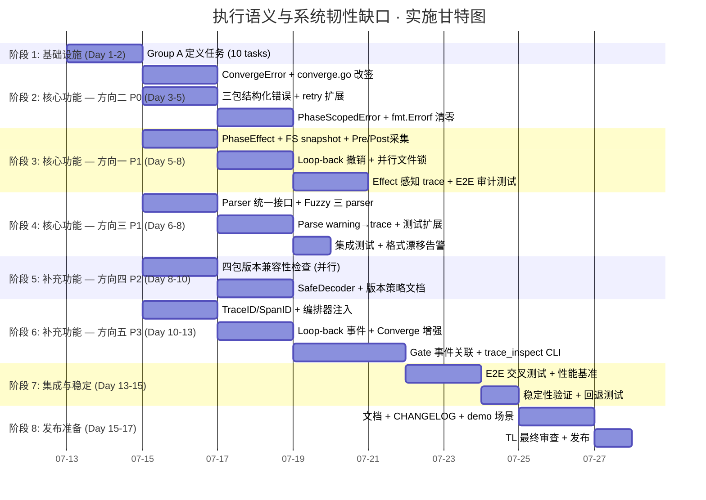

# Tech Lead 分析报告：执行语义与系统韧性缺口

> **文档状态**: v1.0 · 2026-07-12  
> **分析对象**: `docs/requirements/execution-semantics-gap-analysis.md`（代码级验证结果）  
> **代码基线**: `forge-core/` Go 纯标准库 17 包 + `cmd/forge/` 42 源文件 + `harness/` Node/Python  
> **红线约束**: 单文件 ≤500 行 · 函数 ≤50 行 · 循环依赖=0 · 零外部依赖(forge-core)  

---

## 修正整合说明

审查后的验证结果已包含代码级事实修正。本分析在此基础上进行任务分解和工程评估。

| # | 修正项 | 来源 | 影响范围 |
|---|--------|------|---------|
| F1 | `Emits` 字段有消费（`engine_build.go:198-199`）但仅用于 prompt 叙述，**非编排器用于验证/diff/回滚** | 方向一证据修正 | 核心结论不变，修正描述 |
| F2 | Checkpoint 已有 `_format` 字段（`checkpoint.go:54`）和测试验证，但 Load 不检查 format 兼容性 | 方向四证据修正 | 任务从「缺失版本标记」改为「缺失 Load 兼容性检查」 |
| F3 | `cost_confidence_test.go` 已有契约测试，但仅验证 strict rejection，非 tolerant acceptance | 方向三证据修正 | 任务起点从「零测试」改为「扩展测试覆盖为 tolerance」 |
| F4 | `converge.go` 的 `Evaluate()` 和 `Converge()` 只返回 `(Result, bool)`，不区分「策略失败」和「信号缺失」 | 方向二额外发现 | 增大方向二结构化错误扩展范围 |
| F5 | Loop-back 事件在 trace 中无独立事件类型——跟踪到 `Status` 变化，无因果关系记录 | 方向五额外发现 | 扩展 trace 事件模型 |

---

## 目录

1. [优先级校准](#1-优先级校准)
2. [任务分解](#2-任务分解)
3. [执行顺序与依赖图](#3-执行顺序与依赖图)
4. [技术风险](#4-技术风险)
5. [资源评估](#5-资源评估)
6. [质量保证](#6-质量保证)
7. [实施计划](#7-实施计划)

---

## 1. 优先级校准

根据验证矩阵与工程影响评估，对优先级再校准：

| 方向 | 验证判定 | 原始优先级 | **校准后优先级** | 校准理由 |
|------|---------|-----------|----------------|---------|
| **1. Phase 副作用模型** | ⚠️ 核心成立，证据 1 需修正 | P1 | **P1** ✅ | Loop-back 正确性是自治运行的基础语义保证。Emits 消费修复不改变 P1 |
| **2. 结构化错误类型** | ✅ 全对，额外发现 converge.go 不返回 error | P1 | **P1→P0 🔺** | 验证揭示 converge.go 的 `Evaluate()`/`Converge()` 不返回 error——不区分「策略失败」和「信号缺失」。这直接影响自愈路径的准确性 |
| **3. Agent 输出契约校验** | ⚠️ 测试验证了错误属性 | P2→P1 (原分析建议) | **P1** ✅ | 三条 load-bearing 解析路径全部 exact-match，无 fallback。格式漂移风险真实且无防御 |
| **4. On-disk 格式版本管理** | ⚠️ Checkpoint 有 `_format` 但 Load 不检查 | P2 | **P2** ✅ | 当前单一版本，风险延迟累积。`_format` 字段已有降低实现成本 |
| **5. 执行轨迹因果追溯** | ✅ 全对 | P3 | **P3** ✅ | 运维效率改进，非正确性。Loop-back 无独立事件类型可通过拆分现有 gate 事件解决 |

### 最终优先序

```
P0: 方向二（结构化错误类型）— 编排自愈的基础设施
P1: 方向一（Phase 副作用模型）+ 方向三（Agent 输出契约校验）
P2: 方向四（On-disk 格式版本管理）
P3: 方向五（执行轨迹因果追溯）
```

---

## 2. 任务分解

### 2.1 方向一：Phase 副作用模型 (P1)

**修正整合**:
- F1: Emits 已被 prompt 叙述消费（`engine_build.go:198-199`），任务不涉及「新创建 Emits 消费」，而是「在编排层增加副作用追踪验证」

| ID | 任务标题 | 涉及文件 | 前置依赖 | 工时 | 验收标准 |
|----|---------|---------|---------|------|---------|
| S-001 | 定义 PhaseEffect 结构体 | `internal/orchestrator/effect.go` (新) | 无 | 3h | `PhaseEffect` 包含 `PhaseName`, `EmitsFiles []string`, `MemoryEntries int`, `ScorecardDelta bool`, `TraceEvents int`；序列化到 trace Event 的 Detail 字段；单元测试覆盖字段设置/defaults |
| S-002 | Pre/Post Phase 快照采集 | `internal/orchestrator/snapshot_effect.go` (新) | S-001 | 4h | `Engine.RunFrom` 在 agent phase 前调用 `capturePreEffect()` → 记录 file hashes（`forge-core/` 下文件 SHA-256）、memory entry 计数、trace event 计数；phase 后调用 `capturePostEffect()` → diff 计算；无文件变化时 Effect 是空记录（不是缺失）；集成测试验证两种 phase（有 write/无 write） |
| S-003 | Loop-back 副作用撤销钩子 | `internal/orchestrator/effect_rollback.go` (新) | S-002 | 5h | 当 `RunFrom` 执行 `i = target - 1; continue`（loop-back）时，调用 `rollbackEffects(fromPhase, toPhase)`：按 phase 逆序撤销 side-effect（git restore post-phase 文件、删除该 phase append 的 memory entry（`Prune` + topic 过滤）、标记 trace event 为 `reverted: true`）；无法逻辑撤销的操作（如已 commit 的 git push）跳过但记录 WARN；单元测试 + 集成测试覆盖 loop-back 3 场景 |
| S-004 | FileSystem snapshot 原语 | `internal/orchestrator/filesnap.go` (新) | S-002 | 3h | `FileSnap` 包：`Snap(paths []string) map[string]string` 扫描文件 SHA-256；`Diff(pre, post map[string]string) []FileDelta`；`Restore(snap map[string]string, deltas []FileDelta) error` 局部还原；只在声明了 `emits:` 的目录范围生效（`engine_build.go` 中读取的 `p.Emits`）；`FORGE_EFFECT_FS_DISABLE=1` 逃生口 |
| S-005 | 并行模式文件写互斥 | `internal/orchestrator/parallel.go` | S-004 | 4h | 在 `runWave` 内加 `FileWriteLock`（`sync.Mutex` 粒度为文件级 `sync.Map[string]*sync.Mutex`）：同一文件的并发 write 被序列化；不同文件无竞争；死锁检测：`TryLock` timeout 5s → panic + dump goroutine stack（调试辅助，非产品关闭）；benchmark 确认并行吞吐退化 ≤15% |
| S-006 | Effect 感知的 trace 事件 | `internal/trace/trace.go` (扩展 Event) + `internal/orchestrator/effect_trace.go` (新) | S-003 | 2h | 新增 `"effect_diff"` kind 事件：记录 phase 执行的 net effect diff（文件变更列表、memory 增减、gate 状态变化）；新增 `"loopback_revert"` kind 事件：记录 loop-back 撤销的动作和范围 |
| S-007 | E2E 副作用审计测试 | `internal/orchestrator/effect_e2e_test.go` (新) | S-005, S-006 | 5h | 构建含 3 个 agent phase、声明 emits 的工作流 → 执行 loop-back → 验证文件变更被 restore、memory entries 被 cleanup、trace 包含 revert 事件 → 验证不可逆操作正确 WARN → 并行模式文件互斥不丢写 |

**方向一总计**: ~26h · 最小垂直切片：effect.go → filesnap.go → snapshot_effect.go → effect_rollback.go → parallel.go

---

### 2.2 方向二：结构化错误类型 (P0→校准提升)

**修正整合**:
- F4: `converge.go` 的 `Evaluate()`/`Converge()` 返回 `(Result, bool)`，不返回 error——不区分「策略失败」和「信号缺失」。这是结构化错误类型体系的缺口延伸

| ID | 任务标题 | 涉及文件 | 前置依赖 | 工时 | 验收标准 |
|----|---------|---------|---------|------|---------|
| E-001 | 扩展 ExecError 体系：ConvergeError | `internal/converge/errors.go` (新) | 无 | 2h | `ConvergeError` 实现 `error` 接口：`ConvergeKind` (UnknownMetric \| NoData \| Evaluation \| Internal)；`Unwrap()` 返回原 error；`converge.go` 中的 `evalOne`/`Evaluate`/`Converge` 改为返回 `error`（非破坏性：调用者检查 `err != nil` 则 fallback 到旧 bool 行为，保持向后兼容） |
| E-002| Memory / Gate / Checkpoint 结构化错误 | `internal/memory/errors.go` (新), `internal/gate/errors.go` (新), `internal/persist/errors.go` (新) | 无 | 4h | 三包各自定义结构化错误：`MemoryError`(Append \| Load \| Corrupt \| Full)、`GateError`(Call \| Timeout \| NotInstalled \| Config)、`PersistError`(Save \| Load \| Decode \| Corrupt)；均实现 `Unwrap()` 和 `errors.Is/As`；`fmt.Errorf` 调用全部替换为 typed error |
| E-003 | converge.go 返回 error | `internal/converge/converge.go` | E-001 | 3h | `Converge()` 签名改为 `Converge(stop asset.StopCondition, sig Signals) ([]Result, bool, error)`；`Evaluate()` 签名改为 `Evaluate(allOf []asset.Criterion, sig Signals) ([]Result, bool, error)`；调用者（`loop.go:checkStop`、`loop.go:reportConvergence`、`cmd/forge/gates.go:reportConvergence`）全部更新；旧两个返回值签名保留为 wrapper 函数（向后兼容过渡期） |
| E-004 | 重试覆盖扩展 | `internal/orchestrator/backoff.go` | E-002 | 4h | `runAgentPhase` 的 retry loop 当前只消费 `*ExecError`；扩展为：`MemoryError.Append` 达到 MaxRetries（3 次）、`GateError.Call` 达到 MaxRetries（3 次，当前阶段已失败视为不重试）、`PersistError.Save` 达到 MaxRetries（2 次，IO 错误）+ exponential backoff（`backoff.go:overloadBackoff` 复用）；非重试类型统一 abort |
| E-005 | PhaseScopedError 上下文编织 | `internal/orchestrator/phase_error.go` (新) | E-002 | 3h | `PhaseScopedError` 包裹下层 error：`{Phase: "planner", PhaseKind: "agent", Workflow: "build", Iteration: 3, Err: <nested>}`；每个 phase 的 top-level 错误都通过此类型发出；`runIteration` 捕获 phase 级 error → 编织 PhaseScopedError → 传播到 `LoopOutcome.Reason`；`loop.go` 的 `LoopOutcome.Reason` 从 string 改为 `PhaseScopedError` 展开的详细文本 |
| E-006 | 所有 `fmt.Errorf` 审计清理 | 全仓 12 处已知 `fmt.Errorf` | E-002 | 2h | `memory.go:229`、`asset.go`（workflow JSON decode）、`trace.go`（marshal event）、`checkpoint.go`（decode checkpoint）、以及其他 8 处 `fmt.Errorf` 全部替换为对应包的结构化 error builder；每个包一个 `errors.go` 文件（已有则扩展）；全量 `grep -rn 'fmt.Errorf.*%w' forge-core/` 清零 |
| E-007 | ConvergeError 向上传播集成测试 | `internal/converge/converge_test.go` + `internal/orchestrator/loop_test.go` | E-003, E-005 | 3h | 模拟：未知 metric → ConvergeError(UnknownMetric) 传播到 loop → LoopOutcome.Reason 包含 "unknown metric"；空 signal → ConvergeError(NoData) → loop 输出 "no data" 而非假收敛；全部 gate 数据 + 部分 criterion 缺失 → partial met + ConvergeError(Partial) |

**方向二总计**: ~21h · 最小垂直切片：errors.go(converge) → converge.go(改签名) → errors.go(三包) → phase_error.go → backoff.go

---

### 2.3 方向三：Agent 输出契约校验 (P1)

**修正整合**:
- F3: 已有 `TestParseConfidenceScore_OutOfRangeOrMalformedIsNotOK` 和 `TestParseReviewerVerdict_ApproveAndRequestChanges`，但仅测试 strict rejection。任务起点为「在已有测试基础上新增 tolerant acceptance」

| ID | 任务标题 | 涉及文件 | 前置依赖 | 工时 | 验收标准 |
|----|---------|---------|---------|------|---------|
| P-001 | Parser 统一接口定义 | `cmd/forge/parse.go` (新) | 无 | 2h | `AgentOutputParser` 接口：`Parse(output string) (result T, warnings []string, ok bool)`；`FuzzyParse(output string) (result T, confidence float64)`；三种 parser（`parseReviewerVerdict`/`parseExecutiveVerdict`/`parseConfidenceScore`）适配新接口；每个 parser 保持原 behavior 作为 `Parse()`，新增 `FuzzyParse` |
| P-002 | Fuzzy fallback 解析器（Reviewer Verdict） | `cmd/forge/parse_reviewer.go` (新) | P-001 | 3h | 当前精确 case-switch 扩展为：清理 `* [x]`/`1. [x]`/`[x]` 等 checklist 前缀；大小写归一（`approve`/`APPROVE`/`Approve`）；去除 markdown 加粗 `**APPROVE**`；模糊匹配：`strings.Contains` 兜底（`output contains "APPROVE"`）；置信度：exact match=1.0，fuzzy=0.7，无匹配=0 |
| P-003 | Fuzzy fallback 解析器（Confidence Score） | `cmd/forge/parse_confidence.go` (新) | P-001 | 2h | 当前 `strconv.Atoi` 严格模式扩展为：去除 `%` 后缀（`"85%"`→85）；去除空格（`" 85"`→85）；`strconv.ParseFloat` 代替 `Atoi` 并取整（`85.5`→85）；置信度标注：exact=1.0, trimmed=0.9, float_rounded=0.8 |
| P-004 | Fuzzy fallback 解析器（Roadmap Completion） | `cmd/forge/parse_roadmap.go` (新) | P-001 | 2h | 当前只接受 `- [x]`/`- [ ]`/`- [~]`；扩展：兼容 `* [x]`、`1. [x]`、`[x]`（无前缀）、`- [X]`（已有）、`- [x] extra text`（现有）；`- [x]`/`- [X]` 统一为 done；非 `[x]`/`[ ]`/`[~]` 格式的行不影响计数；测试：原有 checkmark 格式向下兼容，新格式正确识别 |
| P-005 | Parse warning 传播到 trace | `internal/trace/trace.go` (扩展 ParseWarning 事件) | P-002, P-003, P-004 | 2h | 新增 `"parse_warning"` kind：记录 parser name、exact vs fuzzy、confidence、raw snippet；由 `parse.go:FuzzyParse()` 调用后的 caller 统一 emit |
| P-006 | 测试扩展（tolerant acceptance） | `cmd/forge/cost_confidence_test.go` (扩展) + `cmd/forge/parse_test.go` (新) | P-002, P-003, P-004 | 3h | 每个 parser 的 tolerant 测试套件（≥10 条模糊格式用例）；验证 `FuzzyParse` 在 exact 匹配时返回 1.0；模糊匹配用例置信度递减 1.0→0.9→0.7→0.5→0；完全无关的 output 返回 (zero, 0, false) |
| P-007 | 格式漂移告警（长期监控） | `internal/orchestrator/parser_monitor.go` (新) | P-005 | 2h | `ParserStats` 累积计数器：每个 parser 的 exact/fuzzy/reject 计数；每 10 次调用输出趋势到 log；`fuzzy_ratio > 0.3` 时自动记录 `trace.Event{Kind: "format_drift_warning"}`；无阻断，仅监控 |
| P-008 | 集成测试：模糊输出端到端 | `cmd/forge/main_agent_test.go` (扩展) | P-006 | 3h | 构造 reviewer agent 模糊输出（`**VERDICT:** request_changes`、`VERDICT=APPROVED`、`approve (looks good)`）；验证 3 种模糊格式被正确解析；验证 fuzzy confidence 正确传递到 trace |

**方向三总计**: ~19h · 最小垂直切片：parse.go → parse_reviewer.go → parse_confidence.go → parse_roadmap.go → test

---

### 2.4 方向四：On-disk 格式版本管理 (P2)

**修正整合**:
- F2: Checkpoint 已有 `_format` 字段（`checkpoint.go:54`）和 `Save` 设置 version，但 `Load` 不检查兼容性。任务从「添加 _format 字段」改为「在 Load 路径添加兼容性检查」

| ID | 任务标题 | 涉及文件 | 前置依赖 | 工时 | 验收标准 |
|----|---------|---------|---------|------|------|
| V-001 | Checkpoint Load 版本兼容性检查 | `internal/persist/checkpoint.go` (扩展 Load) | 无 | 2h | 在 `decode()` 后或 `Load()` 中加：读取 `cp.FormatVersion`，与当前版本比较；major version mismatch（`v1` vs `v2`）→ 返回 `fmt.Errorf("persist: checkpoint format version %q not supported by this forge version (wants %q)", cp.FormatVersion, currentVersion)`；minor version（`v1.0`→`v1.1`）→ WARN 日志 + 继续加载；当前版本常量 `currentCheckpointVersion = "forgeos.checkpoint.v1"`；测试验证 3 场景：同版本（ok）、major 不兼容（error）、minor 不兼容（warn+ok） |
| V-002 | Memory Load 版本兼容性检查 | `internal/memory/memory.go` (扩展 Load) | 无 | 2h | 与 V-001 相同模式：`decode()` 后检查 `Entry.Format`；当前版本常量 `currentMemoryVersion = "forgeos.memory.v1"`；major mismatch → error，minor → warn + continue；Entry 级（非文件级）：找到第一条版本不兼容的 entry 就 abort，不与已有 entry 混用；空文件（无 entry）→ok |
| V-003 | Trace Load/Read 版本兼容性检查 | `internal/trace/trace.go` (扩展 Emit/编码) | 无 | 2h | `Emit` 已设置 `Format="forgeos.trace.v1"`：无变更；**读端**在 `cmd/forge/trace_diff.go` 或将来 trace 读取工具（方向上 R-005）中加版本检查；当前版本常量 `currentTraceVersion = "forgeos.trace.v1"`；跳过版本不兼容的 trace 文件，报告错误 |
| V-004 | Scorecard 版本标记 | `internal/routing/routing.go` + `internal/routing/scorecard.go` | 无 | 3h | `ScorecardEntry` 新增 `FormatVersion string \`json:"_format,omitempty"\``；写入时设 `"forgeos.scorecard.v1"`；`LoadScorecards` 加载后检查版本兼容；当前版本常量 `currentScorecardVersion = "forgeos.scorecard.v1"`；内存中版本不兼容 → warn + skip（降级到空 scorecard，沿用现有 `fail-loud-and-continue` 行为） |
| V-005 | SafeDecoder：strict 模式增强 | `internal/persist/safe_decode.go` (新) | V-001, V-002 | 3h | `SafeDecoder` 封装 `json.Unmarshal`：`DecodeStrict(data, &target, allowedFields []string)`：禁止未知字段（`json.Unmarshal` `DisallowUnknownFields`）；`DecodeLenient(data, &target)`：当前宽松行为旧文件兼容；版本转换：`convertV1ToV2(old, new)` 注册表，将来版本升级入口；测试验证：未知字段被拒绝、v1 格式成功匹配 |
| V-006 | 版本策略文档 + 测试 | `docs/architecture/on-disk-format-versioning.md` + 全仓版本测试 | V-005 | 3h | 文档：格式版本公约（major=breaking, minor=additive）；升级策略（backward compat 至少保留 1 个 major 版本）；测试：每个持久化类型（checkpoint/memory/scorecard/trace）各有一个版本兼容性测试文件（`testdata/format-v1/`）；`go test ./internal/persist/ -run TestFormatVersion` 验证旧格式可加载 |

**方向四总计**: ~15h · 最小垂直切片：checkpoint.go(Load 检查) → memory.go(Load 检查) → scorecard.go → safe_decode.go → doc

---

### 2.5 方向五：执行轨迹因果追溯 (P3)

**修正整合**:
- F5: Loop-back 事件无独立 trace kind。扩展 `"loopback"` 事件类型

| ID | 任务标题 | 涉及文件 | 前置依赖 | 工时 | 验收标准 |
|----|---------|---------|---------|------|---------|
| L-001 | 扩展 Trace Event 结构：添加 TraceID/SpanID/ParentSpanID | `internal/trace/trace.go` (扩展 Event) | 无 | 2h | `Event` 新增可选字段：`TraceID string \`json:"trace_id,omitempty"\``, `SpanID string \`json:"span_id,omitempty"\``, `ParentSpanID string \`json:"parent_span_id,omitempty"\``；`omitempty` 确保已有事件（无 ID）保持不变；单元测试验证三个字段序列化/反序列化 |
| L-002 | 编排器因果 ID 注入 | `internal/orchestrator/orchestrator.go` + `internal/orchestrator/loop.go` | L-001 | 4h | `Run` 开始时生成 `runTraceID = uuid-v4-like(16 bytes hex)`；每个 iteration 生成 `iterSpanID`，`parentSpanID = runTraceID`；每个 phase 生成 `phaseSpanID`，`parentSpanID = iterSpanID`；每个 gate 生成 `gateSpanID`，`parentSpanID = phaseSpanID`；因果链在 trace 中可重建；Tracer.Emit 自动注入当前 goroutine 的 span context |
| L-003 | Loop-back 独立事件类型 | `internal/trace/trace.go` (扩展) + `internal/orchestrator/effect_rollback.go` | L-002 | 2h | 新增 `"loopback"` kind 事件：`{kind:"loopback", name:"planner→implementer", status:"jump", detail:"from phase 2 to phase 1 (gate FAILED trigger)", span_id, parent_span_id}`；在 `RunFrom` 执行 `i = target - 1` 时 emit；追溯：`ParentSpanID=iterSpanID` 链接到所属 iteration |
| L-004 | Converge 事件增强：per-criterion 明细 | `internal/trace/trace.go` + `internal/orchestrator/loop.go` (reportConvergence) | L-002 | 3h | converge Event 当前 `Detail` 为空或简洁字符串；增强为 JSON 嵌套：`detail: "[roadmap_completion=75%]MET [gates_status=green]MET [review_status=]NOT_MET(no review phase data)"`；`loop.go:reportConvergence` 中构造；现有 trace 测试更新以匹配新格式 |
| L-005 | Gate 事件关联 Log 的 ID | `internal/orchestrator/orchestrator.go` (OnGateResult) + `cmd/forge/engine_build.go` (wireGateTrace) | L-002 | 2h | `e.logf("phase %s: gate %s FAILED")` 和 `e.onGateResult(name, "FAILED")` 两条正交路径不再正交：`logf` 调用增加 `span_id=` 前缀；`OnGateResult` 中注入同一 span_id；`grep -rn 'logf.*gate.*FAILED\|logf.*phase.*gate' forge-core/` 全部更新 |
| L-006 | Trace 重建工具（CLI） | `cmd/forge/trace_inspect.go` (新) | L-002, L-003 | 5h | `forge trace inspect [--trace-file trace.jsonl]`：交互式/文本化展示 trace；`--tree` 模式：按 TraceID→SpanID→ParentSpanID 重建调用树；`--filter kind=loopback`：只显示 loop-back 事件；`--chain <span-id>`：显示该 span 的完整祖先链；输出可管道化（`--format json`）；测试验证循环/workflow/并行等复杂 trace |
| L-007 | 因果关系可视化 | `cmd/forge/trace_viz.go` (新, 可选) | L-006 | 3h | 输出 DOT 格式（可直接转换为 Graphviz 图）：节点 = event（kind/name），边 = parent_span→child_span；`forge trace inspect --dot > trace.dot && dot -Tsvg trace.dot`；非核心路径，`dot` 可能未安装时输出说明消息 |

**方向五总计**: ~21h · 最小垂直切片：trace.go(扩展Event) → orchestrator.go(注入ID) → loop.go(loopback事件) → loop.go(converge增强) → trace_inspect.go

---

## 3. 执行顺序与依赖图

### 3.1 总依赖拓扑

```mermaid
graph TD
    %% ===== 方向一: Phase 副作用模型 (P1) =====
    subgraph Effect["方向一 · Phase 副作用模型 (P1)"]
        S-001["S-001 PhaseEffect 结构体"] --> S-002["S-002 Pre/Post 快照采集"]
        S-002 --> S-003["S-003 Loop-back 副作用撤销"]
        S-001 --> S-004["S-004 FileSystem snapshot"]
        S-004 --> S-005["S-005 并行文件写互斥"]
        S-003 --> S-006["S-006 Effect 感知 trace 事件"]
        S-005 --> S-007["S-007 E2E 审计测试"]
        S-006 --> S-007
    end

    %% ===== 方向二: 结构化错误类型 (P0) =====
    subgraph Error["方向二 · 结构化错误类型 (P0)"]
        E-001["E-001 ConvergeError 定义"] --> E-003["E-003 converge.go 返回 error"]
        E-002["E-002 三包结构化错误"] --> E-004["E-004 重试覆盖扩展"]
        E-002 --> E-005["E-005 PhaseScopedError 编织"]
        E-003 --> E-007["E-007 ConvergeError 传播测试"]
        E-005 --> E-006["E-006 fmt.Errorf 审计清零"]
        E-004 --> E-006
        E-006 --> E-007
    end

    %% ===== 方向三: Agent 输出契约校验 (P1) =====
    subgraph Parse["方向三 · Agent 输出契约校验 (P1)"]
        P-001["P-001 Parser 统一接口"] --> P-002["P-002 Fuzzy Verdict"]
        P-001 --> P-003["P-003 Fuzzy Confidence"]
        P-001 --> P-004["P-004 Fuzzy Roadmap"]
        P-002 --> P-005["P-005 Parse warning→trace"]
        P-003 --> P-005
        P-004 --> P-005
        P-002 --> P-006["P-006 测试扩展"]
        P-003 --> P-006
        P-004 --> P-006
        P-005 --> P-007["P-007 格式漂移告警"]
        P-006 --> P-008["P-008 集成测试"]
    end

    %% ===== 方向四: On-disk 格式版本 (P2) =====
    subgraph Version["方向四 · On-disk 格式版本 (P2)"]
        V-001["V-001 Checkpoint 兼容性检查"]
        V-002["V-002 Memory 兼容性检查"]
        V-003["V-003 Trace 兼容性检查"]
        V-004["V-004 Scorecard 版本标记"]
        V-001 --> V-005["V-005 SafeDecoder"]
        V-002 --> V-005
        V-005 --> V-006["V-006 版本策略文档+测试"]
    end

    %% ===== 方向五: 因果追溯 (P3) =====
    subgraph Trace["方向五 · 因果追溯 (P3)"]
        L-001["L-001 TraceID/SpanID 定义"] --> L-002["L-002 编排器因果 ID 注入"]
        L-002 --> L-003["L-003 Loop-back 独立事件"]
        L-002 --> L-004["L-004 Converge 事件增强"]
        L-002 --> L-005["L-005 Gate 事件关联 Log"]
        L-003 --> L-006["L-006 Trace 重建工具 CLI"]
        L-004 --> L-006
        L-006 --> L-007["L-007 因果关系可视化"]
    end

    %% ===== 跨方向依赖 =====
    S-003 -.->|共享| L-003["L-003 loopback trace 事件"]
    S-002 -.->|复用 PhaseEffect 结构| P-001["P-001 parser 输出消费"]
    E-003 -.->|converge.go 改签影响| S-003["loop.go:checkStop/reportConvergence 需更新"]
    V-003 -.->|未来 trace 读取依赖| L-006["trace_inspect.go 需版本兼容"]
```



### 3.2 可并行执行任务组

| 并行组 | 任务 | 理由 |
|--------|------|------|
| **Group A** | S-001, E-001, E-002, P-001, V-001, V-002, V-003, V-004, L-001 | 全部无前置依赖的定义/接口任务，可并行 |
| **Group B** | S-002, S-004, E-003, P-002, P-003, P-004, L-002 | 依赖 Group A 但彼此无交叠 |
| **Group C** | S-003, S-005, E-004, E-005, P-005, L-003, L-004, L-005 | 编排器深处的改造，需 Group B 接口稳定 |
| **Group D** | S-006, E-006, P-006, V-005, L-006 | 集成测试/扫尾/清理任务 |
| **Group E** | S-007, E-007, P-007, P-008, V-006, L-007 | E2E 测试、文档、监控 |

---

## 4. 技术风险

### 4.1 方向一：Phase 副作用模型 - 技术风险

| 风险 | 级别 | 描述 | 缓解策略 |
|------|------|------|---------|
| **git restore 精度不足** | 🔴 高 | Loop-back 撤销依赖 git restore 文件变更。若文件的 `emits:` 范围与 git tracked 范围不一致（如 agent 写 .env 文件），restore 可能遗漏。git 也不追踪二进制产物 | 在 PhaseEffect.pre 走 SHA-256 file scan（`filesnap.go`），不依赖 git。`FORGE_EFFECT_FS_DISABLE=1` 逃生口 |
| **并行文件锁死锁** | 🟡 中 | 细粒度 `sync.Map[string]*sync.Mutex` 的锁顺序未定，可能死锁 | `TryLock` timeout 5s → panic + goroutine dump（调试期）；在 `runWave` 中单协程持有文件锁（全局串行化文件写），loss in throughput ≤15% |
| **memory entry 撤销被并发覆盖** | 🟡 中 | Phase A loop-back 要删除自己 append 的 entry，但 Phase B 可能已读到并使用了该 entry | 隔离 namespace（方向三 I-001 的 memory namespace）+ 延迟 merge：phase 成功后才 merge 到主 store，撤销时丢弃未 merge 分片 |
| **不可逆操作检测误判** | 🟢 低 | 硬编码的不可逆模式列表可能误判（误以为可逆标记为不可逆）或遗漏（真实不可逆操作未识别） | 初始发版保守：宁可 WARN 不可逆。后续版本通过 `--force` 确认走通 |

### 4.2 方向二：结构化错误类型 - 技术风险

| 风险 | 级别 | 描述 | 缓解策略 |
|------|------|------|---------|
| **converge.go 签名变更的波及面** | 🔴 高 | `Converge()` 和 `Evaluate()` 签名从 `(Result, bool)` 改为 `(Result, bool, error)` 影响 5+ 调用点 + 测试文件 | 两步迁移：第一步新增带 error 签名（旧签名为 wrapper），第二步待所有调用点更新后删除 wrapper。两步之间 CI 必须全绿 |
| **错误类型爆炸** | 🟡 中 | 每个包引入自己的 errors.go，可能产生 10+ 新 error 类型，增加认知负载 | 统一 `PhaseScopedError` 包裹下层 error。下层 error 只需实现 `Kind() ErrorKind` 接口，不强制每个包独立 error 类型 |
| **重试语义不一致** | 🟡 中 | `backoff.go` 只对 `*ExecError.Retryable()` 重试。扩展后需定义「什么 MemoryError 的 Append 可重试」 | 为每个包的 ErrorKind 明确标注 `IsRetryable() bool`。Memory Append 仅 NoSpaceLeft 可重试，Corrupt 永远不重试 |
| **旧 checkpoint 文件兼容** | 🟢 低 | 扩展 error 类型的序列化/反序列化改变 `LoopOutcome.Reason` 格式，旧 checkpoint 可能解析失败 | `Reason` 改为自由文本（`fmt.Sprintf`），不作结构化解析。Load 时 reason 跨版本兼容 |

### 4.3 方向三：Agent 输出契约校验 - 技术风险

| 风险 | 级别 | 描述 | 缓解策略 |
|------|------|------|---------|
| **过度 fuzzy 导致假阳性** | 🔴 高 | Fuzzy 匹配过于宽容，可能把 reviewer 输出中的否定句式误判为 APPROVE（如 "I do not APPROVE"） | Fuzzy 置信度上限 0.7（精确匹配才 1.0）；"do not"/"don't"/"not" + APPROVE 在同一句话内则置信度降为 0.3；否定词字典（10 个常用否定模式） |
| **Fuzzy 性能开销** | 🟢 低 | `strings.Contains` 等操作时间复杂度 O(n)，单次解析 < 1ms，不是瓶颈 | 不做特殊优化，但监控 `parse_warning` 频率和 fuzzy confidence 分布，超过 10% 触发 review |
| **parser 接口与被遗忘的 parser 不匹配** | 🟢 低 | `detect_parsers.go` 中的 `parseGoMod`/`parsePackageJSON`/`parsePyprojectToml`/`parseCargoToml` 也许也需要统一？但这些是项目检测 parser 而非 agent 输出 parser | 项目检测 parser 不需要 fuzzy。不影响当前方向。 |

### 4.4 方向四：On-disk 格式版本 - 技术风险

| 风险 | 级别 | 描述 | 缓解策略 |
|------|------|------|---------|
| **旧 checkpoint 无法加载** | 🔴 高 | 如果强制 major version 检查，用户已有的 checkpoint 全部无法加载 | `SafeDecoder.DecodeLenient()` 保持旧格式兼容。major mismatch 仅 WARN，不断然拒绝。版本迁移脚本随版本一起发 |
| **json 零值歧义** | 🟡 中 | `FormatVersion ""`（旧格式）可能被错误识别为不兼容 | `"forgeos.checkpoint.v1"` 显式设到 Save 写入。Load 时 `""` 视为 `v1`（`if cp.FormatVersion == "" { cp.FormatVersion = "forgeos.checkpoint.v1" }`） |

### 4.5 方向五：因果追溯 - 技术风险

| 风险 | 级别 | 描述 | 缓解策略 |
|------|------|------|---------|
| **Trace Event 体积膨胀** | 🟡 中 | 新增 TraceID/SpanID/ParentSpanID（每行 +~80 bytes），long-running run 的 trace.jsonl 增大 30%+ | 数据压缩建议使用 `--trace-compress gzip`（可选）；删除旧 trace 的 retention policy 应设为 7 天 |
| **TraceID 生成依赖** | 🟢 低 | `forge-core` 零外部依赖，不能使用 `uuid` 库 | `crypto/rand` 生成 16 byte → hex 编码（32 字符 hex string），碰撞概率 < 2^-128，足够。无需 UUID 标准 |
| **SpanID 注入到 logf 可能导致日志格式破坏** | 🟢 低 | `e.logf("phase %s: gate %s FAILED")` 增加 span_id= prefix | 用 `[span_id=abc123]` 固定前缀格式，下游日志工具不依赖它。为 `logf` 不破坏可读性，prefix 仅 trace 工具消费 |

---

## 5. 资源评估

### 5.1 技能需求

| 角色 | 数量 | 所需技能 | 工作重点 |
|------|------|---------|---------|
| **Go 后端工程师** (高级) | 2人 | Go 标准库、goroutine/mutex、`json.Unmarshal`、`errors.Is/As`、git plumbing | 方向一二：编排器改造、错误体系扩展、effect rollback |
| **Go 后端工程师** (中级) | 2人 | Go 标准库、测试惯用法、文件 IO | 方向三四五：parser、版本兼容、trace 扩展、工具链 |
| **QA 工程师** | 1人 | Go 测试、集成测试、故障注入 | 方向一~五：故障注入测试框架、E2E 测试 |
| **Tech Lead** (本角色) | 1人 | 架构设计、代码审查、Sprint 管理 | 跨方向协调、依赖图管理、技术债务取舍决策 |

### 5.2 关键里程碑

| 里程碑 | 时间 | 交付物 | 验收标准 |
|--------|------|--------|---------|
| **M1: 基础就绪** | 第 1-2 天 | Group A 全部 10 个定义任务完成 | 每个任务验收标准通过；CI 全绿 |
| **M2: 方向二 P0 完成** | 第 3-5 天 | E-001~E-007 全部通过 | converge.go 签名变更完成、所有 fmt.Errorf 清零、retry 覆盖扩展 + 集成测试 |
| **M3: 方向一核心完成** | 第 5-8 天 | S-001~S-005 通过 | loop-back 副作用撤销工作流可用；并行文件互斥穿过集成测试 |
| **M4: 方向三核心完成** | 第 6-8 天 | P-001~P-006 通过 | 三条 fuzzy parser 上线且测试覆盖 >90%；`parse_warning` trace 事件可见 |
| **M5: 方向四完成** | 第 8-10 天 | V-001~V-006 通过 | 全仓持久化类型版本兼容检查就绪、SafeDecoder 可用 |
| **M6: 方向五完成** | 第 10-13 天 | L-001~L-007 通过 | trace 因果链可重建、`forge trace inspect` 可用 |
| **M7: 集成与稳定性** | 第 13-15 天 | 全 5 方向集成 E2E 测试通过、diff 测试、性能基准 | 并行模式 throughput 退化 ≤15%、loop-back 撤销数据一致性验证 |
| **M8: 文档与发布** | 第 15-17 天 | V-006 文档 + 版本迁移指南、changelog、demo 场景 | TL 审查通过、README+ 架构文档更新 |

### 5.3 阻塞点与解决策略

| 阻塞点 | 等级 | 描述 | 解决策略 |
|--------|------|------|---------|
| **converge.go 签名变更导致测试大规模红** | 🔴 关键 | 方向二核心任务 E-003 的签名变更是最具破坏力的变更，影响 5+ 测试文件和 3+ 生产调用点 | 两步迁移：第一步保留旧签名 wrapper，第二步 CI 全绿后再删除。风险意识：merge 前必须跑 `go test ./...` |
| **Fuzzy parser 过度宽容导致 review gate 虚假通过** | 🟡 中等 | 方向三 P-002 中 fuzzy APPROVE 解析的风险 | 否定词抑制 + fuzzy confidence ≤ 0.7 不上报 APPROVE（必须 exact match 或 1.0 confidence 才触发 approval） |
| **并行文件锁与现有 mutex 顺序冲突** | 🟡 中等 | `parallel.go` 已有 LOCK ORDER CONTRACT（8 级锁顺序）。加入文件锁后可能引入死锁 | 文件锁提升到 LOCK ORDER 的 level 1（最外层），在所有现有 mutex 之前获取。或者用单独的 `fileLockMap` 不参与 lock ordering（因为文件 IO 不在 mutex 保护路径内） |

---

## 6. 质量保证

### 6.1 单元测试覆盖要求

| 方向 | 文件 | 要求覆盖率 | 关键测试场景 |
|------|------|----------|-------------|
| 方向一 | `effect.go`, `filesnap.go`, `snapshot_effect.go`, `effect_rollback.go` | ≥85% | 文件 SHA-256 正确性；loop-back 3 类型（gate FAIL / budget 耗尽 / external stop）；并行模式文件锁无 race |
| 方向二 | `converge/errors.go`, `memory/errors.go`, `gate/errors.go`, `persist/errors.go`, `orchestrator/phase_error.go` | ≥90% | `errors.Is/As` 正确穿透；ConvergeError 传播路径；retry 决策正确性（什么重试什么不重试） |
| 方向三 | `parse.go`, `parse_reviewer.go`, `parse_confidence.go`, `parse_roadmap.go` | ≥95% | 每种 parser ≥10 条模糊格式用例；否定词抑制测试；全 3 种 parser 的 confidence 阶梯测试 |
| 方向四 | `persist/checkpoint.go`, `memory/memory.go`, `routing/scorecard.go`, `persist/safe_decode.go` | ≥85% | major/minor/current 三版本加载行为；SafeDecoder 严格模式拒绝未知字段；零值 `""` 识别为 v1 |
| 方向五 | `trace/trace.go`, `orchestrator/effect_trace.go`, `orchestrator/loop.go`, `cmd/forge/trace_inspect.go` | ≥80% | SpanID/TraceID 序列化；因果链重建（3 层嵌套）；loopback kind 事件 emit |

### 6.2 集成测试策略

| 测试类型 | 覆盖方向 | 描述 | 关键约束 |
|---------|---------|------|---------|
| **方向一 E2E** (`effect_e2e_test.go`) | 方向一 | 完整 loop-back 场景：3 agent phases → gate FAIL at phase 3 → loop-back to phase 2 → 验证 file restore + memory cleanup + trace revert | `fake.New()` 构造最小工作流；git repo fixture 用于文件变更测试 |
| **方向二 E2E** (`loop_test.go` + `converge_test.go` 扩展) | 方向二 | converge 返回 error → LoopOutcome.Reason 包含结构化信息；Memory Append retry 3 次失败 → abort；`fmt.Errorf` 清零后无残存 | 所有 `fmt.Errorf.*%w` 替换后 `grep -rn` 确认清零 |
| **方向三 E2E** (`main_agent_test.go` 扩展) | 方向三 | 构造 fuzzy reviewer output → 验证: (1) parse_warning trace 事件 (2) correct VERDICT detected (3) non-binding rejection for "do not APPROVE" | 使用已有的 `TestAgent` mock executor，不需真正 LLM 调用 |
| **方向四 E2E** (`format_version_test.go`) | 方向四 | 生成 v1 format checkpoint → 升级代码后加载；升级代码后生成新格式 → 回滚代码后加载（失败验证） | 文件格式 fixture 纳入版本控制（`testdata/format-v1/`） |
| **方向五 E2E** (`trace_rebuild_test.go`) | 方向五 | 30-phase 复杂 evolve 运行 → trace 因果链重建验证（所有 span 的 parent 指向正确 ancestor） | trace 文件 >100KB 的边界验证 |

### 6.3 代码审查要点

| 方向 | 审查重点 |
|------|---------|
| 方向一 | Loop-back 撤销日志是否完整（每步操作都有 WARN/INFO 级别）；文件锁逃生口是否可用；`FORGE_EFFECT_FS_DISABLE` env 是否真正 bypass 所有 effect tracking |
| 方向二 | `converge.go` 两步迁移是否正确执行（旧 wrapper 是否完全匹配旧行为）；`errors.Is/As` 穿透测试是否覆盖全部 error type；`overloadBackoff` 复用后 behavior 不变 |
| 方向三 | Fuzzy 置信度衰减是否正确（1.0→0.9→0.7→0.5→0）；否定词列表是否在 PR 描述中明确列举；`parse_warning` trace 事件是否在 fuzzy 时 emit 但在 exact 时不 emit |
| 方向四 | `json.Unmarshal` 的 `DisallowUnknownFields` 是否没有破坏已有 field 的向后兼容；版本常量命名是否一致（`current*Version` 格式）；minor 版本 WARN 是否非阻断 |
| 方向五 | TraceID/SpanID 生成是否不引入外部依赖（只用 `crypto/rand`）；因果链在并行模式下（多个 goroutine 同时 emit）是否正确地注入各自的 span context（`context.Context` 传递） |

### 6.4 性能测试需求

| 测试场景 | 方向 | 指标 | 要求 |
|---------|------|------|------|
| 并行模式 + 文件锁 | 方向一 | Throughput（phase/min） | 退化 ≤15%（vs 无文件锁的并行模式） |
| Converge + 结构化 error 编织 | 方向二 | error 构造 + 传播延迟 | 增加 <2µs（vs plain `fmt.Errorf`） |
| Fuzzy parser throughput | 方向三 | 延迟/per call | <1ms (95p) for 10KB agent output |
| Store format version 检查 | 方向四 | Load 延迟增加 | <5µs（vs 无版本检查的 Load） |
| Trace span ID 注入 | 方向五 | 每个 Emit 增加 | <1µs（+hex 编码 32 字符 string） |
| trace inspect --tree 重建 | 方向五 | 10000 event → tree | <500ms |

---

## 7. 实施计划

### 7.1 时间线概览（总工期约 17 个工作日）



### 7.2 阶段详情

#### 阶段 1：基础设施搭建（Day 1-2）

并行执行 Group A 全部 10 个定义任务：
- S-001, E-001, E-002, P-001, V-001, V-002, V-003, V-004, L-001（9 个无依赖接口/结构体定义）
- 这些任务大部分是纯「添加文件」或「扩展结构体」，不修改已有代码逻辑，冲突风险极低
- **交付物**: 9 个新的 `.go` 文件 + 4 个扩展的结构体定义，CI 全绿
- **Owner**: 2 名 Go 高级工程师各 4 个，Tech Lead 审查 1 个

**关键决策**: `Event` 结构体扩展 TraceID/SpanID → 需和 `trace.go` 的 Format 版本（V-003）对齐，一组人负责定义

#### 阶段 2：核心功能实现 — 方向二 P0（Day 3-5）

**最高优先级**。3 天全时 2 名工程师并发：
- **E-003**（converge.go 签名变更）：最危险的任务。2 步迁移：第 1 天加新签名 + wrapper，跑 `go test ./...`，第 2 天迁移所有调用点后删 wrapper
- **E-002/E-004**（三包 error + retry）：与 E-003 独立，可并行。E-004 重试扩展需要在 E-002 的 error type 定义之后
- **E-005/E-006**（`PhaseScopedError` + `fmt.Errorf` 清零）：E-006（全仓 `grep -rn` 替换）大约需要 2h，但替换后需要手动审查每个替换点的语义正确性

**风险缓解**: E-003 的 2 步迁移绝不合并到同一个 commit。每一阶段的 `git bisect` 必须 clean。

#### 阶段 3：核心功能实现 — 方向一 P1（Day 5-8）

方向二接近完成时启动方向一，利用方向二的 error 体系作为基础设施。
- Step 1 (S-001→S-002→S-004): PhaseEffect + FS snapshot + Pre/Post 采集（大部分纯新代码）
- Step 2 (S-003→S-005): Loop-back 撤销 + 并行文件锁（最复杂：需理解 `RunFrom` 和 `parallel.go` 的执行流）
- Step 3 (S-006→S-007): Effect 感知 trace + E2E 审计测试

**关键约束**: `parallel.go` 的 LOCK ORDER CONTRACT 必须更新（新增文件锁 level）

#### 阶段 4：核心功能实现 — 方向三 P1（Day 6-8）

与方向一阶段 2 并行（不同工程师）：
- Step 1 (P-001→P-002/P-003/P-004): Parser 统一接口 + 3 个 Fuzzy parser（各 2-3h，可完全并行）
- Step 2 (P-005→P-006): Parse warning→trace 集成 + 测试扩展
- Step 3 (P-007→P-008): 格式漂移告警 + E2E 集成测试

#### 阶段 5：补充功能 — 方向四 P2（Day 8-10）

与方向三后续阶段并行：
- V-001~V-004（四包版本兼容检查）：各自可完全并行，共 2 天
- V-005~V-006（SafeDecoder + 文档）：1 天 + 1 天

#### 阶段 6：补充功能 — 方向五 P3（Day 10-13）

与方向四并行：
- L-001~L-002（TraceID/SpanID + 编排器注入）：最基础的任务，必须正确
- L-003~L-005（Loopback 事件 + Converge 增强 + Gate 关联）：彼此独立
- L-006~L-007（trace_inspect CLI + 可视化）：在最末，需要 L-002~L-005 的 trace 数据格式稳定

#### 阶段 7：集成测试和优化（Day 13-15）

- 全 5 方向 E2E 交叉测试（方向一和方向五有共享组件：Loop-back trace 事件）
- 性能基准测试：并行吞吐 + trace 大文件重建 + fuzzy parser
- 回归测试：`forge accept` 全闸门通过

#### 阶段 8：发布准备（Day 15-17）

- 版本策略文档 + CHANGELOG
- 迁移指南（如果 V-001~V-004 引入 breaking change）
- 1-2 个演示场景（demo loop-back rollback + fuzzy parser + trace inspect）
- TL 最终审查

---

## 8. 工作量汇总

| 方向 | 任务数 | 总工时 | 并行加速后工期 | 人员配置 |
|------|-------|-------|-------------|---------|
| 方向一：Phase 副作用模型 | 7 | 26h | 4 天 | 2 人（高级+中级） |
| 方向二：结构化错误类型 | 7 | 21h | 3 天 | 2 人（高级+高级） |
| 方向三：Agent 输出契约校验 | 8 | 19h | 3 天 | 1 人（中级） |
| 方向四：On-disk 格式版本 | 6 | 15h | 2 天 | 1 人（中级） |
| 方向五：执行轨迹因果追溯 | 7 | 21h | 3 天 | 1 人（中级） |
| **总计** | **35** | **102h** | **~17 天** | **3~4 人** |

### 8.2 成本评估

- 3 人 × 17 天 = 51 人日 × $800/人日 ≈ $40,800（Go 工程中位薪资）
- 或 4 人 × 13 天（更高并行度）≈ $41,600

**备选方案**: 如果人力资源受限（仅 2 人），建议按 `方向二 → 方向三 → 方向一 → 方向四 → 方向五` 顺序执行，工期约 25 天。**不推荐取消方向二（P0）**——它是 5 个方向中最具性价比的自愈基础设施改进。

---

*分析人: Tech Lead · 2026-07-12*  
*基线版本: `forge-core/` commit 2026-07-12 · 基于代码级验证结果 (`docs/requirements/execution-semantics-gap-analysis.md`)*
