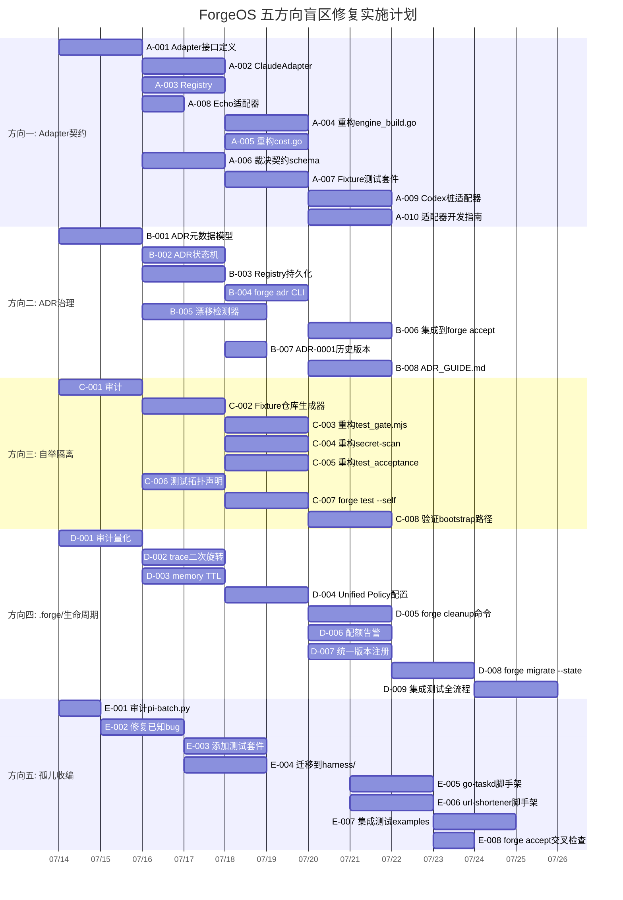

# Tech Lead 分析报告: 五方向架构盲区可执行任务分解

> **文档状态**: v1.0 · 2026-07-12  
> **分析对象**: `docs/requirements/2026-07-11-five-codegrounded-architectural-blindspots-five-directions.md`  
> **审核修正**: 已采纳 `2026-07-11-five-codegrounded-architectural-blindspots-five-directions.out.md` 的事实修正  
> **代码基线**: forge-core (Go stdlib-only 18 包) + harness (Node.js) + cmd/forge ~32k LOC  
> **优先级共识**: P0 方向一(Adapter契约) = P0 方向四(.forge生命周期) > P1 方向二(ADR治理) > P1 方向三(自举隔离) > P2 方向五(孤儿收编)

---

## 目录

1. [任务分解](#1-任务分解)
2. [执行顺序与依赖图](#2-执行顺序与依赖图)
3. [技术风险](#3-技术风险)
4. [资源评估](#4-资源评估)
5. [质量保证](#5-质量保证)
6. [实施计划](#6-实施计划)

---

## 1. 任务分解

### 1.1 方向一: 可插拔 Agent 适配器契约 (P0)

**核心逻辑**: 从 `engine_build.go`、`cost.go` 中提取出形式化的 Adapter interface，使 Codex/Gemini CLI/OpenHands 适配器成为可独立开发、测试的代码模块。当前 `claudeArgv` 和 `parseClaudeCostUsd` 全部硬编码 claude CLI 私有协议。

| ID | 任务标题 | 涉及文件 | 前置依赖 | 工时 | 验收标准 |
|----|---------|---------|---------|------|---------|
| A-001 | 定义 `Adapter` 接口 | `forge-core/internal/adapter/adapter.go` (新) | 无 | 2h | 接口包含 `BuildArgv(prompt, opts) → []string`, `ParseCost(output) → (usd, ok)`, `ParseVerdict(output) → (verdict, ok)`, `SanitizeOutput(output) → string` 四方法;每个方法有 Go doc 合约(入参语义、出错行为、线程安全性);接口通过 `go vet` 和 `golint` |
| A-002 | 实现 `ClaudeAdapter` | `forge-core/internal/adapter/claude.go` (新) | A-001 | 3h | 从 `engine_build.go:claudeArgv` 和 `cost.go:parseClaudeCostUsd`/`parseReviewerVerdict`/`unwrapClaudeResult` 迁移逻辑;保持与现有行为字节级兼容;现有测试全部通过 |
| A-003 | 实现 adapter 注册表 | `forge-core/internal/adapter/registry.go` (新) | A-001 | 2h | `Register(name string, factory func() Adapter)`, `Get(name string) (Adapter, bool)`, `List() []string`;支持 `--agent-cmd=claude` → ClaudeAdapter 自动查找;并发安全(sync.RWMutex) |
| A-004 | 重构 `engine_build.go` 使用 adapter | `forge-core/cmd/forge/engine_build.go` | A-002, A-003 | 2h | 删除 `claudeArgv` 函数,改为 `adapter.Get("claude").BuildArgv(...)`;`parseClaudeCostUsd` → `adapter.Get(claude).ParseCost(...)`;保留 `isClaude` 开关作为临时向后兼容;全部 `echo` 测试仍然通过 |
| A-005 | 重构 `cost.go` 使用 adapter | `forge-core/cmd/forge/cost.go` | A-002, A-003 | 2h | `parseReviewerVerdict` → adapter 层调用; `unwrapClaudeResult` → `SanitizeOutput`;确保 `TotalCostUsd` → `ParseCost` 语义转换 |
| A-006 | 提取机读裁决契约 schema | `forge-core/internal/adapter/schema.go` + `.agent/schemas/verdict.yml` (新) | A-001 | 2h | 从 `.agent/agents/reviewer.md` 散文中提取 YAML schema: `verdict: APPROVE\|REQUEST_CHANGES\|ABSTAIN`;`format: "forgeos.verdict.v1"`;generator 函数 `GenerateVerdictLine(verdict) → string` |
| A-007 | 构建 Adapter fixture 测试套件 | `forge-core/internal/adapter/adapter_test.go` (新) | A-002, A-003 | 3h | 每个 Adapter 提供 fixture 目录(`testdata/claude/`, `testdata/echo/`);含输入 prompt → 期望 argv → 期望输出;新 adapter 只需添加 fixture 数据即可验证;覆盖率 >85% |
| A-008 | 实现 `echo` 参考适配器(用于测试) | `forge-core/internal/adapter/echo.go` (新) | A-001 | 1h | 最少实现: `BuildArgv` 返回固定 echo 命令; `ParseCost` 从模拟 JSON 读取;用于集成测试验证 adapter 接口正确性 |
| A-009 | 实现 `codex` 桩适配器(协议占位) | `forge-core/internal/adapter/codex.go` (新) | A-001 | 2h | 基于 `adb` 和公开文档的最小实现; `BuildArgv` 构造 `adb -m model -t prompt`; `ParseCost` 返回(0,false)(协议待定);明确标注为 EXPERIMENTAL |
| A-010 | 撰写适配器开发指南 | `docs/developer/adapter-guide.md` (新) | A-007 | 2h | 包含:接口定义、注册方法、测试 fixture 创建、调试技巧; 附带最小可运行示例(codex-stub) |

**方向一小计**: 10 任务 · 21 工时 · 核心打通 A-001→A-004 仅需 9 工时(≈1.1 dev-day)

---

### 1.2 方向二: ADR 可执行治理闭环 (P1)

**核心逻辑**: 在已有 `internal/adr/adr_test.go` 基础上，新增 ADR 状态机、生命周期管理 CLI、自动漂移检测。方向从"从零构建"重新定位为"在已有基础上扩展"。

| ID | 任务标题 | 涉及文件 | 前置依赖 | 工时 | 验收标准 |
|----|---------|---------|---------|------|---------|
| B-001 | 扩展 ADR 元数据模型 | `forge-core/internal/adr/model.go` (新) | 无 | 2h | 新增 `Status` (Proposal/Accepted/Rejected/Superseded/Deprecated), `Supersedes`, `SupersededBy`, `Title`, `CreatedAt`, `ValidatedAt` 字段; `DocRef` 链接到 `docs/adr/NNNN.md`; JSON 序列化/反序列化;现有 adr_test.go 不受影响 |
| B-002 | 实现 ADR 状态机 | `forge-core/internal/adr/state_machine.go` (新) | B-001 | 3h | 有效转换: Proposal→Accepted, Proposal→Rejected, Accepted→Superseded(指向新ADR), Accepted→Deprecated; 无效转换返回错误(如 Rejected→Accepted); 完整表驱动测试覆盖所有 10 条转换路径 |
| B-003 | 实现 ADR Registry 持久化 | `forge-core/internal/adr/registry.go` (新) | B-001 | 2h | JSONL 文件 `.agent/adr-registry.jsonl` (与 trace/memory 同模式); `Load()`, `Save()`, `Get(id)`, `List()`, `Add(entry)`, `UpdateStatus(id, newStatus)`;原子写(临时文件+rename) |
| B-004 | 实现 `forge adr` CLI 子命令 | `forge-core/cmd/forge/adr_cli.go` (新) | B-003 | 3h | `forge adr list` → 表格输出; `forge adr status 0001` → 单条详情; `forge adr supersede 0003 --by=0005` → 状态转换; `forge adr validate` → 运行所有 adr_test.go + 约束检查;输出格式统一(JSON + 人类可读) |
| B-005 | 构建漂移检测器 | `forge-core/internal/adr/drift.go` (新) | B-001, B-004 | 3h | 声明式约束 DSL: `DepZero["forge-core" → true]` `PhaseCount["balanced" → "P1,P2,P4"]`; ADR-0004 phase 漂移检测作为首个真实案例; 输出 `[]DriftReport{ID, ADRRef, Expected, Actual, Severity}`; 测试验证已知漂移可检测 |
| B-006 | 集成漂移检测到 `forge accept` | `harness/acceptance.mjs` 扩展 | B-005 | 2h | `forge validate --adrs` 作为 `forge accept` 的 `arch-check` 扩展步骤; 漂移 Severity=error 阻断 pipeline; Severity=warn 仅报告; `--bypass-adr` flag 用于过渡期 |
| B-007 | 写入 ADR-0001 历史版本(状态机证明) | `docs/adr/0001.md` 更新 | B-002 | 1h | ADR-0001 状态从 Accepted→StageCompleted(或新增 Past 状态); 添加 `Status: Past`, `SupersededBy: ADR-0006`(如适用); 作为状态机实际落地示范 |
| B-008 | 迁移 GUIDE.md 中现有 ADR 状态 | `docs/adr/ADR_GUIDE.md` (新) | B-003 | 2h | 更新 docs/adr/ 中的流程说明:ADR 生命周期、状态机转换图、CLI 用法; 包含从散文化 ADR 迁移到结构化 registry 的 instructions |

**方向二小计**: 8 任务 · 18 工时 · 核心打通 B-001→B-004 需 10 工时(≈1.3 dev-day)

---

### 1.3 方向三: 自我测试隔离与自举完整性 (P1)

**核心逻辑**: 承认已有 `mkdtempSync` 隔离的存在, 但聚焦于仍然存在的真实仓库集成测试循环依赖风险。所有 `test_*.mjs` 集成测试改为操作隔离 fixture 而非真实工作区。

| ID | 任务标题 | 涉及文件 | 前置依赖 | 工时 | 验收标准 |
|----|---------|---------|---------|------|---------|
| C-001 | 审计: 标记所有对真实仓库敏感依赖的测试 | `harness/audit-self-test.md` (新) | 无 | 2h | 遍历 10 个 `test_*.mjs`; 对每个测试记录: (a)是否使用 `mkdtempSync`? (b)是否执行对真实仓库的 gate? (c)是否在 `FORGE_ACCEPT_INNER` guard 下? (d)修复可行性评估; 输出审计矩阵表格 |
| C-002 | 构建 hermetic fixture 仓库生成器 | `harness/fixture/repo-builder.mjs` (新) | C-001 | 3h | 在 `os.mkdtempSync()` 中创建最小项目:`forge init` → 添加模拟违规文件 → 预期 gate 输出; 支持 `createFixtureRepo({files:[], gates:[]})` 声明式 API; 与 `test_gate.mjs` 的 fixture 层可组合 |
| C-003 | 重构 `test_gate.mjs` 为纯 fixture 模式 | `harness/test_gate.mjs` | C-002 | 2h | 删除所有对真实仓库的操作; 全部迁移到 `repo-builder.mjs` fixture; 保留行数/体积检查的单元测试层; 集成测试只操作 hermetically created repos |
| C-004 | 重构 `test_secret-scan.mjs` 为纯 fixture 模式 | `harness/test_secret-scan.mjs` | C-002 | 2h | 扫描目标改为 fixture 生成的模拟文件; 真实仓库扫描移至独立 `forge scan --self` 路径; 95% 测试在 fixture 层, 5% 在真实仓库 |
| C-005 | 重构 `test_acceptance.mjs` 分离集成测试 | `harness/test_acceptance.mjs` | C-002 | 3h | 保留 `ACCEPT_INNER` guard 但将其缩小到最小路径; "acceptance gate ACCEPTS the repo it runs in" 改为在 fixture repo 上 `forge accept`; 将 `FORGE_ACCEPT_INNER` 转换为结构化测试拓扑声明 |
| C-006 | 实现测试拓扑声明机制 | `harness/test-topology.yml` (新) + 加载逻辑 | C-001 | 2h | YAML 文件声明每个测试的安全执行上下文: `test_gate.mjs: {type: hermetic, safe_in_repo: true}`, `test_acceptance.mjs: {type: hybrid, safe_in_repo: false}`; `forge accept` 的 test gate 读取此声明, 对 `safe_in_repo: false` 的测试在子进程中运行隔离环境 |
| C-007 | 实现 `forge test --self` 命令 | `forge-core/cmd/forge/test_self.go` (新) + `harness/self-test-runner.mjs` | C-006 | 3h | 在隔离目录中创建最小 forge 项目 → `forge init` → 运行断言 → 销毁; 与 CI 中 `forge accept` 的 test gate 分离; 输出 JUnit XML 格式的测试报告 |
| C-008 | 验证 bootstrap 路径无循环 | 端到端测试 | C-005, C-007 | 2h | 模拟场景: 注入 `gate.mjs` 假阳性 bug → 确保修复提交可正常通过 `forge accept`; 自动化 e2e 测试验证此路径(CI 内的隔离子进程) |

**方向三小计**: 8 任务 · 19 工时 · 核心打通 C-001→C-005 需 12 工时(≈1.5 dev-day)

---

### 1.4 方向四: `.forge/` 状态目录版本契约与生命周期管理 (P0)

**核心逻辑**: 已有 checkpoint 版本化(`FormatVersion: "forgeos.checkpoint.v1"`)和 retain=5,但 trace 二次旋转、memory TTL、统一清理策略、配额告警仍缺失。scorecards 不在 `.forge/` 下而在 `.agent/routing/` 中, 需修正认知。

| ID | 任务标题 | 涉及文件 | 前置依赖 | 工时 | 验收标准 |
|----|---------|---------|---------|------|---------|
| D-001 | 审计: 量化 `.forge/` 增长模式 | `docs/tech-lead/state-audit-report.md` (新) | 无 | 2h | 对每种状态类型(trace/memory/checkpoint)测量: 单次 evolve 100 迭代的增量字节数, 7 天连续运行的累计大小, 旋转/compact 触发频次; 产出容量规划表 |
| D-002 | 实现 trace 二次旋转(运行时周期性检查) | `forge-core/cmd/forge/evolve.go` (修改 openTracer + evolve loop) | D-001 | 3h | 在 evolve loop 每次迭代后检查 trace 文件大小; >10MB 时旋转为 `.1`(如果存在 `.1`, 先 `.1→.2`); 支持配置 `max_trace_mb`(默认 50); 不降低 perf(stat 调用, 非 O(n)) |
| D-003 | 实现 memory TTL 机制 | `forge-core/internal/memory/compact.go` (修改) | D-001 | 3h | `Compact()` 新增 `maxAge time.Duration` 参数; 删除 `UpdatedAtUnix` 早于 `now - maxAge` 的条目; 默认 TTL=90 天; `CompactPreserveCount(minEntries int)` 确保至少保留 N 条; 单元测试: TTL 裁剪精确, 边界情况(time zero, future timestamp) |
| D-004 | 实现 Unified Lifecycle Policy 配置 | `.forge/policy.yml` (新) + `forge-core/internal/state/policy.go` (新) | D-002, D-003 | 3h | YAML schema: `state.trace.max_size_mb`, `state.trace.retention_days`, `state.memory.ttl_days`, `state.checkpoint.retain_count`, `state.scorecards.max_files`; 解析器: 不存在的策略使用安全默认值; 启动时加载, 周期重读(支持热更新) |
| D-005 | 实现 `forge cleanup` 命令 | `forge-core/cmd/forge/cleanup.go` (新) + `forge-core/internal/state/cleanup.go` (新) | D-004 | 3h | 按 policy 清理过期数据: trace 旋转 + 删除过期备份; memory TTL 压缩; checkpoint 仅保留 retain_count 份; scorecards 清理旧文件; `forge cleanup --dry-run` 预告模式; `forge evolve --cleanup` 自动触发 |
| D-006 | 实现配额告警 | `forge-core/internal/state/quota.go` (新) + `forge-core/cmd/forge/doctor.go` (修改) | D-004 | 2h | `forge doctor` 报告 `.forge/` 配额使用率; evolve 日志在 >80% 配额时输出 WARNING; 阈值可配置 `state.warn_at_percent: 80`, `state.block_at_percent: 95`; `BlockAtPercent` 超过时 `forge evolve` 失败(非 dry-run) |
| D-007 | 统一状态类型版本注册 | `forge-core/internal/state/versions.go` (新) | D-004 | 2h | 所有持久化类型注册到统一 registry: trace → `"forgeos.trace.v1"`, memory → `"forgeos.memory.v1"`, checkpoint → `"forgeos.checkpoint.v1"`; 启动时自动检测版本兼容性; 不能识别的版本 → fail-closed(error, 不静默加载) |
| D-008 | 实现 `forge migrate --state` | `forge-core/cmd/forge/migrate.go` (新) | D-007 | 3h | 迁移路径: `v0→v1` checkpoint 补 `_format` 字段; `v1→v2` 可能的新格式; 安全: 迁移前备份原文件; 回滚: 保留原文件直到确认成功; 测试: 使用旧格式 fixture + 迁移 + 验证新格式 |
| D-009 | 集成测试: 生命周期全流程 | `forge-core/cmd/forge/state_lifecycle_test.go` (新) | D-004, D-005, D-006 | 3h | 模拟 100 迭代 evolve → 触发 trace 旋转(超过 max_size) → memory TTL 裁剪 → checkpoint retain 历史 → cleanup → 配额告警; 全部在 `t.TempDir()` 隔离环境中运行 |

**方向四小计**: 9 任务 · 24 工时 · 核心打通 D-001→D-005 需 14 工时(≈1.8 dev-day)

---

### 1.5 方向五: 治理孤儿收编 (P2)

**核心逻辑**: pi-batch.py 在治理体系外(无测试、无 arch-check、已知 bug 未跟踪)且 examples/ 无治理脚手架。需修正: 根目录 7 文件 < 15, 未违反 max_root_files。

| ID | 任务标题 | 涉及文件 | 前置依赖 | 工时 | 验收标准 |
|----|---------|---------|---------|------|---------|
| E-001 | 审计 pi-batch.py: 标记已知 bug + 测试缺口 | `docs/audit/pi-batch-audit.md` (新) | 无 | 1h | 确认超时 2×偏差的根因(混合 stdout+stderr 流?); 确认 `FileNotFoundError` 无法区分的具体场景; 列出所有未覆盖的执行路径 |
| E-002 | 修复 pi-batch.py 已知 bug | `pi-batch.py` | E-001 | 2h | 超时偏差: 使用 `asyncio.wait_for` + `wait` 正确区分 stdout/stderr; FileNotFoundError: 在 `subprocess.Popen` 前检查 `shutil.which` + 区分错误信息; 每个修复附带单测 |
| E-003 | 为 pi-batch.py 添加测试套件 | `harness/test_batch.mjs` (新) | E-002 | 2h | 镜像 `test_sca.mjs` 模式; 测试: YAML 解析(合法/非法), 串行执行, 并行执行, 超时触发, FileNotFoundError 处理; fixture 用 `os.mkdtempSync()` + 模拟任务文件 |
| E-004 | 迁移 pi-batch.py 到 harness/ 下 | `pi-batch.py` → `harness/pi-batch.mjs` | E-002 | 2h | 保持 `pi-batch` CLI 入口(可通过 symlink 或 alias); 根目录减少 1 个文件到 6 个; 注册到 gate.mjs 的检查范围; 保留 `--help` 和所有现有 flag |
| E-005 | 生成 examples/go-taskd 治理脚手架 | `examples/go-taskd/.agent/` (新) + `examples/go-taskd/.github/` (新) | 无 | 2h | `forge init` 等价产物: `.agent/agents/`, `.agent/workflows/`, `.agent/project.yml`, `.github/workflows/forge.yml`; 可运行的 `forge accept` 演示; 与 examples 的现有代码兼容 |
| E-006 | 生成 examples/url-shortener 治理脚手架 | `examples/url-shortener/.agent/` (新) + `examples/go-taskd/.github/workflows/forge.yml` (新) | 无 | 2h | 同上; 额外: 为 url-shortener 添加 `forge accept` 前置条件 web 测试(可选); 确保 `forge run build` 在 examples 中可工作 |
| E-007 | 添加集成测试: forge-init 产物 = examples 治理结构 | `harness/test_examples_governance.mjs` (新) | E-005, E-006 | 2h | 在 fixture repo 上运行 `forge init my-project`; 递归比较 `.agent/` 结构与 `examples/go-taskd/.agent/`; 差异报告(预期差异如 project name 除外); 断言目录结构与关键文件存在 |
| E-008 | 添加 `forge accept` 对 examples/ 的交叉检查 | `harness/gate.mjs` 扩展 | E-005 | 1h | `forge accept` 的 `arch-check` 新增检查: examples/ 下每个项目必须有 `.agent/project.yml`; 新 examples 默认为 warn(过渡期) |

**方向五小计**: 8 任务 · 14 工时 · 核心打通 E-001→E-004 需 7 工时(≈0.9 dev-day)

---

## 2. 执行顺序与依赖图

### 全景依赖关系

```mermaid
graph TD
    %% ============ 方向一: Adapter 契约 ============
    subgraph "方向一 (P0) · 可插拔 Adapter 契约"
        A001[A-001 定义Adapter接口<br/>2h] --> A002[A-002 实现ClaudeAdapter<br/>3h]
        A001 --> A003[A-003 实现adapter注册表<br/>2h]
        A001 --> A006[A-006 提取裁决契约schema<br/>2h]
        A001 --> A008[A-008 Echo参考适配器<br/>1h]
        A002 --> A004[A-004 重构engine_build.go<br/>2h]
        A002 --> A005[A-005 重构cost.go<br/>2h]
        A003 --> A004
        A003 --> A005
        A002 & A003 --> A007[A-007 Fixture测试套件<br/>3h]
        A006 --> A010[A-010 适配器开发指南<br/>2h]
        A007 --> A010
        A004 & A005 & A007 --> A009[A-009 Codex桩适配器<br/>2h]
    end

    %% ============ 方向二: ADR 治理 ============
    subgraph "方向二 (P1) · ADR 可执行治理闭环"
        B001[B-001 ADR元数据模型<br/>2h] --> B002[B-002 ADR状态机<br/>3h]
        B001 --> B003[B-003 ADR Registry持久化<br/>2h]
        B001 --> B005[B-005 漂移检测器<br/>3h]
        B002 & B003 --> B004[B-004 forge adr CLI<br/>3h]
        B005 --> B006[B-006 集成到forge accept<br/>2h]
        B002 & B004 --> B007[B-007 ADR-0001历史版本<br/>1h]
        B004 --> B008[B-008 ADR_GUIDE.md<br/>2h]
    end

    %% ============ 方向三: 自举隔离 ============
    subgraph "方向三 (P1) · 自我测试隔离"
        C001[C-001 审计:标记依赖<br/>2h] --> C002[C-002 Fixture仓库生成器<br/>3h]
        C002 --> C003[C-003 重构test_gate.mjs<br/>2h]
        C002 --> C004[C-004 重构test_secret-scan.mjs<br/>2h]
        C002 --> C005[C-005 重构test_acceptance.mjs<br/>3h]
        C001 --> C006[C-006 测试拓扑声明机制<br/>2h]
        C006 --> C007[C-007 forge test --self<br/>3h]
        C005 & C007 --> C008[C-008 验证bootstrap路径<br/>2h]
    end

    %% ============ 方向四: .forge/ 生命周期 ============
    subgraph "方向四 (P0) · .forge/ 生命周期管理"
        D001[D-001 审计:量化增长模式<br/>2h] --> D002[D-002 trace二次旋转<br/>3h]
        D001 --> D003[D-003 memory TTL<br/>3h]
        D001 --> D004[D-004 Unified Policy配置<br/>3h]
        D002 & D003 --> D004
        D004 --> D005[D-005 forge cleanup命令<br/>3h]
        D004 --> D006[D-006 配额告警<br/>2h]
        D004 --> D007[D-007 统一版本注册<br/>2h]
        D007 --> D008[D-008 forge migrate --state<br/>3h]
        D005 & D006 & D008 --> D009[D-009 集成测试:全流程<br/>3h]
    end

    %% ============ 方向五: 孤儿收编 ============
    subgraph "方向五 (P2) · 治理孤儿收编"
        E001[E-001 审计pi-batch.py<br/>1h] --> E002[E-002 修复已知bug<br/>2h]
        E002 --> E003[E-003 添加测试套件<br/>2h]
        E002 --> E004[E-004 迁移到harness/<br/>2h]
        E005[E-005 go-taskd治理脚手架<br/>2h] --> E007[E-007 集成测试:forge-init≈examples<br/>2h]
        E006[E-006 url-shortener治理脚手架<br/>2h] --> E007
        E005 --> E008[E-008 forge accept交叉检查<br/>1h]
    end

    %% ============ 跨方向依赖 ============
    A003 -.->|可选整合| B003
    A006 -.->|裁决schema可复用| B005
    C002 -.->|fixture模式可复用| E003
    D005 -.->|cleanup可扩展| E004
```



### 并行执行组

```
┌────────────────────────────────────────────────────────────────┐
│ Phase 1 (Week 1-2): 基础设施 & 审计                             │
│                                                                 │
│ 组A ┌─────────────────┐  组B ┌──────────────────┐             │
│     │ A-001 Adapter   │      │ B-001 ADR Model   │             │
│     │ 接口定义 (2h)    │      │ (2h)              │             │
│     ├─────────────────┤      ├──────────────────┤             │
│     │ C-001 审计      │      │ D-001 量化审计    │             │
│     │ (2h)            │      │ (2h)              │             │
│     ├─────────────────┤      ├──────────────────┤             │
│     │ E-001 pi-audit  │      │ E-005/006        │             │
│     │ (1h)            │      │ examples脚手架(4h)│             │
│     └─────────────────┘      └──────────────────┘             │
└────────────────────────────────────────────────────────────────┘

┌────────────────────────────────────────────────────────────────┐
│ Phase 2 (Week 2-4): 核心实现                                    │
│                                                                 │
│ 组C ┌─────────────────┐  组D ┌──────────────────┐             │
│     │ A-002 Claude    │      │ B-002 状态机      │             │
│     │ Adapter (3h)    │      │ (3h)              │             │
│     │ A-003 Registry  │      │ B-003 Registry    │             │
│     │ (2h)            │      │ 持久化 (2h)       │             │
│     │ A-008 Echo(1h)  │      │                   │             │
│     ├─────────────────┤      ├──────────────────┤             │
│     │ C-002 Fixture   │      │ D-002 trace旋转   │             │
│     │ 生成器 (3h)      │      │ (3h)              │             │
│     │ C-006 拓扑声明  │      │ D-003 memory TTL  │             │
│     │ (2h)            │      │ (3h)              │             │
│     ├─────────────────┤      ├──────────────────┤             │
│     │ E-002 修复      │      │                   │             │
│     │ pi-batch (2h)   │      │                   │             │
│     └─────────────────┘      └──────────────────┘             │
└────────────────────────────────────────────────────────────────┘

┌────────────────────────────────────────────────────────────────┐
│ Phase 3 (Week 4-6): 集成 & 测试                                 │
│                                                                 │
│ 组E ┌─────────────────┐  组F ┌──────────────────┐             │
│     │ A-004/005 重构  │      │ B-004 CLI (3h)    │             │
│     │ engine+cost(4h) │      │ B-005 漂移检测(3h)│             │
│     │ A-007 测试套件  │      │                   │             │
│     │ (3h)            │      │                   │             │
│     ├─────────────────┤      ├──────────────────┤             │
│     │ C-003/004/005   │      │ D-004 Unified     │             │
│     │ 重构3个测试(7h)  │      │ Policy (3h)       │             │
│     │ C-007 test-self │      │ D-005 cleanup(3h) │             │
│     │ (3h)            │      │                   │             │
│     ├─────────────────┤      ├──────────────────┤             │
│     │ E-003/004 测试  │      │                   │             │
│     │ + 迁移 (4h)     │      │                   │             │
│     └─────────────────┘      └──────────────────┘             │
└────────────────────────────────────────────────────────────────┘

┌────────────────────────────────────────────────────────────────┐
│ Phase 4 (Week 6-8): 收尾 & 文档                                 │
│                                                                 │
│ 组G ┌─────────────────┐  组H ┌──────────────────┐             │
│     │ A-009 Codex     │      │ B-006 集成accept │             │
│     │ 桩 (2h)         │      │ (2h)              │             │
│     │ A-010 指南 (2h) │      │ B-007/008 文档   │             │
│     │                 │      │ (3h)              │             │
│     ├─────────────────┤      ├──────────────────┤             │
│     │ C-008 bootstrap │      │ D-006 配额告警   │             │
│     │ 验证 (2h)       │      │ (2h)              │             │
│     │                 │      │ D-007 版本注册   │             │
│     │                 │      │ (2h)              │             │
│     ├─────────────────┤      ├──────────────────┤             │
│     │ E-007/008       │      │ D-008 migrate(3h)│             │
│     │ 集成+交叉检查(3h)│      │ D-009 全流程测试 │             │
│     └─────────────────┘      │ (3h)              │             │
│                              └──────────────────┘             │
└────────────────────────────────────────────────────────────────┘
```

---

## 3. 技术风险

### 3.1 方向一: Adapter 契约 — 风险矩阵

| # | 风险 | 概率 | 影响 | 缓解策略 |
|---|------|------|------|---------|
| R1 | **Adapter 接口过度抽象** — 设计出不适合所有 CLI 的通用接口(遗漏关键语义如 streaming、tool-use) | 中 | 高 | 先实现 2 个真实 adapter(Claude + Echo)再固化接口; 接口设计 review 邀请有 Codex/OpenHands 经验者; 接口 v1 标记为 Experimental(1 个版本迭代) |
| R2 | **Claude JSON output schema 变更** — claude CLI 更新 `total_cost_usd` 字段名或结构 | 低 | 中 | Adapter 层封装可独立升级; 在 ClaudeAdapter 中实现版本协商(如果检测到未知格式→fallback 到文本解析); fixture 测试定期更新 |
| R3 | **裁决契约从散文迁移到 schema 时语义丢失** — reviewer.md 中隐含的"末行规则"可能在 schema 化过程中遗漏 | 中 | 高 | 迁移前对 30 条真实 review 输出做黄金文件收集; schema 化后验证所有黄金文件可正确解析; 保持 `ParseVerdict` 向后兼容散文格式 |
| R4 | **`--agent-cmd` flag 变更影响现有用户** — 当前 `--agent-cmd=echo` 用于测试, 重构后路径可能中断 | 低 | 高 | 先保持 `isClaude` 向后兼容布尔开关; 测试全部用 `echo` 适配器保证不变; 发布日志明确标注 breaking change |

### 3.2 方向二: ADR 治理 — 风险矩阵

| # | 风险 | 概率 | 影响 | 缓解策略 |
|---|------|------|------|---------|
| R5 | **ADR 状态机被绕过** — 开发者直接编辑 `.agent/adr-registry.jsonl` 绕过 CLI 状态转换 | 中 | 中 | registry 使用签名或只追加模式(append-only JSONL); `forge adr supersede` 为唯一写入路径; `forge validate --adrs` 在 CI 中检测手动编辑 |
| R6 | **漂移检测产生过多噪音** — 代码主动演进(有意偏离 ADR)触发 false positive 告警 | 高 | 中 | 漂移检测初始为 warn 级别; Severity 机制允许文档化豁免; 每次漂移建议同时提交 ADR 更新(将漂移转换为新的 ADR 状态) |
| R7 | **ADR Registry 与已有 adr_test.go 重复** — 两个系统同时检查 ADR 约束, 可能产生冲突 | 中 | 低 | Registry 约束是声明式 DSL, adr_test.go 是 falsifiable Go 测试; 两者互补而非重叠; Registry 约束可自动生成 adr_test.go 桩(可选) |

### 3.3 方向三: 自举隔离 — 风险矩阵

| # | 风险 | 概率 | 影响 | 缓解策略 |
|---|------|------|------|---------|
| R8 | **Fixture 仓库与真实行为漂移** — fixture 过于简化导致测试通过但真实场景失败 | 高 | 高 | fixture 仓库从真实项目的最小快照生成; 定期(每 sprint)用真实仓库集成测试验证 fixture 信度; 维护一张 fixture ↔ 真实场景映射表 |
| R9 | **测试拓扑声明增加维护负担** — 每个新测试需声明自身类型, 容易忘记 | 中 | 低 | 默认策略: 新测试自动标记为 `safe_in_repo: false`(最安全); 切换到 `true` 需要显式 review; CI 中 `validate-topology` 检查确保所有测试有声明 |
| R10 | **`forge test --self` 执行时间过长** — 完整的 hermetic 环境创建 + 销毁 + 断言可能耗时 >30s | 中 | 中 | 使 `--self` 在 CI 中独立于常规 test gate; 使用 fixture 缓存; 不阻塞 `forge accept` 主路径 |

### 3.4 方向四: `.forge/` 生命周期 — 风险矩阵

| # | 风险 | 概率 | 影响 | 缓解策略 |
|---|------|------|------|---------|
| R11 | **trace 旋转与 evolve loop 写入竞争** — 后台旋转线程与 evolve 主线程同时操作 trace 文件 | 中 | 高 | 旋转在 evolve 迭代间同步点执行(迭代完成后→写新 trace 前); 使用文件锁(如果多进程); 保持当前简单模式(仅在迭代结束时检查) |
| R12 | **`forge cleanup` 误删正在运行的 evolve session 的 checkpoint** — 用户同时运行 evolve + cleanup | 低 | 高 | cleanup 跳过 `最新 N 个 checkpoint`(保留 retain_count); 检测 evolve 进程是否存活; `--dry-run` 为默认模式 |
| R13 | **policy.yml 修改后格式不兼容** — 旧版本 forge 读取新格式 policy.yml 无法解析 | 低 | 中 | policy.yml schema 带 `_format: "forgeos.policy.v1"`; 无法识别版本时 fail-closed; 提供 `forge migrate --policy` |

### 3.5 方向五: 孤儿收编 — 风险矩阵

| # | 风险 | 概率 | 影响 | 缓解策略 |
|---|------|------|------|---------|
| R14 | **pi-batch.py 迁移到 harness/ 破坏现有 CI 脚本** — 路径变更影响其他引用 | 中 | 高 | 保留根目录 symlink `pi-batch.py → harness/pi-batch.mjs` 作为过渡; CI 中显式引用更新; 发布日志标注 |
| R15 | **examples 治理脚手架与 forge-init 产物不同步** — forge-init 演进但 examples 未更新 | 中 | 低 | E-007 集成测试自动检测差异; CI 中 `test_examples_governance.mjs` 作为 gate 运行 |

---

## 4. 资源评估

### 4.1 人员需求

| 角色 | 技能要求 | 需要人数 | 负责方向 | 工作量(人·天) |
|------|---------|---------|---------|-------------|
| Go 核心开发 | 精通 Go, 接口设计, 重构 | 1 人 | 方向一 + 方向四(核心) + 方向二(ADR 引擎) | 20 天 |
| Go 开发(Ⅱ) | Go 基础 + CLI 开发 | 1 人 | 方向二(CLI) + 方向三(forge test --self) + 方向五 | 15 天 |
| JS/Node 开发 | Node.js, 测试重构 | 1 人 | 方向三(harness 测试重构) + 方向五(测试) | 12 天 |
| 架构师/Lead | 接口 review, 跨方向协调 | 0.5 人(兼职) | 全部方向 — 设计审查 | 8 天 |

**总人力**: 2.5–3 FTE · 工期: 8 周 · 总工作量: ~55 人·天

### 4.2 关键里程碑

| 里程碑 | 时间 | 交付物 | 验收标准 |
|--------|------|--------|---------|
| M0: 设计冻结 | Week 1 | Interface/Policy schema 设计文档 | 5 方向接口设计 review 通过; ADR-0001 状态机落地 |
| M1: 核心接口打通 | Week 2 | A-001 + B-001 + D-001 + C-001 完成 | Adapter 接口定义冻结; ADR 元数据模型冻结; 审计报告完成 |
| M2: 核心实现 | Week 4 | A-002/003 + B-002/003 + D-002/003 + C-002 | ClaudeAdapter 可运行; ADR 状态机 + Registry 可用; trace 旋转 + memory TTL 可用; fixture 生成器可用 |
| M3: 集成 | Week 6 | A-004/005/007 + B-004/005 + D-004/005 + C-003/004/005 | 重构后的 engine_build 和 cost 使用 adapter; forge adr CLI 可用; forge cleanup 可用; 3 个测试改为 fixture 模式 |
| M4: 生产就绪 | Week 8 | A-009/010 + B-006/008 + D-006/007/008/009 + C-007/008 + E-001→008 | Codex 桩适配器; ADR 漂移检测集成到 forge accept; 配额告警; 版本迁移; 全流程集成测试; pi-batch 收编; examples 治理化 |

### 4.3 阻塞点与解决策略

| 阻塞点 | 影响方向 | 解决策略 | Owner |
|--------|---------|---------|-------|
| **Checkpoint 格式版本已存在, 如何迁移?** | 方向四 | "forgeos.checkpoint.v1" 兼容空值(old); 无需立即迁移; 文档标注 D-008 为可选 | Go 核心开发 |
| **adr_test.go 在 cmd/forge/ 和 internal/adr/ 各有一份?** | 方向二 | 实际有两份: `cmd/forge/adr_test.go`(main pkg) + `internal/adr/adr_test.go`(pkg adr); 方向建立时统一 registry, adr_test.go 保留作为 falsifiable 合约 | Go 核心开发 |
| **scorecards 路径不在 `.forge/`** | 方向四 | 文档修正; D-004 policy 配置中 scorecards 路径指向 `.agent/routing/scorecards.json`; 不移动文件, 只加保留策略 | 架构师 |
| **pi-batch.py 与 forge batch 功能重叠** | 方向五 | 当前不合并; 仅收编到 harness/ + 加测试; forge batch 作为未来路线图(RFC) | Go 开发(Ⅱ) |

---

## 5. 质量保证

### 5.1 单元测试覆盖要求

| 方向 | 包/文件 | 最低覆盖率 | 关键测试场景 |
|------|--------|-----------|-------------|
| 方向一 | `internal/adapter/` | 90% | 每个 Adapter 方法: 正常输入、空输入、非法输入; 注册表并发安全; fixture 校验: 10+ 变体 |
| 方向二 | `internal/adr/` 状态机 | 95% | 10 条状态转换路径验证; Registry 原子写(进程 crash + 文件损坏); 漂移检测: 已知漂移可检测、无漂移不误报 |
| 方向三 | `harness/fixture/` | 85% | fixture 仓库创建/销毁/清理; 拓扑声明解析(合法/非法/缺失) |
| 方向四 | `internal/state/` | 85% | Policy 解析(合法/非法/缺失); trace 旋转边界(正好 10MB、1MB、0MB); memory TTL 精确性; cleanup dry-run 只报告不删除 |
| 方向五 | `harness/test_batch.mjs` | 80% | YAML 解析(合法/非法); 超时触发; FileNotFound 区分; examples 脚手架目录结构完整 |

### 5.2 集成测试策略

| 测试套件 | 位置 | 运行频率 | 内容 |
|---------|------|---------|------|
| **Adapter 集成测试** | `internal/adapter/adapter_test.go` | `go test ./internal/adapter/` 每次提交 | 用 echo adapter 测试完整 round-trip: BuildArgv → Run → ParseCost → ParseVerdict |
| **终态生命周期测试** | `cmd/forge/state_lifecycle_test.go` | `go test ./cmd/forge/ -run StateLifecycle` | 模拟 100 迭代 evolve: trace 旋转触发、memory TTL 裁剪、cleanup 验证磁盘减少 |
| **Harness 自举测试** | `harness/test_bootstrap_cycle.mjs` | 每周 + CI 的独立 job | 注入模拟 bug → 验证修复可通过 forge accept |
| **Examples 治理一致性** | `harness/test_examples_governance.mjs` | 每次修改 examples/ | forge-init 产物 ≈ examples 治理结构 |
| **DRT (Differential Robustness Testing)** | CI 中每周 | 每周 | 用随机策略 fuzz adapter 接口: 随机 CLI 输出 → 确保 Adapter 不 panic |

### 5.3 代码审查要点

| 方向 | 审查重点 | 谁审查 | 拒绝标准 |
|------|---------|-------|---------|
| 方向一 | Adapter 接口语义完整性; 每个方法是否足够通用以覆盖非-claude CLI | 架构师 | 接口漏掉 key 维度(streaming, tool-calling); ParseCost 不可扩展 |
| 方向二 | 状态机转换完整性; 漂移检测不产生 false positive | Go 核心开发 | 缺少边界状态(Deprecated→Superseded); 漂移检测与已有 adr_test.go 冲突 |
| 方向三 | fixture repo 信度; 拓扑声明不影响测试执行效率 | JS 开发 + Go 开发 | fixture 过于简化(不反映真实错误模式); 拓扑声明使新测试添加变得繁琐 |
| 方向四 | Policy schema 可扩展性; 旋转/清理操作的数据安全性 | Go 核心开发 | cleanup 误删检查点; policy 版本不兼容导致旧版本二进制无法启动; 配额告警错过关键场景 |
| 方向五 | pi-batch 迁移破坏向后兼容; examples 脚手架与真实项目一致 | JS 开发 | symlink 破坏测试执行; examples 引发 forge accept 假阴性 |

### 5.4 性能测试需求

| 场景 | 测试内容 | 通过标准 |
|------|---------|---------|
| trace 旋转 (100 迭代) | trace 文件大小保持在 max_size_mb 内 | 文件大小 ≤ max_size_mb × 1.1(10% 允许超限) |
| Adapter 解析延迟 | ParseCost/ParseVerdict 对 10KB 输出的解析时间 | < 1ms(干路, 非 LLM) |
| ADR registry 加载 | 1000 ADR 条目的 Registry.Load() | < 100ms |
| forge cleanup 大目录 | 10000 文件的 `.agent/routing/scorecards/` 目录 | < 500ms |
| 并行执行组吞吐量 | 5 方向同时推进时的 CI 总时间 | < 15min(与当前基线比延长 < 20%) |

---

## 6. 实施计划

### 6.1 甘特图 (8 周)



### 6.2 阶段性交付物

#### 阶段 1: 基础设施 (Week 1, Jul 14–18)

**交付物**:
- [ ] A-001: Adapter 接口定义 (PR #1)
- [ ] B-001: ADR 元数据模型 (PR #2)
- [ ] C-001: 自举测试审计报告 (文档, PR #3)
- [ ] D-001: .forge/ 量化审计报告 (文档, PR #4)
- [ ] E-001: pi-batch.py 审计报告 (文档, PR #5)
- [ ] E-005/E-006: examples 治理脚手架 (PR #6)

**闸门**: 全部 5 方向设计 Review 通过; ADR-0002 更新为 `Past` 状态(状态机示范)

#### 阶段 2: 核心功能 (Week 2–4, Jul 21–Aug 1)

**交付物**:
- [ ] A-002: ClaudeAdapter 可运行 (`forge run --agent-cmd=claude` 通过 adapter 路径)
- [ ] A-003: Adapter Registry 可查找/注册
- [ ] B-002/B-003: ADR 状态机 + Registry 可读写 `/tmp/test-registry.jsonl`
- [ ] C-002: `repo-builder.mjs` 可创建 fixture 项目 + 运行 gate
- [ ] D-002: trace 在 evolve 迭代间旋转(验证>10MB→.1→.2)
- [ ] D-003: memory TTL 裁剪 90 天前的 entries
- [ ] E-002/E-003: pi-batch.py 已知 bug 修复 + 测试套件通过

**闸门**: `forge evolve` 仍通过所有现有测试; adr_test.go 不因 B 系列变更而失败

#### 阶段 3: 集成 (Week 4–6, Aug 4–15)

**交付物**:
- [ ] A-004/A-005: engine_build.go + cost.go 重构, `echo` + `claude` 两种适配器均可运行
- [ ] A-007: Adapter fixture 套件 `go test ./internal/adapter/ -v` 85%+ 覆盖率
- [ ] C-003/C-004/C-005: 3 个 harness 测试重构为纯 fixture 模式
- [ ] B-004: `forge adr list/status/supersede/validate` CLI 可交互使用
- [ ] B-005: ADR-0004 phase 漂移检测可输出漂移报告
- [ ] D-004/D-005: `forge cleanup --dry-run` 按 policy.yml 输出清理计划
- [ ] E-004: pi-batch.py symlink: `ln -s harness/pi-batch.mjs pi-batch.py`

**闸门**: `forge accept` 在 CI 中全通; 漂移检测在 warn 模式下不阻断现有 CI

#### 阶段 4: 生产就绪 (Week 6–8, Aug 18–29)

**交付物**:
- [ ] A-009: Codex 桩适配器(EXPERIMENTAL 标记) + 文档
- [ ] A-010: `docs/developer/adapter-guide.md` 发布
- [ ] B-006: ADR 漂移检测集成到 `forge accept`(error 级别)
- [ ] B-008: `docs/adr/ADR_GUIDE.md` 发布
- [ ] C-007: `forge test --self` 在 CI 中独立运行
- [ ] C-008: e2e 验证: 注入 bug → 修复提交通过
- [ ] D-006/D-007/D-008/D-009: 配额告警 + 版本注册 + migrate + 全流程测试
- [ ] E-007/E-008: examples 集成测试 + cross-check gate

**闸门**: 所有 5 方向验收标准达到; 修正后文档(方向四 checkpoint 版本已存在等)同步更新; `forge doctor` 报告 `.forge/` 健康度

### 6.3 风险缓冲和应急计划

| 风险触发器 | 缓冲策略 | 降级方案 |
|-----------|---------|---------|
| 方向一接口设计延迟超过 1 周 | 不阻塞其他方向; A-002/003 从现有代码直接提取(不等待完美接口) | A-001 v1 标记 EXPERIMENTAL, v2 在第三方 adapter 实现后迭代 |
| 方向二漂移检测噪音过多 | 前 2 sprint 默认 warn; 仅标记已知漂移 | 关闭漂移检测的 auto-fix, 仅报告; 人工 review 周期 |
| 方向三 fixture 信度不足 | 前 3 周只迁移 50% 测试; 保留原测试作为对照组 | 维持当前测试模式 + fixture 模式并行运行 2 sprint |
| 方向四 trace 旋转竞争条件 | 非阻塞写入(失败不停止 evolve) | 回退到仅启动时旋转(当前行为) |
| 方向五 examples 需要框架升级 | 只加 `.agent/` 目录, 不修改 examples 代码 | 跳过 E-007 集成测试, 仅维持脚手架存在 |

---

## 附录 A: 修正后的方向价值再评估

| 方向 | 原始优先级 | 修正后优先级 | 修正依据 | 实际剩余工作占比 |
|------|-----------|-------------|---------|----------------|
| 方向一: Adapter 契约 | 🔴 P0 | 🔴 P0 | 证据基本准确, 少量行号偏移 | 100% |
| 方向二: ADR 治理 | 🟠 P1 | 🟠 P1 | 从"从零构建"重定为"扩展已有基础" | 85% (adr_test.go 提供了 falsifiable 测试, 但状态机+CLI+漂移仍需构建) |
| 方向三: 自举隔离 | 🟠 P1 | 🟠 P1 | 核心风险存在; 证据需承认已有 mkdtempSync | 70% (单元测试已隔离, 集成测试需重构) |
| 方向四: .forge/ 生命周期 | 🔴 P0 | 🔴 P0 | checkpoint 版本/retain 已存在; 剩余缺口仍为 P0 | 65% (核心缺口: trace 二次旋转 + memory TTL + 统一清理 + 配额告警) |
| 方向五: 孤儿收编 | 🟢 P2 | 🟢 P2 | 核心问题成立; 删除 max_root_files 错误声明 | 100% |

## 附录 B: 关键术语表

| 术语 | 定义 |
|------|------|
| Adapter 契约 | Agent CLI (Claude Code/Codex/Gemini CLI) 与 ForgeOS 之间形式化的参数构造/输出解析/成本提取接口 |
| ADR 状态机 | Architecture Decision Record 的生命周期: Proposal → Accepted/Rejected → Superseded/Deprecated |
| 自举循环依赖 | Harness 测试治理自身仓库时, 被测系统(buggy gate)可能阻断自身修复的拓扑耦合问题 |
| Hermetic fixture | 使用 `os.mkdtempSync()` 创建的完全隔离的测试工作区, 不依赖真实仓库状态 |
| `.forge/` 版本契约 | `.forge/` 目录下每种持久化数据(trace/memory/checkpoint)的统一格式版本标识 + 兼容性检测 |
| 治理孤儿 | 功能完整但被排除在治理体系之外的代码资产(pi-batch.py, examples/) |

---

> **文档审批**: 待架构委员会 Review  
> **下次更新触发条件**: 任一方向核心接口(A-001, B-001, D-004)设计冻结后更新
