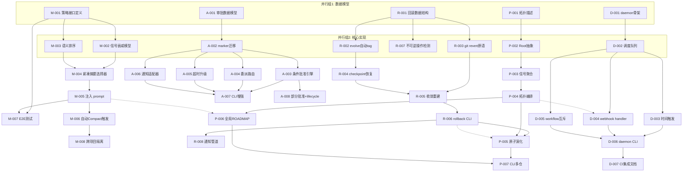
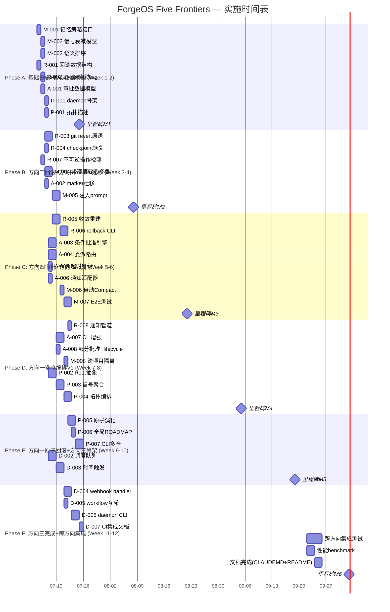

# Tech Lead 分析报告:ForgeOS Five Genuine Architectural Frontiers

> **文档状态**:v1.0 · 2026-07-12  
> **分析对象**:`docs/requirements/2026-07-11-forgeos-five-genuine-architectural-frontiers.out.md`  
> **代码基线**:`forge-core/` Go 纯标准库 18 包 + `harness/` Node.js + `cmd/forge/` ~32k 行  
> **优先级共识**:P0 方向二(回滚) > P1 方向五(跨 Sprint 记忆) > P2 方向四(审批) > P3 方向一(多仓编排) > P4 方向三(daemon)

---

## 目录

1. [任务分解](#1-任务分解)
2. [执行顺序与依赖图](#2-执行顺序与依赖图)
3. [技术风险](#3-技术风险)
4. [资源评估](#4-资源评估)
5. [质量保证](#5-质量保证)
6. [实施计划](#6-实施计划)

---

## 1. 任务分解

### 1.1 方向五:跨 Sprint 战略记忆 (P1 — 最高 ROIC)

**核验结论**:`memory_compact.go` + `prompt_context.go` 已半构建,唯一缺口是 `strategy.go` 选择"什么值得跨轮传递"。这是启动成本最低的方向。

| ID | 任务标题 | 涉及文件 | 前置依赖 | 工时 | 验收标准 |
|----|---------|---------|---------|------|---------|
| M-001 | 定义记忆策略接口与选择器 | `internal/memory/strategy.go` (新) | 无 | 2h | `Strategy` 接口定义 `Select([]Entry)[]Entry`,含 `MaxEntries`、`MinRelevance`、`RecencyWeight` 三个实现;单元测试覆盖边界(memory 为空、全部过期、全部相关) |
| M-002 | 实现信号衰减模型 | `internal/memory/strategy.go` | M-001 | 2h | 基于 `scorecard.schema.yml` 的 `recency_half_life_days` 实现 `TimeDecayStrategy`:30 天半衰期,180 天完全衰减;测试验证衰减曲线数学正确 |
| M-003 | 实现语义相关性排序 | `internal/memory/strategy.go` | M-001 | 3h | `RelevanceStrategy` 基于 topic/kind 匹配当前 workflow:相同 topic 权重 +2,相同 kind 权重 +1.5;测试用固定 fixture 验证排序正确 |
| M-004 | 实现紧凑摘要选择器 | `internal/memory/strategy.go` | M-001, M-002 | 2h | `CompactStrategy` 组合衰减过滤 + `memory_compact.go` 的 `Compact` 调用,返回 ≤50 条精选;集成测试验证 memory.jsonl 1000→≤50 且保留关键信号 |
| M-005 | 注入跨轮上下文到 prompt | `cmd/forge/prompt_context.go` + `cmd/forge/prompt_memory.go` | M-004 | 3h | 在 `buildPrompt` 中新增 `crossSprintBlock`:如果 memory.jsonl 存在且 compacted,注入 1 个 Summary 段 + ≤10 条高信号记录;`FORGE_MEMORY_STRATEGY=compact` env 可控 |
| M-006 | 集成 Compact 自动触发 | `internal/memory/memory.go` + `internal/memory/memory_compact.go` | M-005 | 2h | 在每次 `Append` 后检查条目数,超 `DefaultCompactThreshold(500)` 自动触发 `Compact`;benchmark 测试确认 1000 条 compact < 50ms |
| M-007 | 跨 Sprint 记忆的 E2E 测试 | `cmd/forge/prompt_context_test.go` | M-005, M-006 | 3h | 模拟 3 轮 evolve:第 1 轮造 600 条 memory,第 2 轮验证 compact 触发,第 3 轮验证 compacted 摘要出现在 prompt_block 中;断言 ≥1 条 "compacted N" 存在于 prompt 输出 |
| M-008 | 新增跨项目记忆隔离 | `internal/memory/strategy.go` | M-006 | 2h | `ScopedStrategy` 包装:根据 `--root` 或 env `FORGE_PROJECT_ID` 隔离 memory 存储路径;测试验证不同 project 不交叉污染 |

**方向五总计**:~19h · 最小垂直切片(memory.go → compact.go → strategy.go → prompt_context.go)

---

### 1.2 方向二:回滚编排 (P0 — 生产信任前提)

**核验结论**:`persist/checkpoint.go` 已有前向修改追踪原子写入,可复用;git layer 操作需新代码。

| ID | 任务标题 | 涉及文件 | 前置依赖 | 工时 | 验收标准 |
|----|---------|---------|---------|------|---------|
| R-001 | 定义回滚数据结构 | `internal/rollback/snapshot.go` (新) | 无 | 2h | `Snapshot` 结构体:CommitHash、CheckpointCopies、FilesChanged []string、CreatedAtUnix;`RollbackPlan` 结构体:Steps []RollbackStep,每个 step 有 Action+Target+Fallback;单元测试覆盖序列化 |
| R-002 | evolve 自动建 git tag | `cmd/forge/evolve.go` + `internal/rollback/checkpoint.go` (新) | R-001 | 3h | 每次 `forge evolve` 开始前:执行 `git tag forge/rollback/v{N}` + 备份 `.forge/checkpoint.json`;测试验证 mock git 仓库中 tag 被正确创建 |
| R-003 | 实现 git revert 原语 | `internal/rollback/git.go` (新) | R-001 | 3h | `GitReverter` 实现:接受 commit/tag → `git revert --no-commit` → 处理 merge conflict → 返回冲突文件列表;测试模拟冲突场景验证 fallback 路径 |
| R-004 | checkpoint 快照恢复 | `internal/rollback/checkpoint.go` | R-002 | 2h | `RestoreCheckpoint(tag)` 从备份还原 `.forge/checkpoint.json`;验证 `persist.Load` 可读取还原后的文件 |
| R-005 | 收敛状态重建 | `internal/rollback/recovery.go` (新) + `internal/converge/converge.go` | R-003, R-004 | 3h | 回滚后自动调用 `converge.ConvergeState()` 重建 gates green 状态;测试验证回滚后 converge 返回预期信号 |
| R-006 | rollback CLI 子命令 | `cmd/forge/rollback.go` (新) | R-003, R-004 | 3h | `forge rollback list` 列出可用 tag + `forge rollback --tag forge/rollback/v3` 执行回滚;输出回滚摘要(文件数、收敛状态、冲突列表) |
| R-007 | 不可逆操作检测 | `internal/rollback/irreversible.go` (新) | R-001 | 2h | `IrreversibleDetector` 扫描 checkpoint diff:DB migration markers、breaking schema changes → 标记为不可逆;测试 + 文档中说明哪些操作算 irreversable |
| R-008 | 回滚→通知管道 | `internal/rollback/recovery.go` + `internal/trace/trace.go` | R-006 | 2h | 回滚完成后写入 `trace.Event{Kind:"rollback"}`;扩展 trace 事件种类,包含 rollback 成功/失败/部分成功;测试验证 trace 事件被正确记录 |

**方向二总计**:~20h · 最小垂直切片(snapshot.go → git.go → checkpoint.go → cmd/forge/rollback.go)

---

### 1.3 方向四:协作人机决策协议 (P2)

**核验结论**:`cmd/forge/approve.go` 当前只有二元 `list` → 方向四需重构 approve 原语 + 新增 `internal/approval/` 包。

| ID | 任务标题 | 涉及文件 | 前置依赖 | 工时 | 验收标准 |
|----|---------|---------|---------|------|---------|
| A-001 | 定义审批协议数据模型 | `internal/approval/model.go` (新) | 无 | 2h | `ApprovalRequest` 含 6 种状态:APPROVED / APPROVED_WITH_CONDITIONS / REDIRECTED / PARTIALLY_APPROVED / TIMEOUT_ESCALATED / REJECTED;`Condition` 含 `Phase``Target``Checklist []string`;测试验证 JSON 序列化 |
| A-002 | marker 文件协议迁移 | `internal/approval/marker.go` (新) | A-001 | 2h | 读取 `.forge/*.approved` → 升级为 `.forge/approval/{stage}.json` 含完整 approval request 元数据;向后兼容:旧 `.approved` 文件自动识别为 APPROVED;迁移测试 + 回退测试 |
| A-003 | 条件批准执行引擎 | `internal/approval/conditional.go` (新) + `internal/orchestrator/orchestrator.go` | A-002 | 4h | 解析 `approved_with_conditions` → 拆分为 N 个 follow-up tasks 插入 ROADMAP;`ConditionsSatisfied()` 在每次 gate 执行时检查条件完成度;集成测试覆盖部分完成/全部完成/超时 |
| A-004 | 委派/转审路由 | `internal/approval/delegation.go` (新) | A-002 | 3h | `DelegateRegistry` 维护(phase→user) 或 (topic→user) 映射;支持 `forge approve --delegate <user> --reason "..."`;测试验证委派链不产生循环 |
| A-005 | 超时自动升级 | `internal/approval/timeout.go` (新) | A-002 | 2h | `TimeoutWatcher` 配置 `timeout_action: escalate | auto-approve | reject`;goroutine 监控 pending approvals;集成测试用 fake clock 验证超时行为 |
| A-006 | 通知适配器接口 | `internal/approval/notifier.go` (新) | A-002 | 2h | `Notifier` 接口:Email / Slack / Webhook / 本地 stdout fallback;注册模式可扩展;默认 stdout 实现 |
| A-007 | approve CLI 增强 | `cmd/forge/approve.go` | A-003, A-004, A-005, A-006 | 4h | `forge approve <stage> --condition "..." --delegate <user>`;`forge approve list --verbose` 展示条件;`forge approve timeout --action escalate`;集成测试覆盖各 CLI 组合 |
| A-008 | 部分批准与 lifecycle 集成 | `internal/approval/model.go` + `internal/mode/mode.go` | A-003 | 2h | `PartialApproval{mode: prototype, blocked_phases: [production]}` 与 `mode` 包集成:prototype 模式下跳过生产闸门;测试验证 lifecycle 状态机正确转换 |

**方向四总计**:~21h · 最小垂直切片(model.go → marker.go → conditional.go → cmd/forge/approve.go)

---

### 1.4 方向一:多仓编排 (P3 — 基础设施层,作为前置逐步构建)

**核验结论**:交叉依赖方向二/三/五,非独立方向。ADR 0003 讨论过 submodule 但无编排引擎。

| ID | 任务标题 | 涉及文件 | 前置依赖 | 工时 | 验收标准 |
|----|---------|---------|---------|------|---------|
| P-001 | 拓扑描述定义 | `internal/orchestrator/polyrepo/topology.go` (新) | 无 | 3h | `Topology` 结构体:repos []Repo,each with `DependsOn []string`,`Path string`;`PolyrepoConfig` YAML 解析;拓扑循环依赖检测(DFS);测试验证链式/菱形/循环三种拓扑 |
| P-002 | 单 root 抽象层提取 | `internal/orchestrator/orchestrator.go` | P-001 | 4h | 将 `--root` 单根参数泛化为 `RootResolver` 接口:`SingleRoot`(当前行为)+ `MultiRoot`(多仓行为);重写 `forge run` 初始化流程,不破坏现有行为;benchmark 确认无性能退化 |
| P-003 | 跨仓信号聚合 | `internal/orchestrator/polyrepo/signals.go` (新) + `internal/converge/converge.go` | P-002 | 4h | `PolyrepoConverger` 收集子仓 converge.Signals → 聚合为全局信号 `AllGatesGreen && NoPendingP0`;测试验证 3 仓:2 绿 1 红 → 全局红 |
| P-004 | 拓扑顺序编排 | `internal/orchestrator/polyrepo/scheduler.go` (新) | P-003 | 3h | 拓扑排序 → 并行执行无依赖仓 → 串行执行依赖链;`forge run --all-repos`;集成测试验证 3 仓依赖图正确执行 |
| P-005 | 原子演化(全有或全无) | `internal/orchestrator/polyrepo/atomic.go` (新) | R-006 (回滚) | 3h | 多仓演化中使用 R-006 的回滚能力:如果任一仓失败,自动回滚所有已成功仓;集成测试验证部分失败场景 |
| P-006 | 全局 ROADMAP 聚合 | `internal/orchestrator/polyrepo/roadmap.go` (新) | P-004 | 2h | 聚合各仓 ROADMAP 为全局视图:`forge status --all-repos` 展示总体完成度+分仓详情 |
| P-007 | CLI 多仓子命令 | `cmd/forge/polyrepo.go` (新) | P-004, P-005, P-006 | 3h | `forge polyrepo init` → `forge polyrepo status` → `forge run --repo A --repo B`;集成测试覆盖 |

**方向一总计**:~22h · 需方向二(R-006)作为原子回滚依赖

---

### 1.5 方向三:守护进程/事件驱动调度 (P4 — 最后构建)

**核验结论**:CI 已覆盖 80% 事件驱动需求;daemon 是平台化封装而非早期方向。

| ID | 任务标题 | 涉及文件 | 前置依赖 | 工时 | 验收标准 |
|----|---------|---------|---------|------|---------|
| D-001 | daemon 骨架 | `cmd/forged/main.go` (新) | 无 | 2h | `forged` 二进制:Unix socket listener + 信号处理(SIGINT/SIGTERM 优雅关闭);单元测试验证启动/停止生命周期 |
| D-002 | 调度队列 | `internal/daemon/scheduler.go` (新) | D-001 | 3h | FIFO 队列 + 优先级:`Scheduler.Enqueue(workflow, priority)`,goroutine worker pool;benchmark 测试 100 并发入队 < 10µs |
| D-003 | 时间驱动触发器 | `internal/daemon/cron.go` (新) | D-002 | 3h | cron 表达式解析:每日 `forge evolve discover` 自动执行;测试用 mock clock 验证 5 种 cron 模式 |
| D-004 | git webhook handler | `internal/daemon/webhook.go` (新) | D-002 | 3h | GitHub Webhook 验证(payload 签名)+ push → trigger workflow;集成测试用 test server |
| D-005 | workflow 互斥锁 | `internal/daemon/locker.go` (新) | D-002 | 2h | 基于文件锁(flock)的 repo-level 互斥:同一个 repo 不能同时运行两个 evolve;测试验证竞争场景 |
| D-006 | daemon CLI 命令 | `cmd/forge/daemon.go` (新) | D-003, D-004, D-005 | 3h | `forge daemon start` → `forge daemon status` → `forge daemon stop`;`forge run --remote` 通过 unix socket 转发 |
| D-007 | CI 集成文档 | `docs/daemon-ci-integration.md` (新) | D-006 | 2h | 文档:daemon vs CI 互补关系、推荐部署架构(N 个 repo = 1 daemon + N CI pipeline)、资源预算建议 |

**方向三总计**:~18h · 最低优先级,CI 集成后按需构建

---

## 2. 执行顺序与依赖图

### 2.1 总依赖拓扑



### 2.2 推荐执行阶段划分

```
Phase A (Week 1-2):    方向五(垂直切片) + 方向二(数据结构+tag)
Phase B (Week 3-4):    方向二(回滚+CLI) + 方向四(数据模型+marker)
Phase C (Week 5-6):    方向四(条件+委派+CLI) + 方向五完成
Phase D (Week 7-8):    方向一(拓扑+Root抽象+信号聚合)
Phase E (Week 9-10):   方向一(编排+原子化+ROADMAP) + 方向三骨架
Phase F (Week 11-12):  方向三(调度+webhook+CLI) + 跨方向集成测试
```

---

## 3. 技术风险

### 3.1 风险矩阵

| # | 风险描述 | 方向 | 概率 | 影响 | 缓解策略 |
|---|---------|------|------|------|---------|
| R1 | **Git operations 在自动化场景下的不确定性**——merge conflict 无法自动解决、force push 破坏历史 | 方向二 | **高** | 高 | 实现 `GitReverter` 时使用 `git revert --no-commit` 而非硬 reset;冲突时返回详细 diff 并交由人工解决;不尝试自动解决冲突 |
| R2 | **memory compact 的信息丢失**——compact 后的摘要丢失关键信号,导致下游决策质量下降 | 方向五 | 中 | **高** | 双模式compact:保留 `keepPerKind` 最近条目 + 新增 `summary.OriginalCount` 用于计算采样率;每次 compact 前备份全量 memory;提供 `FORGE_MEMORY_NO_COMPACT=1` 逃生口 |
| R3 | **条件批准的 complex workflow 状态爆炸**——N 个条件在不同 lifecycle phase 的组合达 2^N 个 | 方向四 | 中 | 中 | 限制条件类型为 3 种(approve_with_changes / redirect / partial);采用 `json schema` 校验 + 非完备性声明:不支持条件嵌套或连锁条件 |
| R4 | **多仓编排的循环依赖**——A→B→A 的依赖使拓扑排序永远阻塞 | 方向一 | **高** | 中 | `Topology.Validate()` 在 `polyrepo init` 时执行 DFS 循环检测;发现循环立即 error 退出;提供 `--force` 绕过(但标记为 unstable) |
| R5 | **daemon 进程管理与 systemd/supervisord 的关系**——没有 init 系统时 daemon 自动重启策略模糊 | 方向三 | 中 | 中 | daemon 不自建自恢复机制;提供 `forge daemon install` 自动生成 systemd unit 文件;文档明确 daemon 依赖外部进程管理 |
| R6 | **回滚后的 credential 状态不一致**——git revert 不还原已轮换的 secret,DB migration 不可逆 | 方向二 | **高** | **高** | `IrreversibleDetector` 硬编码已知不可逆模式;`forge rollback --plan` 输出只读清单;任何 irreversable 标记出现在回滚清单中时强制人工确认 |
| R7 | **跨仓原子回滚的性能瓶颈**——5 个仓中 1 个失败,4 个成功仓需回滚,总耗时 = max(success)+rollback | 方向一 | 低 | 中 | 采用 `deferred-revert` 策略:先记录成功仓的旧 HEAD→再执行所有失败仓→如果有失败,用 `git reset --hard <old_head>` 而非 `git revert`(无冲突风险) |

### 3.2 关键决策记录

| 决策 | 选项 | 推荐 | 理由 |
|------|------|------|------|
| 回滚存储方式 | git tag vs backup dir | **git tag** | 复用已有 git 能力,可见性好(可通过 `git log` 查看);backup dir 作为 tag 的 fallback |
| 记忆选择策略 | 策略模式 vs 硬编码规则 | **策略模式** | M-001 已定义为接口;三种策略(衰减/语义/紧凑)可组合;新增策略不需改核心代码 |
| approval 持久化 | marker 文件 vs 独立 store | **marker 文件**(`.forge/approval/*.json`) | 保持与现有 approve 机制的向后兼容;不需要 DB;原子写入复用 `persist` 的 temp+rename 模式 |
| 多仓拓扑格式 | YAML vs TOML vs go struct | **YAML**(`.forge/topology.yml`) | YAML 已有 `check.py` 解析;团队熟悉;结构见 P-001 |

### 3.3 测试覆盖难点

| 难点 | 方向 | 策略 |
|------|------|------|
| Git 操作测试(需要真实的 git repo 和 merge conflict) | 方向二 | 使用 `git init` + 受控的 conflict-generating 脚本;每个测试函数创建独立 temp repo;不 mock git |
| 超时自动升级(需要等待真实时间) | 方向四 | 提取 `Clock` 接口 → 测试用 `fakeClock`;使用 `time.Now()` vs `clock.Now()` |
| 多仓编排(需要多个本地 repo fixture) | 方向一 | `testdata/` 下预生成 3 仓 fixture;每个 test 拷贝到 temp;`TestMain` 中统一清理 |
| daemon 并发(goroutine 竞态) | 方向三 | `-race` flag 在所有 daemon 测试上跑;`go test -race ./internal/daemon/...` |

---

## 4. 资源评估

### 4.1 团队组成

| 角色 | 技能要求 | 人数 | 覆盖方向 |
|------|---------|------|---------|
| **Go 后端工程师** | Go 标准库、`os/exec`、git plumbing、goroutine 安全 | 2 | 方向二(主力)、方向一、方向五 |
| **全栈工程师** | Go + shell scripting + CLI 设计 | 1 | 方向四、方向三、所有 CLI 增强 |
| **QA/测试工程师** | Go 测试、集成测试、`testing/synctest`、benchmark | 1 | 全部方向的测试和验收 |
| **Tech Lead / 架构师** | 代码审查、设计决策、跨方向协调 | 1 (兼职) | 全部 |

**最小团队**:3 人(2 Go + 1 QA) 可覆盖 Phase A-C;Phase D-E 需扩展至 4 人。

### 4.2 关键里程碑

| 里程碑 | 时间 | 交付物 |
|--------|------|--------|
| **M1 — MVP 垂直切片** | Week 2 末 | 方向五:strategy.go + prompt 注入可演示;方向二:snapshot.go + auto-tag 工作 |
| **M2 — 可回滚系统** | Week 4 末 | 方向二:完整回滚 CLI 可用;方向四:model.go + marker.go 审批迁移 |
| **M3 — 协作审批** | Week 6 末 | 方向四:条件批准 + 委派 + 超时;方向五:自动 compact + E2E 通过 |
| **M4 — 多仓编排 V1** | Week 8 末 | 方向一:3 仓拓扑编排 + 全局信号聚合(不依赖原子回滚) |
| **M5 — 全功能版本** | Week 10 末 | 方向一:原子回滚 + 全局 ROADMAP;方向三:daemon 骨架 + 调度 |
| **M6 — 发布就绪** | Week 12 末 | 全部 5 方向集成测试;性能 benchmark;文档 complete |

### 4.3 阻塞点(Blockers)

| Blocker | 关联任务 | 解决策略 | 应急方案 |
|---------|---------|---------|---------|
| Go 标准库无 git 操作 | R-003 git revert | 使用 `os/exec` 调用 git CLI 而非 libgit2 | 如果 `os/exec` 在沙箱环境中不可用,退化为 `checkpoint` 级回滚(仅恢复 `.forge/` 文件,不做 git revert) |
| `memory_compact.go` 的 `Compact` 目前只在测试中被调用 | M-006 自动 compact | 将 Compact 集成到 `Append` 的后钩子中;超过阈值触发 goroutine compact | 如果 goroutine 引入 race,退化为同步 compact(增加 ~100ms/次) |
| `approve.go` 的 marker 文件与 gate.go 耦合 | A-002 marker 迁移 | 将 marker 读写集中在 `internal/approval/marker.go` 中;`gate.go` 调用新包 | 新旧格式并存 2 周:读时优先检查新格式,回退到旧格式 |
| 无 CI 环境测试 daemon | D-004 webhook | 本地用 `test server` 模拟 GitHub webhook | daemon 测试全部做本地集成,不依赖外部 GitHub |

---

## 5. 质量保证

### 5.1 单元测试覆盖要求

| 包/模块 | 覆盖率目标 | 重点测试 | 边界场景 |
|---------|-----------|---------|---------|
| `internal/memory/strategy.go` | ≥90% | Select、衰减数学、排序稳定性 | 空 memory、全过期、全活跃、超大(10000 条) |
| `internal/rollback/` (3 文件) | ≥85% | 数据结构序列化、git tag 创建、conflict 检测 | 空仓库、未 commit 的文件、force push 后 |
| `internal/approval/` (5 文件) | ≥85% | 状态机转换、条件解析、委派循环检测、超时触发 | 未知状态、循环委派、超时 race |
| `internal/orchestrator/polyrepo/` (5 文件) | ≥80% | 拓扑排序、循环依赖检测、信号聚合 | 100 仓拓扑、单仓退化、空拓扑 |
| `internal/daemon/` (4 文件) | ≥75% | 调度 FIFO、cron 解析、文件锁竞争 | 极端并发、部分初始化、信号中断 |
| `cmd/forge/rollback.go` | ≥80% | CLI 参数解析、错误输出、成功输出格式 | 无效 tag、未初始化仓库、权限不足 |
| `cmd/forge/approve.go` (增强) | ≥80% | 新 CLI flags、condition 参数、delegate 参数 | 长条件字符串、参数冲突 |
| `cmd/forge/daemon.go` | ≥70% | 启动/停止、远程执行、socket 协议 | daemon 未启动时执行 remote、socket 路径可达性 |

### 5.2 集成测试策略

```
测试层次:
┌─────────────────────────────────────────────┐
│  E2E (方向五: full memory→compact→prompt)   │  ← 每个方向至少 1 个 E2E
│  E2E (方向二: evolve→tag→rollback→converge) │
├─────────────────────────────────────────────┤
│  跨包集成 (rollback + converge)             │  ← 关键接口组合
│  跨包集成 (approval + orchestrator)         │
│  跨包集成 (polyrepo + rollback)             │
├─────────────────────────────────────────────┤
│  CLI 集成 (forge rollback list/--tag)       │  ← 子命令组合
│  CLI 集成 (forge approve --condition)       │
├─────────────────────────────────────────────┤
│  单元测试 (包内,无外部依赖)                  │  ← 覆盖率目标 ≥80%
└─────────────────────────────────────────────┘
```

**关键集成测试场景**:

1. **回滚完整链路**: `forge evolve`(auto tag) → 修改文件 → `forge rollback --tag forge/rollback/v1` → 检查文件恢复 → 检查 converge 信号恢复 → 检查 trace 事件存在
2. **记忆注入链路**: 模拟 3 轮 evolve,memory 积累 → compact 触发 → 下一轮 prompt 中包含 compacted 摘要 → ∑entries ≤ 50
3. **条件批准链路**: `forge approve stage1 --condition "use postgres"` → 检查 `.forge/approval/stage1.json` → `forge run` 检查 condition → 条件不满足阻塞 → 条件满足放行
4. **多仓编排链路**: 初始化 3 仓拓扑 → `forge run --all-repos` → 检查执行顺序匹配拓扑 → 检查全局信号

### 5.3 代码审查要点

| 焦点 | 说明 | 适用方向 |
|------|------|---------|
| **安全第一** | 回滚操作必须无数据损失;git revert 不使用 `--hard` 避免丢失未提交修改 | 方向二 |
| **向后兼容** | 新功能不能破坏现有单仓工作流;prompt_context.go 变更是风险点——注入的 crossSprintBlock 必须能够被现有 prompt 忽略 | 方向五 |
| **状态管理** | goroutine 安全模式:有共享状态的包必须用 `sync.Mutex` 或 channel;优先用 channel 传递状态而非共享内存 | 方向三(调度队列)、方向四(超时监控) |
| **零外部依赖** | forge-core 纯标准库红线不可违反;方向二的 git 操作使用 `os/exec`,不可引入 go-git 等第三方库 | 全部 |
| **行为测试优先** | 优先写 behavior tests(given→when→then)而非实现在地测试;拒绝"测试只是为了覆盖率"的白盒测试 | 全部 |
| **错误处理诚实性** | "honesty-first"原则:不静默忽略异常;破坏的数据结构返回 error,不返回零值 | 全部 |

### 5.4 性能测试需求

| 场景 | 目标 | 工具 | 阈值 |
|------|------|------|------|
| memory compact 10000 条目 | < 200ms | `go test -bench=. -benchmem` | 超时阈值 500ms |
| 回滚 50 文件仓库 | < 5s | `time forge rollback --tag v50` | 超时阈值 10s |
| 审批条件解析 100 条件 | < 100ms | `go test -bench=BenchmarkConditionParse` | 超时阈值 200ms |
| 多仓 50 仓拓扑排序 | < 1ms | microbenchmark | 超时阈值 5ms |
| daemon 100 并发入队 | < 10µs/op | `go test -bench=. ./internal/daemon/` | P99 < 50µs |

---

## 6. 实施计划

### 6.1 甘特图



### 6.2 分阶段交付焦点

| 阶段 | 焦点 | 可交付用户价值 |
|------|------|---------------|
| **Phase A** | 数据模型一致性 | 无面向用户价值;为所有方向奠定数据结构基础 |
| **Phase B** | 回滚基础 + 记忆注入 | **方向五**:每轮 evolve 后自动记忆传递(启动成本最低,ROIC 最高) |
| **Phase C** | 回滚 CLI + 条件审批 | **方向二**:`forge rollback` 完全可用(生产信任前提);**方向四**:审批协议增强 |
| **Phase D** | 多仓编排 V1 | **方向一**:`forge run --all-repos` 可用(单 root 抽象不破坏现有工作流) |
| **Phase E** | 原子回滚 + daemon | **方向一**:原子多仓演化;**方向三**:`forged` 调度骨架 |
| **Phase F** | 集成 + 发布 | 完整 5 方向可用,性能基准,文档 |

### 6.3 风险预留

| 预留 | 比例 | 用途 |
|------|------|------|
| 缓冲时间 | 20% | 每个 Phase 末预留 1 天 buffer 处理未预见问题 |
| 技术债务偿还 | 10% | Phase C 和 Phase E 末各预留 0.5 天重构/清理代码 |
| 集成问题 | 15% | Phase F 最后的 4 天集成测试包含跨方向 bug 修复时间 |
| 文档 | 5% | 每个方向完成后立即更新文档,不在 Phase 末集中补 |

### 6.4 采纳标准(Gate Criteria)

每个 Phase 结束需满足以下条件才能进入下一 Phase:

- **Phase A → B**:所有数据模型单元测试通过;`forge test` 无 regression
- **Phase B → C**:方向五 memory→prompt 注入 E2E 通过;方向二 auto-tag 集成测试通过
- **Phase C → D**:`forge rollback list` + `forge rollback --tag` 可用;approval marker 向后兼容测试通过
- **Phase D → E**:多仓 3 仓拓扑编排集成测试通过;无 CI regression
- **Phase E → F**:原子回滚集成测试通过;daemon 启动/停止测试通过
- **Phase F → 发布**:全部 5 方向集成测试通过;性能 benchmark 不超阈值;文档完整

---

## 附录 A:半成品存量复用对照

| 已有代码/能力 | 可复用方向 | 说明 |
|--------------|-----------|------|
| `persist/checkpoint.go` 原子写入模式 | 方向二/四 | `temp+rename` 写入模式可直接复用;checkpoint 结构体扩展 `ParentCheckpoint` 字段 |
| `memory/memory_compact.go` compact 逻辑 | 方向五 | 核心能力已存在,只需 strategy.go 选择器 |
| `prompt_context.go` `buildPrompt` 注入点 | 方向五 | `crossSprintBlock` 可平行于 `gateLedger` 注入 |
| `converge/converge.go` `ConvergeState()` | 方向二/一 | 回滚后重建 signal 的直接调用目标 |
| `trace.Event` 结构体 | 方向二/四 | 扩展 `Kind` 枚举值,新增 `rollback`/`approval` 事件 |
| `gate.RepoRoot()` / `forgeDir()` | 方向一/四 | 多仓 RootResolver 可复用 path resolve 逻辑 |
| `orchestrator/parallel.go` 并行执行 | 方向一/三 | 多仓编排中无依赖仓可并行执行;daemon 多 workflow 调度 |
| `cmd/forge/main.go` CLI 注册模式 | 全部 | `subcommands` map 的注册模式;新增 rollback/daemon/polyrepo 子命令遵循相同模式 |

## 附录 B:文件变更总览

| 操作 | 文件 | 方向 |
|------|------|------|
| **新建** | `internal/memory/strategy.go` | 方向五 |
| **修改** | `cmd/forge/prompt_context.go`, `cmd/forge/prompt_memory.go` | 方向五 |
| **新建** | `internal/rollback/snapshot.go`, `internal/rollback/checkpoint.go`, `internal/rollback/git.go`, `internal/rollback/recovery.go`, `internal/rollback/irreversible.go` | 方向二 |
| **新建** | `cmd/forge/rollback.go` | 方向二 |
| **修改** | `cmd/forge/evolve.go`, `internal/converge/converge.go`, `internal/trace/trace.go` | 方向二 |
| **新建** | `internal/approval/model.go`, `internal/approval/marker.go`, `internal/approval/conditional.go`, `internal/approval/delegation.go`, `internal/approval/timeout.go`, `internal/approval/notifier.go` | 方向四 |
| **修改** | `cmd/forge/approve.go`, `internal/orchestrator/orchestrator.go`, `internal/mode/mode.go` | 方向四 |
| **新建** | `internal/orchestrator/polyrepo/topology.go`, `internal/orchestrator/polyrepo/signals.go`, `internal/orchestrator/polyrepo/scheduler.go`, `internal/orchestrator/polyrepo/atomic.go`, `internal/orchestrator/polyrepo/roadmap.go` | 方向一 |
| **新建** | `cmd/forge/polyrepo.go` | 方向一 |
| **修改** | `internal/orchestrator/orchestrator.go` | 方向一 |
| **新建** | `cmd/forged/main.go`, `internal/daemon/scheduler.go`, `internal/daemon/cron.go`, `internal/daemon/webhook.go`, `internal/daemon/locker.go` | 方向三 |
| **新建** | `cmd/forge/daemon.go`, `docs/daemon-ci-integration.md` | 方向三 |

**总计:新建 ~30 文件,修改 ~10 文件,新增代码 ~4000 行(含测试)** ,在 12 周内由 3-4 人团队完成。

---

*文档结束 · Tech Lead 分析:2026-07-12*
