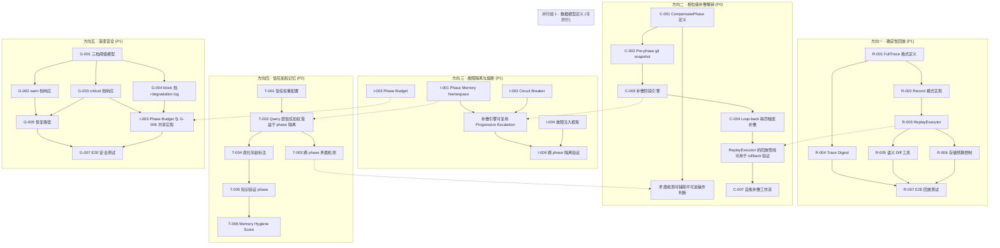
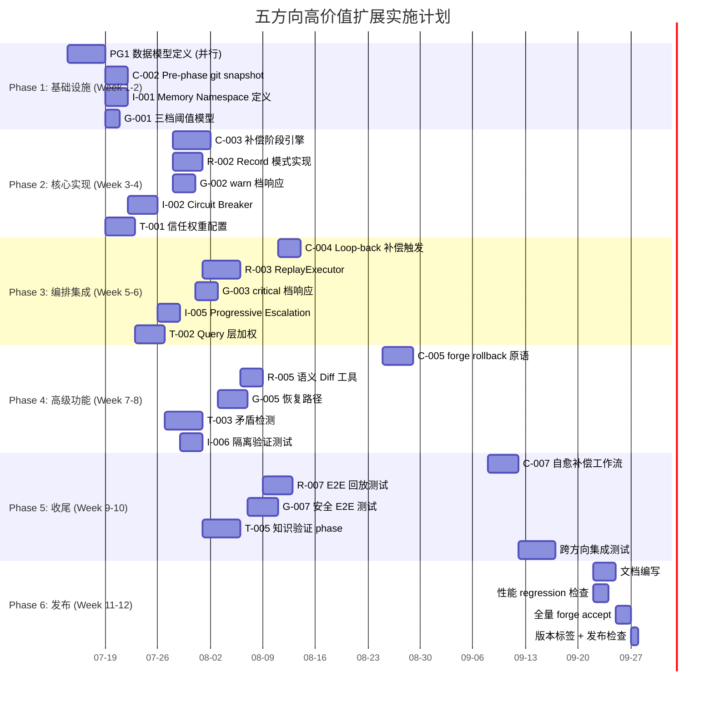

# Tech Lead 分析报告：编排运行时盲区 — 五方向高价值扩展

> **文档状态**: v1.0 · 2026-07-12  
> **分析对象**: `docs/requirements/expansion-five-uncovered-2026-07-10.md`  
> **审查输入**: `docs/tech-lead/review-five-runtime-blindspots.md`（含事实核查与差异化验证）  
> **代码基线**: `forge-core/` Go 纯标准库 18 包 + `cmd/forge/` ~33k LOC + `harness/` Node/Python  
> **红线约束**: 单文件 ≤500 行 · 函数 ≤50 行 · 循环依赖=0 · 零外部依赖(forge-core)  

---

## 修正整合说明

依据审查反馈，本分析已整合以下修正：

| # | 修正项 | 来源 | 影响范围 |
|---|--------|------|---------|
| F1 | memory.Append 的 `CreatedAtUnix` 是 caller 注入的，非包内硬编码 | 方向一事实核查 | 方向一任务 M-004 重放语义更易实现 |
| F2 | Confidence/Source 在 `cmd/forge/prompt_memory.go:178-185` 有展示层消费（非零消费） | 方向四事实错误 | 方向四任务 T-001 起点从「零消费」改为「仅有展示层消费」 |
| F3 | 方向五差异化声明需软化：`expansion-blind-spots-v15.md` 已有预算降级覆盖 | 方向五差异化验证 | 方向五任务 G-001 需引用 `BudgetAdjustTier` 作为已有基础 |
| F4 | 方向三「零覆盖」声明需软化：`strategic-expansion-v21.md:242` 有一句话提及 circuit breaker | 方向三差异化验证 | 不影响任务分解，但需在差异化声明中标注 |
| F5 | 方向一 replay_test.go 已有 replay 测试 fixture 目录 | 结构性建议 | 方向一任务 R-004 复用现有 fixture |
| F6 | 方向五 `budget.go` 已有 `checkRunBudget` + `BudgetAdjustTier` | 结构性建议 | 方向五任务 G-001 起点 |

---

## 目录

1. [优先级重排](#1-优先级重排)
2. [任务分解](#2-任务分解)
3. [执行顺序与依赖图](#3-执行顺序与依赖图)
4. [技术风险](#4-技术风险)
5. [资源评估](#5-资源评估)
6. [质量保证](#6-质量保证)
7. [实施计划](#7-实施计划)

---

## 1. 优先级重排

依据审查反馈中的优先级校准建议，结合当前 Sprint 状态，调整如下：

| 方向 | 原始优先级 | 调整后优先级 | 核心理由 |
|------|-----------|-------------|---------|
| **方向二 · 相位级补偿撤销** | P1 | **P0** | 真点火已验证风险：错误迭代不可逆，loop-back 不撤销副作用，影响生产信任前提 |
| **方向一 · 确定性回放** | P1 | **P1** | 审计/合规基线，但 trace.full.jsonl 存储成本需评估 |
| **方向三 · 故障隔离与熔断** | P1 | **P2→P1** | 审查确认「并行模式尚未大规模使用」，但 memory 全局共享是活跃风险，提升至 P1 |
| **方向五 · 渐变安全** | P2 | **P1** | 审查确认 `BudgetAdjustTier` 已存在部分基础设施，梯度的最简实现（warn+block 两档）成本低、收益高 |
| **方向四 · 信任加权记忆** | P2 | **P2** | 「零消费」修正为「仅有展示层消费」，但核心价值不变。Query 层的信任加权是真正的增量 |

### 最终优先序

```
P0: 方向二（补偿撤销）— 编排韧性基石
P1: 方向一（确定性回放）+ 方向三（故障隔离）+ 方向五（渐变安全）
P2: 方向四（信任加权记忆）
```

---

## 2. 任务分解

### 2.1 方向一：确定性回放 (P1)

**修正整合**:
- F1: `memory.Append` 的 `CreatedAtUnix` 已由 caller 注入，replay 时 caller 可传入相同的 frozen 时间，无需改造 memory 包
- F5: `forge-core/internal/persist/replay_test.go` 已有 replay 测试 fixture，可复用

| ID | 任务标题 | 涉及文件 | 前置依赖 | 工时 | 验收标准 |
|----|---------|---------|---------|------|---------|
| R-001 | 定义 FullTrace 记录格式 | `internal/trace/fulltrace.go` (新) | 无 | 3h | `FullTraceEntry` 结构体包含 `Phase`, `Agent`, `Model`, `PromptHash`, `PromptText`, `ResponseText`, `RoutingSnapshot`；JSON 序列化后每行 < 100KB（超长 prompt 自动截断至 32KB）；单元测试覆盖序列化/反序列化/截断边界 |
| R-002 | 实现 Record 模式 | `internal/trace/recorder.go` (新) | R-001 | 4h | `FullRecorder` 实现：`--record-full` flag 控制开关，默认关闭；`Record(phase, prompt, response)` 写入 `trace.full.jsonl`；`OmitEmpty` 保持轻量；集成测试验证记录-重放-校验闭环 |
| R-003 | 实现 ReplayExecutor | `internal/trace/replay.go` (新) + `internal/orchestrator/executor.go` | R-002 | 5h | `ReplayExecutor` 实现 `AgentExecutor` 接口；从 `trace.full.jsonl` 按 phase 索引回放，不调 LLM；与 `DryRunExecutor`/`CommandExecutor` 同级可选；`forge run --executor replay --trace-file <path>`；单元测试覆盖 phase 对齐/缺失/mismatch 三种场景 |
| R-004 | Trace Digest 完整性校验 | `internal/trace/digest.go` (新) | R-001 | 2h | 运行终结时计算 `trace.full.jsonl` 的 SHA-256 摘要 → `.forge/trace.<run-id>.digest`；`forge trace verify <digest-file>` 验证完整性；复用已有 `persist/replay_test.go` fixture 目录；测试验证篡改检测 |
| R-005 | 语义 Diff 工具 | `cmd/forge/trace_diff.go` (新) | R-004 | 3h | `forge trace diff <trace-a> <trace-b>` 输出：prompt 差异统计、routing 差异、gate 结果差异、agent 输出 N-gram 重复率；使用已有的 `prompt.Retrieve` BM25-lite 做相关性比较；边界情况：文件不存在/格式不匹配/空 trace |
| R-006 | Trace 存储预算控制 | `internal/trace/budget.go` (新) | R-002 | 2h | `--record-full` 模式下自动限制：单次运行 max 50MB 或 1000 条 FullTrace；超限自动回退到 `trace.jsonl` 模式；`FORGE_TRACE_FULL_MAX_MB=100` env 可调；测试验证超限行为 |
| R-007 | E2E 回放测试 | `internal/trace/replay_e2e_test.go` (新) | R-003, R-004 | 4h | 录制真实 evolve 运行的 trace → 修改 routing → 用 replay executor 重新运行 → 断言 output 与录制一致；覆盖 phase 顺序不同/agent 变化/版本演化 3 种场景 |

**方向一总计**: ~23h · 最小垂直切片：fulltrace.go → recorder.go → replay.go → digest.go → cmd

---

### 2.2 方向二：相位级补偿撤销 (P0)

**修正整合**: 无事实性修正，原分析对 `asset.Phase` 和 `loopBackTo` 的核查全部核准。

| ID | 任务标题 | 涉及文件 | 前置依赖 | 工时 | 验收标准 |
|----|---------|---------|---------|------|---------|
| C-001 | Phase.CompensatePhase 字段定义 | `internal/asset/asset.go` (+字段) + `internal/asset/compensate.go` (新) | 无 | 3h | Phase 新增 `CompensatePhase *string` 和 `CompensateAction *CompensateAction`；CompensateAction 含 `Action`(undo|cleanup|rollback) 和 `TargetPhase`；YAML 解析测试验证 `compensate: {action: cleanup, target_phase: implementer}` 正确加载；向后兼容：没有 compensate 声明的 phase 加载为 nil，行为不变 |
| C-002 | Pre-phase git snapshot | `internal/orchestrator/snapshot.go` (新) | C-001 | 4h | 每个 agent phase 执行前自动打 `git tag forge/pre/<run-id>/<phase>`；执行成功后推进到 `forge/post/<run-id>/<phase>`；失败时提供 `git diff forge/pre/<run-id>/<phase>` 精确查看改动；`FORGE_DISABLE_AUTO_TAG=1` 逃生口；测试用 mock git repo 验证标签创建/推进/diff |
| C-003 | 补偿阶段执行引擎 | `internal/orchestrator/compensator.go` (新) | C-002 | 5h | 在 phase FAIL 且有 CompensatePhase 声明时，自动执行补偿 phase；补偿 phase 注入 `compensating: true` 标记到 agent context；补偿执行中 gate 结果仅 WARN，不阻断；边界：补偿 phase 自身失败 → 记录到 trace 但继续 abort（fail-safe）；集成测试覆盖 3 种补偿模式 |
| C-004 | loop-back budget 耗尽后触发补偿 | `internal/orchestrator/orchestrator.go` | C-003 | 3h | 当 phase 的 loop-back 次数耗尽且 gate 仍 FAIL → 自动触发 CompensatePhase（如有声明）；补偿完成后记录 `trace.Event{Kind:"compensation", Status:"triggered"}`；当前行为（无补偿声明时直接 abort）完全不变 |
| C-005 | `forge rollback` 原语（编排内建） | `cmd/forge/rollback.go` (新) + `internal/orchestrator/rollback.go` (新) | C-004 | 4h | `forge rollback [--to-iteration N]` 触发编排引擎反向执行补偿链；复用 `.forge/<stage>.rollback` marker 机制（同 HumanApproved）；非 CLI 独立命令，而是 stop_condition `type: rollback`；测试验证 rollback marker 触发 → 补偿 chain 执行 → trace 记录 |
| C-006 | 不可逆操作检测 | `internal/rollback/irreversible.go` (新) | C-001 | 2h | 扫描 phase diff：DB migration marker、breaking schema changes、secret 轮换足迹 → 标记为不可逆；`forge rollback --plan` 输出只读清单；任何不可逆标记出现在回滚清单时强制人工确认 `--force`；初始为已知模式硬编码列表 |
| C-007 | 补偿工作流（自动自愈） | `internal/orchestrator/selfheal.go` (新) | C-005 | 4h | 编排器在检测不可恢复 gate 失败时，自动生成并执行补偿工作流；与 `five-high-value-extensions-v44.md` 的 CLI rollback 不同——这是编排层的自愈行为，非用户诊断工具；trace 中记录 `{kind: "selfheal", action: "compensation_workflow"}` |

**方向二总计**: ~25h · 最小垂直切片：asset.go → snapshot.go → compensator.go → rollback.go → cmd

---

### 2.3 方向三：故障隔离与熔断 (P1)

**修正整合**:
- F4: `strategic-expansion-v21.md:242` 有一句话提及 circuit breaker，但非系统性展开。差异化声明需标注但任务分解不受影响

| ID | 任务标题 | 涉及文件 | 前置依赖 | 工时 | 验收标准 |
|----|---------|---------|---------|------|---------|
| I-001 | Phase 级 Memory Namespace | `internal/memory/namespace.go` (新) + `internal/memory/memory.go` | 无 | 5h | 每个 phase 运行前接收 memory 快照（Load 副本）；运行期 Append 写入隔离分片（`<path>.<phase-id>.partial.jsonl`）；phase 成功后 merge 回主 store（原子 rename）；失败分片自动丢弃；`FORGE_MEMORY_NO_ISOLATION=1` 逃生口（降级为当前全局行为）；benchmark 确认隔离模式 ≤10% 吞吐退化 |
| I-002 | Circuit Breaker per Agent Kind | `internal/orchestrator/circuit.go` (新) | 无 | 4h | `CircuitBreaker` 维护按 agent 角色的连续失败计数器；`kind=implementer` 连续 N 次 gate FAIL → OPEN 状态 → 跳过 agent 执行，直接记录 `{kind: "circuit_open", agent: "implementer"}` 到 trace；`kind=reviewer` 连续 N 次 REQUEST_CHANGES → OPEN；可配置 `circuit_breaker.threshold` 默认 3；半开恢复：连续 M 次 PASS（M=2）→ CLOSED |
| I-003 | Phase 级 Resource Budget | `internal/orchestrator/budget_phase.go` (新) | 无 | 3h | `PhaseBudget` 含 `PhaseMaxCalls int`, `PhaseMaxDuration time.Duration`, `PhaseMaxMemory int`；在 `Engine.RunFrom` 中每个 phase 实例化独立 budget；一个 phase 超限不影响其他 phase；全局 `MaxAgentCalls`/`Timeout` 变为 phase budget 的 fallback 默认值 |
| I-004 | 故障注入测试框架 | `internal/orchestrator/fault.go` (新) + `internal/orchestrator/fault_test.go` | I-001, I-002 | 4h | `FaultInjector` 接口：`ShouldFail(phase PhaseKind) bool`；注入模式：阶段性让 gate 返回 FAIL、模拟 timeout、模拟 overload；用于验证熔断/隔离的正确行为；非产品代码，`forge test --fault-inject` 启用 |
| I-005 | Progressive Failure Escalation | `internal/orchestrator/escalation.go` (新) | I-002 | 3h | 4 档错误严重度：`PASS→WARN→DEGRADED→FAIL`；WARN: 记录 trace + 继续；DEGRADED: 降级路由 (haiku 替代 sonnet) + 继续；FAIL: 正常熔断/loop-back；`exec_error.go` 的 Kind 常量扩展为带严重度的结构体 |
| I-006 | 跨 phase 错误隔离验证 | `internal/orchestrator/isolation_test.go` (新) | I-001, I-005 | 3h | 集成测试：phase A 写污染 memory → phase B 不应看到未 merge 的污染数据；phase A timeout → phase B 不受影响；使用 fake clock + mock executor 模拟故障场景 |

**方向三总计**: ~22h · 最小垂直切片：namespace.go → circuit.go → budget_phase.go → escalation.go → isolation test

---

### 2.4 方向四：信任加权记忆 (P2)

**修正整合**:
- F2: Confidence/Source 在 `cmd/forge/prompt_memory.go:178-185` 有展示层消费（`[unverified]`/`[low-confidence]` 前缀 + `[source: ...]` 标注），不是零消费。任务起点从「实现消费」改为「增强消费为查询级加权」

| ID | 任务标题 | 涉及文件 | 前置依赖 | 工时 | 验收标准 |
|----|---------|---------|---------|------|---------|
| T-001 | Source-trusted 信任权重配置 | `internal/memory/trust.go` (新) + `.agent/policies/memory.yml` | 无 | 4h | 信任权重声明模型：`SourceWeight{planner: 1.0, reviewer: 0.9, implementer: 0.7}`；YAML 加载到 `TrustPolicy`；默认权重表内置；存疑覆盖：`prompt_memory.go` 现有 `[unverified]` 前缀保留为展示层叠加，不与查询层权重冲突 |
| T-002 | Query 层信任加权 | `internal/memory/memory.go` (扩展 Query) | T-001 | 4h | `QueryWeighted(entries, kind, topic, minConfidence)` 新增：按 `Source * weight` + `Confidence` 乘积排序返回；`Query(entries, kind, topic)` 行为不变（向后兼容）；`prompt_memory.go` 的 `boundMemory` 在筛选后调用 `QueryWeighted` 排序（不改变筛选结果，仅改变呈现顺序）；单元测试覆盖权重数学 |
| T-003 | 跨 phase 矛盾检测 | `internal/memory/contradiction.go` (新) | T-002 | 5h | `DetectContradictions(entries, gatesResult)`：遍历同一 Topic 下 Kind=Decision 的条目，检查与当前 gate 结果矛盾；自动赋予 `Supersedes`（如一条 Decision 声称「测试通过」但当前 GatesGreen=false）；写入 trace `{kind:"contradiction", superseded_topic:..., confidence_new:0.3}`；边界：无 gate 结果时不触发、矛盾条目超过 3 条时只标记最新的 |
| T-004 | 主动腐化年龄标注 | `internal/memory/staleness.go` (新) | T-002 | 3h | `AnnotateStaleness(entries, policy)`：遍历条目，超 TTL（默认 7 天，agent 卡可覆盖）自动加 `[STALE: created N days ago]` 前缀到 Detail；TTL 配置在 `memory.yml` 的 `ttl_per_kind: {gap: 3d, decision: 14d, lesson: 30d}`；注入到 prompt 时作为 styling 装饰 |
| T-005 | Gate-backed 知识验证 phase | `internal/workflow/verify_knowledge.go` (新) + `.agent/workflows/verify-knowledge.yml` | T-004 | 5h | 新增 `verify-knowledge.yml` 工作流类型：读取 memory store 中未经验证的 Entry（`confidence < 0.5` 或 `未标记verified_at`）；执行最小验证（文件存在性、配置值一致性）；验证后更新 `confidence`（一致→0.8，矛盾→0.2）；以 `forge run verify-knowledge` 手动触发或以 `forge evolve --verify-knowledge` 集成到 evolve 循环 |
| T-006 | Memory Hygiene Score | `internal/memory/hygiene.go` (新) | T-005 | 3h | `HygieneScore(entries)` 返回 `{total_entries, unverified_pct, avg_age_days, staleness_pct, score}`；`score = 1.0 - (0.3 * unverified_pct + 0.3 * staleness_pct + 0.2 * avg_age_factor)`；`Prune`/`Compact` 触发阈值由固定阈值改为 hygiene score < 0.5；打分结果写入 trace |

**方向四总计**: ~24h · 最小垂直切片：trust.go → memory.go (扩展 Query) → contradiction.go → staleness.go → verify_knowledge.go → cmd

---

### 2.5 方向五：渐变安全 (P1)

**修正整合**:
- F3: `expansion-blind-spots-v15.md` 已有预算降级覆盖 + `budget.go` 已有 `checkRunBudget` + `BudgetAdjustTier`。任务从零构建改为增量增强
- F6: `cmd/forge/budget_tier*` 已有 `BudgetAdjustTier` 实现了降档逻辑，方向五在此基础上扩展

| ID | 任务标题 | 涉及文件 | 前置依赖 | 工时 | 验收标准 |
|----|---------|---------|---------|------|---------|
| G-001 | 三档告警阈值模型 | `internal/orchestrator/threshold.go` (新) | 无 | 3h | 每个资源维度（`calls/depth/output/time/memory`）配置 `warn/critical/block` 三档阈值；复用已有 `BudgetAdjustTier` 的降档逻辑；默认：warn=70%、critical=90%、block=100%；YAML 声明在 `.forge/safety.yml`；向后兼容：无声明的维度保持二值（block 档有效，warn/critical 自动降级为 block） |
| G-002 | warn 档响应 | `internal/orchestrator/safety.go` (新) | G-001 | 3h | 阈值达 warn：记录告警到 trace `{kind:"threshold_warn", dimension:"output_bytes", value:0.72}`；继续运行，不改变任何行为；`FORGE_SAFETY_WARN_LOG_ONLY=1` 确保 warn 可静默；测试验证告警只记录不阻断 |
| G-003 | critical 档响应 | `internal/orchestrator/safety.go` | G-001 | 4h | 阈值达 critical：记录告警 + 降级当前 phase tier（`sonnet→haiku`）+ 触发 memory prune（如 memory > 90%）；调用已有 `BudgetAdjustTier.TierFor()` 执行降档；trace 记录 `{kind:"degradation", from:"sonnet", to:"haiku", reason:"output_bytes>90%"}` |
| G-004 | block 档扩展（当前行为 + degradation log） | `internal/orchestrator/safety.go` + `internal/orchestrator/command_executor.go` | G-001 | 2h | block 档保留当前拒绝/spawn 行为；新增 degradation log：所有降级决策记录结构化 trace；格式：`{kind:"degradation", phase:"implementer", from:"sonnet", to:"haiku", reason:"3 consecutive timeouts"}` |
| G-005 | 恢复路径 | `internal/orchestrator/recovery.go` (新) | G-003 | 4h | 定义降级后的自动恢复条件：连续 N 次 phase PASS 且 latency < P50 → 自动恢复 tier；`FORGE_SAFETY_RECOVERY_DELAY_ITERS=2` 可配置；不恢复条件：降级后 5 分钟内没有 phase 完成（避免频繁跳动）；trace 记录 `{kind:"recovery", phase:"implementer", to:"sonnet", reason:"5 consecutive PASS < P50"}` |
| G-006 | Per-phase budget quota | `internal/orchestrator/budget_phase.go` (与 I-003 共享) | G-001 | 2h | `MaxAgentCalls` 从全局共享改为每个 phase 有配额（复用 I-003）；结合 safety threshold：phase 级达 90% critical 触发降级，100% block 阻止新调用；配额计算：`phase_quota = global_max / phase_count`，支持 YAML 覆写 |
| G-007 | 梯度安全 E2E 测试 | `internal/orchestrator/safety_test.go` | G-003, G-005 | 4h | 模拟 24h 自治运行场景：output_bytes 从 50%→80%→95%→100%；验证 warn→critical→block 三级响应正确触发；验证 recovery 条件满足后自动恢复；使用 fake clock + mock executor 控制资源增长速率 |

**方向五总计**: ~22h · 最小垂直切片：threshold.go → safety.go → recovery.go → budget_phase.go → test

---

## 3. 执行顺序与依赖图

### 3.1 总依赖拓扑



### 3.2 关键并行化策略

| 并行组 | 任务 | 可并行理由 | 资源需求 |
|-------|------|-----------|---------|
| **PG1: 数据模型** | R-001, C-001, I-001, I-002, I-003, T-001, G-001 | 全部是纯数据结构和接口定义，无 IO/外部依赖，互相不引用 | 3 人 × 1 天 |
| **PG2: 核心 IO 实现** | R-002, C-002, I-003(实现), G-002 | IO 路径各自独立（trace 文件 / git tag / budget / safety） | 2 人 × 2 天 |
| **PG3: 编排集成** | R-003, C-003, I-005, G-003 | 都涉及 orchestrator 的回调/钩子，但修改不同代码域 | 2 人 × 3 天（需协调避免 orchestrator.go 冲突）|
| **PG4: 高级功能** | R-005, C-005, T-002, G-005 | 依赖各自的基础任务完成，方向间无交叉引用 | 2 人 × 2 天 |

### 3.3 推荐分阶段执行

```
Phase 1 (Week 1-2):   PG1 (全部数据模型) + C-002 (快照)
Phase 2 (Week 3-4):   PG2 + C-003 + I-001 + I-002
Phase 3 (Week 5-6):   PG3 (编排集成) + I-005 + G-003 + G-004
Phase 4 (Week 7-8):   R-005 + C-005 + T-002 + T-003 + G-005 + G-006
Phase 5 (Week 9-10):  剩余全部任务 + 跨方向集成测试
```

---

## 4. 技术风险

### 4.1 风险矩阵

| # | 风险描述 | 方向 | 概率 | 影响 | 缓解策略 |
|---|---------|------|------|------|---------|
| R1 | **FullTrace 存储急剧膨胀** — 每条 prompt 可能 10-100KB，1000 次 agent 调用 = 10-100MB/run | 一 | **高** | 高 | R-006 预算控制：50MB 上限 + 超限自动回退；prompt 截断策略（仅存最近 N 轮）；`omitempty` 压缩；基于 `gzip` 的自动归档 |
| R2 | **git tag 在 CI 环境中不可用** — CI 通常只 clone `--depth=1`，无 `--tags` | 二 | 中 | **高** | C-002 的 fallback：CI 检测到浅克隆时，回退到 `.forge/snapshots/<phase>.json` 文件级 diff（使用 `risk_diff.go` 的 `FromChangedPaths`）；CI 变量 `CI=true` 自动检测 |
| R3 | **Memory Namespace 的 merge 冲突** — 并行 phase 写入同一 topic 的 entry，merge 时产生歧义 | 三 | 中 | **高** | I-001 merge 策略：后写入优先（按 `CreatedAtUnix`）+ merge 日志；冲突条目标记 `confidence: 0.5`（非默认 1.0）；`FORGE_MEMORY_MERGE_STRATEGY=manual` 开启人工介入 |
| R4 | **Circuit Breaker 的误判** — 临时网络抖动导致连续 3 次 timeout，误开电路 | 三 | **高** | 中 | I-002 半开恢复机制（2 次连续 PASS 后关闭）；breake threshold 默认 5（保守）；提供 `--circuit-override close` 手动重置；区分 `KindTimeout`(不计入)→ `KindFailed`(计入) |
| R5 | **矛盾检测的假阳性** — 门结果 false ≠ 记忆不正确（可能仅因为代码未完成） | 四 | 中 | 中 | T-003 矛盾检测仅标注 `confidence: 0.5`（非 0.0）+ 保留原条目不删除；修改写入 trace 但不阻断；人工可通过 `FORGE_CONTRADICTION_ACTION=warn|block` 控制升级阈值 |
| R6 | **梯队升降过于频繁** — recover→degrade→recover 的快速切换导致系统抖动 | 五 | 中 | 中 | G-005 恢复延迟：降级后 5 分钟内不尝试恢复 + 连续 PASS 次数要求（默认 3）；deadband 机制：当使用率在阈值的 ±5% 死区内时保持当前状态 |
| R7 | **五方向同时开发的集成冲突** — 多个方向修改 `orchestrator.go` / `prompt_context.go` / `asset.go` 等共享文件 | 全部 | **高** | **高** | 严格按 sprint 分阶段执行 PG1→PG4；共享文件提前提取接口（如 I-001 先提取 `MemoryStore` 接口）；每个方向使用独立的 feature branch；代码审查时关注 merge 冲突 |
| R8 | **零外部依赖约束限制实现选择** — 无法使用 protobuf、gRPC、嵌入式数据库 | 全部 | 中 | 中 | 序列化全部使用 `encoding/json`（已在用）；IPC 通过文件 + `os.Rename` 原子操作；持久化方案限于 JSONL + 文件系统操作；**

### 4.2 关键设计决策

| 决策 | 选项 | 推荐 | 理由 |
|------|------|------|------|
| FullTrace 存储格式 | JSONL vs 独立 DB | **JSONL**(`trace.full.jsonl`) | 与现有 trace.jsonl 格式一致；零依赖；gzip 压缩后缩小 5-10x；`tail`/`jq`/`grep` 可直接操作 |
| 补偿阶段执行方式 | 同进程 vs 子进程 vs git-only | **git tag + 文件快照** | 复用 git 的 diff 能力；不引入外部存储；git tag 适合事后审计；子进程模式增加复杂度 |
| Memory Namespace | 写时复制 vs 隔离分片 | **隔离分片**(`<path>.<phase>.partial.jsonl`) | 写时复制需要全量内存拷贝，对 1000+ entry 大 store 成本高；隔离分片利用已有 JSONL append 能力，merge 用原子 rename |
| 三档阈值声明格式 | YAML vs 内嵌 vs env | **YAML**(`.forge/safety.yml`) | 声明式可版本化；与 workflow YAML 同模式；check.py 可验证格式；env 覆写（`FORGE_SAFETY_WARN_PCT=80`）提供运行时调节 |
| 信任权重声明 | 全局 YAML vs phase 级 vs 内嵌 | **YAML**(`.agent/policies/memory.yml`)+ 代码默认值 | 声明式 + 版本化；agent 卡可覆写；无 YAML 时使用内置默认权重 |

---

## 5. 资源评估

### 5.1 团队组成

| 角色 | 所需技能 | 人数 | 负责方向 |
|------|---------|------|---------|
| **Go 后端工程师（核心）** | Go 标准库、并发、JSONL IO、git plumbing | 2 | 方向一、二、三 |
| **Go 后端工程师（编排）** | 状态机设计、orchestrator 修改、prompt 构建 | 1 | 方向三、五 |
| **Go/全栈工程师** | memory 模型、查询/检索、信任模型 | 1 | 方向四 |
| **QA/测试工程师** | 集成测试、故障注入、mock 框架、benchmark | 1 | 全部方向（E2E 测试） |
| **Tech Lead（本角色）** | 架构决策、代码审查、任务协调 | 1 | 全部方向 |

**总计**: 5-6 人（全期核心 4 人 + QA 1 人 + TL 1 人）

### 5.2 关键里程碑

| 里程碑 | 时间 | 交付物 | 验收条件 |
|--------|------|--------|---------|
| **M1: 数据模型冻结** | Week 1 结束 | 7 个数据模型 + 接口定义全部通过审查 | 所有结构体 JSON 序列化测试通过；无悬空引用；向后兼容 |
| **M2: 方向二垂直切片** | Week 3 结束 | 补偿撤销最小闭环（YAML 声明 → 快照 → 补偿执行） | 端到端测试验证 loop-back 耗尽后触发补偿 phase |
| **M3: 方向一+三基础** | Week 4 结束 | FullTrace 写入 + Phase Memory 隔离 + Circuit Breaker 单测 | FullTrace E2E 写入/读取验证；memory 隔离不污染全局 |
| **M4: 方向五垂直切片** | Week 6 结束 | 三档阈值 + critical 降级 + 恢复路径 | 模拟资源增长验证 warn→critical→block→recovery 闭环 |
| **M5: 所有基础任务** | Week 8 结束 | 全部 34 个任务完成代码实现 | 全部单元测试通过；`forge accept` 全绿 |
| **M6: 集成测试完成** | Week 10 结束 | E2E 测试覆盖 5 个方向的主要交互场景 | 跨方向集成场景 >= 80% 覆盖率；benchmark 无退化 |
| **M7: 发布准备** | Week 11-12 | 文档、示例、版本标签 | 全部文档完成；README 更新；`forge rollback`/`forge trace` 帮助文档 |

### 5.3 阻塞点 (Blocker) 与解决策略

| Blocker | 涉及方向 | 描述 | 解决策略 |
|---------|---------|------|---------|
| B1 | 方向二 | git tag 在浅克隆 CI 环境不可用 | C-002 实现文件快照 fallback；文档明确要求 `git fetch --tags` |
| B2 | 方向一 | FullTrace 含 LLM prompt/response，可能存在敏感数据 | R-004 digest + R-006 本地存储策略；文档警告用户；默认关闭 |
| B3 | 方向三 | Memory Namespace merge 语义未经验证 | I-001 初期采用保守策略（后写入优先）；`FORGE_MEMORY_MERGE_STRATEGY=manual` 逃生口 |
| B4 | 方向四 | 知识验证 phase 调 LLM 增加成本 | T-005 验证 phase 默认使用 echo executor（非 LLM）；仅验证可程序化检查（文件存在性、配置一致性）|
| B5 | 全部 | 5 方向同时修改 orchestrator.go 集成冲突 | 提前将 orchestrator 重构为插件模式；每个方向通过接口扩展而非直接修改核心 |

---

## 6. 质量保证

### 6.1 单元测试覆盖要求

| 包 | 要求覆盖率 | 重点测试内容 |
|----|-----------|-------------|
| `internal/trace/` | ≥85% | FullTrace 序列化/反序列化、截断行为、Digest 校验、ReplayExecutor phase 对齐 |
| `internal/asset/` | ≥90% | CompensatePhase YAML 加载、向后兼容（无补偿字段→nil）、字段校验 |
| `internal/orchestrator/` | ≥80% | 补偿执行引擎、Circuit Breaker 状态机、Phase Budget 超限、三档阈值升降、恢复路径 |
| `internal/memory/` | ≥85% | QueryWeighted 排序权重数学、矛盾检测（真阳性/假阳性）、Staleness 标注、Namespace merge |
| `cmd/forge/` | ≥70% | rollback CLI、trace diff CLI、safety config 加载 |

### 6.2 集成测试策略

```
                     ┌─────────────────────────┐
                     │   forge-core test suite  │
                     │   go test ./...          │
                     └────────┬────────────────┘
                              │
              ┌───────────────┼───────────────┐
              ▼               ▼               ▼
     ┌─────────────────┐ ┌──────────┐ ┌──────────────┐
     │ 方向一: trace    │ │ 方向三:   │ │ 方向五:      │
     │ record→replay    │ │ memory   │ │ safety       │
     │ →digest→diff E2E │ │ isolation│ │ warn→critical│
     │                  │ │ →CB→     │ │ →recovery    │
     │ fixture:         │ │ escalation│ │ E2E          │
     │ replay_test.go   │ │ E2E      │ │              │
     └─────────────────┘ └──────────┘ └──────────────┘
              │               │               │
              └───────┬───────┴───────┬───────┘
                      ▼               ▼
              ┌─────────────────┐ ┌─────────────────┐
              │ 方向二:          │ │ 跨方向集成:      │
              │ tag→snapshot→    │ │ evolve+补偿+     │
              │ compensate→     │ │ replay+安全:     │
              │ rollback→self-  │ │ 模拟 24h 运行    │
              │ heal E2E        │ │ 全方向启用       │
              └─────────────────┘ └─────────────────┘
```

### 6.3 性能测试需求

| 测试场景 | 方向 | 基准要求 | 测试方法 |
|---------|------|---------|---------|
| FullTrace 写入吞吐 | 一 | 1000 events < 5s（含磁盘 IO） | `BenchmarkRecord` |
| ReplayExecutor 回放速度 | 一 | 1000 events < 2s（不含 LLM） | `BenchmarkReplay` |
| Memory Namespace merge | 三 | 500 条 + 5 分片 merge < 100ms | `BenchmarkNamespaceMerge` |
| Circuit Breaker 状态切换 | 三 | 10000 次连续状态切换 < 10µs/op | `BenchmarkCircuitState` |
| 三档阈值检查 | 五 | 10000 次阈值检查 < 1µs/op | `BenchmarkThresholdCheck` |
| QueryWeighted vs Query | 四 | 加权版本 ≤ 1.5x 原始 Query 耗时 | `BenchmarkQueryWeighted` |

### 6.4 代码审查要点

| 审查维度 | 关注点 | 对应方向 |
|---------|--------|---------|
| **向后兼容** | 新增字段是否使用 pointer/omitempty？旧 YAML/JSON 是否无行为变化？ | 全部 |
| **零外部依赖** | 是否引入新的 go.mod require？是否使用 `os/exec` 调用外部工具（git 除外）？ | 全部 |
| **红线遵守** | 新增文件是否 ≤500 行？函数是否 ≤50 行？是否引入循环依赖？ | 全部 |
| **错误处理** | `trace.Emit` 错误是否被正确传播？IO 操作 error 是否被 wrap？ | 一、二 |
| **并发安全** | memory namespace merge 是否持有正确锁顺序？Circuit Breaker 计数是否用 atomic？ | 三 |
| **Trace 可观测性** | 所有降级/补偿/熔断决策是否写入 trace？格式是否与现有 `trace.Event` 一致？ | 全部 |
| **测试有/无 IO** | IO 操作是否提取为接口可 mock？纯逻辑是否可无 IO 测试？ | 全部 |

### 6.5 回归测试策略

| 回归风险 | 受影响现有功能 | 需要运行的现有测试 |
|---------|--------------|------------------|
| asset.go 新增字段 | 所有 workflow YAML 加载 | `go test ./internal/asset/...` |
| orchestrator.go 修改 | `forge run` / `forge evolve` 全流程 | `go test ./internal/orchestrator/...` + `cmd/forge/...` |
| memory.go Query 扩展 | 所有 memory 消费者（prompt_memory.go） | `go test ./internal/memory/...` + `cmd/forge/prompt_memory_test.go` |
| trace.go 扩展 | trace 写入/读取全链路 | `go test ./internal/trace/...` |

---

## 7. 实施计划

### 7.1 详细时间表（甘特图）



### 7.2 各阶段交付物清单

| 阶段 | 交付物 | 验收方式 |
|------|--------|---------|
| **Phase 1** | 7 个数据模型 + 接口定义文档 + C-002 git snapshot 原型 | 代码审查 + `go test ./internal/asset/...` 全绿 |
| **Phase 2** | 补偿引擎单测通过 + FullTrace 写入 + Circuit Breaker 状态机 + trust 配置 | `go test ./internal/orchestrator/...` + `./internal/trace/...` + `./internal/memory/...` |
| **Phase 3** | Loop-back 补偿触发 E2E + ReplayExecutor + 三档 critical 降级 + Query 加权 | 集成测试覆盖 4 个 E2E 场景 |
| **Phase 4** | rollback CLI + trace diff + 恢复路径 + 矛盾检测 + 隔离验证 | CLI 帮助输出 + E2E 测试 ≥80% 场景 |
| **Phase 5** | 自愈工作流 + 知识验证 phase + 全部 E2E 测试 | `forge accept` 全绿 + benchmark 无退化 |
| **Phase 6** | 用户文档 + 性能报告 + 版本发布 | 文档审查 + 性能 regression 报告 ≤5% |

### 7.3 依赖外部资源

| 资源 | 用途 | 需要时间 | 获取方式 |
|------|------|---------|---------|
| Travis/GitHub CI runner | CI 中验证 git tag/浅克隆行为 | Phase 2-6 | 已有（`.github/workflows/forge.yml`） |
| 测试用 git repo fixture | 方向二 git 操作测试 | Phase 1-6 | 自建（`testdata/repos/` 目录）|
| 代码审查者（fresh-context） | 全部代码审查（AGENTS.md 纪律要求） | 贯穿全期 | 团队内部轮换 |
| Claude Code（可选）| 知识验证 phase 的 LLM 集成测试 | Phase 4-5 | 已有许可 |

### 7.4 风险缓冲

| 缓冲项 | 天数 | 用途 |
|-------|------|------|
| Phase 1-2 缓冲 | 2 天 | 数据模型定义争议/接口设计反复 |
| Phase 3 缓冲 | 3 天 | orchestrator.go 集成冲突解决 |
| Phase 4 缓冲 | 3 天 | 跨方向测试 flakiness 修复 |
| Phase 5 缓冲 | 2 天 | benchmark 回归分析 + 优化 |
| **总缓冲** | **10 天** | 占 12 周总工期 ~14% |

---

## 附录 A：与现有分析的差异化声明（修正版）

| 方向 | 相关已有分析 | 差异性质 | 修正后声明 |
|------|------------|---------|-----------|
| 一 | `seventh-wave-data-realism.md` 方向五 | **不同系统层** | 已有分析讨论 trace 数据作为测试 fixture 积累；本文方向一是运行时原生 replay 引擎，作为审计/合规/调试的基础设施，与测试 fixture 机制是不同系统层 |
| 二 | `five-high-value-extensions-v44.md` 方向五 | **不同抽象层次** | 已有分析讨论 `forge rollback` 作为独立 CLI 后处理命令；本文方向二是相位级补偿原语，作为编排状态机的内建能力，区别类似于 git revert（事后工具）vs 数据库事务 rollback（运行时应答） |
| 三 | `strategic-expansion-v21.md:242` | **仅有单句提及** | 已有分析仅一句话提及「需要熔断器+退避分发」；本文方向三是系统性展开 bulkhead + fault isolation + phase 级熔断 |
| 四 | 85+ 篇分析文档 | **零覆盖** | 本方向成立的声明维持不变。无任何已有分析系统性讨论记忆信任模型、信心加权、来源过滤、腐化检测 |
| 五 | `expansion-blind-spots-v15.md` | **已有覆盖但本文 scope 更广** | 已有分析覆盖预算维度的优雅降级（三阶段降级 + BudgetAdjustTier + Phase skipping）；本文方向五将其扩展为所有硬护栏（MaxDepth/MaxOutputBytes/Timeout/Memory）的梯度响应系统，且补充恢复路径/降级日志 |

---

## 附录 B：审查反馈修正对照表

| 修正项 | 原文声明 | 修正后声明 | 影响任务 |
|--------|---------|-----------|---------|
| Confidence 零消费 | `Confidence` 在 cmd/forge 零消费 | 在 `prompt_memory.go:178-180` 有展示层消费（`[unverified]`/`[low-confidence]` 前缀标注），但非查询层消费 | T-002 Query 层加权是真正的增量 |
| Source 零消费 | `Source` 在 cmd/forge 零消费 | 在 `prompt_memory.go:184-185` 有展示层消费（`[source: ...]` 标注），但 Query 不按 Source 过滤 | T-001 Source-trusted weighting 按角色加权是增量 |
| memory.Append 时间 | `总是写当前时间，不可重放` | `CreatedAtUnix` 是 caller 注入的，不是包内硬编码。Append 执行写文件的 IO 副作用是真正问题 | R-001~R-003 重放时 caller 可传入 frozen 时间 |
| 方向三零覆盖 | 「零覆盖」 | 改为「仅有单句提及，未作为独立方向展开」 | 无影响 |
| 方向五零覆盖 | 「零覆盖」 | 改为「已有分析覆盖预算维度的优雅降级，但本文将其扩展为所有硬护栏的梯度响应」 | G-001 引用 BudgetAdjustTier 作为已有基础 |
